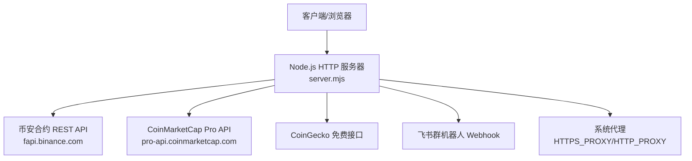
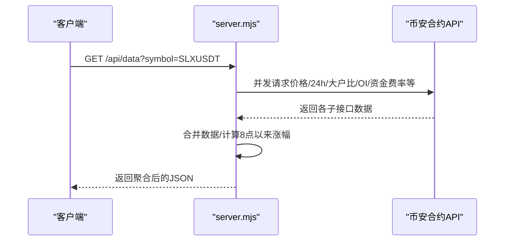

# API接口文档

<cite>
**本文引用的文件**   
- [server.mjs](file://server.mjs)
- [README.md](file://README.md)
- [proxy-setup.mjs](file://proxy-setup.mjs)
- [ecosystem.config.cjs](file://ecosystem.config.cjs)
</cite>

## 目录
1. [简介](#简介)
2. [项目结构](#项目结构)
3. [核心组件](#核心组件)
4. [架构总览](#架构总览)
5. [详细接口说明](#详细接口说明)
6. [依赖与集成分析](#依赖与集成分析)
7. [性能与限流](#性能与限流)
8. [故障排查指南](#故障排查指南)
9. [结论](#结论)
10. [附录：客户端集成与最佳实践](#附录客户端集成与最佳实践)

## 简介
本项目提供基于币安合约 REST API 的聪明钱监控面板，并通过本地 HTTP 服务暴露一组内部 API，用于获取行情、K线、市值、策略信号、推送触发等能力。所有对外 API 均通过同一入口 server.mjs 提供服务，支持跨域响应头，便于浏览器或第三方系统集成。

## 项目结构
- 服务端主入口：server.mjs（HTTP 路由、代理、定时任务、飞书推送）
- 代理与环境：proxy-setup.mjs（HTTPS_PROXY/HTTP_PROXY 自动启用）、ecosystem.config.cjs（PM2 进程配置）
- 文档与示例：README.md（功能概览、环境变量、API 列表）

图表来源
- [server.mjs:1490-2013](file://server.mjs#L1490-L2013)
- [proxy-setup.mjs:1-39](file://proxy-setup.mjs#L1-L39)

章节来源
- [README.md:190-198](file://README.md#L190-L198)
- [server.mjs:1490-2013](file://server.mjs#L1490-L2013)

## 核心组件
- HTTP 路由与处理器：统一在 server.mjs 中实现，按路径与方法分发到具体处理逻辑
- 数据聚合器：handleAPI 聚合价格、24h 行情、大户持仓比、全市场多空比、OI、资金费率等
- 市值过滤与缓存：优先使用 CoinMarketCap Pro，失败回退 CoinGecko；内置 TTL 缓存
- 飞书推送：支持基础卡片与新版卡片 V2，具备频控重试
- 定时调度：稳趋势、暴跌预警、做多+做空联合扫描、暴涨+聪明钱、策略复盘快照等

章节来源
- [server.mjs:508-538](file://server.mjs#L508-L538)
- [server.mjs:831-945](file://server.mjs#L831-L945)
- [server.mjs:599-644](file://server.mjs#L599-L644)
- [server.mjs:802-821](file://server.mjs#L802-L821)

## 架构总览
下图展示了典型的数据获取流程：客户端请求 /api/data → 服务器并行拉取多个币安子接口 → 合并结果并返回。

图表来源
- [server.mjs:1765-1782](file://server.mjs#L1765-L1782)
- [server.mjs:508-538](file://server.mjs#L508-L538)

## 详细接口说明

### 通用约定
- 协议与端口：HTTP，默认端口由 .env 的 PORT 决定（未设置时默认 3388）
- 字符编码：UTF-8
- 内容类型：application/json
- 跨域：响应包含 Access-Control-Allow-Origin: *
- 认证机制：当前无鉴权，建议部署于内网或通过反向代理增加鉴权
- 错误格式：多数接口在异常时返回 { error: "..." }，部分控制接口返回 { ok, message/error }

章节来源
- [server.mjs:1490-2013](file://server.mjs#L1490-L2013)
- [README.md:145-148](file://README.md#L145-L148)

---

### 数据获取接口

#### GET /api/data
- 描述：返回指定交易对的聪明钱全量数据（价格、24h 行情、大户账户比、大户持仓比、全市场多空比、OI、OI历史、主动买卖比、资金费率及历史），并附带“自当日08:00上海时间以来的涨跌幅”
- 查询参数
  - symbol: 交易对，如 SLXUSDT（必填，不传则默认 SLXUSDT）
  - ratioLimit: 大户比数据条数，范围 1~500，默认 72
  - oiLimit: OI 历史条数，范围 1~500，默认 42
  - takerLimit: 主动买卖比条数，范围 1~500，默认 48
- 成功响应字段（节选）
  - price: 最新价格对象
  - ticker24h: 24h 行情对象
  - topAccounts/topPositions/globalRatio: 多头空头比数组
  - oi: 当前未平仓合约数量
  - oiHist: OI 历史数组
  - takerVol: 主动买卖比数组
  - fundingRate/fundingRateHist: 资金费率与历史
  - changeSince8am: 自当日08:00以来的涨跌幅信息（可能为 null）
  - warnings: 若部分子接口失败，会返回警告数组
- 错误码
  - 403: 该币种为股票/TradFi 合约，不在监控范围
  - 403: 该币种市值超过 MAX_MARKET_CAP_USD，不在监控范围
  - 500: 网络/上游 API 异常或数据缺失
- 请求示例
  - GET http://localhost:3388/api/data?symbol=BTCUSDT&ratioLimit=50&oiLimit=30&takerLimit=40
- 响应示例（结构示意）
  - { price, ticker24h, topAccounts, topPositions, globalRatio, oi, oiHist, takerVol, fundingRate, fundingRateHist, changeSince8am, warnings? }

章节来源
- [server.mjs:1765-1782](file://server.mjs#L1765-L1782)
- [server.mjs:484-506](file://server.mjs#L484-L506)
- [server.mjs:508-538](file://server.mjs#L508-L538)

#### GET /api/klines
- 描述：代理获取 K 线数据（来自币安合约）
- 查询参数
  - symbol: 交易对，默认 SLXUSDT
  - interval: 周期，如 1m/5m/15m/1h/4h/d 等
  - limit: 返回条数，默认 100
- 成功响应：币安 klines 原始数组
- 错误码
  - 500: 上游请求失败
- 请求示例
  - GET http://localhost:3388/api/klines?symbol=ETHUSDT&interval=1h&limit=50

章节来源
- [server.mjs:1750-1763](file://server.mjs#L1750-L1763)

#### GET /api/marketcap
- 描述：查询单币种市值（优先 CMC，失败回退 CoinGecko）
- 查询参数
  - symbol: 交易对，默认 BTCUSDT
- 成功响应
  - market_cap: 美元市值（整数），失败时返回 0
- 错误码
  - 200: 即使查询失败也返回 market_cap: 0
- 请求示例
  - GET http://localhost:3388/api/marketcap?symbol=SOLUSDT

章节来源
- [server.mjs:1736-1748](file://server.mjs#L1736-L1748)
- [server.mjs:831-945](file://server.mjs#L831-L945)

---

### 通知推送接口

#### POST /api/feishu-alert
- 描述：发送飞书消息卡片（基础版）
- 请求体
  - title: 标题
  - content: Markdown 内容
- 成功响应：飞书 API 返回的 JSON
- 错误码
  - 500: 飞书发送失败或配置缺失
- 请求示例
  - POST http://localhost:3388/api/feishu-alert
  - Body: { "title": "测试", "content": "**告警** 测试内容" }

章节来源
- [server.mjs:1493-1508](file://server.mjs#L1493-L1508)

---

### 控制接口

#### POST /api/trigger-stable-push
- 描述：手动触发「右侧稳趋势」扫描与推送
- 成功响应
  - ok: true
  - message: "已触发稳趋势推送"
- 错误码
  - 400: FEISHU_WEBHOOK 未配置
  - 409: 推送正在进行中
- 请求示例
  - POST http://localhost:3388/api/trigger-stable-push

章节来源
- [server.mjs:1516-1532](file://server.mjs#L1516-L1532)

#### POST /api/trigger-pump-smart-push
- 描述：手动触发「暴涨+聪明钱加仓」推送
- 成功响应
  - ok: true
  - message: "已触发暴涨+聪明钱推送"
- 错误码
  - 400: FEISHU_WEBHOOK 未配置
  - 409: 推送正在进行中
- 请求示例
  - POST http://localhost:3388/api/trigger-pump-smart-push

章节来源
- [server.mjs:1870-1886](file://server.mjs#L1870-L1886)

#### POST /api/trigger-combined-push
- 描述：手动触发「做多+做空」联合扫描与推送
- 成功响应
  - ok: true
  - message: "已触发做多+暴跌联合推送"
- 错误码
  - 400: FEISHU_WEBHOOK 未配置
  - 409: 联合推送正在进行中
- 请求示例
  - POST http://localhost:3388/api/trigger-combined-push

章节来源
- [server.mjs:1894-1910](file://server.mjs#L1894-L1910)

#### POST /api/trigger-position-health-push
- 描述：手动触发「持仓健康」推送
- 成功响应
  - ok: true
  - message: "已触发持仓健康推送"
- 错误码
  - 400: FEISHU_WEBHOOK 未配置
- 请求示例
  - POST http://localhost:3388/api/trigger-position-health-push

章节来源
- [server.mjs:1918-1929](file://server.mjs#L1918-L1929)

#### POST /api/trigger-strategy-review
- 描述：手动触发「策略复盘」
- 成功响应
  - ok: true
  - message: "已触发策略复盘"
- 请求示例
  - POST http://localhost:3388/api/trigger-strategy-review

章节来源
- [server.mjs:1615-1621](file://server.mjs#L1615-L1621)

#### POST /api/trigger-smart-trend-push
- 描述：手动触发「聪明钱趋势」推送
- 成功响应
  - ok: true
  - message: "已触发聪明钱趋势推送"
- 错误码
  - 400: FEISHU_WEBHOOK 未配置
- 请求示例
  - POST http://localhost:3388/api/trigger-smart-trend-push

章节来源
- [server.mjs:1949-1960](file://server.mjs#L1949-L1960)

---

### 其他常用接口

#### GET /api/config
- 描述：返回当前运行配置（仅展示市值过滤相关）
- 成功响应
  - maxMarketCapUsd: 最大市值阈值（美元）
  - maxMarketCapLabel: 人类可读的最大市值标签
- 请求示例
  - GET http://localhost:3388/api/config

章节来源
- [server.mjs:1629-1636](file://server.mjs#L1629-L1636)

#### GET /api/top-symbols
- 描述：返回 USDT 交易对排行（可按成交量或涨跌幅排序，支持最小涨幅过滤）
- 查询参数
  - limit: 返回条数，上限 500，默认 200
  - sort: volume 或 change，默认 volume
  - minChange: 最小涨跌幅百分比，默认 0
- 成功响应：数组，元素含 symbol/volume/price/change
- 错误码
  - 500: 上游异常
- 请求示例
  - GET http://localhost:3388/api/top-symbols?sort=change&minChange=5&limit=50

章节来源
- [server.mjs:1540-1561](file://server.mjs#L1540-L1561)

#### GET /api/gainers-since-8am
- 描述：返回自当日08:00上海时间以来的涨幅榜
- 查询参数
  - limit: 返回条数，上限 500，默认 200
- 成功响应
  - meta: baselineDate/baselineTime/timezone/baselineLabel/openTime
  - items: 数组，含 symbol/label/price/basePrice/volume/change/change24h
- 错误码
  - 500: 上游异常
- 请求示例
  - GET http://localhost:3388/api/gainers-since-8am?limit=30

章节来源
- [server.mjs:1563-1574](file://server.mjs#L1563-L1574)

#### GET /api/losers-since-8am
- 描述：返回自当日08:00上海时间以来的跌幅榜
- 查询参数
  - limit: 返回条数，上限 500，默认 200
- 成功响应
  - meta: 同上
  - items: 数组，含 symbol/label/price/basePrice/volume/change/change24h
- 错误码
  - 500: 上游异常
- 请求示例
  - GET http://localhost:3388/api/losers-since-8am?limit=30

章节来源
- [server.mjs:1576-1587](file://server.mjs#L1576-L1587)

#### GET /api/smart-signal
- 描述：获取单个交易对的聪明钱信号分析与汇总
- 查询参数
  - symbol: 交易对，默认 BTCUSDT（大写）
  - price: 可选，传入当前价可参与分析
- 成功响应
  - symbol, raw, ...analysis
- 错误码
  - 403: TradFi 或市值过大被拒绝
  - 500: 上游异常
- 请求示例
  - GET http://localhost:3388/api/smart-signal?symbol=ETHUSDT&price=2000

章节来源
- [server.mjs:1784-1801](file://server.mjs#L1784-L1801)

#### GET /api/whale-history
- 描述：获取鲸鱼历史快照（按小时粒度）
- 查询参数
  - symbol: 交易对，默认 BTCUSDT（大写）
  - hours: 回溯时长，默认 72
- 成功响应：鲸鱼历史数据
- 错误码
  - 500: 上游异常
- 请求示例
  - GET http://localhost:3388/api/whale-history?symbol=ETHUSDT&hours=48

章节来源
- [server.mjs:1803-1816](file://server.mjs#L1803-L1816)

#### GET /api/check-risk
- 描述：检查单币暴跌风险评分
- 查询参数
  - symbol: 必须且以 USDT 结尾
- 成功响应：风险评分与标签
- 错误码
  - 400: 缺少或非法 symbol
  - 500: 上游异常
- 请求示例
  - GET http://localhost:3388/api/check-risk?symbol=XYZUSDT

章节来源
- [server.mjs:1818-1834](file://server.mjs#L1818-L1834)

#### GET /api/scan-dump
- 描述：批量扫描暴跌风险候选
- 查询参数
  - limit: 扫描数量，上限 300，默认 200
  - minRisk: 最低风险分，默认 4
- 成功响应：结果数组
- 错误码
  - 500: 上游异常
- 请求示例
  - GET http://localhost:3388/api/scan-dump?limit=100&minRisk=5

章节来源
- [server.mjs:1836-1848](file://server.mjs#L1836-L1848)

#### GET /api/scan-pump-smart
- 描述：扫描“暴涨+聪明钱加仓”候选
- 查询参数
  - limit: 候选数量，上限 50，默认 PUMP_SMART_SCAN_LIMIT
  - minChange: 最小涨幅%，默认 PUMP_SMART_MIN_CHANGE
- 成功响应：结果数组
- 错误码
  - 500: 上游异常
- 请求示例
  - GET http://localhost:3388/api/scan-pump-smart?limit=30&minChange=5

章节来源
- [server.mjs:1850-1868](file://server.mjs#L1850-L1868)

#### GET /api/scan-momentum
- 描述：扫描“8点追涨动量”候选
- 查询参数
  - limit: 候选数量，上限 50，默认 30
  - minScore: 最低评分，默认 3
- 成功响应
  - meta.baselineLabel
  - items: 结果数组
- 错误码
  - 500: 上游异常
- 请求示例
  - GET http://localhost:3388/api/scan-momentum?limit=20&minScore=4

章节来源
- [server.mjs:1968-1986](file://server.mjs#L1968-L1986)

#### GET /api/scan-smart-signal
- 描述：批量扫描聪明钱信号
- 查询参数
  - limit: 扫描数量，上限 200，默认 100
  - direction: long/short/all，默认 long
- 成功响应：结果数组
- 错误码
  - 500: 上游异常
- 请求示例
  - GET http://localhost:3388/api/scan-smart-signal?limit=50&direction=all

章节来源
- [server.mjs:1988-2001](file://server.mjs#L1988-L2001)

#### GET /api/strategy-review
- 描述：获取策略复盘记录
- 查询参数
  - hours: 回溯小时数，默认 48
- 成功响应：复盘记录数组
- 错误码
  - 500: 读取失败
- 请求示例
  - GET http://localhost:3388/api/strategy-review?hours=24

章节来源
- [server.mjs:1589-1600](file://server.mjs#L1589-L1600)

#### GET /api/strategy-predictions
- 描述：获取最近预测快照
- 查询参数
  - hours: 回溯小时数，默认 24
- 成功响应：预测快照数组
- 错误码
  - 500: 读取失败
- 请求示例
  - GET http://localhost:3388/api/strategy-predictions?hours=12

章节来源
- [server.mjs:1602-1613](file://server.mjs#L1602-L1613)

#### GET /api/position-health
- 描述：评估单仓健康度
- 查询参数
  - symbol: 交易对
  - direction: long/short，默认 long
  - entry: 开仓价
  - stopLoss: 止损价
  - takeProfit: 止盈价
- 成功响应：健康度评估结果
- 错误码
  - 400: 参数校验失败
  - 500: 上游异常
- 请求示例
  - GET http://localhost:3388/api/position-health?symbol=ETHUSDT&direction=long&entry=2000&stopLoss=1900&takeProfit=2200

章节来源
- [server.mjs:1638-1660](file://server.mjs#L1638-L1660)

#### POST /api/position-health/batch
- 描述：批量评估持仓健康度
- 请求体
  - positions: 数组，每项含 symbol/direction/entry/stopLoss/takeProfit
- 成功响应：批量评估结果
- 错误码
  - 400: 参数校验失败
  - 500: 上游异常
- 请求示例
  - POST http://localhost:3388/api/position-health/batch
  - Body: { "positions": [{ "symbol":"ETHUSDT","direction":"long","entry":2000,"stopLoss":1900,"takeProfit":2200}] }

章节来源
- [server.mjs:1662-1679](file://server.mjs#L1662-L1679)

#### GET /api/user-positions
- 描述：获取用户自定义持仓列表
- 成功响应：持仓数组
- 错误码
  - 500: 读取失败
- 请求示例
  - GET http://localhost:3388/api/user-positions

章节来源
- [server.mjs:1687-1697](file://server.mjs#L1687-L1697)

#### POST /api/user-positions
- 描述：新增用户自定义持仓
- 请求体：持仓对象
- 成功响应：新增结果
- 错误码
  - 400: 参数校验失败
- 请求示例
  - POST http://localhost:3388/api/user-positions
  - Body: { "symbol":"ETHUSDT","direction":"long","entry":2000,"stopLoss":1900,"takeProfit":2200 }

章节来源
- [server.mjs:1699-1714](file://server.mjs#L1699-L1714)

#### DELETE /api/user-positions
- 描述：删除用户自定义持仓
- 查询参数
  - id: 持仓ID
- 成功响应：删除结果
- 错误码
  - 400: 参数校验失败
- 请求示例
  - DELETE http://localhost:3388/api/user-positions?id=xxx

章节来源
- [server.mjs:1716-1728](file://server.mjs#L1716-L1728)

#### GET /api/smart-trend-watchlist
- 描述：获取聪明钱趋势观察池信息
- 成功响应：观察池信息
- 错误码
  - 500: 读取失败
- 请求示例
  - GET http://localhost:3388/api/smart-trend-watchlist

章节来源
- [server.mjs:1937-1947](file://server.mjs#L1937-L1947)

## 依赖与集成分析

### 代理与网络
- 代理启用：当存在 HTTPS_PROXY/HTTP_PROXY 环境变量时，自动启用 Node fetch 代理，并在启动日志中提示
- Windows 下可通过 curl 走代理进行外部请求
- PM2 启动参数 --use-env-proxy 确保子进程继承代理环境

章节来源
- [proxy-setup.mjs:1-39](file://proxy-setup.mjs#L1-L39)
- [ecosystem.config.cjs:1-32](file://ecosystem.config.cjs#L1-L32)

### 环境变量与配置
- PORT: 监听端口（默认 3388）
- CMC_API_KEY: CoinMarketCap Pro Key（可选，未配置回退 CoinGecko）
- MAX_MARKET_CAP_USD: 市值上限（美元），0 表示关闭过滤
- FEISHU_WEBHOOK: 飞书机器人 Webhook URL（推送必需）
- 其他推送开关与间隔：STABLE_PUSH_HOURS、LONG_PUSH_HOURS、DUMP_PUSH_HOURS、PUMP_SMART_INTERVAL_MIN 等

章节来源
- [README.md:145-153](file://README.md#L145-L153)
- [server.mjs:43-48](file://server.mjs#L43-L48)
- [server.mjs:540-590](file://server.mjs#L540-L590)

### 安全考虑
- 当前无鉴权，建议：
  - 部署于内网或受信任网络
  - 通过反向代理（Nginx/Caddy）增加 IP 白名单、Basic Auth 或 JWT
  - 限制对外暴露端口，避免公网直连
- 敏感配置（FEISHU_WEBHOOK、CMC_API_KEY）应保存在 .env 中，不要提交到版本库

章节来源
- [server.mjs:1490-2013](file://server.mjs#L1490-L2013)
- [README.md:55-77](file://README.md#L55-L77)

## 性能与限流
- 并发与缓存
  - 全量 ticker/24hr 采用短 TTL 缓存与并发去重，降低重复请求
  - 市值数据采用 TTL 缓存，优先 CMC，失败回退 CoinGecko
  - 8点基准价缓存，预热减少首次延迟
- 上游重试
  - 币安代理函数具备指数退避重试
  - 飞书卡片发送具备频控识别与重试
- 限流策略
  - 代码层未实现全局限流，建议在反向代理层实施速率限制
  - 控制类接口在运行中时会返回 409 防止重复触发

章节来源
- [server.mjs:84-105](file://server.mjs#L84-L105)
- [server.mjs:831-945](file://server.mjs#L831-L945)
- [server.mjs:58-76](file://server.mjs#L58-L76)
- [server.mjs:618-644](file://server.mjs#L618-L644)
- [server.mjs:1516-1532](file://server.mjs#L1516-L1532)

## 故障排查指南
- 常见问题
  - 端口占用：使用 dev-restart.mjs 自动释放端口后重启
  - 代理未生效：确认 .env 中 HTTPS_PROXY/HTTP_PROXY 已设置，并以 --use-env-proxy 启动
  - 飞书推送失败：检查 FEISHU_WEBHOOK 是否配置，注意频控错误
  - 市值查询失败：未配置 CMC_API_KEY 时将回退 CoinGecko，可能出现限流或数据不全
- 定位方法
  - 查看服务日志（PM2 logs 或 journalctl）
  - 使用 /api/config 验证配置
  - 使用 /api/check-risk 与 /api/scan-dump 快速验证上游连通性

章节来源
- [dev-restart.mjs:37-78](file://dev-restart.mjs#L37-L78)
- [ecosystem.config.cjs:1-32](file://ecosystem.config.cjs#L1-L32)
- [server.mjs:1629-1636](file://server.mjs#L1629-L1636)
- [server.mjs:1818-1848](file://server.mjs#L1818-L1848)

## 结论
本项目的 API 围绕聪明钱监控与策略推送构建，提供丰富的数据获取与控制触发能力。通过代理与缓存优化了稳定性与性能，结合飞书推送形成闭环。生产部署建议配合反向代理增强安全与限流，并合理配置环境变量以满足不同场景需求。

## 附录：客户端集成与最佳实践
- 基础调用
  - 使用 GET 获取数据，POST 触发控制动作
  - 所有接口均返回 JSON，注意处理 error 字段
- 重试与容错
  - 对 5xx 与网络超时进行指数退避重试
  - 对 409 冲突状态进行等待后再试
- 分页与限制
  - 对排行榜类接口使用 limit 控制返回规模
  - 对批量接口（如 position-health/batch）分批提交，避免单次过大
- 安全与合规
  - 通过反向代理增加鉴权与访问控制
  - 将敏感配置放入 .env，禁止外泄
- 监控与观测
  - 定期调用 /api/strategy-review 与 /api/strategy-predictions 评估策略表现
  - 关注推送频率与频控错误，必要时调整间隔

[本节为通用指导，无需源码引用]