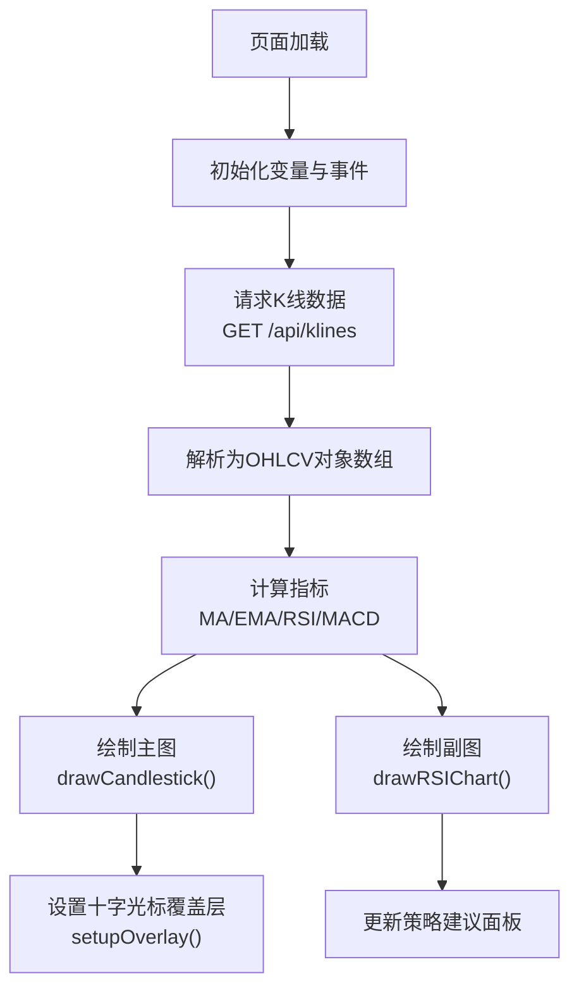
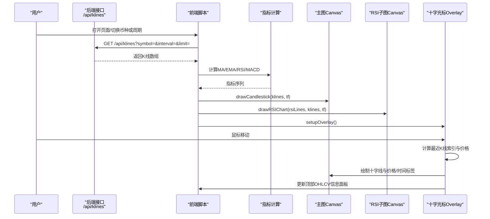
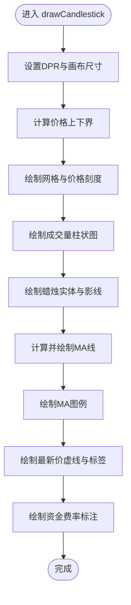
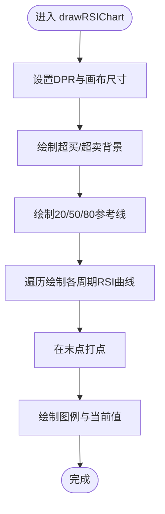
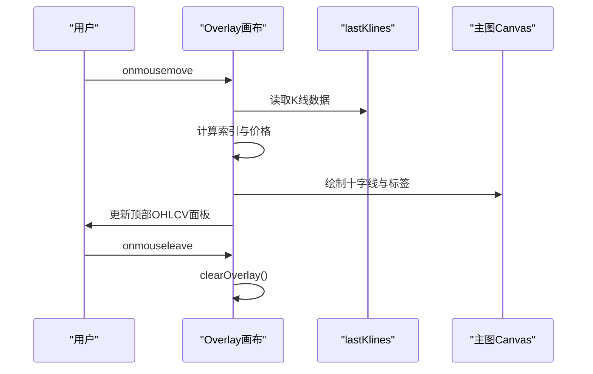
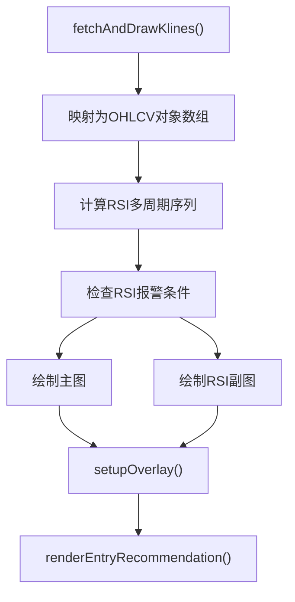
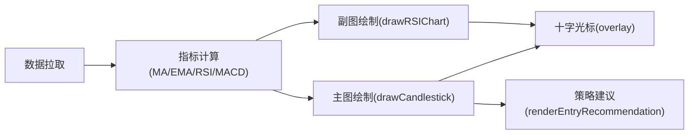

# K线图组件

<cite>
**本文引用的文件**   
- [index.html](file://index.html)
- [README.md](file://README.md)
</cite>

## 目录
1. [简介](#简介)
2. [项目结构](#项目结构)
3. [核心组件](#核心组件)
4. [架构总览](#架构总览)
5. [详细组件分析](#详细组件分析)
6. [依赖关系分析](#依赖关系分析)
7. [性能与大数据量优化](#性能与大数据量优化)
8. [故障排查指南](#故障排查指南)
9. [结论](#结论)
10. [附录：自定义与扩展指南](#附录自定义与扩展指南)

## 简介
本组件基于 HTML5 Canvas 实现 K 线图（蜡烛图）及 RSI 指标子图，提供 OHLC 数据渲染、均线叠加、成交量柱状图、资金费率标注、十字光标交互、价格/时间标注、RSI 超买超卖区高亮等能力。整体采用“数据拉取 → 指标计算 → Canvas 绘制 → 交互覆盖层”的流水线模式，适合在浏览器端进行实时行情展示与分析。

## 项目结构
K 线相关逻辑集中在单页应用入口文件中，包含：
- 数据获取与解析：从服务端接口拉取 K 线数据并转换为前端数据结构
- 指标计算：MA、EMA、RSI、MACD 等
- 图表绘制：主图（蜡烛图 + MA + 成交量 + 资金费率标注）、副图（RSI）
- 交互处理：十字光标、鼠标悬停显示 OHLCV、振幅、涨跌幅等
- 布局与样式：通过 CSS 控制画布尺寸、网格区域、悬浮区域等

图示来源
- [index.html:1809-1836](file://index.html#L1809-L1836)
- [index.html:1559-1727](file://index.html#L1559-L1727)
- [index.html:1729-1807](file://index.html#L1729-L1807)
- [index.html:4063-4170](file://index.html#L4063-L4170)

章节来源
- [index.html:1559-1727](file://index.html#L1559-L1727)
- [index.html:1729-1807](file://index.html#L1729-L1807)
- [index.html:1809-1836](file://index.html#L1809-L1836)
- [index.html:4063-4170](file://index.html#L4063-L4170)
- [README.md:1-210](file://README.md#L1-L210)

## 核心组件
- 数据拉取与转换
  - 通过 GET /api/klines?symbol=...&interval=...&limit=... 拉取原始K线数组，映射为 {openTime, open, high, low, close, volume} 对象数组
  - 将 closes 序列用于后续指标计算
- 指标计算
  - MA：滑动窗口求均值
  - EMA：指数加权移动平均
  - RSI：相对强弱指标，支持多周期（如 6/12/24）
  - MACD：用于入场建议与趋势判断
- 主图绘制（蜡烛图）
  - 自适应 DPR 的高清渲染
  - 自动计算价格轴范围并绘制网格与刻度
  - 绘制成交量柱状图（半透明，按涨跌着色）
  - 绘制蜡烛实体与影线（涨绿跌红）
  - 叠加多条 MA 线（默认 MA5/MA20/MA60）
  - 最新价虚线与右侧标签
  - 资金费率事件标注（正负费率箭头与百分比）
- 副图绘制（RSI）
  - 固定 0~100 坐标轴，绘制超买/超卖背景色带
  - 绘制 20/50/80 参考线
  - 绘制多条 RSI 曲线（不同周期），并在末端打点
  - 左上角显示各周期当前值
- 十字光标与交互
  - 独立 overlay 画布覆盖在主图上
  - 鼠标移动时绘制十字线、价格标签、时间标签
  - 顶部面板动态显示 OHLCV、振幅、涨跌幅
- 策略建议与信号
  - 结合 MA 排列、RSI 区间、MACD 金叉/死叉、支撑阻力位、大户多空比与主动买卖量趋势，生成买入/卖出/观望建议

章节来源
- [index.html:1809-1836](file://index.html#L1809-L1836)
- [index.html:1515-1557](file://index.html#L1515-L1557)
- [index.html:1559-1727](file://index.html#L1559-L1727)
- [index.html:1729-1807](file://index.html#L1729-L1807)
- [index.html:4063-4170](file://index.html#L4063-L4170)
- [index.html:1838-2000](file://index.html#L1838-L2000)

## 架构总览
下图展示了从数据到绘制的端到端流程，以及交互覆盖层的职责边界。

图示来源
- [index.html:1809-1836](file://index.html#L1809-L1836)
- [index.html:1559-1727](file://index.html#L1559-L1727)
- [index.html:1729-1807](file://index.html#L1729-L1807)
- [index.html:4063-4170](file://index.html#L4063-L4170)

## 详细组件分析

### 主图绘制（蜡烛图 + MA + 成交量 + 资金费率标注）
- 坐标与缩放
  - 使用 devicePixelRatio 适配高清屏，避免模糊
  - 根据数据极值动态计算价格轴上下界，增加少量边距
- 网格与刻度
  - 水平网格线均匀分布，右侧显示价格刻度
  - X 轴时间标签按数据长度自适应采样
- 成交量柱状图
  - 先绘制成交量（半透明），再绘制蜡烛，确保蜡烛在上层
  - 按涨跌分别着色（涨绿降红）
- 蜡烛绘制
  - 实体：上涨空心边框，下跌实心填充
  - 影线：连接最高价与最低价
- 均线叠加
  - 支持多周期 MA（默认 5/20/60），绘制折线并在左上角显示当前值
- 最新价线
  - 以虚线绘制最新收盘价，并在右侧显示价格标签
- 资金费率标注
  - 过滤绝对值较小的费率事件，按正负方向绘制三角标记与百分比文本

图示来源
- [index.html:1559-1727](file://index.html#L1559-L1727)

章节来源
- [index.html:1559-1727](file://index.html#L1559-L1727)

### 副图绘制（RSI）
- 坐标与区域
  - Y 轴固定 0~100，绘制超买（>70）与超卖（<30）背景色带
- 参考线
  - 20/50/80 三条参考线，其中 50 使用虚线
- 多周期 RSI
  - 同时绘制 RSI6/12/24 三条线，末端打点便于观察最新值
- 图例
  - 左上角显示各周期当前值

图示来源
- [index.html:1729-1807](file://index.html#L1729-L1807)

章节来源
- [index.html:1729-1807](file://index.html#L1729-L1807)

### 十字光标与交互
- 覆盖层机制
  - 使用独立的 overlay 画布覆盖在主图上方，接收鼠标事件
- 十字线绘制
  - 垂直线对齐最近K线索引，水平线对应鼠标Y坐标换算的价格
- 标签与提示
  - 右侧显示交叉点价格，底部显示时间标签
  - 顶部面板显示 OHLCV、振幅、涨跌幅
- 清理逻辑
  - 鼠标移出区域时清空覆盖层与面板内容

图示来源
- [index.html:4063-4170](file://index.html#L4063-L4170)

章节来源
- [index.html:4063-4170](file://index.html#L4063-L4170)

### 数据拉取与刷新
- 拉取流程
  - 调用 GET /api/klines?symbol=&interval=&limit= 获取数据
  - 将原始数组映射为统一对象结构
- 指标联动
  - 基于 closes 序列计算 RSI 多周期序列
  - 触发 RSI 超买超卖报警检查
- 渲染调度
  - 使用 requestAnimationFrame 批量绘制主图与副图
  - 完成后设置十字光标覆盖层
  - 同步更新策略建议面板

图示来源
- [index.html:1809-1836](file://index.html#L1809-L1836)
- [index.html:1838-2000](file://index.html#L1838-L2000)

章节来源
- [index.html:1809-1836](file://index.html#L1809-L1836)
- [index.html:1838-2000](file://index.html#L1838-L2000)

### 技术指标叠加显示（MA、RSI、MACD）
- MA
  - 多周期（默认 5/20/60）滑动平均，绘制折线并显示当前值
- RSI
  - 多周期（6/12/24）并行绘制，超买超卖区高亮
- MACD
  - 用于趋势判断与入场建议（金叉/死叉、收敛/发散）

章节来源
- [index.html:1541-1557](file://index.html#L1541-L1557)
- [index.html:1515-1532](file://index.html#L1515-L1532)
- [index.html:1838-2000](file://index.html#L1838-L2000)

### 图表区域管理与布局
- 主图与副图各自维护独立 padding 与绘图区域
- 时间轴标签根据数据长度自适应采样，避免拥挤
- 右侧价格轴与顶部图例互不遮挡

章节来源
- [index.html:1559-1727](file://index.html#L1559-L1727)
- [index.html:1729-1807](file://index.html#L1729-L1807)

### 鼠标事件处理与触摸设备适配
- 鼠标事件
  - onmousemove 计算最近K线索引与价格，绘制十字线与标签
  - onmouseleave 清理覆盖层
- 触摸设备
  - 当前未显式绑定 touchstart/touchmove/touchend 事件；如需适配，可在 overlay 容器上补充触摸事件，将触摸坐标映射为屏幕坐标后复用现有逻辑

章节来源
- [index.html:4063-4170](file://index.html#L4063-L4170)

### K线颜色配置与网格线设置
- 颜色
  - 上涨：绿色系；下跌：红色系
  - 成交量半透明同色系
  - 网格线深色细线
- 网格
  - 主图水平网格均匀分布，副图 20/50/80 参考线
- 可扩展性
  - 可通过修改绘制函数中的颜色常量与线型参数实现主题定制

章节来源
- [index.html:1559-1727](file://index.html#L1559-L1727)
- [index.html:1729-1807](file://index.html#L1729-L1807)

### 成交量柱状图绘制
- 高度按最大成交量归一化，位于主图底部区域
- 先绘制成交量，再绘制蜡烛，保证层级正确

章节来源
- [index.html:1559-1727](file://index.html#L1559-L1727)

### 实时数据更新机制
- 当前实现为一次性拉取并绘制；如需实时更新，可引入定时器或 WebSocket 推送，增量更新 lastKlines 并重新绘制
- 注意节流与防抖，避免频繁重绘导致卡顿

章节来源
- [index.html:1809-1836](file://index.html#L1809-L1836)

## 依赖关系分析
- 外部依赖
  - 无第三方库，纯原生 HTML5 Canvas 与 fetch API
- 内部依赖
  - 数据拉取模块依赖后端 /api/klines 接口
  - 指标计算模块依赖 closes 序列
  - 绘制模块依赖指标结果与 K 线数据
  - 交互模块依赖 lastKlines 与主图坐标系统

图示来源
- [index.html:1809-1836](file://index.html#L1809-L1836)
- [index.html:1559-1727](file://index.html#L1559-L1727)
- [index.html:1729-1807](file://index.html#L1729-L1807)
- [index.html:1838-2000](file://index.html#L1838-L2000)

章节来源
- [index.html:1809-1836](file://index.html#L1809-L1836)
- [index.html:1559-1727](file://index.html#L1559-L1727)
- [index.html:1729-1807](file://index.html#L1729-L1807)
- [index.html:1838-2000](file://index.html#L1838-L2000)

## 性能与大数据量优化
- 渲染优化
  - 使用 devicePixelRatio 提升清晰度，但需权衡高分屏下的绘制开销
  - 仅对可见区域绘制（当前已按 limit 限制数据量）
- 计算优化
  - MA/EMA/RSI 均为线性复杂度，适合百级数据；若扩展到千级，可考虑增量计算或缓存中间结果
- 交互优化
  - 十字光标仅在必要区域重绘，避免全图重绘
- 内存管理
  - 避免重复创建大对象；复用路径与上下文状态
- 大数据量策略
  - 分页加载与虚拟滚动（仅绘制可视窗口内的K线）
  - 使用离屏 Canvas 缓存静态图层（网格、背景）
  - 合并多次绘制为一次 requestAnimationFrame 批处理

[本节为通用指导，无需源码引用]

## 故障排查指南
- 接口错误
  - 当 /api/klines 返回 error 字段时，跳过绘制并记录日志
- 空数据
  - 若无 lastKlines 或长度为 0，十字光标逻辑直接返回
- 坐标越界
  - 鼠标位置超出绘图区域时，清理覆盖层
- 精度问题
  - 小数位数根据价格区间动态调整，避免过长字符串影响布局

章节来源
- [index.html:1809-1836](file://index.html#L1809-L1836)
- [index.html:4063-4170](file://index.html#L4063-L4170)

## 结论
该 K 线图组件以轻量、零依赖的方式实现了完整的蜡烛图与 RSI 副图，具备基础的交互与指标叠加能力。通过合理的坐标映射、分层绘制与覆盖层机制，提供了良好的用户体验。针对大数据量与实时场景，可在数据拉取、指标计算与渲染层面进一步做增量与虚拟化优化。

[本节为总结，无需源码引用]

## 附录：自定义与扩展指南
- 自定义样式
  - 修改绘制函数中的颜色常量与线宽，实现主题切换
  - 调整 padding 与字体大小，适配不同屏幕密度
- 新增指标
  - 在指标计算段添加新算法（如布林带、KDJ），并在主图或副图中绘制
  - 在图例区域追加当前值显示
- 增强交互
  - 为 overlay 补充触摸事件，实现移动端十字光标
  - 增加拖拽平移与滚轮缩放，实现时间轴缩放
- 实时数据
  - 接入 WebSocket 推送，增量更新 lastKlines 并触发局部重绘
- 策略扩展
  - 在策略建议中增加更多因子（如波动率、订单簿深度），提高信号质量

[本节为概念性指导，无需源码引用]