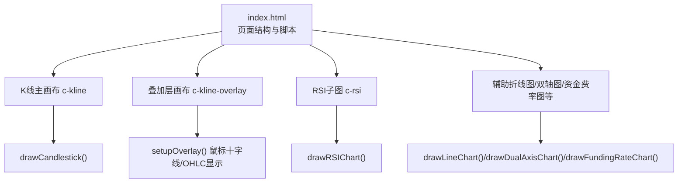
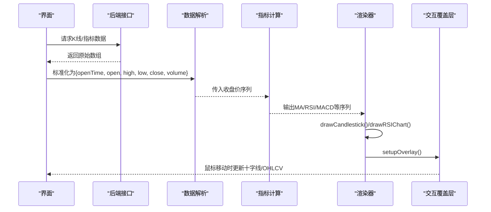
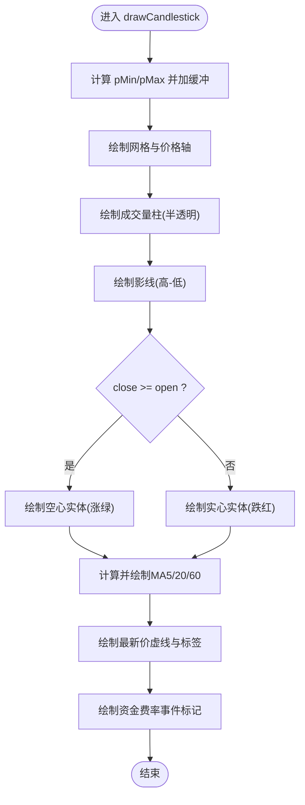
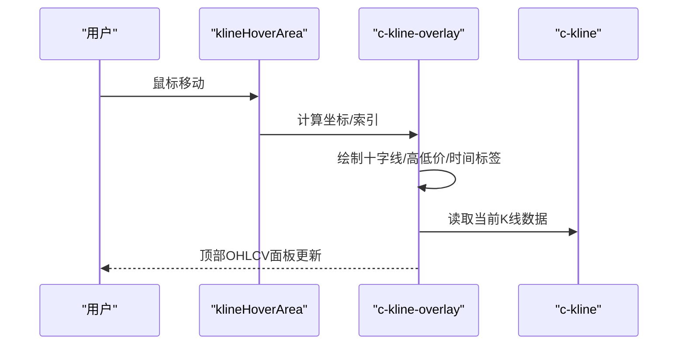
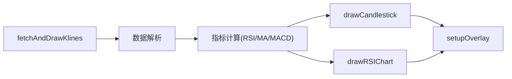

# K线渲染引擎

<cite>
**本文引用的文件**
- [index.html](file://index.html)
</cite>

## 目录
1. [简介](#简介)
2. [项目结构](#项目结构)
3. [核心组件](#核心组件)
4. [架构总览](#架构总览)
5. [详细组件分析](#详细组件分析)
6. [依赖关系分析](#依赖关系分析)
7. [性能与优化](#性能与优化)
8. [故障排查指南](#故障排查指南)
9. [结论](#结论)
10. [附录：扩展与自定义](#附录扩展与自定义)

## 简介
本文件面向“K线渲染引擎”的实现，聚焦于Canvas绘制的核心原理与工程化细节。内容覆盖OHLC数据解析、K线柱状图绘制算法、颜色配置系统（涨绿跌红）、网格线与坐标轴计算、时间轴处理机制、价格范围自动适配、缩放与平移能力、K线间距与最小可见根数控制、高性能渲染策略、Canvas上下文管理、离屏渲染与内存优化方案，并提供自定义样式与扩展渲染效果的开发指南。

## 项目结构
该仓库为单页应用形态，所有前端逻辑集中在一个HTML文件中，包含CSS样式与JavaScript实现。K线渲染相关代码位于页面脚本中，通过多个函数完成数据获取、指标计算、图表绘制与交互。

图示来源
- [index.html:543-553](file://index.html#L543-L553)
- [index.html:1558-1727](file://index.html#L1558-L1727)
- [index.html:1729-1807](file://index.html#L1729-L1807)
- [index.html:1089-1168](file://index.html#L1089-L1168)
- [index.html:1193-1324](file://index.html#L1193-L1324)
- [index.html:1326-1416](file://index.html#L1326-L1416)
- [index.html:4063-4170](file://index.html#L4063-L4170)

章节来源
- [index.html:543-553](file://index.html#L543-L553)

## 核心组件
- OHLC数据解析与标准化：将后端返回的K线数组转换为统一对象结构，便于后续绘图与指标计算。
- K线主图绘制：包括网格、价格轴、成交量柱、K线实体与影线、均线、最新价标注、资金费率事件标记等。
- RSI子图绘制：多周期RSI曲线、超买超卖区域、参考线与标签。
- 交互覆盖层：十字准线、当前K线高低价标注、底部时间标签、顶部OHLCV与振幅、涨跌幅信息。
- 通用折线/双轴/资金费率图表：复用统一的DPR适配、边距、网格、坐标轴与悬浮提示逻辑。

章节来源
- [index.html:1809-1836](file://index.html#L1809-L1836)
- [index.html:1558-1727](file://index.html#L1558-L1727)
- [index.html:1729-1807](file://index.html#L1729-L1807)
- [index.html:4063-4170](file://index.html#L4063-L4170)
- [index.html:1089-1168](file://index.html#L1089-L1168)
- [index.html:1193-1324](file://index.html#L1193-L1324)
- [index.html:1326-1416](file://index.html#L1326-L1416)

## 架构总览
整体流程：定时拉取数据 → 解析K线 → 计算指标 → 调用各绘制函数 → 设置交互覆盖层 → 更新UI状态。

图示来源
- [index.html:1809-1836](file://index.html#L1809-L1836)
- [index.html:1558-1727](file://index.html#L1558-L1727)
- [index.html:1729-1807](file://index.html#L1729-L1807)
- [index.html:4063-4170](file://index.html#L4063-L4170)

## 详细组件分析

### OHLC数据解析与时间轴
- 数据源：从接口获取K线数组，字段顺序对应[时间戳, 开盘, 最高, 最低, 收盘, 成交量]。
- 标准化：映射为对象集合，保留openTime/open/high/low/close/volume，供绘图与指标使用。
- 时间轴标签：根据时间周期动态格式化，如分钟级显示“HH:mm”，小时/天显示“MM-DD HH:00”或“MM-DD”。

章节来源
- [index.html:1809-1836](file://index.html#L1809-L1836)
- [index.html:1534-1539](file://index.html#L1534-L1539)

### K线柱状图绘制算法
- 布局与边距：定义上下左右边距，计算绘图区宽高；右侧预留价格轴空间。
- 价格范围自适应：基于当前可见K线的high/low计算pMin/pMax，并增加少量缓冲避免贴边。
- 坐标映射：提供priceToY用于将价格映射到像素坐标。
- 网格与坐标轴：按固定分段绘制水平网格线，并在右侧标注价格刻度，小数位数随价格区间自适应。
- 成交量柱：在底部固定高度内绘制半透明量柱，颜色跟随K线涨跌。
- K线实体与影线：
  - 上涨：空心矩形+同色影线
  - 下跌：实心矩形+同色影线
- 均线叠加：计算MA5/MA20/MA60并绘制折线，同时展示最近值与图例。
- 最新价标注：以虚线横穿图表，并在右侧显示当前价标签。
- 资金费率事件：在K线范围内匹配fundingTime，绘制三角标记与百分比文本。

图示来源
- [index.html:1558-1727](file://index.html#L1558-L1727)

章节来源
- [index.html:1558-1727](file://index.html#L1558-L1727)

### 颜色配置系统（涨绿跌红）
- 上涨色：绿色系
- 下跌色：红色系
- 成交量半透明：分别采用相同色系但降低不透明度
- 最新价标签背景与文字对比度：深色背景+浅色文字
- 资金费率事件：正费率为红色三角，负费率为绿色三角

章节来源
- [index.html:1558-1727](file://index.html#L1558-L1727)

### 网格线生成与坐标轴计算
- 网格：固定分段（如4或5段），均匀分布，颜色较浅，不影响主体视觉。
- 坐标轴：右侧价格轴，刻度数值按价格区间决定小数位；时间轴按周期选择合适粒度。
- 参考线：如1.0基准线（比值类图表）、零线（资金费率图）。

章节来源
- [index.html:1089-1168](file://index.html#L1089-L1168)
- [index.html:1193-1324](file://index.html#L1193-L1324)
- [index.html:1326-1416](file://index.html#L1326-L1416)
- [index.html:1558-1727](file://index.html#L1558-L1727)

### RSI子图绘制
- 多周期RSI：支持RSI6/12/24三条线，分别着色，末尾点绘制圆点。
- 超买超卖区域：用半透明色块填充30-100与0-30区间。
- 参考线：20/50/80，其中50为虚线。
- 图例：显示每条RSI的最新值。

章节来源
- [index.html:1729-1807](file://index.html#L1729-L1807)

### 交互覆盖层（十字线/OHLCV）
- 覆盖层画布：独立canvas叠加在主图之上，接收鼠标事件。
- 十字线：垂直与水平虚线，定位到最近K线中心与当前鼠标价格位置。
- 高低价标注：在当前K线处显示高/低价格。
- 时间标签：底部显示当前K线的时间标签。
- OHLCV面板：顶部显示时间、开高低收、振幅、涨跌幅、成交量。

图示来源
- [index.html:4063-4170](file://index.html#L4063-L4170)

章节来源
- [index.html:4063-4170](file://index.html#L4063-L4170)

### 时间轴处理机制
- 时间格式化：根据时间周期选择不同格式，确保密集数据下可读性。
- 标签密度：按图表宽度估算步长，避免重叠。

章节来源
- [index.html:1534-1539](file://index.html#L1534-L1539)
- [index.html:1558-1727](file://index.html#L1558-L1727)

### 价格范围自动适配
- 主图：基于可见K线的高低价计算范围，并添加小比例缓冲，防止贴边。
- 副图：对折线/双轴/资金费率等图表，分别计算各自数据的最小最大值并做适当外扩。

章节来源
- [index.html:1558-1727](file://index.html#L1558-L1727)
- [index.html:1089-1168](file://index.html#L1089-L1168)
- [index.html:1193-1324](file://index.html#L1193-L1324)
- [index.html:1326-1416](file://index.html#L1326-L1416)

### 缩放与平移功能实现
- 当前实现未内置缩放与平移交互。如需扩展，可基于现有坐标映射与数据切片进行增量开发：
  - 缩放：调整可见K线数量与gap/candleWidth，重算坐标映射。
  - 平移：维护起始索引与偏移量，结合鼠标拖拽事件更新视图窗口。
- 建议保持DPR适配与边距一致，避免重绘抖动。

章节来源
- [index.html:1558-1727](file://index.html#L1558-L1727)

### K线间距计算与最小可见K线数量控制
- 间距：gap = 绘图区宽度 / K线数量；candleWidth = gap * 0.65，保证实体与留白比例。
- 最小可见根数：可通过限制limit参数或前端裁剪visibleStart/visibleEnd实现，减少绘制开销。

章节来源
- [index.html:1558-1727](file://index.html#L1558-L1727)

### 指标计算（MACD/RSI/MA）
- MACD：EMA12/EMA26差值为DIF，DIF的EMA9为DEA，柱体为(DIF-DEA)*2。
- RSI：标准Wilder平滑法，支持多周期。
- MA：简单移动平均，用于趋势判断与叠加显示。

章节来源
- [index.html:3309-3323](file://index.html#L3309-L3323)
- [index.html:1515-1532](file://index.html#L1515-L1532)
- [index.html:1541-1557](file://index.html#L1541-L1557)

## 依赖关系分析
- 数据流：fetchAndDrawKlines → 解析K线 → 计算RSI/MA/MACD → drawCandlestick/drawRSIChart → setupOverlay。
- 模块耦合：
  - 绘制函数之间相对独立，共享通用工具（DPR适配、边距、网格、hover提示）。
  - 指标计算与绘制解耦，便于替换或扩展新指标。
- 外部依赖：无第三方库，纯原生Canvas与DOM操作。

图示来源
- [index.html:1809-1836](file://index.html#L1809-L1836)
- [index.html:1558-1727](file://index.html#L1558-L1727)
- [index.html:1729-1807](file://index.html#L1729-L1807)
- [index.html:4063-4170](file://index.html#L4063-L4170)

章节来源
- [index.html:1809-1836](file://index.html#L1809-L1836)

## 性能与优化
- DPR适配：每次绘制前根据devicePixelRatio设置canvas尺寸并scale上下文，提升清晰度。
- 离屏渲染：使用独立的overlay画布承载高频交互元素（十字线、标签），避免重绘主图。
- 批量绘制：先绘制成交量，再绘制K线实体与影线，减少覆盖与重绘次数。
- 标签稀疏化：时间轴与网格标签按密度步进绘制，避免拥挤。
- 内存优化：
  - 仅保留必要数据（如lastKlines），避免重复创建大对象。
  - 按需计算指标，避免全量重算。
- 动画帧调度：使用requestAnimationFrame协调绘制，避免阻塞UI。

章节来源
- [index.html:1089-1168](file://index.html#L1089-L1168)
- [index.html:1193-1324](file://index.html#L1193-L1324)
- [index.html:1326-1416](file://index.html#L1326-L1416)
- [index.html:1558-1727](file://index.html#L1558-L1727)
- [index.html:1809-1836](file://index.html#L1809-L1836)
- [index.html:4063-4170](file://index.html#L4063-L4170)

## 故障排查指南
- 数据为空或错误：检查接口返回与error分支处理，确认symbol与interval参数正确。
- 图表不刷新：确认requestAnimationFrame调用与lastKlines更新逻辑。
- 交互异常：检查overlay尺寸与坐标转换是否正确，确保onmousemove/onmouseleave绑定。
- 指标缺失：确认输入长度是否满足指标计算要求（如RSI需要period+1条数据）。

章节来源
- [index.html:1809-1836](file://index.html#L1809-L1836)
- [index.html:4063-4170](file://index.html#L4063-L4170)

## 结论
该K线渲染引擎以原生Canvas为核心，实现了完整的OHLC可视化、指标叠加与交互体验。其设计强调清晰的数据流、解耦的绘制模块与高效的渲染策略，具备良好的可扩展性与可维护性。未来可在缩放/平移、更多指标与主题定制方面进一步增强。

## 附录：扩展与自定义
- 自定义样式：
  - 修改颜色变量（涨绿跌红、网格线、背景、字体）即可切换主题。
  - 调整边距、线宽、字体大小以适配不同屏幕与分辨率。
- 新增指标：
  - 在指标计算模块添加新函数（如布林带、ATR），并在绘制函数中叠加显示。
- 扩展交互：
  - 在overlay中添加右键菜单、快捷键缩放、拖拽平移等功能。
- 性能调优：
  - 引入虚拟滚动或分片渲染，针对大数据集优化首屏与滚动性能。
  - 缓存已计算的指标结果，避免重复计算。

章节来源
- [index.html:1558-1727](file://index.html#L1558-L1727)
- [index.html:1729-1807](file://index.html#L1729-L1807)
- [index.html:4063-4170](file://index.html#L4063-L4170)