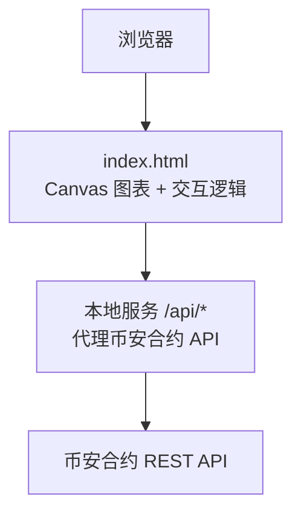
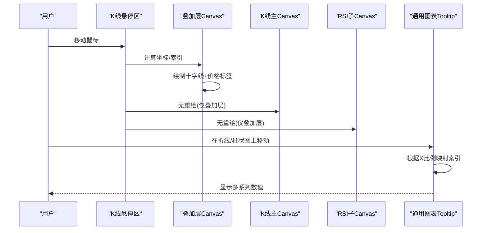
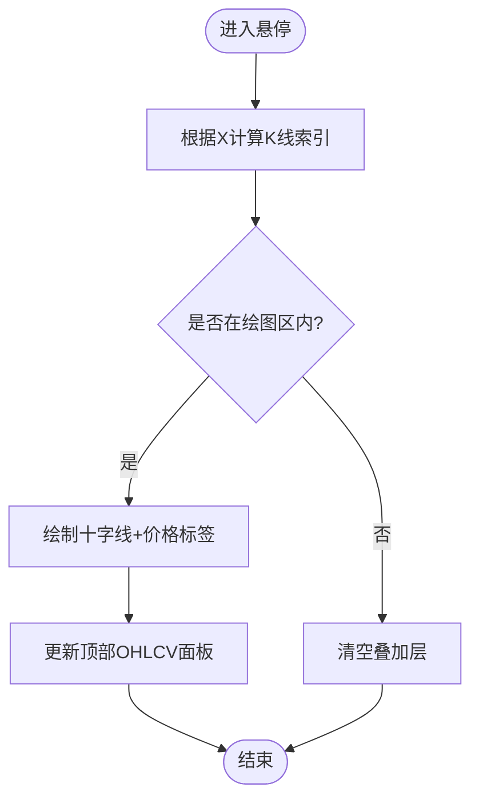
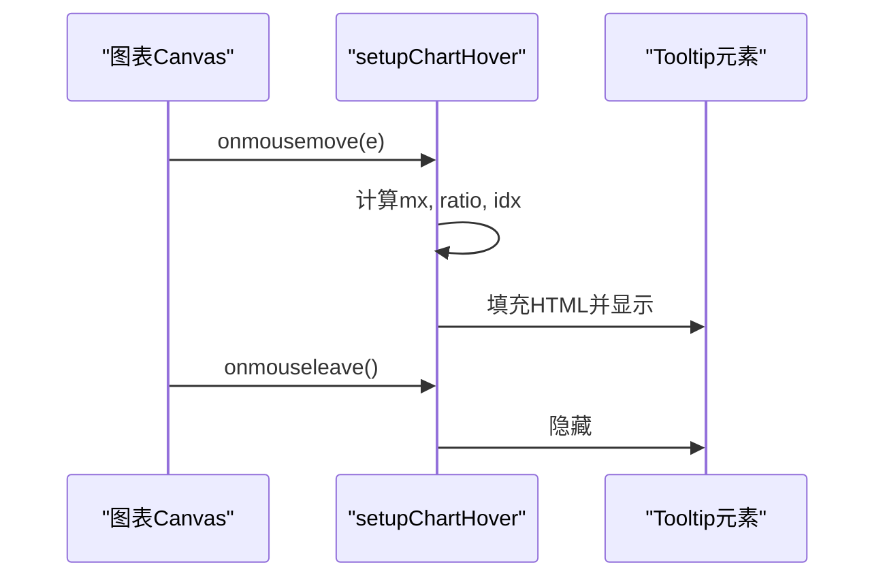
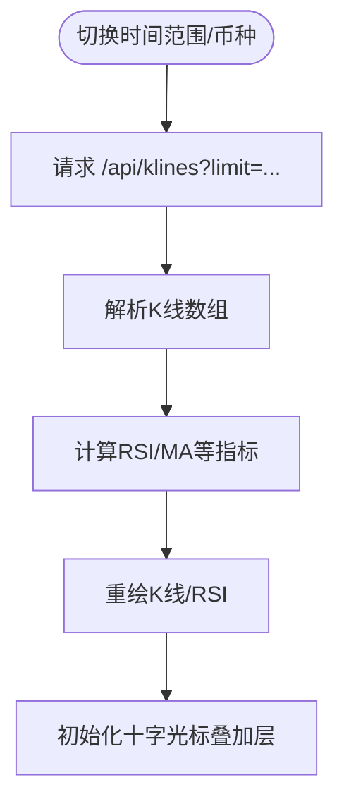
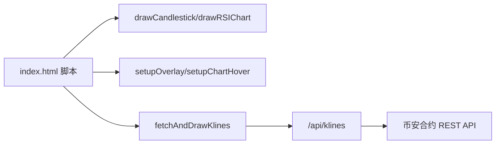

# 图表交互系统

<cite>
**本文引用的文件**
- [index.html](file://index.html)
- [README.md](file://README.md)
- [package.json](file://package.json)
</cite>

## 目录
1. [简介](#简介)
2. [项目结构](#项目结构)
3. [核心组件](#核心组件)
4. [架构总览](#架构总览)
5. [详细组件分析](#详细组件分析)
6. [依赖关系分析](#依赖关系分析)
7. [性能考量](#性能考量)
8. [故障排查指南](#故障排查指南)
9. [结论](#结论)
10. [附录：API与扩展指南](#附录api与扩展指南)

## 简介
本文件聚焦于“图表交互系统”的实现与使用，覆盖鼠标事件处理（十字光标跟随、悬停提示框、点击选择）、触摸设备适配与手势支持（缩放/平移）、移动端优化策略；时间轴缩放算法、视图范围控制、历史数据加载机制；键盘快捷键、焦点管理与无障碍访问；并提供交互事件的API接口、自定义事件处理与扩展开发指南。

该项目基于纯前端 Canvas 自绘 K 线图与指标图，通过服务端代理币安合约 API 获取数据，整体为单页应用，所有交互逻辑集中在页面脚本中。

## 项目结构
- 前端入口与交互主逻辑位于 index.html，包含样式、DOM 结构与全部 JavaScript 实现。
- README.md 提供功能概览、启动方式与 API 说明。
- package.json 定义 Node.js 运行环境与脚本命令。

图示来源
- [index.html:1559-1836](file://index.html#L1559-L1836)
- [README.md:190-199](file://README.md#L190-L199)

章节来源
- [README.md:1-210](file://README.md#L1-L210)
- [package.json:1-22](file://package.json#L1-L22)

## 核心组件
- 十字光标与悬停信息：K 线区域叠加层绘制十字线与价格标签，顶部 OHLCV 面板显示当前 K 线详情。
- 通用图表悬停提示：折线/柱状/双轴图统一通过悬浮计算索引并展示多系列数值。
- 时间范围与历史数据：通过 URL 参数与服务端分页 limit 控制可见区间与数据量。
- 报警与通知：基于阈值触发声音、浏览器通知与飞书推送。
- 策略与回测：内置策略条件评分与回测收益曲线绘制。

章节来源
- [index.html:4063-4170](file://index.html#L4063-L4170)
- [index.html:1170-1191](file://index.html#L1170-L1191)
- [index.html:1809-1836](file://index.html#L1809-L1836)
- [index.html:822-938](file://index.html#L822-L938)
- [index.html:4331-4523](file://index.html#L4331-L4523)

## 架构总览
下图展示了从用户交互到数据渲染的端到端流程，包括 K 线数据拉取、指标计算、Canvas 绘制与十字光标叠加层更新。

图示来源
- [index.html:4063-4170](file://index.html#L4063-L4170)
- [index.html:1170-1191](file://index.html#L1170-L1191)

## 详细组件分析

### 十字光标与悬停信息
- 实现要点
  - 使用独立 overlay canvas 覆盖在主 K 线之上，避免重绘底层图形。
  - 根据鼠标位置计算 X 方向索引，映射到最近一根 K 线；Y 方向反算对应价格并在右侧显示。
  - 顶部 OHLCV 面板实时显示时间、开高低收、振幅、涨跌幅与成交量。
- 交互细节
  - onmousemove/onmouseleave 控制十字线与标签显隐。
  - 当鼠标移出绘图区时清空叠加层。
- 性能考虑
  - 仅在 overlay 上绘制，不触发主图重绘。
  - 使用 devicePixelRatio 适配高分屏，保证线条清晰。

图示来源
- [index.html:4063-4170](file://index.html#L4063-L4170)

章节来源
- [index.html:4063-4170](file://index.html#L4063-L4170)

### 通用图表悬停提示框
- 适用图表：折线图、柱状图、双轴图等。
- 行为：根据鼠标 X 坐标相对绘图宽度比例，映射到数据索引，动态生成 HTML 内容并定位到鼠标附近。
- 关键点：统一封装 setupChartHover，传入 labels、datasets、pad、cw、ch、min、max 等参数。

图示来源
- [index.html:1170-1191](file://index.html#L1170-L1191)

章节来源
- [index.html:1170-1191](file://index.html#L1170-L1191)

### 时间轴缩放算法与视图范围控制
- 数据范围控制
  - 通过 URL 参数 interval 控制刷新间隔，symbol 控制标的。
  - K 线数据通过 /api/klines?limit=100 获取固定窗口，用于当前视图。
- 时间范围快捷按钮
  - 提供 12H/1D/3D/7D 等预设范围，内部维护 limits 配置以限制不同指标的数据长度。
- 历史数据加载
  - 切换时间周期或币种时重新请求 K 线数据，随后重绘 K 线与 RSI。
- 注意
  - 当前未实现鼠标滚轮缩放与拖拽平移，主要依赖固定窗口与时间范围按钮进行视图切换。

图示来源
- [index.html:1809-1836](file://index.html#L1809-L1836)
- [index.html:757-763](file://index.html#L757-L763)

章节来源
- [index.html:1809-1836](file://index.html#L1809-L1836)
- [index.html:757-763](file://index.html#L757-L763)

### 触摸设备适配与手势操作
- 现状
  - 代码中未发现 touchstart/touchmove/touchend 监听器，也未实现 pinch-to-zoom 或 pan 手势。
  - 存在 CSS 媒体查询适配小屏布局，提升可读性与触控区域大小。
- 建议方案
  - 为 K 线悬停区添加 touch 事件，将 touch 坐标映射为 mouse 坐标，复用现有 onmousemove 逻辑。
  - 对通用图表 Tooltip 增加 touch 支持，确保在移动端可长按查看数据点。
  - 如需缩放/平移，可在 overlay 层记录初始指针位置与缩放因子，结合 transform 或重绘逻辑实现。

章节来源
- [index.html:98-121](file://index.html#L98-L121)

### 移动端优化策略
- 响应式布局
  - 使用 @media 断点调整字体、间距、网格列数与控件尺寸，提升移动端可用性。
- 触控友好
  - 增大按钮与选项区域，减少误触。
  - 关键信息（如 OHLCV）置于顶部，便于单手浏览。
- 性能
  - 使用 requestAnimationFrame 批量重绘，降低卡顿。
  - 按需绘制与缓存指标结果，避免重复计算。

章节来源
- [index.html:98-121](file://index.html#L98-L121)
- [index.html:1827-1832](file://index.html#L1827-L1832)

### 键盘快捷键、焦点管理与无障碍访问
- 现状
  - 未发现全局键盘快捷键监听。
  - 搜索输入框具备 focus/blur 行为，但缺少 aria-* 属性与键盘导航。
- 建议方案
  - 为图表容器添加 tabindex="0"，监听 keydown 实现快捷键（例如左右箭头平移视图、+/- 缩放）。
  - 为按钮与输入框补充 aria-label、role 与键盘可达性。
  - 为 Tooltip 增加 aria-live 区域，辅助屏幕阅读器播报数据。

章节来源
- [index.html:485-508](file://index.html#L485-L508)

### 点击选择功能
- 现状
  - 未发现针对 K 线或指标图的点击选择逻辑。
- 建议方案
  - 在 overlay 层捕获 click 事件，记录选中 K 线索引，高亮该时间点并弹出详情卡片。
  - 支持双击重置选择，ESC 键取消选择。

章节来源
- [index.html:4063-4170](file://index.html#L4063-L4170)

## 依赖关系分析
- 外部依赖
  - 浏览器原生能力：Canvas 2D、Fetch、AudioContext、Notification。
  - 后端服务：/api/* 路由代理币安合约 API，避免跨域。
- 内部模块耦合
  - 图表绘制函数与悬停逻辑强耦合于 DOM 节点 ID（如 c-kline、c-rsi、klineHoverArea）。
  - 状态变量集中在全局作用域（lastKlines、currentTF、symbol 等），便于各函数共享。

图示来源
- [index.html:1559-1836](file://index.html#L1559-L1836)
- [index.html:1809-1836](file://index.html#L1809-L1836)
- [README.md:190-199](file://README.md#L190-L199)

章节来源
- [index.html:1559-1836](file://index.html#L1559-L1836)
- [index.html:1809-1836](file://index.html#L1809-L1836)
- [README.md:190-199](file://README.md#L190-L199)

## 性能考量
- 渲染优化
  - 使用 devicePixelRatio 缩放画布，提高清晰度同时保持绘制效率。
  - 仅对 overlay 层进行高频重绘，主图与指标图按需重绘。
- 计算优化
  - 指标计算（RSI/MA/EMA/MACD）采用线性扫描，避免重复计算。
  - 回测与参数优化采用缓存与采样策略，减少全量遍历开销。
- 网络优化
  - 固定 limit 控制单次数据量，避免大体积传输。
  - 使用本地存储保存用户策略与筛选设置，减少重复请求。

[本节为通用指导，无需源码引用]

## 故障排查指南
- 常见问题
  - 端口占用：启动时报 EADDRINUSE，需先清理旧进程或使用 dev:restart。
  - 市值过滤：默认只监控市值 ≤ $50 亿币种，可通过 .env 调整上限。
  - 飞书推送：需配置 FEISHU_WEBHOOK，否则无法发送。
- 诊断步骤
  - 检查浏览器控制台错误日志。
  - 确认 /api/klines 返回数据格式正确。
  - 验证 Canvas 宽高与 DPR 设置是否匹配。

章节来源
- [README.md:40-53](file://README.md#L40-L53)
- [README.md:79-94](file://README.md#L79-L94)
- [README.md:55-63](file://README.md#L55-L63)

## 结论
该图表交互系统以轻量级 Canvas 自绘为核心，实现了十字光标、悬停提示、时间范围切换与报警通知等常用功能。当前版本尚未实现触摸手势与键盘快捷键，建议在 overlay 层与通用 Tooltip 基础上扩展 touch 与 keyboard 事件，完善移动端体验与无障碍访问。

[本节为总结，无需源码引用]

## 附录：API与扩展指南

### 交互事件 API 参考
- 十字光标
  - 事件源：klineHoverArea
  - 事件类型：onmousemove/onmouseleave
  - 输出：overlay 十字线、右侧价格标签、顶部 OHLCV 面板
- 通用图表悬停
  - 事件源：各类图表 Canvas
  - 事件类型：onmousemove/onmouseleave
  - 输出：Tooltip 多系列数值
- 时间范围切换
  - 事件源：时间范围按钮组
  - 事件类型：onclick
  - 输出：调用 fetchAndDrawKlines 重绘

章节来源
- [index.html:4063-4170](file://index.html#L4063-L4170)
- [index.html:1170-1191](file://index.html#L1170-L1191)
- [index.html:1809-1836](file://index.html#L1809-L1836)

### 自定义事件处理与扩展开发
- 扩展十字光标
  - 在 setupOverlay 中追加点击逻辑，记录选中索引并高亮。
  - 增加 ESC 键取消选择与左右箭头平移视图。
- 扩展触摸手势
  - 为 klineHoverArea 绑定 touchstart/touchmove/touchend，将 touch 坐标转换为 mouse 坐标后复用现有逻辑。
  - 实现 pinch-to-zoom：记录两指距离变化，按比例缩放 view window 并重绘。
- 扩展键盘快捷键
  - 为文档根节点监听 keydown，实现 +/- 缩放、←→ 平移、Enter 确认选择。
- 扩展 Tooltip
  - 为 Tooltip 增加 aria-live 与键盘可达性，支持 Tab 导航与回车激活。

章节来源
- [index.html:4063-4170](file://index.html#L4063-L4170)
- [index.html:1170-1191](file://index.html#L1170-L1191)