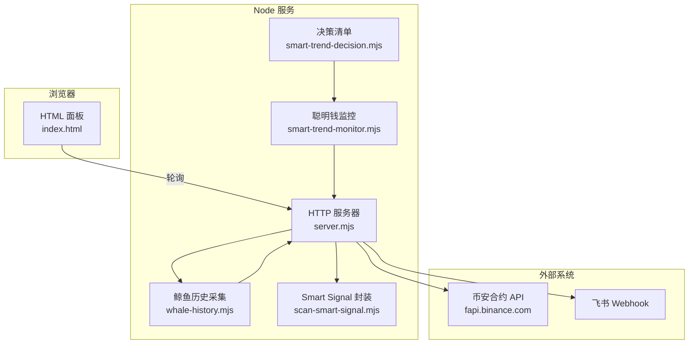
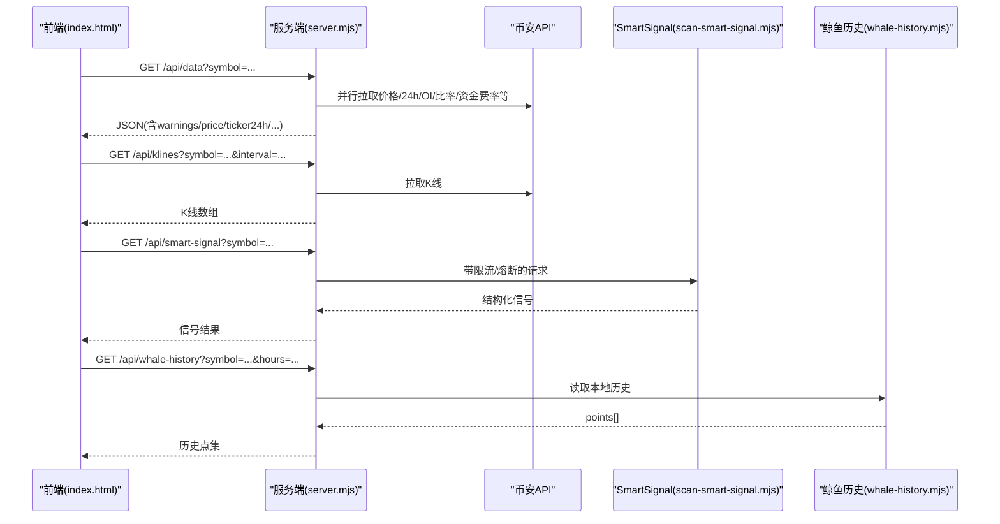
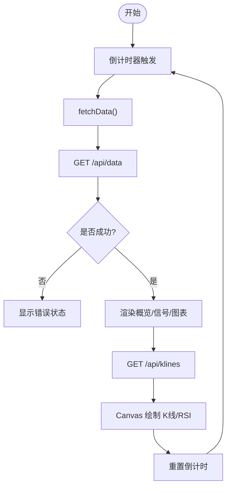
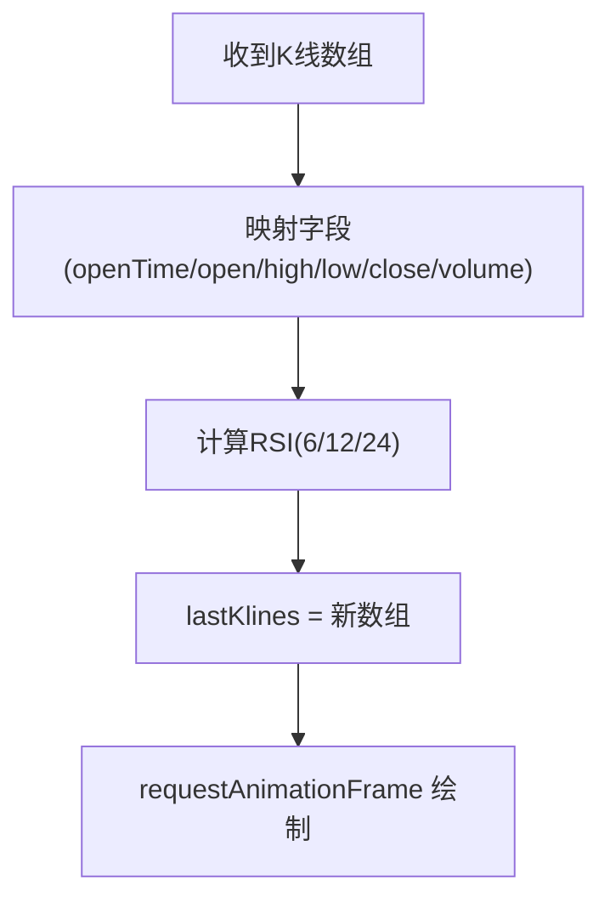
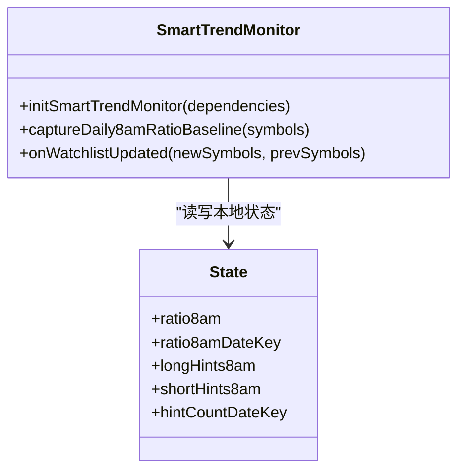
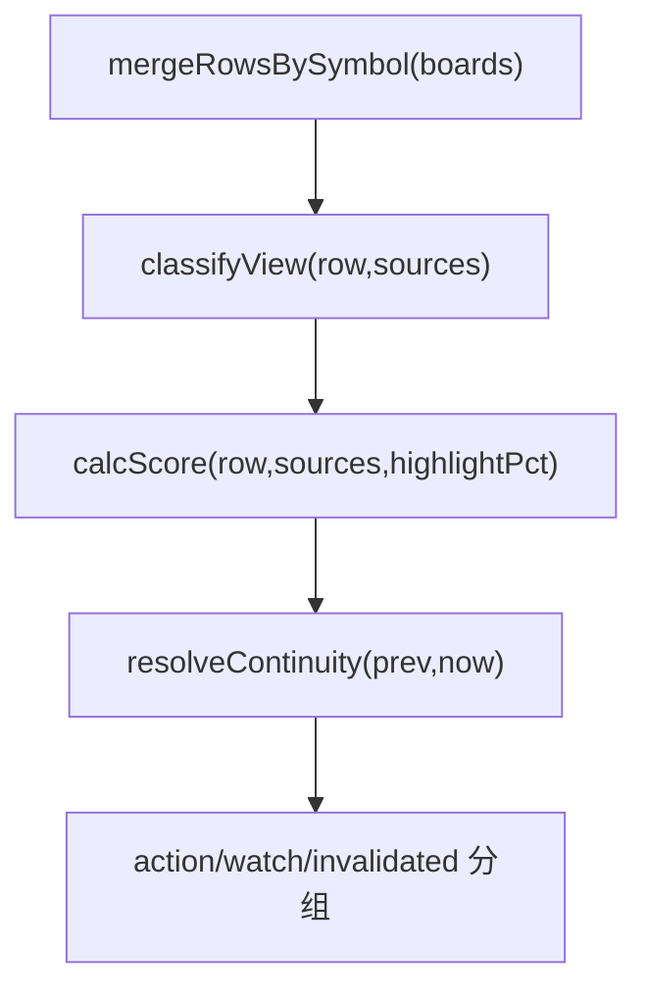
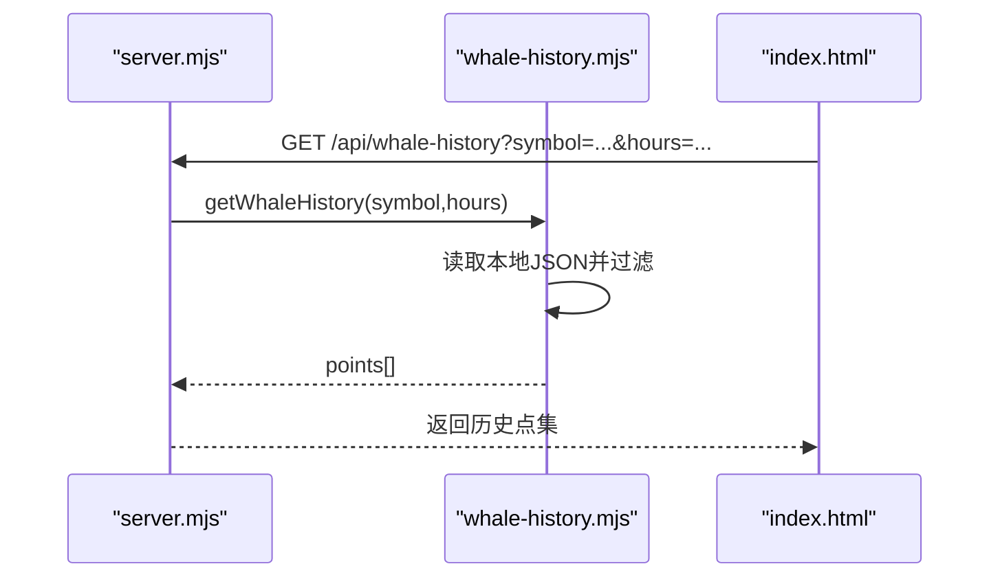
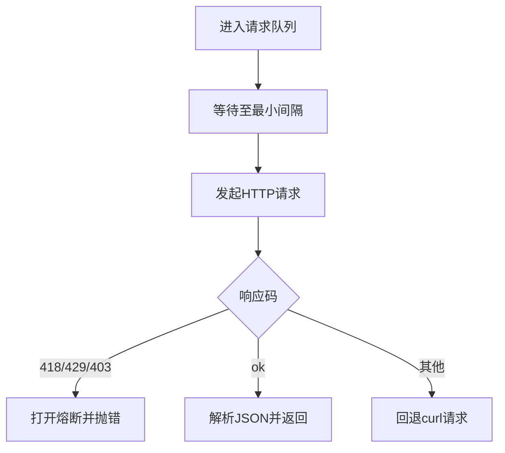
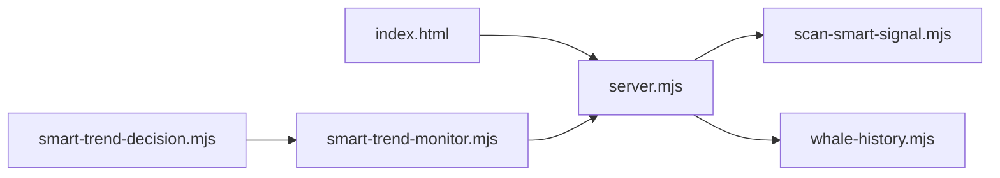

# 实时数据更新机制

<cite>
**本文引用的文件**   
- [server.mjs](file://server.mjs)
- [index.html](file://index.html)
- [smart-trend-monitor.mjs](file://smart-trend-monitor.mjs)
- [smart-trend-decision.mjs](file://smart-trend-decision.mjs)
- [whale-history.mjs](file://whale-history.mjs)
- [scan-smart-signal.mjs](file://scan-smart-signal.mjs)
- [package.json](file://package.json)
- [README.md](file://README.md)
</cite>

## 目录
1. [简介](#简介)
2. [项目结构](#项目结构)
3. [核心组件](#核心组件)
4. [架构总览](#架构总览)
5. [详细组件分析](#详细组件分析)
6. [依赖关系分析](#依赖关系分析)
7. [性能与内存优化](#性能与内存优化)
8. [故障排查指南](#故障排查指南)
9. [结论](#结论)
10. [附录](#附录)

## 简介
本文件围绕“实时数据更新机制”展开，聚焦以下方面：
- WebSocket 连接管理：本项目未使用 WebSocket，采用 HTTP 轮询 + 定时刷新策略实现近实时数据推送。
- 数据推送接收：前端通过定时器周期性拉取后端聚合接口，渲染图表与指标。
- 增量更新算法：K 线历史全量获取、最新 K 线合并逻辑（前端维护 lastKlines）、历史数据补全（服务端按时间窗口返回）。
- 去重与异常处理：多榜单合并去重、熔断限流、网络重试、部分指标失败降级。
- 断线重连：前端倒计时器自动重试；服务启动时探测网络就绪。
- 性能监控与渲染优化：Canvas 按需绘制、分页表格、节流/并发控制、缓存与队列化持久化。
- 数据流监控与调试：状态文件、Mock 快照、日志输出、飞书卡片告警。

## 项目结构
- 服务端提供 REST API，聚合币安合约数据并做二次加工（多空比、资金费率、OI、聪明钱信号等），供前端消费。
- 前端页面以固定间隔轮询 /api/data 与 /api/klines，结合本地 Canvas 渲染 K 线与 RSI 等指标。
- 定时任务模块负责“聪明钱摘要”“决策清单”“稳趋势扫描”等周期性推送。
- 鲸鱼历史采集模块定期抓取 Smart Signal 数据并落盘，为面板折线图提供历史支撑。

图示来源
- [server.mjs:1754-1811](file://server.mjs#L1754-L1811)
- [index.html:2267-2300](file://index.html#L2267-L2300)
- [smart-trend-monitor.mjs:189-199](file://smart-trend-monitor.mjs#L189-L199)
- [smart-trend-decision.mjs:556-640](file://smart-trend-decision.mjs#L556-L640)
- [whale-history.mjs:1-41](file://whale-history.mjs#L1-L41)
- [scan-smart-signal.mjs:41-78](file://scan-smart-signal.mjs#L41-L78)

章节来源
- [README.md:190-210](file://README.md#L190-L210)
- [package.json:10-18](file://package.json#L10-L18)

## 核心组件
- HTTP 聚合层（server.mjs）
  - 统一代理币安合约 API，提供 /api/data、/api/klines、/api/smart-signal、/api/whale-history 等接口。
  - 内置网络就绪探测、短 TTL 缓存、并发去重、错误降级与警告上报。
- 前端轮询与渲染（index.html）
  - 基于 setInterval 的倒计时器驱动 fetchData()，拉取 /api/data 后渲染概览、信号、图表与 K 线。
  - K 线通过 /api/klines 拉取最近 N 根，计算 RSI/MACD 等指标并绘制。
- 聪明钱监控与决策（smart-trend-monitor.mjs, smart-trend-decision.mjs）
  - 定时汇总各榜单，计算 8am 基准与变化分档，生成“市场研判”和“操作清单”。
  - 持久化状态到 data 目录，支持重启恢复。
- 鲸鱼历史采集（whale-history.mjs）
  - 定时抓取 Smart Signal，写入 data/whale-history.json，限制最大点数与最小记录间隔。
- Smart Signal 封装（scan-smart-signal.mjs）
  - 请求限流、熔断保护、回退 curl 调用。

章节来源
- [server.mjs:1754-1811](file://server.mjs#L1754-L1811)
- [index.html:2267-2300](file://index.html#L2267-L2300)
- [index.html:1809-1836](file://index.html#L1809-L1836)
- [smart-trend-monitor.mjs:189-199](file://smart-trend-monitor.mjs#L189-L199)
- [smart-trend-decision.mjs:556-640](file://smart-trend-decision.mjs#L556-L640)
- [whale-history.mjs:1-41](file://whale-history.mjs#L1-L41)
- [scan-smart-signal.mjs:41-78](file://scan-smart-signal.mjs#L41-L78)

## 架构总览
整体采用“服务端聚合 + 前端轮询”的轻量实时方案，避免 WebSocket 复杂性，同时满足分钟级更新的交易监控需求。

图示来源
- [server.mjs:1754-1811](file://server.mjs#L1754-L1811)
- [index.html:2267-2300](file://index.html#L2267-L2300)
- [index.html:1809-1836](file://index.html#L1809-L1836)
- [scan-smart-signal.mjs:41-78](file://scan-smart-signal.mjs#L41-L78)
- [whale-history.mjs:1-41](file://whale-history.mjs#L1-L41)

## 详细组件分析

### 组件A：HTTP 轮询与增量更新（前端）
- 轮询机制
  - 使用 setInterval 倒计时，每 interval 秒触发一次 fetchData()，失败则显示错误状态。
- 数据拉取顺序
  - 先拉取 /api/data 得到聪明钱全量数据，再拉取 /api/klines 用于 K 线与 RSI 绘制。
- 增量更新与合并
  - 前端维护 lastKlines，每次拉取后直接覆盖渲染；K 线由服务端按 limit 返回最近 N 根，形成“滑动窗口”式增量效果。
- 异常处理
  - 若 /api/data 返回 warnings，前端会提示“部分指标加载失败”，不影响其他图表渲染。

图示来源
- [index.html:2267-2300](file://index.html#L2267-L2300)
- [index.html:1809-1836](file://index.html#L1809-L1836)

章节来源
- [index.html:2267-2300](file://index.html#L2267-L2300)
- [index.html:1809-1836](file://index.html#L1809-L1836)

### 组件B：K 线数据处理与最新K线合并
- 时间序列处理
  - 前端将原始 K 线映射为 openTime/open/high/low/close/volume，并据此计算 RSI 系列。
- 最新K线合并逻辑
  - 每次拉取后以新数组替换 lastKlines，实现“最新N根”的增量视图。
- 历史数据补全
  - 服务端 /api/klines 根据 interval 与 limit 返回指定窗口，前端据此展示不同时间跨度。

图示来源
- [index.html:1809-1836](file://index.html#L1809-L1836)

章节来源
- [index.html:1809-1836](file://index.html#L1809-L1836)

### 组件C：聪明钱监控与8am基准
- 状态持久化
  - 启动时从 data/smart-trend-state.json 恢复 lastState，保存 ratio8am、hints8amScore 等。
- 8am 基准计算
  - 基于上海时间 08:00 作为基准日，查找附近鲸鱼历史或当前比值作为 baseline，计算相对变化百分比。
- 分档计分
  - 对 ratioDeltaPct 进行分档累计，生成 hints8amLabel 与评分。

图示来源
- [smart-trend-monitor.mjs:93-116](file://smart-trend-monitor.mjs#L93-L116)
- [smart-trend-monitor.mjs:201-257](file://smart-trend-monitor.mjs#L201-L257)
- [smart-trend-monitor.mjs:279-318](file://smart-trend-monitor.mjs#L279-L318)

章节来源
- [smart-trend-monitor.mjs:93-116](file://smart-trend-monitor.mjs#L93-L116)
- [smart-trend-monitor.mjs:201-257](file://smart-trend-monitor.mjs#L201-L257)
- [smart-trend-monitor.mjs:279-318](file://smart-trend-monitor.mjs#L279-L318)

### 组件D：决策清单与多榜单合并去重
- 多榜单合并
  - 将涨幅榜、跌幅榜、右侧形态、成交额榜等 rows 按 symbol 合并，保留首个非空字段，记录来源与排名。
- 分类与打分
  - 依据涨跌幅、方向、聪明钱变化、榜单来源等进行分类（趋势做多/超跌反弹/吸筹/派发/下跌风险/观望），并计算综合分数。
- 连续性判定
  - 对比上次状态，判断“新出现/延续/加强/减弱/反转确认”，并维护 streak 与 pendingSide。

图示来源
- [smart-trend-decision.mjs:203-264](file://smart-trend-decision.mjs#L203-L264)
- [smart-trend-decision.mjs:266-313](file://smart-trend-decision.mjs#L266-L313)
- [smart-trend-decision.mjs:340-403](file://smart-trend-decision.mjs#L340-L403)
- [smart-trend-decision.mjs:556-640](file://smart-trend-decision.mjs#L556-L640)

章节来源
- [smart-trend-decision.mjs:203-264](file://smart-trend-decision.mjs#L203-L264)
- [smart-trend-decision.mjs:266-313](file://smart-trend-decision.mjs#L266-L313)
- [smart-trend-decision.mjs:340-403](file://smart-trend-decision.mjs#L340-L403)
- [smart-trend-decision.mjs:556-640](file://smart-trend-decision.mjs#L556-L640)

### 组件E：鲸鱼历史采集与本地缓存
- 采集周期与上限
  - 默认每 5 分钟采集一次，最多保留 2016 个点，最小记录间隔 1 分钟。
- 活跃币种注册
  - 当面板访问某币种时，将其加入 activeSymbols，后续采集会自动包含该币种。
- 落盘与读取
  - 数据写入 data/whale-history.json，前端通过 /api/whale-history 读取并按小时窗口过滤。

图示来源
- [whale-history.mjs:1-41](file://whale-history.mjs#L1-L41)
- [server.mjs:1803-1811](file://server.mjs#L1803-L1811)
- [index.html:2097-2101](file://index.html#L2097-L2101)

章节来源
- [whale-history.mjs:1-41](file://whale-history.mjs#L1-L41)
- [server.mjs:1803-1811](file://server.mjs#L1803-L1811)
- [index.html:2097-2101](file://index.html#L2097-L2101)

### 组件F：Smart Signal 限流与熔断
- 限流与队列
  - 通过串行队列保证最小请求间隔，避免被第三方限流。
- 熔断保护
  - 遇到 418/429/403 时打开熔断一段时间，期间直接抛错，避免雪崩。
- 回退路径
  - 主路径失败时尝试通过 curl 回退请求。

图示来源
- [scan-smart-signal.mjs:41-78](file://scan-smart-signal.mjs#L41-L78)

章节来源
- [scan-smart-signal.mjs:41-78](file://scan-smart-signal.mjs#L41-L78)

## 依赖关系分析
- 前端依赖
  - index.html 依赖 server.mjs 提供的多个 REST 接口。
- 服务端依赖
  - server.mjs 依赖 scan-smart-signal.mjs、whale-history.mjs 以及币安合约 API。
- 定时任务依赖
  - smart-trend-monitor.mjs 与 smart-trend-decision.mjs 在启动时初始化并调度任务，依赖 whale-history.mjs 的历史数据。

图示来源
- [server.mjs:1754-1811](file://server.mjs#L1754-L1811)
- [index.html:2267-2300](file://index.html#L2267-L2300)
- [smart-trend-monitor.mjs:189-199](file://smart-trend-monitor.mjs#L189-L199)
- [smart-trend-decision.mjs:556-640](file://smart-trend-decision.mjs#L556-L640)

章节来源
- [server.mjs:1754-1811](file://server.mjs#L1754-L1811)
- [index.html:2267-2300](file://index.html#L2267-L2300)
- [smart-trend-monitor.mjs:189-199](file://smart-trend-monitor.mjs#L189-L199)
- [smart-trend-decision.mjs:556-640](file://smart-trend-decision.mjs#L556-L640)

## 性能与内存优化
- 前端渲染
  - 使用 requestAnimationFrame 批量绘制，减少重排重绘开销。
  - 表格分页与冻结首列，提升大数据量下的可读性与滚动性能。
- 服务端并发与缓存
  - 并发拉取多项指标（Promise.allSettled），失败项以 warnings 形式返回，不阻塞整体响应。
  - ticker/24hr 短 TTL 缓存 + inflight 并发去重，避免重复请求。
- 状态持久化
  - 使用 Promise 队列串行写盘，避免频繁 I/O 导致卡顿。
- 内存泄漏防护
  - 鲸鱼历史设置 MAX_POINTS 上限；稳定趋势推送历史集合长度限制；状态对象仅保留必要字段。
- 大数据量渲染优化
  - 榜单汇总按 24h 成交额阈值过滤低流动性标的，降低渲染压力。
  - 决策清单限制 action/watch/invalidated 数量，避免过长列表。

章节来源
- [server.mjs:84-105](file://server.mjs#L84-L105)
- [server.mjs:508-538](file://server.mjs#L508-L538)
- [smart-trend-monitor.mjs:435-471](file://smart-trend-monitor.mjs#L435-L471)
- [whale-history.mjs:10-16](file://whale-history.mjs#L10-L16)

## 故障排查指南
- 常见问题定位
  - 前端状态点闪烁红色：检查 /api/data 返回 error 或 warnings，查看控制台错误信息。
  - 图表不完整：可能因部分指标失败（warnings），可单独调用对应接口验证。
  - Smart Signal 不可用：检查限流熔断日志，必要时等待熔断结束或调整环境代理。
- 网络就绪检测
  - 服务启动时会探测币安 API 可用性，失败则指数退避重试。
- 日志与快照
  - 观察控制台输出；查看 data 目录下的状态与历史文件；可通过 Mock 文件辅助调试。
- 手动触发与诊断
  - 使用 /api/trigger-stable-push 触发稳趋势扫描；通过 /api/strategy-review 查看复盘记录。

章节来源
- [server.mjs:107-125](file://server.mjs#L107-L125)
- [index.html:2267-2300](file://index.html#L2267-L2300)
- [scan-smart-signal.mjs:41-78](file://scan-smart-signal.mjs#L41-L78)
- [README.md:155-160](file://README.md#L155-L160)

## 结论
本项目采用“HTTP 轮询 + 定时任务 + 本地缓存”的轻量实时架构，在保证近实时体验的同时，有效规避了 WebSocket 的复杂性与运维成本。通过并发去重、熔断限流、状态持久化与渲染优化，系统在大数据量场景下仍保持良好稳定性与可观测性。对于需要更高实时性的场景，可在现有架构基础上平滑演进为 WebSocket 推送通道。

## 附录
- 运行方式与环境
  - Node.js >= 20；推荐使用 pnpm dev:restart 启动，端口默认 3388。
- 相关脚本与命令
  - package.json 中定义了 dev、monitor 等脚本，便于快速启动与单币种监控。

章节来源
- [README.md:17-38](file://README.md#L17-L38)
- [package.json:10-18](file://package.json#L10-L18)