# RSI相对强弱指标

<cite>
**本文引用的文件**   
- [index.html](file://index.html)
- [README.md](file://README.md)
- [scan-momentum.mjs](file://scan-momentum.mjs)
- [scan-short-signal.mjs](file://scan-short-signal.mjs)
- [scan-stable.mjs](file://scan-stable.mjs)
</cite>

## 目录
1. [简介](#简介)
2. [项目结构](#项目结构)
3. [核心组件](#核心组件)
4. [架构总览](#架构总览)
5. [详细组件分析](#详细组件分析)
6. [依赖关系分析](#依赖关系分析)
7. [性能与实时优化](#性能与实时优化)
8. [故障排查指南](#故障排查指南)
9. [结论](#结论)
10. [附录：配置与扩展接口](#附录配置与扩展接口)

## 简介
本文件围绕仓库中的RSI（相对强弱指标）实现，系统性梳理其计算算法、多周期组合（6/12/24）、超买超卖区域标注、趋势线绘制思路、图表渲染与颜色映射、与价格图联动显示、报警触发机制，以及后端扫描脚本中RSI的复用方式。同时给出实时计算的优化建议与可扩展的配置点，帮助读者快速理解并二次开发。

## 项目结构
- Web前端页面 index.html 包含K线图与RSI子图的Canvas渲染逻辑、RSI计算函数、报警检查与策略评分等。
- README.md 对功能进行概览说明，明确支持“RSI6/RSI12/RSI24三线”和“超买超卖区高亮”。
- 后端扫描脚本 scan-momentum.mjs、scan-short-signal.mjs、scan-stable.mjs 各自实现了RSI计算用于信号筛选与打分。

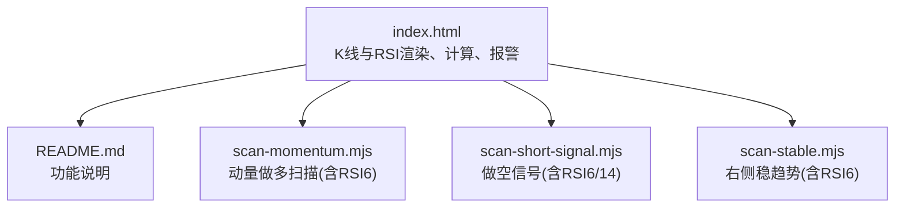

**图示来源** 
- [index.html:1514-1532](file://index.html#L1514-L1532)
- [index.html:1728-1807](file://index.html#L1728-L1807)
- [index.html:1819-1832](file://index.html#L1819-L1832)
- [README.md:7-14](file://README.md#L7-L14)
- [scan-momentum.mjs:12-21](file://scan-momentum.mjs#L12-L21)
- [scan-short-signal.mjs:7-22](file://scan-short-signal.mjs#L7-L22)
- [scan-stable.mjs:17-34](file://scan-stable.mjs#L17-L34)

**章节来源**
- [README.md:7-14](file://README.md#L7-L14)

## 核心组件
- RSI计算函数
  - 通用平滑RSI实现（指数移动平均式），返回完整序列，便于绘图与后续判断。
- 多周期RSI组合
  - 在K线数据拉取后，并行计算RSI6/RSI12/RSI24，供图表展示与策略使用。
- RSI图表渲染
  - 固定Y轴0-100，绘制超买/超卖背景带，网格线，三条RSI曲线及最新值圆点与图例。
- 报警系统
  - 基于用户配置的阈值，检测RSI6是否越界，触发本地提示与持久化标记。
- 策略评分与入场推荐
  - 结合RSI与其他因子（均线、MACD、趋势判断）生成买卖建议与理由。

**章节来源**
- [index.html:1514-1532](file://index.html#L1514-L1532)
- [index.html:1728-1807](file://index.html#L1728-L1807)
- [index.html:1819-1832](file://index.html#L1819-L1832)
- [index.html:920-938](file://index.html#L920-L938)
- [index.html:1853-1919](file://index.html#L1853-L1919)

## 架构总览
下图展示了从K线获取到RSI计算、图表渲染与报警触发的整体流程。

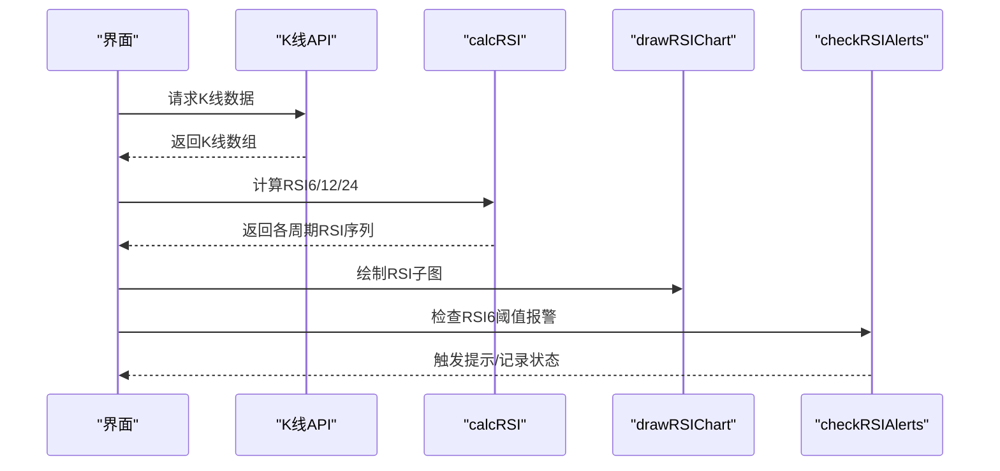

**图示来源** 
- [index.html:1809-1836](file://index.html#L1809-L1836)
- [index.html:1514-1532](file://index.html#L1514-L1532)
- [index.html:1728-1807](file://index.html#L1728-L1807)
- [index.html:920-938](file://index.html#L920-L938)

## 详细组件分析

### RSI计算算法与平滑处理
- 初始段
  - 使用前period个收盘价差的正负累加得到初始平均涨跌，再按标准公式计算首个RSI值。
- 滚动平滑
  - 后续每个新bar通过指数加权更新平均涨跌，避免全量重算，时间复杂度O(n)。
- 边界处理
  - 当平均下跌为0时，RSI置为100；不足期数时返回空值占位，保证绘图安全。

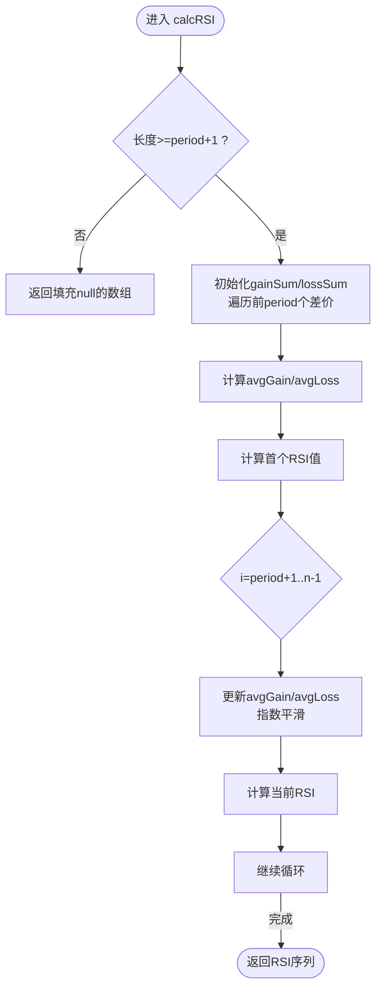

**图示来源** 
- [index.html:1514-1532](file://index.html#L1514-L1532)

**章节来源**
- [index.html:1514-1532](file://index.html#L1514-L1532)

### 多周期RSI（6, 12, 24）组合
- 在每次拉取K线后，分别以6/12/24为周期调用同一计算函数，得到三条序列。
- 三条线共用同一X轴时间刻度，便于观察短中长期动能差异。

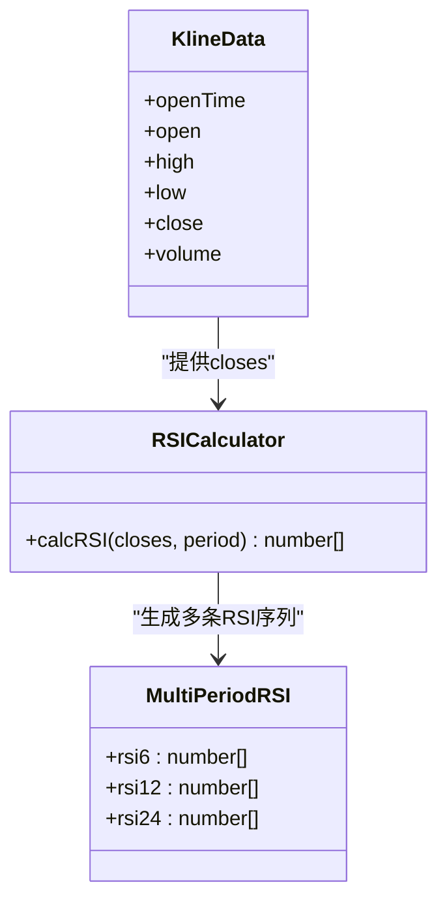

**图示来源** 
- [index.html:1819-1832](file://index.html#L1819-L1832)
- [index.html:1514-1532](file://index.html#L1514-L1532)

**章节来源**
- [index.html:1819-1832](file://index.html#L1819-L1832)

### 超买超卖区域标注与网格
- 超买区：70-100区间用浅色红色背景填充。
- 超卖区：0-30区间用浅色绿色背景填充。
- 关键参考线：20/50/80水平网格，其中50为虚线强调中性中枢。

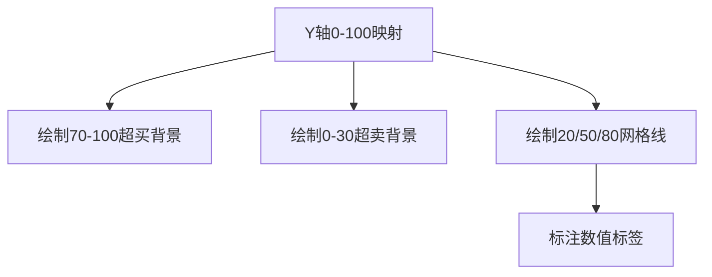

**图示来源** 
- [index.html:1728-1807](file://index.html#L1728-L1807)

**章节来源**
- [index.html:1728-1807](file://index.html#L1728-L1807)

### 趋势线的绘制技术
- 代码未直接绘制RSI趋势线，但提供了MA5/MA20/MA60在价格图上绘制的方法，可作为RSI趋势分析的辅助。
- 若需RSI趋势线，可沿用相同折线绘制模式，将数据源替换为对应周期的RSI序列。

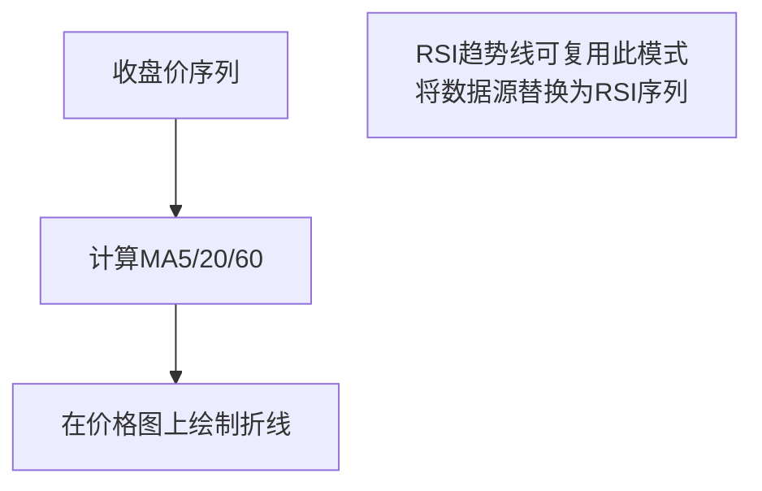

**图示来源** 
- [index.html:1640-1676](file://index.html#L1640-L1676)

**章节来源**
- [index.html:1640-1676](file://index.html#L1640-L1676)

### RSI图表渲染与颜色映射
- 线条颜色
  - RSI6：暖黄色系
  - RSI12：蓝色系
  - RSI24：紫色系
- 最新点
  - 每条RSI末端绘制小圆点，便于定位当前值。
- 图例
  - 左上角显示各周期RSI的最新值，方便快速对比。

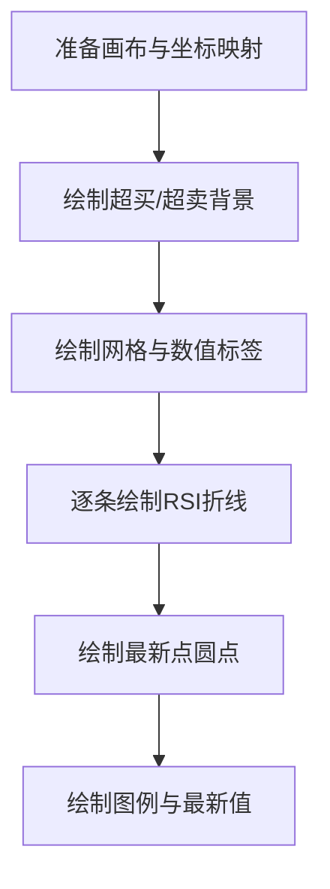

**图示来源** 
- [index.html:1728-1807](file://index.html#L1728-L1807)

**章节来源**
- [index.html:1728-1807](file://index.html#L1728-L1807)

### 与价格图表的联动显示
- 共用时间轴：RSI与K线共享相同的x轴时间刻度，便于对齐观察。
- 同步刷新：K线拉取完成后，统一触发K线与RSI重绘，确保视图一致。
- 十字光标与悬停：K线区域具备悬停信息展示，RSI区域可通过类似机制扩展。

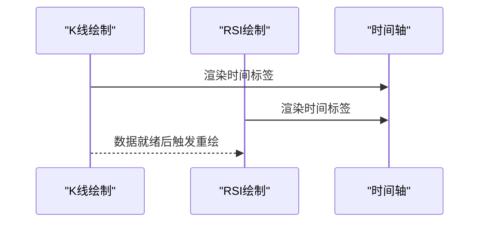

**图示来源** 
- [index.html:1809-1836](file://index.html#L1809-L1836)
- [index.html:1728-1807](file://index.html#L1728-L1807)

**章节来源**
- [index.html:1809-1836](file://index.html#L1809-L1836)

### 报警系统与阈值判定
- 条件类型
  - RSI6 > 阈值（超买）
  - RSI6 < 阈值（超卖）
- 触发行为
  - 设置已触发标记并持久化，弹出提示消息。
- 数据来源
  - 使用最近一次RSI6序列的有效值作为判定依据。

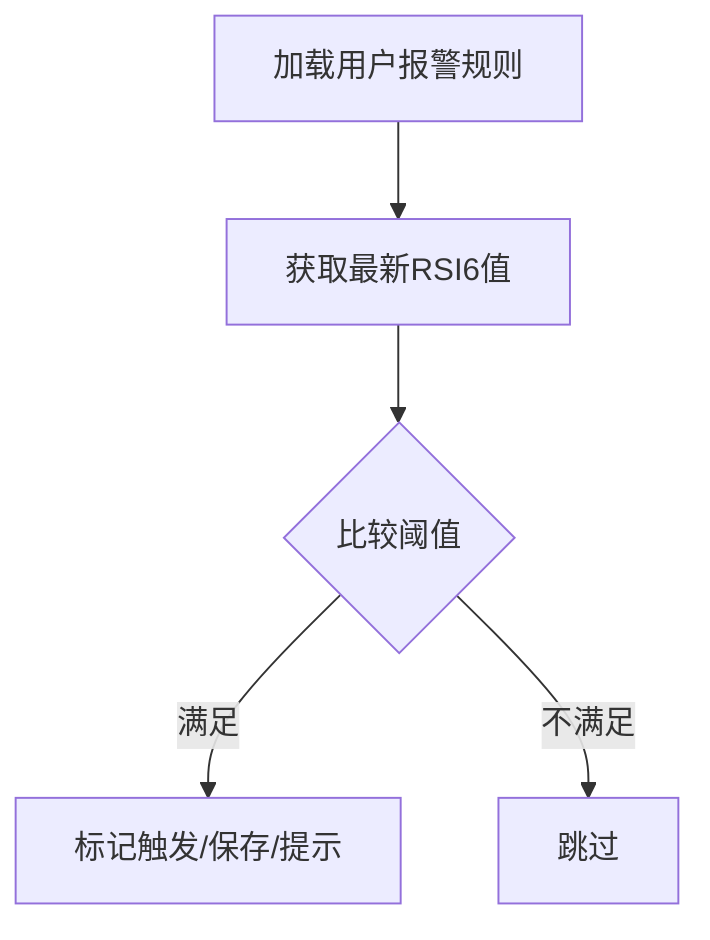

**图示来源** 
- [index.html:920-938](file://index.html#L920-L938)

**章节来源**
- [index.html:920-938](file://index.html#L920-L938)

### 策略评分与入场推荐中的RSI用法
- 入场推荐
  - 结合RSI6与趋势判断（如是否处于空头趋势）决定是否视为买入信号。
- 策略评分
  - RSI超买/超卖作为震荡类因子参与打分，权重可配置。
- 输出
  - 生成理由列表与信号方向（买入/卖出/中性）。

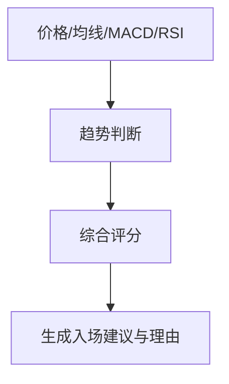

**图示来源** 
- [index.html:1853-1919](file://index.html#L1853-L1919)
- [index.html:3814-3817](file://index.html#L3814-L3817)

**章节来源**
- [index.html:1853-1919](file://index.html#L1853-L1919)
- [index.html:3814-3817](file://index.html#L3814-L3817)

### 后端扫描脚本中的RSI实现
- 动量做多扫描
  - 使用RSI6作为动量确认之一，配合涨幅、均线与成交量过滤候选。
- 做空信号扫描
  - 使用RSI6与RSI14共同衡量超买程度，并结合价格回撤、偏离度与K线形态打分。
- 右侧稳趋势
  - 使用RSI6在合理区间内加分，配合均线与MACD多头状态筛选稳健标的。

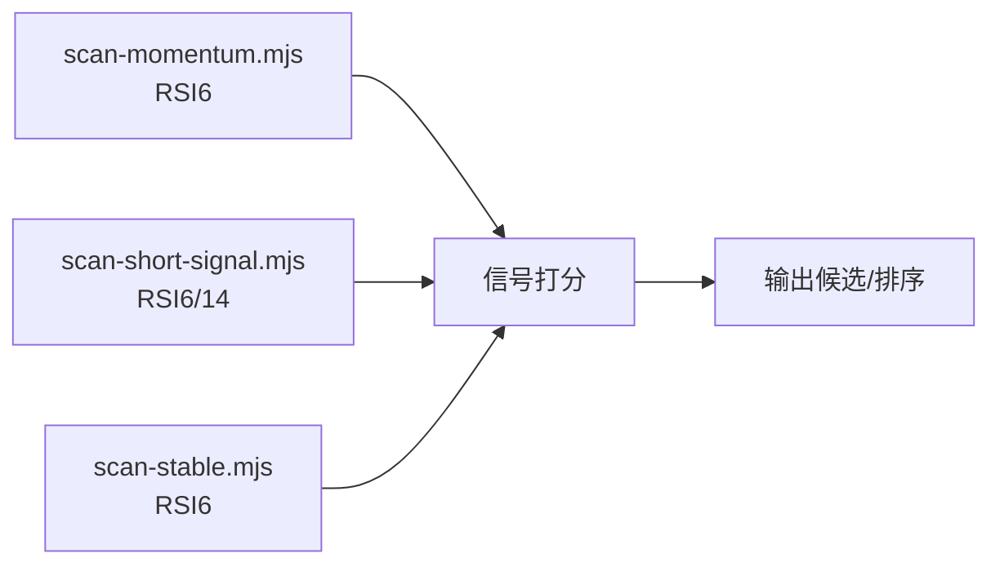

**图示来源** 
- [scan-momentum.mjs:12-21](file://scan-momentum.mjs#L12-L21)
- [scan-short-signal.mjs:7-22](file://scan-short-signal.mjs#L7-L22)
- [scan-stable.mjs:17-34](file://scan-stable.mjs#L17-L34)

**章节来源**
- [scan-momentum.mjs:12-21](file://scan-momentum.mjs#L12-L21)
- [scan-short-signal.mjs:7-22](file://scan-short-signal.mjs#L7-L22)
- [scan-stable.mjs:17-34](file://scan-stable.mjs#L17-L34)

## 依赖关系分析
- 模块耦合
  - 前端RSI计算与渲染集中在index.html，报警与策略评分与之紧密耦合。
  - 后端脚本独立实现RSI，避免重复依赖，便于在不同任务中复用。
- 外部依赖
  - 币安合约K线API用于获取历史数据。
  - Canvas用于图形渲染。
- 潜在循环依赖
  - 前端与后端无直接导入关系，通过HTTP接口交互，不存在循环依赖。

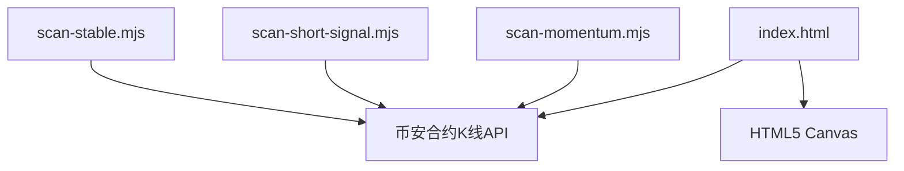

**图示来源** 
- [index.html:1809-1836](file://index.html#L1809-L1836)
- [scan-momentum.mjs:1-10](file://scan-momentum.mjs#L1-L10)
- [scan-short-signal.mjs:1-10](file://scan-short-signal.mjs#L1-L10)
- [scan-stable.mjs:1-10](file://scan-stable.mjs#L1-L10)

**章节来源**
- [index.html:1809-1836](file://index.html#L1809-L1836)

## 性能与实时优化
- 增量计算
  - 采用指数平滑更新平均涨跌，避免每步全量求和，降低CPU开销。
- 批量绘制
  - 使用requestAnimationFrame合并重绘，减少频繁DOM操作导致的卡顿。
- 数据缓存
  - 将lastKlines与RSI序列保存在内存中，避免重复计算与网络请求。
- 并发控制
  - 后端扫描脚本使用并发限制（pmap）控制并行请求数量，避免资源争用。
- 可选优化
  - 对超大窗口数据可采用滑动窗口或降采样策略。
  - 将高频RSI计算结果缓存至IndexedDB，提升跨会话性能。

[本节为通用指导，无需特定文件引用]

## 故障排查指南
- 数据不足
  - 当收盘价序列长度小于period+1时，RSI返回空值占位，图表不会报错。
- 除零保护
  - 平均下跌为0时，RSI置为100，避免除零异常。
- 报警未触发
  - 检查用户配置是否正确、符号是否匹配、阈值是否合理。
- 图表不同步
  - 确认K线与RSI在同一刷新周期内被调用，避免时序错乱。

**章节来源**
- [index.html:1514-1532](file://index.html#L1514-L1532)
- [index.html:920-938](file://index.html#L920-L938)

## 结论
该项目的RSI实现简洁高效，兼顾了可视化与策略应用。通过多周期组合与超买超卖区域标注，提升了可读性与可操作性；报警系统与策略评分进一步增强了实用性。建议在后续版本中增加RSI趋势线绘制与参数化配置，以提升灵活性与扩展性。

[本节为总结，无需特定文件引用]

## 附录：配置与扩展接口
- 自定义RSI周期
  - 在K线拉取处新增周期配置项，调用同一calcRSI函数生成更多序列。
- 超买超卖阈值
  - 可将70/30阈值提取为配置变量，支持动态调整。
- 趋势线开关
  - 在绘制函数中增加趋势线绘制分支，允许用户选择是否显示。
- 报警阈值
  - 用户界面已支持添加RSI6高于/低于阈值的报警，可直接复用。

**章节来源**
- [index.html:1819-1832](file://index.html#L1819-L1832)
- [index.html:1728-1807](file://index.html#L1728-L1807)
- [index.html:920-938](file://index.html#L920-L938)