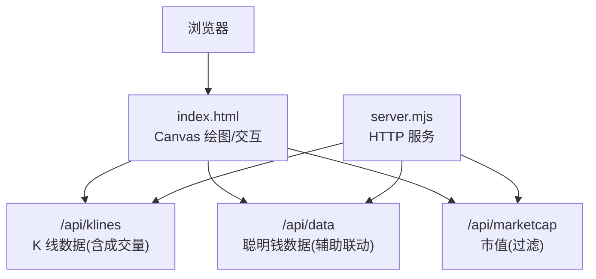
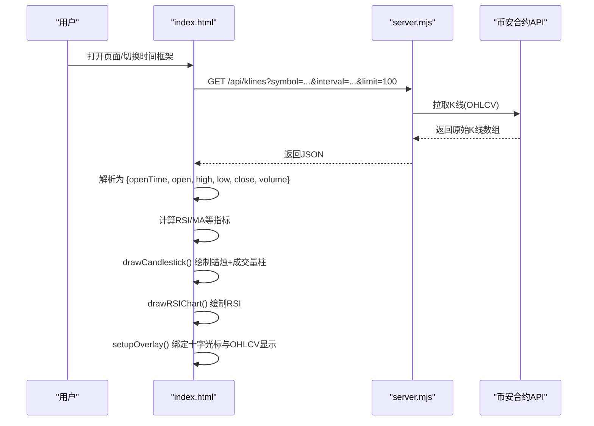
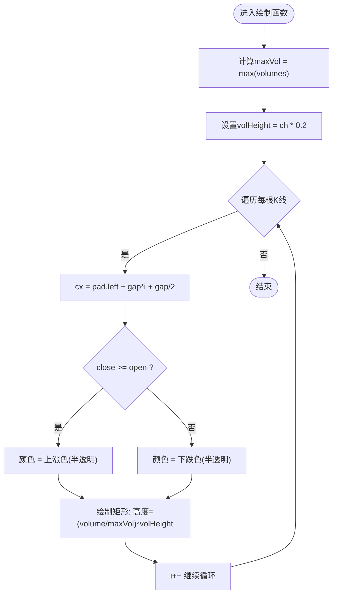
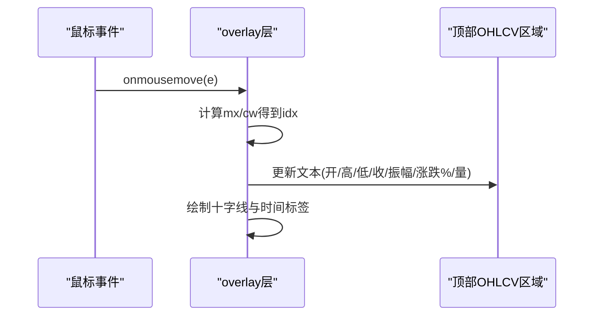
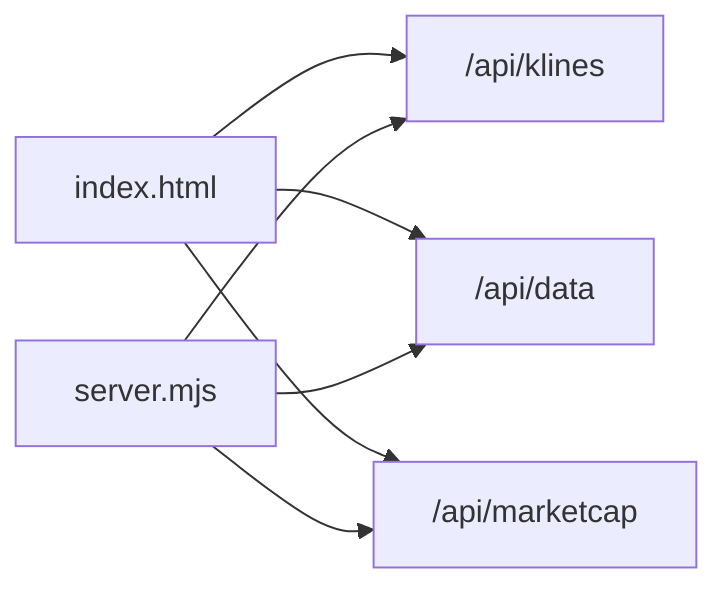

# 成交量柱状图

<cite>
**本文引用的文件**   
- [index.html](file://index.html)
- [README.md](file://README.md)
</cite>

## 目录
1. [简介](#简介)
2. [项目结构](#项目结构)
3. [核心组件](#核心组件)
4. [架构总览](#架构总览)
5. [详细组件分析](#详细组件分析)
6. [依赖关系分析](#依赖关系分析)
7. [性能与优化](#性能与优化)
8. [故障排查指南](#故障排查指南)
9. [结论](#结论)
10. [附录：配置与交互](#附录配置与交互)

## 简介
本文件聚焦于“成交量柱状图”的完整实现说明，覆盖数据获取、数据处理、绘制算法、颜色映射规则、与价格联动的显示机制、异常成交量的标注思路、缓存与实时更新策略、性能优化方案，以及图表交互（缩放控制、数据范围选择）和可配置项。文档以仓库中的前端页面实现为依据，确保所有细节均可在源码中追溯。

## 项目结构
本项目为基于 Node.js 的前后端一体化应用，Web 面板通过浏览器 Canvas 渲染 K 线图与指标，其中包含成交量柱状图。关键入口与相关逻辑集中在单页 HTML 文件中，服务端提供 K 线等数据接口。

图示来源
- [index.html:1809-1836](file://index.html#L1809-L1836)
- [README.md:190-199](file://README.md#L190-L199)

章节来源
- [README.md:1-20](file://README.md#L1-20)
- [index.html:1809-1836](file://index.html#L1809-L1836)

## 核心组件
- K 线数据获取与解析：从 /api/klines 拉取 OHLCV 数据，并转换为统一对象数组供绘图使用。
- 蜡烛图与成交量柱状图绘制：在同一画布上先绘制半透明成交量柱，再绘制蜡烛主体与影线，保证视觉层次。
- RSI 指标绘制：独立子图，与主图时间轴对齐。
- 十字光标与悬浮信息：鼠标移动时高亮当前 K 线，并在顶部展示 OHLCV、振幅、涨跌幅等信息。
- 数据范围选择：提供 12H/1D/3D/7D 等范围切换，影响各指标图表的数据长度与刷新上限。

章节来源
- [index.html:1809-1836](file://index.html#L1809-L1836)
- [index.html:1559-1727](file://index.html#L1559-L1727)
- [index.html:1729-1807](file://index.html#L1729-L1807)
- [index.html:4127-4178](file://index.html#L4127-L4178)
- [index.html:757-763](file://index.html#L757-L763)

## 架构总览
下图展示了从数据请求到渲染的关键流程，重点体现成交量数据的来源、处理与绘制路径。

图示来源
- [index.html:1809-1836](file://index.html#L1809-L1836)
- [index.html:1559-1727](file://index.html#L1559-L1727)
- [index.html:1729-1807](file://index.html#L1729-L1807)
- [index.html:4127-4178](file://index.html#L4127-L4178)

## 详细组件分析

### 成交量数据获取与处理
- 数据来源：/api/klines 返回的每根 K 线包含第 6 个字段为成交量（quoteVolume）。
- 数据转换：将原始数组映射为结构化对象，包含 openTime/open/high/low/close/volume。
- 数据缓存：将最近一次 K 线结果保存在 lastKlines 变量中，用于十字光标交互与悬浮信息展示。

章节来源
- [index.html:1809-1836](file://index.html#L1809-L1836)
- [index.html:4127-4178](file://index.html#L4127-L4178)

### 成交量柱状图的绘制算法
- 绘制顺序：先绘制成交量柱，再绘制蜡烛主体与影线，使蜡烛位于成交量之上，避免遮挡。
- 高度归一化：根据当前可见区间的最大成交量 maxVol 进行线性缩放，柱高占主图高度的固定比例（约 20%），保持与价格区域的比例协调。
- 宽度与间距：按 K 线数量均匀分配 x 轴空间，柱宽约为间隔的 65%，保证视觉密度适中。
- 网格与坐标轴：绘制水平网格线与右侧价格刻度，底部时间标签按区间自适应采样。

图示来源
- [index.html:1602-1612](file://index.html#L1602-L1612)

章节来源
- [index.html:1559-1727](file://index.html#L1559-L1727)

### 颜色映射规则的实现
- 涨跌判定：依据每根 K 线的收盘价与开盘价比较，close >= open 视为上涨，否则下跌。
- 颜色策略：上涨用绿色系半透明填充，下跌用红色系半透明填充；蜡烛实体与影线采用不透明度更高的同色系，形成对比层次。
- 最新价线：最后一根 K 线的收盘价为基准，绘制虚线并附带价格标签，颜色跟随该 K 线涨跌。

章节来源
- [index.html:1602-1612](file://index.html#L1602-L1612)
- [index.html:1614-1638](file://index.html#L1614-L1638)
- [index.html:1678-1690](file://index.html#L1678-L1690)

### 成交量与价格的联动显示机制
- 十字光标：鼠标在 K 线区域移动时，计算当前 x 位置对应的索引 idx，高亮对应 K 线，并在顶部展示 OHLCV、振幅、涨跌幅等。
- 涨跌幅计算：若存在前一根 K 线，则基于 prevClose 计算百分比变化，并以红绿配色呈现。
- 量值展示：顶部信息栏同步显示当前 K 线的成交量数值，便于快速对照价格与量能。

图示来源
- [index.html:4127-4178](file://index.html#L4127-L4178)

章节来源
- [index.html:4127-4178](file://index.html#L4127-L4178)

### 成交量变化的可视化效果
- 半透明柱体：成交量柱使用较低不透明度，避免干扰蜡烛主体，同时保留趋势感知。
- 动态高度：随成交量大小线性变化，直观反映资金活跃度。
- 时间轴对齐：成交量柱与蜡烛严格对齐，便于同一时间点上的量价对照。

章节来源
- [index.html:1602-1612](file://index.html#L1602-L1612)

### 异常成交量的标注方法
- 现状说明：当前实现未对异常成交量进行自动标注或阈值告警。
- 建议方案：可在绘制前对 volumes 序列做统计（如均值±N倍标准差），超出阈值的点以不同样式（加粗边框、闪烁动画、标记符号）突出显示；或在 overlay 层增加悬停提示“异常放量”。

[本节为概念性建议，无需源码引用]

### 成交量数据的缓存策略
- 内存缓存：lastKlines 保存最近一次 K 线数据，供十字光标与悬浮信息复用，避免重复计算与重绘。
- 本地存储：页面内部分配置（如 chartRange）使用 localStorage 持久化，但成交量数据本身未落盘。

章节来源
- [index.html:1809-1836](file://index.html#L1809-L1836)
- [index.html:757-763](file://index.html#L757-L763)

### 实时更新机制
- 定时刷新：页面初始化后通过定时器轮询 /api/klines，默认 60 秒刷新一次，支持 URL 参数 interval 调整。
- 增量更新：每次拉取 limit=100 的 K 线，结合时间轴对齐，保证历史与实时一致。

章节来源
- [index.html:629-632](file://index.html#L629-L632)
- [index.html:1809-1836](file://index.html#L1809-L1836)

### 性能优化方案
- DPR 适配：Canvas 尺寸乘以 devicePixelRatio，提升高分屏清晰度。
- requestAnimationFrame：在数据就绪后调度绘制，减少阻塞。
- 网格与标签采样：时间轴标签按区间自适应采样，避免密集重叠。
- 半透明绘制：降低视觉复杂度，提高渲染效率。

章节来源
- [index.html:1559-1566](file://index.html#L1559-L1566)
- [index.html:1827-1831](file://index.html#L1827-L1831)
- [index.html:1594-1599](file://index.html#L1594-L1599)

### 图表交互功能
- 十字光标：在 K 线区域移动时，绘制垂直参考线、时间标签，并在顶部展示 OHLCV、振幅、涨跌幅。
- 数据范围选择：提供 12H/1D/3D/7D 按钮，影响各指标图表的数据长度与刷新上限。
- 多币种与时间框架：支持切换币种与时间框架（5m/1h/4h/1d），触发重新拉取与重绘。

章节来源
- [index.html:4127-4178](file://index.html#L4127-L4178)
- [index.html:757-763](file://index.html#L757-L763)
- [index.html:765-772](file://index.html#L765-L772)

### 成交量分析的配置选项与自定义样式
- 颜色主题：通过 CSS 变量定义全局色彩，成交量柱与蜡烛颜色遵循主题约定。
- 柱体透明度：成交量柱使用半透明填充，可通过修改颜色字符串调整透明度。
- 柱体高度比例：volHeight 为主图高度的固定比例，可按需调整以增强或弱化量能表现。

章节来源
- [index.html:8-12](file://index.html#L8-L12)
- [index.html:1602-1612](file://index.html#L1602-L1612)

## 依赖关系分析
- 前端依赖：index.html 负责全部交互与绘制逻辑，直接调用 Canvas API。
- 后端依赖：server.mjs 提供 /api/klines 等接口，代理币安合约 REST API，解决跨域问题。
- 外部依赖：无第三方图表库，纯原生实现，零依赖。

图示来源
- [index.html:1809-1836](file://index.html#L1809-L1836)
- [README.md:190-199](file://README.md#L190-L199)

章节来源
- [README.md:200-206](file://README.md#L200-L206)
- [index.html:1809-1836](file://index.html#L1809-L1836)

## 性能与优化
- 渲染频率：默认 60 秒刷新一次，可根据需求缩短或延长。
- 数据量控制：limit=100 限制历史长度，避免大规模重绘。
- 绘制优化：仅对必要元素重绘，网格与标签采样降低绘制开销。
- 高分屏适配：DPR 缩放提升清晰度，同时注意 canvas 尺寸带来的内存占用。

[本节为通用指导，无需源码引用]

## 故障排查指南
- 端口占用：启动时报 EADDRINUSE，建议使用 dev:restart 清理旧进程或手动终止占用端口的进程。
- 跨域问题：通过 server.mjs 代理币安合约 API，避免浏览器跨域限制。
- 数据为空：检查 symbol 与 interval 参数是否正确，确认 /api/klines 返回正常。

章节来源
- [README.md:40-53](file://README.md#L40-L53)
- [README.md:190-199](file://README.md#L190-L199)

## 结论
成交量柱状图在本项目中作为 K 线图的重要组成部分，采用简洁高效的 Canvas 原生绘制方案，实现了与价格区域的联动显示、清晰的涨跌颜色映射、良好的交互体验与合理的性能优化。未来可在异常成交量标注、更丰富的交互（如框选缩放）与更多自定义样式方面进一步增强。

[本节为总结性内容，无需源码引用]

## 附录：配置与交互
- 刷新间隔：URL 参数 interval（秒），默认 60。
- 数据范围：chartRange 支持 12H/1D/3D/7D，影响各指标图表的数据长度与刷新上限。
- 时间框架：5m/1h/4h/1d，切换后重新拉取 K 线并重绘。
- 报警系统：支持价格、RSI、大户持仓比、主动买卖比等条件触发通知（与成交量联动分析相关）。

章节来源
- [index.html:629-632](file://index.html#L629-L632)
- [index.html:757-763](file://index.html#L757-L763)
- [index.html:765-772](file://index.html#L765-L772)
- [index.html:774-788](file://index.html#L774-L788)