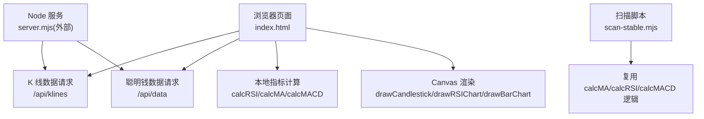
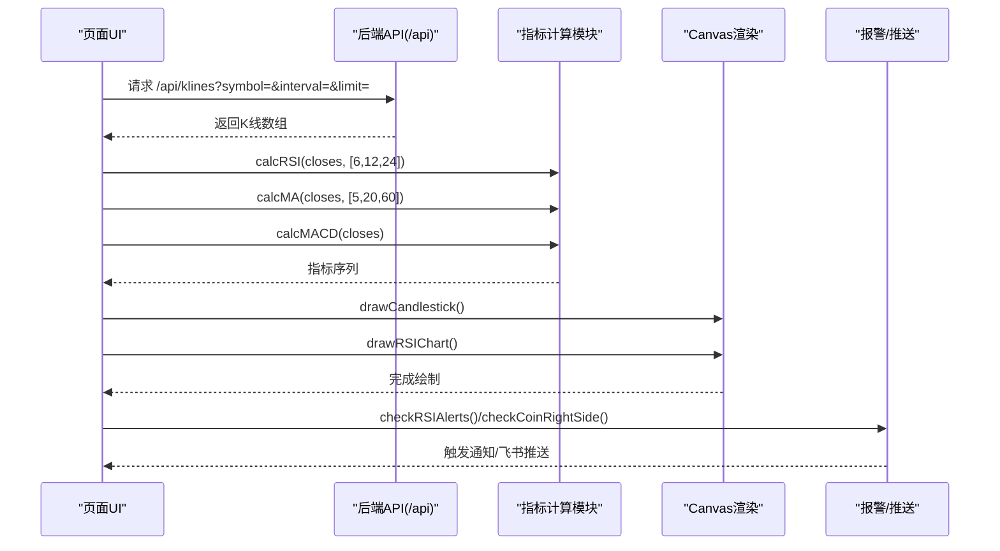
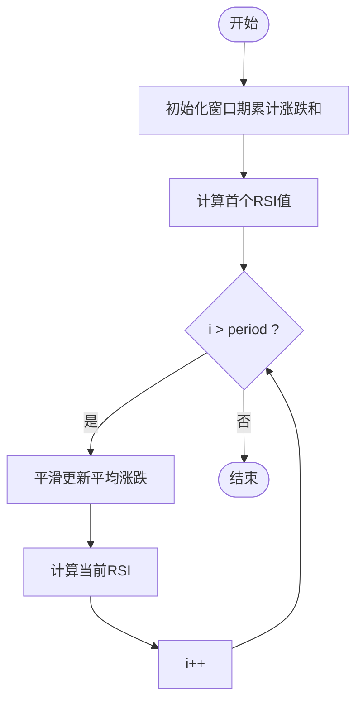
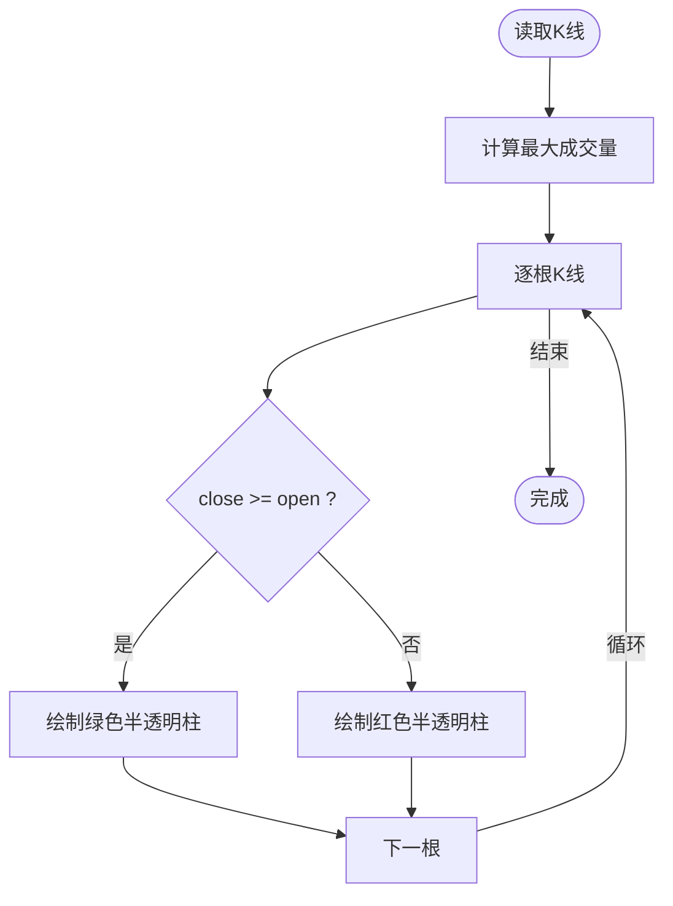
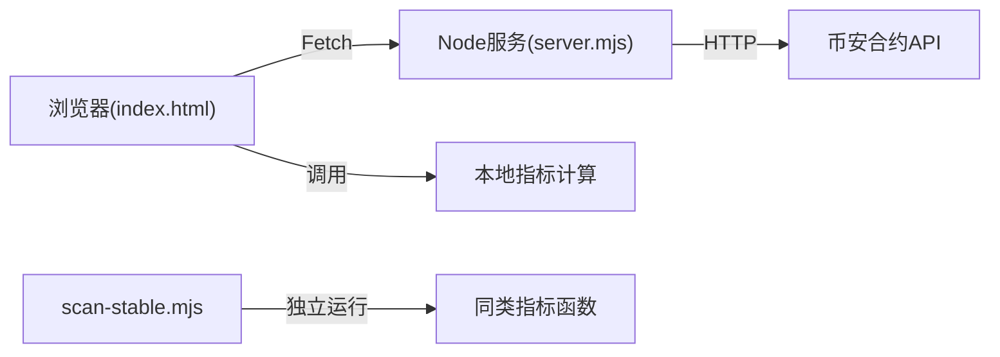

# 技术指标叠加显示

<cite>
**本文引用的文件**
- [index.html](file://index.html)
- [README.md](file://README.md)
- [package.json](file://package.json)
- [scan-stable.mjs](file://scan-stable.mjs)
</cite>

## 目录
1. [简介](#简介)
2. [项目结构](#项目结构)
3. [核心组件](#核心组件)
4. [架构总览](#架构总览)
5. [详细组件分析](#详细组件分析)
6. [依赖关系分析](#依赖关系分析)
7. [性能与缓存优化](#性能与缓存优化)
8. [故障排查指南](#故障排查指南)
9. [结论](#结论)
10. [附录：自定义指标开发接口与集成指南](#附录自定义指标开发接口与集成指南)

## 简介
本文件围绕“技术指标叠加显示”能力，系统性梳理并说明以下功能：
- RSI 指标（多周期 6/12/24）的计算与叠加绘制、超买超卖区域标注、趋势线辅助
- 移动平均线 MA（MA5/MA20/MA60）计算逻辑、均线交叉信号识别、动态参数调整
- 成交量柱状图绘制方法、颜色映射规则、与价格图表联动
- 实时数据刷新、前端计算与缓存机制、性能优化策略
- 可扩展的自定义技术指标开发与集成方式

该能力由浏览器端 HTML/Canvas 实现，结合服务端代理获取币安合约 K 线与衍生数据。

章节来源
- [README.md:1-210](file://README.md#L1-L210)

## 项目结构
本项目为单页 Web 应用，核心指标计算与渲染集中在 index.html；扫描与策略脚本位于 .mjs 文件中；服务启动与脚本入口在 package.json 中定义。



图示来源
- [index.html:1514-1532](file://index.html#L1514-L1532)
- [index.html:1540-1557](file://index.html#L1540-L1557)
- [index.html:3308-3323](file://index.html#L3308-L3323)
- [index.html:1558-1677](file://index.html#L1558-L1677)
- [index.html:1729-1807](file://index.html#L1729-L1807)
- [index.html:1418-1513](file://index.html#L1418-L1513)
- [scan-stable.mjs:34-48](file://scan-stable.mjs#L34-L48)

章节来源
- [package.json:1-22](file://package.json#L1-L22)
- [index.html:1-200](file://index.html#L1-L200)

## 核心组件
- 指标计算
  - RSI：支持任意周期，默认 14；用于 6/12/24 三线叠加
  - MA：简单移动平均，用于 MA5/MA20/MA60
  - MACD：EMA(12,26) + DEA(9)，用于金叉/死叉与收敛发散判断
- 可视化渲染
  - 蜡烛图 + 半透明成交量柱 + MA 线 + 最新价虚线
  - RSI 子图：超买/超卖区高亮、网格线、当前值图例
  - 买卖量柱状图 + 买卖比折线叠加
- 交互与联动
  - 十字光标联动价格/K线/指标
  - 资金费率事件在 K 线图顶部标注
- 信号与评分
  - 右侧稳趋势/左侧抄底等评分体系，综合 MA/RSI/MACD/成交量

章节来源
- [index.html:1514-1532](file://index.html#L1514-L1532)
- [index.html:1540-1557](file://index.html#L1540-L1557)
- [index.html:3308-3323](file://index.html#L3308-L3323)
- [index.html:1558-1677](file://index.html#L1558-L1677)
- [index.html:1729-1807](file://index.html#L1729-L1807)
- [index.html:1418-1513](file://index.html#L1418-L1513)

## 架构总览
整体流程：页面定时拉取 K 线与聪明钱数据 → 前端计算指标 → Canvas 绘制主图与子图 → 触发报警与推送。



图示来源
- [index.html:1809-1836](file://index.html#L1809-L1836)
- [index.html:1514-1532](file://index.html#L1514-L1532)
- [index.html:1540-1557](file://index.html#L1540-L1557)
- [index.html:3308-3323](file://index.html#L3308-L3323)
- [index.html:1558-1677](file://index.html#L1558-L1677)
- [index.html:1729-1807](file://index.html#L1729-L1807)

## 详细组件分析

### RSI 指标（多周期叠加、超买超卖、趋势线）
- 算法要点
  - 初始段使用固定周期窗口计算平均涨跌，随后采用平滑递推更新
  - 输出长度与收盘价一致，前 period 项为空
- 可视化要点
  - 超买区（70-100）与超卖区（0-30）以半透明色块标注
  - 20/50/80 参考线，50 线加粗虚线
  - 多条 RSI 线（6/12/24）叠加，末点打点，左上角显示当前值图例
- 趋势线
  - 可在 RSI 上叠加用户自定义趋势线（例如连接两个显著极值），通过遍历数据点连线实现



图示来源
- [index.html:1514-1532](file://index.html#L1514-L1532)
- [index.html:1729-1807](file://index.html#L1729-L1807)

章节来源
- [index.html:1514-1532](file://index.html#L1514-L1532)
- [index.html:1729-1807](file://index.html#L1729-L1807)

### 移动平均线 MA（计算、交叉信号、动态参数）
- 计算逻辑
  - 简单移动平均：对最近 N 根收盘价求均值
  - EMA：指数加权移动平均，用于 MACD 内部
- 交叉信号识别
  - 多头排列：价格 > MA20 且 MA5 > MA20
  - 金叉/死叉：短周期均线上穿/下穿长周期均线
- 动态参数调整
  - 可通过修改配置对象中的周期与颜色，动态切换 MA 组合与样式

```mermaid
classDiagram
class 指标计算 {
+calcMA(closes, period) number[]
+calcEMA(closes, period) number[]
+calcRSI(closes, period) number[]
+calcMACD(closes) {dif, dea, macd}
}
class 渲染器 {
+drawCandlestick(canvas, klines, tf)
+drawRSIChart(canvas, rsiLines, klines, tf)
}
class 信号评估 {
+checkCoinRightSide(sym)
+analyzeTfDrawdownTrend(sym, interval, maxDD)
}
指标计算 <.. 渲染器 : "提供数据"
指标计算 <.. 信号评估 : "提供数据"
```

图示来源
- [index.html:1540-1557](file://index.html#L1540-L1557)
- [index.html:3308-3323](file://index.html#L3308-L3323)
- [index.html:1558-1677](file://index.html#L1558-L1677)
- [index.html:3325-3414](file://index.html#L3325-L3414)

章节来源
- [index.html:1540-1557](file://index.html#L1540-L1557)
- [index.html:1558-1677](file://index.html#L1558-L1677)
- [index.html:3308-3323](file://index.html#L3308-L3323)
- [index.html:3325-3414](file://index.html#L3325-L3414)

### 成交量柱状图与价格联动
- 绘制方法
  - 在蜡烛图底部预留约 20% 高度绘制成交量柱
  - 上涨柱用绿色半透明，下跌柱用红色半透明
- 颜色映射规则
  - 依据每根 K 线的 close 与 open 比较决定颜色
- 与价格联动
  - 十字光标在同一 x 坐标同时显示价格、时间、OHLCV、振幅、涨跌幅等信息
  - 买卖量柱状图可叠加“买卖比”折线，右轴展示比值范围



图示来源
- [index.html:1558-1677](file://index.html#L1558-L1677)
- [index.html:1418-1513](file://index.html#L1418-L1513)

章节来源
- [index.html:1558-1677](file://index.html#L1558-L1677)
- [index.html:1418-1513](file://index.html#L1418-L1513)

### 资金费率标注与 K 线叠加
- 将历史资金费率事件映射到对应 K 线区间，在 K 线顶部绘制三角标记与百分比文本
- 正负费率分别以红/绿半透明填充，便于快速识别多空成本方向

章节来源
- [index.html:1691-1726](file://index.html#L1691-L1726)

### 信号评分与趋势判定（示例）
- 右侧稳趋势：综合均线排列、RSI 强势区、MACD 多头/金叉、放量等条件打分
- 左侧抄底：综合 RSI 超卖、偏离 MA20 程度、MACD 空头收敛、缩量等条件打分
- 回撤与趋势完整性：基于近期高点回撤幅度与 MA20 支撑路径判定

章节来源
- [index.html:3325-3414](file://index.html#L3325-L3414)
- [index.html:3416-3467](file://index.html#L3416-L3467)
- [index.html:3469-3499](file://index.html#L3469-L3499)
- [scan-stable.mjs:34-48](file://scan-stable.mjs#L34-L48)

## 依赖关系分析
- 前端依赖
  - 浏览器原生 Fetch 与 Canvas 2D
  - 无第三方图表库，全部自绘
- 后端依赖
  - Node.js HTTP 服务器（零依赖）
  - 代理币安合约 REST API，避免跨域
- 脚本复用
  - scan-stable.mjs 内也实现了 EMA/MACD/MA/RSI 等函数，与前端逻辑保持一致



图示来源
- [README.md:200-210](file://README.md#L200-L210)
- [package.json:1-22](file://package.json#L1-L22)
- [scan-stable.mjs:34-48](file://scan-stable.mjs#L34-L48)

章节来源
- [README.md:200-210](file://README.md#L200-L210)
- [package.json:1-22](file://package.json#L1-L22)

## 性能与缓存优化
- 计算复杂度
  - RSI/MA：O(n) 线性扫描；MACD：三次 O(n) 线性扫描（EMA12/26/9）
- 渲染优化
  - 使用 devicePixelRatio 适配高分屏，减少模糊
  - 仅绘制可见区间内的标签与网格，降低重绘开销
- 缓存策略
  - 右侧/左侧信号结果按币种与时间戳缓存，5 分钟内复用
  - 聪明钱全量数据缓存于全局变量，供 K 线资金费率标注复用
- 网络与刷新
  - 定时轮询 K 线与聪明钱数据，失败时降级提示
  - 通过 requestAnimationFrame 批量绘制，避免阻塞 UI

章节来源
- [index.html:1809-1836](file://index.html#L1809-L1836)
- [index.html:3325-3414](file://index.html#L3325-L3414)
- [index.html:2272-2300](file://index.html#L2272-L2300)

## 故障排查指南
- 端口占用
  - 若出现端口被占用错误，优先使用重启脚本自动清理旧进程
- 数据加载失败
  - 检查网络连通性与后端代理是否可用
  - 查看状态栏错误提示与日志
- 指标异常
  - 确认传入收盘价数组长度满足最小周期要求
  - 检查空值处理（如 RSI 前若干项为空）

章节来源
- [README.md:40-53](file://README.md#L40-L53)
- [index.html:2272-2300](file://index.html#L2272-L2300)

## 结论
本项目在前端以纯 Canvas 自绘的方式实现了多指标叠加显示，涵盖 RSI 多周期叠加、MA 均线与交叉信号、成交量柱状图与联动、以及资金费率标注。配合轻量级 Node 代理与前端缓存策略，在保证可读性的同时兼顾了性能与稳定性。通过模块化函数封装，新增自定义指标与可视化扩展具备良好可维护性。

## 附录：自定义指标开发接口与集成指南
- 新增指标计算
  - 在页面中新增计算函数，遵循输入 closes/volumes 等数组、输出同长度序列或结构化对象的约定
  - 建议复用现有 EMA/MA 工具函数，保持风格一致
- 新增指标渲染
  - 在 drawCandlestick 或新增子图函数中追加绘制逻辑
  - 注意坐标映射、网格与图例一致性
- 接入信号系统
  - 在评分函数中引入新指标阈值与权重，参与右侧/左侧决策
- 示例路径
  - 指标计算：[index.html:1514-1532](file://index.html#L1514-L1532)、[index.html:1540-1557](file://index.html#L1540-L1557)、[index.html:3308-3323](file://index.html#L3308-L3323)
  - 主图渲染：[index.html:1558-1677](file://index.html#L1558-L1677)
  - RSI 子图：[index.html:1729-1807](file://index.html#L1729-L1807)
  - 买卖量柱状图：[index.html:1418-1513](file://index.html#L1418-L1513)
  - 信号评分：[index.html:3325-3414](file://index.html#L3325-L3414)