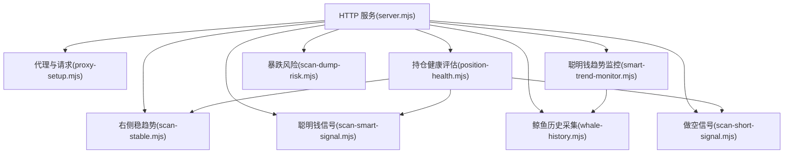
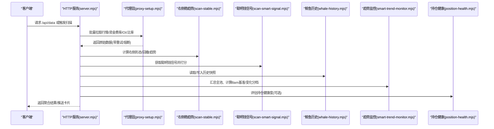
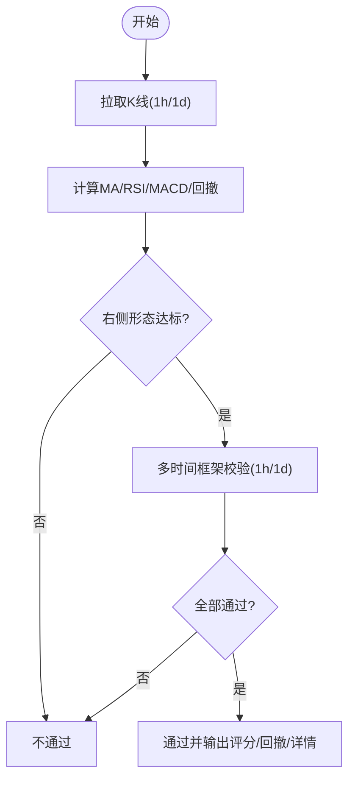
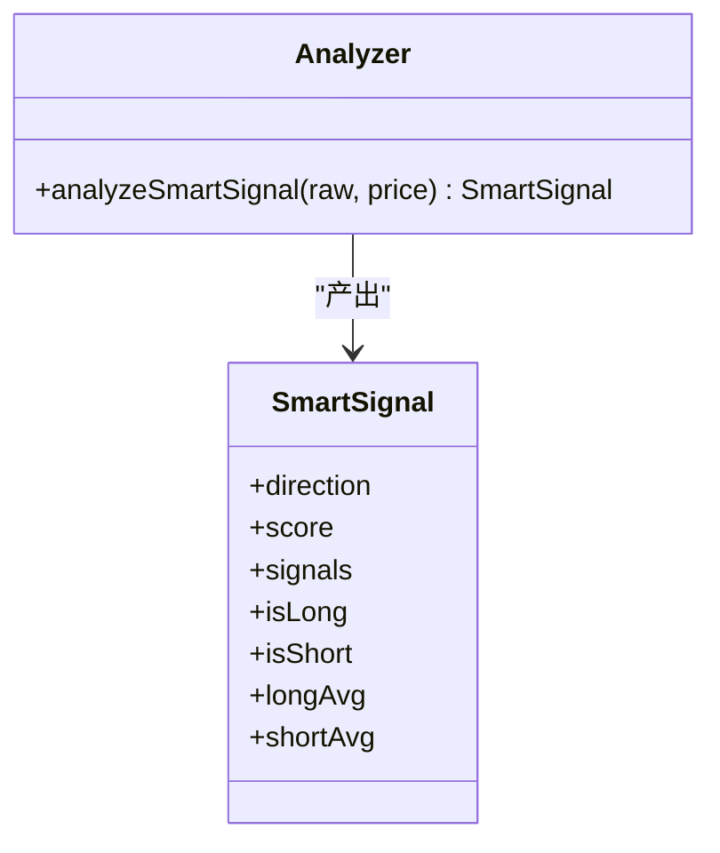
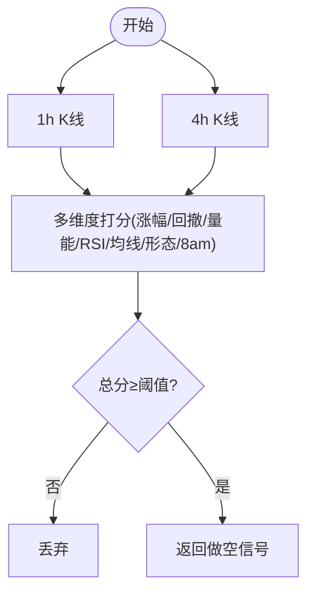
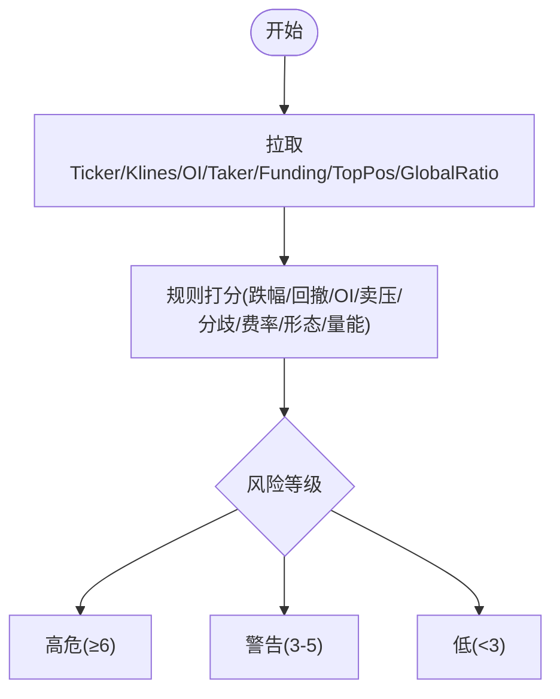
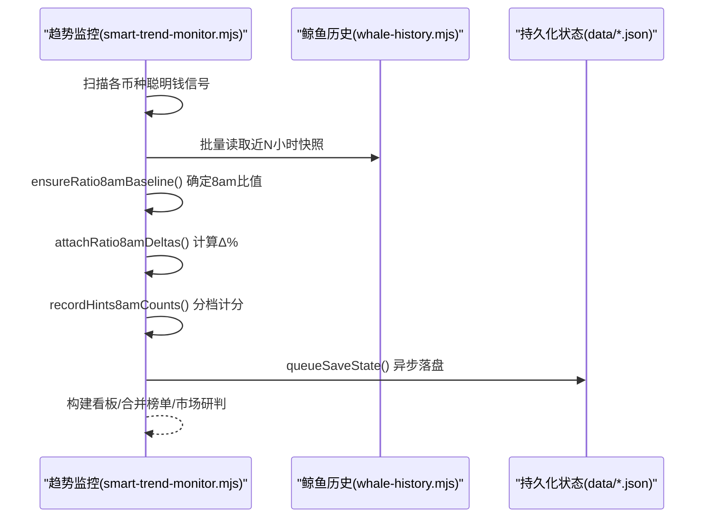
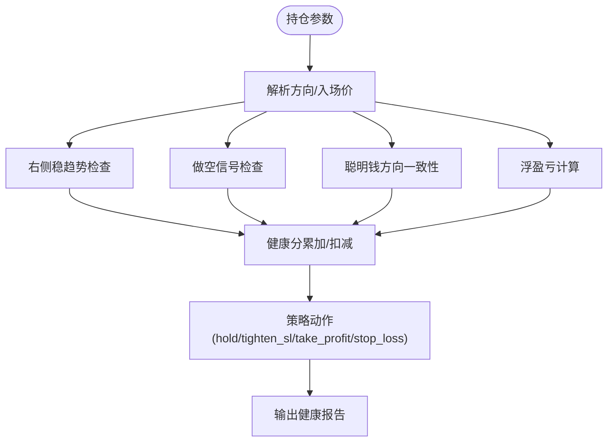
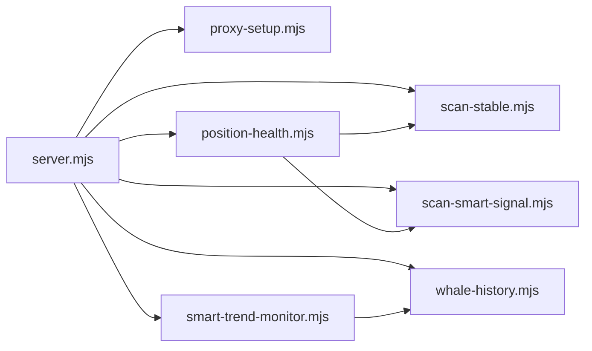
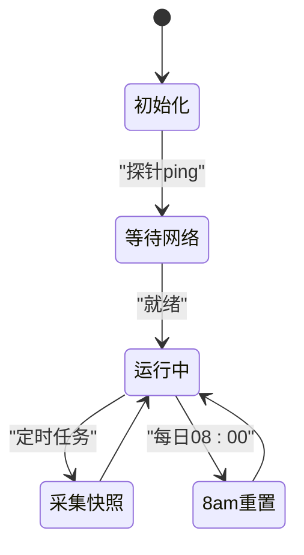

# 指标计算引擎

<cite>
**本文引用的文件**   
- [server.mjs](file://server.mjs)
- [proxy-setup.mjs](file://proxy-setup.mjs)
- [scan-stable.mjs](file://scan-stable.mjs)
- [scan-smart-signal.mjs](file://scan-smart-signal.mjs)
- [smart-trend-monitor.mjs](file://smart-trend-monitor.mjs)
- [whale-history.mjs](file://whale-history.mjs)
- [position-health.mjs](file://position-health.mjs)
- [scan-short-signal.mjs](file://scan-short-signal.mjs)
- [scan-dump-risk.mjs](file://scan-dump-risk.mjs)
- [package.json](file://package.json)
- [README.md](file://README.md)
</cite>

## 目录
1. [引言](#引言)
2. [项目结构](#项目结构)
3. [核心组件](#核心组件)
4. [架构总览](#架构总览)
5. [详细组件分析](#详细组件分析)
6. [依赖关系分析](#依赖关系分析)
7. [性能与并发](#性能与并发)
8. [缓存与内存管理](#缓存与内存管理)
9. [多时间框架同步与实时更新](#多时间框架同步与实时更新)
10. [错误处理与容错](#错误处理与容错)
11. [自定义指标与扩展点](#自定义指标与扩展点)
12. [监控与排障](#监控与排障)
13. [结论](#结论)

## 引言
本文件面向“指标计算引擎”的架构、数据处理流程、缓存机制、多时间框架同步、实时更新算法、内存管理、并行与错误处理、性能监控、以及可扩展的自定义指标接口与插件化设计。文档基于仓库中的服务端与扫描模块实现进行系统化梳理，并提供可视化图示与可操作的优化建议。

## 项目结构
系统采用 Node.js 原生 HTTP 服务作为入口，聚合多个独立扫描/计算模块（右侧稳趋势、聪明钱信号、做空信号、暴跌风险等），并通过统一代理层访问币安合约 API。状态持久化与历史采集通过本地 JSON 文件完成，推送能力集成飞书 Webhook。

图表来源
- [server.mjs:1-120](file://server.mjs#L1-L120)
- [proxy-setup.mjs:1-71](file://proxy-setup.mjs#L1-L71)
- [scan-stable.mjs:1-120](file://scan-stable.mjs#L1-L120)
- [scan-smart-signal.mjs:1-120](file://scan-smart-signal.mjs#L1-L120)
- [smart-trend-monitor.mjs:1-120](file://smart-trend-monitor.mjs#L1-L120)
- [whale-history.mjs:1-120](file://whale-history.mjs#L1-L120)
- [position-health.mjs:1-120](file://position-health.mjs#L1-L120)
- [scan-short-signal.mjs:1-120](file://scan-short-signal.mjs#L1-L120)
- [scan-dump-risk.mjs:1-120](file://scan-dump-risk.mjs#L1-L120)

章节来源
- [README.md:1-120](file://README.md#L1-L120)
- [package.json:1-22](file://package.json#L1-L22)

## 核心组件
- HTTP 服务与路由：提供数据聚合、定时任务触发、飞书推送、市值过滤、8am 基准价格加载等能力。
- 代理与网络层：统一封装 fetch/curl 请求、超时控制、地区限制检测、Windows 代理兼容。
- 指标计算模块：
  - 右侧稳趋势：MA/RSI/MACD/回撤/趋势完整性评分。
  - 聪明钱信号：多空比、盈利交易者/鲸鱼、均价偏离等综合打分。
  - 做空信号：暴涨回落、量价背离、RSI 超买、均线偏离、连续阴线、高位盘整、阴跌趋势、8am 大跌等。
  - 暴跌风险：跌幅、OI 萎缩、卖压、大户/散户分歧、费率异常、缩量下跌等。
- 趋势监控与决策：全池摘要、8am 基准、分档计分、看板合并、操作清单生成。
- 鲸鱼历史采集：周期性记录 Smart Signal 快照，供 8am 基准回溯与增量对比。
- 持仓健康评估：结合右侧稳趋势、做空信号、聪明钱方向一致性、PnL 与止损止盈建议。

章节来源
- [server.mjs:1-200](file://server.mjs#L1-L200)
- [proxy-setup.mjs:1-71](file://proxy-setup.mjs#L1-L71)
- [scan-stable.mjs:1-120](file://scan-stable.mjs#L1-L120)
- [scan-smart-signal.mjs:1-120](file://scan-smart-signal.mjs#L1-L120)
- [scan-short-signal.mjs:1-120](file://scan-short-signal.mjs#L1-L120)
- [scan-dump-risk.mjs:1-120](file://scan-dump-risk.mjs#L1-L120)
- [smart-trend-monitor.mjs:1-120](file://smart-trend-monitor.mjs#L1-L120)
- [whale-history.mjs:1-120](file://whale-history.mjs#L1-L120)
- [position-health.mjs:1-120](file://position-health.mjs#L1-L120)

## 架构总览
整体为“服务编排 + 模块化计算 + 共享缓存/历史 + 外部推送”的架构。服务侧负责调度、聚合、限流与重试；计算模块专注指标逻辑；历史与状态落盘用于跨周期比较与基线校准。

图表来源
- [server.mjs:500-700](file://server.mjs#L500-L700)
- [proxy-setup.mjs:25-71](file://proxy-setup.mjs#L25-L71)
- [scan-stable.mjs:160-290](file://scan-stable.mjs#L160-L290)
- [scan-smart-signal.mjs:76-167](file://scan-smart-signal.mjs#L76-L167)
- [whale-history.mjs:47-142](file://whale-history.mjs#L47-L142)
- [smart-trend-monitor.mjs:200-345](file://smart-trend-monitor.mjs#L200-L345)
- [position-health.mjs:56-195](file://position-health.mjs#L56-L195)

## 详细组件分析

### 右侧稳趋势与多时间框架校验
- 指标：MA5/MA20、RSI6、MACD(DIF/DEA)、放量、回撤、趋势完整性。
- 多时间框架：支持 1h+1d 双周期确认，严格模式拒绝阴跌/破位。
- 输出：是否“右侧稳定”，评分与明细，回撤百分比。

图表来源
- [scan-stable.mjs:8-161](file://scan-stable.mjs#L8-L161)
- [scan-stable.mjs:163-193](file://scan-stable.mjs#L163-L193)

章节来源
- [scan-stable.mjs:1-290](file://scan-stable.mjs#L1-L290)

### 聪明钱信号与打分
- 输入：多空比、盈利多头/空头数量、鲸鱼仓位与盈利、鲸鱼均价。
- 逻辑：方向判定、优势强度、鲸鱼倾向、现价相对鲸鱼均价偏离。
- 输出：方向、分数、信号明细、是否长/空。

图表来源
- [scan-smart-signal.mjs:86-167](file://scan-smart-signal.mjs#L86-L167)

章节来源
- [scan-smart-signal.mjs:1-238](file://scan-smart-signal.mjs#L1-L238)

### 做空信号识别
- 维度：暴涨回落、天量后缩量、RSI 超买、均线偏离、连续阴线、高位盘整、持续阴跌、8am 大跌。
- 输出：做空评分与信号明细，低于阈值直接丢弃。

图表来源
- [scan-short-signal.mjs:28-204](file://scan-short-signal.mjs#L28-L204)

章节来源
- [scan-short-signal.mjs:1-276](file://scan-short-signal.mjs#L1-L276)

### 暴跌风险评估
- 维度：24h/4h 跌幅、高点回撤、OI 萎缩、卖压、大户/散户分歧、费率异常、连续阴线、缩量下跌。
- 输出：风险等级与明细，用于预警与过滤。

图表来源
- [scan-dump-risk.mjs:21-191](file://scan-dump-risk.mjs#L21-L191)

章节来源
- [scan-dump-risk.mjs:1-286](file://scan-dump-risk.mjs#L1-L286)

### 聪明钱趋势监控与8am基准
- 功能：每小时整点推送全池变化摘要；维护 lastState 与 decisionState；按 8am 上海时间建立比值基线；分档计分（≥5%/≥15%/≥35%）。
- 关键：ensureRatio8amBaseline、attachRatio8amDeltas、recordHints8amCounts、computeMarketOutlook、buildMergedSmartTrendElements。

图表来源
- [smart-trend-monitor.mjs:226-345](file://smart-trend-monitor.mjs#L226-L345)
- [whale-history.mjs:92-119](file://whale-history.mjs#L92-L119)

章节来源
- [smart-trend-monitor.mjs:1-800](file://smart-trend-monitor.mjs#L1-L800)
- [whale-history.mjs:1-142](file://whale-history.mjs#L1-L142)

### 持仓健康评估
- 输入：方向、入场价、止损/止盈（可选）。
- 逻辑：右侧稳趋势有效性、做空信号强度、聪明钱方向一致性、PnL 区间、动态止损/止盈建议。
- 输出：健康等级、动作建议、距离止损/止盈百分比。

图表来源
- [position-health.mjs:56-195](file://position-health.mjs#L56-L195)

章节来源
- [position-health.mjs:1-213](file://position-health.mjs#L1-L213)

## 依赖关系分析
- server.mjs 作为编排中心，依赖 proxy-setup.mjs 的网络层，组合 scan-* 系列计算模块，并与 whale-history.mjs、smart-trend-monitor.mjs 交互。
- smart-trend-monitor.mjs 依赖 whale-history.mjs 的历史快照以支撑 8am 基准与 Δ 计算。
- position-health.mjs 组合右侧稳趋势、做空信号、聪明钱信号，形成多维健康评估。

图表来源
- [server.mjs:1-120](file://server.mjs#L1-L120)
- [smart-trend-monitor.mjs:1-120](file://smart-trend-monitor.mjs#L1-L120)
- [position-health.mjs:1-120](file://position-health.mjs#L1-L120)

章节来源
- [server.mjs:1-200](file://server.mjs#L1-L200)

## 性能与并发
- 并发模型：统一的 pmap 工具函数，使用 Promise.all 与索引递增器实现可控并发，避免过多并发导致下游限流。
- 典型并发度：
  - 全量 ticker/24hr 短 TTL 缓存 + inflight 去重，避免重复请求。
  - 8am 基准价格批量加载，默认并发 20。
  - 扫描类任务（右侧稳趋势/聪明钱/做空/暴跌）默认并发 3~5，可按环境调整。
- 批量化与合并：
  - 批量拉取市值、资金费率、当前价格，减少往返次数。
  - 榜单合并去重，降低展示与推送冗余。

章节来源
- [server.mjs:150-184](file://server.mjs#L150-L184)
- [server.mjs:306-353](file://server.mjs#L306-L353)
- [scan-stable.mjs:195-206](file://scan-stable.mjs#L195-L206)
- [scan-smart-signal.mjs:169-180](file://scan-smart-signal.mjs#L169-L180)
- [scan-short-signal.mjs:206-217](file://scan-short-signal.mjs#L206-L217)
- [scan-dump-risk.mjs:193-204](file://scan-dump-risk.mjs#L193-L204)

## 缓存与内存管理
- 短期缓存：
  - ticker/24hr 缓存（TTL 秒级）+ inflight 去重，避免同一轮推送重复请求。
  - 市值缓存 Map + TTL（分钟级），批量查询时复用。
  - 8am 基准价格缓存（按日期键），跨请求复用。
- 长期状态：
  - 鲸鱼历史 JSON 文件，限定最大点数与最小记录间隔，防止无限增长。
  - 趋势监控 lastState/decisionState 异步队列落盘，避免频繁 IO。
- 内存策略：
  - 使用 Map/Set 提升查找效率。
  - 对大数组切片/筛选后再排序，减少中间对象创建。
  - 推送内容分页与冻结首列，降低前端渲染压力。

章节来源
- [server.mjs:84-105](file://server.mjs#L84-L105)
- [server.mjs:148-184](file://server.mjs#L148-L184)
- [whale-history.mjs:10-22](file://whale-history.mjs#L10-L22)
- [whale-history.mjs:40-45](file://whale-history.mjs#L40-L45)
- [smart-trend-monitor.mjs:93-116](file://smart-trend-monitor.mjs#L93-L116)

## 多时间框架同步与实时更新
- 多时间框架：
  - 右侧稳趋势支持 1h+1d 双周期确认，严格模式拒绝近期走弱与 MA 失守。
  - 做空信号同时使用 1h 与 4h 数据，兼顾短期动能与中期趋势。
- 实时性：
  - 服务启动时等待网络就绪（指数退避重试）。
  - 鲸鱼历史采集定时器周期性抓取 Smart Signal，供 8am 基准与 Δ 计算。
  - 8am 基准在上海时间每日 08:00 重置，确保当日对比一致。

图表来源
- [server.mjs:107-125](file://server.mjs#L107-L125)
- [whale-history.mjs:121-142](file://whale-history.mjs#L121-L142)
- [smart-trend-monitor.mjs:201-216](file://smart-trend-monitor.mjs#L201-L216)

章节来源
- [scan-stable.mjs:141-193](file://scan-stable.mjs#L141-L193)
- [scan-short-signal.mjs:28-204](file://scan-short-signal.mjs#L28-L204)
- [smart-trend-monitor.mjs:201-345](file://smart-trend-monitor.mjs#L201-L345)
- [whale-history.mjs:121-142](file://whale-history.mjs#L121-L142)

## 错误处理与容错
- 网络层：
  - 统一 fetchJson 优先 curl（Windows+代理场景），失败回退到 Node fetch。
  - 智能熔断：Smart Signal 418/429/403 进入熔断窗口，延迟重试。
  - 重试与指数退避：代理层与通用请求均支持有限次重试。
- 业务层：
  - handleAPI 使用 Promise.allSettled 收集部分失败，保留可用字段并附带 warnings。
  - 推送发送失败按频控信息区分，非限流错误立即抛出，限流则指数退避重试。
  - 持仓健康评估将异常包裹为 warning 结果，保证批处理稳定性。

章节来源
- [proxy-setup.mjs:25-71](file://proxy-setup.mjs#L25-L71)
- [scan-smart-signal.mjs:37-74](file://scan-smart-signal.mjs#L37-L74)
- [server.mjs:58-76](file://server.mjs#L58-L76)
- [server.mjs:508-538](file://server.mjs#L508-L538)
- [server.mjs:618-644](file://server.mjs#L618-L644)
- [position-health.mjs:197-213](file://position-health.mjs#L197-L213)

## 自定义指标与扩展点
- 指标函数式扩展：
  - 在 scan-stable.mjs 中新增 calc* 函数（如 MACD/RSI/回撤/趋势判断），并在 checkRightSideFromKlines 中接入评分逻辑。
  - 在 scan-short-signal.mjs 中新增做空因子，累计 shortScore 并附加 signals 明细。
  - 在 scan-dump-risk.mjs 中新增风险因子，累计 riskScore 并附加 risks 明细。
- 服务编排扩展：
  - 在 server.mjs 中注册新的扫描任务与定时推送，复用 pmap 并发与 filterEligibleSymbols 过滤。
  - 在 smart-trend-monitor.mjs 中扩展看板字段与分档计分，更新 DIGEST_TABLE_COLUMNS 与 buildDigestTableRows。
- 插件化建议：
  - 将指标函数抽象为配置驱动的评分表（权重/阈值/条件），通过环境变量注入，无需修改核心代码即可切换策略。
  - 定义统一的数据契约（symbol、price、klines、ratios、oi、fundingRate），便于新模块复用。

章节来源
- [scan-stable.mjs:8-161](file://scan-stable.mjs#L8-L161)
- [scan-short-signal.mjs:28-204](file://scan-short-signal.mjs#L28-L204)
- [scan-dump-risk.mjs:21-191](file://scan-dump-risk.mjs#L21-L191)
- [server.mjs:668-781](file://server.mjs#L668-L781)
- [smart-trend-monitor.mjs:483-704](file://smart-trend-monitor.mjs#L483-L704)

## 监控与排障
- 启动与端口：
  - 推荐使用 dev:restart 自动清理旧进程；若端口占用，参考 README 手动释放。
- 日志与调试：
  - 服务日志可通过 systemd user service 查看；Windows 下可使用脚本查看服务输出与错误日志。
  - 网络问题优先检查代理设置与地区限制提示。
- 常见问题：
  - 币安 API 限流/熔断：观察 Smart Signal 熔断时间与重试间隔；必要时调小并发或增大间隔。
  - 推送失败：确认 FEISHU_WEBHOOK 配置；关注频控错误信息。
  - 数据缺失：检查代理节点可用性；必要时切换到 preferCurl 路径。

章节来源
- [README.md:40-120](file://README.md#L40-L120)
- [README.md:161-186](file://README.md#L161-L186)
- [proxy-setup.mjs:46-71](file://proxy-setup.mjs#L46-L71)
- [server.mjs:618-644](file://server.mjs#L618-L644)

## 结论
该指标计算引擎以服务编排为核心，结合模块化指标计算、共享缓存与历史、多时间框架校验与 8am 基准对齐，实现了高可用、可扩展的聪明钱与趋势分析体系。通过并发控制、熔断重试、分批落盘与分页展示，系统在吞吐与稳定性之间取得平衡。未来可通过配置驱动的策略表进一步降低扩展成本，并引入更细粒度的性能埋点与告警以提升可观测性。