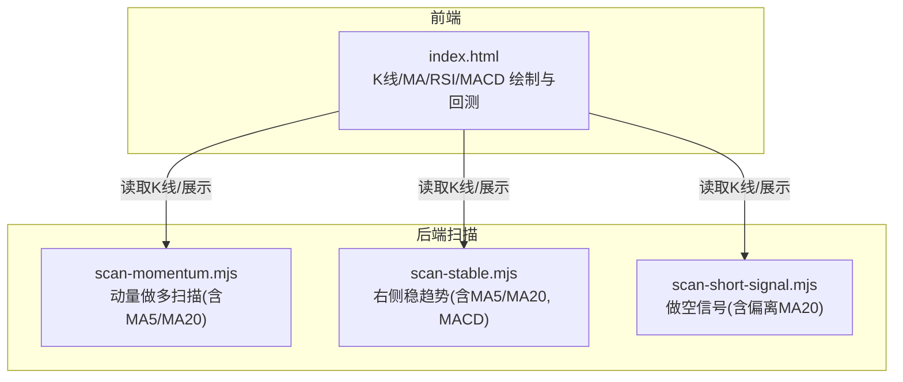
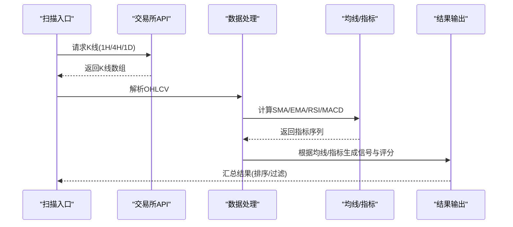
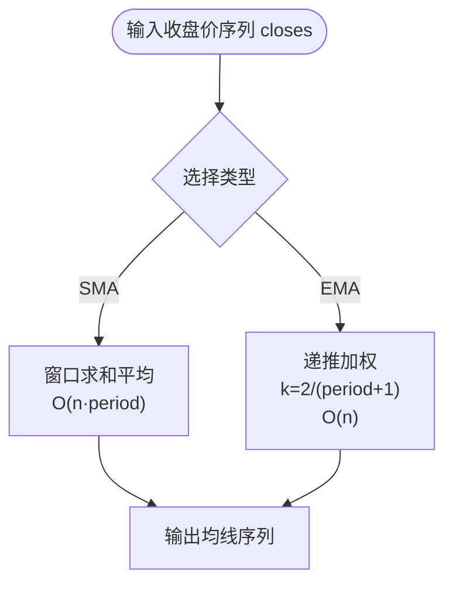
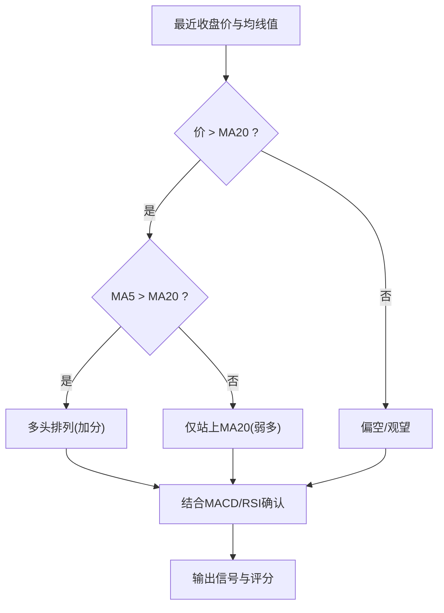
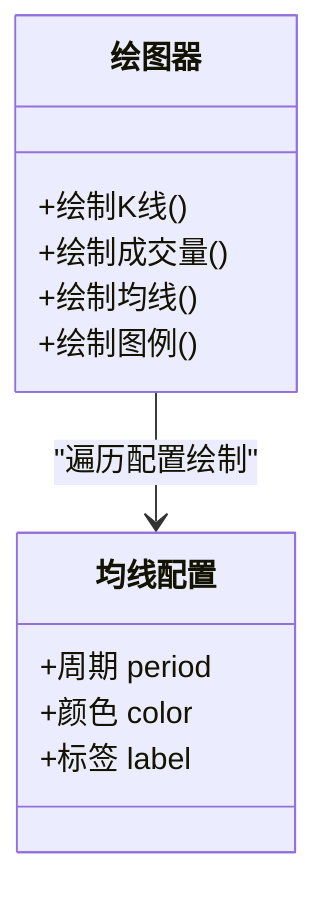
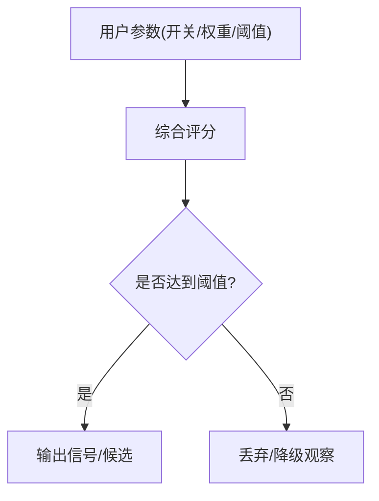
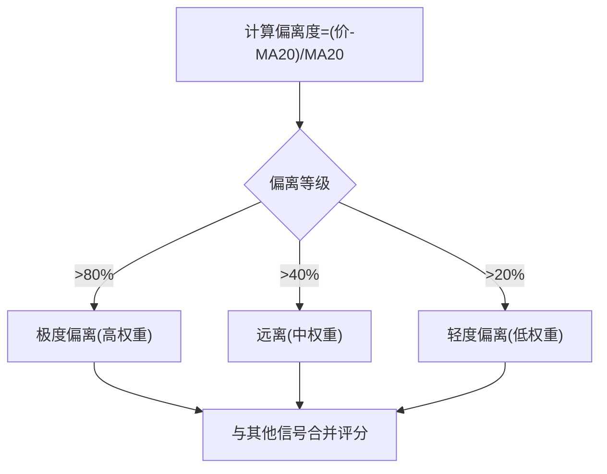
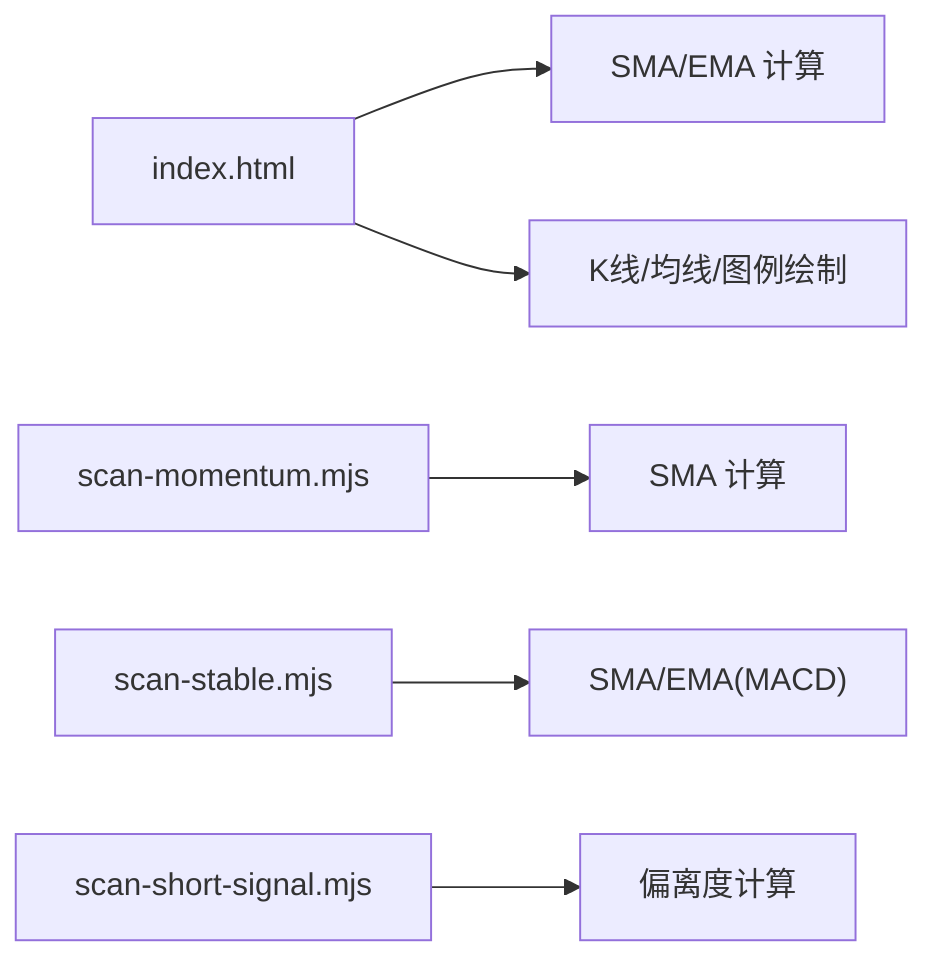
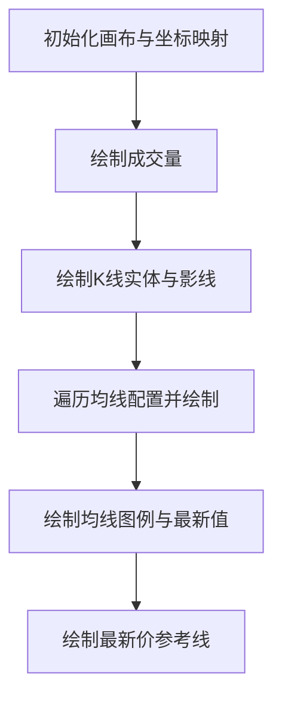
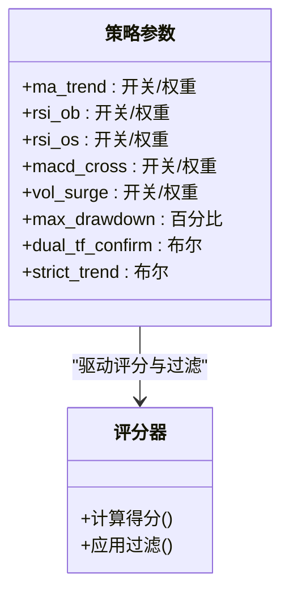

# 移动平均线指标

<cite>
**本文引用的文件**   
- [index.html](file://index.html)
- [scan-momentum.mjs](file://scan-momentum.mjs)
- [scan-stable.mjs](file://scan-stable.mjs)
- [scan-short-signal.mjs](file://scan-short-signal.mjs)
</cite>

## 目录
1. [简介](#简介)
2. [项目结构](#项目结构)
3. [核心组件](#核心组件)
4. [架构总览](#架构总览)
5. [详细组件分析](#详细组件分析)
6. [依赖关系分析](#依赖关系分析)
7. [性能与优化](#性能与优化)
8. [图表绘制与显示](#图表绘制与显示)
9. [配置与自定义](#配置与自定义)
10. [故障排查](#故障排查)
11. [结论](#结论)

## 简介
本文件围绕移动平均线（MA）指标，系统梳理仓库中简单移动平均线（SMA）、指数移动平均线（EMA）的实现方式，均线交叉信号识别逻辑、多周期叠加显示、动态参数调整、数据计算优化与缓存策略、实时更新机制，以及均线图表的绘制方法与颜色区分规则。文档同时给出可操作的自定义配置项与信号过滤设置建议，帮助读者在现有代码基础上扩展或集成更完善的均线体系。

## 项目结构
本项目为前端可视化与后端扫描脚本混合的工程：
- 前端可视化与回测交互集中在 index.html，包含 K 线图、RSI、MACD、均线绘制与基础回测框架。
- 后端扫描脚本位于若干 .mjs 文件中，提供动量、稳健趋势、做空信号等策略，其中大量使用 MA/RSI/MACD 等指标进行筛选与打分。

**图示来源** 
- [index.html:1540-1739](file://index.html#L1540-L1739)
- [scan-momentum.mjs:1-104](file://scan-momentum.mjs#L1-L104)
- [scan-stable.mjs:1-290](file://scan-stable.mjs#L1-L290)
- [scan-short-signal.mjs:1-276](file://scan-short-signal.mjs#L1-L276)

**章节来源**
- [index.html:1540-1739](file://index.html#L1540-L1739)
- [scan-momentum.mjs:1-104](file://scan-momentum.mjs#L1-L104)
- [scan-stable.mjs:1-290](file://scan-stable.mjs#L1-L290)
- [scan-short-signal.mjs:1-276](file://scan-short-signal.mjs#L1-L276)

## 核心组件
- SMA 实现
  - 前端：基于窗口求和的滑动窗口实现，时间复杂度 O(n·period)。
  - 后端：多处采用相同思路，用于快速判断价格相对均线的状态。
- EMA 实现
  - 前端：标准递推公式，系数 k=2/(period+1)，时间复杂度 O(n)。
  - 后端：在 MACD 内部复用 EMA 计算。
- 均线交叉信号
  - 多头排列：价>MA20 且 MA5>MA20。
  - 空头排列：价<MA20 且 MA5<MA20（在部分逻辑中以“偏离度”体现）。
  - MACD 金叉/死叉作为辅助确认。
- 多周期叠加
  - 前端默认叠加 MA5、MA20、MA60，并附带图例与最新值标注。
- 动态参数调整
  - 前端回测界面支持通过控件切换是否启用“均线趋势”条件及权重；也可在代码中扩展更多周期组合。
- 数据计算优化与缓存
  - 当前实现多为每帧/每次重算；可通过增量更新与滑动窗口累加减少重复计算。
- 实时更新机制
  - 前端绘图函数按新数据重绘；后端扫描以并发拉取K线并批量处理。

**章节来源**
- [index.html:1540-1557](file://index.html#L1540-L1557)
- [index.html:1640-1676](file://index.html#L1640-L1676)
- [scan-momentum.mjs:7-10](file://scan-momentum.mjs#L7-L10)
- [scan-stable.mjs:8-15](file://scan-stable.mjs#L8-L15)
- [scan-stable.mjs:36-48](file://scan-stable.mjs#L36-L48)
- [scan-short-signal.mjs:102-114](file://scan-short-signal.mjs#L102-L114)

## 架构总览
以下序列图展示了从获取K线到生成均线信号的典型流程（以后端扫描为例）：

**图示来源** 
- [scan-momentum.mjs:27-79](file://scan-momentum.mjs#L27-L79)
- [scan-stable.mjs:91-139](file://scan-stable.mjs#L91-L139)
- [scan-short-signal.mjs:28-204](file://scan-short-signal.mjs#L28-L204)

## 详细组件分析

### SMA 与 EMA 算法实现
- SMA（简单移动平均线）
  - 窗口内求和平均，适合平滑短期波动，但滞后性较强。
  - 前端与后端均采用窗口求和实现，便于理解与快速集成。
- EMA（指数移动平均线）
  - 对近期价格赋予更高权重，响应更快，常用于MACD等衍生指标。
  - 前端直接实现；后端在MACD中调用EMA子过程。

**图示来源** 
- [index.html:1540-1557](file://index.html#L1540-L1557)
- [scan-stable.mjs:36-48](file://scan-stable.mjs#L36-L48)

**章节来源**
- [index.html:1540-1557](file://index.html#L1540-L1557)
- [scan-stable.mjs:36-48](file://scan-stable.mjs#L36-L48)

### 均线交叉与趋势识别
- 多头排列：价格高于中长期均线，且短期均线在中长期均线上方。
- 空头排列：价格低于中长期均线，且短期均线在中长期均线下方（或以“偏离度”衡量）。
- 辅助确认：MACD 金叉/死叉、RSI 区间配合，降低假信号。

**图示来源** 
- [scan-momentum.mjs:41-46](file://scan-momentum.mjs#L41-L46)
- [scan-stable.mjs:101-108](file://scan-stable.mjs#L101-L108)
- [index.html:3341-3358](file://index.html#L3341-L3358)

**章节来源**
- [scan-momentum.mjs:41-46](file://scan-momentum.mjs#L41-L46)
- [scan-stable.mjs:101-108](file://scan-stable.mjs#L101-L108)
- [index.html:3341-3358](file://index.html#L3341-L3358)

### 多周期均线叠加显示
- 默认叠加 MA5、MA20、MA60，分别用不同颜色绘制，并在图例区显示最新值。
- 当数据长度不足时自动跳过对应周期，避免越界。

**图示来源** 
- [index.html:1640-1676](file://index.html#L1640-L1676)

**章节来源**
- [index.html:1640-1676](file://index.html#L1640-L1676)

### 动态参数调整与信号过滤
- 前端回测界面支持开关与权重调节：
  - “均线趋势”条件：开启后，若多头/空头排列则加分。
  - “RSI超买/超卖”、“MACD金叉/死叉”、“放量”等条件均可独立开关与赋权。
- 过滤阈值：
  - 最低得分门槛、最大回撤限制、双周期确认（如1H+1D）等。

**图示来源** 
- [index.html:3803-3829](file://index.html#L3803-L3829)
- [scan-stable.mjs:163-193](file://scan-stable.mjs#L163-L193)

**章节来源**
- [index.html:3803-3829](file://index.html#L3803-L3829)
- [scan-stable.mjs:163-193](file://scan-stable.mjs#L163-L193)

### 偏离度与极端位置检测
- 做空信号中对“偏离MA20”的幅度分级计分，用于捕捉暴涨后的均值回归机会。
- 同时结合成交量、RSI、K线形态等多维证据，避免追涨杀跌。

**图示来源** 
- [scan-short-signal.mjs:102-114](file://scan-short-signal.mjs#L102-L114)

**章节来源**
- [scan-short-signal.mjs:102-114](file://scan-short-signal.mjs#L102-L114)

## 依赖关系分析
- 前端 index.html 自包含 SMA/EMA 计算与绘图逻辑，不依赖外部库。
- 后端扫描脚本各自独立，按需引入代理与通用工具，指标计算内聚于模块内。
- 各模块之间通过统一的K线数据结构（OHLCV）进行协作。

**图示来源** 
- [index.html:1540-1557](file://index.html#L1540-L1557)
- [scan-momentum.mjs:7-10](file://scan-momentum.mjs#L7-L10)
- [scan-stable.mjs:8-15](file://scan-stable.mjs#L8-L15)
- [scan-stable.mjs:36-48](file://scan-stable.mjs#L36-L48)
- [scan-short-signal.mjs:102-114](file://scan-short-signal.mjs#L102-L114)

**章节来源**
- [index.html:1540-1557](file://index.html#L1540-L1557)
- [scan-momentum.mjs:7-10](file://scan-momentum.mjs#L7-L10)
- [scan-stable.mjs:8-15](file://scan-stable.mjs#L8-L15)
- [scan-stable.mjs:36-48](file://scan-stable.mjs#L36-L48)
- [scan-short-signal.mjs:102-114](file://scan-short-signal.mjs#L102-L114)

## 性能与优化
- 计算复杂度
  - SMA：O(n·period)，适合短周期；长周期可改用增量求和将复杂度降至 O(n)。
  - EMA：O(n)，已是最优线性复杂度。
- 缓存策略
  - 对频繁使用的均线序列（如 MA5/MA20/MA60）可在内存中缓存，仅在新增K线时增量更新。
  - 对于滑动窗口求和，维护窗口总和与进出元素，避免重复求和。
- 并发与批处理
  - 后端扫描使用并发拉取与并行处理，显著缩短整体耗时。
- 渲染优化
  - 前端绘图前统一计算坐标映射，避免重复换算；必要时使用离屏缓冲或分片绘制。

[本节为通用指导，无需具体文件引用]

## 图表绘制与显示
- K线与成交量
  - 先绘制成交量柱状图，再绘制K线实体与影线，确保视觉层次清晰。
- 均线绘制
  - 遍历配置的均线周期，逐点连线；若数据不足则跳过该周期。
- 图例与最新值
  - 在左上角绘制图例条与最新值，数值精度随价格量级自适应。
- 最新价参考线
  - 以虚线标注最新收盘价，便于直观对比均线位置。

**图示来源** 
- [index.html:1559-1727](file://index.html#L1559-L1727)

**章节来源**
- [index.html:1559-1727](file://index.html#L1559-L1727)

## 配置与自定义
- 均线周期与颜色
  - 可在均线配置数组中添加新的周期与颜色，例如加入 MA10、MA120 等。
- 信号开关与权重
  - 通过前端控件控制“均线趋势”“RSI超买/超卖”“MACD金叉/死叉”“放量”等条件的启用与权重。
- 过滤阈值
  - 设置最低得分、最大回撤、双周期确认、严格趋势模式等，以适配不同风险偏好。

**图示来源** 
- [index.html:3803-3829](file://index.html#L3803-L3829)
- [scan-stable.mjs:163-193](file://scan-stable.mjs#L163-L193)

**章节来源**
- [index.html:3803-3829](file://index.html#L3803-L3829)
- [scan-stable.mjs:163-193](file://scan-stable.mjs#L163-L193)

## 故障排查
- 数据不足导致均线为空
  - 现象：均线未绘制或最新值为空。
  - 原因：历史K线数量小于周期。
  - 处理：增加拉取的K线数量或降低周期。
- 均线交叉频繁触发
  - 现象：信号抖动严重。
  - 处理：引入双周期确认、提高得分门槛、加入趋势过滤（严格模式）。
- 偏离度误判
  - 现象：单边行情下偏离度持续高位。
  - 处理：结合成交量与RSI进行二次过滤，避免逆势操作。

**章节来源**
- [index.html:1647-1650](file://index.html#L1647-L1650)
- [scan-stable.mjs:163-193](file://scan-stable.mjs#L163-L193)
- [scan-short-signal.mjs:102-114](file://scan-short-signal.mjs#L102-L114)

## 结论
本项目在前端与后端均实现了实用的均线计算与信号识别能力：前端提供直观的K线/均线/指标叠加与回测交互，后端提供多策略扫描与并发处理。建议在现有基础上引入增量更新与滑动窗口优化，完善均线缓存与实时推送机制，并通过多周期与多维指标的组合提升信号稳定性与鲁棒性。