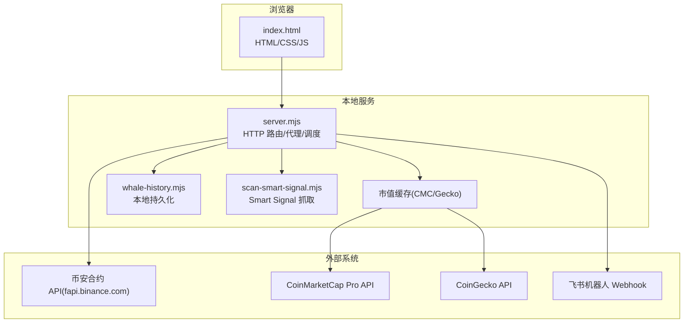
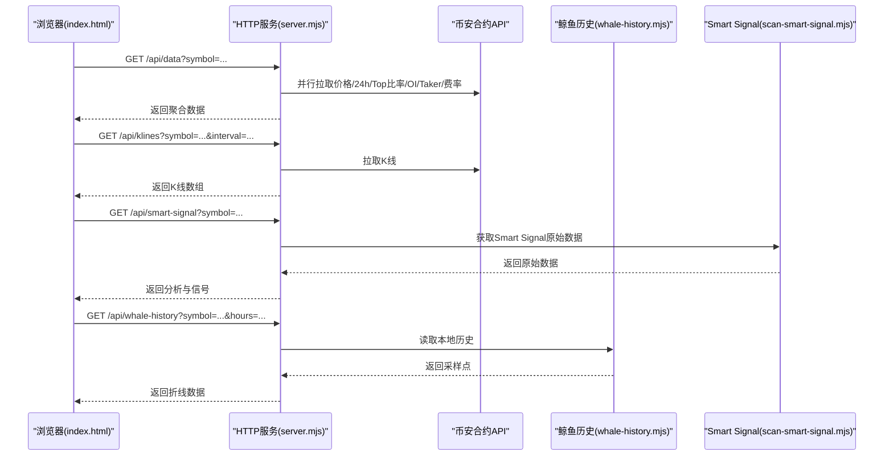
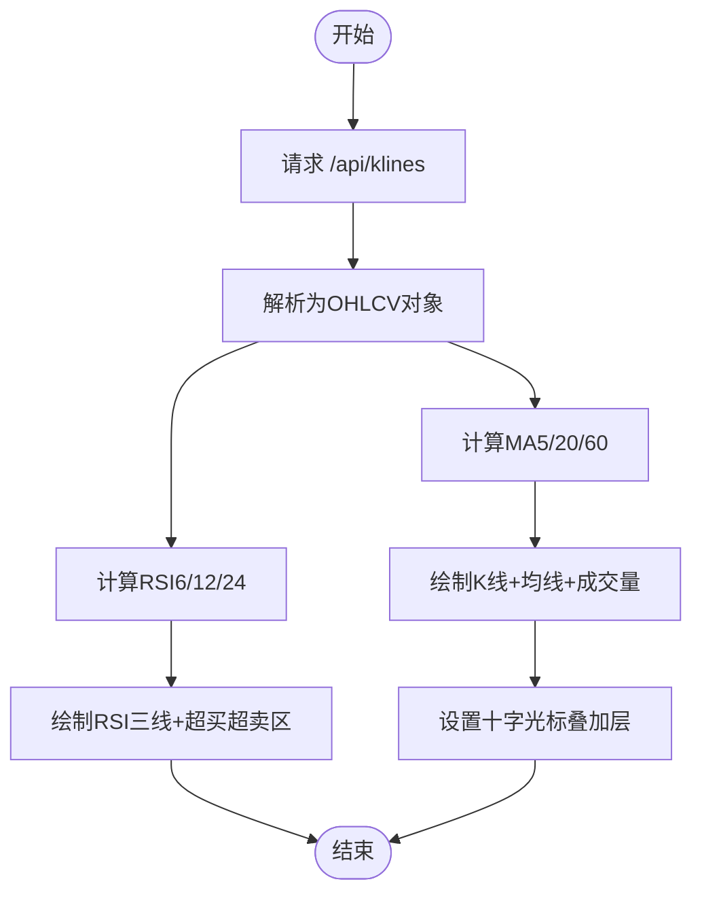
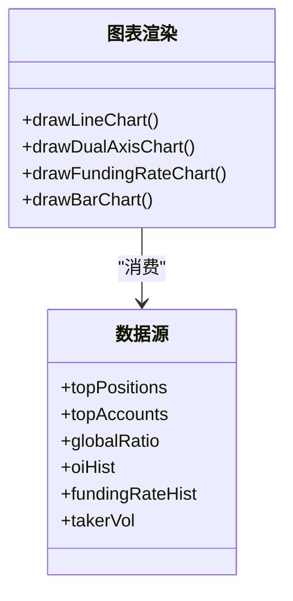
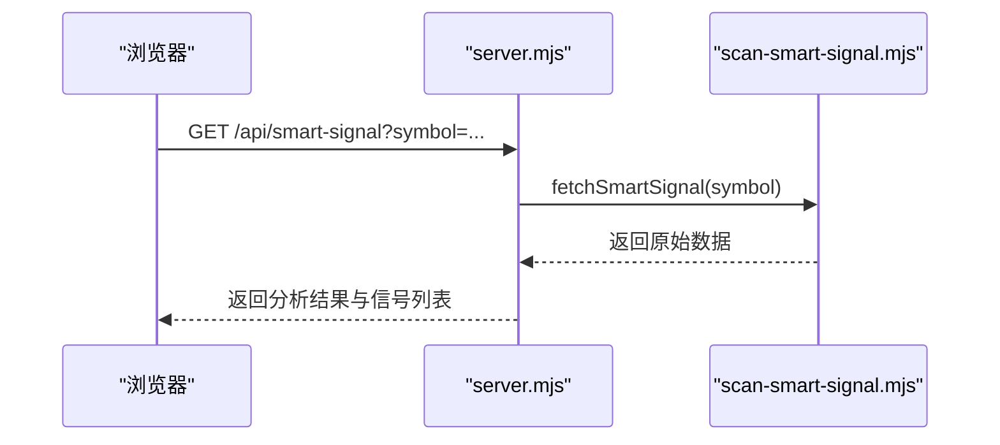
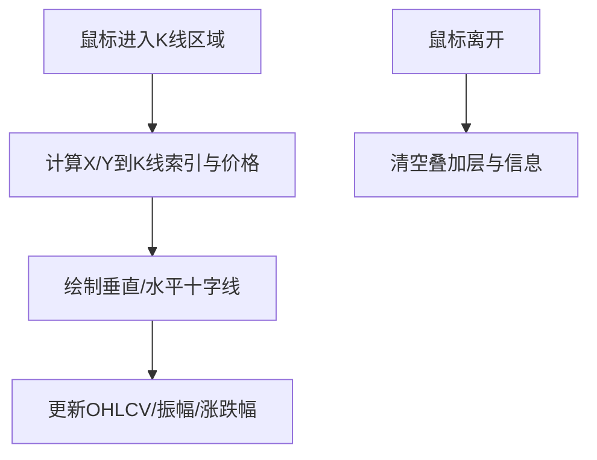
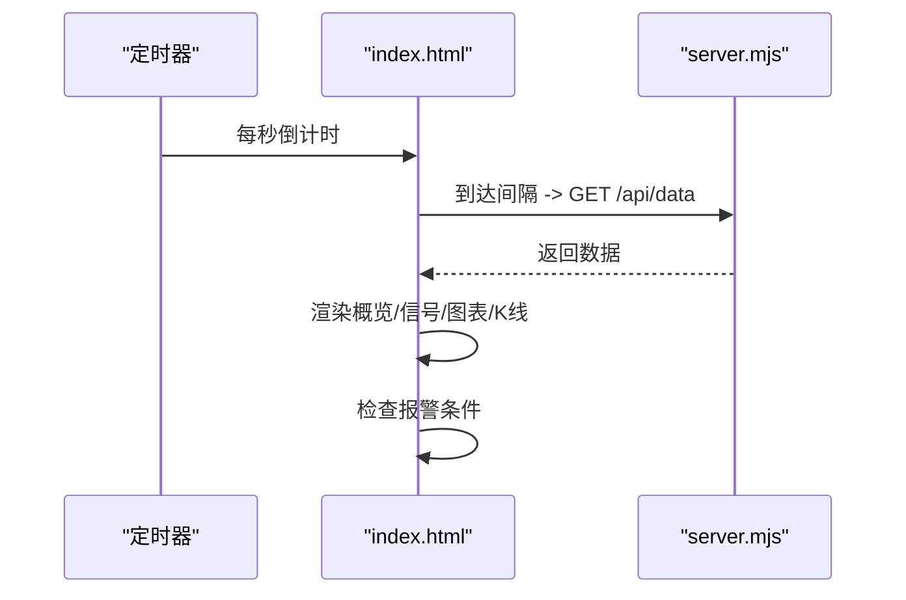
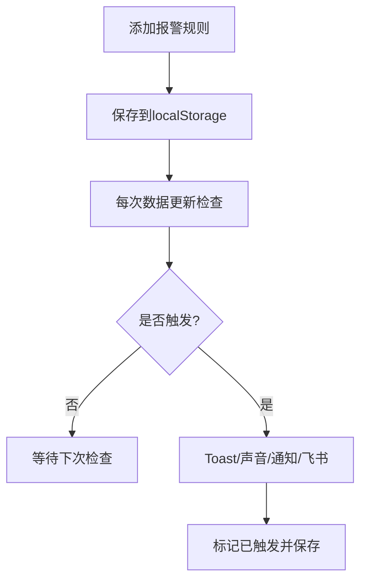
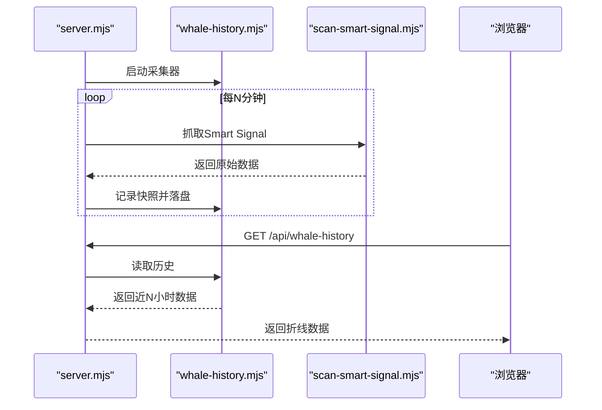
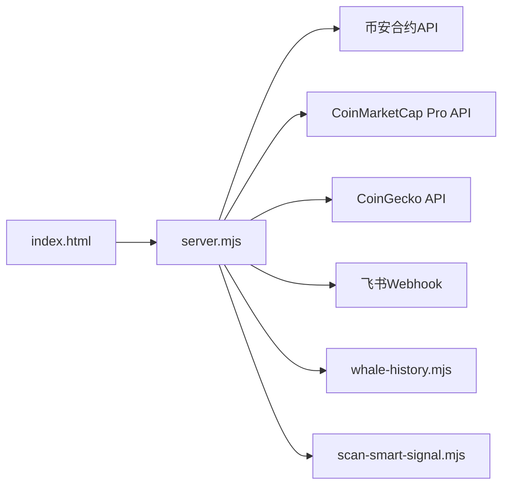

# Web监控面板

<cite>
**本文引用的文件**
- [index.html](file://index.html)
- [server.mjs](file://server.mjs)
- [README.md](file://README.md)
- [package.json](file://package.json)
- [whale-history.mjs](file://whale-history.mjs)
- [scan-smart-signal.mjs](file://scan-smart-signal.mjs)
</cite>

## 目录
1. [简介](#简介)
2. [项目结构](#项目结构)
3. [核心组件](#核心组件)
4. [架构总览](#架构总览)
5. [详细组件分析](#详细组件分析)
6. [依赖关系分析](#依赖关系分析)
7. [性能与体验优化](#性能与体验优化)
8. [故障排查指南](#故障排查指南)
9. [结论](#结论)
10. [附录：配置与扩展](#附录配置与扩展)

## 简介
本仓库提供基于币安合约 API 的“聪明钱”监控工具，包含 Web 面板与终端两种使用方式。Web 面板聚焦于实时数据展示与交互，涵盖 K 线图、RSI 指标、十字光标、聪明钱分析图表、信号摘要等核心界面元素，并通过后端代理访问交易所接口，实现跨域与统一鉴权/限流控制。

## 项目结构
- 前端单页应用（SPA）：所有页面逻辑、样式与脚本集中在 index.html，通过原生 Canvas 绘制图表，零第三方 UI 库依赖。
- 后端服务：Node.js 原生 HTTP 服务器 server.mjs，负责静态资源托管、代理币安合约 API、聚合多源数据、定时推送与策略复盘。
- 辅助模块：鲸鱼历史采集、Smart Signal 抓取、市值过滤、TradFi 排除、策略复盘、持仓健康等。

**图示来源**
- [server.mjs:1490-2117](file://server.mjs#L1490-L2117)
- [whale-history.mjs:1-141](file://whale-history.mjs#L1-L141)
- [scan-smart-signal.mjs:41-78](file://scan-smart-signal.mjs#L41-L78)

**章节来源**
- [README.md:1-210](file://README.md#L1-L210)
- [package.json:1-22](file://package.json#L1-L22)

## 核心组件
- 行情概览与信号摘要：价格、24h 成交额、大户多空比、资金费率、OI 等关键指标卡片；自动提炼多头/空头信号与聪明钱抄底提示。
- K 线与 RSI：K 线叠加 MA5/MA20/MA60 均线与成交量柱状图；RSI(6/12/24)三线与超买超卖区高亮。
- 十字光标：悬浮显示 OHLCV、振幅、涨跌幅等详情。
- 聪明钱分析图表：大户持仓多空比、账户维度多空比对比、OI 与价格双轴、资金费率趋势、主动买卖量柱状图及买卖比曲线。
- Smart Signal 面板：聚合高收益交易员与鲸鱼信息，输出方向判断与明细信号。
- 报警系统：支持价格突破/跌破、RSI 阈值、大户翻多/空、买卖激增等条件，触发后弹窗、声音与可选飞书推送。
- 右侧稳趋势扫描与推送：定时筛选符合“右侧稳趋势”条件的币种并推送到飞书。
- 策略管理与回测：可编辑策略条件、权重，进行简单回测与结果展示。
- 模拟自动交易：可视化交易面板、日志、收益曲线。
- 持仓健康：评估用户持仓风险与健康度，给出建议动作。

**章节来源**
- [index.html:1-800](file://index.html#L1-L800)
- [index.html:801-1600](file://index.html#L801-L1600)
- [index.html:1601-2400](file://index.html#L1601-L2400)
- [index.html:4069-4178](file://index.html#L4069-L4178)

## 架构总览
前端通过同源请求访问 /api/* 路由，由 Node 服务统一代理至币安合约 API 或第三方数据源，并对 Smart Signal 等外部接口做熔断与限流保护。部分数据（如鲸鱼历史）在本地持久化，供前端按需拉取。

**图示来源**
- [server.mjs:1750-1816](file://server.mjs#L1750-L1816)
- [whale-history.mjs:112-141](file://whale-history.mjs#L112-L141)
- [scan-smart-signal.mjs:41-78](file://scan-smart-signal.mjs#L41-L78)

## 详细组件分析

### K 线图与 RSI 指标
- 渲染流程：从 /api/klines 拉取最近 N 根 K 线，计算 MA5/MA20/MA60 与 RSI(6/12/24)，分别绘制到两个 Canvas。
- 视觉增强：最新价虚线、资金费率事件标记、成交量半透明柱、网格与坐标轴自适应。
- 交互：十字光标叠加层，鼠标移动时绘制十字线与 OHLCV 信息条。

**图示来源**
- [index.html:1559-1727](file://index.html#L1559-L1727)
- [index.html:1729-1807](file://index.html#L1729-L1807)
- [index.html:1809-1836](file://index.html#L1809-L1836)
- [index.html:4069-4178](file://index.html#L4069-L4178)

**章节来源**
- [index.html:1559-1727](file://index.html#L1559-L1727)
- [index.html:1729-1807](file://index.html#L1729-L1807)
- [index.html:1809-1836](file://index.html#L1809-L1836)
- [index.html:4069-4178](file://index.html#L4069-L4178)

### 聪明钱分析图表
- 大户持仓多空比：时间序列折线，突出当前值。
- 大户 vs 全网多空比：双线对比，便于观察分歧。
- OI 与价格双轴：主图 OI 变化率柱状 + 价格折线，右轴标注价格。
- 资金费率趋势：正负柱体 + 累计费率曲线。
- 主动买卖量：买入/卖出柱状 + 买卖比曲线（1.0 基准线）。

**图示来源**
- [index.html:1089-1168](file://index.html#L1089-L1168)
- [index.html:1193-1324](file://index.html#L1193-L1324)
- [index.html:1326-1416](file://index.html#L1326-L1416)
- [index.html:1418-1513](file://index.html#L1418-L1513)
- [index.html:2095-2249](file://index.html#L2095-L2249)

**章节来源**
- [index.html:1089-1168](file://index.html#L1089-L1168)
- [index.html:1193-1324](file://index.html#L1193-L1324)
- [index.html:1326-1416](file://index.html#L1326-L1416)
- [index.html:1418-1513](file://index.html#L1418-L1513)
- [index.html:2095-2249](file://index.html#L2095-L2249)

### 信号摘要与 Smart Signal 面板
- 信号摘要：综合大户多空比、全网多空比、主动买卖比与资金费率，生成简明要点。
- Smart Signal 面板：调用 /api/smart-signal，后端聚合高收益交易者与鲸鱼数据，输出方向标签、评分与明细信号。

**图示来源**
- [server.mjs:1784-1801](file://server.mjs#L1784-L1801)
- [scan-smart-signal.mjs:41-78](file://scan-smart-signal.mjs#L41-L78)
- [index.html:1050-1087](file://index.html#L1050-L1087)

**章节来源**
- [index.html:1020-1048](file://index.html#L1020-L1048)
- [index.html:1050-1087](file://index.html#L1050-L1087)
- [server.mjs:1784-1801](file://server.mjs#L1784-L1801)
- [scan-smart-signal.mjs:41-78](file://scan-smart-signal.mjs#L41-L78)

### 十字光标功能
- 机制：在 K 线 Canvas 上方叠加一个透明 Canvas，监听鼠标移动，根据坐标映射到最近 K 线索引，绘制十字线与 OHLCV 信息。
- 细节：动态计算价格轴范围，适配不同价位精度；离开区域自动清除。

**图示来源**
- [index.html:4069-4178](file://index.html#L4069-L4178)

**章节来源**
- [index.html:4069-4178](file://index.html#L4069-L4178)

### 实时数据更新与轮询
- 前端定时器：按 interval 秒轮询 /api/data，更新概览、信号、图表与 K 线。
- 状态反馈：顶部状态点与错误提示，部分指标失败时降级显示。
- URL 同步：切换币种与刷新间隔会同步到 URL 参数。

**图示来源**
- [index.html:2267-2313](file://index.html#L2267-L2313)
- [index.html:2350-2367](file://index.html#L2350-L2367)

**章节来源**
- [index.html:2267-2313](file://index.html#L2267-L2313)
- [index.html:2350-2367](file://index.html#L2350-L2367)

### 报警系统与通知
- 条件类型：价格突破/跌破、RSI6 阈值、大户翻多/空、主动买卖激增。
- 触发行为：本地 Toast 弹窗、浏览器通知（需授权）、可选声音提醒、可选飞书推送。
- 存储：localStorage 持久化报警规则与触发状态。

**图示来源**
- [index.html:822-938](file://index.html#L822-L938)
- [index.html:869-891](file://index.html#L869-L891)

**章节来源**
- [index.html:822-938](file://index.html#L822-L938)
- [index.html:869-891](file://index.html#L869-L891)

### 鲸鱼历史与 Smart Signal 趋势
- 采集：服务端每固定间隔抓取 Smart Signal 数据，写入 data/whale-history.json。
- 查询：前端按 symbol 与 hours 拉取，用于绘制“鲸鱼多空趋势”折线。
- 容错：网络异常或限流时降级为空数据，提示“采集中”。

**图示来源**
- [whale-history.mjs:112-141](file://whale-history.mjs#L112-L141)
- [server.mjs:1803-1816](file://server.mjs#L1803-L1816)
- [index.html:2095-2107](file://index.html#L2095-L2107)

**章节来源**
- [whale-history.mjs:112-141](file://whale-history.mjs#L112-L141)
- [server.mjs:1803-1816](file://server.mjs#L1803-L1816)
- [index.html:2095-2107](file://index.html#L2095-L2107)

## 依赖关系分析
- 前端依赖：仅 HTML/CSS/Canvas 与原生 Fetch，无第三方 UI 库，利于轻量部署与快速加载。
- 后端依赖：Node.js 原生 http/fs/promises，零运行时依赖；通过环境变量加载 .env。
- 外部依赖：币安合约 REST API、CoinMarketCap Pro API（可选）、CoinGecko（回退）、飞书 Webhook。

**图示来源**
- [server.mjs:1490-2117](file://server.mjs#L1490-L2117)
- [whale-history.mjs:1-141](file://whale-history.mjs#L1-L141)
- [scan-smart-signal.mjs:41-78](file://scan-smart-signal.mjs#L41-L78)

**章节来源**
- [README.md:200-210](file://README.md#L200-L210)
- [package.json:1-22](file://package.json#L1-L22)

## 性能与体验优化
- 渲染优化
  - 使用 devicePixelRatio 提升清晰度，避免模糊。
  - 将重绘放入 requestAnimationFrame，减少布局抖动。
  - 图表网格与刻度按需绘制，降低文本测量开销。
- 数据获取优化
  - 批量合并请求（handleAPI 并行拉取多项指标），减少往返次数。
  - ticker/24hr 短 TTL 缓存与并发去重，避免重复请求。
  - 市值缓存优先 CMC，失败回退 CoinGecko，TTL 控制刷新频率。
- 交互优化
  - 十字光标仅在可见区域内绘制，离开即清理。
  - 轮询倒计时与状态点，明确刷新节奏。
  - 响应式布局适配移动端，折叠/展开控制信息密度。
- 可扩展性
  - 纯函数绘图与数据解耦，便于替换或新增指标。
  - 路由清晰，新增 API 只需在 server.mjs 中注册。

[本节为通用指导，不直接分析具体文件]

## 故障排查指南
- 端口占用
  - 现象：启动报 EADDRINUSE。
  - 处理：使用 dev:restart 自动释放端口，或手动 kill 占用进程。
- 跨域与代理
  - 现象：浏览器控制台报 CORS 错误。
  - 处理：确保通过 /api/* 访问，不要直连交易所域名。
- Smart Signal 限流
  - 现象：418/429/403 或“熔断”提示。
  - 处理：等待重试间隔，必要时配置代理或降低频率。
- 市值过滤
  - 现象：大盘币被拒绝或不在监控范围。
  - 处理：调整 MAX_MARKET_CAP_USD 或关闭过滤。
- 飞书推送未生效
  - 现象：点击推送按钮失败。
  - 处理：确认 FEISHU_WEBHOOK 已配置且可用。

**章节来源**
- [README.md:40-77](file://README.md#L40-L77)
- [server.mjs:1516-1532](file://server.mjs#L1516-L1532)
- [server.mjs:1736-1748](file://server.mjs#L1736-L1748)
- [scan-smart-signal.mjs:41-78](file://scan-smart-signal.mjs#L41-L78)

## 结论
该 Web 监控面板以极简的前端技术栈实现了丰富的量化与聪明钱分析能力，配合后端代理与定时任务，形成稳定、可扩展的一体化解决方案。通过合理的缓存、并发与渲染优化，兼顾了实时性与用户体验。

[本节为总结性内容，不直接分析具体文件]

## 附录：配置与扩展

### 自定义配置选项与环境变量
- 端口与代理
  - PORT：服务监听端口
  - HTTPS_PROXY：Smart Signal 代理地址（可选）
- 市值相关
  - CMC_API_KEY：CoinMarketCap Pro Key（可选）
  - MAX_MARKET_CAP_USD：市值上限（美元），0 表示关闭过滤
- 推送与扫描
  - FEISHU_WEBHOOK：飞书机器人 Webhook
  - STABLE_PUSH_HOURS / LONG_PUSH_HOURS / DUMP_PUSH_HOURS：推送周期
  - STABLE_SCAN_LIMIT / LONG_SCAN_LIMIT / DUMP_SCAN_LIMIT：扫描数量
  - STABLE_MAX_DRAWDOWN：最大回撤阈值
- 鲸鱼历史
  - WHALE_HISTORY_INTERVAL_MIN：采集间隔（分钟）
  - WHALE_HISTORY_MAX_POINTS：最大保留点数
  - WHALE_HISTORY_SYMBOLS：默认监控币种（逗号分隔）

**章节来源**
- [README.md:142-154](file://README.md#L142-L154)
- [server.mjs:540-589](file://server.mjs#L540-L589)
- [whale-history.mjs:10-16](file://whale-history.mjs#L10-L16)

### 主题与样式定制
- 通过 CSS 变量统一控制背景、卡片、边框、文字与涨跌色，可在 <style> 中修改 :root 变量实现换肤。
- 响应式断点已在样式中定义，可按需调整小屏布局。

**章节来源**
- [index.html:8-121](file://index.html#L8-L121)

### 浏览器兼容性说明
- 现代浏览器均可运行，依赖 Canvas、Fetch、AudioContext、Notification 等标准 API。
- 如需旧版兼容，可引入 polyfill 或降级方案（例如用图片替代 Canvas）。

[本节为通用指导，不直接分析具体文件]

### 开发指南：界面定制与扩展
- 新增指标图表
  - 在 index.html 中添加新 Canvas 容器与标题。
  - 新增 drawXXXChart 函数，复用 drawLineChart/drawDualAxisChart 等基础绘制方法。
  - 在 renderCharts 中接入数据并调用绘制函数。
- 新增后端 API
  - 在 server.mjs 中增加 if (url.pathname === '/api/xxx') 分支，封装业务逻辑并返回 JSON。
  - 若涉及外部 API，注意超时、重试与限流处理。
- 扩展报警类型
  - 在 ALERT_LABELS 与 checkAlerts/checkRSIAlerts 中补充条件与消息模板。
  - 在 UI 表单中增加对应选项。

**章节来源**
- [index.html:1089-1168](file://index.html#L1089-L1168)
- [index.html:2095-2249](file://index.html#L2095-L2249)
- [server.mjs:1750-1816](file://server.mjs#L1750-L1816)
- [index.html:822-938](file://index.html#L822-L938)