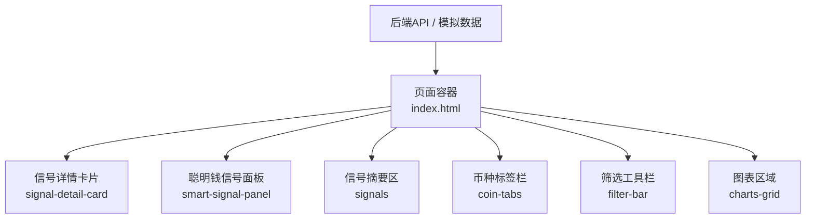
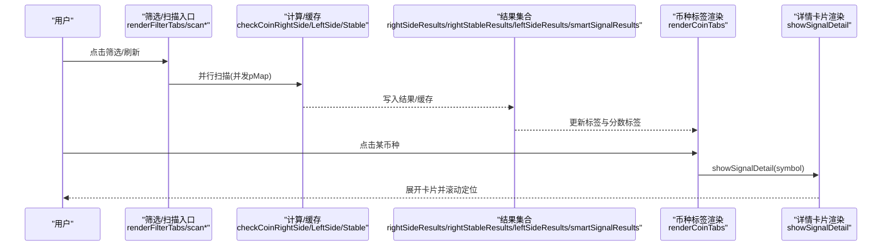
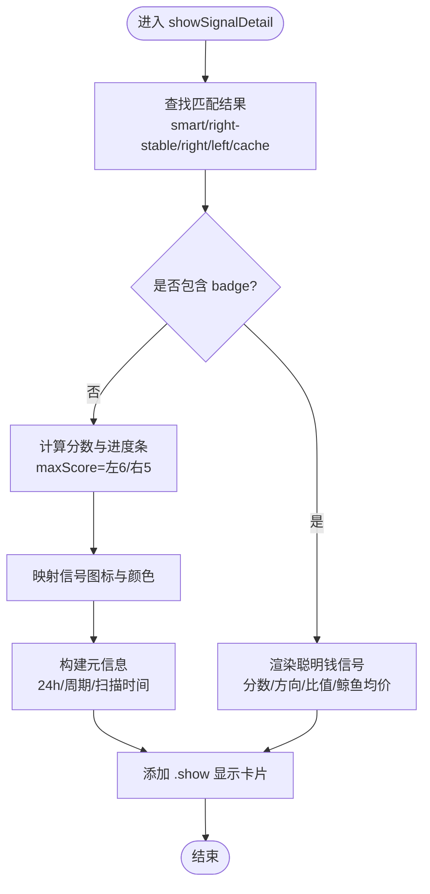
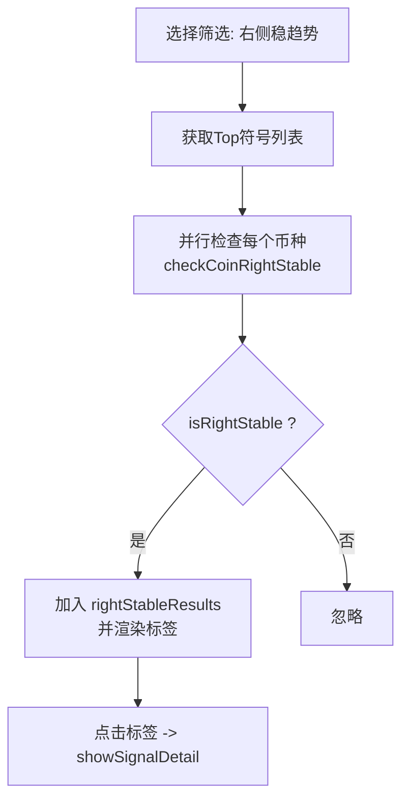
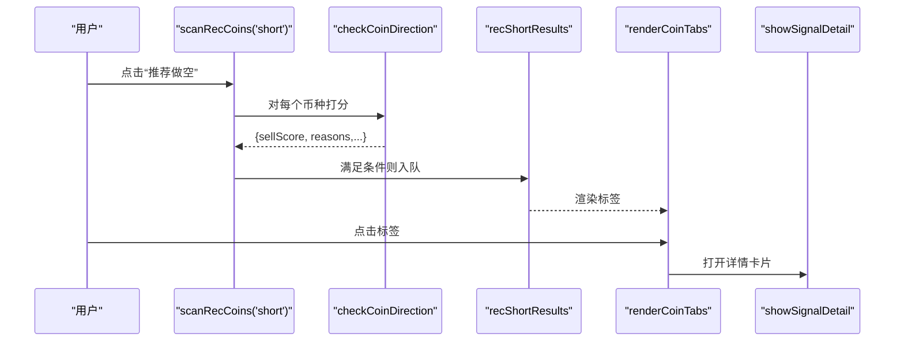
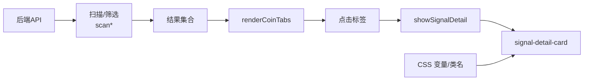

# 信号卡片组件

<cite>
**本文引用的文件**   
- [index.html](file://index.html)
- [smart-trend-push-mock.json](file://data/smart-trend-push-mock.json)
</cite>

## 目录
1. [简介](#简介)
2. [项目结构](#项目结构)
3. [核心组件](#核心组件)
4. [架构总览](#架构总览)
5. [详细组件分析](#详细组件分析)
6. [依赖关系分析](#依赖关系分析)
7. [性能与体验](#性能与体验)
8. [故障排查](#故障排查)
9. [结论](#结论)
10. [附录：样式与扩展指南](#附录样式与扩展指南)

## 简介
本文件聚焦“信号卡片组件”，系统化说明稳趋势信号、做空信号、做多信号的卡片展示样式与交互逻辑，并解释评分系统、置信度指示器、时间戳显示与状态标识的实现方式。同时给出颜色编码规则、图标语义、响应式适配策略，以及自定义信号类型扩展方法与样式定制指南。

## 项目结构
本项目为单页应用，前端逻辑集中在 index.html 中，包含 CSS 样式、HTML 结构与 JavaScript 渲染/交互逻辑；数据侧通过服务端 API 获取，部分示例数据位于 data 目录。

图示来源
- [index.html:268-301](file://index.html#L268-L301)
- [index.html:178-196](file://index.html#L178-L196)
- [index.html:559](file://index.html#L559)

章节来源
- [index.html:268-301](file://index.html#L268-L301)
- [index.html:178-196](file://index.html#L178-L196)
- [index.html:559](file://index.html#L559)

## 核心组件
- 信号详情卡片（signal-detail-card）
  - 用于展示右侧/左侧/稳趋势/聪明钱等信号的综合详情，包括标题、评分条、分项信号列表、元信息（24h涨跌幅、周期、扫描时间等）。
- 聪明钱信号面板（smart-signal-panel）
  - 聚合币安聪明钱信号，展示方向徽章、比值、鲸鱼均价、盈利方统计与分项信号。
- 信号摘要区（signals）
  - 快速汇总大户持仓多空比、全网多空比、主动买卖量、资金费率等关键信号点。
- 币种标签栏（coin-tabs）
  - 展示候选币种及评分标签，点击可切换当前币种并打开对应信号详情卡片。
- 筛选工具栏（filter-bar）
  - 提供过滤维度（如右侧交易、右侧稳趋势、左侧交易、推荐做多/做空、聪明钱信号等）、周期选择、范围与排序控制。

章节来源
- [index.html:268-301](file://index.html#L268-L301)
- [index.html:183-196](file://index.html#L183-L196)
- [index.html:178-196](file://index.html#L178-L196)
- [index.html:2700-2711](file://index.html#L2700-L2711)
- [index.html:2917-3034](file://index.html#L2917-L3034)

## 架构总览
信号卡片的数据流从筛选/扫描入口开始，经计算或接口返回后，由渲染函数组装到 DOM，用户交互触发卡片展开与滚动定位。

图示来源
- [index.html:3615-3652](file://index.html#L3615-L3652)
- [index.html:3654-3689](file://index.html#L3654-L3689)
- [index.html:3705-3742](file://index.html#L3705-L3742)
- [index.html:3955-4001](file://index.html#L3955-L4001)
- [index.html:2713-2723](file://index.html#L2713-L2723)
- [index.html:2725-2804](file://index.html#L2725-L2804)

## 详细组件分析

### 信号详情卡片（signal-detail-card）
- 结构与样式
  - 容器类名 signal-detail-card，默认隐藏，添加 .show 后以淡入上滑动画出现。
  - 头部 sd-header 含标题与关闭按钮；评分区 sd-score 含数值与进度条 sd-score-bar/sd-score-fill；信号项网格 sd-signals 使用两列布局；元信息区 sd-meta 显示 24h 涨跌、周期、扫描时间等。
  - 移动端在 ≤768px 时，sd-signals 改为单列布局，内边距缩小以提升可读性。
- 数据绑定与渲染
  - 当存在 badge 字段时，走“聪明钱信号”分支：显示分数、净多/净空方向、比值、鲸鱼均价等。
  - 否则走“右侧/左侧信号分析”分支：根据 isLeftSide 决定最大分值（左6/右5），计算百分比进度条，并输出描述文案（如“强势右侧”“深度超跌”等）。
  - 每项信号文本以首字符作为图标映射：✓ 绿色、✗ 红色、⚠ 黄色、◐ 黄偏中性、其余灰色。
  - 元信息包含 24h 涨跌幅、周期 filterTF、扫描时间 ts（本地化时间）。
- 交互逻辑
  - 点击币种标签触发 selectRightCoin → changeSymbol → showSignalDetail → 自动滚动至卡片顶部。
  - 关闭按钮 closeSignalDetail 移除 .show 类隐藏卡片。

图示来源
- [index.html:2725-2804](file://index.html#L2725-L2804)
- [index.html:2713-2723](file://index.html#L2713-L2723)
- [index.html:2806-2808](file://index.html#L2806-L2808)

章节来源
- [index.html:268-301](file://index.html#L268-L301)
- [index.html:2725-2804](file://index.html#L2725-L2804)
- [index.html:2713-2723](file://index.html#L2713-L2723)
- [index.html:2806-2808](file://index.html#L2806-L2808)

### 稳趋势信号（右侧稳趋势 right_stable）
- 判定流程
  - 先执行右侧基础判断 checkCoinRightSide（均线多头排列、RSI 区间、MACD 多头、放量等），得到 score 与 signals。
  - 再叠加回撤与趋势完整性校验 analyzeTfDrawdownTrend，支持单周期或双周期确认（1H+1D）。
  - 所有周期均通过则标记 isRightStable=true，并记录 drawdown/tfResults 等元信息。
- 展示要点
  - 在 coin-tab 上以小字显示 “x/5” 分数标签，颜色随分数变化。
  - 点击后进入信号详情卡片，显示右侧稳趋势的完整信号明细与元信息。

图示来源
- [index.html:3654-3689](file://index.html#L3654-L3689)
- [index.html:3469-3499](file://index.html#L3469-L3499)
- [index.html:3325-3414](file://index.html#L3325-L3414)
- [index.html:3446-3467](file://index.html#L3446-L3467)
- [index.html:2700-2711](file://index.html#L2700-L2711)
- [index.html:2713-2723](file://index.html#L2713-L2723)

章节来源
- [index.html:3654-3689](file://index.html#L3654-L3689)
- [index.html:3469-3499](file://index.html#L3469-L3499)
- [index.html:3325-3414](file://index.html#L3325-L3414)
- [index.html:3446-3467](file://index.html#L3446-L3467)
- [index.html:2700-2711](file://index.html#L2700-L2711)
- [index.html:2713-2723](file://index.html#L2713-L2723)

### 做空信号（推荐做空 rec_short）
- 生成逻辑
  - 遍历 Top 符号，调用 checkCoinDirection 综合打分（MA/EMA/RSI/MACD/布林/量能/OI/费率/聪明钱指标/形态等），分别累计 buyScore 与 sellScore。
  - 若 sellScore ≥ 3 且 sellScore > buyScore，则纳入 recShortResults。
- 展示与交互
  - 筛选标签 rec_short 下按分数降序展示，点击后同样进入信号详情卡片。

图示来源
- [index.html:4019-4061](file://index.html#L4019-L4061)
- [index.html:3763-3930](file://index.html#L3763-L3930)
- [index.html:2713-2723](file://index.html#L2713-L2723)
- [index.html:2725-2804](file://index.html#L2725-L2804)

章节来源
- [index.html:4019-4061](file://index.html#L4019-L4061)
- [index.html:3763-3930](file://index.html#L3763-L3930)
- [index.html:2713-2723](file://index.html#L2713-L2723)
- [index.html:2725-2804](file://index.html#L2725-L2804)

### 做多信号（推荐做多 rec_long）
- 生成逻辑
  - 与做空相同流程，但取 buyScore ≥ 3 且 buyScore > sellScore 的标的入队 recLongResults。
- 展示与交互
  - 筛选标签 rec_long 下按分数降序展示，点击后进入信号详情卡片。

章节来源
- [index.html:4019-4061](file://index.html#L4019-L4061)
- [index.html:3763-3930](file://index.html#L3763-L3930)
- [index.html:2713-2723](file://index.html#L2713-L2723)
- [index.html:2725-2804](file://index.html#L2725-L2804)

### 聪明钱信号（smart_signal）
- 数据来源
  - 通过 /api/smart-signal?symbol=...&price=... 获取，包含 isLong/isShort、score、ratio、longAvg/shortAvg、signals 等。
- 展示要点
  - smart-signal-panel 中以徽章 long/short 区分方向，展示比值与鲸鱼均价等。
  - 在筛选 smart_signal 下批量扫描符合条件的标的，点击后进入信号详情卡片。

章节来源
- [index.html:1050-1087](file://index.html#L1050-L1087)
- [index.html:3955-4001](file://index.html#L3955-L4001)
- [index.html:2725-2804](file://index.html#L2725-L2804)

## 依赖关系分析
- 渲染依赖
  - 筛选/扫描模块负责产出结果集（rightSideResults/rightStableResults/leftSideResults/recLongResults/recShortResults/smartSignalResults）。
  - renderCoinTabs 读取结果集并在标签上附加分数标签。
  - showSignalDetail 统一解析不同来源的数据，渲染到同一张卡片。
- 样式依赖
  - 全局 CSS 变量定义主题色，信号卡片与相关组件通过类名组合实现响应式与动效。
- 外部依赖
  - 通过 fetch 请求后端 API（/api/klines、/api/data、/api/smart-signal、/api/top-symbols 等）。

图示来源
- [index.html:2700-2711](file://index.html#L2700-L2711)
- [index.html:2725-2804](file://index.html#L2725-L2804)
- [index.html:268-301](file://index.html#L268-L301)
- [index.html:3615-3689](file://index.html#L3615-L3689)

章节来源
- [index.html:2700-2711](file://index.html#L2700-L2711)
- [index.html:2725-2804](file://index.html#L2725-L2804)
- [index.html:268-301](file://index.html#L268-L301)
- [index.html:3615-3689](file://index.html#L3615-L3689)

## 性能与体验
- 并发扫描
  - 使用 pMap 控制并发度（右侧/左侧/稳趋势/聪明钱等），避免一次性过多请求导致阻塞。
- 缓存机制
  - 对单个币种的分析结果设置 5 分钟缓存键（含周期/回撤阈值/双周期开关），减少重复计算。
- 渐进渲染
  - 每处理一定数量即更新筛选标签与计数，提升长列表扫描时的反馈感。
- 响应式优化
  - 在窄屏下将信号项网格改为单列，减小内边距与字号，保证可读性与触控体验。

章节来源
- [index.html:3515-3526](file://index.html#L3515-L3526)
- [index.html:3325-3414](file://index.html#L3325-L3414)
- [index.html:3469-3499](file://index.html#L3469-L3499)
- [index.html:3615-3689](file://index.html#L3615-L3689)
- [index.html:98-121](file://index.html#L98-L121)

## 故障排查
- 卡片不显示
  - 检查目标 symbol 是否存在于任一结果集中；确认 showSignalDetail 能取到 data。
  - 确认 .show 类是否被正确添加。
- 分数/进度条异常
  - 核对 isLeftSide 分支的最大分值（左6/右5）与百分比计算逻辑。
- 时间戳未显示
  - 确认数据对象包含 ts 字段，且非空。
- 图标颜色不对
  - 检查 signals 数组字符串首字符是否为 ✓/✗/⚠/◐ 之一。

章节来源
- [index.html:2725-2804](file://index.html#L2725-L2804)
- [index.html:2700-2711](file://index.html#L2700-L2711)

## 结论
信号卡片组件通过统一的渲染入口与清晰的评分/置信度体系，将多种信号源（右侧、稳趋势、左侧、聪明钱、推荐做多/做空）整合到一致的视觉与交互范式。配合并发扫描、缓存与响应式样式，既保证了性能也提升了可用性。

## 附录：样式与扩展指南

### 颜色编码规则
- 背景与边框
  - 背景 var(--bg)、卡片 var(--card)、边框 var(--border)。
- 文本与强调
  - 主文本 var(--text)，次要文本 var(--text2)。
- 涨跌与方向
  - 上涨/做多/看多：var(--green)
  - 下跌/做空/看空：var(--red)
  - 中性/警告：var(--yellow)
  - 链接/高亮：var(--blue)
- 信号项图标
  - ✓ 绿色（正向）、✗ 红色（负向）、⚠ 黄色（警示）、◐ 黄偏中性、其余灰色。

章节来源
- [index.html:8-12](file://index.html#L8-L12)
- [index.html:266](file://index.html#L266)
- [index.html:2738-2744](file://index.html#L2738-L2744)
- [index.html:2777-2784](file://index.html#L2777-L2784)

### 图标语义
- ✓ 表示条件满足/正向信号
- ✗ 表示条件不满足/负向信号
- ⚠ 表示风险/注意
- ◐ 表示弱信号/观察态
- ─ 表示无明确倾向

章节来源
- [index.html:2738-2744](file://index.html#L2738-L2744)
- [index.html:2777-2784](file://index.html#L2777-L2784)

### 评分系统与置信度指示器
- 右侧/稳趋势：满分 5，≥4 为强势右侧，≥3 为右侧确认，<3 为信号不足。
- 左侧：满分 6，≥5 为深度超跌，≥3 为左侧机会，<3 为信号不足。
- 聪明钱信号：直接显示分数与方向徽章，结合比值与鲸鱼均价辅助判断。
- 置信度体现
  - 进度条宽度 = 分数/满分 × 100%
  - 颜色随分数分段变化（绿/黄/灰）

章节来源
- [index.html:2768-2795](file://index.html#L2768-L2795)
- [index.html:2735-2765](file://index.html#L2735-L2765)

### 时间戳显示
- 扫描时间来源于数据对象的 ts 字段，使用本地化格式显示。
- 若无 ts，则不显示该字段。

章节来源
- [index.html:2797-2801](file://index.html#L2797-L2801)

### 状态标识
- 聪明钱方向徽章：long/short 两类，分别以绿色/红色半透明背景呈现。
- 标签栏上的分数标签：根据分数动态着色。

章节来源
- [index.html:188-193](file://index.html#L188-L193)
- [index.html:2700-2711](file://index.html#L2700-L2711)

### 响应式设计适配
- 在 ≤768px 时：
  - 信号项网格改为单列
  - 卡片内边距缩小
  - 控件字号与间距相应缩减
- 在 ≤480px 时：
  - 筛选栏纵向堆叠，分隔线横置

章节来源
- [index.html:98-121](file://index.html#L98-L121)
- [index.html:112-115](file://index.html#L112-L115)

### 自定义信号类型扩展方法
- 新增一种信号类型（例如“波动率突破”）的步骤建议：
  1. 在筛选定义 FILTER_DEFS 中添加新条目（id/label）。
  2. 实现对应的扫描函数（参考 scanRightSideCoins/scanRightStableCoins 模式），产出包含 symbol/label/score/signals/ts 的对象。
  3. 将结果推入新的结果数组，并在 renderCoinTabs 中渲染分数标签。
  4. 在 showSignalDetail 中增加对该类型的分支渲染（如需特殊字段）。
  5. 可选：在 smart-signal-panel 或 signals 摘要区增加快捷入口。
- 注意事项：
  - 保持 signals 数组元素的首字符遵循图标约定（✓/✗/⚠/◐/─）。
  - 确保 ts 字段可用，以便在卡片元信息中显示扫描时间。
  - 复用 pMap 并发与缓存策略，避免性能问题。

章节来源
- [index.html:2889-2901](file://index.html#L2889-L2901)
- [index.html:3615-3689](file://index.html#L3615-L3689)
- [index.html:2700-2711](file://index.html#L2700-L2711)
- [index.html:2725-2804](file://index.html#L2725-L2804)

### 样式定制指南
- 主题变量
  - 修改 :root 中的 CSS 变量即可全局调整配色与字体。
- 卡片样式
  - 通过 .signal-detail-card 及其子选择器调整圆角、阴影、间距与动画。
- 响应式断点
  - 在 @media (max-width: 768px) 与 480px 块中微调布局与字号。
- 图标与徽章
  - 可在 smart-signal-panel 的 ss-badge 基础上扩展更多徽章样式。

章节来源
- [index.html:8-12](file://index.html#L8-L12)
- [index.html:268-301](file://index.html#L268-L301)
- [index.html:98-121](file://index.html#L98-L121)
- [index.html:188-193](file://index.html#L188-L193)