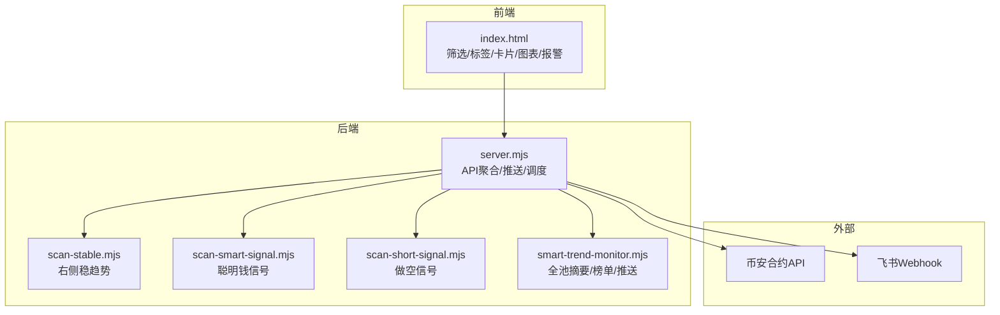
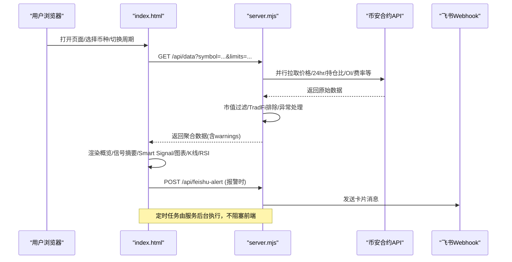
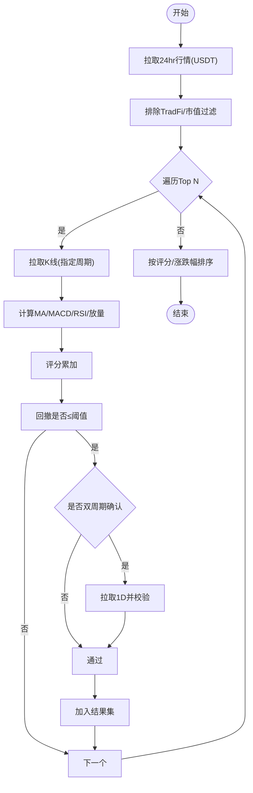
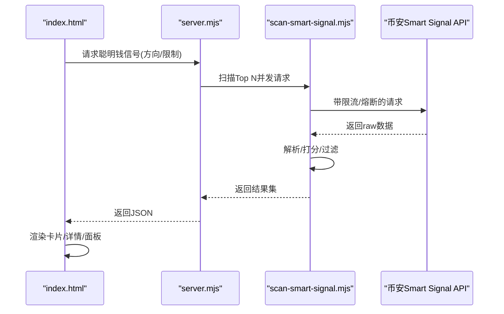
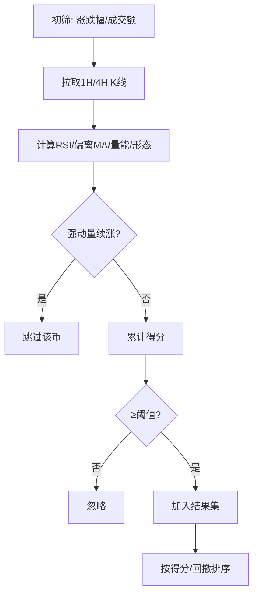
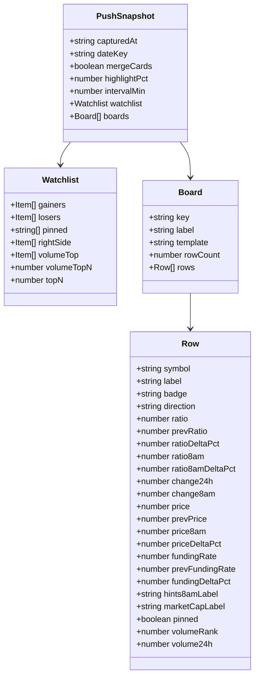
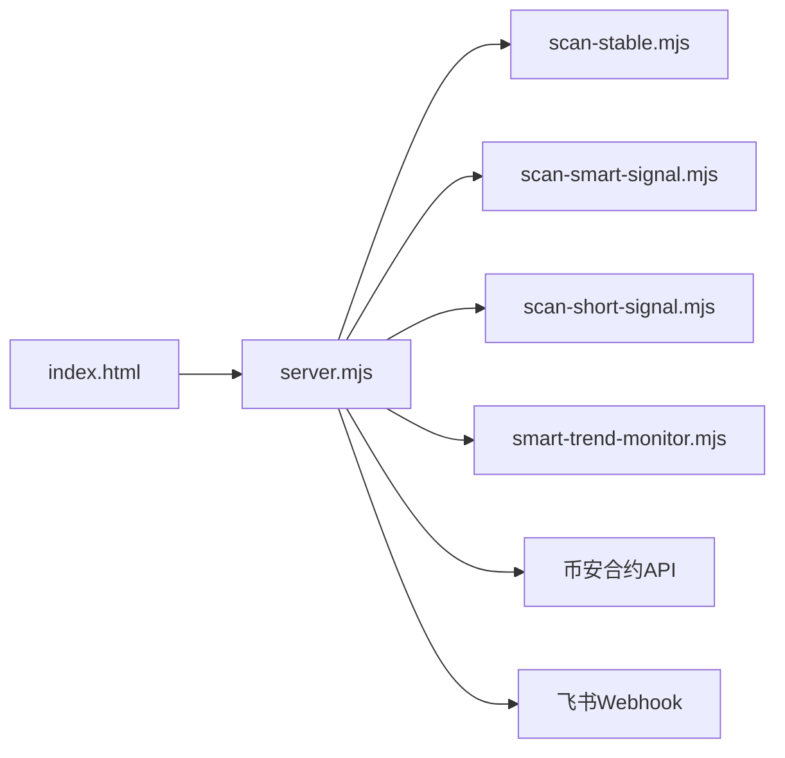

# 信号展示系统

<cite>
**本文引用的文件**   
- [README.md](file://README.md)
- [index.html](file://index.html)
- [server.mjs](file://server.mjs)
- [scan-stable.mjs](file://scan-stable.mjs)
- [scan-smart-signal.mjs](file://scan-smart-signal.mjs)
- [scan-short-signal.mjs](file://scan-short-signal.mjs)
- [smart-trend-monitor.mjs](file://smart-trend-monitor.mjs)
- [data/smart-trend-push-mock.json](file://data/smart-trend-push-mock.json)
- [data/user-positions.json](file://data/user-positions.json)
</cite>

## 目录
1. [简介](#简介)
2. [项目结构](#项目结构)
3. [核心组件](#核心组件)
4. [架构总览](#架构总览)
5. [详细组件分析](#详细组件分析)
6. [依赖关系分析](#依赖关系分析)
7. [性能与体验优化](#性能与体验优化)
8. [故障排查指南](#故障排查指南)
9. [结论](#结论)
10. [附录：配置与集成](#附录配置与集成)

## 简介
本文件面向“信号展示系统”，聚焦稳趋势信号、做空信号、做多信号的可视化呈现与交互设计，覆盖信号卡片、评分系统、置信度指示器、历史记录查看、过滤机制、排序算法、批量操作、详情展开、原因分析与操作建议等。同时提供自定义信号类型、通知设置与推送配置的集成指南，帮助使用者快速理解并扩展系统能力。

## 项目结构
- 前端页面 index.html 承载所有 UI 渲染、交互逻辑与图表绘制（K线、RSI、资金费率、大户持仓比、OI 等），并提供筛选栏、标签页、信号卡片、报警面板、策略管理与模拟交易面板。
- 服务端 server.mjs 聚合币安合约 API，提供数据代理、市值过滤、飞书推送、定时扫描与汇总推送接口。
- 策略模块 scan-stable.mjs、scan-smart-signal.mjs、scan-short-signal.mjs 分别实现右侧稳趋势、聪明钱信号、做空信号的计算与扫描。
- smart-trend-monitor.mjs 负责聪明钱全池摘要、榜单合并、8am基准、推送卡片构建等。
- data 目录包含推送样例与用户持仓示例数据。

图示来源
- [index.html](file://index.html)
- [server.mjs](file://server.mjs)
- [scan-stable.mjs](file://scan-stable.mjs)
- [scan-smart-signal.mjs](file://scan-smart-signal.mjs)
- [scan-short-signal.mjs](file://scan-short-signal.mjs)
- [smart-trend-monitor.mjs](file://smart-trend-monitor.mjs)

章节来源
- [README.md](file://README.md)
- [index.html](file://index.html)
- [server.mjs](file://server.mjs)

## 核心组件
- 信号卡片组件
  - 支持多类信号源：右侧稳趋势、聪明钱信号、做空信号、推荐做多/做空、涨幅榜、暴跌风险、策略复盘等。
  - 每个卡片显示标签、评分、涨跌幅、回撤（稳趋势）、信号明细、时间戳等元信息。
  - 点击卡片可展开详情卡片，展示评分条、置信度、信号明细与来源周期。
- 评分系统与置信度指示器
  - 稳趋势：基于均线排列、MACD金叉/多头、RSI区间、放量等因子打分；结合回撤阈值与双周期确认。
  - 聪明钱：基于净多空比、盈利交易者/鲸鱼数量、均价偏离等打分。
  - 做空：综合暴涨回落、天量后缩量、RSI超买、偏离MA、连续阴线、高位盘整、持续阴跌、8am大跌等多因子加权。
  - 置信度通过颜色与进度条直观表达，并与具体信号明细一一对应。
- 历史记录查看
  - 策略复盘记录按时间轴展示预测与实际涨跌对比、遗漏与误报反思。
  - 推送快照以 JSON 形式持久化，便于回溯与二次分析。
- 过滤机制与排序
  - 过滤维度：周期（1H/4H/1D）、Top范围（50/100/200/500）、回撤阈值、双周期确认、市值上限、TradFi排除。
  - 排序维度：评分、涨跌幅、成交量；不同列表支持独立排序策略。
- 批量操作
  - 一键刷新各榜单、切换周期/范围/回撤阈值、清空缓存、编辑自选币种列表、批量添加/移除。
- 详情展开、原因分析与操作建议
  - 详情卡片展示评分条、比值、信号明细、24h变化、鲸鱼均价等。
  - 入场/出场建议区给出入场价、止损、目标价、盈亏比及理由清单。
- 自定义信号类型、通知与推送
  - 报警设置支持价格突破/跌破、RSI超买超卖、大户翻多翻空、主动买卖激增等条件，并可联动浏览器通知与飞书推送。
  - 推送配置涵盖稳趋势、做空、做多、智能趋势摘要等，支持手动触发与定时任务。

章节来源
- [index.html](file://index.html)
- [scan-stable.mjs](file://scan-stable.mjs)
- [scan-smart-signal.mjs](file://scan-smart-signal.mjs)
- [scan-short-signal.mjs](file://scan-short-signal.mjs)
- [smart-trend-monitor.mjs](file://smart-trend-monitor.mjs)
- [data/smart-trend-push-mock.json](file://data/smart-trend-push-mock.json)

## 架构总览
系统采用前后端分离的轻量架构：前端通过 HTTP 请求获取聚合后的指标与信号结果，并在本地进行图表渲染与交互；后端统一代理币安合约 API，执行市值过滤、TradFi排除、并发去重与限流保护，并将结果组装为统一的响应格式。定时任务在后台运行，生成稳趋势、做空、做多、智能趋势摘要等推送内容，并通过飞书 Webhook 发送。

图示来源
- [index.html](file://index.html)
- [server.mjs](file://server.mjs)

章节来源
- [server.mjs](file://server.mjs)
- [index.html](file://index.html)

## 详细组件分析

### 稳趋势信号（右侧稳趋势）
- 计算要点
  - 技术指标：MA5/MA20 多排、MACD金叉/多头、RSI6 健康区间、近期放量。
  - 回撤控制：近N根最高价到当前价的回撤比例，阈值可配。
  - 双周期确认：可选要求 1H+1D 同时满足，降低假信号。
- 前端呈现
  - 标签页“右侧稳趋势”下以卡片列表展示，包含评分、回撤、24h涨跌幅、信号明细。
  - 点击卡片弹出详情卡片，显示评分条、置信度、信号明细、周期与扫描时间。
- 后端流程
  - 扫描 Top N USDT 合约标的，按成交量排序，并发调用 K 线数据，应用指标与回撤判断，输出候选集并按评分与涨跌幅排序。

图示来源
- [scan-stable.mjs](file://scan-stable.mjs)
- [server.mjs](file://server.mjs)

章节来源
- [scan-stable.mjs](file://scan-stable.mjs)
- [server.mjs](file://server.mjs)
- [index.html](file://index.html)

### 聪明钱信号（做多/做空方向）
- 计算要点
  - 净多空比 >1 判定做多，<1 判定做空；结合盈利交易者/鲸鱼数量、鲸鱼均价偏离等加分项。
  - 限流保护：对上游 Smart Signal API 做熔断与重试降级（curl 回退）。
- 前端呈现
  - “聪明钱信号”标签页展示 [B]/[S] 标识、比值、评分、24h涨跌幅与信号明细。
  - 单币 Smart Signal 面板展示交易者数、鲸鱼均价、盈利方对比与信号明细。
- 后端流程
  - 扫描 Top N，并发拉取 Smart Signal 数据，解析并打分，按方向与评分排序。

图示来源
- [scan-smart-signal.mjs](file://scan-smart-signal.mjs)
- [server.mjs](file://server.mjs)
- [index.html](file://index.html)

章节来源
- [scan-smart-signal.mjs](file://scan-smart-signal.mjs)
- [index.html](file://index.html)

### 做空信号
- 计算要点
  - 多维度因子：暴涨回落、天量后缩量、RSI超买、偏离MA、连续阴线、高位盘整、持续阴跌、8am大跌等。
  - 动态拒绝：强动量续涨形态（如连续阳线且回撤极小）直接跳过，避免逆势做空。
- 前端呈现
  - “推荐做空”标签页展示评分、24h涨跌幅、信号标签与风险提示。
  - 详情卡片展示评分条、置信度、信号明细与时间戳。
- 后端流程
  - 先根据涨跌幅与成交额初筛候选，再并发拉取1H/4H K线，逐项打分，输出高分集合。

图示来源
- [scan-short-signal.mjs](file://scan-short-signal.mjs)
- [server.mjs](file://server.mjs)

章节来源
- [scan-short-signal.mjs](file://scan-short-signal.mjs)
- [server.mjs](file://server.mjs)
- [index.html](file://index.html)

### 智能趋势摘要与榜单
- 功能概述
  - 每整点扫描全池聪明钱变化，计算相对上次与8am基准的变化百分比，生成“变多/变少/持平”统计与总体研判。
  - 将涨幅榜、跌幅榜、右侧、交易额榜等合并去重，按8am推积分绝对值排序，分页展示。
- 数据结构
  - 推送快照包含 watchlist（涨幅/跌幅/固定监控/右侧/交易额Top）、boards（分板块表格行）、meta 等字段。
- 前端呈现
  - 策略复盘面板展示历史复盘记录与反思；推送卡片以表格形式呈现关键指标与显著变化。

图示来源
- [smart-trend-monitor.mjs](file://smart-trend-monitor.mjs)
- [data/smart-trend-push-mock.json](file://data/smart-trend-push-mock.json)

章节来源
- [smart-trend-monitor.mjs](file://smart-trend-monitor.mjs)
- [data/smart-trend-push-mock.json](file://data/smart-trend-push-mock.json)

### 用户交互与可视化
- 筛选栏与标签页
  - 支持切换“全部/涨幅榜·8点/8点追涨/暴跌预警/右侧交易/右侧稳趋势/左侧交易/推荐做多/聪明钱信号/推荐做空/策略复盘”。
  - 周期、Top范围、回撤阈值、双周期确认、排序方式均可实时切换并持久化至 localStorage。
- 信号卡片与详情
  - 卡片显示评分、涨跌幅、回撤、信号标签；点击展开详情卡片，展示评分条、置信度、信号明细与元信息。
- 图表与指标
  - K线图叠加 MA5/MA20/MA60、成交量柱状图、资金费率标记；RSI(6/12/24)三线与超买超卖区高亮。
  - 大户持仓多空比、大户 vs 全网多空比、OI 与价格对比、资金费率趋势、主动买卖量柱状图与比率线。
- 报警与通知
  - 支持价格/RSI/大户/主动买卖等条件报警，触发后弹窗提示、声音提醒、浏览器通知与飞书推送。

章节来源
- [index.html](file://index.html)

## 依赖关系分析
- 前端依赖
  - 依赖后端 /api/data、/api/klines、/api/marketcap、/api/feishu-alert 等接口。
  - 使用 Canvas 自绘图表，无第三方库依赖。
- 后端依赖
  - 币安合约 REST API（fapi.binance.com）作为主要数据源。
  - 市值数据优先 CoinMarketCap Pro，回退 CoinGecko。
  - 飞书 Webhook 用于推送。
- 模块耦合
  - server.mjs 聚合多个扫描模块（稳趋势、聪明钱、做空、智能趋势），对外暴露统一 API。
  - 市值过滤与 TradFi 排除贯穿各扫描流程，保证输出一致性。

图示来源
- [index.html](file://index.html)
- [server.mjs](file://server.mjs)
- [scan-stable.mjs](file://scan-stable.mjs)
- [scan-smart-signal.mjs](file://scan-smart-signal.mjs)
- [scan-short-signal.mjs](file://scan-short-signal.mjs)
- [smart-trend-monitor.mjs](file://smart-trend-monitor.mjs)

章节来源
- [server.mjs](file://server.mjs)
- [index.html](file://index.html)

## 性能与体验优化
- 并发与去重
  - 全量 ticker/24hr 短 TTL 缓存与并发去重，避免同一轮推送重复请求。
  - pmap 并发控制，限制并发度，防止雪崩。
- 限流与熔断
  - Smart Signal API 限流保护，遇到 418/429/403 自动熔断并回退 curl 请求。
- 缓存与持久化
  - 8am 基准价格缓存、鲸鱼历史数据本地缓存、推送快照持久化。
- 前端渲染
  - 按需加载与懒渲染，图表 hover 仅计算可见区域，减少重绘开销。
- 用户体验
  - 倒计时刷新、状态指示灯、错误提示、折叠/展开、批量操作按钮，提升易用性。

章节来源
- [server.mjs](file://server.mjs)
- [index.html](file://index.html)

## 故障排查指南
- 端口占用
  - 启动时报 EADDRINUSE，建议使用 dev:restart 脚本或手动清理旧进程。
- 网络与代理
  - 若币安 API 不可用，检查代理环境变量；部分接口失败会在 warnings 中提示。
- 飞书推送
  - 未配置 FEISHU_WEBHOOK 将无法推送；频控错误会抛出异常并记录日志。
- 市值过滤
  - 超出 MAX_MARKET_CAP_USD 的币种将被过滤，可在 .env 调整或关闭。
- 报警未触发
  - 检查报警条件与阈值是否正确，确认对应指标已加载成功。

章节来源
- [README.md](file://README.md)
- [server.mjs](file://server.mjs)
- [index.html](file://index.html)

## 结论
信号展示系统通过多因子评分与可视化呈现，将稳趋势、聪明钱与做空信号整合到统一界面，配合灵活的过滤、排序与批量操作，帮助用户高效发现机会与规避风险。系统具备良好的容错与限流机制，支持灵活的通知与推送配置，适合日常盯盘与策略复盘。

## 附录：配置与集成
- 环境配置
  - PORT：Web 面板监听端口
  - CMC_API_KEY：CoinMarketCap Pro Key（可选）
  - MAX_MARKET_CAP_USD：市值上限（美元），0 表示关闭过滤
  - FEISHU_WEBHOOK：飞书机器人 Webhook URL
  - STABLE_PUSH_HOURS/STABLE_SCAN_LIMIT/STABLE_MAX_DRAWDOWN：稳趋势推送间隔、扫描数量、最大回撤
  - LONG_PUSH_* / SHORT_PUSH_*：做多/做空推送相关参数
  - SMART_TREND_*：智能趋势监控与推送开关、间隔、冷却、阈值等
- 手动触发
  - POST /api/trigger-stable-push 手动触发稳趋势推送
- 报警集成
  - 前端报警设置支持声音与飞书推送，触发后调用 /api/feishu-alert 发送卡片消息
- 自定义信号类型
  - 在前端新增筛选标签与渲染逻辑，在后端对应模块增加计算与排序规则，并在 server.mjs 注册新接口或复用现有扫描函数
- 推送配置
  - 修改 .env 中的推送开关与间隔，重启服务生效；可通过 PM2/systemd 管理服务生命周期

章节来源
- [README.md](file://README.md)
- [server.mjs](file://server.mjs)
- [index.html](file://index.html)