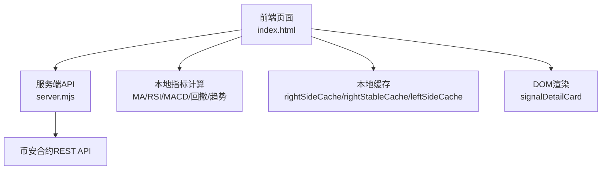
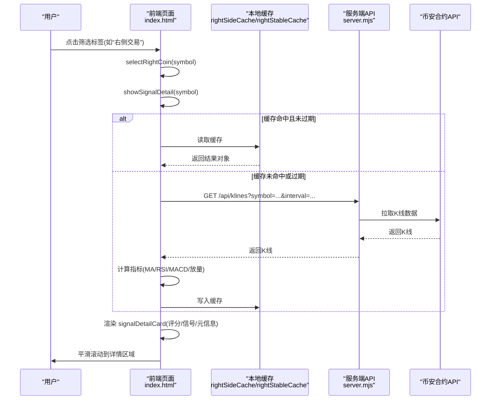
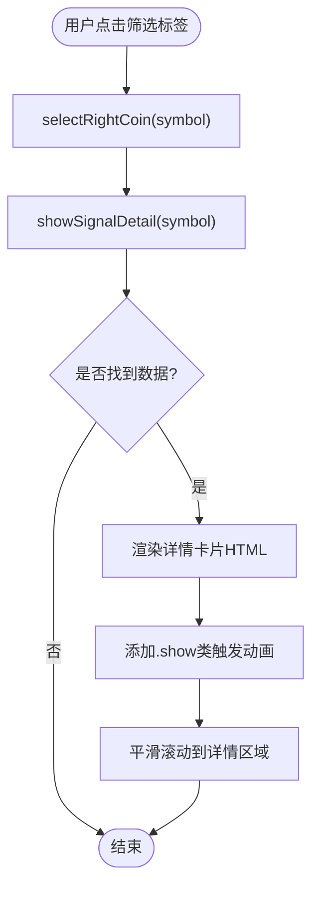
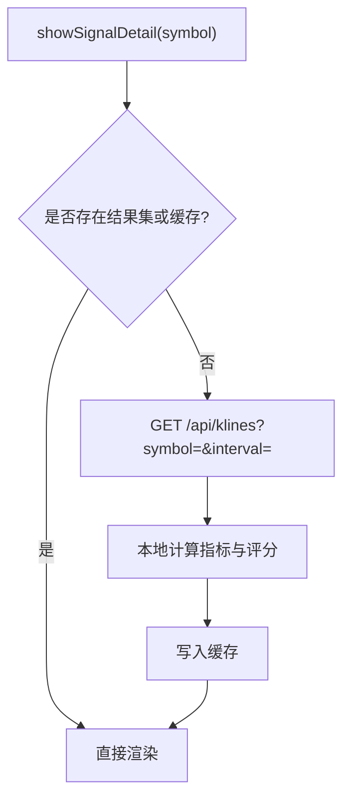
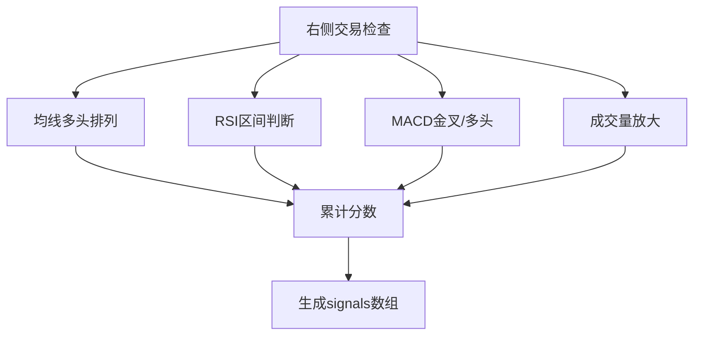
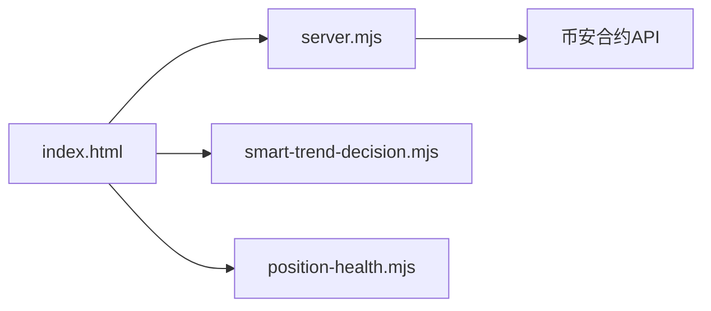

# 信号详情查看

<cite>
**本文引用的文件**
- [index.html](file://index.html)
- [server.mjs](file://server.mjs)
- [smart-trend-decision.mjs](file://smart-trend-decision.mjs)
- [position-health.mjs](file://position-health.mjs)
</cite>

## 目录
1. [简介](#简介)
2. [项目结构](#项目结构)
3. [核心组件](#核心组件)
4. [架构总览](#架构总览)
5. [详细组件分析](#详细组件分析)
6. [依赖关系分析](#依赖关系分析)
7. [性能考虑](#性能考虑)
8. [故障排查指南](#故障排查指南)
9. [结论](#结论)
10. [附录](#附录)

## 简介
本文件围绕“信号详情查看”功能，系统性说明：
- 信号详情面板的展开/收起动画与交互流程
- 数据加载机制（缓存、请求、渲染）
- 信号原因分析展示、技术指标解读、操作建议呈现的实现方式
- 历史信号记录查看、信号对比分析与导出功能的现状与建议
- 信号详情模板自定义与扩展开发指南

## 项目结构
该功能主要位于前端页面 index.html 中，通过服务端 API 获取 K 线、聪明钱等数据，并在本地进行指标计算与评分。关键位置包括：
- 信号详情卡片容器与样式定义
- 打开/关闭详情函数
- 右侧交易/稳趋势/左侧交易等策略的数据采集与评分逻辑
- 聪明钱信号聚合与展示

图表来源
- [index.html:267-301](file://index.html#L267-L301)
- [index.html:2724-2808](file://index.html#L2724-L2808)
- [index.html:3325-3414](file://index.html#L3325-L3414)
- [index.html:3469-3499](file://index.html#L3469-L3499)
- [server.mjs:190-210](file://server.mjs#L190-L210)

章节来源
- [index.html:267-301](file://index.html#L267-L301)
- [index.html:2724-2808](file://index.html#L2724-L2808)
- [index.html:3325-3414](file://index.html#L3325-L3414)
- [index.html:3469-3499](file://index.html#L3469-L3499)
- [server.mjs:190-210](file://server.mjs#L190-L210)

## 核心组件
- 信号详情卡片容器与样式：负责显示标题、评分条、信号项列表、元信息（24h变化、周期、扫描时间等），并通过 CSS 动画实现展开/收起效果。
- 打开/关闭详情函数：根据当前选中币种从多类结果集合或缓存中查找数据并渲染；提供关闭按钮移除显示状态。
- 右侧交易/稳趋势/左侧交易策略：分别对K线数据进行指标计算与打分，生成 signals 数组与 score，供详情面板展示。
- 聪明钱信号：聚合大户持仓比、全网多空比、主动买卖量、资金费率等，输出 badge、score、signals 等字段用于详情展示。

章节来源
- [index.html:267-301](file://index.html#L267-L301)
- [index.html:2724-2808](file://index.html#L2724-L2808)
- [index.html:3325-3414](file://index.html#L3325-L3414)
- [index.html:3469-3499](file://index.html#L3469-L3499)
- [index.html:1021-1046](file://index.html#L1021-L1046)

## 架构总览
下图展示了用户点击筛选标签后，触发详情面板打开、数据加载与渲染的完整流程。

图表来源
- [index.html:2713-2723](file://index.html#L2713-L2723)
- [index.html:2724-2808](file://index.html#L2724-L2808)
- [index.html:3325-3414](file://index.html#L3325-L3414)
- [index.html:3469-3499](file://index.html#L3469-L3499)
- [server.mjs:190-210](file://server.mjs#L190-L210)

## 详细组件分析

### 信号详情面板：展开/收起动画与交互
- 展开/收起动画：通过 CSS 类 .show 控制 display/block，配合 @keyframes fadeSlideDown 实现淡入+上滑效果。
- 交互入口：在筛选标签选择时调用 selectRightCoin，随后 showSignalDetail 渲染详情，并自动滚动到详情区域。
- 关闭行为：closeSignalDetail 移除 .show 类隐藏面板。

图表来源
- [index.html:2713-2723](file://index.html#L2713-L2723)
- [index.html:2724-2808](file://index.html#L2724-L2808)
- [index.html:267-277](file://index.html#L267-L277)

章节来源
- [index.html:267-301](file://index.html#L267-L301)
- [index.html:2713-2723](file://index.html#L2713-L2723)
- [index.html:2724-2808](file://index.html#L2724-L2808)

### 数据加载机制与缓存
- 数据来源优先级：优先从 smartSignalResults/rightStableResults/rightSideResults/leftSideResults 查找，其次从 rightSideCache/rightStableCache/leftSideCache 读取。
- 缓存策略：对右侧交易与稳趋势结果设置约5分钟缓存，避免频繁请求。
- 请求路径：当缓存未命中时，向 /api/klines 拉取K线数据，再在本地完成指标计算与评分。

图表来源
- [index.html:2724-2733](file://index.html#L2724-L2733)
- [index.html:3325-3414](file://index.html#L3325-L3414)
- [index.html:3469-3499](file://index.html#L3469-L3499)

章节来源
- [index.html:2724-2733](file://index.html#L2724-L2733)
- [index.html:3325-3414](file://index.html#L3325-L3414)
- [index.html:3469-3499](file://index.html#L3469-L3499)

### 信号原因分析展示
- 右侧交易评分维度：均线多头排列、RSI区间、MACD金叉/多头、成交量放大等，每项以带符号的文本条目加入 signals 数组。
- 稳趋势增强：在右侧基础上叠加多周期回撤与趋势完整性校验，进一步丰富 signals 描述。
- 左侧交易：基于超跌与反转条件评估，输出不同分值与信号项。
- 聪明钱信号：聚合大户/全网多空比、主动买卖量、资金费率等，形成 badge、score、signals。

图表来源
- [index.html:3325-3414](file://index.html#L3325-L3414)
- [index.html:3469-3499](file://index.html#L3469-L3499)
- [index.html:1021-1046](file://index.html#L1021-L1046)

章节来源
- [index.html:3325-3414](file://index.html#L3325-L3414)
- [index.html:3469-3499](file://index.html#L3469-L3499)
- [index.html:1021-1046](file://index.html#L1021-L1046)

### 技术指标解读
- 均线系统：价格相对 MA20 的位置与 MA5/MA20 的相对关系，用于判断多头排列与支撑。
- RSI：短期动量指标，区分强势区与超买/弱势区。
- MACD：DIF/DEA 关系与交叉事件，辅助确认趋势强度与转折。
- 成交量：近期均量与前期均量的比值，识别放量突破或缩量回调。
- 回撤与趋势完整性：结合高低价序列与 MA20/MA5 的多路径判定，适应暴涨币与插针行情。

章节来源
- [index.html:3325-3414](file://index.html#L3325-L3414)
- [index.html:3416-3444](file://index.html#L3416-L3444)

### 操作建议呈现
- 入场建议：综合大户持仓趋势、主动买卖量变化、支撑阻力与RSI/MACD等，给出买入/持有/观望建议及风险回报比估算。
- 出场建议：依据偏离度、阻力位、RSI超买、MACD死叉/动能衰减等因素，提示减仓或止盈止损参考。
- 健康度联动：持仓健康模块会复用做空信号与暴跌风险评估，动态调整健康分与理由。

章节来源
- [index.html:1941-1996](file://index.html#L1941-L1996)
- [position-health.mjs:101-140](file://position-health.mjs#L101-L140)

### 历史信号记录查看
- 策略回顾接口：支持通过 /api/strategy-review 拉取最近一段时间的策略回顾数据，便于回溯与复盘。
- 触发回顾：提供 /api/trigger-strategy-review 手动触发回顾任务，随后刷新展示。

章节来源
- [index.html:3268-3293](file://index.html#L3268-L3293)

### 信号对比分析
- 多策略并行：右侧交易、稳趋势、左侧交易、聪明钱信号各自独立评分与信号项，可在同一详情页横向对比。
- 多周期验证：稳趋势支持双周期（如1H与1D）校验，将各周期结果合并为 signals 列表，便于比较差异。

章节来源
- [index.html:3469-3499](file://index.html#L3469-L3499)
- [index.html:2724-2808](file://index.html#L2724-L2808)

### 导出功能
- 现状：代码库中未发现直接的“导出信号详情”功能实现。
- 建议：可基于现有结果对象（score、signals、detail、tfResults 等）在前端增加导出为 JSON/CSV 的按钮与下载逻辑，或将策略回顾数据导出。

[本节为通用建议，不直接分析具体文件，故无章节来源]

### 信号详情模板自定义与扩展开发指南
- 模板位置：详情卡片的 HTML 模板集中在 showSignalDetail 函数内，按数据类型（聪明钱信号 vs 左右侧信号）分支渲染。
- 扩展点：
  - 新增评分维度：在 checkCoinRightSide/checkCoinRightStable 等函数中添加新的指标判断，更新 score 与 signals。
  - 新增展示字段：在模板中插入新字段（如额外元信息、风险提示），并确保对应数据源存在。
  - 新增策略类型：复制现有策略流程，定义新的结果结构与缓存键，接入筛选标签与渲染逻辑。
  - 主题与样式：通过 CSS 变量与 .signal-detail-card 相关类名调整视觉风格。
- 注意事项：
  - 保持 signals 数组格式一致（以符号前缀标识状态），以便统一渲染。
  - 缓存键需包含关键参数（如 symbol、interval、阈值），避免脏读。
  - 对外部 API 错误进行容错处理，确保降级展示与用户体验。

章节来源
- [index.html:2724-2808](file://index.html#L2724-L2808)
- [index.html:3325-3414](file://index.html#L3325-L3414)
- [index.html:3469-3499](file://index.html#L3469-L3499)

## 依赖关系分析
- 前端依赖：
  - DOM 渲染与事件绑定（index.html）
  - 本地指标计算与评分（index.html）
  - 本地缓存（rightSideCache/rightStableCache/leftSideCache）
- 后端依赖：
  - 代理币安合约 REST API（server.mjs）
  - 策略研判与汇总（smart-trend-decision.mjs）
  - 持仓健康与信号联动（position-health.mjs）

图表来源
- [index.html:2724-2808](file://index.html#L2724-L2808)
- [server.mjs:190-210](file://server.mjs#L190-L210)
- [smart-trend-decision.mjs:487-534](file://smart-trend-decision.mjs#L487-L534)
- [position-health.mjs:101-140](file://position-health.mjs#L101-L140)

章节来源
- [index.html:2724-2808](file://index.html#L2724-L2808)
- [server.mjs:190-210](file://server.mjs#L190-L210)
- [smart-trend-decision.mjs:487-534](file://smart-trend-decision.mjs#L487-L534)
- [position-health.mjs:101-140](file://position-health.mjs#L101-L140)

## 性能考虑
- 缓存命中率：合理设置缓存时间与键空间，减少重复请求。
- 批量计算：在渲染前尽量合并指标计算，避免多次重排重绘。
- 节流与防抖：筛选切换与搜索输入应做节流，降低高频渲染开销。
- 降级策略：网络异常或数据不足时，提供友好提示与最小可用视图。

[本节为通用指导，不直接分析具体文件，故无章节来源]

## 故障排查指南
- 详情面板不显示：
  - 检查 showSignalDetail 是否能找到对应结果或缓存。
  - 确认 .show 类是否正确添加与移除。
- 数据为空或报错：
  - 检查 /api/klines 响应结构与长度要求。
  - 查看本地指标计算是否因数据不足返回空值。
- 评分异常：
  - 核对各项指标阈值与计分规则。
  - 确认 signals 数组内容与符号前缀是否符合渲染逻辑。

章节来源
- [index.html:2724-2808](file://index.html#L2724-L2808)
- [index.html:3325-3414](file://index.html#L3325-L3414)

## 结论
信号详情查看功能通过前端本地计算与缓存机制，实现了快速、直观的评分与信号解释展示。右侧交易、稳趋势、左侧交易与聪明钱信号四类策略共同构成多维度的决策参考。建议在现有基础上完善导出能力与更多可视化对比，进一步提升复盘与扩展性。

[本节为总结性内容，不直接分析具体文件，故无章节来源]

## 附录
- 相关API参考：
  - GET /api/klines — 获取K线数据
  - GET /api/data — 聪明钱全量数据
  - GET /api/strategy-review — 策略回顾
  - POST /api/trigger-strategy-review — 触发策略回顾

章节来源
- [README.md:190-199](file://README.md#L190-L199)