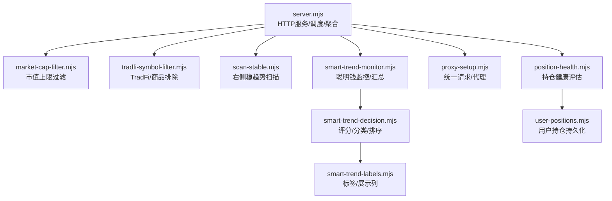
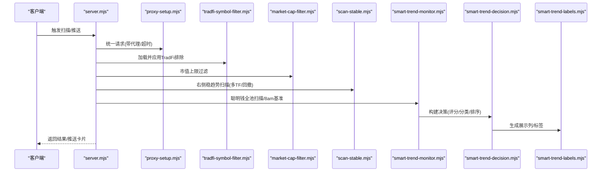
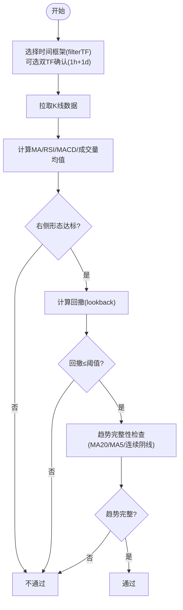
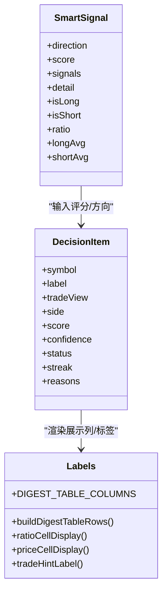
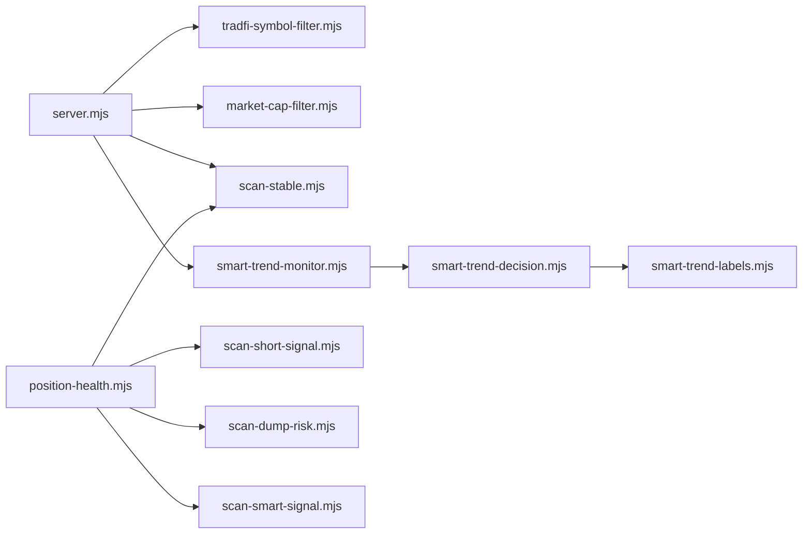

# 信号过滤系统

<cite>
**本文引用的文件**   
- [server.mjs](file://server.mjs)
- [market-cap-filter.mjs](file://market-cap-filter.mjs)
- [tradfi-symbol-filter.mjs](file://tradfi-symbol-filter.mjs)
- [scan-stable.mjs](file://scan-stable.mjs)
- [smart-trend-decision.mjs](file://smart-trend-decision.mjs)
- [smart-trend-monitor.mjs](file://smart-trend-monitor.mjs)
- [smart-trend-labels.mjs](file://smart-trend-labels.mjs)
- [proxy-setup.mjs](file://proxy-setup.mjs)
- [position-health.mjs](file://position-health.mjs)
- [user-positions.mjs](file://user-positions.mjs)
- [README.md](file://README.md)
</cite>

## 目录
1. [引言](#引言)
2. [项目结构](#项目结构)
3. [核心组件](#核心组件)
4. [架构总览](#架构总览)
5. [详细组件分析](#详细组件分析)
6. [依赖关系分析](#依赖关系分析)
7. [性能与优化](#性能与优化)
8. [故障排查指南](#故障排查指南)
9. [结论](#结论)
10. [附录：自定义过滤器开发接口](#附录自定义过滤器开发接口)

## 引言
本文件系统性地梳理“信号过滤系统”的实现原理与工程实践，重点覆盖多条件过滤机制（时间框架筛选、市值范围过滤、回撤控制等）、权重计算与排序逻辑、性能优化策略、用户偏好持久化、组合查询与批量操作，以及可扩展的自定义过滤器开发与集成方法。该系统基于币安合约 API，结合聪明钱指标、右侧趋势与回撤控制、资金费率变化等多维数据，形成可配置、可观测、可排错的过滤与决策流水线。

## 项目结构
本项目采用模块化组织方式，按职责划分多个独立脚本与模块：
- 服务端与路由：server.mjs
- 过滤与筛选：market-cap-filter.mjs、tradfi-symbol-filter.mjs、scan-stable.mjs
- 聪明钱监控与决策：smart-trend-monitor.mjs、smart-trend-decision.mjs、smart-trend-labels.mjs
- 网络与代理：proxy-setup.mjs
- 持仓健康评估：position-health.mjs、user-positions.mjs
- 文档与说明：README.md

图表来源
- [server.mjs:1-120](file://server.mjs#L1-L120)
- [market-cap-filter.mjs:1-15](file://market-cap-filter.mjs#L1-L15)
- [tradfi-symbol-filter.mjs:1-113](file://tradfi-symbol-filter.mjs#L1-L113)
- [scan-stable.mjs:1-290](file://scan-stable.mjs#L1-L290)
- [smart-trend-monitor.mjs:1-120](file://smart-trend-monitor.mjs#L1-L120)
- [smart-trend-decision.mjs:1-120](file://smart-trend-decision.mjs#L1-L120)
- [smart-trend-labels.mjs:1-60](file://smart-trend-labels.mjs#L1-L60)
- [proxy-setup.mjs:1-71](file://proxy-setup.mjs#L1-L71)
- [position-health.mjs:1-60](file://position-health.mjs#L1-L60)
- [user-positions.mjs:1-64](file://user-positions.mjs#L1-L64)

章节来源
- [README.md:1-210](file://README.md#L1-L210)

## 核心组件
- 市值过滤：提供最大市值阈值与格式化显示，用于全局过滤大盘币。
- TradFi 符号过滤：基于交易所信息缓存与硬编码规则，排除股票/商品相关合约。
- 右侧稳趋势扫描：多时间框架（1h/1d）确认、回撤控制、均线/RSI/MACD/放量等条件打分。
- 聪明钱监控与决策：对全池币种进行聪明钱比值采集、8am基准对比、评分与分类、排序输出。
- 持仓健康评估：综合趋势有效性、暴跌风险、聪明钱方向、盈亏比例等给出健康度与建议动作。
- 用户持仓持久化：本地 JSON 存储，支持增删查。

章节来源
- [market-cap-filter.mjs:1-15](file://market-cap-filter.mjs#L1-L15)
- [tradfi-symbol-filter.mjs:1-113](file://tradfi-symbol-filter.mjs#L1-L113)
- [scan-stable.mjs:1-290](file://scan-stable.mjs#L1-L290)
- [smart-trend-monitor.mjs:1-120](file://smart-trend-monitor.mjs#L1-L120)
- [smart-trend-decision.mjs:1-120](file://smart-trend-decision.mjs#L1-L120)
- [position-health.mjs:1-60](file://position-health.mjs#L1-L60)
- [user-positions.mjs:1-64](file://user-positions.mjs#L1-L64)

## 架构总览
整体流程由 server.mjs 作为入口，协调各扫描与过滤模块，完成数据获取、过滤、评分、排序与推送。

图表来源
- [server.mjs:1-120](file://server.mjs#L1-L120)
- [proxy-setup.mjs:1-71](file://proxy-setup.mjs#L1-L71)
- [tradfi-symbol-filter.mjs:1-113](file://tradfi-symbol-filter.mjs#L1-L113)
- [market-cap-filter.mjs:1-15](file://market-cap-filter.mjs#L1-L15)
- [scan-stable.mjs:1-290](file://scan-stable.mjs#L1-L290)
- [smart-trend-monitor.mjs:1-120](file://smart-trend-monitor.mjs#L1-L120)
- [smart-trend-decision.mjs:1-120](file://smart-trend-decision.mjs#L1-L120)
- [smart-trend-labels.mjs:1-60](file://smart-trend-labels.mjs#L1-L60)

## 详细组件分析

### 多条件过滤机制
- 时间框架筛选
  - 右侧稳趋势扫描支持 filterTF 参数（默认 1h），并在 dualTFConfirm=true 时叠加 1d 确认，确保趋势稳健性。
  - 回撤计算在不同 TF 上分别进行，取最大回撤作为最终风控指标。
- 市值范围过滤
  - 通过 MAX_MARKET_CAP_USD 环境变量控制上限；当未设置或为 0 时关闭过滤。
  - 过滤函数在批量场景下先收集唯一 symbol，再批量拉取市值映射，减少重复请求。
- TradFi/商品排除
  - 基于 /fapi/v1/exchangeInfo 的 contractType/underlyingType/underlyingSubType 动态识别，配合历史硬编码集合与正则模式，避免误入股票/商品合约。
  - 支持 EXCLUDE_SYMBOLS 环境变量追加排除列表，且自动补齐 USDT 后缀。
- 回撤控制
  - 回撤从近期高点到当前价的跌幅百分比，lookback 随 TF 调整（1d=30，4h=36，1h=48）。
  - 趋势完整性检查包含 MA20/MA5 支撑、连续阴跌、失守判定等，严格模式下拒绝下跌中继。

图表来源
- [scan-stable.mjs:91-193](file://scan-stable.mjs#L91-L193)
- [scan-stable.mjs:141-161](file://scan-stable.mjs#L141-L161)
- [scan-stable.mjs:249-290](file://scan-stable.mjs#L249-L290)

章节来源
- [scan-stable.mjs:1-290](file://scan-stable.mjs#L1-L290)
- [tradfi-symbol-filter.mjs:1-113](file://tradfi-symbol-filter.mjs#L1-L113)
- [market-cap-filter.mjs:1-15](file://market-cap-filter.mjs#L1-L15)

### 权重计算与评分体系
- 聪明钱评分
  - 基于净多空比、盈利多头/空头数量、鲸鱼仓位与盈利鲸鱼数量、价格相对鲸鱼均价位置等维度加权计分。
  - 方向判断：ratio>1 偏多，<1 偏空，≈1 中性。
- 决策评分
  - 基础分 35，依据来源数量、是否右侧、涨幅/跌幅排名、成交额排名、24h 涨跌幅、ratio 绝对值与变化幅度等进行加分/减分，最终归一化至 0-100。
  - 置信度：≥78 且来源≥2 为高，≥62 为中，其余为低。
- 8am 基准与累计计分
  - 每日 08:00 上海时间将当前 ratio 设为基准，后续每轮按 1h 变化分档累计（≥5%→1分, ≥15%→2分, ≥35%→3分），多空分别累计后显示净分。

图表来源
- [smart-trend-decision.mjs:282-319](file://smart-trend-decision.mjs#L282-L319)
- [smart-trend-decision.mjs:424-472](file://smart-trend-decision.mjs#L424-L472)
- [smart-trend-labels.mjs:203-224](file://smart-trend-labels.mjs#L203-L224)
- [smart-trend-monitor.mjs:279-318](file://smart-trend-monitor.mjs#L279-L318)

章节来源
- [smart-trend-decision.mjs:1-751](file://smart-trend-decision.mjs#L1-L751)
- [smart-trend-labels.mjs:1-224](file://smart-trend-labels.mjs#L1-L224)
- [smart-trend-monitor.mjs:1-800](file://smart-trend-monitor.mjs#L1-L800)

### 排序逻辑与优先级
- 决策项排序
  - 优先反向待确认项（reversal_watch）置顶，其次按 score 降序。
- 榜单合并与分页
  - 去重后按 8am 推积分绝对值从高到低排序，同分按 ratio 排序；分页大小可配置。
- 稳趋势结果排序
  - 按 score 降序，次级按 24h 涨跌幅降序。

章节来源
- [smart-trend-decision.mjs:474-478](file://smart-trend-decision.mjs#L474-L478)
- [smart-trend-monitor.mjs:726-732](file://smart-trend-monitor.mjs#L726-L732)
- [scan-stable.mjs:287-289](file://scan-stable.mjs#L287-L289)

### 性能优化策略
- 并发与队列
  - pmap 实现固定并发度的并行处理，避免瞬时大量请求导致限流。
- 熔断与重试
  - Smart Signal API 遇到 418/429/403 时进入熔断窗口，等待 retry-after 后再试；失败回退 curl 执行。
- 缓存与去重
  - ticker/24hr 短 TTL 缓存 + inflight 去重；市值缓存 Map；TradFi 排除集缓存；8am 基准价格缓存。
- 批量拉取
  - 市值、资金费率、8am 基准价等采用批量或 Promise.allSettled 并行获取，降低 RTT。
- 节流与最小间隔
  - Smart Signal 请求最小间隔 MIN_INTERVAL_MS，防止过快触发限流。

章节来源
- [server.mjs:84-105](file://server.mjs#L84-L105)
- [server.mjs:306-353](file://server.mjs#L306-L353)
- [server.mjs:466-482](file://server.mjs#L466-L482)
- [scan-smart-signal.mjs:57-84](file://scan-smart-signal.mjs#L57-L84)
- [proxy-setup.mjs:49-71](file://proxy-setup.mjs#L49-L71)

### 用户偏好设置持久化
- 状态持久化
  - smart-trend-state.json 保存每个 symbol 的最近 ratio、初始化标记、8am 基准与当日累计计分等。
  - smart-trend-decision-state.json 保存决策态（状态、连续性、首次出现时间等）。
- 用户持仓持久化
  - user-positions.json 以 JSON 数组形式存储，支持新增、删除、读取。
- 定时刷新与增量保存
  - 使用 saveQueue/decisionSaveQueue 串行写入，避免并发写冲突。

章节来源
- [smart-trend-monitor.mjs:93-137](file://smart-trend-monitor.mjs#L93-L137)
- [user-positions.mjs:1-64](file://user-positions.mjs#L1-L64)

### 过滤条件组合查询与批量操作
- 组合查询
  - 服务器端提供多种查询入口：自 8am 以来涨跌榜、24h 涨跌榜、成交额 Top、右侧稳趋势、聪明钱摘要等，均可串联 TradFi 与市值过滤。
- 批量操作
  - evaluatePositionsBatch 支持批量评估持仓健康；batchEnrichSmartTrendDigest 支持批量补充价格、8am 基准、资金费率、市值等字段。

章节来源
- [server.mjs:186-304](file://server.mjs#L186-L304)
- [position-health.mjs:197-213](file://position-health.mjs#L197-L213)
- [server.mjs:306-353](file://server.mjs#L306-L353)

### 自定义过滤器开发接口与集成方法
- 扩展点
  - filterEligibleSymbols：统一过滤入口，可在其中插入新的过滤步骤（如流动性、波动率、黑名单等）。
  - buildMergedSmartTrendElements：合并榜单与显著变化列表，可在此加入自定义板块或过滤规则。
  - scanRightStable/scanRightSide：右侧稳趋势扫描入口，可注入新的技术指标或风控条件。
- 集成建议
  - 新增过滤函数后，在 server.mjs 中引入并在 filterEligibleSymbols 调用链中挂载。
  - 若涉及外部数据源，复用 proxy-setup.mjs 的统一 fetchJson 以保障代理与超时一致性。
  - 对于需要持久化的新状态，参考 lastState 与 decisionState 的持久化模式，使用 queueSave* 串行写入。

章节来源
- [server.mjs:478-482](file://server.mjs#L478-L482)
- [smart-trend-monitor.mjs:706-765](file://smart-trend-monitor.mjs#L706-L765)
- [scan-stable.mjs:249-290](file://scan-stable.mjs#L249-L290)
- [proxy-setup.mjs:49-71](file://proxy-setup.mjs#L49-L71)

## 依赖关系分析
- 模块耦合
  - server.mjs 高度聚合，依赖所有扫描与过滤模块，承担调度与编排职责。
  - smart-trend-monitor.mjs 依赖 smart-trend-decision.mjs 与 labels 工具，负责数据汇聚与展示组装。
  - position-health.mjs 依赖 scan-stable.mjs、scan-short-signal.mjs、scan-dump-risk.mjs、scan-smart-signal.mjs，体现跨模块协作。
- 外部依赖
  - 币安合约 REST API（fapi.binance.com）
  - CoinMarketCap Pro API（可选，用于市值）
  - 飞书 Webhook（可选，用于推送）
- 潜在循环依赖
  - 当前未发现直接循环引用；monitor 与 decision 单向依赖，labels 为纯工具。

图表来源
- [server.mjs:1-120](file://server.mjs#L1-L120)
- [smart-trend-monitor.mjs:1-120](file://smart-trend-monitor.mjs#L1-L120)
- [smart-trend-decision.mjs:1-120](file://smart-trend-decision.mjs#L1-L120)
- [position-health.mjs:1-60](file://position-health.mjs#L1-L60)

章节来源
- [server.mjs:1-120](file://server.mjs#L1-L120)
- [smart-trend-monitor.mjs:1-120](file://smart-trend-monitor.mjs#L1-L120)
- [position-health.mjs:1-60](file://position-health.mjs#L1-L60)

## 性能与优化
- 并发控制
  - pmap 限制并发数，避免同时发起过多请求导致限流或崩溃。
- 缓存策略
  - ticker/24hr 短 TTL 缓存 + inflight 去重；市值缓存 Map；TradFi 排除集缓存；8am 基准价格缓存。
- 熔断与回退
  - Smart Signal API 限流熔断，等待 retry-after；失败回退 curl 执行，提升鲁棒性。
- 批量与并行
  - batchEnrichSmartTrendDigest 与 Promise.allSettled 并行拉取多项数据，减少往返次数。
- 节流
  - MIN_INTERVAL_MS 保证请求频率稳定，降低被限流概率。

章节来源
- [server.mjs:84-105](file://server.mjs#L84-L105)
- [server.mjs:306-353](file://server.mjs#L306-L353)
- [scan-smart-signal.mjs:57-84](file://scan-smart-signal.mjs#L57-L84)
- [proxy-setup.mjs:49-71](file://proxy-setup.mjs#L49-L71)

## 故障排查指南
- 网络与代理
  - 确认 HTTPS_PROXY/HTTP_PROXY 已正确设置；Windows 环境下优先使用 curl 回退路径。
  - 地区限制错误会抛出明确提示，需检查节点可用性。
- 限流与熔断
  - 出现 418/429/403 时进入熔断窗口，查看 retry-after 并延迟重试；必要时降低并发或增大间隔。
- 数据异常
  - ticker/24hr 非数组或 msg 字段异常时抛出错误，需检查代理节点与网络连通性。
- 推送失败
  - 飞书 Webhook 未配置或频控失败会抛出错误，检查 FEISHU_WEBHOOK 与发送频率。

章节来源
- [proxy-setup.mjs:25-44](file://proxy-setup.mjs#L25-L44)
- [server.mjs:78-82](file://server.mjs#L78-L82)
- [server.mjs:599-644](file://server.mjs#L599-L644)

## 结论
该信号过滤系统通过多维度条件（时间框架、市值、回撤、聪明钱、资金费率等）与严格的评分排序机制，实现了从数据采集、过滤、评分到展示的完整流水线。其并发控制、缓存与熔断策略保障了在高并发与不稳定网络环境下的稳定性。通过统一的过滤入口与持久化状态管理，系统具备良好的可扩展性与可维护性，适合进一步扩展自定义过滤器与业务规则。

## 附录：自定义过滤器开发接口
- 新增过滤步骤
  - 在 server.mjs 的 filterEligibleSymbols 中插入新的过滤函数，例如流动性过滤、黑名单过滤等。
- 接入外部数据
  - 使用 proxy-setup.mjs 的 fetchJson 统一请求，确保代理与超时一致。
- 持久化新状态
  - 参考 lastState 与 decisionState 的持久化模式，使用 queueSave* 串行写入，避免并发冲突。
- 展示与标签
  - 在 smart-trend-labels.mjs 中扩展展示列与标签，或在 smart-trend-monitor.mjs 的 buildMergedSmartTrendElements 中加入自定义板块。

章节来源
- [server.mjs:478-482](file://server.mjs#L478-L482)
- [proxy-setup.mjs:49-71](file://proxy-setup.mjs#L49-L71)
- [smart-trend-monitor.mjs:93-137](file://smart-trend-monitor.mjs#L93-L137)
- [smart-trend-labels.mjs:203-224](file://smart-trend-labels.mjs#L203-L224)