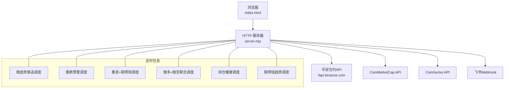
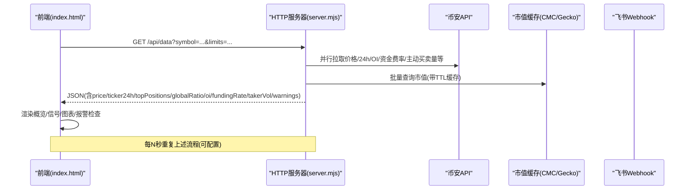
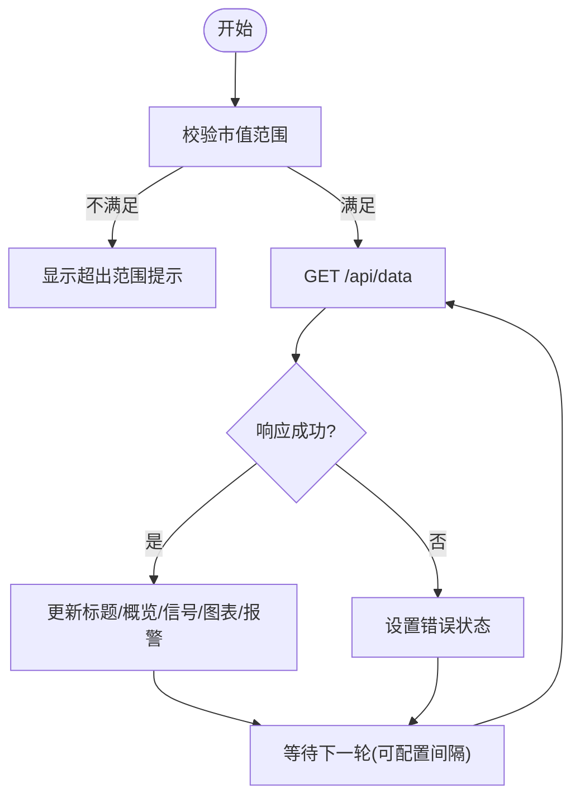
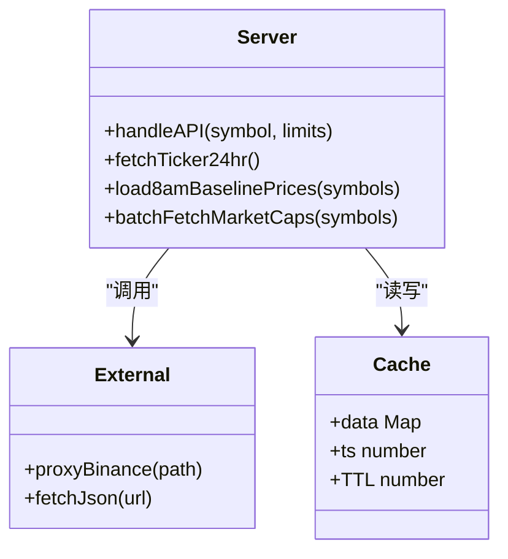
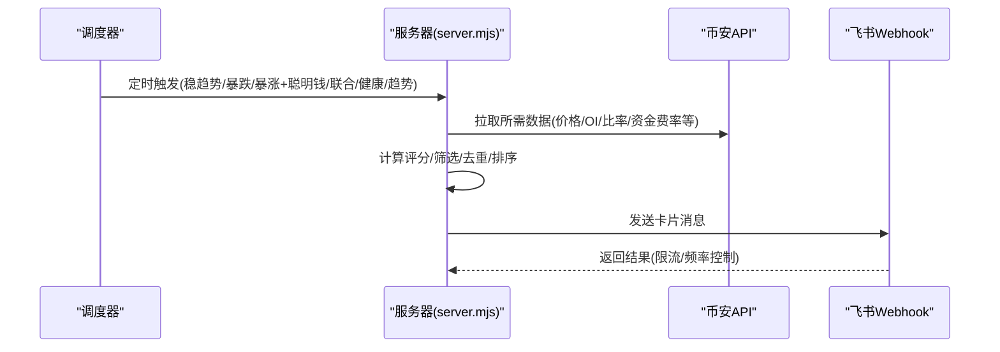
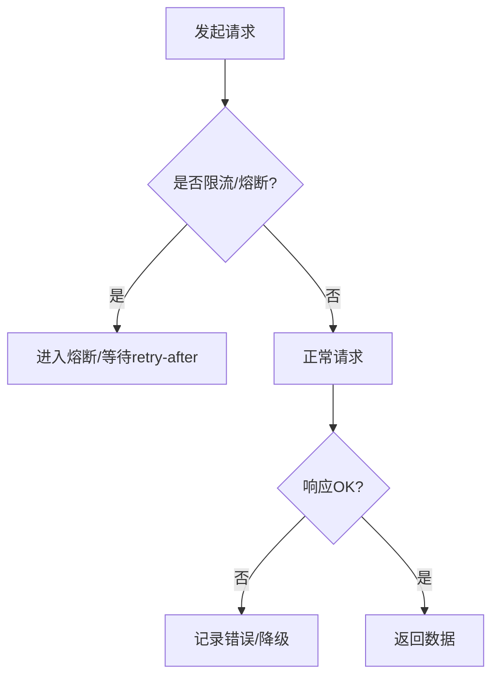
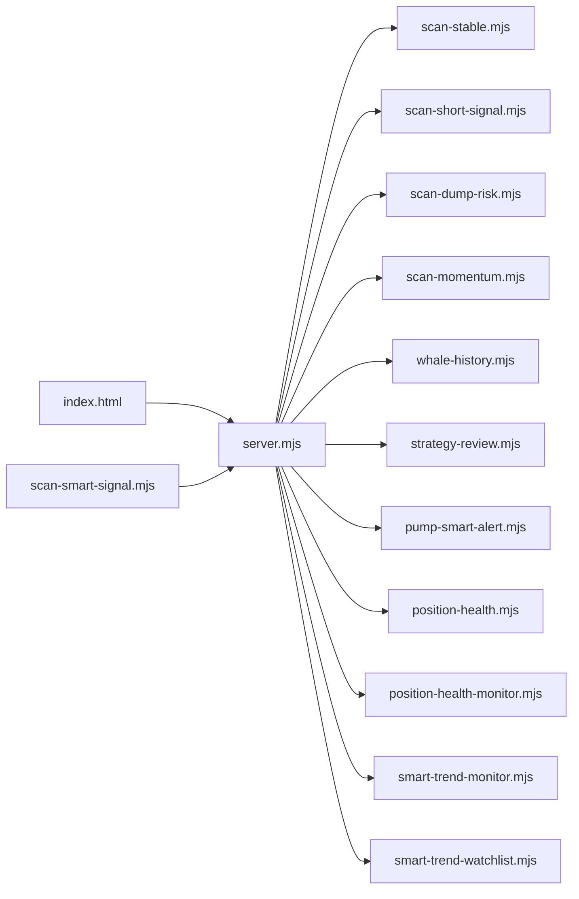

# 实时更新机制

<cite>
**本文引用的文件**   
- [server.mjs](file://server.mjs)
- [index.html](file://index.html)
- [package.json](file://package.json)
- [scan-smart-signal.mjs](file://scan-smart-signal.mjs)
- [position-health-monitor.mjs](file://position-health-monitor.mjs)
- [smart-trend-monitor.mjs](file://smart-trend-monitor.mjs)
</cite>

## 目录
1. [引言](#引言)
2. [项目结构](#项目结构)
3. [核心组件](#核心组件)
4. [架构总览](#架构总览)
5. [详细组件分析](#详细组件分析)
6. [依赖关系分析](#依赖关系分析)
7. [性能考量](#性能考量)
8. [故障排查指南](#故障排查指南)
9. [结论](#结论)
10. [附录：实时数据订阅与自定义事件开发指南](#附录实时数据订阅与自定义事件开发指南)

## 引言
本文件围绕“实时更新机制”展开，聚焦以下目标：
- 说明当前系统的数据拉取与推送模式（HTTP轮询 + 定时任务），并解释为何未采用WebSocket。
- 阐述前端状态同步、增量更新策略、冲突解决与一致性保证。
- 梳理连接管理、错误处理、重连策略与性能监控的实现细节。
- 提供基于现有HTTP接口的“实时数据订阅接口”和“自定义事件处理方法”的开发指南。

## 项目结构
本项目为Node.js服务+单页前端组合：
- 服务端：基于原生http模块的HTTP服务器，暴露REST API，负责聚合多源数据、调度定时扫描与推送。
- 前端：单HTML页面，内置样式与脚本，通过HTTP轮询获取数据并渲染图表与指标。
- 工具与策略：多个独立mjs模块实现信号扫描、趋势监控、持仓健康等能力。

图示来源
- [server.mjs:1490-1999](file://server.mjs#L1490-L1999)
- [index.html:2267-2313](file://index.html#L2267-L2313)

章节来源
- [server.mjs:1490-1999](file://server.mjs#L1490-L1999)
- [index.html:2267-2313](file://index.html#L2267-L2313)
- [package.json:1-22](file://package.json#L1-L22)

## 核心组件
- HTTP服务器与路由：集中处理所有REST请求，包括行情聚合、智能信号、鲸鱼历史、策略复盘、用户持仓与健康评估等。
- 定时调度器：按固定周期或上海时间整点触发各类扫描与推送（稳趋势、暴跌预警、暴涨+聪明钱、做多+做空联合、持仓健康、聪明钱趋势）。
- 前端轮询器：以可配置间隔（如30s/60s/2min/5min）调用/api/data，渲染概览、信号面板、K线与多维图表，并执行本地报警逻辑。
- 外部集成：币安合约API、CMC/CoinGecko市值缓存、飞书卡片推送。

章节来源
- [server.mjs:1490-1999](file://server.mjs#L1490-L1999)
- [index.html:2267-2313](file://index.html#L2267-L2313)

## 架构总览
当前系统采用“后端定时任务 + 前端HTTP轮询”的混合模式，而非WebSocket长连接。其优势在于：
- 部署简单，无需维护长连接与会话状态。
- 天然具备幂等性与重试友好性。
- 便于水平扩展与负载均衡。

图示来源
- [server.mjs:1765-1782](file://server.mjs#L1765-L1782)
- [server.mjs:508-538](file://server.mjs#L508-L538)
- [server.mjs:907-945](file://server.mjs#L907-L945)
- [index.html:2267-2313](file://index.html#L2267-L2313)

## 详细组件分析

### 1) 前端轮询与状态同步
- 轮询机制：使用setInterval控制倒计时，到点发起fetch('/api/data')，成功后更新全局_lastSmartData并刷新各视图。
- 状态展示：根据返回数据的warnings字段提示部分指标缺失；若失败则显示错误信息。
- 增量更新：前端对每个图表区域进行局部渲染，避免全量重绘；同时保留上次结果用于对比与动画过渡。
- 冲突与一致性：由于每次请求均为完整快照，不存在并发写冲突；若某项指标失败，warnings会告知前端降级展示。

图示来源
- [index.html:2267-2313](file://index.html#L2267-L2313)

章节来源
- [index.html:2267-2313](file://index.html#L2267-L2313)

### 2) 服务端数据聚合与增量计算
- 聚合接口：/api/data根据参数并行拉取多项指标，合并后返回统一JSON。
- 增量基准：引入“8am基准价”概念，计算自当日08:00以来的涨跌幅，作为更贴近交易日的参考。
- 市值过滤：结合CMC/CoinGecko缓存，按阈值过滤大市值标的，减少噪声。
- 并发与去重：ticker/24hr短TTL缓存+inflight去重，避免同一轮推送重复请求。

图示来源
- [server.mjs:508-538](file://server.mjs#L508-L538)
- [server.mjs:84-105](file://server.mjs#L84-L105)
- [server.mjs:164-184](file://server.mjs#L164-L184)
- [server.mjs:907-945](file://server.mjs#L907-L945)

章节来源
- [server.mjs:508-538](file://server.mjs#L508-L538)
- [server.mjs:84-105](file://server.mjs#L84-L105)
- [server.mjs:164-184](file://server.mjs#L164-L184)
- [server.mjs:907-945](file://server.mjs#L907-L945)

### 3) 定时任务与推送（非WebSocket）
- 稳趋势推送：按上海时间整点周期触发，生成表格卡片推送到飞书。
- 暴跌预警：按周期扫描风险等级，输出高危/警告列表。
- 暴涨+聪明钱：按分钟级周期扫描，跟踪连续加仓行为，避免频繁打扰。
- 做多+做空联合：综合右侧稳趋势与做空信号，合并动量因子，输出推荐清单。
- 持仓健康：定时+紧急双模式，支持同仓冷却去重。
- 聪明钱趋势：持久化状态与小时槽位，驱动看板与推送。

图示来源
- [server.mjs:802-821](file://server.mjs#L802-L821)
- [server.mjs:1429-1448](file://server.mjs#L1429-L1448)
- [server.mjs:1450-1467](file://server.mjs#L1450-L1467)
- [server.mjs:1469-1488](file://server.mjs#L1469-L1488)
- [position-health-monitor.mjs:156-185](file://position-health-monitor.mjs#L156-L185)
- [smart-trend-monitor.mjs:36-113](file://smart-trend-monitor.mjs#L36-L113)

章节来源
- [server.mjs:802-821](file://server.mjs#L802-L821)
- [server.mjs:1429-1448](file://server.mjs#L1429-L1448)
- [server.mjs:1450-1467](file://server.mjs#L1450-L1467)
- [server.mjs:1469-1488](file://server.mjs#L1469-L1488)
- [position-health-monitor.mjs:156-185](file://position-health-monitor.mjs#L156-L185)
- [smart-trend-monitor.mjs:36-113](file://smart-trend-monitor.mjs#L36-L113)

### 4) 错误处理与熔断
- 网络就绪检测：启动时探测币安API可用性，指数退避重试。
- 外部限流熔断：针对第三方Smart Signal API，遇到418/429/403时进入熔断窗口，并在队列中串行化请求。
- 部分失败容忍：/api/data聚合过程中允许部分指标失败，返回warnings供前端降级展示。
- 飞书限流保护：发送卡片时对频控错误进行识别与重试控制。

图示来源
- [server.mjs:107-125](file://server.mjs#L107-L125)
- [scan-smart-signal.mjs:41-74](file://scan-smart-signal.mjs#L41-L74)
- [server.mjs:1765-1782](file://server.mjs#L1765-L1782)

章节来源
- [server.mjs:107-125](file://server.mjs#L107-L125)
- [scan-smart-signal.mjs:41-74](file://scan-smart-signal.mjs#L41-L74)
- [server.mjs:1765-1782](file://server.mjs#L1765-L1782)

### 5) 连接管理与重连策略
- 前端：无长连接，采用定时器周期性轮询；当请求失败时，下一次仍会按间隔重试。
- 服务端：对外部API访问封装了重试与退避；对飞书推送有频控识别与重试。
- 注意：日志中出现“请改用websocket避免封禁”，表明高频HTTP可能触发平台限制；但当前代码并未实现WebSocket客户端/服务端，而是通过缓存、并发去重与合理间隔缓解。

章节来源
- [index.html:2302-2313](file://index.html#L2302-L2313)
- [server.mjs:58-76](file://server.mjs#L58-L76)
- [server.mjs:618-644](file://server.mjs#L618-L644)

### 6) 性能监控与可视化
- 前端：状态指示灯、错误提示、倒计时显示，便于观察轮询健康度。
- 服务端：控制台日志输出下次调度时间、扫描结果数量、失败告警等。
- 图表：K线、RSI、大户多空比、OI变化率、资金费率、主动买卖量等多维可视化。

章节来源
- [index.html:2251-2265](file://index.html#L2251-L2265)
- [server.mjs:802-821](file://server.mjs#L802-L821)
- [index.html:2095-2249](file://index.html#L2095-L2249)

## 依赖关系分析
- server.mjs依赖多个策略与监控模块（scan-stable、scan-short-signal、scan-dump-risk、scan-momentum、whale-history、strategy-review、pump-smart-alert、position-health、position-health-monitor、smart-trend-monitor、smart-trend-watchlist）。
- index.html依赖server.mjs提供的REST接口完成数据拉取与渲染。
- scan-smart-signal.mjs提供Smart Signal数据获取与熔断控制。
- position-health-monitor.mjs与smart-trend-monitor.mjs分别实现健康与趋势的定时调度与状态持久化。

图示来源
- [server.mjs:1-28](file://server.mjs#L1-L28)
- [index.html:2267-2313](file://index.html#L2267-L2313)
- [scan-smart-signal.mjs:41-74](file://scan-smart-signal.mjs#L41-L74)

章节来源
- [server.mjs:1-28](file://server.mjs#L1-L28)
- [index.html:2267-2313](file://index.html#L2267-L2313)
- [scan-smart-signal.mjs:41-74](file://scan-smart-signal.mjs#L41-L74)

## 性能考量
- 并发与去重：ticker/24hr缓存+inflight去重，降低重复请求压力。
- 批量市值查询：按批次调用CMC/CoinGecko，减少多次往返。
- 8am基准价缓存：按日期键缓存开盘价，避免重复拉取klines。
- 前端局部渲染：仅更新受影响区域，减少DOM操作开销。
- 限流与熔断：Smart Signal API限流保护，避免雪崩。

[本节为通用指导，不直接分析具体文件]

## 故障排查指南
- 现象：部分指标加载失败，图表不完整
  - 定位：查看/api/data返回的warnings字段，确认哪些子请求失败。
  - 处理：检查代理节点、网络连通性或外部API限流。
- 现象：轮询频繁被限流或封禁
  - 定位：查看日志中的“Way too many requests”提示。
  - 处理：增大前端轮询间隔、启用代理、优化并发与缓存策略。
- 现象：飞书推送失败
  - 定位：检查FEISHU_WEBHOOK配置与频控错误。
  - 处理：调整推送频率、增加重试间隔。

章节来源
- [index.html:2279-2288](file://index.html#L2279-L2288)
- [server.mjs:618-644](file://server.mjs#L618-L644)

## 结论
当前系统通过“HTTP轮询 + 定时任务”的方式实现了稳定的实时数据展示与推送。尽管未采用WebSocket，但借助缓存、并发去重、限流熔断与合理的轮询间隔，已能满足大多数监控场景的需求。对于需要更低延迟的场景，可在未来引入WebSocket通道，并保持向后兼容。

[本节为总结，不直接分析具体文件]

## 附录：实时数据订阅与自定义事件开发指南

### 1) 实时数据订阅接口（基于现有HTTP）
- 主数据接口
  - 路径：/api/data
  - 方法：GET
  - 参数：
    - symbol: 币种（默认SLXUSDT）
    - ratioLimit: 大户持仓比率采样数（默认72）
    - oiLimit: OI历史采样数（默认42）
    - takerLimit: 主动买卖量采样数（默认48）
  - 返回：包含price、ticker24h、topPositions、globalRatio、oi、oiHist、takerVol、fundingRate、fundingRateHist、changeSince8am、warnings等字段。
- 其他相关接口
  - /api/klines：K线数据
  - /api/smart-signal：Smart Signal原始与分析结果
  - /api/whale-history：鲸鱼历史采样
  - /api/config：应用配置（如最大市值阈值）
  - /api/user-positions：用户持仓CRUD
  - /api/position-health：持仓健康评估
  - /api/trigger-*：手动触发各类推送

章节来源
- [server.mjs:1765-1782](file://server.mjs#L1765-L1782)
- [server.mjs:1750-1763](file://server.mjs#L1750-L1763)
- [server.mjs:1784-1801](file://server.mjs#L1784-L1801)
- [server.mjs:1803-1816](file://server.mjs#L1803-L1816)
- [server.mjs:1629-1636](file://server.mjs#L1629-L1636)
- [server.mjs:1687-1734](file://server.mjs#L1687-L1734)
- [server.mjs:1638-1679](file://server.mjs#L1638-L1679)
- [server.mjs:1516-1538](file://server.mjs#L1516-L1538)
- [server.mjs:1870-1935](file://server.mjs#L1870-L1935)

### 2) 前端增量更新与状态同步建议
- 增量更新
  - 使用window._lastSmartData保存上一次结果，对比新增/变更字段，仅更新差异部分。
  - 对图表数据采用追加新点的方式，避免全量重绘。
- 冲突解决
  - 由于每次请求返回完整快照，前端以最新为准；若warnings存在，则标记对应图表为降级状态。
- 一致性保证
  - 在渲染前校验必要字段是否存在；缺失则跳过该图表或显示占位。
- 自定义事件处理
  - 在前端定义事件总线（如CustomEvent），在数据更新后派发事件，供不同模块监听（例如：数据更新、报警触发、图表切换）。
  - 示例思路：
    - 数据更新事件：在fetchData成功后派发，携带最新数据与时间戳。
    - 报警事件：在checkAlerts触发时派发，携带报警类型与详情。
    - 图表切换事件：在switchTF时派发，携带时间框架与新数据范围。

章节来源
- [index.html:2267-2313](file://index.html#L2267-L2313)
- [index.html:2279-2288](file://index.html#L2279-L2288)

### 3) 连接重连策略（前端）
- 轮询失败时，保持原有间隔不变，下一次继续尝试。
- 可选增强：指数退避（在连续失败若干次后适当延长间隔），恢复成功后重置间隔。
- 状态反馈：通过状态指示灯与错误文本提示用户当前健康状况。

章节来源
- [index.html:2302-2313](file://index.html#L2302-L2313)
- [index.html:2251-2265](file://index.html#L2251-L2265)

### 4) 性能监控功能（前端）
- 统计最近N次请求的成功率与平均耗时。
- 在UI上展示关键指标（成功率、平均延迟、失败次数）。
- 在控制台输出详细日志，便于问题定位。

[本节为通用指导，不直接分析具体文件]