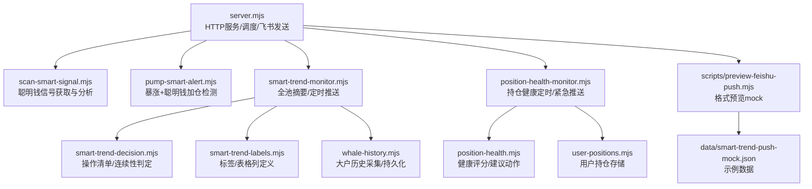
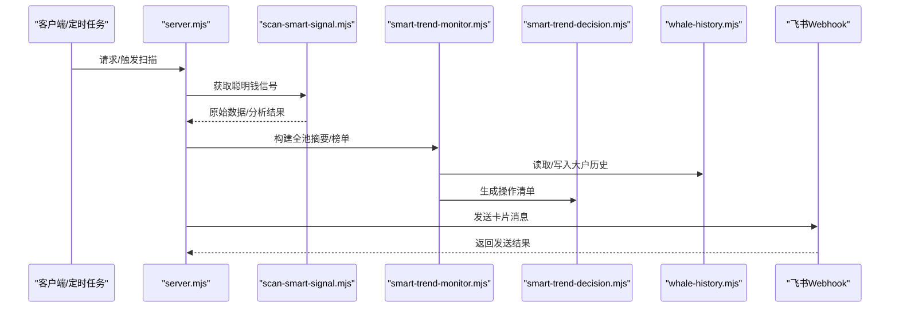
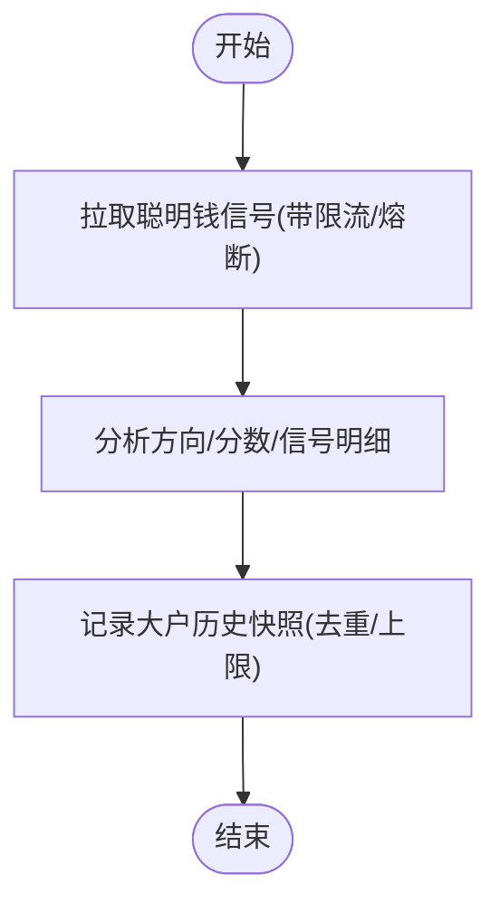
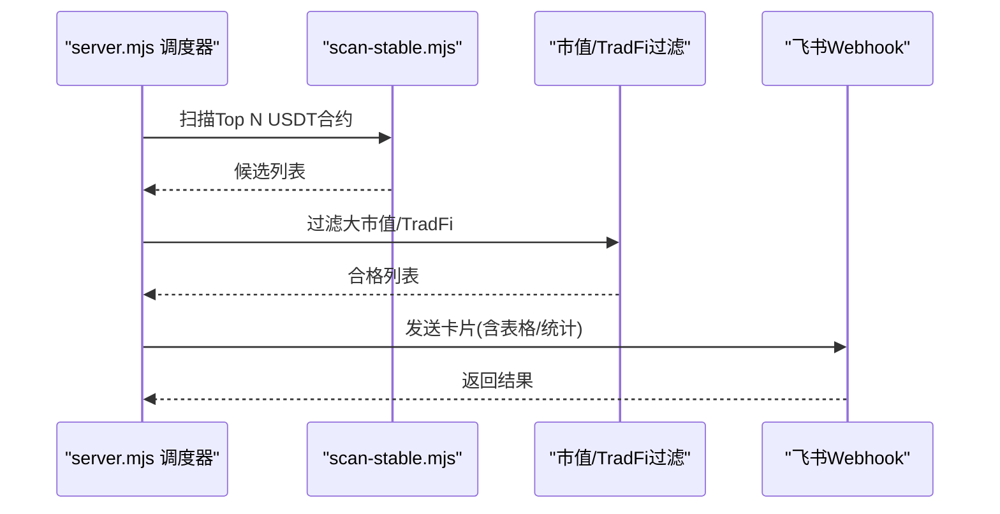
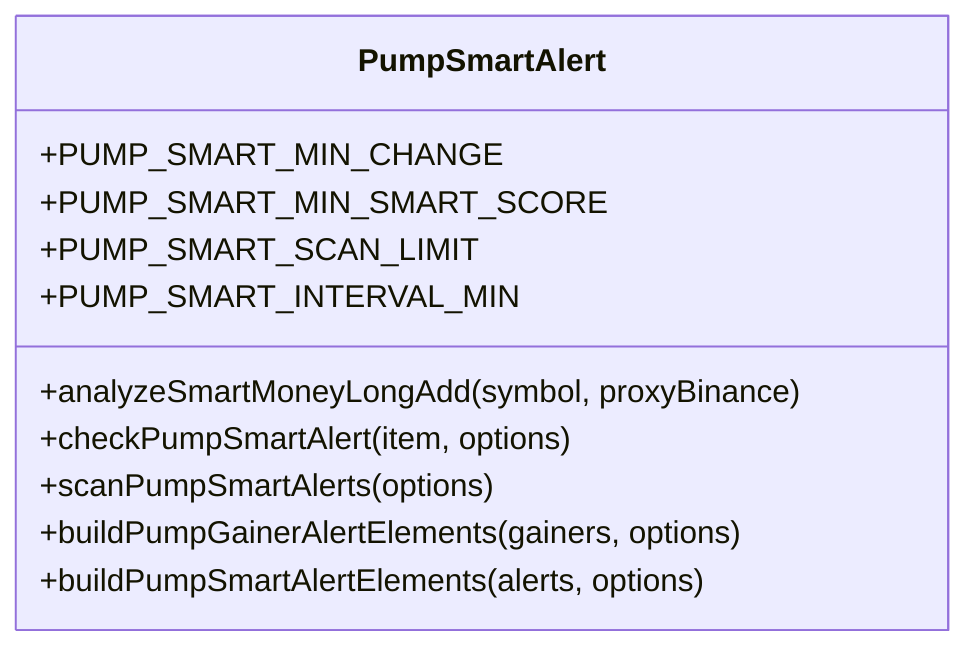
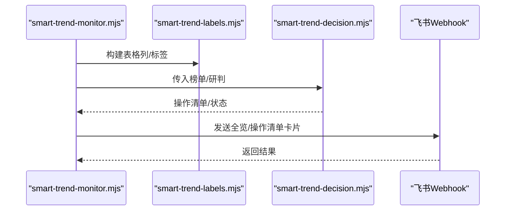
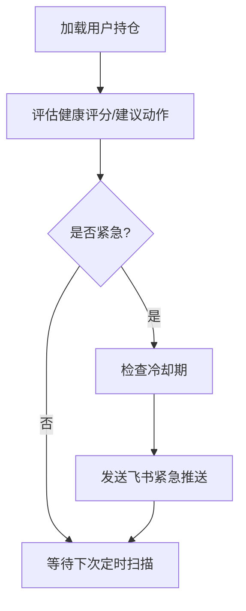
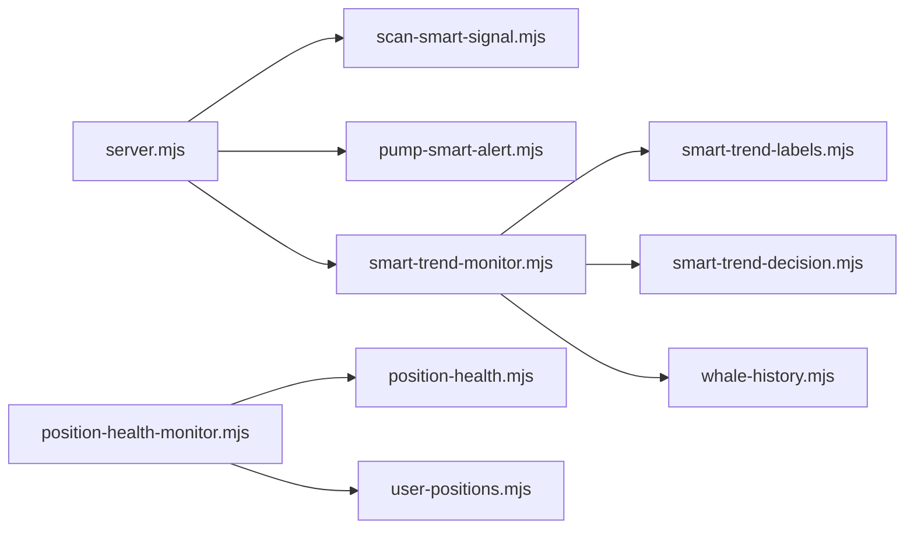

# 报警通知系统

<cite>
**本文引用的文件**
- [README.md](file://README.md)
- [package.json](file://package.json)
- [server.mjs](file://server.mjs)
- [pump-smart-alert.mjs](file://pump-smart-alert.mjs)
- [smart-trend-monitor.mjs](file://smart-trend-monitor.mjs)
- [smart-trend-decision.mjs](file://smart-trend-decision.mjs)
- [smart-trend-labels.mjs](file://smart-trend-labels.mjs)
- [whale-history.mjs](file://whale-history.mjs)
- [position-health-monitor.mjs](file://position-health-monitor.mjs)
- [position-health.mjs](file://position-health.mjs)
- [user-positions.mjs](file://user-positions.mjs)
- [scan-smart-signal.mjs](file://scan-smart-signal.mjs)
- [scripts/preview-feishu-push.mjs](file://scripts/preview-feishu-push.mjs)
- [data/smart-trend-push-mock.json](file://data/smart-trend-push-mock.json)
</cite>

## 目录
1. [简介](#简介)
2. [项目结构](#项目结构)
3. [核心组件](#核心组件)
4. [架构总览](#架构总览)
5. [详细组件分析](#详细组件分析)
6. [依赖关系分析](#依赖关系分析)
7. [性能与降噪](#性能与降噪)
8. [故障排查指南](#故障排查指南)
9. [结论](#结论)
10. [附录：配置与开发指南](#附录配置与开发指南)

## 简介
本仓库实现了一个面向币安合约的“聪明钱”监控与报警通知系统，覆盖价格预警、技术指标报警、大户行为监控与自定义条件触发机制。系统提供飞书推送、浏览器弹窗与声音提醒等通知渠道，并内置智能降噪、误报过滤与历史记录能力。同时支持持仓健康监控与操作清单生成，便于用户进行策略复盘与决策辅助。

## 项目结构
- 服务端入口与路由：server.mjs
- 扫描与信号模块：scan-smart-signal.mjs、pump-smart-alert.mjs
- 趋势与决策：smart-trend-monitor.mjs、smart-trend-decision.mjs、smart-trend-labels.mjs
- 大户历史与采集：whale-history.mjs
- 持仓健康评估与推送：position-health.mjs、position-health-monitor.mjs、user-positions.mjs
- 脚本与预览：scripts/preview-feishu-push.mjs、data/smart-trend-push-mock.json
- 文档与元信息：README.md、package.json

图表来源
- [server.mjs:1-120](file://server.mjs#L1-L120)
- [scan-smart-signal.mjs:1-84](file://scan-smart-signal.mjs#L1-L84)
- [pump-smart-alert.mjs:1-112](file://pump-smart-alert.mjs#L1-L112)
- [smart-trend-monitor.mjs:1-120](file://smart-trend-monitor.mjs#L1-L120)
- [smart-trend-decision.mjs:1-120](file://smart-trend-decision.mjs#L1-L120)
- [smart-trend-labels.mjs:1-60](file://smart-trend-labels.mjs#L1-L60)
- [whale-history.mjs:1-60](file://whale-history.mjs#L1-L60)
- [position-health-monitor.mjs:1-60](file://position-health-monitor.mjs#L1-L60)
- [position-health.mjs:1-60](file://position-health.mjs#L1-L60)
- [user-positions.mjs:1-40](file://user-positions.mjs#L1-L40)
- [scripts/preview-feishu-push.mjs:1-60](file://scripts/preview-feishu-push.mjs#L1-L60)
- [data/smart-trend-push-mock.json:1-50](file://data/smart-trend-push-mock.json#L1-L50)

章节来源
- [README.md:1-210](file://README.md#L1-L210)
- [package.json:1-22](file://package.json#L1-L22)

## 核心组件
- 报警规则与阈值
  - 价格突破/跌破、RSI超买超卖、大户翻多/空、买卖激增等基础条件在 README 中明确列出，作为前端面板与终端版的基础报警项。
  - 右侧稳趋势推送、暴跌风险、做多/做空信号扫描由 server.mjs 集成，并通过环境变量控制开关与阈值。
- 通知渠道管理
  - 飞书 Webhook 推送：统一封装 sendFeishu/sendFeishuCardV2，支持卡片模板与重试限流处理。
  - 浏览器通知与声音：通过浏览器 API 触发系统通知与提示音（Web 面板侧）。
- 消息格式化
  - 使用 smart-trend-labels.mjs 提供的标签与表格列定义，统一输出风格；decision 模块负责将数据转为可执行的操作清单。
- 历史记录与降噪
  - whale-history.mjs 持久化大户快照，smart-trend-monitor.mjs 维护上次状态与 8am 基准，避免重复推送与误报。
  - position-health-monitor.mjs 对危险/止损事件设置冷却期，降低告警风暴。

章节来源
- [README.md:123-159](file://README.md#L123-L159)
- [server.mjs:599-644](file://server.mjs#L599-L644)
- [smart-trend-labels.mjs:203-224](file://smart-trend-labels.mjs#L203-L224)
- [whale-history.mjs:10-22](file://whale-history.mjs#L10-L22)
- [smart-trend-monitor.mjs:93-137](file://smart-trend-monitor.mjs#L93-L137)
- [position-health-monitor.mjs:14-66](file://position-health-monitor.mjs#L14-L66)

## 架构总览
系统以 Node.js HTTP 服务为核心，聚合多个扫描与评估模块，按周期或事件触发报警，并通过飞书机器人推送至群聊。Web 面板提供可视化与本地通知（声音/弹窗），后端提供代理接口与批量数据处理能力。

图表来源
- [server.mjs:1-120](file://server.mjs#L1-L120)
- [scan-smart-signal.mjs:76-84](file://scan-smart-signal.mjs#L76-L84)
- [smart-trend-monitor.mjs:189-200](file://smart-trend-monitor.mjs#L189-L200)
- [smart-trend-decision.mjs:556-640](file://smart-trend-decision.mjs#L556-L640)
- [whale-history.mjs:121-142](file://whale-history.mjs#L121-L142)
- [server.mjs:599-644](file://server.mjs#L599-L644)

## 详细组件分析

### 价格与技术指标报警
- 价格突破/跌破、RSI 超买超卖、大户翻多/空、买入/卖出激增等条件在 README 中定义，用于面板与终端版的实时提示。
- 这些条件通常结合 24h 行情与 5m/1h 比率数据，配合阈值判断后触发本地通知与可选飞书推送。

章节来源
- [README.md:123-133](file://README.md#L123-L133)

### 大户行为监控与聪明钱信号
- 聪明钱信号获取与缓存：scan-smart-signal.mjs 提供 fetchSmartSignal 与 analyzeSmartSignal，内置限流与熔断保护，返回方向、分数与明细信号。
- 大户历史采集：whale-history.mjs 周期性抓取并持久化大户快照，供趋势模块计算 8am 基准与变化幅度。

图表来源
- [scan-smart-signal.mjs:57-84](file://scan-smart-signal.mjs#L57-L84)
- [whale-history.mjs:70-90](file://whale-history.mjs#L70-L90)

章节来源
- [scan-smart-signal.mjs:1-84](file://scan-smart-signal.mjs#L1-L84)
- [whale-history.mjs:1-90](file://whale-history.mjs#L1-L90)

### 自定义条件触发与“右侧稳趋势”推送
- server.mjs 集成 scanRightStable 扫描，按市值过滤、回撤阈值、双周期确认等条件筛选币种，并推送到飞书。
- 推送内容包含价格、相对 8 点涨幅、评分、回撤、大户/全网多空比、连续推荐次数等，支持手动触发与定时调度。

图表来源
- [server.mjs:668-781](file://server.mjs#L668-L781)
- [server.mjs:478-506](file://server.mjs#L478-L506)

章节来源
- [server.mjs:668-781](file://server.mjs#L668-L781)
- [README.md:134-159](file://README.md#L134-L159)

### 暴涨+聪明钱加仓特别提示
- pump-smart-alert.mjs 定义 PUMP_SMART_MIN_CHANGE 与 PUMP_SMART_MIN_SMART_SCORE 等阈值，检测 8 点以来涨幅与聪明钱加仓信号，并发扫描并排序输出。
- 支持飞书卡片展示，包含涨幅、聪明钱分数与信号明细，以及提醒计数。

图表来源
- [pump-smart-alert.mjs:1-191](file://pump-smart-alert.mjs#L1-L191)

章节来源
- [pump-smart-alert.mjs:1-191](file://pump-smart-alert.mjs#L1-L191)

### 聪明钱全池摘要与操作清单
- smart-trend-monitor.mjs 负责每整点汇总全池聪明钱变化，计算 1h 与 8am 基准变化，生成板块表格与市场研判。
- smart-trend-decision.mjs 基于多榜共振、涨跌幅、成交额排名、聪明钱方向与变化幅度等维度打分，输出“立刻关注/继续观察/已失效”三类清单，并提供场景化操作建议与连续性跟踪。

图表来源
- [smart-trend-monitor.mjs:706-765](file://smart-trend-monitor.mjs#L706-L765)
- [smart-trend-decision.mjs:556-640](file://smart-trend-decision.mjs#L556-L640)
- [smart-trend-labels.mjs:203-224](file://smart-trend-labels.mjs#L203-L224)

章节来源
- [smart-trend-monitor.mjs:189-200](file://smart-trend-monitor.mjs#L189-L200)
- [smart-trend-decision.mjs:1-120](file://smart-trend-decision.mjs#L1-L120)
- [smart-trend-labels.mjs:1-60](file://smart-trend-labels.mjs#L1-L60)

### 持仓健康监控与紧急推送
- position-health.mjs 综合右侧稳定度、暴跌风险、做空信号、聪明钱方向与浮盈浮亏等因子，给出健康等级与建议动作（持有/收紧止损/止盈/止损）。
- position-health-monitor.mjs 定时扫描并推送，对危险/止损事件设置冷却期，避免频繁轰炸；支持仅监控指定币种集合。

图表来源
- [position-health.mjs:56-195](file://position-health.mjs#L56-L195)
- [position-health-monitor.mjs:130-186](file://position-health-monitor.mjs#L130-L186)

章节来源
- [position-health.mjs:1-213](file://position-health.mjs#L1-L213)
- [position-health-monitor.mjs:1-186](file://position-health-monitor.mjs#L1-L186)
- [user-positions.mjs:1-64](file://user-positions.mjs#L1-L64)

### 通知渠道管理与消息格式化
- 飞书推送：sendFeishu/sendFeishuCardV2 统一封装，支持卡片 schema 2.0、模板颜色与重试限流处理。
- 浏览器通知与声音：Web 面板侧通过浏览器 API 触发系统通知与提示音（README 提及功能）。
- 消息格式化：smart-trend-labels.mjs 提供统一的标签、表格列与显示逻辑，确保各模块输出一致。

章节来源
- [server.mjs:599-644](file://server.mjs#L599-L644)
- [README.md:13-16](file://README.md#L13-L16)
- [smart-trend-labels.mjs:203-224](file://smart-trend-labels.mjs#L203-L224)

### 报警历史记录、误报过滤与智能降噪
- 历史记录：whale-history.mjs 持久化大户快照，smart-trend-monitor.mjs 持久化 lastState 与 decisionState，支持启动时回填与增量保存。
- 误报过滤：市值过滤与 TradFi 符号排除在 server.mjs 中集中处理，避免大盘股或非目标标的进入推送。
- 智能降噪：
  - 同一整点不重复推送（lastDigestPushSlotMs）。
  - 持仓健康紧急推送冷却期（urgentCooldownMin）。
  - 飞书频控重试与错误分类。

章节来源
- [whale-history.mjs:10-22](file://whale-history.mjs#L10-L22)
- [smart-trend-monitor.mjs:93-137](file://smart-trend-monitor.mjs#L93-L137)
- [server.mjs:478-506](file://server.mjs#L478-L506)
- [server.mjs:618-644](file://server.mjs#L618-L644)
- [position-health-monitor.mjs:14-66](file://position-health-monitor.mjs#L14-L66)

## 依赖关系分析
- server.mjs 作为编排中心，依赖多个扫描与评估模块，并通过环境变量控制功能开关与阈值。
- smart-trend-monitor.mjs 依赖 whale-history.mjs 与 smart-trend-labels.mjs，输出全池摘要与板块表格。
- smart-trend-decision.mjs 依赖 labels 模块，将数据转化为操作清单与场景化建议。
- position-health-monitor.mjs 依赖 user-positions.mjs 与 position-health.mjs，完成持仓健康评估与推送。

图表来源
- [server.mjs:1-28](file://server.mjs#L1-L28)
- [smart-trend-monitor.mjs:1-25](file://smart-trend-monitor.mjs#L1-L25)
- [smart-trend-decision.mjs:1-14](file://smart-trend-decision.mjs#L1-L14)
- [position-health-monitor.mjs:1-12](file://position-health-monitor.mjs#L1-L12)

章节来源
- [server.mjs:1-28](file://server.mjs#L1-L28)
- [smart-trend-monitor.mjs:1-25](file://smart-trend-monitor.mjs#L1-L25)
- [smart-trend-decision.mjs:1-14](file://smart-trend-decision.mjs#L1-L14)
- [position-health-monitor.mjs:1-12](file://position-health-monitor.mjs#L1-L12)

## 性能与降噪
- 并发与缓存
  - ticker/24hr 短 TTL 缓存与并发去重，避免同轮推送重复请求。
  - pmap 并行处理，限制并发度，提升吞吐。
- 限流与熔断
  - Smart Signal API 限流与熔断保护，自动退避与重试。
- 降噪策略
  - 整点重复推送去重。
  - 持仓健康紧急推送冷却期。
  - 市值与 TradFi 符号过滤减少噪音。

章节来源
- [server.mjs:84-105](file://server.mjs#L84-L105)
- [server.mjs:150-162](file://server.mjs#L150-L162)
- [scan-smart-signal.mjs:57-74](file://scan-smart-signal.mjs#L57-L74)
- [position-health-monitor.mjs:14-66](file://position-health-monitor.mjs#L14-L66)
- [server.mjs:478-506](file://server.mjs#L478-L506)

## 故障排查指南
- 飞书推送失败
  - 检查 FEISHU_WEBHOOK 是否配置正确。
  - 查看返回码与 msg，区分频控与业务错误；必要时调整推送频率或分卡发送。
- 币安 API 异常
  - 检查代理节点与网络连通性；参考 proxy-setup.mjs 的代理配置。
  - 若出现 418/429/403，遵循熔断退避策略，稍后重试。
- 端口占用
  - 使用 dev-restart.mjs 自动清理旧进程；或手动终止占用端口的进程。
- 持仓健康推送未触发
  - 确认 POSITION_HEALTH_ENABLED 与 watchSymbols 配置。
  - 检查 urgentCheckMin 与 urgentCooldownMin 是否导致冷却期过长。

章节来源
- [server.mjs:599-644](file://server.mjs#L599-L644)
- [README.md:40-53](file://README.md#L40-L53)
- [scan-smart-signal.mjs:42-55](file://scan-smart-signal.mjs#L42-L55)
- [position-health-monitor.mjs:156-186](file://position-health-monitor.mjs#L156-L186)

## 结论
本系统围绕“聪明钱”数据构建了从数据采集、信号分析、趋势研判到操作清单的全链路能力，并通过飞书推送与本地通知形成闭环。通过市值过滤、TradFi 排除、限流熔断与冷却期等机制，有效降低了误报与噪声。未来可扩展更多第三方平台集成与自定义模板，以满足多样化通知需求。

## 附录：配置与开发指南

### 环境配置要点
- 基本配置
  - PORT：Web 面板监听端口
  - FEISHU_WEBHOOK：飞书机器人 Webhook URL
  - CMC_API_KEY：CoinMarketCap Pro API Key（可选，回退 CoinGecko）
  - MAX_MARKET_CAP_USD：市值上限过滤（美元，0 关闭）
- 推送与扫描
  - STABLE_PUSH_HOURS / STABLE_SCAN_LIMIT / STABLE_MAX_DRAWDOWN：右侧稳趋势推送间隔、数量与回撤阈值
  - LONG_PUSH_HOURS / LONG_MIN_SCORE：做多信号推送参数
  - DUMP_PUSH_HOURS / DUMP_MIN_RISK：暴跌风险推送参数
  - SMART_TREND_INTERVAL_MIN / SMART_TREND_COOLDOWN_MIN：聪明钱监控间隔与冷却期
  - SMART_TREND_WATCH_SYMBOLS：聪明钱监控币种集合
  - POSITION_HEALTH_*：持仓健康监控相关参数
- 其他
  - REALTIME_ALERT_INTERVAL_MIN：实时暴涨提醒扫描间隔
  - WHALE_HISTORY_INTERVAL_MIN / WHALE_HISTORY_MAX_POINTS：大户历史采集间隔与最大点数

章节来源
- [README.md:142-159](file://README.md#L142-L159)
- [server.mjs:540-590](file://server.mjs#L540-L590)
- [whale-history.mjs:10-16](file://whale-history.mjs#L10-L16)

### 自定义报警类型与通知模板
- 新增报警类型
  - 在 server.mjs 中添加新的扫描函数与路由，复用 filterEligibleSymbols 与 sendFeishuCardV2。
  - 在 pump-smart-alert.mjs 中扩展 checkPumpSmartAlert 逻辑，定义新阈值与信号组合。
- 通知模板
  - 使用 smart-trend-labels.mjs 的 DIGEST_TABLE_COLUMNS 与 buildDigestTableRows 统一表格样式。
  - 在 scripts/preview-feishu-push.mjs 中使用 mock 数据验证卡片布局与配色。

章节来源
- [server.mjs:478-506](file://server.mjs#L478-L506)
- [server.mjs:599-644](file://server.mjs#L599-L644)
- [pump-smart-alert.mjs:71-112](file://pump-smart-alert.mjs#L71-L112)
- [smart-trend-labels.mjs:203-224](file://smart-trend-labels.mjs#L203-L224)
- [scripts/preview-feishu-push.mjs:1-60](file://scripts/preview-feishu-push.mjs#L1-L60)

### 第三方平台集成
- 飞书 Webhook 已原生支持，可通过 sendFeishuCardV2 发送卡片消息。
- 如需接入其他平台，可在 server.mjs 中新增 sendToXxx 函数，复用统一的消息元素构建逻辑（labels/decision 模块），并在路由中暴露对应 API。

章节来源
- [server.mjs:599-644](file://server.mjs#L599-L644)
- [smart-trend-labels.mjs:203-224](file://smart-trend-labels.mjs#L203-L224)
- [smart-trend-decision.mjs:721-751](file://smart-trend-decision.mjs#L721-L751)