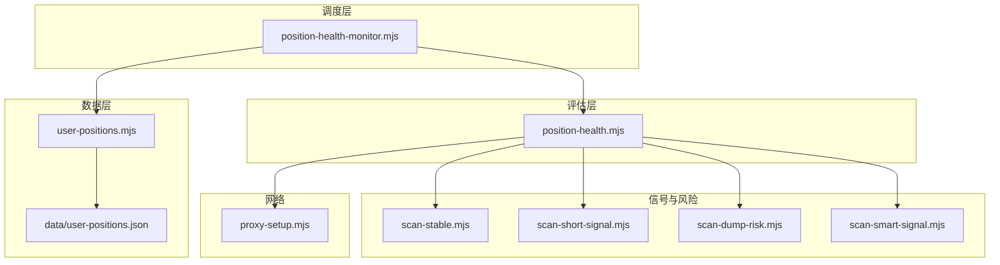
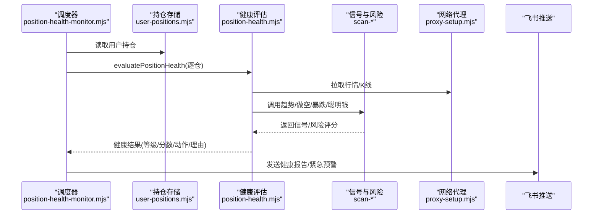
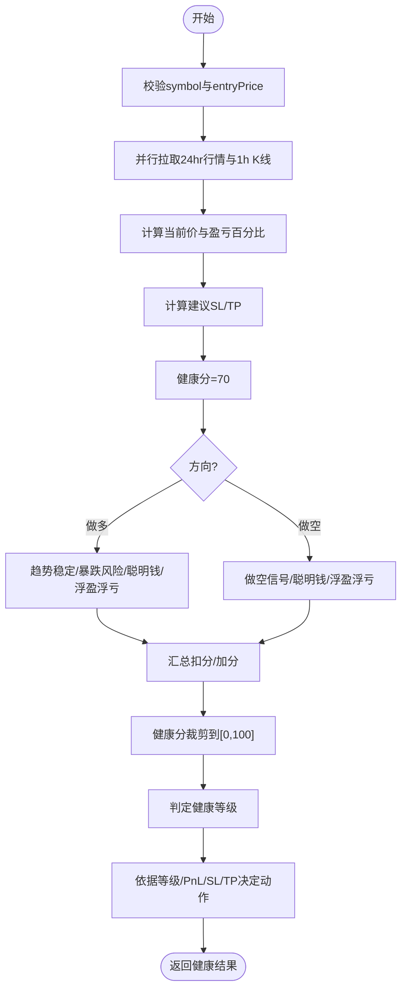
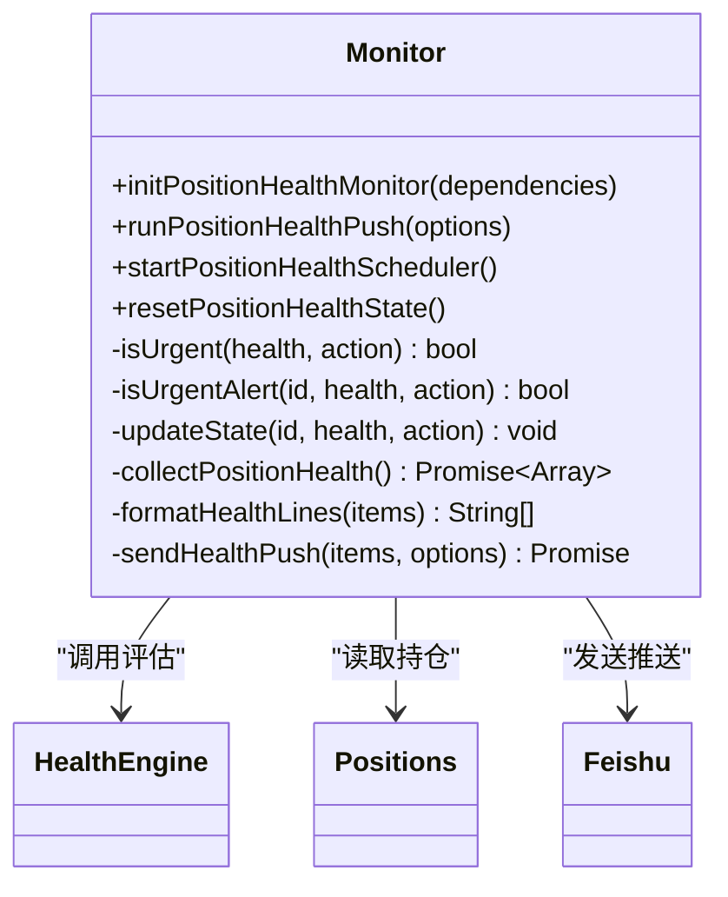
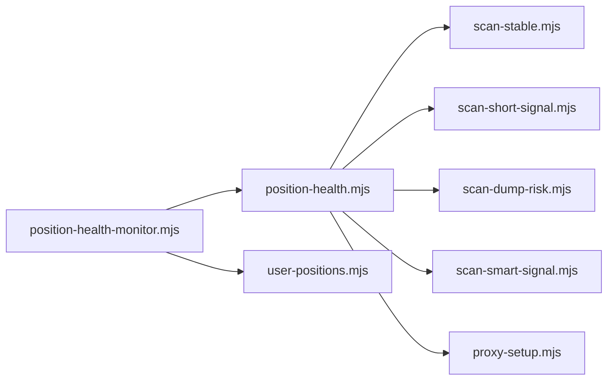

# 持仓健康监控

<cite>
**本文引用的文件**   
- [position-health-monitor.mjs](file://position-health-monitor.mjs)
- [position-health.mjs](file://position-health.mjs)
- [user-positions.mjs](file://user-positions.mjs)
- [scan-stable.mjs](file://scan-stable.mjs)
- [scan-short-signal.mjs](file://scan-short-signal.mjs)
- [scan-dump-risk.mjs](file://scan-dump-risk.mjs)
- [scan-smart-signal.mjs](file://scan-smart-signal.mjs)
- [proxy-setup.mjs](file://proxy-setup.mjs)
- [README.md](file://README.md)
- [data/user-positions.json](file://data/user-positions.json)
</cite>

## 目录
1. [简介](#简介)
2. [项目结构](#项目结构)
3. [核心组件](#核心组件)
4. [架构总览](#架构总览)
5. [详细组件分析](#详细组件分析)
6. [依赖关系分析](#依赖关系分析)
7. [性能与可扩展性](#性能与可扩展性)
8. [故障排查指南](#故障排查指南)
9. [结论](#结论)
10. [附录：配置与使用](#附录配置与使用)

## 简介
本系统提供“持仓健康监控”能力，围绕多币种合约持仓进行风险评估、健康度评分与预警触发。其核心包括：
- 风险评估模型：综合趋势稳定性、做空信号、暴跌风险、聪明钱方向与浮盈/浮亏等维度打分。
- 健康度评分算法：基于多维度指标计算健康分数并映射为健康/警告/危险等级。
- 预警触发机制：定时报告与紧急告警双通道，具备冷却去重与状态记忆。
- 多币种持仓管理：本地持久化记录多币种、多空方向、开仓价、止损止盈与备注。
- 方向识别与价格跟踪：自动识别做多/做空，实时获取现价并计算盈亏百分比。
- 止损止盈监控：支持用户自定义或根据K线动态建议的止损止盈位，并给出距离百分比。
- 风险指标与市场波动分析：结合RSI、MACD、均线、回撤、成交量、资金费率、OI变化等。
- 压力测试：通过极端跌幅、连续阴线、卖压极重、负费率等因子叠加评估风险。
- 持仓建议生成：输出继续持有/收紧止损/考虑止盈/建议止损等动作及理由。
- 调仓提醒与风险管理报告：飞书推送包含时间、标的、健康等级、动作与建议要点。
- 可配置参数：监控开关、推送频率、紧急扫描间隔、冷却时长、关注标的白名单等。

## 项目结构
与持仓健康监控相关的核心模块如下：
- 调度与推送：position-health-monitor.mjs
- 健康评估引擎：position-health.mjs
- 持仓数据管理：user-positions.mjs + data/user-positions.json
- 趋势与信号：scan-stable.mjs（右侧稳趋势）、scan-short-signal.mjs（做空信号）
- 风险与聪明钱：scan-dump-risk.mjs（暴跌风险）、scan-smart-signal.mjs（聪明钱信号）
- 网络与代理：proxy-setup.mjs
- 使用说明与环境变量：README.md

图表来源
- [position-health-monitor.mjs:1-186](file://position-health-monitor.mjs#L1-L186)
- [position-health.mjs:1-213](file://position-health.mjs#L1-L213)
- [user-positions.mjs:1-64](file://user-positions.mjs#L1-L64)
- [scan-stable.mjs:1-290](file://scan-stable.mjs#L1-L290)
- [scan-short-signal.mjs:1-276](file://scan-short-signal.mjs#L1-L276)
- [scan-dump-risk.mjs:1-286](file://scan-dump-risk.mjs#L1-L286)
- [scan-smart-signal.mjs:1-238](file://scan-smart-signal.mjs#L1-L238)
- [proxy-setup.mjs:1-71](file://proxy-setup.mjs#L1-L71)

章节来源
- [position-health-monitor.mjs:1-186](file://position-health-monitor.mjs#L1-L186)
- [position-health.mjs:1-213](file://position-health.mjs#L1-L213)
- [user-positions.mjs:1-64](file://user-positions.mjs#L1-L64)
- [README.md:1-210](file://README.md#L1-L210)

## 核心组件
- 调度器与推送器
  - 负责读取持仓、调用健康评估、格式化结果、发送飞书消息，并提供定时任务与紧急模式。
  - 关键能力：watchSymbols过滤、pushHours整点计划、urgentMin紧急扫描、urgentCooldownMin冷却去重。
- 健康评估器
  - 输入：symbol、direction、entryPrice、stopLoss、takeProfit。
  - 输出：健康等级、健康分数、动作建议、理由、止损止盈位与距离百分比。
  - 核心逻辑：并行拉取行情与K线，计算PnL，调用趋势/做空/暴跌/聪明钱信号，综合打分。
- 持仓存储
  - 本地JSON持久化，支持新增、删除、读取；校验USDT合约符号与入场价有效性。
- 信号与风险模块
  - 右侧稳趋势：多周期回撤+均线/RSI/MACD/放量等因子判断趋势完整性。
  - 做空信号：暴涨回落、天量后缩量、RSI超买、偏离均线、连续阴线、高位盘整、持续阴跌、8am大跌等。
  - 暴跌风险：24h/4h跌幅、高点回撤、OI萎缩、卖压、大户偏空、散多大空、负费率、连续阴线、缩量下跌等。
  - 聪明钱信号：净多/净空、盈利多头/空头、鲸鱼仓位、均价对比等。

章节来源
- [position-health-monitor.mjs:1-186](file://position-health-monitor.mjs#L1-L186)
- [position-health.mjs:1-213](file://position-health.mjs#L1-L213)
- [user-positions.mjs:1-64](file://user-positions.mjs#L1-L64)
- [scan-stable.mjs:1-290](file://scan-stable.mjs#L1-L290)
- [scan-short-signal.mjs:1-276](file://scan-short-signal.mjs#L1-L276)
- [scan-dump-risk.mjs:1-286](file://scan-dump-risk.mjs#L1-L286)
- [scan-smart-signal.mjs:1-238](file://scan-smart-signal.mjs#L1-L238)

## 架构总览
整体流程：调度器定时/紧急触发 → 读取本地持仓 → 并发评估各持仓健康度 → 组合理由与动作 → 推送至飞书。

图表来源
- [position-health-monitor.mjs:72-154](file://position-health-monitor.mjs#L72-L154)
- [position-health.mjs:56-195](file://position-health.mjs#L56-L195)
- [proxy-setup.mjs:49-71](file://proxy-setup.mjs#L49-L71)

## 详细组件分析

### 健康评估引擎（position-health.mjs）
- 输入校验：symbol必填且有效，entryPrice需为正数。
- 数据源：币安合约24hr行情与1小时K线（100根）。
- 盈亏计算：按方向区分做多/做空PnL。
- 建议止损止盈：基于近20根低点支撑与近10根高点阻力，结合入场价比例约束。
- 健康分初始值：70，随后叠加/扣减：
  - 趋势稳定性（做多）：右侧稳趋势强则加分，走弱扣分，失效大幅扣分。
  - 暴跌风险（做多）：风险分高则扣分，中等风险适度扣分。
  - 做空信号（做空）：无信号大幅扣分，强信号加分，弱信号扣分。
  - 聪明钱方向：与持仓方向相反且分数≥2则扣分，同向且分数≥2则加分。
  - 浮盈/浮亏：浮盈≥8%小幅加分，浮亏≤-5%扣分。
- 健康等级：
  - <45 或 (<55且信号无效) → 危险
  - <65 或 信号无效 → 警告
  - 其余 → 健康
- 动作决策：
  - 危险 → 建议止损
  - 触及止盈 → 考虑止盈
  - 触及止损 → 建议止损
  - 警告且浮盈≥5% → 考虑止盈
  - 警告且浮盈>0 → 收紧止损
  - 警告且浮亏<-5% → 建议止损
  - 其他 → 继续持有

图表来源
- [position-health.mjs:56-195](file://position-health.mjs#L56-L195)

章节来源
- [position-health.mjs:1-213](file://position-health.mjs#L1-L213)

### 调度与推送（position-health-monitor.mjs）
- 初始化与依赖注入：接收enabled、feishuEnabled、watchSymbols、pushHours、urgentCheckMin、urgentCooldownMin、getNextPushTime、sendFeishu等。
- 收集健康：
  - 读取用户持仓，按watchSymbols过滤。
  - 对每个持仓调用evaluatePositionHealth，捕获异常并打印警告。
- 状态记忆与去重：
  - lastState记录最近一次健康等级与动作，以及是否紧急、上次紧急时间。
  - isUrgentAlert：首次进入危险/止损立即推送；已在紧急状态时仅当明显恶化且超过冷却期再推。
- 推送格式：
  - 标题含“健康报告/紧急预警”，内容包含时间、监控标的、每条持仓的健康标签、方向、入场价、现价、盈亏、健康等级、动作与若干理由。
- 定时任务：
  - 整点计划：每pushHours小时执行一次scheduled模式。
  - 紧急扫描：每urgentCheckMin分钟执行一次urgent模式，启动后延迟2分钟首次执行。
  - 控制台日志：显示下次推送时间与监控范围。

图表来源
- [position-health-monitor.mjs:1-186](file://position-health-monitor.mjs#L1-L186)

章节来源
- [position-health-monitor.mjs:1-186](file://position-health-monitor.mjs#L1-L186)

### 持仓存储（user-positions.mjs）
- 数据结构：id、symbol、direction、entryPrice、stopLoss、takeProfit、note、createdAt。
- 读写策略：异步队列写入，避免频繁IO竞争；缺失文件时返回空数组。
- 校验规则：symbol必须以USDT结尾；entryPrice必须为正数；direction归一化为long/short。
- 示例数据：data/user-positions.json中记录了多个手动添加的持仓样例。

章节来源
- [user-positions.mjs:1-64](file://user-positions.mjs#L1-L64)
- [data/user-positions.json:1-52](file://data/user-positions.json#L1-L52)

### 趋势稳定性（scan-stable.mjs）
- 指标计算：MA5/MA20、RSI6/RSI14、MACD(DIF/DEA)、回撤幅度、放量检测。
- 右侧趋势评分：均线多排、价格>MA20、RSI区间、MACD金叉/多头、放量等。
- 多周期确认：默认1h与1d双周期，检查回撤阈值与趋势完整性，严格模式更保守。
- 输出：isRightSide/isRightStable、score、drawdown、detail、tfResults。

章节来源
- [scan-stable.mjs:1-290](file://scan-stable.mjs#L1-L290)

### 做空信号（scan-short-signal.mjs）
- 信号因子：
  - 暴涨回落/冲高回落/涨后回调（结合峰值回撤）
  - 天量后缩量/放量冲高
  - RSI超买/偏高
  - 偏离MA程度
  - 连续阴线/多阴线
  - 高位盘整
  - 持续阴跌/下跌加速
  - 8am基准大跌
- 续涨模式排除：若暴涨但几乎无回撤且连阳较多，直接返回null以避免做空。
- 输出：shortScore、signals、price、chg24h、ddFromPeak等。

章节来源
- [scan-short-signal.mjs:1-276](file://scan-short-signal.mjs#L1-L276)

### 暴跌风险（scan-dump-risk.mjs）
- 风险因子：
  - 24h跌幅分级
  - 4h急跌
  - 高点回撤
  - OI大幅萎缩
  - 卖压极重/偏重（主动买卖比）
  - 大户偏空/略空
  - 散多大空（全网多头 vs 大户空头）
  - 负费率极端/过高
  - 连续阴线
  - 缩量下跌
- 风险等级：high/warn/low，对应emoji与摘要。
- 批量扫描：Top200 USDT合约按跌幅排序筛选候选，并发评估。

章节来源
- [scan-dump-risk.mjs:1-286](file://scan-dump-risk.mjs#L1-L286)

### 聪明钱信号（scan-smart-signal.mjs）
- 数据源：币安Smart Money API，带缓存与限流熔断保护，失败回退curl。
- 分析维度：
  - 净多/净空比值
  - 盈利多头/空头数量对比
  - 鲸鱼仓位与盈利鲸鱼对比
  - 现价与鲸鱼均价偏差
- 输出：direction、badge、ratio、score、signals、detail、isLong/isShort、longAvg/shortAvg等。

章节来源
- [scan-smart-signal.mjs:1-238](file://scan-smart-signal.mjs#L1-L238)

### 网络与代理（proxy-setup.mjs）
- 统一fetchJson：Windows+代理优先curl，否则Node fetch；支持超时与错误处理。
- 代理启用：从环境变量读取HTTPS_PROXY/HTTP_PROXY，设置NODE_USE_ENV_PROXY与NO_PROXY。
- 地区限制提示：当响应包含地区限制信息时抛出明确错误。

章节来源
- [proxy-setup.mjs:1-71](file://proxy-setup.mjs#L1-L71)

## 依赖关系分析
- 耦合关系：
  - 调度器依赖健康评估器与持仓存储，并通过依赖注入接入外部服务（飞书推送、时间计算）。
  - 健康评估器依赖四个信号/风险模块与网络代理。
  - 所有对外请求均通过proxy-setup.mjs统一封装，保证代理与超时一致性。
- 潜在循环依赖：无直接循环导入，模块职责清晰。
- 外部依赖：
  - 币安合约API（fapi.binance.com）
  - Smart Money API（binance.com）
  - 飞书Webhook（可选）

图表来源
- [position-health-monitor.mjs:1-186](file://position-health-monitor.mjs#L1-L186)
- [position-health.mjs:1-213](file://position-health.mjs#L1-L213)
- [proxy-setup.mjs:1-71](file://proxy-setup.mjs#L1-L71)

章节来源
- [position-health-monitor.mjs:1-186](file://position-health-monitor.mjs#L1-L186)
- [position-health.mjs:1-213](file://position-health.mjs#L1-L213)
- [proxy-setup.mjs:1-71](file://proxy-setup.mjs#L1-L71)

## 性能与可扩展性
- 并发与限流：
  - 健康评估中对行情与K线采用Promise.all并行拉取，降低延迟。
  - Smart Signal模块内置请求队列与最小间隔，避免被限流；熔断保护在418/429/403时暂停一段时间。
- I/O优化：
  - 持仓文件写入采用队列串行化，避免并发写冲突。
- 可扩展点：
  - 增加新的风险因子或信号模块，只需在健康评估器中聚合打分。
  - 扩展通知渠道：替换sendFeishu为其他推送实现。
  - 调整阈值：通过依赖注入传入不同参数，无需修改核心逻辑。

[本节为通用指导，不直接分析具体文件]

## 故障排查指南
- 无法拉取数据
  - 检查代理环境变量是否正确设置（HTTPS_PROXY/HTTP_PROXY），并在Windows下确保curl可用。
  - 查看网络错误日志，确认是否出现地区限制或超时。
- Smart Signal限流
  - 观察熔断提示与重试间隔，等待retry-after秒后再试。
- 推送失败
  - 检查飞书Webhook地址与权限，确认sendFeishu返回值code/StatusCode是否为0。
- 重复推送
  - 调整urgentCooldownMin增大冷却时间，或减少urgentCheckMin提高扫描频率以更快收敛。
- 持仓数据异常
  - 确认data/user-positions.json格式正确，symbol以USDT结尾，entryPrice为正数。

章节来源
- [proxy-setup.mjs:25-71](file://proxy-setup.mjs#L25-L71)
- [scan-smart-signal.mjs:28-74](file://scan-smart-signal.mjs#L28-L74)
- [position-health-monitor.mjs:111-154](file://position-health-monitor.mjs#L111-L154)
- [user-positions.mjs:34-55](file://user-positions.mjs#L34-L55)

## 结论
该持仓健康监控系统将多源信号与风险因子融合，形成可解释的健康评分与动作建议，并通过定时与紧急双通道推送，帮助交易者及时感知风险与机会。系统具备良好的模块化设计与可扩展性，适合在不同市场环境下灵活调整参数与策略。

[本节为总结，不直接分析具体文件]

## 附录：配置与使用

### 环境与服务
- Node.js版本要求与安装方式见README。
- Web面板与终端版启动命令、端口占用处理、飞书Webhook配置、市值API配置均在README中说明。

章节来源
- [README.md:17-77](file://README.md#L17-L77)
- [README.md:95-159](file://README.md#L95-L159)

### 持仓健康监控相关配置项
- enabled：是否启用健康监控（布尔）
- feishuEnabled：是否启用飞书推送（布尔）
- watchSymbols：关注的币种集合（如BTCUSDT、ETHUSDT），为空则监控全部手动持仓
- pushHours：健康报告推送间隔（小时），默认2
- urgentCheckMin：紧急扫描间隔（分钟），默认30
- urgentCooldownMin：紧急推送冷却时间（分钟），默认60
- getNextPushTime：计算下次推送时间的函数（由宿主提供）
- sendFeishu：发送飞书消息的函数（由宿主提供）

章节来源
- [position-health-monitor.mjs:10-21](file://position-health-monitor.mjs#L10-L21)
- [position-health-monitor.mjs:156-185](file://position-health-monitor.mjs#L156-L185)

### 健康度评分与动作阈值
- 健康等级阈值：
  - 危险：<45 或 (<55且信号无效)
  - 警告：<65 或 信号无效
  - 健康：其余
- 动作触发条件：
  - 危险 → 建议止损
  - 触及止盈 → 考虑止盈
  - 触及止损 → 建议止损
  - 警告且浮盈≥5% → 考虑止盈
  - 警告且浮盈>0 → 收紧止损
  - 警告且浮亏<-5% → 建议止损
  - 其他 → 继续持有

章节来源
- [position-health.mjs:162-195](file://position-health.mjs#L162-L195)

### 止损止盈建议算法
- 做多：
  - 止损：min(近20根最低价的97%, 入场价的95%)
  - 止盈：max(近10根最高价, 入场价的110%)
- 做空：
  - 止损：max(近10根最高价的103%, 入场价的105%)
  - 止盈：min(近20根最低价, 入场价的90%)

章节来源
- [position-health.mjs:11-29](file://position-health.mjs#L11-L29)

### 风险指标与压力测试要点
- 暴跌风险因子覆盖极端跌幅、快速下跌、高点回撤、OI萎缩、卖压、大户偏空、散多大空、负费率、连续阴线、缩量下跌等，用于压力测试场景下的风险叠加。
- 做空信号因子涵盖暴涨回落、天量后缩量、RSI超买、偏离均线、连续阴线、高位盘整、持续阴跌、8am大跌等，用于识别反转与下行压力。
- 趋势稳定性因子通过多周期回撤与均线/RSI/MACD/放量验证趋势完整性，避免在下跌中误判。

章节来源
- [scan-dump-risk.mjs:21-191](file://scan-dump-risk.mjs#L21-L191)
- [scan-short-signal.mjs:28-204](file://scan-short-signal.mjs#L28-L204)
- [scan-stable.mjs:91-193](file://scan-stable.mjs#L91-L193)

### 通知渠道与报告格式
- 推送标题：健康报告/紧急预警，附带监控标的列表。
- 推送内容：时间、健康等级、方向、入场价、现价、盈亏百分比、动作建议与若干理由。
- 紧急推送：仅在首次进入危险/止损或明显恶化且过冷却期时推送，避免高频轰炸。

章节来源
- [position-health-monitor.mjs:98-154](file://position-health-monitor.mjs#L98-L154)