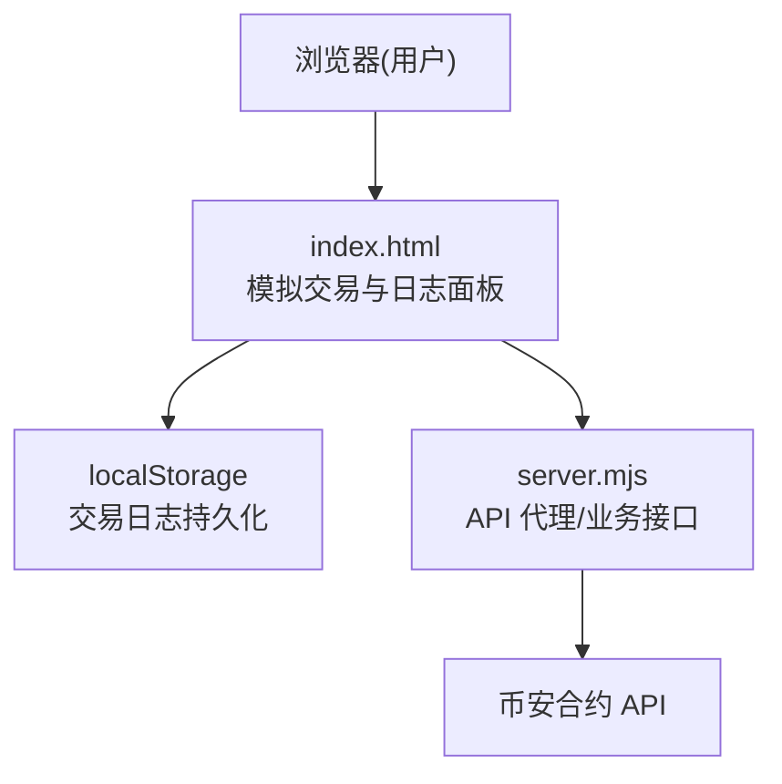
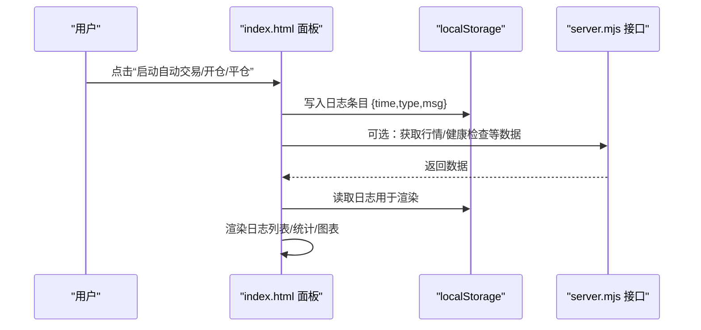
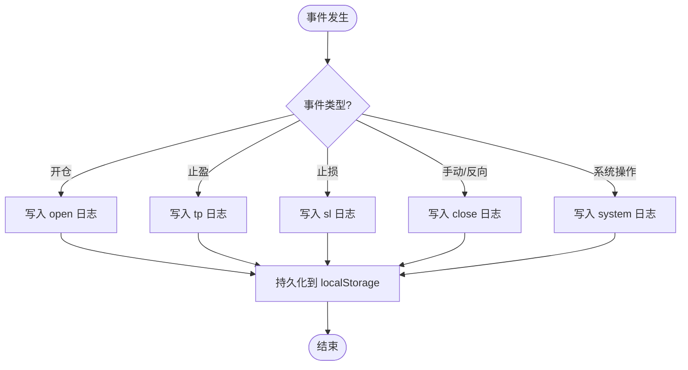
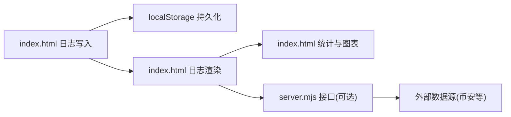

# 交易日志系统

<cite>
**本文引用的文件**   
- [index.html](file://index.html)
- [server.mjs](file://server.mjs)
- [README.md](file://README.md)
</cite>

## 目录
1. [简介](#简介)
2. [项目结构](#项目结构)
3. [核心组件](#核心组件)
4. [架构总览](#架构总览)
5. [详细组件分析](#详细组件分析)
6. [依赖关系分析](#依赖关系分析)
7. [性能考虑](#性能考虑)
8. [故障排查指南](#故障排查指南)
9. [结论](#结论)
10. [附录](#附录)

## 简介
本文件围绕“交易日志系统”的完整生命周期进行系统化说明，覆盖日志生成、格式化、存储与检索；定义交易日志的分类（开仓、平仓、止损、止盈、异常/系统）；给出数据结构设计要点（时间戳、交易对、方向、价格、数量、手续费、盈亏等字段）；提供查询与过滤方案（按时间范围、交易对、盈亏状态等维度）；并给出导出与分析能力（CSV导出、统计报表、可视化图表）。同时结合仓库现有实现，总结当前日志机制的现状与可扩展点。

## 项目结构
本项目为基于 Node.js 的前后端一体化应用：前端页面 index.html 内嵌模拟交易与日志面板；服务端 server.mjs 提供数据代理与部分业务接口；README.md 描述运行方式与配置项。交易日志系统主要位于前端页面中，通过本地存储持久化，并在 UI 中进行展示与统计分析。

图示来源
- [index.html:4793-4856](file://index.html#L4793-L4856)
- [server.mjs:684-719](file://server.mjs#L684-L719)

章节来源
- [README.md:1-210](file://README.md#L1-L210)
- [index.html:4793-4856](file://index.html#L4793-L4856)

## 核心组件
- 日志写入器
  - 负责将结构化日志条目追加到本地数组，并持久化到 localStorage，同时限制最大长度以避免存储溢出。
- 日志渲染器
  - 从本地存储读取日志，按时间倒序渲染，支持按类型着色与分类标签显示。
- 统计与可视化
  - 基于已平仓交易记录计算收益曲线、回撤、胜率、分布等指标，并通过 Canvas 绘制图表。
- 事件触发点
  - 开仓、平仓（含止盈/止损/手动/反向信号）、系统启停等关键事件均会写入对应类型的日志。

章节来源
- [index.html:4837-4856](file://index.html#L4837-L4856)
- [index.html:5587-5605](file://index.html#L5587-L5605)
- [index.html:5607-5731](file://index.html#L5607-L5731)
- [index.html:5231-5290](file://index.html#L5231-L5290)

## 架构总览
交易日志系统在浏览器端完成“生成—格式化—存储—检索—展示—分析”的闭环。关键流程如下：

图示来源
- [index.html:4837-4856](file://index.html#L4837-L4856)
- [index.html:5587-5605](file://index.html#L5587-L5605)
- [server.mjs:684-719](file://server.mjs#L684-L719)

## 详细组件分析

### 日志数据结构设计
- 基础字段
  - time: 毫秒级时间戳（Date.now()），用于排序与筛选
  - type: 日志类型，包括 open（开仓）、tp（止盈）、sl（止损）、close（平仓）、system（系统）、manual（手动）
  - msg: 人类可读的消息文本，包含交易对、方向、价格、数量、保证金、SL/TP、原因、盈亏等关键信息
- 扩展字段建议（面向后续增强）
  - symbol: 交易对（如 BTCUSDT）
  - direction: 方向（long/short）
  - entryPrice/exitPrice: 开仓价/平仓价
  - qty: 数量
  - margin: 保证金
  - fee: 手续费（若未来接入真实交易或计入模拟成本）
  - pnl: 盈亏金额
  - reason: 平仓原因（tp/sl/manual/signal）
  - leverage: 杠杆倍数
  - sl/tp: 止损/止盈价位
- 当前实现要点
  - 日志以对象数组形式保存在 localStorage，键名为固定常量，便于跨会话恢复
  - 写入时仅保留最近若干条，避免超出存储配额

章节来源
- [index.html:4793-4856](file://index.html#L4793-L4856)
- [index.html:5231-5290](file://index.html#L5231-L5290)
- [index.html:5587-5605](file://index.html#L5587-L5605)

### 日志生成与分类
- 开仓日志
  - 触发时机：策略满足阈值后执行开仓
  - 内容要素：方向、交易对、开仓价、数量、保证金、杠杆、止损/止盈位
- 平仓日志
  - 触发时机：止盈、止损、手动平仓、反向信号
  - 内容要素：平仓价、原因、盈亏、余额变化
- 系统日志
  - 触发时机：启动/停止自动交易、重置数据等
- 异常日志
  - 触发时机：网络错误、解析失败、存储异常等（当前以 try/catch 包裹，必要时可显式写入）

图示来源
- [index.html:5231-5290](file://index.html#L5231-L5290)
- [index.html:4837-4856](file://index.html#L4837-L4856)

章节来源
- [index.html:5231-5290](file://index.html#L5231-L5290)
- [index.html:4837-4856](file://index.html#L4837-L4856)

### 日志存储与检索
- 存储
  - 使用 localStorage 保存日志数组，键名固定，写入前裁剪至最近 N 条，防止超限
- 检索
  - 读取后反转顺序以最新在前，供 UI 渲染
- 注意事项
  - 读写均包裹 try/catch，确保在异常情况下不中断主流程
  - 如需更复杂查询，可在内存中构建索引（如按 symbol、type 分桶）

章节来源
- [index.html:4837-4856](file://index.html#L4837-L4856)
- [index.html:5587-5605](file://index.html#L5587-L5605)

### 日志展示与统计
- 日志面板
  - 按类型着色与标签显示，时间格式化为 HH:mm
- 统计面板
  - 已实现收益曲线、最大回撤、各币种统计、平仓原因分布、PnL 分布图
  - 数据来源主要为已平仓交易记录与权益历史

章节来源
- [index.html:5587-5605](file://index.html#L5587-L5605)
- [index.html:5607-5731](file://index.html#L5607-L5731)

### 日志查询与过滤方案
- 按时间范围
  - 在内存中对日志数组按 time 字段进行区间过滤
- 按交易对
  - 从 msg 中解析 symbol，或扩展日志结构新增 symbol 字段以便精确匹配
- 按盈亏状态
  - 针对平仓类日志，依据 reason 与 pnl 字段判断盈利/亏损
- 按类型
  - 直接按 type 字段过滤（open/tp/sl/close/system/manual）

章节来源
- [index.html:5587-5605](file://index.html#L5587-L5605)
- [index.html:5231-5290](file://index.html#L5231-L5290)

### 日志导出与分析功能
- CSV 导出
  - 可将日志数组序列化为 CSV 行，包含 time、type、msg 及扩展字段（symbol、direction、pnl 等）
- 统计报表
  - 汇总各币种交易次数、胜率、总盈亏、平均盈亏、最大盈亏、多空占比等
- 可视化图表
  - 收益曲线、PnL 分布、回撤等已在面板中以 Canvas 呈现

章节来源
- [index.html:5607-5731](file://index.html#L5607-L5731)

### 日志性能优化与大文件处理
- 当前优化
  - 写入前裁剪至最近若干条，降低存储体积与渲染开销
- 进一步优化建议
  - 分页加载：按需加载最近 N 条，滚动加载更多
  - 增量更新：仅追加新条目，避免全量重绘
  - 压缩归档：将历史日志压缩归档，仅保留摘要
  - 异步 I/O：使用 Web Worker 或 requestIdleCallback 执行序列化与写入

章节来源
- [index.html:4837-4856](file://index.html#L4837-L4856)

## 依赖关系分析
- 前端模块
  - index.html 内部函数相互调用，形成“写入—持久化—渲染—统计”的链路
- 后端接口
  - server.mjs 提供数据聚合与外部 API 代理，前端在需要时调用，间接影响日志上下文（如健康检查、行情数据）

图示来源
- [index.html:4837-4856](file://index.html#L4837-L4856)
- [server.mjs:684-719](file://server.mjs#L684-L719)

章节来源
- [index.html:4837-4856](file://index.html#L4837-L4856)
- [server.mjs:684-719](file://server.mjs#L684-L719)

## 性能考虑
- 存储容量控制：限制日志长度，避免超出浏览器配额
- 渲染性能：采用最小化 DOM 更新与按需刷新
- 计算复杂度：统计与图表绘制尽量在数据量可控范围内执行
- 并发与阻塞：避免在主线程进行耗时序列化，必要时引入异步策略

[本节为通用指导，无需代码引用]

## 故障排查指南
- 常见问题
  - 日志未显示：检查 localStorage 是否被清理或存在权限问题
  - 日志缺失：确认写入逻辑是否被触发，以及 try/catch 是否吞掉异常
  - 面板卡顿：日志过长导致渲染缓慢，应启用分页或裁剪策略
- 定位方法
  - 打开控制台查看是否有异常堆栈
  - 在写入与读取处增加临时计数或断点，验证数据流

章节来源
- [index.html:4837-4856](file://index.html#L4837-L4856)
- [index.html:5587-5605](file://index.html#L5587-L5605)

## 结论
当前交易日志系统在前端实现了完整的“生成—格式化—存储—检索—展示—分析”闭环，具备开仓、平仓（含止盈/止损/手动/反向信号）与系统日志分类，并提供基础的统计与可视化能力。为进一步支撑生产环境，建议在数据结构上补充关键字段、完善异常日志、增强查询与导出能力，并引入性能优化策略以应对大文件场景。

[本节为总结性内容，无需代码引用]

## 附录
- 相关 API 与服务管理参考
  - README 提供了服务启动、端口配置、飞书推送与市值过滤等说明，可作为系统运行的背景参考

章节来源
- [README.md:1-210](file://README.md#L1-L210)