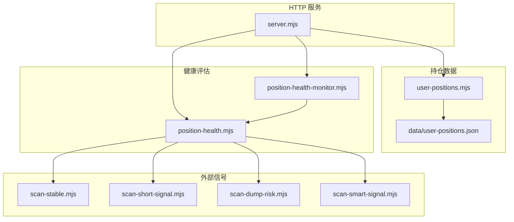
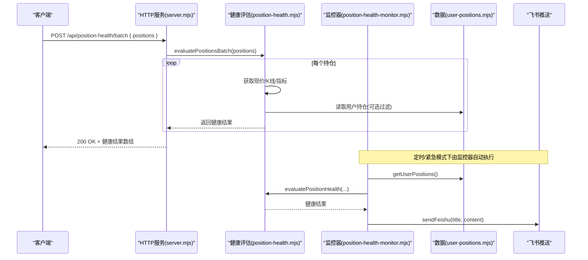
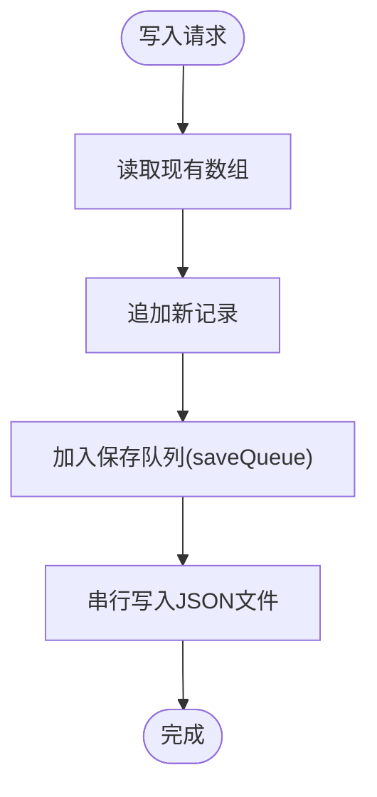
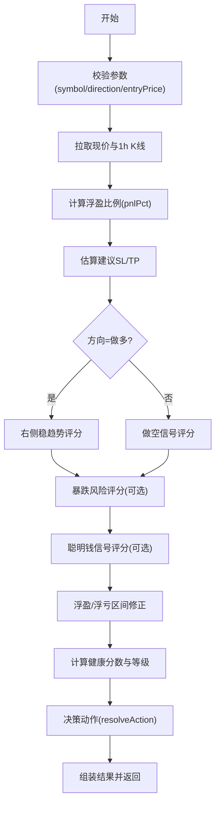
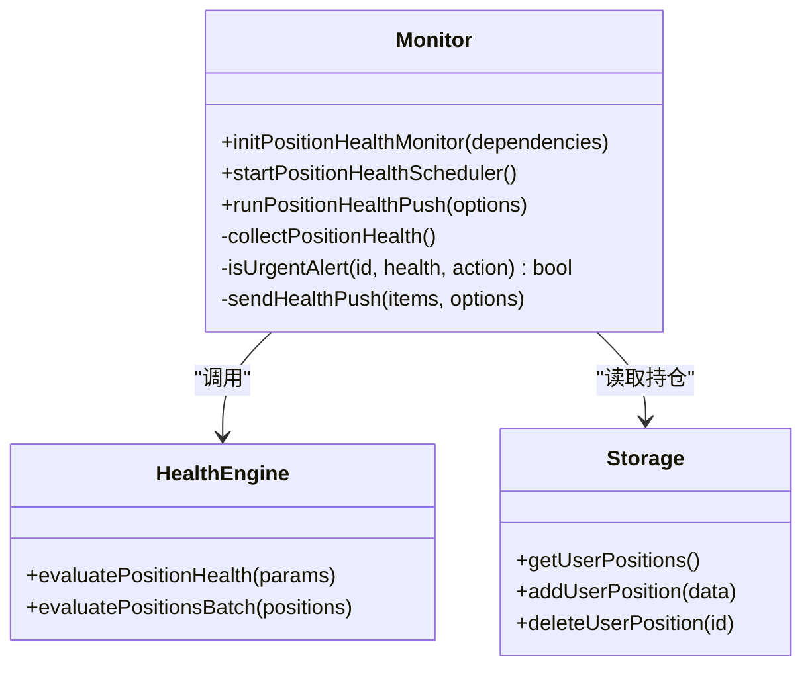
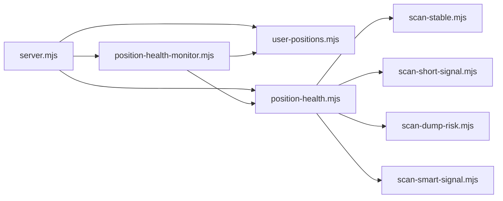

# 持仓管理系统

<cite>
**本文引用的文件**   
- [server.mjs](file://server.mjs)
- [user-positions.mjs](file://user-positions.mjs)
- [position-health.mjs](file://position-health.mjs)
- [position-health-monitor.mjs](file://position-health-monitor.mjs)
- [scan-stable.mjs](file://scan-stable.mjs)
- [scan-short-signal.mjs](file://scan-short-signal.mjs)
- [scan-dump-risk.mjs](file://scan-dump-risk.mjs)
- [scan-smart-signal.mjs](file://scan-smart-signal.mjs)
- [data/user-positions.json](file://data/user-positions.json)
</cite>

## 目录
1. [简介](#简介)
2. [项目结构](#项目结构)
3. [核心组件](#核心组件)
4. [架构总览](#架构总览)
5. [详细组件分析](#详细组件分析)
6. [依赖关系分析](#依赖关系分析)
7. [性能与并发特性](#性能与并发特性)
8. [故障排查指南](#故障排查指南)
9. [结论](#结论)
10. [附录：API 接口文档](#附录api-接口文档)

## 简介
本系统提供一套面向多币种合约的“持仓管理 + 健康度评估 + 定时/紧急推送”能力。其目标包括：
- 持久化存储用户开仓记录，支持增删查；
- 基于实时行情、技术指标与资金面数据计算未实现盈亏与健康评分；
- 对危险/止损等紧急情况做去重与冷却控制，避免频繁打扰；
- 通过 HTTP API 暴露批量健康检查、持仓读写与触发推送等能力；
- 为后续扩展仓位大小、杠杆倍数与保证金监控预留集成点（当前版本未内置）。

## 项目结构
围绕“持仓管理”的核心文件与职责如下：
- server.mjs：HTTP 服务入口，路由到各功能模块，负责调度与飞书推送；
- user-positions.mjs：用户持仓数据的 JSON 持久化与并发写入队列；
- position-health.mjs：单仓健康度评估与批量评估逻辑；
- position-health-monitor.mjs：健康监控器，负责定时扫描、紧急告警与冷却；
- scan-* 系列：外部信号源（右侧稳趋势、做空信号、暴跌风险、聪明钱信号）；
- data/user-positions.json：持久化文件。

图表来源
- [server.mjs:1637-1734](file://server.mjs#L1637-L1734)
- [user-positions.mjs:1-64](file://user-positions.mjs#L1-L64)
- [position-health.mjs:56-195](file://position-health.mjs#L56-L195)
- [position-health-monitor.mjs:1-186](file://position-health-monitor.mjs#L1-L186)
- [scan-stable.mjs:163-193](file://scan-stable.mjs#L163-L193)
- [scan-short-signal.mjs:28-200](file://scan-short-signal.mjs#L28-L200)
- [scan-dump-risk.mjs:21-191](file://scan-dump-risk.mjs#L21-L191)
- [scan-smart-signal.mjs:76-167](file://scan-smart-signal.mjs#L76-L167)

章节来源
- [server.mjs:1637-1734](file://server.mjs#L1637-L1734)
- [user-positions.mjs:1-64](file://user-positions.mjs#L1-L64)
- [position-health.mjs:56-195](file://position-health.mjs#L56-L195)
- [position-health-monitor.mjs:1-186](file://position-health-monitor.mjs#L1-L186)

## 核心组件
- 用户持仓存储层
  - 以 JSON 数组形式持久化在 data/user-positions.json；
  - 提供读、写（追加）、删除接口；
  - 使用 Promise 链式队列串行化写入，避免并发写冲突。
- 健康度评估引擎
  - 输入：symbol、direction、entryPrice、可选 stopLoss/takeProfit；
  - 输出：健康状态（健康/警告/危险）、健康分数、建议动作（持有/收紧止损/止盈/止损）、原因列表、距离止损/止盈百分比等；
  - 综合多源信号：右侧稳趋势、做空信号、暴跌风险、聪明钱信号、价格与K线统计。
- 健康监控器
  - 定时任务：按配置周期执行“计划推送”；
  - 紧急任务：高频扫描，结合“首次进入危险/止损立即推送”和“同仓冷却去重”策略；
  - 将结果通过飞书卡片推送。

章节来源
- [user-positions.mjs:10-28](file://user-positions.mjs#L10-L28)
- [position-health.mjs:56-195](file://position-health.mjs#L56-L195)
- [position-health-monitor.mjs:14-66](file://position-health-monitor.mjs#L14-L66)

## 架构总览
从请求到结果的端到端流程（以批量健康检查为例）：

图表来源
- [server.mjs:1662-1679](file://server.mjs#L1662-L1679)
- [position-health.mjs:197-213](file://position-health.mjs#L197-L213)
- [position-health-monitor.mjs:72-128](file://position-health-monitor.mjs#L72-L128)
- [user-positions.mjs:30-63](file://user-positions.mjs#L30-L63)

## 详细组件分析

### 持仓数据模型与持久化
- 数据结构
  - id：唯一标识；
  - symbol：交易对（如 BTCUSDT），统一大写并校验后缀；
  - direction：long/short；
  - entryPrice：开仓价；
  - stopLoss/takeProfit：可选止损/止盈；
  - note：备注；
  - createdAt：创建时间戳。
- 持久化策略
  - 文件路径：data/user-positions.json；
  - 并发写入：通过 saveQueue 串行化，避免竞态；
  - 容错：读取失败时返回空数组，写入异常被吞掉以避免阻塞。

图表来源
- [user-positions.mjs:23-28](file://user-positions.mjs#L23-L28)
- [user-positions.mjs:34-55](file://user-positions.mjs#L34-L55)
- [data/user-positions.json:1-52](file://data/user-positions.json#L1-L52)

章节来源
- [user-positions.mjs:1-64](file://user-positions.mjs#L1-L64)
- [data/user-positions.json:1-52](file://data/user-positions.json#L1-L52)

### 健康度评估算法
- 输入参数
  - symbol、direction、entryPrice 必填；stopLoss/takeProfit 可选。
- 核心步骤
  - 拉取 24h 行情与 1h K 线，计算现价与浮盈比例；
  - 根据方向与K线高低点估算建议止损/止盈；
  - 组合多源信号打分：
    - 右侧稳趋势（做多场景加分/减分）；
    - 暴跌风险（做空场景扣分或提示）；
    - 聪明钱信号（与持仓方向一致加分，相反扣分）；
    - 浮盈/浮亏区间调整；
  - 判定健康等级：健康/警告/危险；
  - 决策动作：继续持有/收紧止损/考虑止盈/建议止损。
- 输出字段
  - 健康等级与标签、健康分数、是否有效信号、原因列表、建议动作及标签、止损/止盈、距止损/止盈百分比、检查时间戳等。

图表来源
- [position-health.mjs:56-195](file://position-health.mjs#L56-L195)
- [scan-stable.mjs:163-193](file://scan-stable.mjs#L163-L193)
- [scan-short-signal.mjs:28-200](file://scan-short-signal.mjs#L28-L200)
- [scan-dump-risk.mjs:21-191](file://scan-dump-risk.mjs#L21-L191)
- [scan-smart-signal.mjs:76-167](file://scan-smart-signal.mjs#L76-L167)

章节来源
- [position-health.mjs:56-195](file://position-health.mjs#L56-L195)

### 健康监控器与推送机制
- 初始化依赖
  - enabled/feishuEnabled：开关；
  - pushHours：计划推送间隔；
  - urgentCheckMin/urgentCooldownMin：紧急扫描频率与冷却时长；
  - watchSymbols：仅监控指定交易对；
  - getNextPushTime/sendFeishu：调度与推送回调。
- 运行模式
  - scheduled：按计划整点执行；
  - urgent：高频执行，但具备“首次进入危险/止损即推”和“恶化+冷却期后重复推”的去重策略。
- 推送内容
  - 标题包含监控标的集合；
  - 正文包含每条持仓的现价、盈亏、健康等级与建议动作，以及若干关键原因摘要。

图表来源
- [position-health-monitor.mjs:10-186](file://position-health-monitor.mjs#L10-L186)
- [position-health.mjs:56-213](file://position-health.mjs#L56-L213)
- [user-positions.mjs:30-63](file://user-positions.mjs#L30-L63)

章节来源
- [position-health-monitor.mjs:1-186](file://position-health-monitor.mjs#L1-L186)

### 盈亏计算与风控要点
- 未实现盈亏
  - 做多：(现价 - 开仓价)/开仓价 × 100%；
  - 做空：(开仓价 - 现价)/开仓价 × 100%；
  - 注意：当前实现未引入仓位大小、杠杆倍数与手续费，因此结果为“裸价格涨跌幅”。
- 已实现盈亏
  - 当前代码未实现平仓记录与已实现盈亏汇总；如需扩展，可在 user-positions.mjs 中新增“平仓流水表”，并在健康引擎中累计历史已实现盈亏。
- 保证金监控
  - 当前未实现保证金/维持保证金/强平价的计算；可结合交易所接口与杠杆设置扩展。

章节来源
- [position-health.mjs:70-79](file://position-health.mjs#L70-L79)

### 多币种并发与限流
- 健康评估批量处理
  - 服务端提供 /api/position-health/batch 批量接口；
  - 内部对每个持仓顺序评估，错误隔离（单个失败不影响其他）。
- 外部信号并发
  - 各 scan-* 模块内部使用 pmap 控制并发度；
  - Smart Signal 接口具备熔断与节流保护。
- 写入并发
  - 通过 saveQueue 串行化写入，避免 JSON 文件损坏。

章节来源
- [position-health.mjs:197-213](file://position-health.mjs#L197-L213)
- [scan-stable.mjs:195-200](file://scan-stable.mjs#L195-L200)
- [scan-smart-signal.mjs:57-74](file://scan-smart-signal.mjs#L57-L74)
- [user-positions.mjs:23-28](file://user-positions.mjs#L23-L28)

## 依赖关系分析
- 模块耦合
  - server.mjs 作为编排者，聚合 user-positions、position-health、position-health-monitor 与各信号模块；
  - position-health-monitor 依赖 storage 与 health engine；
  - health engine 依赖多个 scan-* 模块。
- 外部依赖
  - 币安合约接口（fapi.binance.com）；
  - 飞书 Webhook（推送）；
  - 可选代理（Smart Signal 访问）。

图表来源
- [server.mjs:1637-1734](file://server.mjs#L1637-L1734)
- [position-health-monitor.mjs:1-186](file://position-health-monitor.mjs#L1-L186)
- [position-health.mjs:56-195](file://position-health.mjs#L56-L195)

章节来源
- [server.mjs:1637-1734](file://server.mjs#L1637-L1734)

## 性能与并发特性
- 网络请求
  - 批量健康检查会并行拉取行情与K线，减少整体延迟；
  - Smart Signal 接口有熔断与最小间隔限制，避免触发限流。
- 本地缓存
  - Smart Signal 结果带 TTL 缓存；
  - 全量 ticker/24hr 短TTL缓存与并发去重（服务内复用）。
- 磁盘IO
  - 写入采用队列串行化，降低锁竞争与文件损坏风险。

[本节为通用指导，不直接分析具体文件]

## 故障排查指南
- 常见错误
  - symbol 非 USDT 合约或 entryPrice 无效：健康评估会抛出参数错误；
  - 币安 API 不可用：健康检查可能返回 warning 并附带 error 字段；
  - 飞书推送失败：需检查 FEISHU_WEBHOOK 配置与频控。
- 定位方法
  - 查看 /api/position-health/batch 返回中的 error 字段；
  - 观察控制台日志中“健康检查失败/推送失败”的警告信息；
  - 确认 .env 中代理与 Webhook 配置。

章节来源
- [position-health.mjs:66-68](file://position-health.mjs#L66-L68)
- [position-health.mjs:202-212](file://position-health.mjs#L202-L212)
- [position-health-monitor.mjs:149-153](file://position-health-monitor.mjs#L149-L153)

## 结论
本系统在“持仓记录 + 健康评估 + 推送告警”方面提供了完整闭环，适合用于手动/半自动交易的日常风控与提醒。若需进一步自动化交易，可在现有基础上扩展：
- 仓位大小控制与杠杆倍数管理；
- 保证金与强平价监控；
- 平仓流水与已实现盈亏统计；
- 更细粒度的风控规则与回测验证。

[本节为总结性内容，不直接分析具体文件]

## 附录：API 接口文档

### 基础信息
- 协议：HTTP/HTTPS
- 字符集：UTF-8
- 跨域：响应头允许 *

### 接口清单

- GET /api/position-health
  - 描述：单仓健康度评估
  - 查询参数
    - symbol：交易对，如 BTCUSDT
    - direction：long 或 short，默认 long
    - entry：开仓价，数值
    - stopLoss：可选，止损价
    - takeProfit：可选，止盈价
  - 成功响应：健康评估对象
  - 失败响应：{ error: string }

- POST /api/position-health/batch
  - 描述：批量健康度评估
  - 请求体
    - positions：数组，元素包含 symbol、direction、entryPrice、stopLoss、takeProfit
  - 成功响应：健康评估对象数组
  - 失败响应：{ error: string }

- GET /api/user-positions
  - 描述：获取所有用户持仓
  - 成功响应：持仓数组

- POST /api/user-positions
  - 描述：新增一条持仓记录
  - 请求体
    - symbol：如 LABUSDT
    - direction：long 或 short
    - entryPrice：数值
    - stopLoss：可选
    - takeProfit：可选
    - note：字符串
  - 成功响应：新增的持仓对象

- DELETE /api/user-positions?id={id}
  - 描述：删除指定持仓
  - 成功响应：{ ok: true }

- POST /api/trigger-position-health-push
  - 描述：立即触发一次健康推送（需配置飞书 Webhook）
  - 成功响应：{ ok: true, message: string }

- OPTIONS 预检
  - 上述接口均支持 CORS 预检，返回 204。

章节来源
- [server.mjs:1637-1734](file://server.mjs#L1637-L1734)
- [server.mjs:1918-1935](file://server.mjs#L1918-L1935)

### 使用示例（概念性说明）
- 新增持仓
  - 向 POST /api/user-positions 提交 { symbol:"LABUSDT", direction:"short", entryPrice:9.5 }；
  - 成功后获得包含 id、createdAt 的记录。
- 批量健康检查
  - 向 POST /api/position-health/batch 提交 { positions:[...] }；
  - 返回每项的健康等级、建议动作与原因摘要。
- 触发推送
  - 向 POST /api/trigger-position-health-push 发起请求；
  - 系统将立即执行一次健康扫描并通过飞书推送。

[本节为使用示例说明，不直接分析具体文件]