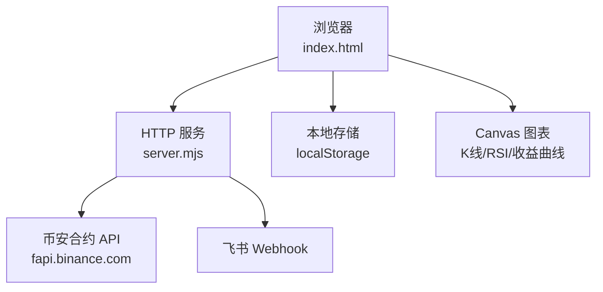
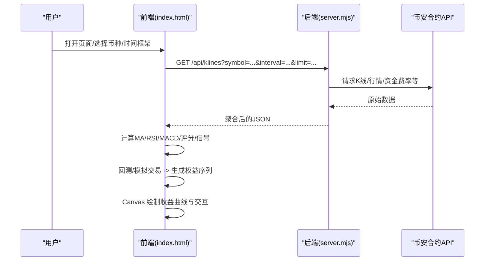
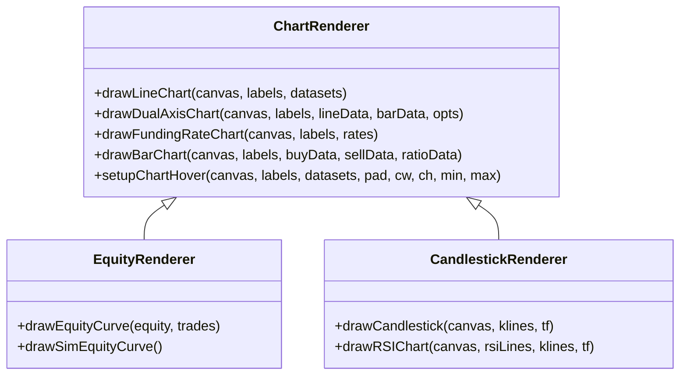
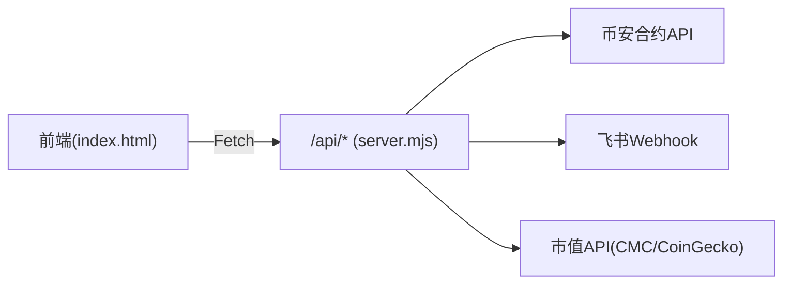

# 收益曲线分析

<cite>
**本文引用的文件**   
- [index.html](file://index.html)
- [server.mjs](file://server.mjs)
- [scan-stable.mjs](file://scan-stable.mjs)
- [README.md](file://README.md)
- [package.json](file://package.json)
</cite>

## 目录
1. [简介](#简介)
2. [项目结构](#项目结构)
3. [核心组件](#核心组件)
4. [架构总览](#架构总览)
5. [详细组件分析](#详细组件分析)
6. [依赖关系分析](#依赖关系分析)
7. [性能考量](#性能考量)
8. [故障排查指南](#故障排查指南)
9. [结论](#结论)
10. [附录](#附录)

## 简介
本文件面向“收益曲线分析系统”，聚焦以下目标：
- 收益指标计算逻辑：累计收益率、日收益率、最大回撤
- 统计分析指标：夏普比率、索提诺比率、胜率、盈亏比、平均持仓时间等
- 可视化渲染技术：Canvas 绘图实现、交互功能与响应式适配
- 对比分析能力：策略间对比、基准对比、回测结果对比
- 数据缓存与实时更新机制
- 分析报告自动生成与导出
- API 接口与前端组件使用指南

说明：本项目为币安合约聪明钱监控面板，包含 K 线/RSI 图表、信号摘要、模拟交易与回测等功能。收益曲线相关的前端实现集中在 index.html；服务端提供代理与推送能力；扫描模块中包含回撤等指标的计算。

## 项目结构
- 前端页面与服务入口
  - index.html：主界面，包含 K 线、RSI、各类折线/柱状图、回测与模拟交易面板、收益曲线绘制与交互
  - server.mjs：Node.js HTTP 服务，代理币安合约 API、推送稳趋势/报警、市值过滤等
- 扫描与策略
  - scan-stable.mjs：右侧稳趋势扫描（含回撤等）
- 文档与配置
  - README.md：使用说明、API 列表、端口与环境变量
  - package.json：脚本与运行环境要求

图示来源
- [index.html:1089-1191](file://index.html#L1089-L1191)
- [server.mjs:58-76](file://server.mjs#L58-L76)

章节来源
- [README.md:190-199](file://README.md#L190-L199)
- [package.json:1-22](file://package.json#L1-L22)

## 核心组件
- 收益曲线与统计（回测）
  - 回测引擎：基于自适应评分与市场状态检测生成交易信号，记录开平仓与 PnL
  - 收益曲线：按 K 线周期累积 PnL 构建权益序列并绘制
  - 统计指标：胜率、总收益、最大回撤、盈亏比等
- 模拟交易收益曲线
  - 实时权益历史、已实现盈亏、最大回撤、方向性统计、平仓原因分布、PnL 分布
- 通用 Canvas 图表库
  - drawLineChart/drawDualAxisChart/drawFundingRateChart/drawBarChart/drawCandlestick/drawRSIChart
  - 统一悬浮提示、网格、双轴、颜色编码与响应式缩放
- 服务端
  - 代理币安合约 REST API，聚合多源数据返回给前端
  - 定时扫描与推送（稳趋势、智能趋势、抛压风险等）
  - 市值过滤与 TradFi 排除

章节来源
- [index.html:4331-4433](file://index.html#L4331-L4433)
- [index.html:4435-4500](file://index.html#L4435-L4500)
- [index.html:5607-5800](file://index.html#L5607-L5800)
- [index.html:1089-1191](file://index.html#L1089-L1191)
- [server.mjs:508-538](file://server.mjs#L508-L538)

## 架构总览
收益曲线分析在前后端协同下完成：
- 前端负责：拉取 K 线、计算指标、执行回测/模拟交易、绘制收益曲线与交互
- 后端负责：代理外部交易所 API、聚合数据、定时任务与消息推送

图示来源
- [index.html:4331-4433](file://index.html#L4331-L4433)
- [server.mjs:508-538](file://server.mjs#L508-L538)

## 详细组件分析

### 收益指标计算逻辑
- 累计收益率
  - 回测路径：以每根 K 线为步长，遍历交易事件，维护累计 PnL 序列作为权益曲线
  - 模拟路径：维护 equityHistory，逐条更新账户权益
- 日收益率
  - 可通过权益序列按日聚合计算（例如将同一天内的收益求和或几何连乘），当前未内置默认视图，可在现有 drawEquityCurve 基础上扩展
- 最大回撤
  - 回测路径：从交易维度计算累计 PnL 的最小值作为最大回撤的近似
  - 模拟路径：根据 equityHistory 的最大值与最小值计算区间最大回撤
- 其他常用指标（可扩展）
  - 夏普比率、索提诺比率：需要无风险利率与收益波动率，可基于权益序列或日收益率序列计算
  - 胜率：盈利交易数/总交易数
  - 盈亏比：平均盈利/平均亏损
  - 平均持仓时间：平仓时间戳与开仓时间戳差值的均值

章节来源
- [index.html:4372-4381](file://index.html#L4372-L4381)
- [index.html:4368-4371](file://index.html#L4368-L4371)
- [index.html:5617-5620](file://index.html#L5617-L5620)

### 统计分析指标
- 已实现指标（回测）
  - 交易次数、胜率、总收益、最大回撤、盈亏比
- 已实现指标（模拟）
  - 已实现盈亏、最大回撤、做多/做空收益与胜率、各币种统计、平仓原因分布、PnL 分布
- 可扩展指标
  - 年化收益、夏普比率、索提诺比率、Calmar 比率、平均持仓时间、滑点/手续费敏感性分析

章节来源
- [index.html:4407-4418](file://index.html#L4407-L4418)
- [index.html:5673-5700](file://index.html#L5673-L5700)

### 可视化渲染技术（Canvas）
- 通用折线图
  - 自动范围缩放、网格、参考线（如 1.0）、图例、悬浮提示
- 双轴图
  - 主轴线 + 次轴线（价格）+ 底部变化率柱状图
- 资金费率图
  - 正负柱状 + 累计费率折线
- 买卖量柱状图
  - 买入/卖出柱 + 买卖比折线 + 1.0 基线
- K 线与 RSI
  - 蜡烛图 + MA/EMA + RSI(6,12,24)
- 收益曲线
  - 回测收益曲线：零线、渐变填充、最终颜色随净值正负切换
  - 模拟收益曲线：初始资金线、终点标记、面积填充

图示来源
- [index.html:1089-1191](file://index.html#L1089-L1191)
- [index.html:1193-1324](file://index.html#L1193-L1324)
- [index.html:1326-1416](file://index.html#L1326-L1416)
- [index.html:1418-1513](file://index.html#L1418-L1513)
- [index.html:1559-1599](file://index.html#L1559-L1599)
- [index.html:4435-4500](file://index.html#L4435-L4500)
- [index.html:5733-5800](file://index.html#L5733-L5800)

章节来源
- [index.html:1089-1191](file://index.html#L1089-L1191)
- [index.html:1193-1324](file://index.html#L1193-L1324)
- [index.html:1326-1416](file://index.html#L1326-L1416)
- [index.html:1418-1513](file://index.html#L1418-L1513)
- [index.html:1559-1599](file://index.html#L1559-L1599)
- [index.html:4435-4500](file://index.html#L4435-L4500)
- [index.html:5733-5800](file://index.html#L5733-L5800)

### 交互功能与响应式设计
- 悬浮提示：统一的 setupChartHover 实现跨图表 tooltip
- 十字光标与 OHLC 信息：K 线区域 hover 显示时间、价格、振幅、涨跌幅
- 响应式布局：CSS 媒体查询适配移动端，canvas 尺寸按容器宽度动态计算，支持 DPR 高倍屏
- 图表范围选择：顶部“数据范围”按钮控制不同窗口长度

章节来源
- [index.html:1170-1191](file://index.html#L1170-L1191)
- [index.html:98-121](file://index.html#L98-L121)
- [index.html:232-236](file://index.html#L232-L236)
- [index.html:246-253](file://index.html#L246-L253)

### 收益对比分析
- 策略间对比
  - 通过“策略管理/回测”面板切换参数或规则，多次运行后对比收益曲线与统计
- 基准对比
  - 可将基准（如指数或标的）的权益序列叠加到同一 canvas 中绘制（需扩展 drawEquityCurve 支持多数据集）
- 回测结果对比
  - 在同一页面展示多组回测结果卡片，横向比较胜率、盈亏比、最大回撤等

章节来源
- [index.html:4331-4433](file://index.html#L4331-L4433)
- [index.html:4407-4418](file://index.html#L4407-L4418)

### 数据缓存与实时更新
- 服务端缓存
  - ticker/24hr 短 TTL 缓存与并发去重，避免重复请求
  - 市值缓存 Map 与 TTL
- 前端缓存
  - localStorage 持久化：自选币种、筛选设置、报警规则、图表范围偏好
- 实时更新
  - 定时器轮询刷新数据，倒计时显示，错误重试与网络就绪等待

章节来源
- [server.mjs:84-105](file://server.mjs#L84-L105)
- [server.mjs:49-49](file://server.mjs#L49-L49)
- [index.html:683-691](file://index.html#L683-L691)
- [index.html:697-706](file://index.html#L697-L706)
- [index.html:774-780](file://index.html#L774-L780)
- [index.html:763-763](file://index.html#L763-L763)

### 分析报告自动生成与导出
- 报告内容建议
  - 回测/模拟关键指标、收益曲线截图、交易明细表、市场状态分布
- 导出方式
  - 前端生成 HTML 片段或 JSON 快照，调用后端保存或下载
  - 利用现有 savePredictionSnapshot 能力保存预测快照，便于后续回溯

章节来源
- [server.mjs:775-775](file://server.mjs#L775-L775)

### API 接口与前端组件使用指南
- 主要 API
  - GET /api/data?symbol=SLXUSDT — 聪明钱全量数据
  - GET /api/klines?symbol=SLXUSDT&interval=1h&limit=100 — K 线数据
  - GET /api/marketcap?symbol=BTCUSDT — 单币种市值
  - POST /api/feishu-alert — 发送飞书报警
  - POST /api/trigger-stable-push — 手动触发稳趋势推送
- 前端组件
  - 概览卡片：价格、市值、24h 成交额、大户多空比、资金费率、持仓量
  - 信号摘要：大户/全网多空比、主动买卖比、资金费率信号
  - 图表区：K 线/RSI、OI/资金费率/买卖量等
  - 策略与回测：参数编辑、自适应评分、回测结果与收益曲线
  - 模拟交易：启动/停止、日志、收益曲线与统计

章节来源
- [README.md:190-199](file://README.md#L190-L199)
- [index.html:965-1018](file://index.html#L965-L1018)
- [index.html:1020-1048](file://index.html#L1020-L1048)
- [index.html:4331-4433](file://index.html#L4331-L4433)
- [index.html:5607-5800](file://index.html#L5607-L5800)

## 依赖关系分析
- 前端依赖
  - 浏览器原生 Canvas API、LocalStorage、Fetch
- 后端依赖
  - Node.js http/fs/promises/url/path
  - 币安合约 REST API
  - 飞书 Webhook
  - 可选：CoinMarketCap Pro API（市值）

图示来源
- [server.mjs:58-76](file://server.mjs#L58-L76)
- [server.mjs:49-49](file://server.mjs#L49-L49)

章节来源
- [package.json:1-22](file://package.json#L1-L22)
- [README.md:200-206](file://README.md#L200-L206)

## 性能考量
- 减少重复请求
  - ticker/24hr 短 TTL 缓存与并发去重
  - 市值缓存 Map 与 TTL
- 前端渲染优化
  - 仅对可见区域绘制，合理采样标签数量
  - 使用 requestAnimationFrame 批量绘制
- 回测与模拟
  - 自适应评分缓存市场状态，降低频繁计算
  - 限制回测 bars 数量，按需分页加载

章节来源
- [server.mjs:84-105](file://server.mjs#L84-L105)
- [server.mjs:49-49](file://server.mjs#L49-L49)
- [index.html:4304-4315](file://index.html#L4304-L4315)
- [index.html:5727-5730](file://index.html#L5727-L5730)

## 故障排查指南
- 端口占用
  - 使用 dev:restart 自动清理旧进程，或手动结束占用端口进程
- 网络不可用
  - 服务启动时等待币安 API 就绪，失败会重试并给出提示
- 飞书推送失败
  - 检查 FEISHU_WEBHOOK 配置，频控时会有重试与错误提示
- 数据异常
  - 校验 ticker/24hr 是否为数组，非数组则抛出友好错误信息

章节来源
- [README.md:40-53](file://README.md#L40-L53)
- [server.mjs:107-125](file://server.mjs#L107-L125)
- [server.mjs:618-644](file://server.mjs#L618-L644)
- [server.mjs:78-82](file://server.mjs#L78-L82)

## 结论
本系统在现有 K 线/RSI 与信号体系之上，提供了完整的回测与模拟交易收益曲线能力。前端通过自研 Canvas 图表库实现了丰富的可视化与交互体验，后端通过缓存与并发优化保障了数据获取效率。建议在后续版本中补充：
- 标准化收益统计（夏普、索提诺、年化等）
- 基准与多策略对比视图
- 报告导出与分享能力
- 更细粒度的日收益率与滚动回撤视图

## 附录

### 回撤计算参考（扫描模块）
- 扫描模块中对回撤进行汇总，用于稳趋势筛选

章节来源
- [scan-stable.mjs:181-188](file://scan-stable.mjs#L181-L188)
- [scan-stable.mjs:277-277](file://scan-stable.mjs#L277-L277)