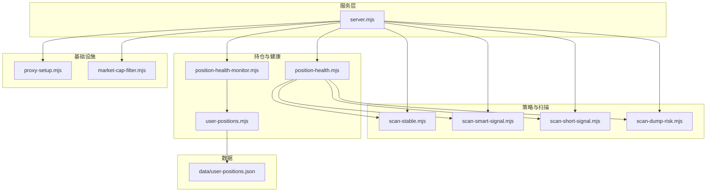
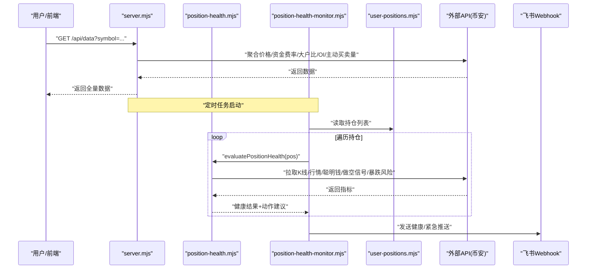
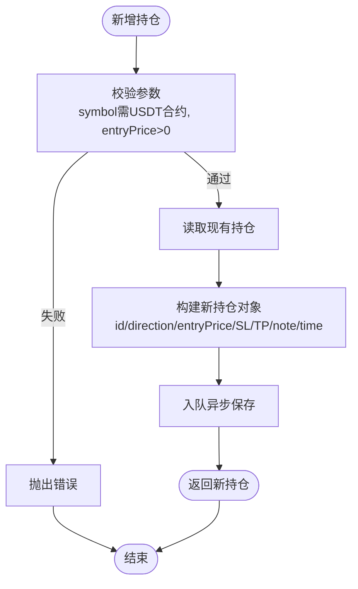
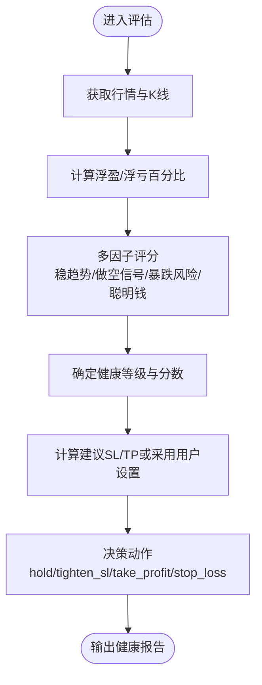
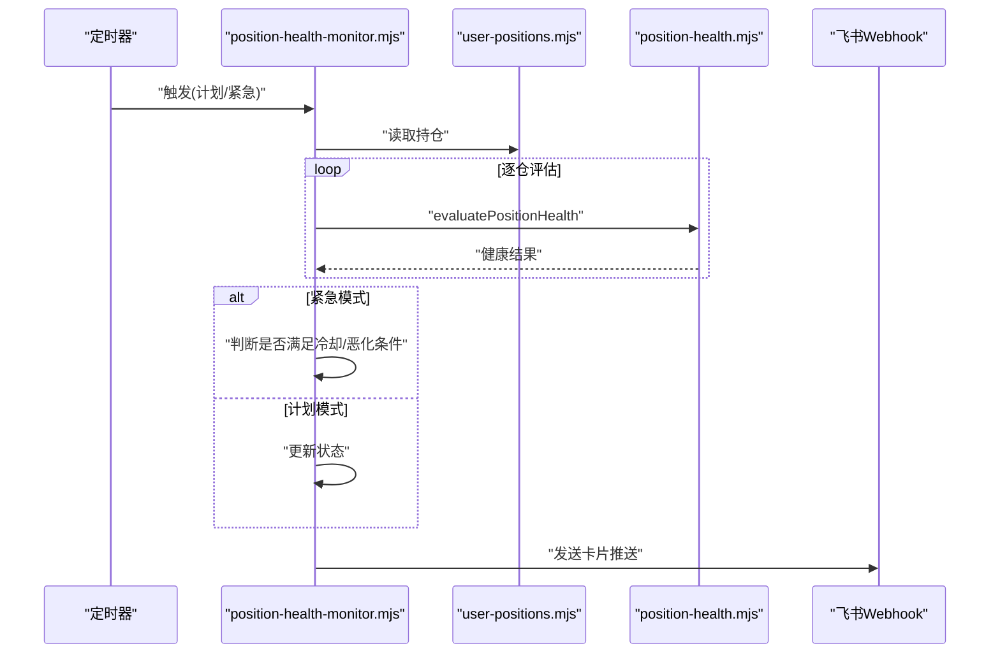
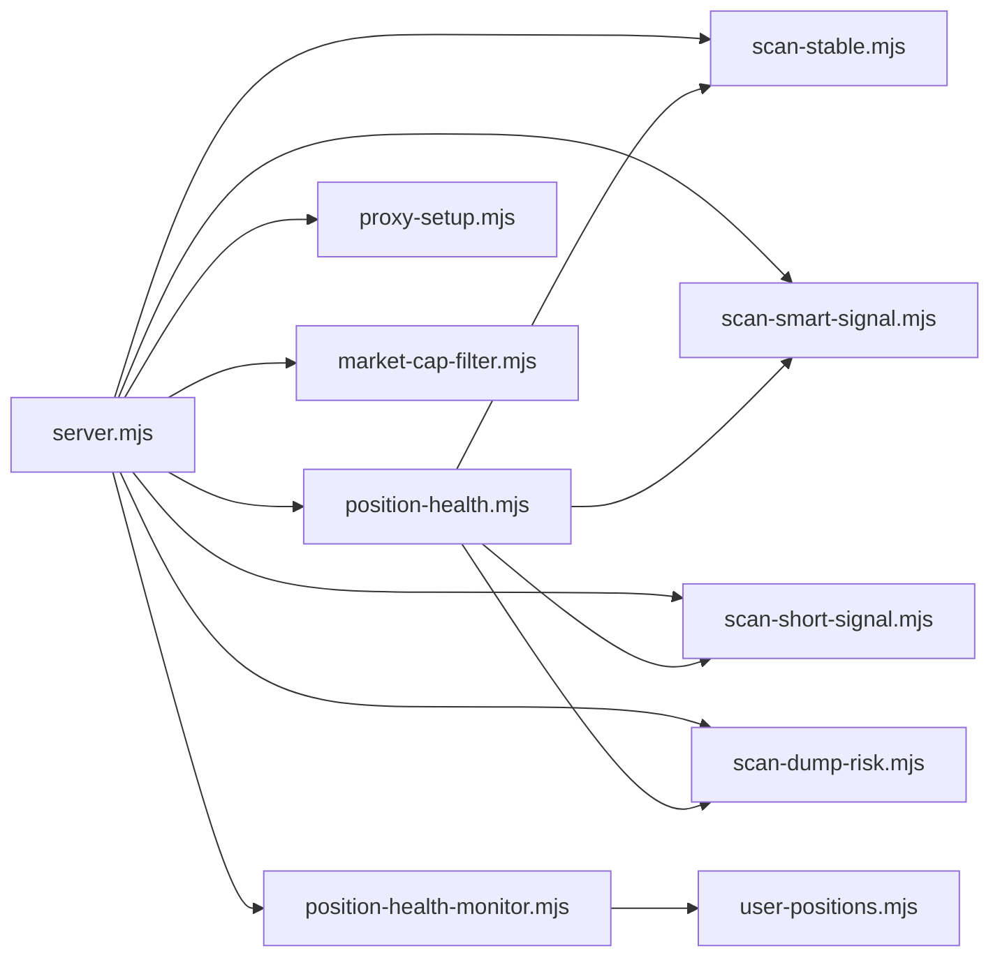

# 模拟交易核心引擎

<cite>
**本文引用的文件**   
- [server.mjs](file://server.mjs)
- [user-positions.mjs](file://user-positions.mjs)
- [position-health.mjs](file://position-health.mjs)
- [position-health-monitor.mjs](file://position-health-monitor.mjs)
- [scan-stable.mjs](file://scan-stable.mjs)
- [scan-smart-signal.mjs](file://scan-smart-signal.mjs)
- [scan-short-signal.mjs](file://scan-short-signal.mjs)
- [scan-dump-risk.mjs](file://scan-dump-risk.mjs)
- [proxy-setup.mjs](file://proxy-setup.mjs)
- [market-cap-filter.mjs](file://market-cap-filter.mjs)
- [smart-money.mjs](file://smart-money.mjs)
- [package.json](file://package.json)
- [data/user-positions.json](file://data/user-positions.json)
</cite>

## 目录
1. [引言](#引言)
2. [项目结构](#项目结构)
3. [核心组件](#核心组件)
4. [架构总览](#架构总览)
5. [详细组件分析](#详细组件分析)
6. [依赖关系分析](#依赖关系分析)
7. [性能与并发特性](#性能与并发特性)
8. [故障排查指南](#故障排查指南)
9. [结论](#结论)
10. [附录：API 参考与集成示例](#附录api-参考与集成示例)

## 引言
本仓库实现了一个以币安合约数据为核心的“聪明钱监控 + 持仓健康评估 + 定时推送”的模拟交易系统。系统通过代理访问币安合约 REST API，聚合价格、资金费率、大户多空比、主动买卖量等指标，提供 Web 面板与终端两种使用方式，并支持飞书卡片推送。

在“模拟交易”层面，系统提供了：
- 模拟账户管理（本地 JSON 持久化）
- 仓位健康评估与动作建议（止损/止盈/收紧止损/持有）
- 基于多因子评分的趋势与风险模型（右侧稳趋势、做空信号、暴跌风险、聪明钱信号）
- 定时任务与紧急告警机制（按小时整点推送 + 危险/止损即时推送）

注意：当前代码未包含真实下单执行、滑点处理与成交确认逻辑；所有交易行为均为“模拟”，仅输出建议与推送。

## 项目结构
- 服务入口与路由：server.mjs
- 策略与扫描模块：scan-stable.mjs、scan-smart-signal.mjs、scan-short-signal.mjs、scan-dump-risk.mjs
- 持仓与健康：user-positions.mjs、position-health.mjs、position-health-monitor.mjs
- 网络与代理：proxy-setup.mjs
- 市值过滤：market-cap-filter.mjs
- 终端监控脚本：smart-money.mjs
- 配置与元信息：package.json、README.md
- 数据文件：data/user-positions.json

图表来源
- [server.mjs:1-120](file://server.mjs#L1-L120)
- [position-health.mjs:1-60](file://position-health.mjs#L1-L60)
- [position-health-monitor.mjs:1-40](file://position-health-monitor.mjs#L1-L40)
- [user-positions.mjs:1-30](file://user-positions.mjs#L1-L30)
- [proxy-setup.mjs:1-40](file://proxy-setup.mjs#L1-L40)
- [market-cap-filter.mjs:1-15](file://market-cap-filter.mjs#L1-L15)

章节来源
- [server.mjs:1-120](file://server.mjs#L1-L120)
- [package.json:1-22](file://package.json#L1-L22)

## 核心组件
- 模拟账户管理
  - 职责：读写用户手动记录的持仓（方向、入场价、止损、止盈、备注），落盘到 data/user-positions.json
  - 关键能力：新增/删除持仓、队列式异步保存、基础校验（USDT 合约、入场价有效）
- 仓位健康评估
  - 职责：结合多源指标对单仓进行健康打分与建议动作（继续持有/收紧止损/考虑止盈/建议止损）
  - 输入：symbol、direction、entryPrice、stopLoss、takeProfit
  - 输出：健康等级、分数、原因、建议动作、距离止损/止盈百分比、建议止损/止盈位
- 健康监控调度器
  - 职责：定时扫描持仓健康状态，区分“计划内报告”和“紧急预警”，控制冷却期避免重复推送
  - 输出：飞书卡片推送（含健康等级、动作、原因摘要）
- 策略与扫描
  - 右侧稳趋势：多周期回撤与均线/RSI/MACD 评分，筛选稳健做多标的
  - 做空信号：综合暴涨回落、成交量、RSI、偏离均线、连续阴线、高位盘整、持续阴跌、8am 基准跌幅等因子
  - 暴跌风险：多维度风险评分（跌幅、OI、卖压、大户/散户多空对比、资金费率、缩量下跌等）
  - 聪明钱信号：调用币安 Smart Money API，计算净多头/空头强度与鲸鱼参与度
- 网络与代理
  - 职责：统一 fetch/curl 请求封装，Windows 下优先 curl，自动读取 HTTPS_PROXY/HTTP_PROXY，设置超时与错误提示
- 市值过滤
  - 职责：根据 MAX_MARKET_CAP_USD 过滤大市值币种，避免非目标市场噪音

章节来源
- [user-positions.mjs:1-64](file://user-positions.mjs#L1-L64)
- [position-health.mjs:1-213](file://position-health.mjs#L1-L213)
- [position-health-monitor.mjs:1-186](file://position-health-monitor.mjs#L1-L186)
- [scan-stable.mjs:1-290](file://scan-stable.mjs#L1-L290)
- [scan-short-signal.mjs:1-276](file://scan-short-signal.mjs#L1-L276)
- [scan-dump-risk.mjs:1-286](file://scan-dump-risk.mjs#L1-L286)
- [scan-smart-signal.mjs:1-238](file://scan-smart-signal.mjs#L1-L238)
- [proxy-setup.mjs:1-71](file://proxy-setup.mjs#L1-L71)
- [market-cap-filter.mjs:1-15](file://market-cap-filter.mjs#L1-L15)

## 架构总览
系统采用“服务层 + 策略模块 + 数据持久化 + 外部 API 代理”的分层架构。服务层负责 HTTP 路由、定时任务编排与飞书推送；策略模块独立可复用；健康监控作为后台任务周期性运行。

图表来源
- [server.mjs:508-538](file://server.mjs#L508-L538)
- [position-health-monitor.mjs:72-154](file://position-health-monitor.mjs#L72-L154)
- [position-health.mjs:56-195](file://position-health.mjs#L56-L195)
- [user-positions.mjs:30-64](file://user-positions.mjs#L30-L64)

## 详细组件分析

### 模拟账户管理系统
- 数据结构
  - id：UUID
  - symbol：USDT 合约符号（大写）
  - direction：long/short
  - entryPrice：入场价（数值）
  - stopLoss/takeProfit：可选数值
  - note：备注
  - createdAt：创建时间戳
- 操作
  - 新增：校验 symbol 后缀为 USDT、entryPrice 为正数；生成 UUID 与时间戳；写入 data/user-positions.json（队列式异步保存）
  - 删除：按 id 过滤，若不存在抛错
- 存储
  - 文件路径：data/user-positions.json
  - 写入策略：串行队列，避免并发写冲突

图表来源
- [user-positions.mjs:34-55](file://user-positions.mjs#L34-L55)
- [user-positions.mjs:23-28](file://user-positions.mjs#L23-L28)

章节来源
- [user-positions.mjs:1-64](file://user-positions.mjs#L1-L64)
- [data/user-positions.json:1-52](file://data/user-positions.json#L1-L52)

### 仓位健康评估与资金管理策略
- 输入
  - symbol、direction、entryPrice、stopLoss、takeProfit
- 指标采集
  - 当前价格与 K 线（1h/1d/4h）
  - 右侧稳趋势（checkCoinRightStable）
  - 做空信号（checkShortSignal）
  - 暴跌风险（checkDumpRisk）
  - 聪明钱信号（fetchSmartSignal + analyzeSmartSignal）
- 健康评分与等级
  - 初始分 70，依据做多/做空逻辑有效性、风险因素、盈亏比例加减分
  - 等级：healthy/warning/critical
- 动作建议
  - hold：继续持有
  - tighten_sl：收紧止损
  - take_profit：考虑止盈
  - stop_loss：建议止损
- 建议止损/止盈
  - 基于近期高低点与支撑阻力估算（calcSuggestedLevels）
  - 若用户已设置 SL/TP，则优先使用用户值

图表来源
- [position-health.mjs:56-195](file://position-health.mjs#L56-L195)
- [position-health.mjs:11-29](file://position-health.mjs#L11-L29)
- [position-health.mjs:31-41](file://position-health.mjs#L31-L41)

章节来源
- [position-health.mjs:1-213](file://position-health.mjs#L1-L213)

### 健康监控调度器与推送
- 调度模式
  - 计划内：每 N 小时整点触发一次（如 2h/4h）
  - 紧急：每 M 分钟检查一次，仅在首次进入危险/止损或明显恶化且超过冷却期时推送
- 去重与冷却
  - 维护 lastState Map，记录每个持仓的健康状态与上次紧急推送时间
  - 冷却时长由环境变量 POSITION_HEALTH_URGENT_COOLDOWN_MIN 控制
- 推送内容
  - 计划内：汇总全部持仓健康情况
  - 紧急：仅推送危险/止损相关持仓

图表来源
- [position-health-monitor.mjs:130-186](file://position-health-monitor.mjs#L130-L186)
- [position-health-monitor.mjs:22-66](file://position-health-monitor.mjs#L22-L66)

章节来源
- [position-health-monitor.mjs:1-186](file://position-health-monitor.mjs#L1-L186)

### 策略与扫描模块
- 右侧稳趋势（scan-stable.mjs）
  - 指标：MA5/MA20、RSI6、MACD、放量、回撤幅度
  - 双周期确认：1h + 1d，严格趋势模式可拒绝近3根走弱/连续阴跌
- 做空信号（scan-short-signal.mjs）
  - 因子：暴涨回落、天量后缩量、RSI超买、偏离均线、连续阴线、高位盘整、持续阴跌、8am 基准跌幅
  - 阈值：短分≥4才输出
- 暴跌风险（scan-dump-risk.mjs）
  - 因子：24h跌幅、4h急跌、高点回撤、OI萎缩、卖压、大户偏空、散多大空、负费率、连续阴线、缩量下跌
  - 分级：高风险≥6，警告3-5，低<3
- 聪明钱信号（scan-smart-signal.mjs）
  - 接口：币安 Smart Money Overview
  - 缓存与限流：本地缓存 TTL、最小间隔、熔断退避（418/429/403）
  - 输出：方向、评分、信号明细、鲸鱼参与、盈利交易者占比

章节来源
- [scan-stable.mjs:1-290](file://scan-stable.mjs#L1-L290)
- [scan-short-signal.mjs:1-276](file://scan-short-signal.mjs#L1-L276)
- [scan-dump-risk.mjs:1-286](file://scan-dump-risk.mjs#L1-L286)
- [scan-smart-signal.mjs:1-238](file://scan-smart-signal.mjs#L1-L238)

### 网络与代理
- Windows 环境下优先使用 curl 发起请求，避免 Node fetch 代理不可靠问题
- 支持 HTTPS_PROXY/HTTP_PROXY 环境变量
- 统一超时与错误包装，便于上层重试与降级

章节来源
- [proxy-setup.mjs:1-71](file://proxy-setup.mjs#L1-L71)

### 市值过滤
- 默认上限：MAX_MARKET_CAP_USD=50亿
- 过滤函数：isEligibleMarketCap
- 格式化标签：formatMaxMarketCapLabel

章节来源
- [market-cap-filter.mjs:1-15](file://market-cap-filter.mjs#L1-L15)

## 依赖关系分析
- server.mjs 作为服务入口，导入并编排多个策略模块与健康监控
- position-health.mjs 依赖 scan-stable、scan-short-signal、scan-dump-risk、scan-smart-signal
- position-health-monitor.mjs 依赖 user-positions.mjs 与 position-health.mjs
- proxy-setup.mjs 被多处用于统一网络请求
- market-cap-filter.mjs 被服务层用于过滤大盘币

图表来源
- [server.mjs:1-28](file://server.mjs#L1-L28)
- [position-health.mjs:1-6](file://position-health.mjs#L1-L6)
- [position-health-monitor.mjs:1-3](file://position-health-monitor.mjs#L1-L3)

章节来源
- [server.mjs:1-28](file://server.mjs#L1-L28)
- [position-health.mjs:1-6](file://position-health.mjs#L1-L6)
- [position-health-monitor.mjs:1-3](file://position-health-monitor.mjs#L1-L3)

## 性能与并发特性
- 并发抓取
  - pmap 工具函数在多模块中复用，限制并发度（通常 3~20），避免同时过多请求导致限流
- 缓存与去重
  - ticker/24hr 短 TTL 缓存 + inflight 去重，减少同一轮推送重复请求
  - 聪明钱信号本地缓存（TTL 5min）
- 重试与熔断
  - 币安 API 代理层带指数退避重试
  - 聪明钱 API 遇 418/429/403 熔断，按 retry-after 延迟
- 批量处理
  - 8am 基线价格批量加载，按日期键缓存
  - 批量富化（市值、资金费率、价格、8am变化）并行拉取

章节来源
- [server.mjs:84-105](file://server.mjs#L84-L105)
- [server.mjs:150-184](file://server.mjs#L150-L184)
- [scan-smart-signal.mjs:16-84](file://scan-smart-signal.mjs#L16-L84)
- [proxy-setup.mjs:49-71](file://proxy-setup.mjs#L49-L71)

## 故障排查指南
- 端口占用
  - 现象：EADDRINUSE: address already in use :::3388
  - 解决：使用 dev:restart 自动清理旧进程，或手动 kill 占用端口进程
- 代理与网络
  - 现象：请求失败、地区限制、限流
  - 排查：确认 HTTPS_PROXY/HTTP_PROXY 配置；Windows 环境优先 curl；查看错误消息中的 status 与 msg
- 飞书推送失败
  - 现象：code 非 0 或 StatusCode 非 0
  - 排查：检查 FEISHU_WEBHOOK 是否正确；关注频控/限流错误；必要时降低推送频率
- 市值过滤误杀
  - 现象：某些币种不在监控范围
  - 排查：调整 MAX_MARKET_CAP_USD 或设为 0 关闭过滤
- 健康监控未推送
  - 现象：无推送或重复推送
  - 排查：检查 POSITION_HEALTH_ENABLED、POSITION_HEALTH_PUSH_HOURS、POSITION_HEALTH_URGENT_CHECK_MIN、POSITION_HEALTH_URGENT_COOLDOWN_MIN

章节来源
- [README.md:40-53](file://README.md#L40-L53)
- [server.mjs:540-582](file://server.mjs#L540-L582)
- [proxy-setup.mjs:25-44](file://proxy-setup.mjs#L25-L44)

## 结论
该系统以“数据驱动 + 多因子评分 + 定时推送”的方式实现了模拟交易的核心闭环：从数据采集、信号识别、风险评估到持仓健康管理与告警。其优势在于模块化设计、良好的并发与容错机制、以及灵活的配置项。由于未接入真实交易所下单通道，所有交易行为均为“模拟”，适合用于策略回测、信号验证与自动化流程演练。

## 附录：API 参考与集成示例

### 服务端 API
- GET /api/data?symbol=SLXUSDT
  - 说明：返回聪明钱全量数据（价格、24h、大户多空比、OI、主动买卖量、资金费率等）
  - 响应：JSON 对象，包含 price、ticker24h、topAccounts、topPositions、globalRatio、oi、oiHist、takerVol、fundingRate、fundingRateHist、changeSince8am 等字段
- GET /api/klines?symbol=BTCUSDT&interval=1h&limit=100
  - 说明：K 线数据
- GET /api/marketcap?symbol=BTCUSDT
  - 说明：单币种市值（优先 CMC，回退 CoinGecko）
- POST /api/feishu-alert
  - 说明：发送飞书报警
- POST /api/trigger-stable-push
  - 说明：手动触发稳趋势推送

章节来源
- [README.md:190-199](file://README.md#L190-L199)
- [server.mjs:508-538](file://server.mjs#L508-L538)

### 模拟账户管理 API（概念性）
- 新增持仓
  - 方法：POST /api/positions
  - 请求体：{ symbol, direction, entryPrice, stopLoss?, takeProfit?, note? }
  - 校验：symbol 必须为 USDT 合约；entryPrice 必须为正数
  - 响应：返回新持仓对象（含 id、createdAt）
- 查询持仓
  - 方法：GET /api/positions
  - 响应：持仓数组
- 删除持仓
  - 方法：DELETE /api/positions/:id
  - 响应：{ ok: true }

章节来源
- [user-positions.mjs:34-64](file://user-positions.mjs#L34-L64)

### 仓位健康评估 API（概念性）
- 评估单个持仓
  - 方法：POST /api/health
  - 请求体：{ symbol, direction, entryPrice, stopLoss?, takeProfit? }
  - 响应：健康等级、分数、原因、动作建议、距离止损/止盈百分比、建议止损/止盈位

章节来源
- [position-health.mjs:56-195](file://position-health.mjs#L56-L195)

### 集成自定义交易策略与自动化流程示例（概念性）
- 步骤一：初始化健康监控
  - 调用 initPositionHealthMonitor({ enabled, feishuEnabled, watchSymbols, pushHours, urgentCheckMin, urgentCooldownMin, getNextPushTime, sendFeishu })
- 步骤二：注册定时任务
  - 调用 startPositionHealthScheduler()
- 步骤三：手动触发推送
  - 调用 runPositionHealthPush({ force, mode })
- 步骤四：扩展策略
  - 在 evaluatePositionHealth 中增加新的因子（如链上数据、订单簿深度）
  - 在 scan-stable/scan-short-signal/scan-dump-risk 中调整阈值与权重

章节来源
- [position-health-monitor.mjs:10-12](file://position-health-monitor.mjs#L10-L12)
- [position-health-monitor.mjs:156-186](file://position-health-monitor.mjs#L156-L186)
- [position-health-monitor.mjs:130-154](file://position-health-monitor.mjs#L130-L154)

### 关于交易执行引擎与订单类型（重要说明）
- 当前仓库未实现真实下单执行、市价单/限价单、滑点处理与成交确认机制
- 所有交易行为均为“模拟”，仅提供健康评估与动作建议（hold/tighten_sl/take_profit/stop_loss）
- 如需扩展真实执行，可在 position-health-monitor 中对接交易所 REST/WebSocket 接口，实现订单创建、状态跟踪与风控回调

[本节为概念性说明，不直接分析具体源码文件]