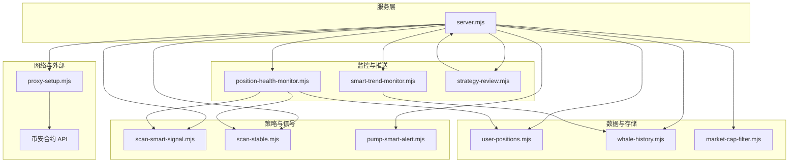
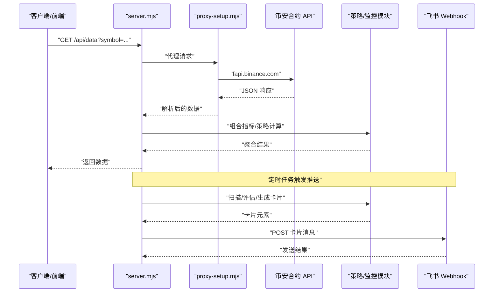
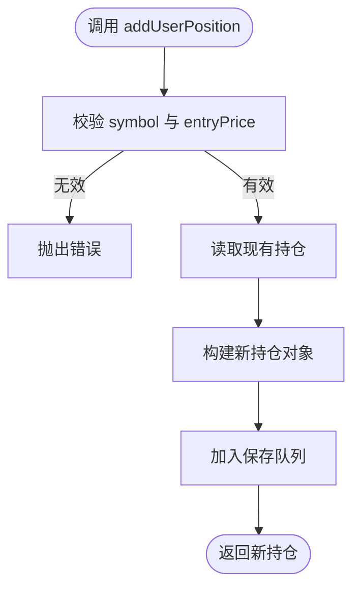
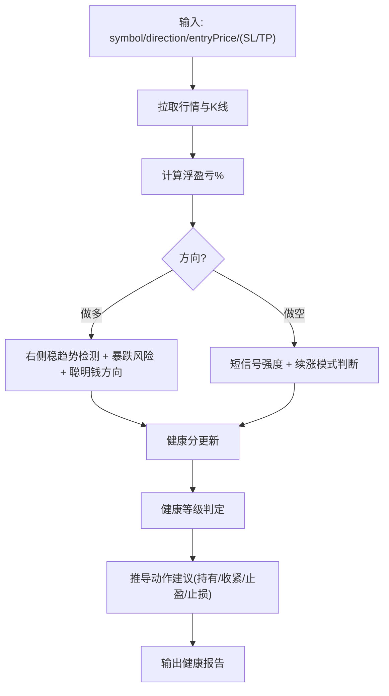
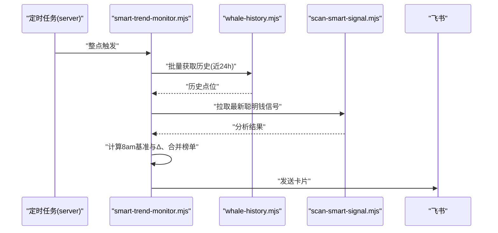
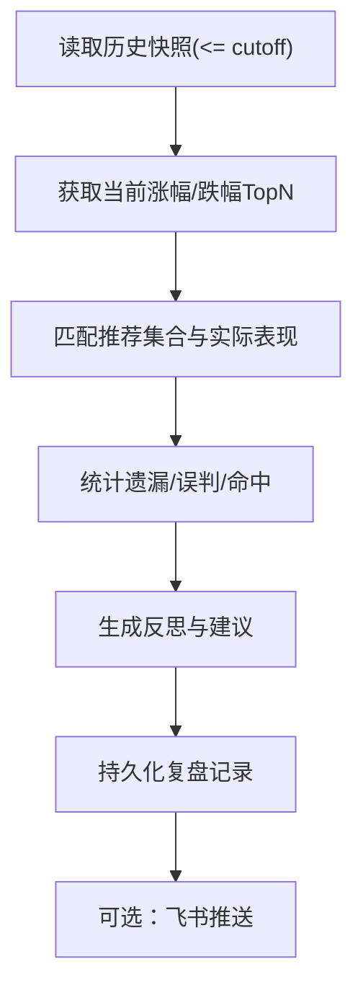
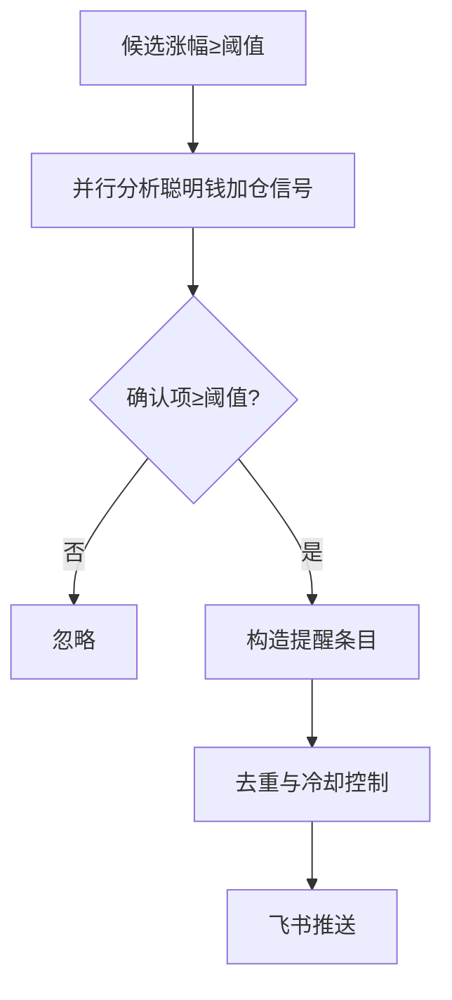
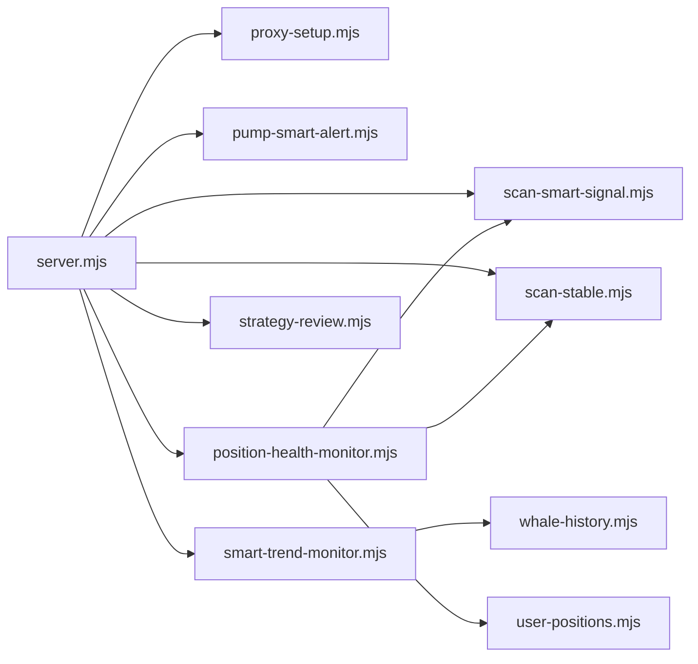

# 模拟交易系统

<cite>
**本文引用的文件列表**   
- [README.md](file://README.md)
- [package.json](file://package.json)
- [server.mjs](file://server.mjs)
- [proxy-setup.mjs](file://proxy-setup.mjs)
- [market-cap-filter.mjs](file://market-cap-filter.mjs)
- [user-positions.mjs](file://user-positions.mjs)
- [position-health.mjs](file://position-health.mjs)
- [position-health-monitor.mjs](file://position-health-monitor.mjs)
- [smart-trend-monitor.mjs](file://smart-trend-monitor.mjs)
- [strategy-review.mjs](file://strategy-review.mjs)
- [pump-smart-alert.mjs](file://pump-smart-alert.mjs)
- [scan-stable.mjs](file://scan-stable.mjs)
- [scan-smart-signal.mjs](file://scan-smart-signal.mjs)
- [whale-history.mjs](file://whale-history.mjs)
</cite>

## 目录
1. [引言](#引言)
2. [项目结构](#项目结构)
3. [核心组件](#核心组件)
4. [架构总览](#架构总览)
5. [详细组件分析](#详细组件分析)
6. [依赖关系分析](#依赖关系分析)
7. [性能与并发特性](#性能与并发特性)
8. [故障排查指南](#故障排查指南)
9. [结论](#结论)
10. [附录：API 与集成指南](#附录api-与集成指南)

## 引言
本仓库实现了一个基于币安合约 API 的“聪明钱”监控与策略推送系统，并在此基础上扩展了模拟账户管理、仓位健康评估、止损止盈建议、策略复盘与绩效评估等能力。系统通过 Web 面板与终端两种方式提供数据与推送服务，支持飞书卡片推送、市值过滤、TradFi 标的排除、定时扫描与任务调度等。

本项目并非直接执行真实交易，而是以“模拟交易”的方式对策略进行验证、回测与复盘，并提供接口用于后续接入自动化交易或第三方平台。

## 项目结构
- 入口与服务
  - server.mjs：HTTP 服务器、代理请求、定时任务、飞书推送、大盘指标聚合、策略快照与复盘调度等。
  - proxy-setup.mjs：统一网络请求封装（优先 curl + 代理），错误处理与重试。
- 策略与信号
  - scan-stable.mjs：右侧稳趋势筛选（多周期回撤+均线/RSI/MACD）。
  - scan-smart-signal.mjs：聪明钱信号采集与分析（含限流熔断与缓存）。
  - pump-smart-alert.mjs：暴涨+聪明钱加仓做多特别提示。
- 监控与推送
  - smart-trend-monitor.mjs：聪明钱全池摘要、榜单合并、8am 基准、状态持久化与定时推送。
  - position-health-monitor.mjs：持仓健康报告与紧急预警推送。
  - strategy-review.mjs：策略复盘（预测快照 vs 实际涨跌榜）与报告生成。
- 数据与存储
  - user-positions.mjs：模拟持仓 CRUD（本地 JSON）。
  - whale-history.mjs：聪明钱历史采样与批量读取。
  - market-cap-filter.mjs：市值上限过滤。
- 配置与脚本
  - README.md：功能说明、环境变量、API 文档、服务管理。
  - package.json：脚本命令与运行环境要求。

图表来源
- [server.mjs:1-120](file://server.mjs#L1-L120)
- [proxy-setup.mjs:1-71](file://proxy-setup.mjs#L1-L71)
- [scan-smart-signal.mjs:1-120](file://scan-smart-signal.mjs#L1-L120)
- [scan-stable.mjs:1-120](file://scan-stable.mjs#L1-L120)
- [pump-smart-alert.mjs:1-120](file://pump-smart-alert.mjs#L1-L120)
- [smart-trend-monitor.mjs:1-120](file://smart-trend-monitor.mjs#L1-L120)
- [position-health-monitor.mjs:1-120](file://position-health-monitor.mjs#L1-L120)
- [strategy-review.mjs:1-120](file://strategy-review.mjs#L1-L120)
- [user-positions.mjs:1-64](file://user-positions.mjs#L1-L64)
- [whale-history.mjs:1-120](file://whale-history.mjs#L1-L120)
- [market-cap-filter.mjs:1-15](file://market-cap-filter.mjs#L1-L15)

章节来源
- [README.md:1-210](file://README.md#L1-L210)
- [package.json:1-22](file://package.json#L1-L22)

## 核心组件
- 模拟账户与仓位管理
  - 提供添加、删除、查询模拟持仓的能力；字段包含方向、入场价、可选止损/止盈、备注与时间戳。
  - 数据落盘为 data/user-positions.json，写入采用队列串行避免并发冲突。
- 仓位健康评估与风控建议
  - 综合多因子（趋势稳定性、暴跌风险、聪明钱信号、浮盈亏）计算健康度与建议动作（持有/收紧止损/考虑止盈/建议止损）。
  - 自动根据 K 线支撑阻力给出建议止损/止盈位。
- 聪明钱趋势监控与推送
  - 每小时整点汇总全池聪明钱变化，结合 8am 基准与资金费率，输出市场研判与板块表格。
  - 支持固定关注池与动态榜单合并去重，按 8am 积分排序。
- 策略复盘与绩效评估
  - 定期对比“做多/做空/稳趋势/暴跌”推荐与实际涨幅/跌幅 TopN，统计遗漏、误判与命中情况，生成可推送的报告。
- 实时暴涨与聪明钱加仓提醒
  - 针对 8am 以来涨幅达到阈值的币种，叠加聪明钱加仓确认条件，进行高频提醒。
- 鲸鱼历史采样
  - 周期性采集聪明钱快照，持久化到 data/whale-history.json，供趋势监控与复盘使用。

章节来源
- [user-positions.mjs:1-64](file://user-positions.mjs#L1-L64)
- [position-health.mjs:1-213](file://position-health.mjs#L1-L213)
- [smart-trend-monitor.mjs:1-200](file://smart-trend-monitor.mjs#L1-L200)
- [strategy-review.mjs:1-120](file://strategy-review.mjs#L1-L120)
- [pump-smart-alert.mjs:1-120](file://pump-smart-alert.mjs#L1-L120)
- [whale-history.mjs:1-120](file://whale-history.mjs#L1-L120)

## 架构总览
系统由 HTTP 服务驱动，整合多个策略模块与数据源，统一通过代理层访问币安合约 API，并将结果推送到飞书或返回给前端。

图表来源
- [server.mjs:508-538](file://server.mjs#L508-L538)
- [proxy-setup.mjs:49-71](file://proxy-setup.mjs#L49-L71)
- [smart-trend-monitor.mjs:706-765](file://smart-trend-monitor.mjs#L706-L765)
- [position-health-monitor.mjs:130-154](file://position-health-monitor.mjs#L130-L154)

## 详细组件分析

### 模拟账户与仓位管理
- 功能要点
  - 新增持仓：校验 symbol 后缀为 USDT、entryPrice 有效、direction 归一化为 long/short，自动生成 id 与时间戳。
  - 删除持仓：按 id 过滤，若不存在则报错。
  - 读取持仓：返回数组，空文件或首次启动返回空数组。
  - 持久化：写入 data/user-positions.json，写操作排队串行。
- 数据结构
  - 字段：id、symbol、direction、entryPrice、stopLoss、takeProfit、note、createdAt。
- 复杂度
  - 读写均为 O(n)（n 为持仓数），典型场景下 n 较小，性能可忽略。
- 错误处理
  - 参数校验失败抛出明确错误信息；删除不存在的持仓抛出错误。

图表来源
- [user-positions.mjs:34-55](file://user-positions.mjs#L34-L55)

章节来源
- [user-positions.mjs:1-64](file://user-positions.mjs#L1-L64)

### 仓位健康评估与风控建议
- 输入
  - symbol、direction、entryPrice、stopLoss、takeProfit。
- 核心逻辑
  - 获取当前价格与 1h K 线，计算浮盈亏百分比。
  - 根据 K 线近期高低点估算支撑/阻力，给出建议止损/止盈。
  - 做多：检查“右侧稳趋势”是否仍成立、暴跌风险评分、聪明钱方向是否一致。
  - 做空：检查短信号强度与趋势反转风险。
  - 综合打分与健康等级（健康/警告/危险），并推导动作建议（继续持有/收紧止损/考虑止盈/建议止损）。
- 输出
  - 健康等级、健康分数、理由、动作建议、距离止损/止盈百分比、检查时间等。

图表来源
- [position-health.mjs:56-195](file://position-health.mjs#L56-L195)
- [scan-stable.mjs:163-193](file://scan-stable.mjs#L163-L193)
- [scan-smart-signal.mjs:86-167](file://scan-smart-signal.mjs#L86-L167)

章节来源
- [position-health.mjs:1-213](file://position-health.mjs#L1-L213)
- [scan-stable.mjs:1-290](file://scan-stable.mjs#L1-290)
- [scan-smart-signal.mjs:1-238](file://scan-smart-signal.mjs#L1-238)

### 聪明钱趋势监控与推送
- 功能要点
  - 每小时整点扫描全池聪明钱变化，记录 8am 基准比值，计算 1h 与 8am 以来的变化百分比。
  - 合并涨幅/跌幅/右侧/交易额等多榜单，去重并按 8am 积分绝对值排序。
  - 输出市场研判（总体偏多/偏空/均衡）与显著变化 Top 列表。
  - 支持固定关注池与分页展示。
- 状态持久化
  - 将每个币种的最近状态（score/direction/ratio/price/fundingRate 等）持久化到 data/smart-trend-state.json。
  - 决策状态与推送 mock 数据分别持久化。
- 推送格式
  - 飞书卡片表格，列包括币种、价格、8am/24h 涨跌幅、聪明钱分值、资金费率、市值标签等。

图表来源
- [smart-trend-monitor.mjs:320-344](file://smart-trend-monitor.mjs#L320-L344)
- [smart-trend-monitor.mjs:706-765](file://smart-trend-monitor.mjs#L706-L765)
- [whale-history.mjs:108-119](file://whale-history.mjs#L108-L119)
- [scan-smart-signal.mjs:76-84](file://scan-smart-signal.mjs#L76-L84)

章节来源
- [smart-trend-monitor.mjs:1-200](file://smart-trend-monitor.mjs#L1-L200)
- [whale-history.mjs:1-142](file://whale-history.mjs#L1-142)
- [scan-smart-signal.mjs:1-120](file://scan-smart-signal.mjs#L1-L120)

### 策略复盘与绩效评估
- 功能要点
  - 每 N 小时（默认与稳趋势推送间隔一致）运行一次复盘。
  - 从策略快照中取出上一周期的做多/做空/稳趋势/暴跌推荐集合，对比当前 8am 以来的涨幅/跌幅 TopN。
  - 统计遗漏、误判（做空但仍在涨）、命中（推荐后上涨/下跌）等指标，生成反思与建议。
  - 支持将复盘结果以飞书卡片推送。
- 数据存储
  - 预测快照：data/strategy-predictions.json（限制最大条数）。
  - 复盘记录：data/strategy-reviews.json（限制最大条数）。

图表来源
- [strategy-review.mjs:150-266](file://strategy-review.mjs#L150-L266)
- [strategy-review.mjs:352-377](file://strategy-review.mjs#L352-L377)

章节来源
- [strategy-review.mjs:1-377](file://strategy-review.mjs#L1-L377)

### 实时暴涨与聪明钱加仓提醒
- 触发条件
  - 8am 以来涨幅 ≥ 阈值（默认 20%）。
  - 聪明钱连续加仓确认项 ≥ 阈值（默认 2 项）。
- 确认项
  - 大户持仓偏多上升、OI 增仓且价格上涨、主动买入比率上升、大户比全网更高等。
- 推送频率
  - 同一币种在指定间隔内最多推送一次，避免重复轰炸。

图表来源
- [pump-smart-alert.mjs:71-112](file://pump-smart-alert.mjs#L71-L112)
- [pump-smart-alert.mjs:151-190](file://pump-smart-alert.mjs#L151-L190)

章节来源
- [pump-smart-alert.mjs:1-191](file://pump-smart-alert.mjs#L1-L191)

### 鲸鱼历史采样
- 功能要点
  - 周期性采集聪明钱信号，提取关键指标（多空比、鲸鱼数量、盈利鲸鱼、平均入场价等）。
  - 维护每个币种的历史点位数组，限制最大点数与最小记录间隔。
  - 提供单币种与批量读取接口，供趋势监控与复盘使用。
- 持久化
  - data/whale-history.json，写入队列串行。

章节来源
- [whale-history.mjs:1-142](file://whale-history.mjs#L1-L142)

## 依赖关系分析
- 网络层
  - proxy-setup.mjs 提供统一 fetchJson，Windows 环境下优先使用 curl 并通过环境变量启用代理。
- 外部依赖
  - 币安合约 REST API（fapi.binance.com）与聪明钱信号 API（bapi.futures）。
- 模块耦合
  - server.mjs 作为编排中心，协调各模块并负责调度与推送。
  - smart-trend-monitor.mjs 依赖 whale-history.mjs 与 scan-smart-signal.mjs。
  - position-health-monitor.mjs 依赖 user-positions.mjs、position-health.mjs、scan-stable.mjs、scan-smart-signal.mjs。
  - strategy-review.mjs 依赖 server.mjs 提供的辅助函数（如 getGainersSince8am、getLosersSince8am、getPrices、sendFeishuCard）。

图表来源
- [server.mjs:1-28](file://server.mjs#L1-L28)
- [smart-trend-monitor.mjs:1-45](file://smart-trend-monitor.mjs#L1-L45)
- [position-health-monitor.mjs:1-20](file://position-health-monitor.mjs#L1-L20)
- [strategy-review.mjs:1-24](file://strategy-review.mjs#L1-L24)

章节来源
- [server.mjs:1-120](file://server.mjs#L1-L120)
- [proxy-setup.mjs:1-71](file://proxy-setup.mjs#L1-L71)

## 性能与并发特性
- 并发与去重
  - ticker/24hr 全量数据采用短 TTL 缓存与并发去重，避免同一轮推送重复请求。
  - pmap 工具函数实现可控并发度的并行映射，降低 API 压力。
- 限流与熔断
  - 聪明钱信号 API 具备请求节流与熔断机制（418/429/403 时进入熔断窗口）。
- 网络超时与重试
  - 统一超时设置与指数退避重试，提升鲁棒性。
- 磁盘 I/O
  - 所有 JSON 写入均通过队列串行，避免并发写冲突。

[本节为通用性能讨论，无需具体文件引用]

## 故障排查指南
- 端口占用
  - 启动时报 EADDRINUSE，建议使用 dev:restart 自动清理旧进程，或手动结束占用端口的进程。
- 代理与地区限制
  - Windows 下优先走 curl，需确保已安装 curl 且环境变量正确；部分地区可能受限导致 403/418。
- 飞书推送失败
  - 检查 FEISHU_WEBHOOK 是否正确；频控错误会触发重试与熔断，必要时调整推送间隔。
- 市值过滤
  - 若未配置 CMC_API_KEY，将回退 CoinGecko，可能遇到速率限制或数据不全；可通过 MAX_MARKET_CAP_USD 关闭过滤。
- 策略复盘无数据
  - 需要至少一个历史快照；请等待一轮推送后再运行复盘。

章节来源
- [README.md:40-77](file://README.md#L40-L77)
- [proxy-setup.mjs:25-44](file://proxy-setup.mjs#L25-L44)
- [scan-smart-signal.mjs:42-55](file://scan-smart-signal.mjs#L42-L55)
- [strategy-review.mjs:150-166](file://strategy-review.mjs#L150-L166)

## 结论
该系统以“聪明钱”为核心维度，结合多周期技术面与资金费率，构建了稳健的趋势识别与风险提示体系。通过模拟账户与仓位健康评估，系统可在不开仓的前提下完成策略验证与风险控制建议。配合策略复盘与绩效评估，形成闭环的策略迭代流程。未来可扩展为自动化交易引擎与第三方平台对接。

[本节为总结，无需具体文件引用]

## 附录：API 与集成指南

### 服务端 API
- GET /api/data?symbol=SLXUSDT — 聪明钱全量数据（价格、24h、多空比、OI、资金费率等）
- GET /api/klines?symbol=SLXUSDT&interval=1h&limit=100 — K 线数据
- GET /api/marketcap?symbol=BTCUSDT — 单币种市值（优先 CMC，回退 CoinGecko）
- POST /api/feishu-alert — 发送飞书报警
- POST /api/trigger-stable-push — 手动触发稳趋势推送

章节来源
- [README.md:190-199](file://README.md#L190-L199)

### 环境变量与开关
- PORT：Web 面板监听端口（默认 3388）
- CMC_API_KEY：CoinMarketCap Pro API Key（可选）
- MAX_MARKET_CAP_USD：市值上限（美元），超过则不监控/不推送；0 表示关闭
- FEISHU_WEBHOOK：飞书机器人 Webhook URL
- STABLE_PUSH_HOURS / LONG_PUSH_HOURS / DUMP_PUSH_HOURS：推送间隔（小时）
- STABLE_SCAN_LIMIT / LONG_SCAN_LIMIT / DUMP_SCAN_LIMIT：扫描数量
- SMART_TREND_INTERVAL_MIN / SMART_TREND_COOLDOWN_MIN：聪明钱监控间隔与冷却
- POSITION_HEALTH_ENABLED / POSITION_HEALTH_PUSH_HOURS：持仓健康监控开关与推送间隔
- STRATEGY_REVIEW_ENABLED / STRATEGY_REVIEW_HOURS：策略复盘开关与周期
- PUMP_SMART_ALERT_ENABLED / REALTIME_ALERT_INTERVAL_MIN：暴涨提醒开关与间隔

章节来源
- [README.md:142-154](file://README.md#L142-L154)
- [server.mjs:540-590](file://server.mjs#L540-L590)
- [strategy-review.mjs:10-16](file://strategy-review.mjs#L10-L16)
- [pump-smart-alert.mjs:6-10](file://pump-smart-alert.mjs#L6-L10)

### 模拟交易策略集成与自动交易开关
- 策略集成
  - 通过 server.mjs 暴露的辅助函数（如 getGainersSince8am、getLosersSince8am、getPrices）与 sendFeishuCard，可将策略结果纳入复盘与推送。
- 自动交易开关
  - 当前系统仅做分析与推送，不包含下单执行。如需接入自动化交易，可在 server.mjs 中增加“执行器”模块，受环境变量控制（例如 AUTO_TRADE_ENABLED=false 默认关闭），并在策略确认后调用交易所下单 API。
- 风险控制机制
  - 仓位健康评估可作为前置风控：当健康等级为“危险”或动作建议为“建议止损”时，禁止开新仓或强制平仓。
  - 市值过滤与 TradFi 标的排除可降低非目标标的的风险暴露。

章节来源
- [strategy-review.mjs:150-266](file://strategy-review.mjs#L150-L266)
- [position-health.mjs:167-195](file://position-health.mjs#L167-L195)
- [server.mjs:478-506](file://server.mjs#L478-L506)

### 回测数据导入与实盘对比分析
- 回测数据导入
  - 可将历史预测快照（strategy-predictions.json）与复盘记录（strategy-reviews.json）导入系统进行再评估。
- 实盘对比分析
  - 通过 getGainersSince8am/getLosersSince8am 获取实际涨跌榜，与历史推荐进行对比，量化命中率与遗漏率。
- 绩效评估报告生成
  - 复盘模块已内置反思与建议生成，并可推送飞书卡片；可按需扩展导出 CSV/HTML 报告。

章节来源
- [strategy-review.mjs:64-81](file://strategy-review.mjs#L64-L81)
- [strategy-review.mjs:335-350](file://strategy-review.mjs#L335-L350)

### 第三方平台集成开发指南
- 飞书 Webhook
  - 使用 sendFeishuCardV2 发送卡片，支持模板与分页表格。
- 代理与跨域
  - 通过 server.mjs 代理币安 API，避免前端跨域问题；Windows 下优先 curl 提高稳定性。
- 扩展点
  - 在 server.mjs 中注册新的路由与定时任务，复用已有的网络与推送基础设施。
  - 通过环境变量控制功能开关与阈值，便于不同环境部署。

章节来源
- [server.mjs:599-644](file://server.mjs#L599-L644)
- [proxy-setup.mjs:1-23](file://proxy-setup.mjs#L1-L23)
- [README.md:190-206](file://README.md#L190-L206)