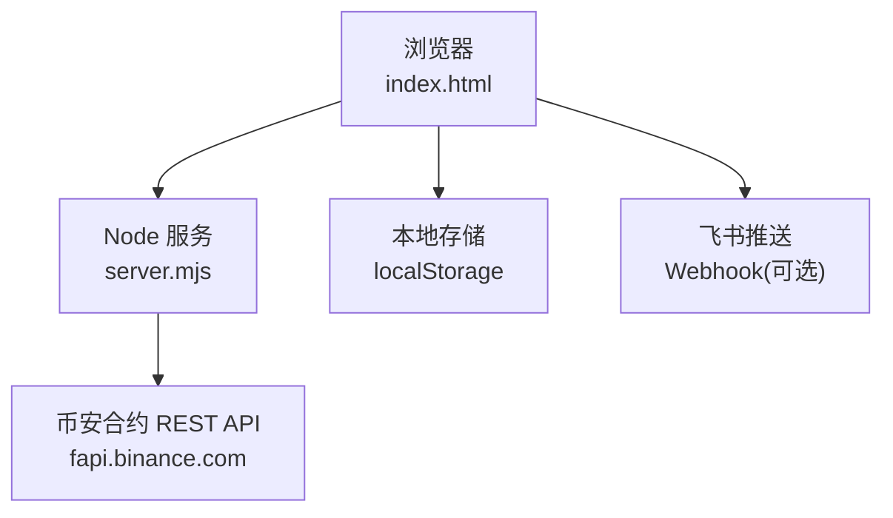
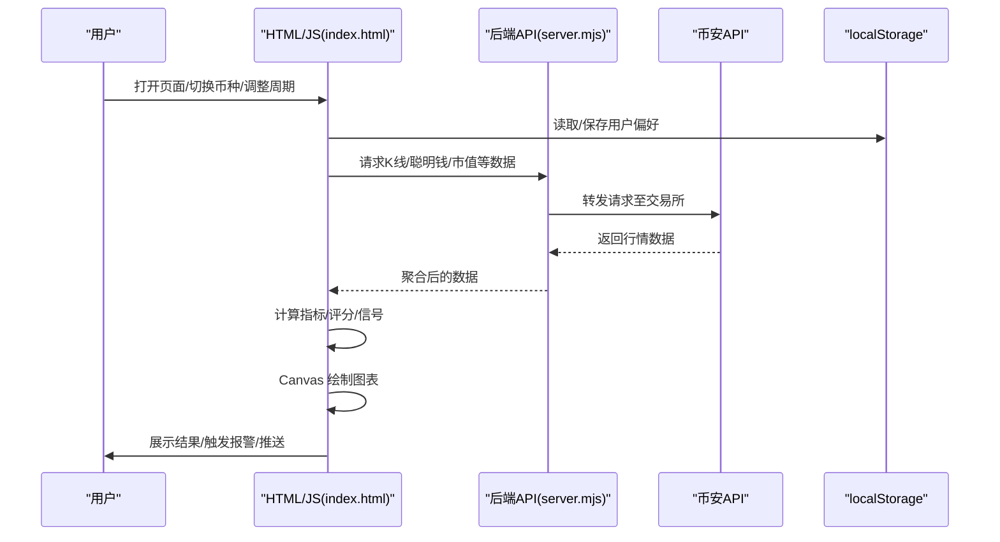
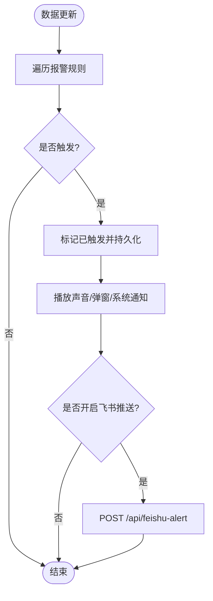
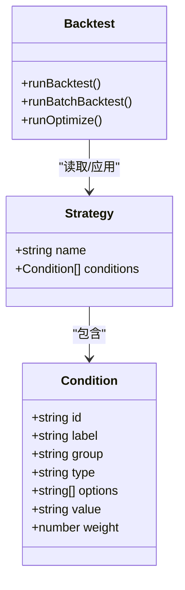
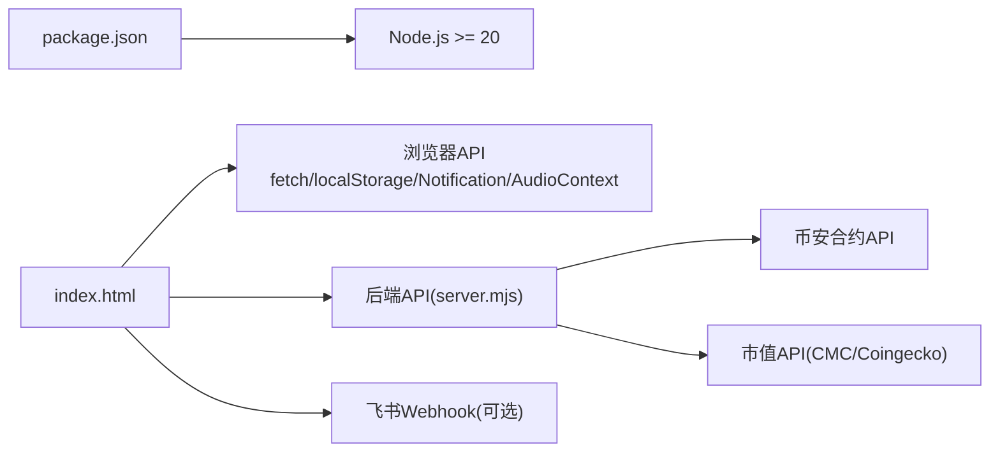

# 界面定制与扩展

<cite>
**本文引用的文件**   
- [index.html](file://index.html)
- [README.md](file://README.md)
- [package.json](file://package.json)
</cite>

## 目录
1. [简介](#简介)
2. [项目结构](#项目结构)
3. [核心组件](#核心组件)
4. [架构总览](#架构总览)
5. [详细组件分析](#详细组件分析)
6. [依赖关系分析](#依赖关系分析)
7. [性能考虑](#性能考虑)
8. [故障排查指南](#故障排查指南)
9. [结论](#结论)
10. [附录](#附录)

## 简介
本文件面向“界面定制与扩展”，围绕主题系统、样式覆盖、组件替换、布局调整、配置选项、本地存储管理、用户偏好设置、界面语言切换、插件/扩展点、第三方集成、自定义模块开发、响应式适配、移动端优化、无障碍访问、国际化支持，以及 UI 框架升级、性能调优与安全加固的最佳实践进行系统化说明。内容基于仓库现有实现进行分析与提炼，确保可落地、可操作。

## 项目结构
本项目为单页 Web 应用，前端逻辑集中在 index.html 中，包含 HTML/CSS/JS 一体化实现；服务端通过 Node.js 原生 HTTP 提供 API 代理与业务接口。

图表来源
- [index.html:1-800](file://index.html#L1-L800)
- [README.md:190-210](file://README.md#L190-L210)

章节来源
- [README.md:1-210](file://README.md#L1-L210)
- [package.json:1-22](file://package.json#L1-L22)

## 核心组件
- 主题与样式系统：基于 CSS 变量定义全局色彩与尺寸，便于一键换肤与局部覆盖。
- 数据与状态：通过 URL 参数与 localStorage 持久化用户偏好（币种列表、筛选条件、策略权重等）。
- 图表渲染：Canvas 自绘 K 线、RSI、资金费率、OI 变化率、买卖量柱状图等。
- 信号与策略：内置多类扫描与评分逻辑，支持策略编辑与回测。
- 报警与通知：浏览器通知 + 声音提示 + 飞书推送。
- 模拟交易：前端模拟持仓、日志与收益曲线。

章节来源
- [index.html:1-800](file://index.html#L1-L800)
- [index.html:4172-4790](file://index.html#L4172-L4790)
- [index.html:4792-4999](file://index.html#L4792-L4999)

## 架构总览
前端以“数据拉取 → 指标计算 → 图表渲染 → 交互反馈”为主线，结合本地缓存与定时刷新机制，形成低耦合的模块化流程。

图表来源
- [index.html:2267-2300](file://index.html#L2267-L2300)
- [index.html:1809-1836](file://index.html#L1809-L1836)
- [README.md:190-210](file://README.md#L190-L210)

## 详细组件分析

### 主题系统与样式覆盖
- 主题变量集中定义在根级 CSS 变量中，涵盖背景、卡片、边框、文本、涨跌色等，便于统一换肤。
- 通过覆盖 :root 变量或新增 CSS 规则即可实现深色/浅色主题切换、品牌色替换。
- 媒体查询已内置移动端适配断点，可在不改动 JS 的前提下调整布局密度与字号。

章节来源
- [index.html:7-121](file://index.html#L7-L121)

### 组件替换与布局调整
- 各功能区块以独立容器呈现（概览、信号、K 线、策略、模拟交易、报警等），可通过隐藏/显示容器或替换内部 DOM 实现组件级替换。
- 网格布局使用 CSS Grid，配合媒体查询在不同屏幕下自动重排。
- 建议将关键区域抽取为可复用模板函数，减少重复拼接字符串，提升可维护性。

章节来源
- [index.html:479-626](file://index.html#L479-L626)
- [index.html:97-121](file://index.html#L97-L121)

### 配置选项与本地存储管理
- 配置项来源：URL 参数（symbol、interval）、后端 /api/config、localStorage 持久化。
- 本地存储键位：
  - smart-money-coins：自选币种列表
  - smart-money-filter-settings：右侧筛选器设置（周期、范围、排序、回撤阈值、双周期确认）
  - chartRange：图表时间范围
  - userStrategy：策略条件与权重
  - sim_trading_state/sim_trading_log：模拟交易状态与日志
- 读写封装：提供 load/save 函数，统一异常处理与默认值回退。

章节来源
- [index.html:629-691](file://index.html#L629-L691)
- [index.html:697-705](file://index.html#L697-L705)
- [index.html:762-779](file://index.html#L762-L779)
- [index.html:4192-4262](file://index.html#L4192-L4262)
- [index.html:4816-4847](file://index.html#L4816-L4847)
- [index.html:5207](file://index.html#L5207)

### 用户偏好设置与界面语言切换
- 偏好设置：当前币种、刷新间隔、筛选器参数、图表范围、策略权重等均持久化到 localStorage，并在下次加载时恢复。
- 语言切换：当前页面硬编码中文文案，未实现 i18n 引擎。建议在顶部增加语言选择器，将文案抽离为字典对象，按语言键渲染。

章节来源
- [index.html:629-631](file://index.html#L629-L631)
- [index.html:2903-2915](file://index.html#L2903-L2915)
- [index.html:4172-4262](file://index.html#L4172-L4262)

### 插件架构与扩展点定义
- 扩展点现状：
  - 指标与信号：多处采用“条件+权重”的可配置打分模型，适合扩展新条件。
  - 扫描器：右侧筛选器具备多种扫描入口（涨幅榜、动量、暴跌风险、左右侧交易、稳趋势、聪明钱信号、推荐做多/做空），可按需新增。
  - 图表：drawLineChart/drawDualAxisChart/drawBarChart/drawFundingRateChart 等通用绘图函数可作为扩展基座。
- 建议的插件化方案：
  - 注册表模式：维护一个 conditions 注册表，新增指标只需声明 id、label、group、value 映射与权重。
  - 事件总线：对“数据更新”“报警触发”“策略变更”等事件发布订阅，解耦渲染与业务逻辑。
  - 钩子函数：在 fetchAndDrawKlines、renderCharts、checkAlerts 等关键节点暴露钩子，供外部脚本注入。

章节来源
- [index.html:4172-4262](file://index.html#L4172-L4262)
- [index.html:2889-3034](file://index.html#L2889-L3034)
- [index.html:1089-1513](file://index.html#L1089-L1513)

### 第三方组件集成与自定义模块开发
- 集成方式：
  - 通过 CDN 引入第三方库后，在初始化阶段挂载到指定容器。
  - 利用事件总线对接数据流，避免直接耦合。
- 自定义模块：
  - 将复杂逻辑拆分为独立模块（如新的指标计算、新的扫描器），通过注册表接入主流程。
  - 遵循最小权限原则，仅暴露必要 API，降低耦合度。

章节来源
- [index.html:1089-1513](file://index.html#L1089-L1513)
- [index.html:2889-3034](file://index.html#L2889-L3034)

### 响应式适配与移动端优化
- 断点：已在 768px 与 480px 处分别做了布局与字号调整。
- 优化建议：
  - 在小屏上减少同时渲染的图表数量，按需懒加载。
  - 增大触控区域，优化输入框与按钮尺寸。
  - 对长列表启用虚拟滚动或分页加载。

章节来源
- [index.html:97-121](file://index.html#L97-L121)

### 无障碍访问与国际化支持
- 无障碍：
  - 为关键交互元素补充 aria-* 属性与键盘导航。
  - 图表 tooltip 增加语义化标签与焦点可见性。
- 国际化：
  - 将文案抽离为字典，按语言键渲染。
  - 提供语言切换器并持久化用户选择。

章节来源
- [index.html:1-800](file://index.html#L1-L800)

### 报警系统与通知
- 报警类型：价格突破/跌破、RSI 超买/超卖、大户翻多/翻空、主动买卖激增。
- 通知渠道：浏览器通知 + 声音提示 + 飞书推送（可选）。
- 触发流程：数据更新后检查条件，满足则标记已触发并弹出 Toast，必要时调用后端发送飞书消息。

图表来源
- [index.html:822-938](file://index.html#L822-L938)
- [index.html:869-891](file://index.html#L869-L891)
- [README.md:190-210](file://README.md#L190-L210)

章节来源
- [index.html:822-938](file://index.html#L822-L938)
- [index.html:869-891](file://index.html#L869-L891)

### 策略管理与回测
- 策略编辑：可视化调整条件开关与权重，保存到 localStorage 后立即生效。
- 回测：支持单币/批量回测，输出胜率、总收益、最大回撤、收益曲线与交易明细。
- 参数优化：随机采样权重组合，按目标指标（收益/夏普/胜率）排序并支持一键应用。

图表来源
- [index.html:4172-4262](file://index.html#L4172-L4262)
- [index.html:4264-4790](file://index.html#L4264-L4790)

章节来源
- [index.html:4172-4262](file://index.html#L4172-L4262)
- [index.html:4264-4790](file://index.html#L4264-L4790)

### 模拟自动交易
- 功能：模拟开平仓、止损止盈、交易日志、权益曲线。
- 存储：状态与日志持久化到 localStorage，支持清空与重置。
- 建议：后续可扩展为“策略驱动”的自动化执行器，并与真实账户 API 对接（需安全加固）。

章节来源
- [index.html:4792-4999](file://index.html#L4792-L4999)

## 依赖关系分析
- 运行时依赖：Node.js >= 20，无额外前端构建依赖。
- 外部接口：币安合约 REST API、CoinMarketCap Pro（可选，回退 CoinGecko）、飞书 Webhook。
- 本地依赖：localStorage 用于持久化用户偏好与策略。

图表来源
- [package.json:1-22](file://package.json#L1-L22)
- [README.md:190-210](file://README.md#L190-L210)

章节来源
- [package.json:1-22](file://package.json#L1-L22)
- [README.md:190-210](file://README.md#L190-L210)

## 性能考虑
- 渲染优化：
  - 使用 requestAnimationFrame 分批绘制，避免阻塞主线程。
  - 图表按需渲染，减少不必要的重绘。
- 网络优化：
  - 合理设置刷新间隔，避免频繁请求。
  - 对扫描类任务使用并发控制与进度反馈。
- 内存管理：
  - 及时清理定时器与事件监听。
  - 大数组切片与缓存命中策略（如 rightSideCache、rightStableCache）。

章节来源
- [index.html:1809-1836](file://index.html#L1809-L1836)
- [index.html:3515-3526](file://index.html#L3515-L3526)
- [index.html:3325-3414](file://index.html#L3325-L3414)

## 故障排查指南
- 端口占用：启动时报 EADDRINUSE，优先使用 dev:restart 自动释放端口，或手动终止旧进程。
- 数据加载失败：查看状态指示与错误提示，检查后端服务与币安 API 连通性。
- 飞书推送失败：确认 .env 中 FEISHU_WEBHOOK 配置正确，且服务已重启。
- 市值过滤：若币种超出 MAX_MARKET_CAP_USD，将被过滤且不监控。

章节来源
- [README.md:40-53](file://README.md#L40-L53)
- [README.md:55-77](file://README.md#L55-L77)
- [README.md:79-94](file://README.md#L79-L94)
- [index.html:2251-2300](file://index.html#L2251-L2300)

## 结论
本项目在前端实现了高度可定制的监控面板，具备完善的主题系统、本地化偏好、策略管理与回测能力。通过合理的扩展点设计与模块化拆分，可进一步演进为插件化架构，支撑更多第三方组件与自定义模块的无缝集成。在性能与可用性方面，应持续优化渲染与网络策略，完善无障碍与国际化支持，并加强安全加固与运维稳定性。

## 附录

### 最佳实践清单
- UI 框架升级
  - 逐步引入轻量 UI 框架（如 Vue/React），先以渐进式增强方式替换部分 DOM 拼接逻辑。
  - 保持 CSS 变量体系不变，确保主题平滑迁移。
- 性能调优
  - 图表虚拟化与增量更新。
  - 请求合并与去抖节流。
  - 离线缓存与重试策略。
- 安全加固
  - 严格校验与转义用户输入，防止 XSS。
  - 敏感配置（如 Webhook）仅存于服务端环境变量，不在前端暴露。
  - 限制扫描并发与速率，避免被上游限流。

[本节为通用指导，无需源码引用]