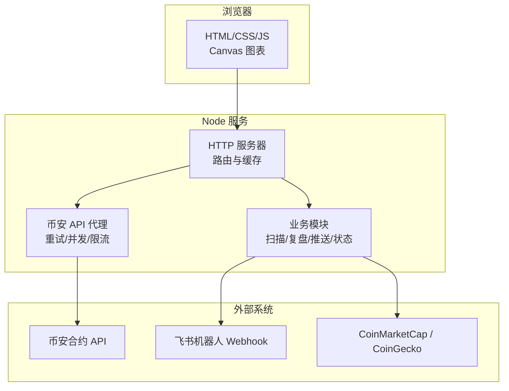
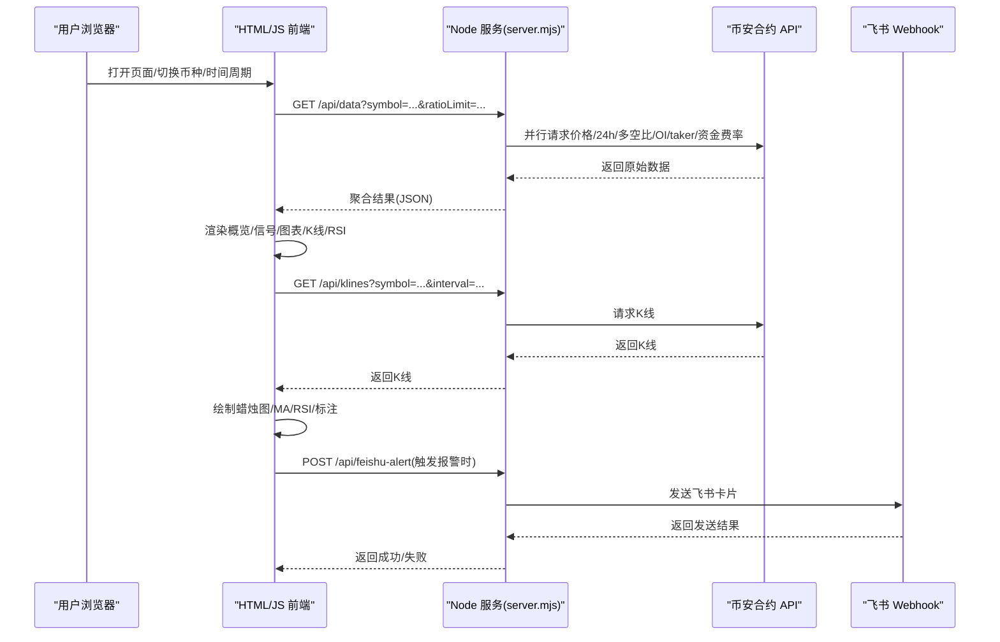
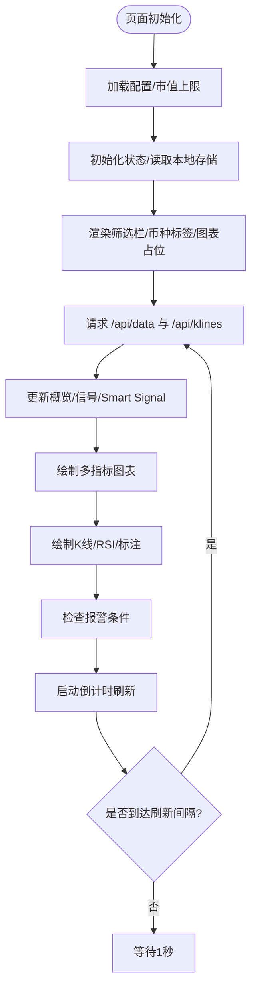
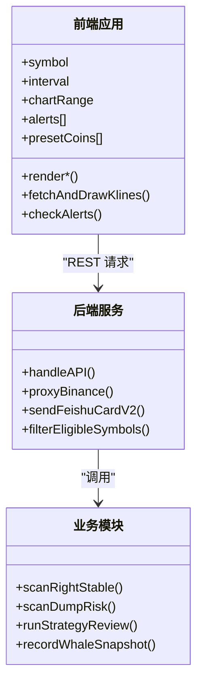
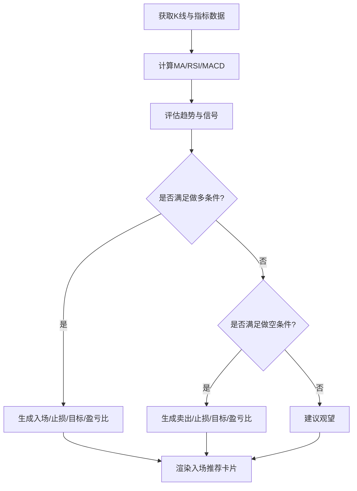
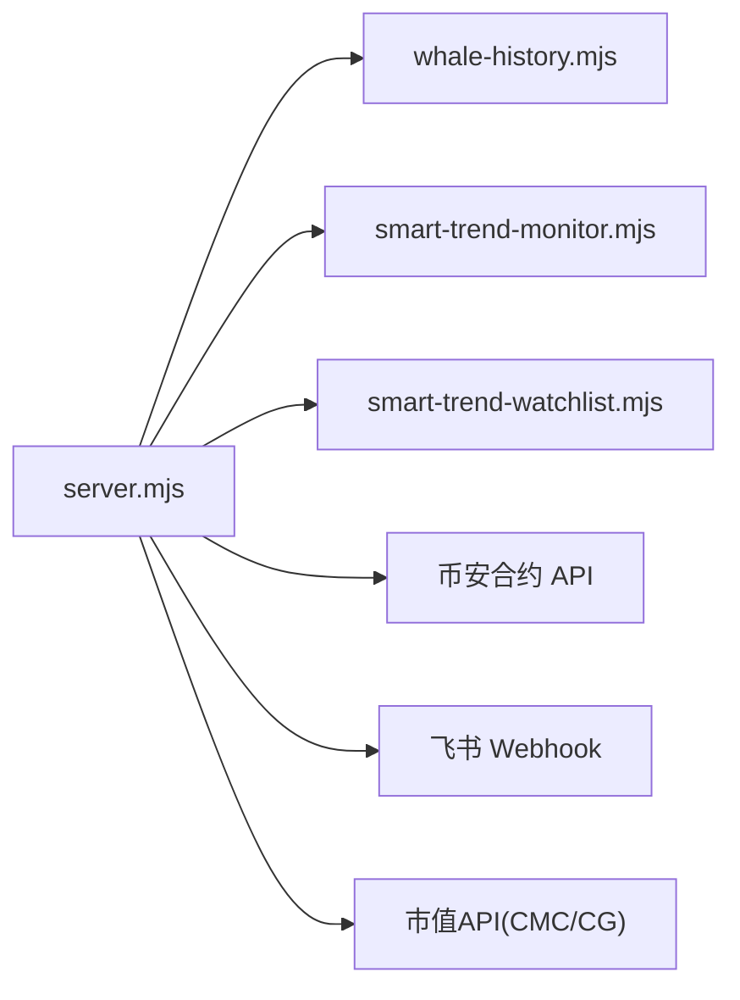

# 界面概览与架构

<cite>
**本文引用的文件列表**
- [index.html](file://index.html)
- [server.mjs](file://server.mjs)
- [README.md](file://README.md)
- [package.json](file://package.json)
- [whale-history.mjs](file://whale-history.mjs)
- [smart-trend-monitor.mjs](file://smart-trend-monitor.mjs)
- [smart-trend-watchlist.mjs](file://smart-trend-watchlist.mjs)
</cite>

## 目录
1. [简介](#简介)
2. [项目结构](#项目结构)
3. [核心组件](#核心组件)
4. [架构总览](#架构总览)
5. [详细组件分析](#详细组件分析)
6. [依赖关系分析](#依赖关系分析)
7. [性能考虑](#性能考虑)
8. [故障排查指南](#故障排查指南)
9. [结论](#结论)
10. [附录](#附录)

## 简介
本项目是一个基于币安合约 API 的“聪明钱”监控面板，提供 Web 前端与 Node.js 后端。前端采用单页 HTML + Canvas 自绘图表，实现 K 线、RSI、资金费率、持仓量、主动买卖量等可视化；后端作为代理层聚合多路数据并暴露 REST API，同时承担定时扫描、策略复盘、鲸鱼历史采集、推送通知等任务。整体设计强调低耦合、可配置、可扩展，并通过市值过滤与 TradFi 排除提升数据质量与安全性。

## 项目结构
- 前端：单一 index.html 包含样式、模板与脚本，使用原生 DOM 操作与 Canvas 渲染，无第三方 UI/图表库。
- 后端：server.mjs 为 HTTP 服务入口，集成多个业务模块（扫描、复盘、推送、状态持久化等）。
- 工具与脚本：scripts 下提供 PM2、Windows 服务等运维脚本；data 下存放示例数据。

**图示来源**
- [server.mjs:1-120](file://server.mjs#L1-L120)
- [index.html:1-120](file://index.html#L1-L120)

**章节来源**
- [README.md:1-120](file://README.md#L1-L120)
- [package.json:1-22](file://package.json#L1-L22)

## 核心组件
- 前端应用
  - 主题与响应式：通过 CSS 变量定义深色主题，媒体查询适配移动端布局。
  - 页面区块：头部控制区、筛选栏、币种标签、信号摘要、Smart Signal 面板、入场推荐、K 线与 RSI、多指标图表网格、策略管理、模拟交易、报警设置等。
  - 交互机制：事件绑定在 HTML 内联属性中，调用全局函数完成数据请求、渲染与状态更新。
  - 图表绘制：纯 Canvas 实现蜡烛图、均线、RSI、双轴图、柱状图、资金费率图等，支持十字光标悬浮提示。
- 后端服务
  - 路由与代理：统一处理静态资源与 /api/* 接口，代理币安合约 API，内置重试与错误转换。
  - 数据聚合：并行拉取价格、24h 行情、大户多空比、全网多空比、OI、taker 买卖量、资金费率等，合并返回。
  - 业务模块：右侧稳趋势扫描、暴跌风险扫描、8 点动量、策略复盘、智能趋势监控、鲸鱼历史采集、用户持仓健康等。
  - 推送与通知：飞书卡片消息发送，含重试与频控保护。
  - 配置与过滤：加载 .env，市值上限过滤、TradFi 标的排除。

**章节来源**
- [index.html:1-120](file://index.html#L1-L120)
- [index.html:476-626](file://index.html#L476-L626)
- [index.html:1089-1191](file://index.html#L1089-L1191)
- [index.html:1559-1727](file://index.html#L1559-L1727)
- [index.html:1729-1807](file://index.html#L1729-L1807)
- [index.html:2095-2249](file://index.html#L2095-L2249)
- [server.mjs:1-120](file://server.mjs#L1-L120)
- [server.mjs:508-538](file://server.mjs#L508-L538)
- [server.mjs:599-644](file://server.mjs#L599-L644)
- [server.mjs:1754-1811](file://server.mjs#L1754-L1811)

## 架构总览
前后端通信采用 REST 风格，前端通过 fetch 调用 /api/* 获取聚合后的 JSON 数据，再驱动本地渲染与状态同步。后端对币安 API 进行封装，提供重试、并发去重、TTL 缓存、市值过滤与 TradFi 排除等能力。

**图示来源**
- [index.html:2267-2300](file://index.html#L2267-L2300)
- [index.html:1809-1836](file://index.html#L1809-L1836)
- [server.mjs:1754-1811](file://server.mjs#L1754-L1811)
- [server.mjs:599-644](file://server.mjs#L599-L644)

## 详细组件分析

### 前端应用结构与模块化
- HTML 文档结构
  - 头部控制区：搜索币种、刷新间隔、状态指示、手动触发推送按钮。
  - 筛选栏：多种策略视图（涨幅榜、8点追涨、暴跌预警、右侧/左侧交易、推荐做多/做空、聪明钱信号、策略复盘），支持周期、范围、排序、回撤阈值等参数。
  - 币种标签：预设币种一键切换，支持编辑模式增删，URL 参数同步。
  - 信号摘要与 Smart Signal：汇总大户/全网多空比、主动买卖量、资金费率等信号。
  - 入场推荐：结合 MA、RSI、MACD、支撑阻力与聪明钱数据给出做多/做空建议与盈亏比。
  - K 线与 RSI：独立区域，支持多时间周期切换，叠加资金费率标记。
  - 图表网格：鲸鱼趋势、大户多空比、账户对比、OI+价格、资金费率、主动买卖量等。
  - 策略管理与模拟交易：策略条件编辑、回测、模拟盘运行与日志、收益曲线。
  - 报警设置：价格/RSI/大户翻多翻空/买卖激增等条件，支持声音、浏览器通知、飞书推送。
- CSS 样式系统
  - 主题变量：通过 :root 定义背景、卡片、边框、文本、涨跌色等，便于统一换肤。
  - 响应式设计：使用 @media 针对 768px/480px 断点进行布局调整，保证移动端可用性。
- JavaScript 模块划分
  - 全局状态：当前币种、刷新间隔、定时器、图表范围、筛选参数、缓存集合等。
  - 数据获取：fetch 调用 /api/data、/api/klines、/api/smart-signal、/api/whale-history 等。
  - 渲染逻辑：概览卡片、信号列表、Smart Signal 面板、K 线/RSI 绘制、多指标图表绘制。
  - 事件处理：内联 onclick/oninput/onfocus/onblur 绑定到全局函数，完成交互与数据刷新。
  - 状态同步：localStorage 持久化币种列表、筛选设置、报警规则、图表范围等。

**图示来源**
- [index.html:628-700](file://index.html#L628-L700)
- [index.html:2267-2313](file://index.html#L2267-L2313)
- [index.html:2095-2249](file://index.html#L2095-L2249)
- [index.html:1809-1836](file://index.html#L1809-L1836)

**章节来源**
- [index.html:1-120](file://index.html#L1-L120)
- [index.html:476-626](file://index.html#L476-L626)
- [index.html:628-700](file://index.html#L628-L700)
- [index.html:2095-2249](file://index.html#L2095-L2249)
- [index.html:2267-2313](file://index.html#L2267-L2313)

### 前端与后端通信架构
- 主要接口
  - /api/data：聚合多路数据（价格、24h、多空比、OI、taker、资金费率等）
  - /api/klines：K 线数据
  - /api/smart-signal：聪明钱信号分析与展示
  - /api/whale-history：鲸鱼历史采样数据
  - /api/feishu-alert：发送飞书报警
  - /api/config、/api/marketcap：配置与市值查询
- 数据流管理
  - 前端按 URL 参数或本地选择决定 symbol 与 interval，发起请求后根据返回 JSON 更新对应区块。
  - 后端对币安 API 做并发请求与错误隔离，部分数据缺失不影响整体返回，并在 warnings 字段提示。
- 状态同步策略
  - 本地持久化：localStorage 保存币种列表、筛选设置、报警规则、图表范围等。
  - 服务端缓存：ticker/24hr 短 TTL 缓存、鲸鱼历史文件缓存、策略复盘快照等。

**图示来源**
- [index.html:2267-2300](file://index.html#L2267-L2300)
- [server.mjs:508-538](file://server.mjs#L508-L538)
- [server.mjs:599-644](file://server.mjs#L599-L644)
- [whale-history.mjs:47-73](file://whale-history.mjs#L47-L73)

**章节来源**
- [server.mjs:1754-1811](file://server.mjs#L1754-L1811)
- [index.html:2095-2249](file://index.html#L2095-L2249)

### 关键算法与流程
- 入场推荐评估
  - 综合 MA20/MA60、近期支撑/阻力、RSI 超买超卖、MACD 金叉死叉、聪明钱趋势与主动买卖量趋势，输出做多/做空建议与止损/目标价及盈亏比。
- 报警检查
  - 实时比较最新价格、大户多空比、主动买卖比、RSI6 值与用户设置的阈值，触发声音、通知与飞书推送。
- 图表绘制
  - 支持高 DPI 屏幕缩放，计算坐标映射、网格、图例、参考线、区间标注，鼠标移动显示 Tooltip。

**图示来源**
- [index.html:1853-2078](file://index.html#L1853-L2078)
- [index.html:893-938](file://index.html#L893-L938)
- [index.html:1089-1191](file://index.html#L1089-L1191)

**章节来源**
- [index.html:1853-2078](file://index.html#L1853-L2078)
- [index.html:893-938](file://index.html#L893-L938)
- [index.html:1089-1191](file://index.html#L1089-L1191)

### 概念性概览
- 界面布局说明
  - 顶部：标题与控制区，支持币种搜索、刷新间隔、状态指示。
  - 中部：筛选栏与币种标签，快速切换不同策略视图与具体币种。
  - 下部：概览卡片、信号摘要、Smart Signal、入场推荐、K 线与 RSI、多指标图表网格、策略与模拟交易、报警设置。
- 交互流程概述
  - 用户选择币种与周期 → 前端请求数据 → 渲染各区块 → 启动倒计时自动刷新 → 触发报警时弹出 Toast 并推送飞书。

[本图为概念性流程图，不直接映射具体源码文件]

## 依赖关系分析
- 前端依赖
  - 浏览器原生能力：Fetch、Canvas、LocalStorage、Notification、AudioContext。
  - 无第三方 UI/图表库，降低依赖复杂度。
- 后端依赖
  - Node.js 原生 http/fs/promises/url/path。
  - 外部系统：币安合约 API、飞书 Webhook、CoinMarketCap/CoinGecko（市值）。
- 模块耦合
  - server.mjs 集中导入各业务模块，形成松耦合的插件式结构。
  - whale-history.mjs、smart-trend-monitor.mjs、smart-trend-watchlist.mjs 等模块负责特定功能，通过导出函数被 server.mjs 调用。

**图示来源**
- [server.mjs:1-28](file://server.mjs#L1-L28)
- [whale-history.mjs:47-73](file://whale-history.mjs#L47-L73)
- [smart-trend-monitor.mjs:36-151](file://smart-trend-monitor.mjs#L36-L151)
- [smart-trend-watchlist.mjs:123-161](file://smart-trend-watchlist.mjs#L123-L161)

**章节来源**
- [server.mjs:1-28](file://server.mjs#L1-L28)
- [whale-history.mjs:47-73](file://whale-history.mjs#L47-L73)
- [smart-trend-monitor.mjs:36-151](file://smart-trend-monitor.mjs#L36-L151)
- [smart-trend-watchlist.mjs:123-161](file://smart-trend-watchlist.mjs#L123-L161)

## 性能考虑
- 前端优化
  - 按需渲染：仅在数据就绪后执行 requestAnimationFrame 绘制，避免阻塞主线程。
  - 高 DPI 适配：Canvas 尺寸按 devicePixelRatio 缩放，确保清晰度。
  - 局部更新：概览/信号/图表分别渲染，减少整页重排。
  - 节流与缓存：图表范围与筛选设置持久化，避免重复计算。
- 后端优化
  - ticker/24hr 短 TTL 缓存与并发去重，避免同一轮推送重复请求。
  - Promise.allSettled 并行拉取多路数据，容忍部分失败并返回 warnings。
  - pmap 并发控制批量任务，限制并发度防止过载。
  - 市值过滤与 TradFi 排除在服务端完成，减少无效数据传递。
- 用户体验
  - 倒计时刷新与状态指示，明确数据新鲜度。
  - 报警声音与系统通知，及时提醒关键信号。
  - 响应式布局，移动端友好。

[本节为通用指导，不直接分析具体文件]

## 故障排查指南
- 常见问题
  - 端口占用：启动时报 EADDRINUSE，建议使用 dev:restart 清理旧进程。
  - 网络不可用：币安 API 未就绪，服务会指数退避重试，查看控制台日志。
  - 市值过滤：超出 MAX_MARKET_CAP_USD 的币种会被拒绝访问，需在 .env 调整或更换币种。
  - TradFi 标的：股票相关合约被排除，请求将返回 403。
- 定位方法
  - 查看浏览器控制台错误信息与服务端日志。
  - 检查 .env 配置项（PORT、CMC_API_KEY、MAX_MARKET_CAP_USD、FEISHU_WEBHOOK 等）。
  - 确认飞书 Webhook 地址有效且权限正确。

**章节来源**
- [README.md:40-94](file://README.md#L40-L94)
- [server.mjs:107-125](file://server.mjs#L107-L125)
- [server.mjs:484-506](file://server.mjs#L484-L506)

## 结论
该监控面板以极简的前端技术栈与强大的后端聚合能力相结合，实现了丰富的可视化与策略分析功能。通过市值过滤、TradFi 排除、并发与缓存优化，保证了数据质量与性能。前端模块化清晰、交互流畅，后端职责分明、扩展性强，适合持续迭代与功能增强。

[本节为总结，不直接分析具体文件]

## 附录
- 浏览器兼容性要求
  - 现代浏览器：Chrome、Edge、Firefox、Safari 最新版本。
  - 必需特性：Fetch、Canvas、LocalStorage、Notification、AudioContext。
- 性能优化策略
  - 前端：按需渲染、高 DPI 适配、局部更新、节流与缓存。
  - 后端：短 TTL 缓存、并发去重、Promise.allSettled、pmap 并发控制、市值过滤。
- 用户体验设计原则
  - 清晰的状态反馈（倒计时、状态点、错误提示）。
  - 直观的视觉层次（颜色语义、网格与图例、Tooltip）。
  - 一致的交互模式（点击切换、下拉选择、展开/收起）。

[本节为通用指导，不直接分析具体文件]