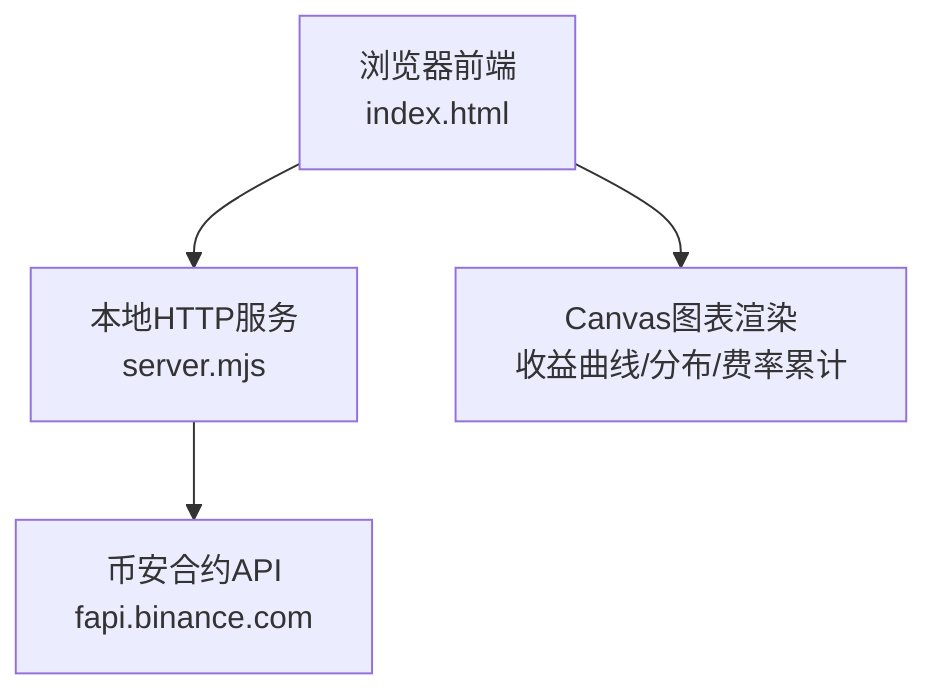
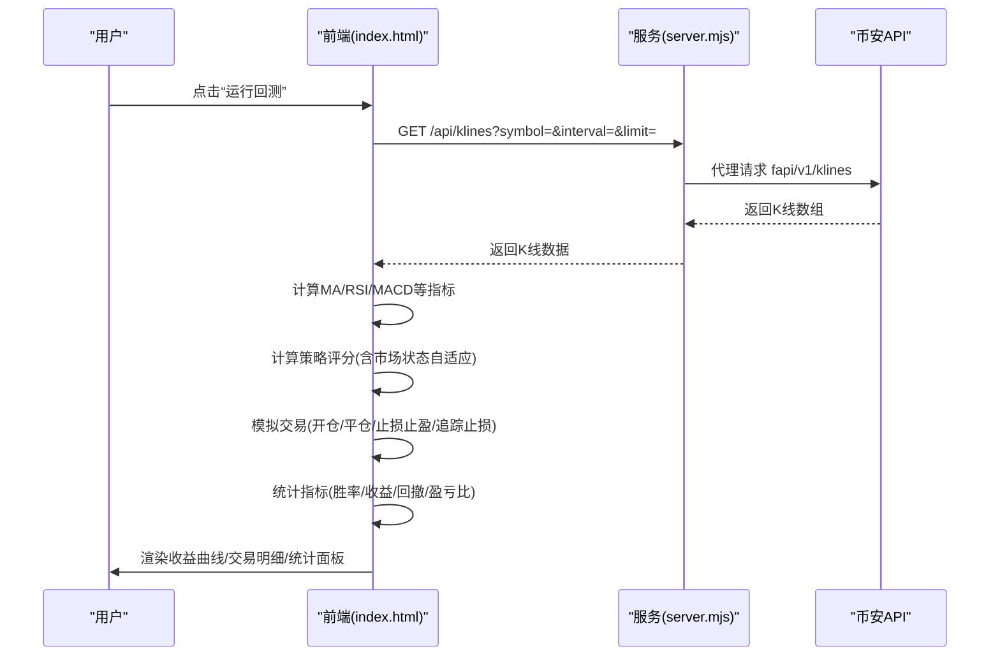
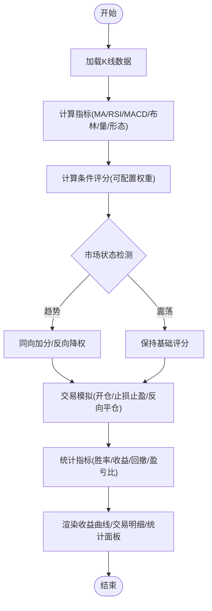
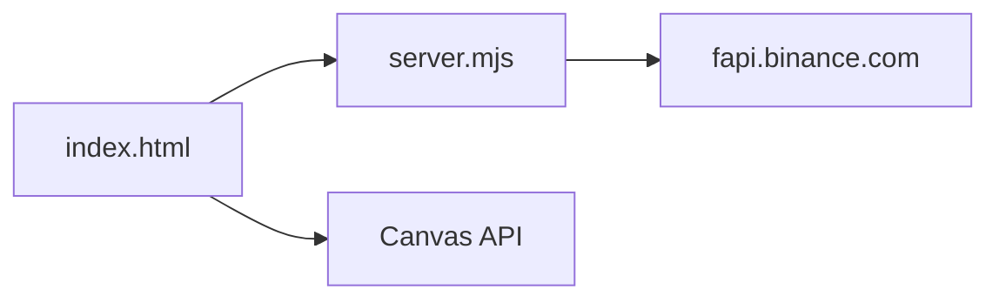
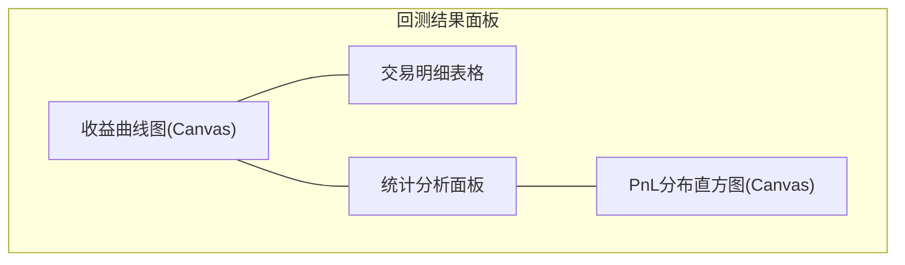

# 回测系统

<cite>
**本文引用的文件**
- [index.html](file://index.html)
- [server.mjs](file://server.mjs)
- [README.md](file://README.md)
- [package.json](file://package.json)
</cite>

## 目录
1. [简介](#简介)
2. [项目结构](#项目结构)
3. [核心组件](#核心组件)
4. [架构总览](#架构总览)
5. [详细组件分析](#详细组件分析)
6. [依赖关系分析](#依赖关系分析)
7. [性能与指标计算](#性能与指标计算)
8. [可视化界面](#可视化界面)
9. [参数调优指南](#参数调优指南)
10. [报告导出与策略对比](#报告导出与策略对比)
11. [故障排查](#故障排查)
12. [结论](#结论)

## 简介
本回测系统基于浏览器端实现，通过服务端代理访问币安合约历史K线数据，在页面内完成信号生成、交易模拟与结果统计。系统支持多条件加权评分、市场状态自适应（趋势/震荡）、止损止盈与追踪止损、批量回测与参数优化，并提供收益曲线、交易明细与统计分析面板的可视化展示。

## 项目结构
- 前端：单页应用 index.html，包含所有回测逻辑、指标计算、图表渲染与交互。
- 后端：Node.js HTTP 服务 server.mjs，提供 K 线等数据接口并代理币安合约 API。
- 文档与脚本：README.md 说明使用方式；package.json 定义启动脚本与环境要求。

图示来源
- [index.html:4331-4433](file://index.html#L4331-L4433)
- [server.mjs:508-525](file://server.mjs#L508-L525)

章节来源
- [README.md:1-210](file://README.md#L1-L210)
- [package.json:1-22](file://package.json#L1-L22)

## 核心组件
- 历史数据加载器：从 /api/klines 获取指定币种、周期与根数的K线数据，用于回测与实时监控。
- 信号引擎：基于可配置的多条件加权评分（均线交叉/趋势、EMA金叉死叉、RSI超买超卖、MACD柱状图穿越、布林带、放量、价格形态），并结合市场状态（趋势/震荡）进行权重自适应。
- 交易模拟器：根据评分阈值开仓，按固定止损/止盈或反向信号平仓，支持追踪止损与冷却时间控制。
- 统计与可视化：计算胜率、总收益、最大回撤、盈亏比等指标，绘制收益曲线、交易明细表与PnL分布。

章节来源
- [index.html:4331-4433](file://index.html#L4331-L4433)
- [index.html:4716-4788](file://index.html#L4716-L4788)
- [index.html:4792-5399](file://index.html#L4792-L5399)
- [server.mjs:508-525](file://server.mjs#L508-L525)

## 架构总览
回测流程由前端发起，请求服务端拉取历史K线，随后在前端执行指标计算、信号评分、交易模拟与结果统计，最终通过Canvas绘制可视化面板。

图示来源
- [index.html:4331-4433](file://index.html#L4331-L4433)
- [server.mjs:508-525](file://server.mjs#L508-L525)

## 详细组件分析

### 历史数据加载机制
- 数据来源：币安合约 REST API（fapi.binance.com）。
- 接口路径：/api/klines?symbol={符号}&interval={周期}&limit={根数}。
- 时间范围：由 limit 控制，最小需满足回测预热期（例如至少50根K线以保障指标稳定）。
- 错误处理：当返回数据不足或异常时，前端提示“数据不足”。

章节来源
- [server.mjs:508-525](file://server.mjs#L508-L525)
- [index.html:4331-4342](file://index.html#L4331-L4342)

### 信号生成与交易模拟
- 指标计算：移动平均（MA）、相对强弱指数（RSI）、MACD（含柱状图）、布林带、成交量放大、价格形态等。
- 条件评分：每个条件可启用/忽略并赋予权重，综合得到多头/空头得分。
- 市场状态自适应：检测近期是否处于趋势或震荡，趋势下对同向信号加分、反向信号降权。
- 交易规则：
  - 入场：多头/空头得分达到阈值即开仓。
  - 出场：固定止损/止盈触发，或反向信号出现时平仓。
  - 追踪止损：持仓期间随最高价更新止损位（做多向上跟踪，做空向下跟踪）。
  - 冷却时间：避免频繁交易。
  - 仓位管理：按余额百分比分配保证金，结合杠杆计算数量。

图示来源
- [index.html:4716-4788](file://index.html#L4716-L4788)
- [index.html:4299-4329](file://index.html#L4299-L4329)
- [index.html:4792-5399](file://index.html#L4792-L5399)

章节来源
- [index.html:4716-4788](file://index.html#L4716-L4788)
- [index.html:4299-4329](file://index.html#L4299-L4329)
- [index.html:4792-5399](file://index.html#L4792-L5399)

### 关键算法与数据结构
- 指标函数：
  - MA：窗口求和滑动平均。
  - RSI：基于涨跌均值的平滑计算。
  - MACD：快慢EMA差值与信号线，衍生柱状图。
- 数据结构：
  - trades：记录每笔交易的开/平仓价、方向、收益率等。
  - equity：累计收益序列，用于绘制收益曲线。
  - simState：模拟交易状态（余额、持仓、已平仓、权益历史等）。

复杂度分析：
- 指标计算为O(n)，其中n为K线条数。
- 回测主循环为O(n)，每次迭代计算评分与可能的交易操作。
- 批量回测为O(n*m)，m为币种数量。

章节来源
- [index.html:1515-1532](file://index.html#L1515-L1532)
- [index.html:1541-1549](file://index.html#L1541-L1549)
- [index.html:4331-4433](file://index.html#L4331-L4433)

## 依赖关系分析
- 前端依赖：
  - 浏览器Canvas API用于图表渲染。
  - 本地HTTP服务提供的K线接口。
- 后端依赖：
  - Node.js原生HTTP服务器。
  - 币安合约REST API（fapi.binance.com）。
  - 可选：CoinMarketCap Pro API（市值过滤）。

图示来源
- [index.html:4331-4433](file://index.html#L4331-L4433)
- [server.mjs:508-525](file://server.mjs#L508-L525)

章节来源
- [README.md:200-210](file://README.md#L200-L210)
- [package.json:1-22](file://package.json#L1-L22)

## 性能与指标计算
- 性能特性：
  - 指标计算采用线性扫描，内存占用与K线长度成正比。
  - 市场状态检测缓存，每隔若干根K线重新计算以降低开销。
  - 批量回测顺序执行，逐币种输出进度与结果。
- 指标计算逻辑：
  - 胜率：盈利交易数/总交易数。
  - 总收益：各笔交易收益率之和。
  - 最大回撤：交易序列中最低累计收益率（示例实现为遍历中的最小值）。
  - 盈亏比：平均盈利/平均亏损（若亏损数为0则特殊处理）。
  - 夏普比率：在参数优化中使用标准差作为风险度量，按均值/标准差估算。

章节来源
- [index.html:4331-4433](file://index.html#L4331-L4433)
- [index.html:4550-4600](file://index.html#L4550-L4600)

## 可视化界面
- 收益曲线图：
  - 横轴为时间步，纵轴为累计收益率百分比。
  - 正负区域填充不同颜色，标注零线与网格。
- 交易记录表格：
  - 显示方向、开/平仓时间与价格、单笔收益。
- 统计分析面板：
  - 展示交易次数、胜率、总收益、最大回撤、盈亏比。
  - 行情分布（趋势/震荡占比）及分段表现。
- PnL分布直方图：
  - 将已平仓交易的盈亏按区间分桶，观察分布特征。

图示来源
- [index.html:4407-4433](file://index.html#L4407-L4433)
- [index.html:4435-4500](file://index.html#L4435-L4500)
- [index.html:5802-5845](file://index.html#L5802-L5845)

章节来源
- [index.html:4407-4433](file://index.html#L4407-L4433)
- [index.html:4435-4500](file://index.html#L4435-L4500)
- [index.html:5802-5845](file://index.html#L5802-L5845)

## 参数调优指南
- 时间周期选择：
  - 短周期（如15分钟/1小时）适合高频信号与快速进出；长周期（如4小时/日线）更稳健但信号较少。
  - 建议先以较长周期验证策略稳定性，再逐步缩短周期测试灵敏度。
- 止损止盈设置：
  - 固定止损/止盈比例应结合波动率与策略期望收益设定，避免过窄导致频繁止损。
  - 开启追踪止损可在趋势行情中锁定利润，降低回撤。
- 仓位管理策略：
  - 按余额百分比分配保证金，结合杠杆控制风险暴露。
  - 限制最大持仓数与冷却时间，防止过度交易。
- 评分阈值与市场状态：
  - 提高阈值可减少假信号，但可能错过机会；降低阈值增加交易频率。
  - 趋势模式下强化同向信号、弱化反向信号，有助于提升整体收益。

章节来源
- [index.html:4792-5399](file://index.html#L4792-L5399)
- [index.html:4299-4329](file://index.html#L4299-L4329)

## 报告导出与策略对比
- 批量回测对比：
  - 输入多个币种，统一周期与K线根数，依次回测并汇总比较。
  - 输出排序后的交易数、胜率、总收益、最大回撤、均笔收益等。
- 参数优化：
  - 对关键条件的权重进行随机采样搜索，评估多种组合并按目标指标（总收益/夏普/胜率）排序。
  - 支持一键应用最优权重到当前策略并保存至本地存储。
- 报告导出：
  - 当前实现以HTML表格与Canvas图表呈现，未提供直接导出CSV/PDF功能。
  - 可通过复制表格内容或使用浏览器打印功能保存结果。

章节来源
- [index.html:4636-4714](file://index.html#L4636-L4714)
- [index.html:4533-4600](file://index.html#L4533-L4600)

## 故障排查
- 数据不足：
  - 现象：回测提示“数据不足”。
  - 原因：请求的K线根数少于回测所需的最小长度。
  - 解决：增大 limit 或缩短回测起始点。
- 端口占用：
  - 现象：启动时报端口被占用。
  - 解决：使用重启脚本自动清理旧进程，或手动终止占用端口的进程。
- 飞书推送失败：
  - 现象：通知未送达。
  - 解决：检查 .env 中 FEISHU_WEBHOOK 配置是否正确，确认机器人Webhook可用。

章节来源
- [index.html:4331-4342](file://index.html#L4331-L4342)
- [README.md:40-53](file://README.md#L40-L53)
- [README.md:55-63](file://README.md#L55-L63)

## 结论
该回测系统以轻量级前端+代理服务的方式实现了完整的策略回测与可视化能力。其优势在于灵活的条件评分与自适应市场状态、完善的止损止盈与追踪止损机制、以及直观的收益曲线与统计面板。对于进一步扩展，可考虑引入更丰富的指标、更严格的回测框架（滑点/手续费建模）、以及报告导出与自动化优化流程。