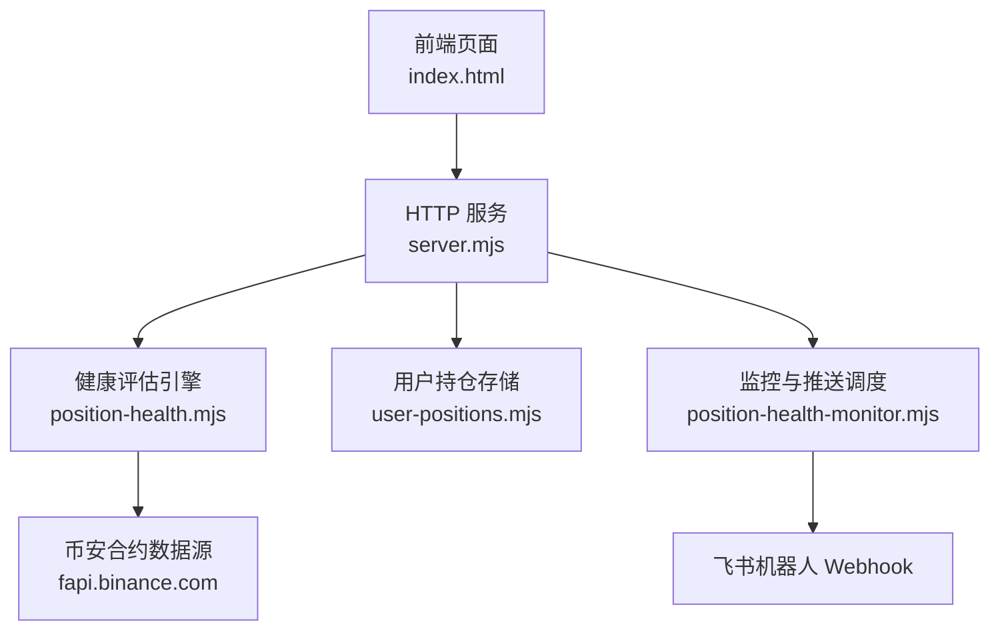
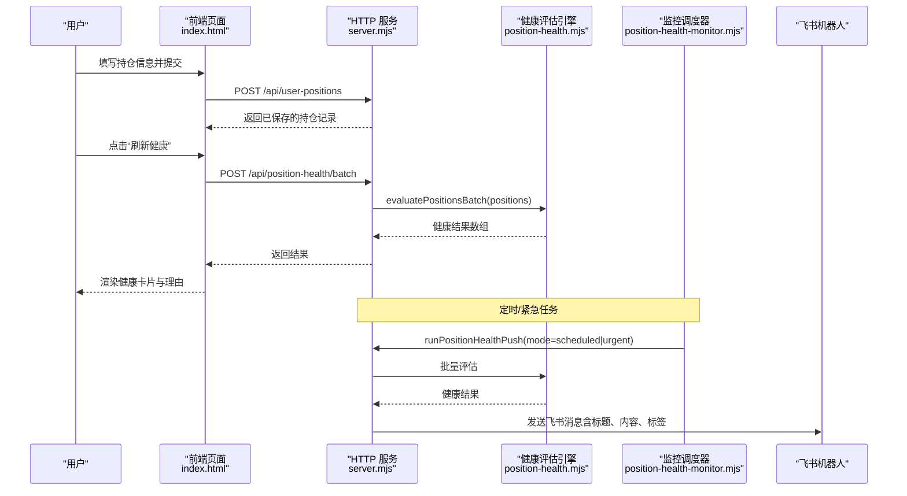
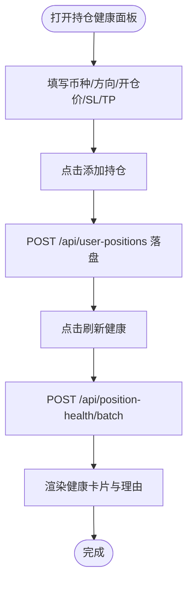
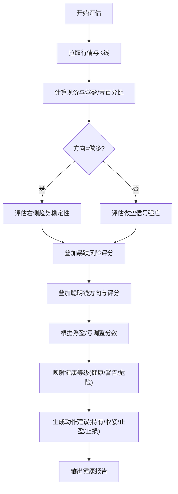
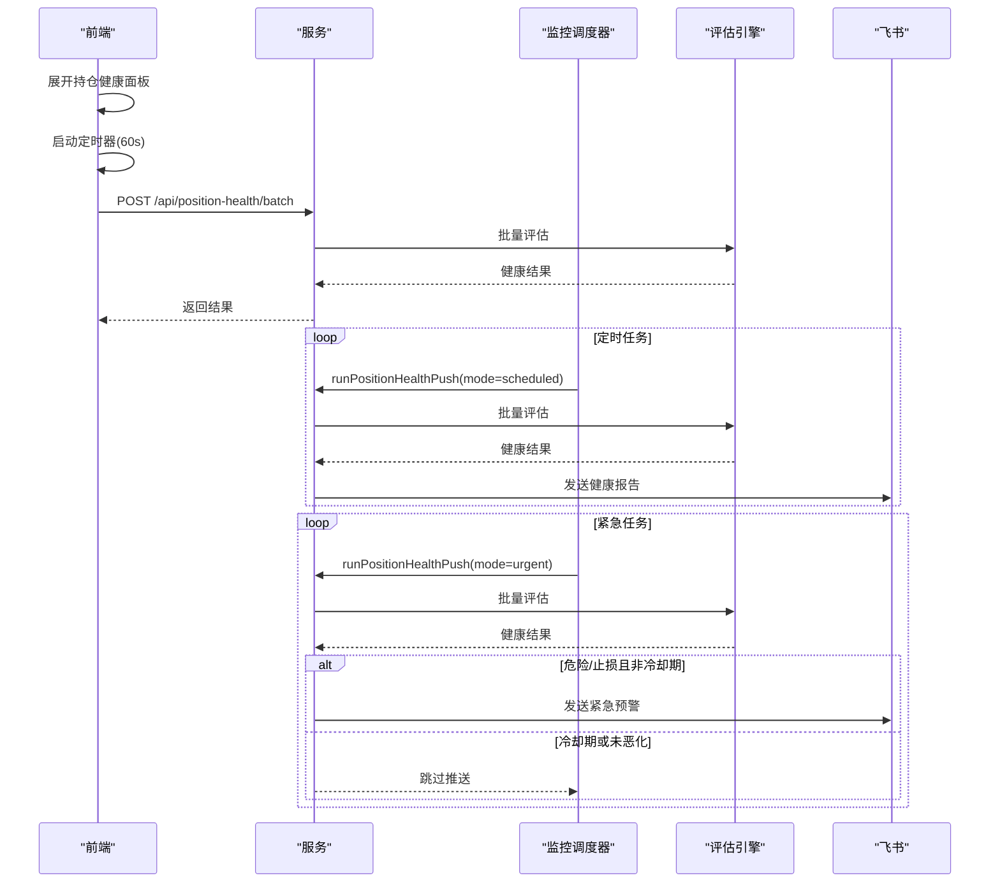
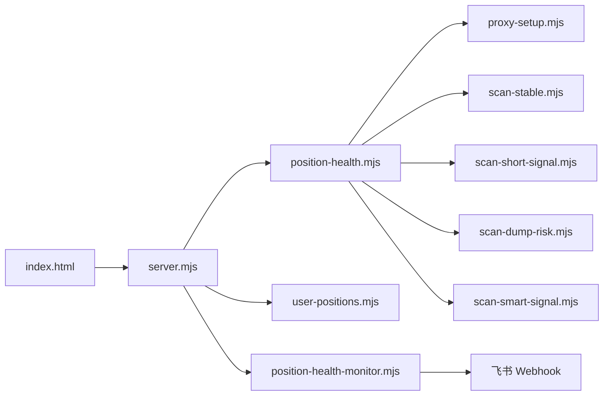

# 持仓健康监控

<cite>
**本文引用的文件**   
- [position-health-monitor.mjs](file://position-health-monitor.mjs)
- [position-health.mjs](file://position-health.mjs)
- [user-positions.mjs](file://user-positions.mjs)
- [server.mjs](file://server.mjs)
- [index.html](file://index.html)
- [README.md](file://README.md)
</cite>

## 目录
1. [简介](#简介)
2. [项目结构](#项目结构)
3. [核心组件](#核心组件)
4. [架构总览](#架构总览)
5. [详细组件分析](#详细组件分析)
6. [依赖关系分析](#依赖关系分析)
7. [性能与实时性](#性能与实时性)
8. [故障排查指南](#故障排查指南)
9. [结论](#结论)
10. [附录：API 与配置](#附录api-与配置)

## 简介
本模块提供“持仓健康监控”能力，覆盖从持仓录入、健康度评估、状态分类、风险提示到定时/紧急推送的全链路。前端提供持仓信息录入界面（币种选择、方向设置、开仓价、止损止盈），后端基于技术指标、市场环境与风险管理规则进行综合评分，输出健康等级与操作建议，并通过飞书推送报告与紧急预警。系统支持批量评估、历史持仓查看与分析，以及价格变动监听与技术指标重算的实时更新机制。

## 项目结构
围绕持仓健康监控的关键文件与职责如下：
- 前端交互与展示：index.html（持仓健康面板、表单、列表渲染、轮询刷新）
- 服务端路由与编排：server.mjs（暴露健康检查、批量评估、用户持仓管理、触发推送等接口；初始化调度器）
- 健康评估引擎：position-health.mjs（计算健康分数、判定健康等级、生成动作建议与理由）
- 监控与推送调度：position-health-monitor.mjs（定时扫描、紧急去重冷却、飞书推送）
- 用户持仓持久化：user-positions.mjs（本地 JSON 存储、增删查）
- 项目说明与环境配置：README.md（环境变量、端口、代理、市值过滤等）

图表来源
- [server.mjs:1637-1734](file://server.mjs#L1637-L1734)
- [position-health.mjs:56-195](file://position-health.mjs#L56-L195)
- [position-health-monitor.mjs:130-186](file://position-health-monitor.mjs#L130-L186)
- [user-positions.mjs:30-64](file://user-positions.mjs#L30-L64)
- [index.html:510-537](file://index.html#L510-L537)

章节来源
- [index.html:510-537](file://index.html#L510-L537)
- [server.mjs:1637-1734](file://server.mjs#L1637-L1734)
- [position-health.mjs:56-195](file://position-health.mjs#L56-L195)
- [position-health-monitor.mjs:130-186](file://position-health-monitor.mjs#L130-L186)
- [user-positions.mjs:30-64](file://user-positions.mjs#L30-L64)
- [README.md:1-210](file://README.md#L1-L210)

## 核心组件
- 前端持仓健康面板
  - 提供币种输入、方向下拉、开仓价、止损/止盈输入，支持添加与删除手动持仓，一键刷新健康结果。
  - 通过批量接口对全部持仓进行健康评估，并在面板中按健康等级、盈亏、信号有效性、建议动作与理由进行可视化呈现。
- 健康评估引擎
  - 拉取行情与K线，计算当前价与浮盈/亏百分比；结合右侧趋势稳定性、做空信号强度、暴跌风险、聪明钱方向与评分、浮盈浮亏区间等维度打分。
  - 根据分数与信号有效性划分健康等级（健康/警告/危险），并给出具体动作建议（继续持有/收紧止损/考虑止盈/建议止损）。
- 监控与推送调度
  - 定时任务按小时整点推送健康报告；更频繁地执行紧急检查，并对危险/止损类事件做冷却去重，避免重复轰炸。
  - 支持手动触发即时推送，统一格式输出至飞书。
- 用户持仓持久化
  - 本地 JSON 文件读写，支持新增、删除、读取；新增时校验符号后缀与开仓价有效性，自动写入创建时间戳。

章节来源
- [index.html:510-537](file://index.html#L510-L537)
- [position-health.mjs:56-195](file://position-health.mjs#L56-L195)
- [position-health-monitor.mjs:130-186](file://position-health-monitor.mjs#L130-L186)
- [user-positions.mjs:30-64](file://user-positions.mjs#L30-L64)

## 架构总览
整体流程包括：前端提交持仓或触发健康检查 → 服务端路由分发 → 调用健康评估引擎 → 返回健康结果 → 前端渲染 → 定时/紧急任务汇总并推送至飞书。

图表来源
- [index.html:5070-5103](file://index.html#L5070-L5103)
- [server.mjs:1662-1685](file://server.mjs#L1662-L1685)
- [position-health.mjs:197-213](file://position-health.mjs#L197-L213)
- [position-health-monitor.mjs:130-186](file://position-health-monitor.mjs#L130-L186)

## 详细组件分析

### 前端持仓录入与展示
- 字段与交互
  - 币种：文本输入（示例为 BTC），实际可输入任意 USDT 合约标的。
  - 方向：做多/做空下拉选择。
  - 开仓价：数值输入，必填。
  - 止损/止盈：可选，留空则使用算法建议值。
  - 按钮：添加持仓、刷新健康。
- 数据流
  - 添加持仓：POST /api/user-positions，服务端校验并落盘。
  - 刷新健康：POST /api/position-health/batch，批量评估后渲染。
- 展示要点
  - 健康徽章：健康/警告/危险，附带分数。
  - 关键指标：开仓价、现价、盈亏百分比、信号有效性。
  - 动作建议：继续持有/收紧止损/考虑止盈/建议止损，并显示 SL/TP 距离。
  - 理由摘要：最多展示若干条原因，便于快速定位问题。

图表来源
- [index.html:510-537](file://index.html#L510-L537)
- [server.mjs:1687-1734](file://server.mjs#L1687-L1734)
- [server.mjs:1662-1685](file://server.mjs#L1662-L1685)

章节来源
- [index.html:510-537](file://index.html#L510-L537)
- [index.html:5070-5103](file://index.html#L5070-L5103)
- [index.html:5105-5140](file://index.html#L5105-L5140)
- [server.mjs:1687-1734](file://server.mjs#L1687-L1734)
- [server.mjs:1662-1685](file://server.mjs#L1662-L1685)

### 健康度评估算法
- 输入参数
  - symbol：USDT 合约标的（大写）
  - direction：long/short
  - entryPrice：开仓价（正数）
  - stopLoss/takeProfit：可选，未提供时使用算法建议值
- 数据来源
  - 24 小时行情 ticker（获取最新价）
  - 1 小时 K 线（最近 100 根，用于支撑/阻力与建议 SL/TP）
- 评分维度
  - 右侧趋势稳定性（做多场景）：有效加分、走弱扣分、失效大幅扣分
  - 做空信号强度（做空场景）：强信号加分、弱信号扣分、过低扣分
  - 暴跌风险：高风险显著扣分，中等风险适度扣分
  - 聪明钱方向与评分：与持仓方向一致加分，反向扣分
  - 浮盈/浮亏区间：浮盈加分，浮亏扣分
- 健康等级
  - 健康：分数较高且信号有效
  - 警告：分数较低或信号失效
  - 危险：分数很低或信号失效且低于阈值
- 动作建议
  - 继续持有
  - 收紧止损
  - 考虑止盈
  - 建议止损
- 输出字段
  - 基础信息：symbol、label、direction、entryPrice、currentPrice、pnlPct
  - 健康信息：health、healthLabel、healthScore、signalValid、reasons
  - 动作信息：action、actionLabel
  - 风控信息：stopLoss、takeProfit、suggestedSL、suggestedTP、distanceToSLPct、distanceToTPPct
  - 时间戳：checkedAt

图表来源
- [position-health.mjs:56-195](file://position-health.mjs#L56-L195)

章节来源
- [position-health.mjs:56-195](file://position-health.mjs#L56-L195)

### 健康状态分类标准与颜色标识
- 分类条件
  - 健康：分数较高且信号有效
  - 警告：分数较低或信号失效
  - 危险：分数很低或信号失效且低于阈值
- 颜色标识（前端样式变量）
  - 绿色：健康
  - 黄色：警告
  - 红色：危险
- 动作标签
  - 继续持有、收紧止损、考虑止盈、建议止损

章节来源
- [position-health.mjs:50-54](file://position-health.mjs#L50-L54)
- [position-health.mjs:163-167](file://position-health.mjs#L163-L167)
- [index.html:5132-5137](file://index.html#L5132-L5137)

### 风险评估报告与改进建议
- 报告内容
  - 标题：包含时间、监控范围（如“每 Xh 整点 · 监控 XXX”）
  - 正文：每条持仓的健康等级、方向、开仓价、现价、盈亏百分比、健康标签、动作标签、前几条理由
  - 紧急预警：当出现危险或止损动作时，单独标题与高亮
- 改进建议
  - 依据 reasons 中的提示，调整止损/止盈位置，关注聪明钱方向变化，警惕暴跌风险，或在信号失效时及时减仓/平仓

章节来源
- [position-health-monitor.mjs:111-128](file://position-health-monitor.mjs#L111-L128)
- [position-health.mjs:169-195](file://position-health.mjs#L169-L195)

### 实时监控与更新机制
- 前端轮询
  - 当持仓健康面板展开时，每分钟自动刷新一次健康结果。
- 服务端定时与紧急任务
  - 定时：按 pushHours 间隔在整点推送健康报告
  - 紧急：每 urgentCheckMin 分钟扫描一次，若出现危险或止损动作，且在冷却期内未恶化则不重复推送
- 触发方式
  - 手动触发：POST /api/trigger-position-health-push 立即执行一次推送

图表来源
- [index.html:5142-5149](file://index.html#L5142-L5149)
- [position-health-monitor.mjs:156-186](file://position-health-monitor.mjs#L156-L186)
- [server.mjs:1918-1935](file://server.mjs#L1918-L1935)

章节来源
- [index.html:5142-5149](file://index.html#L5142-L5149)
- [position-health-monitor.mjs:156-186](file://position-health-monitor.mjs#L156-L186)
- [server.mjs:1918-1935](file://server.mjs#L1918-L1935)

### 批量管理与多持仓统一监控
- 批量评估接口
  - POST /api/position-health/batch，传入 positions 数组，返回每个持仓的健康结果
- 批量用途
  - 前端一次性刷新所有持仓健康状态
  - 后台定时/紧急任务统一处理
- 优势
  - 减少请求次数，提升效率
  - 统一格式输出，便于前端渲染与推送

章节来源
- [server.mjs:1662-1685](file://server.mjs#L1662-L1685)
- [position-health.mjs:197-213](file://position-health.mjs#L197-L213)
- [index.html:5070-5103](file://index.html#L5070-L5103)

### 历史持仓记录的查看与分析
- 数据存储
  - 本地 JSON 文件 data/user-positions.json，记录 id、symbol、direction、entryPrice、stopLoss、takeProfit、note、createdAt
- 查看与分析
  - GET /api/user-positions 获取全部持仓
  - DELETE /api/user-positions?id=xxx 删除指定持仓
  - 前端可据此展示历史清单、统计胜率/亏损分布、复盘策略效果

章节来源
- [user-positions.mjs:30-64](file://user-positions.mjs#L30-L64)
- [server.mjs:1687-1734](file://server.mjs#L1687-L1734)

## 依赖关系分析
- 外部依赖
  - 币安合约 REST API（fapi.binance.com）：行情与K线数据
  - 飞书机器人 Webhook：推送健康报告与紧急预警
- 内部依赖
  - server.mjs 依赖 position-health.mjs、user-positions.mjs、position-health-monitor.mjs
  - position-health.mjs 依赖 proxy-setup.mjs 及多个扫描模块（稳定趋势、做空信号、暴跌风险、聪明钱信号）
  - index.html 依赖上述 HTTP 接口进行交互

图表来源
- [server.mjs:1637-1734](file://server.mjs#L1637-L1734)
- [position-health.mjs:1-7](file://position-health.mjs#L1-L7)
- [position-health-monitor.mjs:1-3](file://position-health-monitor.mjs#L1-L3)

章节来源
- [server.mjs:1637-1734](file://server.mjs#L1637-L1734)
- [position-health.mjs:1-7](file://position-health.mjs#L1-L7)
- [position-health-monitor.mjs:1-3](file://position-health-monitor.mjs#L1-L3)

## 性能与实时性
- 并发与缓存
  - 全量 ticker/24hr 短 TTL 缓存与并发去重，避免同一轮推送重复请求
  - 批量评估减少网络往返，提高吞吐
- 定时与冷却
  - 定时推送按小时整点执行，紧急检查频率更高但具备冷却去重逻辑，避免重复轰炸
- 前端轮询
  - 仅在面板展开时每分钟刷新，降低无效请求

章节来源
- [server.mjs:84-105](file://server.mjs#L84-L105)
- [position-health-monitor.mjs:156-186](file://position-health-monitor.mjs#L156-L186)
- [index.html:5142-5149](file://index.html#L5142-L5149)

## 故障排查指南
- 常见问题
  - 币安 API 异常：检查代理节点与网络连通性，确认 fapi.binance.com 可达
  - Smart Signal 超时：在 .env 中配置 HTTPS_PROXY
  - 飞书推送失败：确认 FEISHU_WEBHOOK 已配置，检查 Webhook 地址与权限
  - 持仓数据为空：确认 data/user-positions.json 存在且格式正确
- 定位方法
  - 查看控制台日志：健康检查失败、推送失败的告警信息
  - 手动触发：POST /api/trigger-position-health-push 验证推送链路
  - 单测接口：GET /api/position-health?symbol=BTCUSDT&direction=long&entry=... 验证单个标的评估

章节来源
- [position-health-monitor.mjs:149-154](file://position-health-monitor.mjs#L149-L154)
- [server.mjs:1918-1935](file://server.mjs#L1918-L1935)
- [README.md:55-77](file://README.md#L55-L77)

## 结论
持仓健康监控将前端交互、后端评估与推送调度有机结合，形成从录入、评估、分类、建议到推送的闭环。通过多维度指标与风险管理规则的综合评分，系统能够及时识别风险并提供明确的操作建议。配合批量管理与定时/紧急任务，既保证了实时性，又避免了信息过载。

## 附录：API 与配置
- 健康相关接口
  - GET /api/position-health?symbol=&direction=&entry=&stopLoss=&takeProfit=
  - POST /api/position-health/batch { positions: [...] }
  - POST /api/trigger-position-health-push
- 用户持仓接口
  - GET /api/user-positions
  - POST /api/user-positions { symbol, direction, entryPrice, stopLoss?, takeProfit?, note? }
  - DELETE /api/user-positions?id=xxx
- 关键环境变量（节选）
  - PORT：Web 面板端口
  - FEISHU_WEBHOOK：飞书机器人 Webhook URL
  - POSITION_HEALTH_ENABLED：是否启用持仓健康监控
  - POSITION_HEALTH_PUSH_HOURS：健康报告推送间隔（小时）
  - POSITION_HEALTH_URGENT_CHECK_MIN：紧急检查间隔（分钟）
  - POSITION_HEALTH_URGENT_COOLDOWN_MIN：紧急冷却时长（分钟）
  - POSITION_HEALTH_WATCH_SYMBOLS：监控标的白名单（可选）

章节来源
- [server.mjs:1637-1734](file://server.mjs#L1637-L1734)
- [server.mjs:1918-1935](file://server.mjs#L1918-L1935)
- [README.md:142-154](file://README.md#L142-L154)