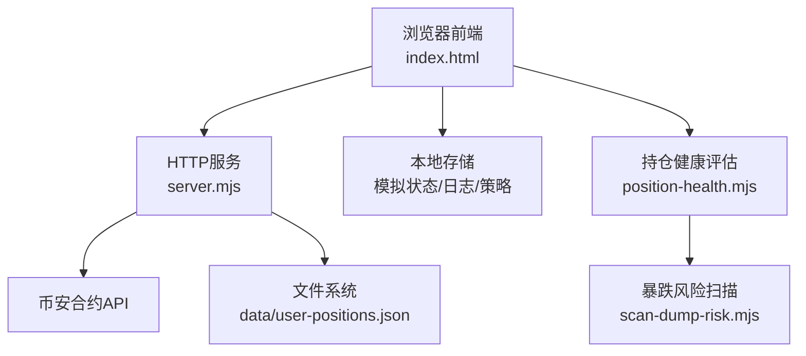
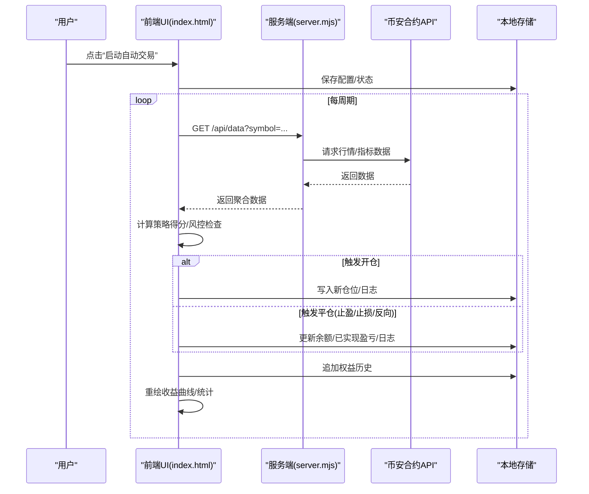
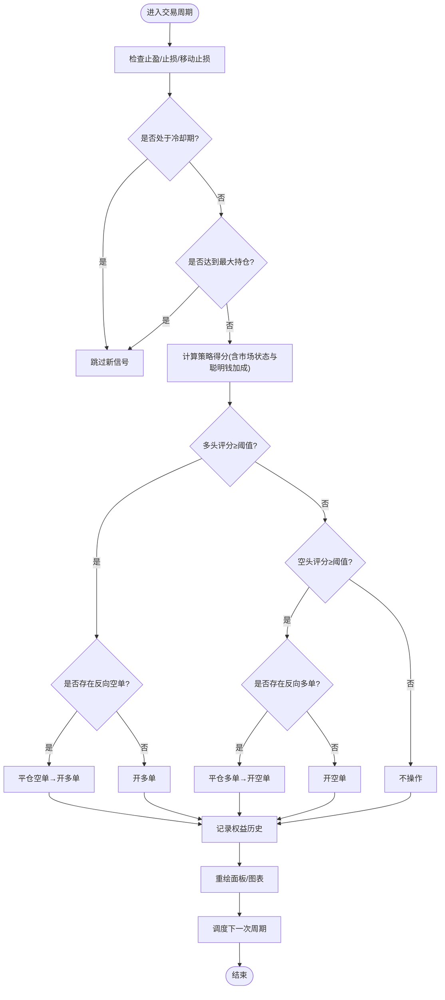
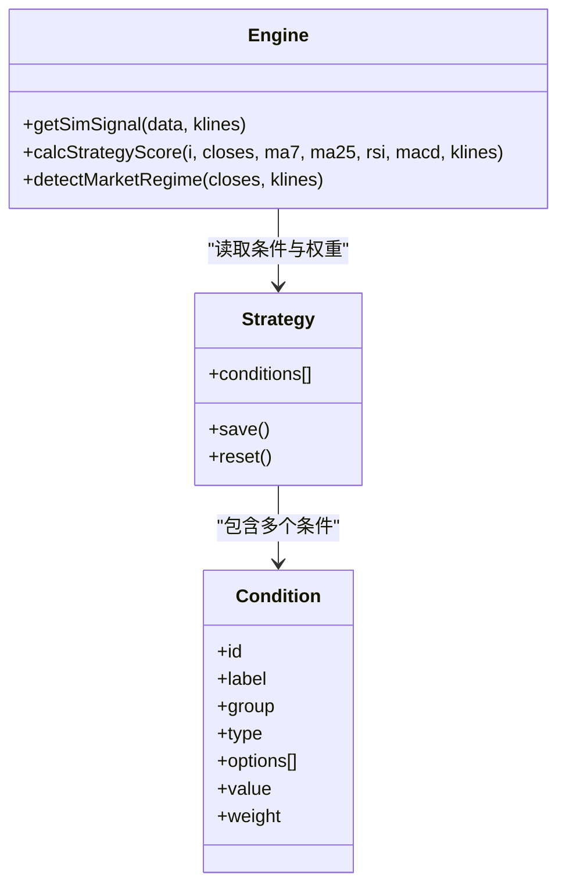
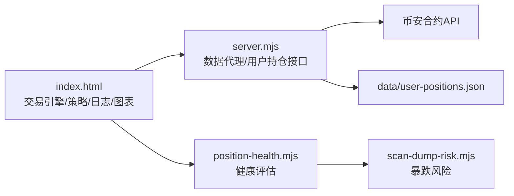

# 模拟自动交易

<cite>
**本文引用的文件**   
- [index.html](file://index.html)
- [server.mjs](file://server.mjs)
- [user-positions.mjs](file://user-positions.mjs)
- [position-health.mjs](file://position-health.mjs)
- [scan-dump-risk.mjs](file://scan-dump-risk.mjs)
</cite>

## 目录
1. [简介](#简介)
2. [项目结构](#项目结构)
3. [核心组件](#核心组件)
4. [架构总览](#架构总览)
5. [详细组件分析](#详细组件分析)
6. [依赖关系分析](#依赖关系分析)
7. [性能与扩展性](#性能与扩展性)
8. [故障排查指南](#故障排查指南)
9. [结论](#结论)
10. [附录：配置项与API参考](#附录配置项与api参考)

## 简介
本文件面向“模拟自动交易系统”的使用者与二次开发者，围绕以下目标展开：
- 模拟交易面板的配置界面：初始资金、杠杆倍数、风险参数（止损/止盈/冷却等）
- 交易引擎运行机制：信号触发、订单执行、仓位管理自动化流程
- 交易日志系统：记录开仓、平仓、止盈止损等操作
- 收益曲线图表：实时账户权益变化与盈亏统计
- 策略集成方法：如何接入自定义策略并参与回测
- 风险控制功能：最大持仓限制、反向信号切换、移动止损等保护机制

## 项目结构
与模拟自动交易直接相关的代码主要位于前端页面与服务端模块中：
- 前端交互与引擎逻辑集中在 index.html（包含 UI、状态机、日志、图表绘制、策略评分与回测）
- 服务端提供数据代理与用户持仓接口，供健康检查与外部系统集成使用
- 用户持仓持久化由 user-positions.mjs 负责
- 持仓健康评估与风控建议由 position-health.mjs 实现
- 暴跌风险扫描用于辅助风控判断，见 scan-dump-risk.mjs

图示来源
- [index.html:4792-5916](file://index.html#L4792-L5916)
- [server.mjs:1490-1599](file://server.mjs#L1490-L1599)
- [user-positions.mjs:1-64](file://user-positions.mjs#L1-L64)
- [position-health.mjs:32-71](file://position-health.mjs#L32-L71)
- [scan-dump-risk.mjs:32-150](file://scan-dump-risk.mjs#L32-L150)

章节来源
- [index.html:4792-5916](file://index.html#L4792-L5916)
- [server.mjs:1490-1599](file://server.mjs#L1490-L1599)
- [user-positions.mjs:1-64](file://user-positions.mjs#L1-L64)
- [position-health.mjs:32-71](file://position-health.mjs#L32-L71)
- [scan-dump-risk.mjs:32-150](file://scan-dump-risk.mjs#L32-L150)

## 核心组件
- 模拟交易面板配置区
  - 初始资金、杠杆倍数、单笔仓位比例、最大持仓数、信号阈值、止损/止盈百分比、冷却时间、监控币种列表、飞书通知开关
- 交易引擎循环
  - 批次轮询监控标的、计算策略得分、执行开/平仓、更新权益历史、渲染图表
- 交易日志系统
  - 开仓、平仓、止盈、止损、手动操作、系统事件均落盘到本地日志
- 收益曲线与统计
  - 权益曲线、盈亏分布、各币种统计、方向胜率、平仓原因分布
- 策略管理与集成
  - 条件权重可编辑、内置多因子打分、支持回测与参数优化
- 风险控制
  - 最大持仓限制、冷却期、移动止损、反向信号切换、手动一键平仓

章节来源
- [index.html:4792-5916](file://index.html#L4792-L5916)

## 架构总览
模拟自动交易为纯前端运行模式，通过后端代理访问币安合约数据。整体时序如下：

图示来源
- [index.html:5313-5450](file://index.html#L5313-L5450)
- [server.mjs:1490-1599](file://server.mjs#L1490-L1599)

## 详细组件分析

### 模拟交易面板配置界面
- 初始资金设置：以 USDT 为单位，影响保证金分配与权益基准线
- 杠杆倍数：决定名义头寸规模（保证金×杠杆/价格=数量）
- 风险参数
  - 单笔仓位占余额百分比
  - 最大持仓数（全局）
  - 信号阈值（评分≥才允许开仓）
  - 止损/止盈百分比（按入场价计算）
  - 冷却时间（分钟），避免频繁交易
  - 监控币种列表（逗号分隔，留空则仅监控当前币种）
  - 飞书通知开关（可选）
- 快捷操作
  - TopN 快速填充监控列表
  - 全部平仓、重置数据

章节来源
- [index.html:4902-4946](file://index.html#L4902-L4946)
- [index.html:5160-5184](file://index.html#L5160-L5184)

### 交易引擎运行机制
- 批次处理：每次仅处理 SIM_BATCH_SIZE 个币种，降低请求压力
- 先处理现有仓位的止盈/止损与移动止损，再评估新信号
- 冷却期检查：距离上次信号的时间不足则跳过
- 最大持仓限制：达到上限不再新开仓
- 策略评分：基于均线交叉、趋势、RSI、MACD、聪明钱与资金费率等因子加权；趋势市对同向信号加分、反向信号降权
- 开仓逻辑：当多头或空头评分超过阈值且无同向持仓时开仓；若存在反向持仓则先平仓再开仓
- 权益记录：每周期将（余额+未实现盈亏）写入权益历史，限制长度
- 调度策略：根据监控币种数量动态调整下次执行间隔

图示来源
- [index.html:5313-5450](file://index.html#L5313-L5450)
- [index.html:5512-5579](file://index.html#L5512-L5579)

章节来源
- [index.html:5313-5450](file://index.html#L5313-L5450)
- [index.html:5512-5579](file://index.html#L5512-L5579)

### 交易日志系统
- 日志类型：开仓(open)、平仓(close)、止盈(tp)、止损(sl)、手动(manual)、系统(system)
- 内容字段：时间、动作、消息详情（价格、数量、保证金、SL/TP、PnL、原因）
- 展示方式：按时间倒序滚动显示，不同动作以颜色区分
- 持久化：保存在本地存储，便于刷新后恢复查看

章节来源
- [index.html:5587-5605](file://index.html#L5587-L5605)
- [index.html:5231-5289](file://index.html#L5231-L5289)

### 收益曲线与统计
- 权益曲线：横轴为时间，纵轴为账户权益；叠加初始资金虚线作为基准
- 盈亏分布：直方图展示已实现盈亏的分布区间
- 统计面板
  - 已实现盈亏、最大回撤、做多/做空盈亏与胜率
  - 各币种维度：交易笔数、胜率、总盈亏、均笔、最大盈利/亏损、多空占比
  - 平仓原因分布：止盈/止损/手动/反向信号
- 最近交易明细表：时间、币种、方向、开/平仓价、盈亏、原因

章节来源
- [index.html:5607-5877](file://index.html#L5607-L5877)

### 策略集成方法（自定义策略接入）
- 策略编辑器
  - 条件分组：均线交叉、均线趋势、RSI、MACD、布林带、成交量异动、支撑阻力、价格形态、主动买卖量趋势等
  - 每个条件可独立启用/禁用，并设置权重（0~5）
  - 保存后立即应用到推荐与模拟交易评分
- 评分机制
  - 基础分：由各项条件在最新K线处满足与否累加
  - 市场状态自适应：趋势市放大同向信号、抑制反向信号
  - 聪明钱加成：大户持仓比、主动买卖量趋势、资金费率等额外加分
- 回测与参数优化
  - 支持选择币种与时间范围进行历史回测
  - 输出收益曲线、交易明细、夏普比率、胜率等
  - 提供批量权重随机搜索，按总收益/夏普/胜率排序Top组合

图示来源
- [index.html:4187-4262](file://index.html#L4187-L4262)
- [index.html:4716-4788](file://index.html#L4716-L4788)
- [index.html:5512-5579](file://index.html#L5512-L5579)

章节来源
- [index.html:4187-4262](file://index.html#L4187-L4262)
- [index.html:4716-4788](file://index.html#L4716-L4788)
- [index.html:5512-5579](file://index.html#L5512-L5579)

### 风险控制功能
- 最大持仓限制：全局控制同时持有的最大头寸数量
- 冷却期：防止短时间内重复开仓
- 移动止损：随价格创新高/新低动态收紧止损，锁定利润
- 反向信号切换：出现强反向信号时先平掉反向持仓再开新仓
- 手动干预：一键全部平仓、逐仓手动平仓
- 健康检查联动：结合暴跌风险与聪明钱信号，辅助决策（非自动下单）

章节来源
- [index.html:5394-5414](file://index.html#L5394-L5414)
- [index.html:5416-5442](file://index.html#L5416-L5442)
- [position-health.mjs:32-71](file://position-health.mjs#L32-L71)
- [scan-dump-risk.mjs:32-150](file://scan-dump-risk.mjs#L32-L150)

## 依赖关系分析
- 前端依赖
  - 本地存储：保存模拟状态、日志、策略配置
  - 后端接口：获取行情、K线、市值、用户持仓等
- 后端依赖
  - 币安合约REST API：价格、24h行情、持仓量、资金费率、聪明钱数据等
  - 文件系统：用户持仓JSON持久化
- 模块耦合
  - 前端交易引擎与策略评分高度内聚，便于快速迭代
  - 健康检查与风险扫描作为辅助模块，不直接驱动交易

图示来源
- [index.html:5313-5450](file://index.html#L5313-L5450)
- [server.mjs:1490-1599](file://server.mjs#L1490-L1599)
- [user-positions.mjs:1-64](file://user-positions.mjs#L1-L64)
- [position-health.mjs:32-71](file://position-health.mjs#L32-L71)
- [scan-dump-risk.mjs:32-150](file://scan-dump-risk.mjs#L32-L150)

章节来源
- [index.html:5313-5450](file://index.html#L5313-L5450)
- [server.mjs:1490-1599](file://server.mjs#L1490-L1599)
- [user-positions.mjs:1-64](file://user-positions.mjs#L1-L64)
- [position-health.mjs:32-71](file://position-health.mjs#L32-L71)
- [scan-dump-risk.mjs:32-150](file://scan-dump-risk.mjs#L32-L150)

## 性能与扩展性
- 批次处理：每周期仅处理固定数量的币种，降低并发与网络压力
- 缓存策略：当前币种数据复用 window._lastSmartData，减少重复请求
- 图表渲染：Canvas 原生绘制，按需重绘，避免过度开销
- 可扩展点
  - 新增策略条件：在策略编辑器中添加条件组与权重
  - 扩展风控规则：在交易引擎中加入新的熔断或限额逻辑
  - 接入外部通知：通过飞书Webhook推送关键事件

[本节为通用指导，无需源码引用]

## 故障排查指南
- 无法启动或端口占用
  - 使用重启脚本清理旧进程后再启动
- 数据加载失败
  - 检查网络与代理配置；确认后端能访问币安API
- 模拟交易无动作
  - 检查信号阈值、冷却期、最大持仓限制是否过于严格
  - 确认监控币种列表是否正确
- 日志为空
  - 确认浏览器本地存储未被清理；必要时重置状态后重新运行
- 飞书通知未送达
  - 确认已勾选“飞书通知”，且后端已配置 Webhook

章节来源
- [index.html:5160-5184](file://index.html#L5160-L5184)
- [index.html:5296-5308](file://index.html#L5296-L5308)

## 结论
本模拟自动交易系统在前端实现了完整的策略评分、订单执行、仓位管理与可视化统计闭环。通过可编辑的策略条件与回测工具，用户可以快速验证与优化策略；内置的风控机制（最大持仓、冷却期、移动止损、反向切换）有助于控制风险。配合健康检查与暴跌风险扫描，可为人工决策提供更全面的参考。

[本节为总结，无需源码引用]

## 附录：配置项与API参考

### 模拟交易面板配置项
- 初始资金（USDT）
- 杠杆倍数
- 单笔仓位（%余额）
- 最大持仓数
- 信号阈值（评分≥）
- 止损（%）
- 止盈（%）
- 冷却时间（分钟）
- 监控币种（逗号分隔）
- 飞书通知（开关）

章节来源
- [index.html:4902-4946](file://index.html#L4902-L4946)

### 关键函数与路径
- 启动/停止/重置
  - [startSimTrading:5160-5184](file://index.html#L5160-L5184)
  - [stopSimTrading:5186-5192](file://index.html#L5186-L5192)
  - [resetSimTrading:5194-5211](file://index.html#L5194-L5211)
- 开仓/平仓
  - [openPosition:5257-5289](file://index.html#L5257-L5289)
  - [closePosition:5231-5255](file://index.html#L5231-L5255)
- 交易周期与调度
  - [runSimCycle:5313-5362](file://index.html#L5313-L5362)
  - [scheduleNext:5444-5450](file://index.html#L5444-L5450)
- 策略评分与市场状态
  - [getSimSignal:5512-5579](file://index.html#L5512-L5579)
  - [detectMarketRegime:5464-5510](file://index.html#L5464-L5510)
- 日志与图表
  - [renderSimLogPanel:5587-5605](file://index.html#L5587-L5605)
  - [renderSimEquityPanel:5607-5731](file://index.html#L5607-L5731)
  - [drawSimEquityCurve:5733-5800](file://index.html#L5733-L5800)
  - [drawPnlDistribution:5802-5877](file://index.html#L5802-L5877)

章节来源
- [index.html:5160-5877](file://index.html#L5160-L5877)

### 用户持仓与健康检查
- 用户持仓CRUD
  - [getUserPositions:30-32](file://user-positions.mjs#L30-L32)
  - [addUserPosition:34-55](file://user-positions.mjs#L34-L55)
  - [deleteUserPosition:57-63](file://user-positions.mjs#L57-L63)
- 健康评估与建议
  - [evaluatePositionHealth:56-71](file://position-health.mjs#L56-L71)
  - 行动建议映射（持有/收紧止损/止盈/止损）
    - [action映射:32-41](file://position-health.mjs#L32-L41)
- 暴跌风险评分
  - [checkDumpRisk:32-150](file://scan-dump-risk.mjs#L32-L150)

章节来源
- [user-positions.mjs:1-64](file://user-positions.mjs#L1-L64)
- [position-health.mjs:32-71](file://position-health.mjs#L32-L71)
- [scan-dump-risk.mjs:32-150](file://scan-dump-risk.mjs#L32-L150)