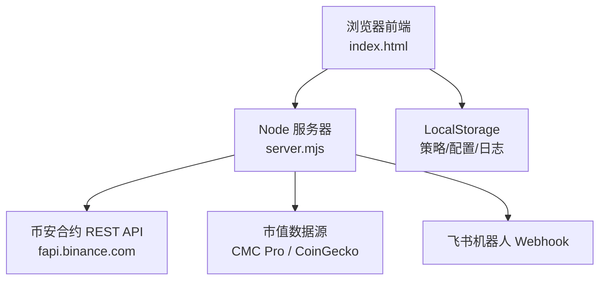
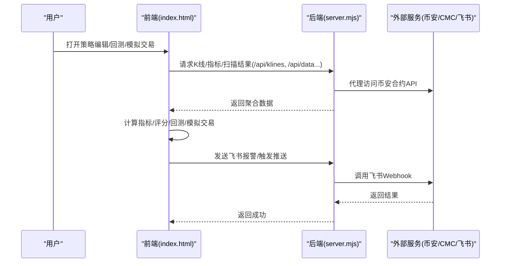
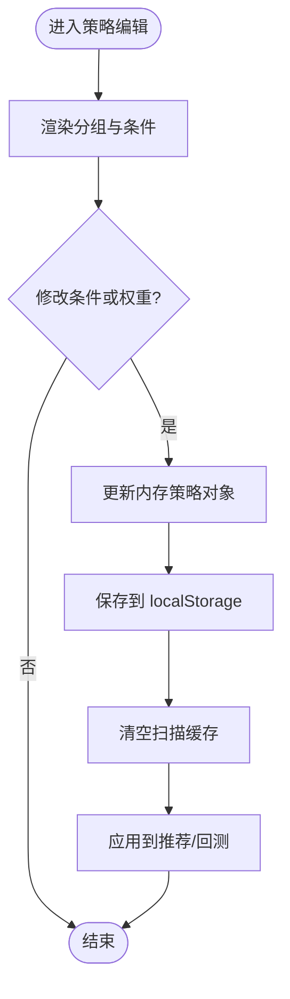
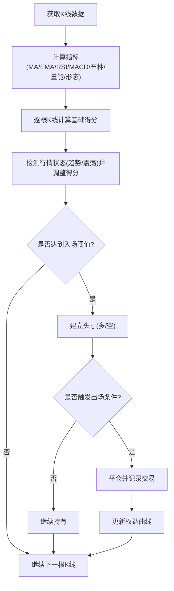
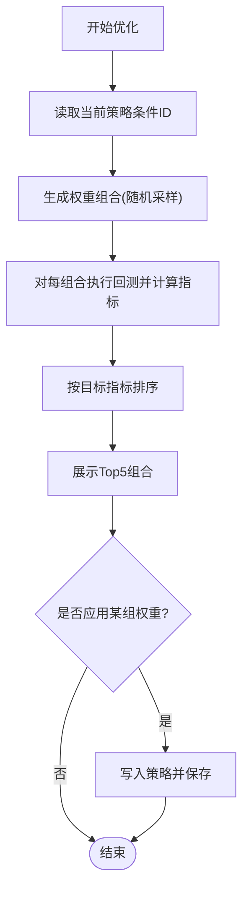
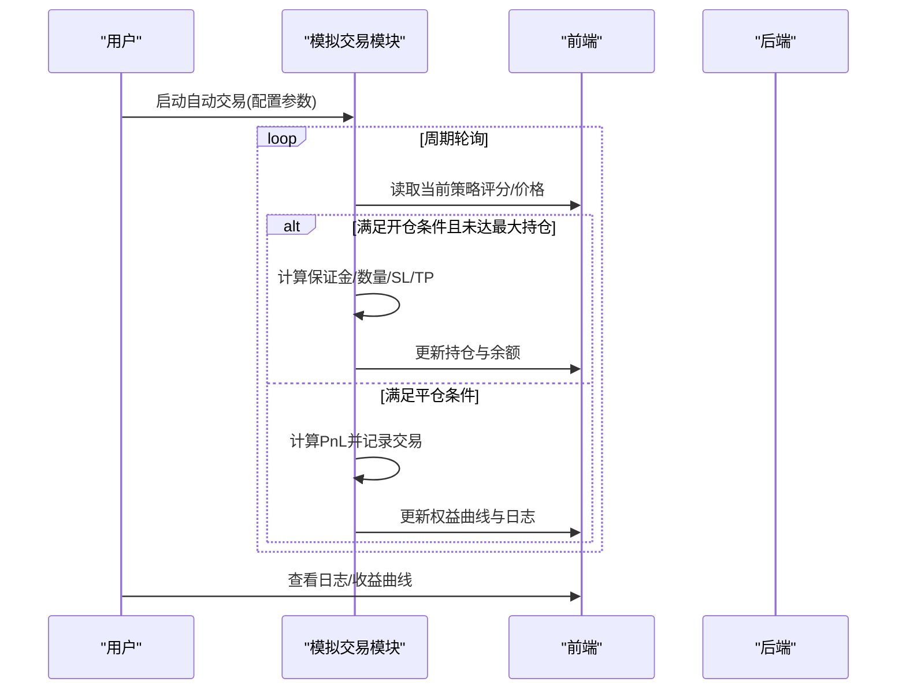
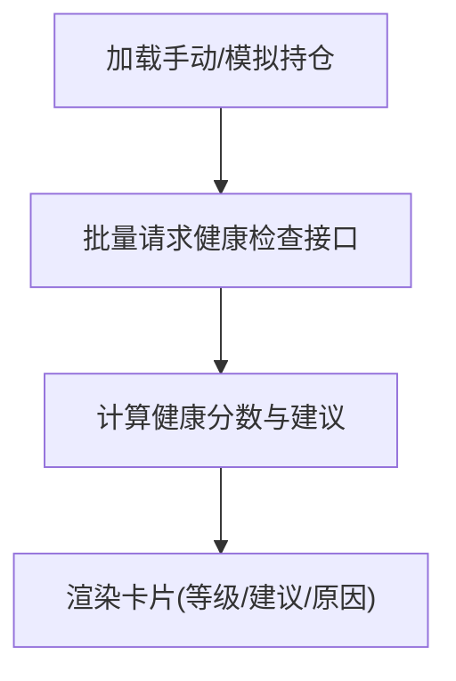
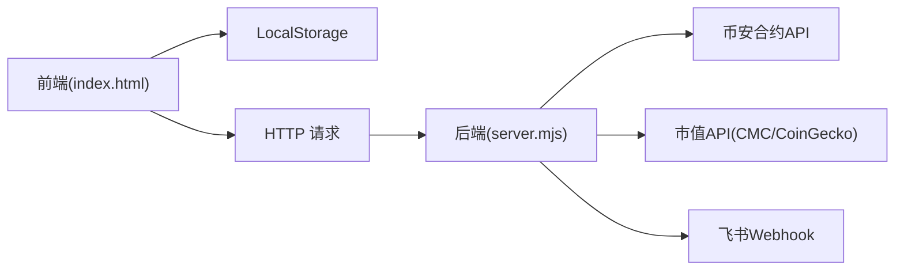

# 策略管理界面

<cite>
**本文引用的文件**
- [index.html](file://index.html)
- [server.mjs](file://server.mjs)
- [README.md](file://README.md)
- [package.json](file://package.json)
</cite>

## 目录
1. [简介](#简介)
2. [项目结构](#项目结构)
3. [核心组件](#核心组件)
4. [架构总览](#架构总览)
5. [详细组件分析](#详细组件分析)
6. [依赖关系分析](#依赖关系分析)
7. [性能考量](#性能考量)
8. [故障排查指南](#故障排查指南)
9. [结论](#结论)
10. [附录](#附录)

## 简介
本文件面向“策略管理界面”的使用与二次开发，覆盖以下能力：
- 可视化策略编辑器：条件组合构建器、权重调整、参数验证机制
- 回测结果展示：收益曲线、交易明细、市场状态（趋势/震荡）统计
- 批量回测与参数优化：多币种对比、随机采样优化（按收益/夏普/胜率）
- 模拟自动交易：开平仓、止损止盈、冷却时间、飞书通知
- 持仓健康检查：手动/模拟持仓统一评估与操作建议
- 模板系统：内置默认策略模板，支持本地保存与恢复
- 团队协作与版本管理：基于浏览器本地存储的轻量方案
- API集成与自动化部署：服务端代理币安合约API、定时推送、PM2/systemd服务化

## 项目结构
前端单页应用通过内嵌HTML/CSS/JS实现策略编辑、回测与模拟交易；后端使用Node.js原生HTTP服务器提供数据代理与扫描任务。

图表来源
- [index.html:4172-4297](file://index.html#L4172-L4297)
- [server.mjs:1490-1500](file://server.mjs#L1490-L1500)

章节来源
- [README.md:190-210](file://README.md#L190-L210)
- [package.json:9-18](file://package.json#L9-L18)

## 核心组件
- 策略编辑器与条件库
  - 内置默认策略模板，包含趋势、震荡、量能、聪明钱、价格结构等分组条件
  - 每个条件可设置动作（做多/做空/忽略）与权重（0~5），实时应用到推荐与回测
- 回测引擎
  - 指标计算：MA/EMA/RSI/MACD/布林带/成交量放大/形态识别/OI变化/资金费率
  - 自适应评分：根据行情状态（趋势/震荡）对多空得分进行加权
  - 输出：胜率、总收益、最大回撤、盈亏比、收益曲线、交易明细
- 批量回测与参数优化
  - 批量回测：输入多个币种，顺序拉取K线并汇总对比
  - 参数优化：对关键条件权重进行随机采样搜索，按目标指标排序Top5
- 模拟自动交易
  - 配置：初始资金、杠杆、仓位比例、最大持仓数、信号阈值、止损止盈、冷却时间、监控列表
  - 运行：周期轮询当前数据，触发开仓/平仓，记录日志与权益曲线
- 持仓健康检查
  - 支持手动添加与模拟持仓合并评估，返回健康等级与建议操作
- 报警与通知
  - 页面内报警规则（价格/RSI/大户/主动买卖量）+ 飞书推送 + 浏览器通知与声音
- 模板系统与本地持久化
  - 策略模板保存在浏览器本地，支持保存/重置/切换标签页即时生效

章节来源
- [index.html:4172-4297](file://index.html#L4172-L4297)
- [index.html:4299-4433](file://index.html#L4299-L4433)
- [index.html:4530-4634](file://index.html#L4530-L4634)
- [index.html:4636-4714](file://index.html#L4636-L4714)
- [index.html:4792-5299](file://index.html#L4792-L5299)
- [index.html:4986-5149](file://index.html#L4986-L5149)
- [index.html:822-938](file://index.html#L822-L938)

## 架构总览
策略管理界面的端到端流程如下：

图表来源
- [index.html:4331-4433](file://index.html#L4331-L4433)
- [server.mjs:1490-1500](file://server.mjs#L1490-L1500)

## 详细组件分析

### 策略编辑器与条件组合构建器
- 功能要点
  - 条件分组：趋势、震荡、量能、聪明钱、价格结构
  - 条件类型：下拉选择（做多/做空/忽略）+ 数值权重（0~5）
  - 实时应用：保存后清空扫描缓存，推荐逻辑立即采用新策略
- 数据结构
  - 策略对象包含名称与条件数组，每条条件含id、label、group、type、options、value、weight
- 交互流程
  - 渲染分组与条件行 → 修改value/weight → 保存到localStorage → 刷新推荐与回测

图表来源
- [index.html:4172-4297](file://index.html#L4172-L4297)

章节来源
- [index.html:4172-4297](file://index.html#L4172-L4297)

### 参数验证机制
- 校验范围
  - 权重取值范围：0~5
  - 条件值必须来自options枚举
  - 回测所需最小K线数：≥50根
- 错误处理
  - 数据不足时提示“数据不足”
  - 网络异常捕获并显示失败原因
- 行为保障
  - 保存后立即清空相关缓存，确保后续扫描/回测使用最新策略

章节来源
- [index.html:4247-4262](file://index.html#L4247-L4262)
- [index.html:4331-4342](file://index.html#L4331-L4342)

### 回测结果展示与指标计算
- 指标与信号
  - MA金叉/死叉、MA趋势排列、EMA快慢交叉、RSI超买超卖、MACD金叉/死叉、布林带突破、放量确认、OI变化、资金费率、支撑阻力、吞没/锤子形态
- 自适应评分
  - 检测近期行情状态（趋势/震荡），在趋势段放大同向得分、抑制反向得分
- 输出指标
  - 交易次数、胜率、总收益、最大回撤、盈亏比
  - 收益曲线（累计PnL）、交易明细表（方向、开平仓时间与价格、收益）
  - 行情分布：趋势占比、趋势段与震荡段分别统计

图表来源
- [index.html:4299-4433](file://index.html#L4299-L4433)

章节来源
- [index.html:4299-4433](file://index.html#L4299-L4433)

### 批量回测与参数优化
- 批量回测
  - 输入多个币种，逐个拉取K线并执行回测，汇总对比（交易数、胜率、总收益、最大回撤、均笔收益）
- 参数优化
  - 针对关键条件权重进行随机采样（最多6个条件×4档权重），迭代固定次数
  - 按目标指标（总收益/夏普/胜率）排序，展示Top5组合，支持一键应用

图表来源
- [index.html:4530-4634](file://index.html#L4530-L4634)

章节来源
- [index.html:4530-4634](file://index.html#L4530-L4634)

### 模拟自动交易
- 配置项
  - 初始资金、杠杆、单笔仓位百分比、最大持仓数、信号阈值、止损/止盈百分比、冷却时间、监控列表、飞书通知开关
- 运行逻辑
  - 启动后周期轮询，依据策略评分决定是否开仓/平仓
  - 开仓：按仓位比例计算保证金与数量，设置SL/TP
  - 平仓：触发止损/止盈、反向信号或手动平仓
  - 记录交易日志与权益曲线，支持导出查看
- 交互面板
  - 交易面板、交易日志、收益曲线三个标签页

图表来源
- [index.html:4792-5299](file://index.html#L4792-L5299)

章节来源
- [index.html:4792-5299](file://index.html#L4792-L5299)

### 持仓健康检查
- 数据来源
  - 手动添加的持仓与模拟交易中的持仓合并评估
- 评估维度
  - 当前价、盈亏百分比、信号有效性、支撑/阻力、趋势状态
- 输出
  - 健康等级（健康/警告/危急）、建议操作、止损/止盈参考位、原因说明

图表来源
- [index.html:4986-5149](file://index.html#L4986-L5149)

章节来源
- [index.html:4986-5149](file://index.html#L4986-L5149)

### 报警系统与通知
- 报警条件
  - 价格突破/跌破、RSI超买超卖、大户翻多/翻空、主动买入/卖出激增
- 通知渠道
  - 浏览器通知、声音提醒、飞书推送（需配置Webhook）
- 生命周期
  - 新增报警 → 监听数据更新 → 触发标记 → 弹窗/推送 → 清除触发状态

章节来源
- [index.html:822-938](file://index.html#L822-L938)
- [server.mjs:1490-1500](file://server.mjs#L1490-L1500)

### 策略模板系统、预设条件库与自定义接口
- 模板系统
  - 内置默认策略模板，支持保存为本地用户策略，随时恢复默认
- 预设条件库
  - 覆盖趋势、震荡、量能、聪明钱、价格结构等多维因子
- 自定义扩展点
  - 在前端增加新的条件项（id/label/group/type/options/value/weight），并在评分函数中实现对应逻辑
  - 在回测与推荐逻辑中接入新条件的权重与判定

章节来源
- [index.html:4172-4297](file://index.html#L4172-L4297)
- [index.html:4299-4433](file://index.html#L4299-L4433)

### 策略版本管理、导入导出与团队协作
- 版本管理
  - 基于浏览器LocalStorage的本地版本控制（保存/重置）
- 导入导出
  - 可将当前策略JSON导出到本地文件，再在其他设备导入（由用户自行实现读写）
- 团队协作
  - 建议将策略JSON纳入团队共享文档或代码仓库，配合变更说明进行协作

章节来源
- [index.html:4247-4262](file://index.html#L4247-L4262)

### 策略API集成与自动化部署
- API集成
  - 前端通过/api/klines、/api/data等接口获取数据；/api/feishu-alert用于报警推送
- 自动化部署
  - 使用pm2或systemd作为服务管理器，开机自启、日志查看、重启命令
  - 环境变量配置端口、飞书Webhook、市值API Key、扫描频率等

章节来源
- [README.md:190-210](file://README.md#L190-L210)
- [package.json:9-18](file://package.json#L9-L18)

## 依赖关系分析
- 前端依赖
  - 浏览器LocalStorage（策略/配置/日志）
  - Canvas绘图（K线、指标、收益曲线）
  - Fetch API（与服务端通信）
- 后端依赖
  - Node.js原生HTTP服务器
  - 币安合约REST API（fapi.binance.com）
  - 市值数据源（CMC Pro优先，回退CoinGecko）
  - 飞书机器人Webhook（可选）

图表来源
- [index.html:4172-4297](file://index.html#L4172-L4297)
- [server.mjs:1490-1500](file://server.mjs#L1490-L1500)

章节来源
- [README.md:200-210](file://README.md#L200-L210)

## 性能考量
- 指标计算与回测
  - 使用滑动窗口与增量计算减少重复运算
  - 自适应评分缓存行情状态，避免频繁重算
- 并发与限流
  - 批量扫描使用并发控制，限制同时请求数
  - 飞书推送具备频控保护与重试机制
- 缓存策略
  - 市值数据TTL缓存，减少外部API调用
  - 扫描结果短期缓存，降低重复计算

[本节为通用指导，不直接分析具体文件]

## 故障排查指南
- 常见问题
  - 端口占用：使用dev:restart脚本自动清理旧进程
  - 飞书推送失败：检查Webhook配置与频控错误信息
  - 市值查询失败：未配置CMC Key时回退CoinGecko，可能受限速影响
- 定位方法
  - 查看服务日志（systemd/pm2）
  - 浏览器控制台网络面板查看API响应
  - 检查.env环境变量是否正确加载

章节来源
- [README.md:40-78](file://README.md#L40-L78)
- [server.mjs:1490-1500](file://server.mjs#L1490-L1500)

## 结论
策略管理界面以可视化方式实现了从策略编辑、回测验证到模拟交易的完整闭环，并通过报警与推送形成闭环反馈。借助本地持久化与轻量模板系统，用户可在无复杂后端的情况下快速迭代策略。结合后端代理与定时任务，可实现稳定的自动化部署与团队协作。

[本节为总结性内容，不直接分析具体文件]

## 附录
- 环境配置示例
  - PORT、FEISHU_WEBHOOK、CMC_API_KEY、MAX_MARKET_CAP_USD、STABLE_PUSH_HOURS、SMART_TREND_INTERVAL_MIN等
- 常用命令
  - pnpm dev:restart、pnpm start、pm2/logs查看、systemctl --user status/restart/stop

章节来源
- [README.md:142-186](file://README.md#L142-L186)
- [package.json:9-18](file://package.json#L9-L18)