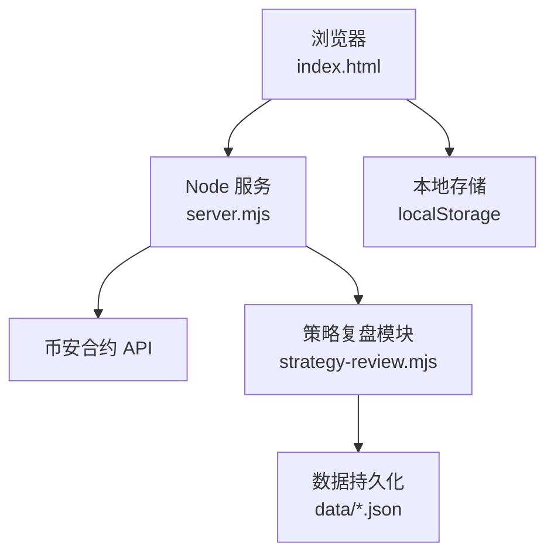
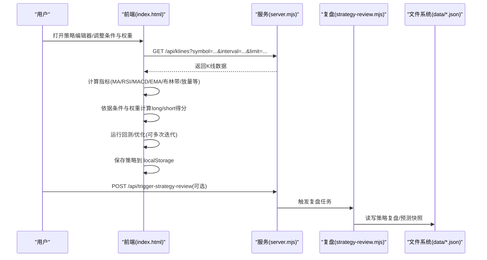
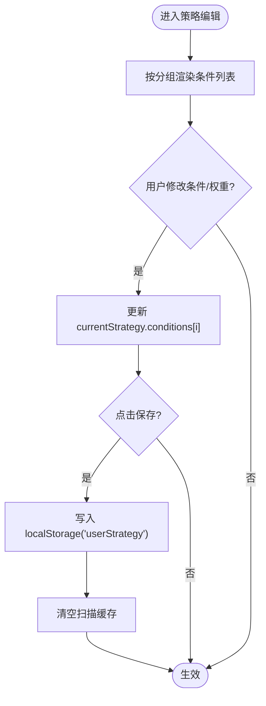
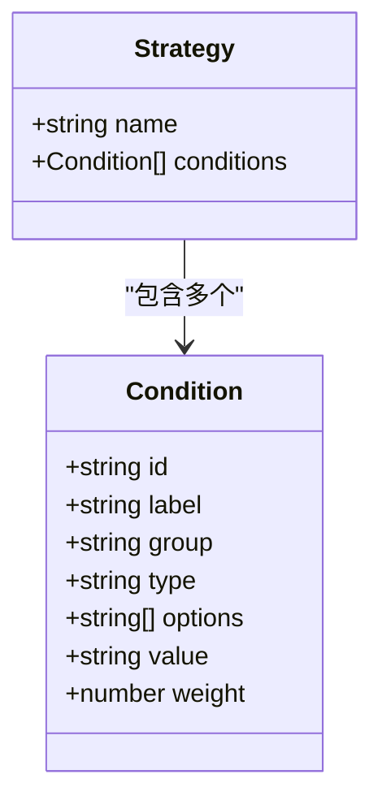
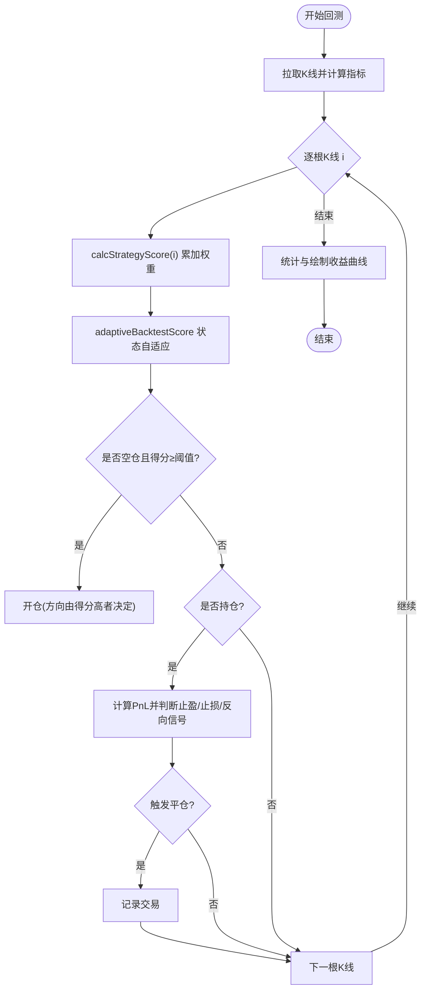
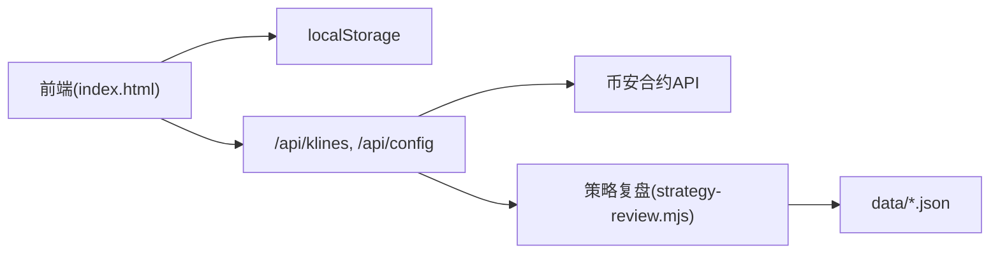

# 策略编辑器

<cite>
**本文引用的文件**   
- [index.html](file://index.html)
- [server.mjs](file://server.mjs)
- [strategy-review.mjs](file://strategy-review.mjs)
</cite>

## 目录
1. [简介](#简介)
2. [项目结构](#项目结构)
3. [核心组件](#核心组件)
4. [架构总览](#架构总览)
5. [详细组件分析](#详细组件分析)
6. [依赖关系分析](#依赖关系分析)
7. [性能考量](#性能考量)
8. [故障排查指南](#故障排查指南)
9. [结论](#结论)
10. [附录](#附录)

## 简介
本文件面向“策略编辑器”的完整使用与开发说明，覆盖以下目标：
- 可视化条件组合构建器：技术指标选择、参数配置与逻辑运算符的使用方式
- 权重调整机制：如何为不同条件设置权重以影响最终评分
- 条件验证规则、语法检查与错误提示
- 策略模板系统与预设条件库的查看和使用
- 自定义策略开发接口（JavaScript扩展点与API调用）
- 策略保存、版本管理与导入导出流程
- 回测与参数优化能力

## 项目结构
本项目采用单页前端 + Node.js 原生 HTTP 服务的方式。策略编辑器的核心实现位于前端页面中，服务端提供数据与辅助接口。

图表来源
- [index.html:4172-4262](file://index.html#L4172-L4262)
- [server.mjs:1584-1652](file://server.mjs#L1584-L1652)
- [strategy-review.mjs:1-36](file://strategy-review.mjs#L1-L36)

章节来源
- [index.html:4172-4262](file://index.html#L4172-L4262)
- [server.mjs:1584-1652](file://server.mjs#L1584-L1652)
- [strategy-review.mjs:1-36](file://strategy-review.mjs#L1-L36)

## 核心组件
- 策略模板与条件库
  - 内置默认策略模板，包含多组指标条件（趋势、震荡、量能、情绪、聪明钱、价格结构等），每个条件具备可选值与权重。
- 可视化条件组合构建器
  - 按分组展示条件，支持选择具体行为（如金叉做多/死叉做空/忽略）并调节权重。
- 评分与信号生成
  - 根据当前K线数据计算各条件得分，结合权重汇总得到多头/空头分数；在回测中引入市场状态自适应放大或抑制。
- 回测与参数优化
  - 支持单币种与批量回测，输出收益曲线、交易明细、胜率、最大回撤等；提供随机采样式权重优化，推荐Top组合并可一键应用。
- 保存与恢复
  - 用户策略保存在本地存储，刷新后自动加载；支持恢复默认策略。

章节来源
- [index.html:4172-4262](file://index.html#L4172-L4262)
- [index.html:4716-4788](file://index.html#L4716-L4788)
- [index.html:4299-4329](file://index.html#L4299-L4329)
- [index.html:4331-4433](file://index.html#L4331-L4433)
- [index.html:4530-4634](file://index.html#L4530-L4634)

## 架构总览
策略编辑器在前端完成全部交互与计算，通过服务端代理获取历史K线与系统配置，策略结果直接影响面板中的推荐与信号。

图表来源
- [index.html:4331-4433](file://index.html#L4331-L4433)
- [index.html:4530-4634](file://index.html#L4530-L4634)
- [server.mjs:1584-1652](file://server.mjs#L1584-L1652)
- [strategy-review.mjs:335-376](file://strategy-review.mjs#L335-L376)

## 详细组件分析

### 可视化条件组合构建器
- 界面组织
  - 将条件按分组渲染，每组内显示条件名称、下拉选项与权重输入框。
- 条件项结构
  - id：唯一标识，用于在评分函数中查找对应条件
  - label：显示名
  - group：分组标签
  - type：控件类型（当前为 select）
  - options：可选值集合（如“金叉做多/死叉做空/忽略”）
  - value：当前选中值
  - weight：权重（0~5整数）
- 交互流程
  - 修改value或weight时更新内存中的currentStrategy对象
  - 点击“保存策略”写入本地存储并清空扫描缓存，使推荐列表立即生效
  - 点击“恢复默认”重置为内置模板

图表来源
- [index.html:4215-4262](file://index.html#L4215-L4262)

章节来源
- [index.html:4172-4262](file://index.html#L4172-L4262)

### 技术指标选择与逻辑运算符
- 支持的指标与条件
  - 趋势类：MA交叉、MA趋势排列、EMA快慢线交叉
  - 震荡类：RSI超买/超卖、MACD交叉、布林带突破
  - 量能类：放量确认、OI持仓量变化
  - 情绪类：资金费率方向
  - 聪明钱类：大户多空比趋势、主动买卖量趋势
  - 价格结构类：支撑/阻力位、吞没/锤子形态
- 逻辑运算符
  - 条件值中包含“做多信号/做空信号/忽略”，在评分函数中以if分支累加权重至long或short
  - 部分条件仅在特定阈值满足时加分（例如RSI>70做空、RSI<30做多）
  - 成交量与价格形态需要比较相邻K线或均值进行判断

图表来源
- [index.html:4172-4191](file://index.html#L4172-L4191)

章节来源
- [index.html:4172-4191](file://index.html#L4172-L4191)
- [index.html:4716-4788](file://index.html#L4716-L4788)

### 权重调整机制与评分算法
- 评分计算
  - 遍历所有条件，若启用且满足条件则将其weight累加到long或short
  - 回测中引入市场状态自适应：趋势行情下对同向信号加权、反向信号削弱
- 入场/出场规则（回测）
  - 当long或short累计得分达到阈值（默认≥3）开仓
  - 固定止盈止损或反向信号触发平仓
- 输出统计
  - 交易次数、胜率、总收益、最大回撤、盈亏比、收益曲线、交易明细

图表来源
- [index.html:4299-4329](file://index.html#L4299-L4329)
- [index.html:4716-4788](file://index.html#L4716-L4788)
- [index.html:4331-4433](file://index.html#L4331-L4433)

章节来源
- [index.html:4299-4329](file://index.html#L4299-L4329)
- [index.html:4716-4788](file://index.html#L4716-L4788)
- [index.html:4331-4433](file://index.html#L4331-L4433)

### 条件验证规则、语法检查与错误提示
- 验证规则
  - 权重范围限制为0~5整数
  - 条件值必须来自options集合
  - 回测需至少一定数量的K线（不足则提示“数据不足”）
- 语法检查
  - 由于条件为结构化JSON而非脚本表达式，不存在自由文本语法问题
- 错误提示
  - 数据不足时直接提示
  - 网络异常或解析失败时捕获并显示错误信息

章节来源
- [index.html:4215-4262](file://index.html#L4215-L4262)
- [index.html:4331-4433](file://index.html#L4331-L4433)

### 策略模板系统与预设条件库
- 默认模板
  - 内置一组覆盖多因子维度的条件，可直接使用或微调
- 预设条件库
  - 通过DEFAULT_STRATEGY定义，包含id、label、group、type、options、value、weight
- 使用方法
  - 打开策略管理面板，查看分组与条件
  - 按需切换value与weight，保存后立即生效

章节来源
- [index.html:4172-4191](file://index.html#L4172-L4191)
- [index.html:4215-4262](file://index.html#L4215-L4262)

### 自定义策略开发接口（JavaScript扩展点与API）
- 扩展点
  - 在calcStrategyScore中新增条件分支，读取currentStrategy.conditions中新增的id，并在UI中渲染对应行
  - 在DEFAULT_STRATEGY中添加新条件条目，确保id唯一、options合理
- 数据API
  - GET /api/klines?symbol=...&interval=...&limit=... 获取K线数据
  - GET /api/config 获取系统配置（如市值上限）
- 建议
  - 保持向后兼容：新增条件不应破坏现有id与渲染逻辑
  - 谨慎处理缺失字段与边界情况（如i小于窗口长度）

章节来源
- [index.html:4716-4788](file://index.html#L4716-L4788)
- [index.html:4172-4191](file://index.html#L4172-L4191)
- [server.mjs:1629-1636](file://server.mjs#L1629-L1636)

### 策略保存、版本管理与导入导出
- 保存
  - 点击“保存策略”将currentStrategy序列化为JSON写入localStorage键'userStrategy'
- 恢复
  - 页面初始化时优先从localStorage读取，否则使用默认模板
  - “恢复默认”会删除用户策略并重新渲染
- 版本管理
  - 当前未实现多版本对比与回滚，仅保留最新一次用户策略
- 导入导出
  - 可通过浏览器开发者工具导出localStorage中的'userStrategy'字符串
  - 也可手动构造JSON并粘贴到控制台执行保存逻辑（不推荐在生产环境使用）

章节来源
- [index.html:4251-4262](file://index.html#L4251-L4262)
- [index.html:4192-4193](file://index.html#L4192-L4193)

### 回测与参数优化
- 单币种回测
  - 选择币种、周期与K线数，运行后输出统计与收益曲线
- 批量回测
  - 支持多币种逗号分隔输入，统一指标与阈值，输出排序后的对比表
- 参数优化
  - 对关键条件的权重进行随机采样搜索，按总收益/夏普/胜率择优，展示Top组合并支持一键应用

章节来源
- [index.html:4331-4433](file://index.html#L4331-L4433)
- [index.html:4530-4634](file://index.html#L4530-L4634)

## 依赖关系分析
- 前端依赖
  - 本地存储：localStorage
  - 指标计算：MA/EMA/RSI/MACD/布林带/放量/形态识别等
- 后端依赖
  - 币安合约REST API（通过服务代理）
  - 策略复盘模块（可选）：定时任务与数据持久化

图表来源
- [index.html:4172-4262](file://index.html#L4172-L4262)
- [server.mjs:1584-1652](file://server.mjs#L1584-L1652)
- [strategy-review.mjs:1-36](file://strategy-review.mjs#L1-L36)

章节来源
- [index.html:4172-4262](file://index.html#L4172-L4262)
- [server.mjs:1584-1652](file://server.mjs#L1584-L1652)
- [strategy-review.mjs:1-36](file://strategy-review.mjs#L1-L36)

## 性能考量
- 指标计算复杂度
  - MA/EMA/RSI/MACD均为线性时间O(n)，适合在线计算
- 回测循环
  - 逐根K线遍历，内部条件判断常数级，整体O(n)
- 自适应状态缓存
  - 每若干根K线才重算市场状态，降低重复计算开销
- 批量回测与优化
  - 批量与优化存在多次全量回测，建议控制bars数量与迭代次数

[本节为通用指导，无需源码引用]

## 故障排查指南
- 数据不足
  - 现象：回测提示“数据不足”
  - 原因：请求到的K线少于最小要求
  - 处理：增大limit或缩短区间
- 网络异常
  - 现象：K线或配置请求失败
  - 处理：检查端口与服务是否启动，确认代理可用
- 策略未生效
  - 现象：调整后推荐未变化
  - 处理：确认已点击“保存策略”，必要时刷新页面

章节来源
- [index.html:4331-4433](file://index.html#L4331-L4433)
- [index.html:4251-4262](file://index.html#L4251-L4262)

## 结论
策略编辑器以“可视化条件+权重打分”为核心，提供了从模板使用、条件构建、回测优化到保存应用的完整闭环。其优势在于低门槛、易扩展、即时反馈；建议在新增条件时遵循既有数据结构与命名规范，并结合回测与优化验证效果。

[本节为总结性内容，无需源码引用]

## 附录

### 常用操作清单
- 新建/编辑策略
  - 打开“策略管理”面板 → 选择条件与权重 → 保存
- 回测
  - 切换到“回测”标签 → 选择币种/周期/K线数 → 开始回测
- 批量回测
  - 输入多币种（逗号分隔）→ 批量回测
- 参数优化
  - 选择优化指标（收益/夏普/胜率）→ 开始优化 → 应用Top组合
- 恢复默认
  - 点击“恢复默认”并保存

章节来源
- [index.html:4215-4262](file://index.html#L4215-L4262)
- [index.html:4331-4433](file://index.html#L4331-L4433)
- [index.html:4530-4634](file://index.html#L4530-L4634)