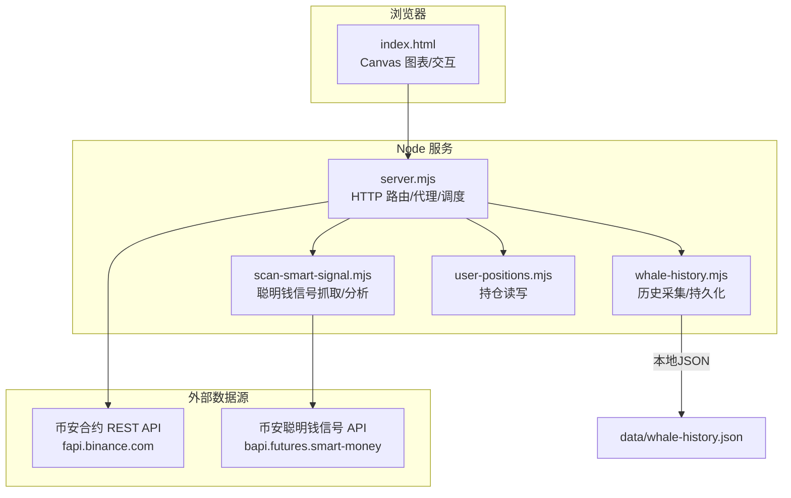
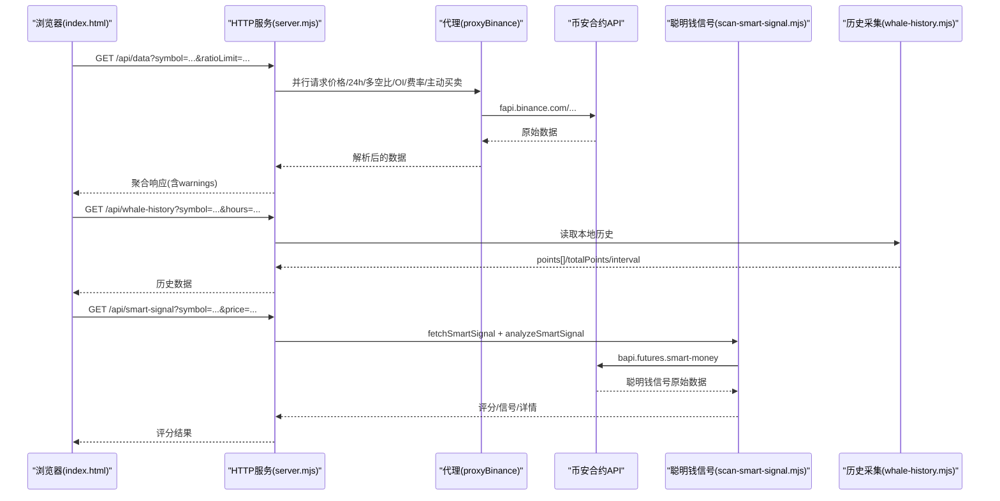
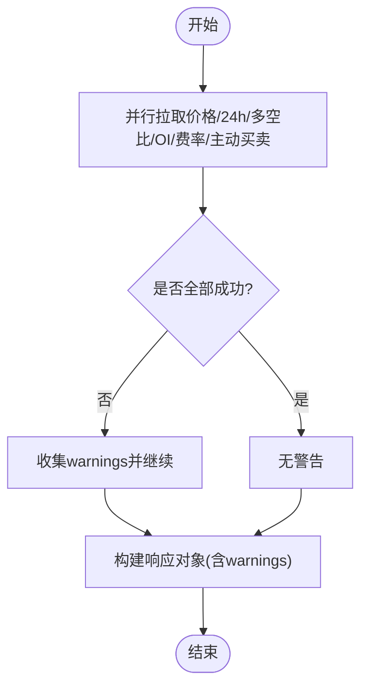
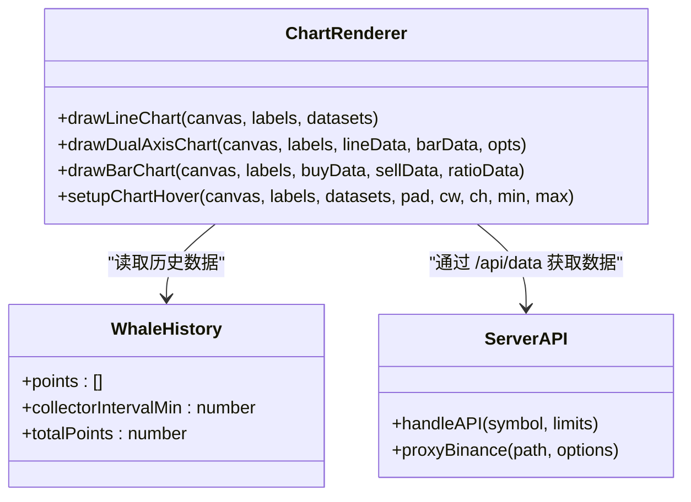
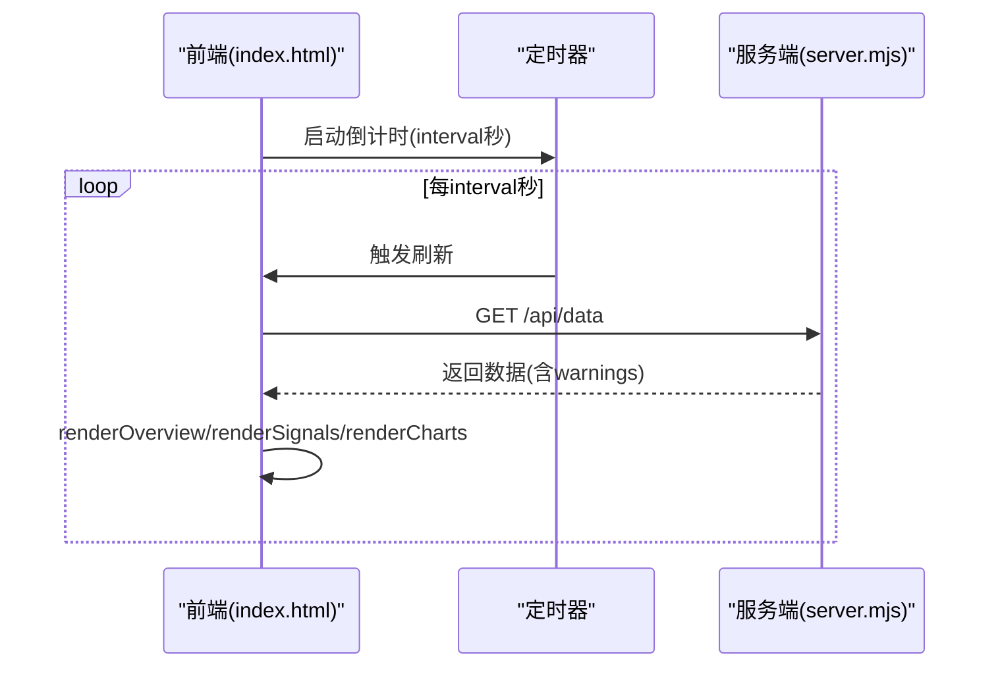
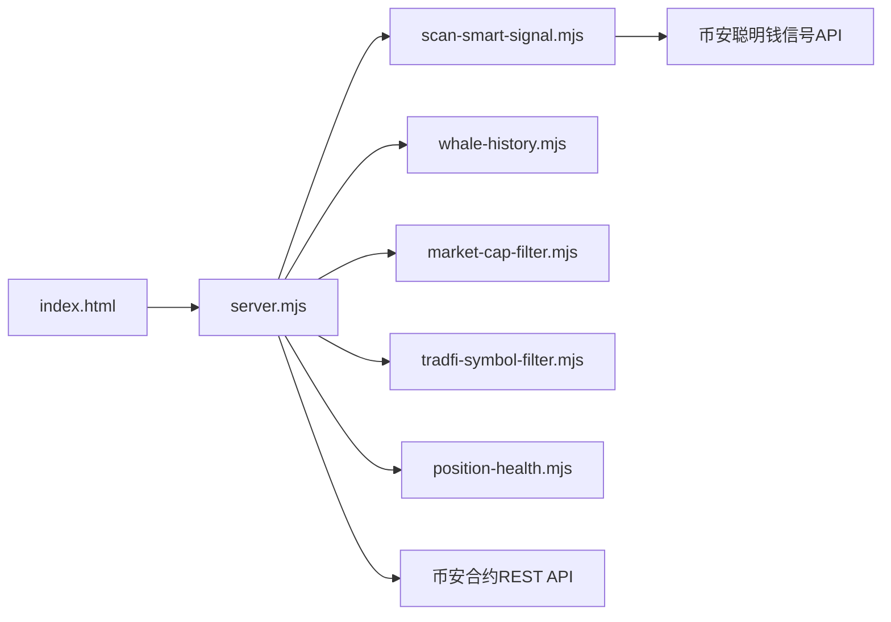

# 大户vs散户多空比率图表

<cite>
**本文引用的文件**
- [README.md](file://README.md)
- [server.mjs](file://server.mjs)
- [index.html](file://index.html)
- [smart-money.mjs](file://smart-money.mjs)
- [scan-smart-signal.mjs](file://scan-smart-signal.mjs)
- [whale-history.mjs](file://whale-history.mjs)
- [user-positions.mjs](file://user-positions.mjs)
- [data/smart-trend-push-mock.json](file://data/smart-trend-push-mock.json)
- [data/user-positions.json](file://data/user-positions.json)
</cite>

## 目录
1. [简介](#简介)
2. [项目结构](#项目结构)
3. [核心组件](#核心组件)
4. [架构总览](#架构总览)
5. [详细组件分析](#详细组件分析)
6. [依赖关系分析](#依赖关系分析)
7. [性能与实时性](#性能与实时性)
8. [故障排查指南](#故障排查指南)
9. [结论](#结论)
10. [附录：扩展与自定义维度集成指南](#附录扩展与自定义维度集成指南)

## 简介
本文件围绕“大户 vs 散户多空比率图表”的完整实现进行系统化说明，覆盖以下方面：
- 多空比率的计算逻辑（账户维度、持仓维度、聪明钱信号）
- 数据获取与处理流程（币安合约 API、代理与缓存、历史采集）
- 图表渲染算法（折线、双轴、柱状、资金费率、鲸鱼趋势）
- 实时更新机制（前端轮询、倒计时刷新、后端并发与重试）
- 聪明钱信号评分系统与置信度展示
- 历史数据分析、趋势对比与异常检测思路
- 自定义分析维度与扩展指标的集成方法

## 项目结构
本项目为 Node.js 原生 HTTP 服务 + 单页 HTML 面板。核心职责划分如下：
- server.mjs：HTTP 路由、代理币安接口、批量聚合、定时任务、推送等
- index.html：前端页面、Canvas 图表绘制、交互与刷新控制
- smart-money.mjs：终端版监控脚本（命令行），用于快速查看关键指标
- scan-smart-signal.mjs：聪明钱信号抓取与分析（含限流熔断、curl 回退）
- whale-history.mjs：鲸鱼 Smart Signal 历史采集与本地持久化
- user-positions.mjs：用户持仓记录读写（辅助功能）
- data/*：示例/模拟数据与本地持久化文件

图示来源
- [server.mjs:1-120](file://server.mjs#L1-L120)
- [index.html:1050-1249](file://index.html#L1050-L1249)
- [scan-smart-signal.mjs:1-84](file://scan-smart-signal.mjs#L1-L84)
- [whale-history.mjs:1-142](file://whale-history.mjs#L1-L142)

章节来源
- [README.md:1-210](file://README.md#L1-L210)
- [server.mjs:1-120](file://server.mjs#L1-L120)
- [index.html:1050-1249](file://index.html#L1050-L1249)

## 核心组件
- 数据层
  - 币安合约数据：价格、24h行情、持仓量(OI)、资金费率、主动买卖量、Top 20% 账户/持仓多空比、全网多空比
  - 聪明钱信号：高收益交易员+鲸鱼聚合的多空比、盈利交易者数量、鲸鱼仓位规模与均价
  - 历史数据：鲸鱼 Smart Signal 采样点（本地 JSON）
- 服务层
  - 统一代理与重试、并发去重、TTL 缓存
  - 批量聚合（市值、8am基线、资金费率等）
  - 定时扫描与推送（稳趋势、智能趋势、位置健康等）
- 前端层
  - Canvas 多图表渲染（折线、双轴、柱状、资金费率、鲸鱼趋势）
  - 鼠标悬浮提示、时间周期切换、自动刷新倒计时
- 策略与信号
  - 聪明钱信号评分系统（方向判定、优势强度、盈利方、鲸鱼仓位、价格相对均价）
  - 8am 基线对比与分档计分（趋势跟踪）

章节来源
- [server.mjs:508-538](file://server.mjs#L508-L538)
- [scan-smart-signal.mjs:86-167](file://scan-smart-signal.mjs#L86-L167)
- [whale-history.mjs:47-106](file://whale-history.mjs#L47-L106)
- [index.html:2095-2249](file://index.html#L2095-L2249)

## 架构总览
下图展示了从前端到后端的请求链路、数据聚合与图表渲染的关键路径。

图示来源
- [server.mjs:508-538](file://server.mjs#L508-L538)
- [server.mjs:58-76](file://server.mjs#L58-L76)
- [scan-smart-signal.mjs:76-84](file://scan-smart-signal.mjs#L76-L84)
- [whale-history.mjs:92-106](file://whale-history.mjs#L92-L106)

## 详细组件分析

### 1) 多空比率计算逻辑
- 账户维度多空比（Top 20% 账户）
  - 数据来源：futures/data/topLongShortAccountRatio
  - 字段：longAccount、shortAccount、longShortRatio
  - 含义：头部账户多头占比 vs 空头占比比值
- 持仓维度多空比（Top 20% 持仓）
  - 数据来源：futures/data/topLongShortPositionRatio
  - 字段同上
  - 含义：头部持仓多头占比 vs 空头占比比值（核心指标）
- 全网多空比
  - 数据来源：futures/data/globalLongShortAccountRatio
  - 含义：全市场账户维度的多空比
- 主动买卖量（5分钟）
  - 数据来源：futures/data/takerlongshortRatio
  - 字段：buyVol、sellVol、buySellRatio
  - 含义：主动买入 vs 主动卖出量及比值
- 聪明钱信号（Smart Signal）
  - 数据来源：bapi/futures/v1/public/future/smart-money/signal/overview
  - 关键字段：longShortRatio、longWhalesQty、shortWhalesQty、longProfitTraders、shortProfitTraders、longWhalesAvgEntryPrice、shortWhalesAvgEntryPrice
  - 评分规则（简化）：
    - 方向得分：净多/净空各+2；若多头优势明显(+1)或空头优势明显(+1)
    - 盈利方比较：盈利多头>空头或反之，分别加分
    - 鲸鱼仓位比较：多头/空头仓位规模对比加分
    - 价格相对鲸鱼均价：现价低于多头均价或高于多头均价给出提示
  - 输出：direction、score、signals、detail、isLong/isShort、longAvg/shortAvg 等

章节来源
- [server.mjs:508-538](file://server.mjs#L508-L538)
- [smart-money.mjs:39-134](file://smart-money.mjs#L39-L134)
- [scan-smart-signal.mjs:86-167](file://scan-smart-signal.mjs#L86-L167)

### 2) 数据获取与处理流程
- 统一代理与重试
  - proxyBinance 封装了超时、错误码校验与指数退避重试
  - ticker/24hr 使用短 TTL 缓存与并发去重，避免重复请求
- 批量聚合
  - 8am 基线价格：按上海时区当日 08:00 开盘价作为基准，计算自 8am 涨跌幅
  - 市值过滤：优先 CMC Pro，失败回退 CoinGecko；可配置上限阈值
  - 资金费率：premiumIndex 与 fundingRate 历史
- 错误处理
  - handleAPI 使用 Promise.allSettled 收集部分失败项并返回 warnings
  - 前端根据 warnings 显示“部分指标加载失败”的黄色提示

图示来源
- [server.mjs:508-538](file://server.mjs#L508-L538)
- [server.mjs:58-76](file://server.mjs#L58-L76)
- [server.mjs:84-105](file://server.mjs#L84-L105)

章节来源
- [server.mjs:58-76](file://server.mjs#L58-L76)
- [server.mjs:84-105](file://server.mjs#L84-L105)
- [server.mjs:508-538](file://server.mjs#L508-L538)

### 3) 图表渲染算法与可视化
- 折线图（drawLineChart）
  - 自适应 Y 轴范围，自动添加 1.0 参考线（当范围包含 1）
  - 支持多数据集叠加，末点圆点标记，图例自动生成
  - 鼠标悬浮 Tooltip 显示时间与各系列数值
- 双轴图（drawDualAxisChart）
  - 主轴线（OI变化率）+ 柱状（OI绝对值）+ 可选第二条线（价格）
  - 左右双轴刻度与颜色区分
- 柱状图（drawBarChart）
  - 买入/卖出量柱状，右侧叠加买卖比折线与基准 1.0 线
- 资金费率图（drawFundingRateChart）
  - 历史资金费率折线，便于观察多头拥挤/空头付费状态
- 鲸鱼趋势图
  - 基于本地历史 points 绘制两条线：鲸鱼仓位多空比、聪明钱净多空比
  - 仅当点数≥2时渲染折线，否则显示提示

图示来源
- [index.html:1089-1168](file://index.html#L1089-L1168)
- [index.html:1193-1321](file://index.html#L1193-L1321)
- [index.html:1418-1514](file://index.html#L1418-L1514)
- [index.html:2095-2249](file://index.html#L2095-L2249)

章节来源
- [index.html:1089-1168](file://index.html#L1089-L1168)
- [index.html:1193-1321](file://index.html#L1193-L1321)
- [index.html:1418-1514](file://index.html#L1418-L1514)
- [index.html:2095-2249](file://index.html#L2095-L2249)

### 4) 实时更新机制
- 前端
  - fetchData 定时调用 /api/data，渲染概览、信号、图表
  - startCountdown 每秒递减，到达间隔后自动刷新
  - 图表 hover 交互、时间周期切换（12h/1d/3d/7d）
- 后端
  - 并发拉取多个接口，Promise.allSettled 容错
  - ticker/24hr 短 TTL 缓存与 inflight 去重
  - 网络就绪等待 waitForNetworkReady 启动重试

图示来源
- [index.html:2267-2313](file://index.html#L2267-L2313)
- [server.mjs:508-538](file://server.mjs#L508-L538)
- [server.mjs:84-105](file://server.mjs#L84-L105)

章节来源
- [index.html:2267-2313](file://index.html#L2267-L2313)
- [server.mjs:508-538](file://server.mjs#L508-L538)
- [server.mjs:84-105](file://server.mjs#L84-L105)

### 5) 聪明钱信号评分系统与置信度展示
- 评分维度
  - 方向与强度：净多/净空基础分 + 优势显著加分
  - 盈利方对比：多头/空头盈利交易者数量对比
  - 鲸鱼仓位对比：多头/空头鲸鱼仓位规模对比
  - 价格相对鲸鱼均价：现价与多头均价偏离提示
- 置信度展示
  - 前端以徽章[B]/[S]、信号列表、平均分/总分直观呈现
  - 结合 8am 基线对比与分档计分（趋势跟踪模块）提供额外置信度线索

章节来源
- [scan-smart-signal.mjs:86-167](file://scan-smart-signal.mjs#L86-L167)
- [index.html:1050-1087](file://index.html#L1050-L1087)

### 6) 历史数据分析、趋势预测与异常检测
- 历史数据采集
  - whale-history 定时抓取 Smart Signal，写入 data/whale-history.json
  - 支持最小记录间隔、最大点数限制、队列保存
- 趋势分析
  - 8am 基线对比：计算当前多空比相对于当日 08:00 的变化百分比
  - 分档计分：按变化幅度分档（≥35%/≥15%/≥5%）累计做多/做空提示次数
- 异常检测（建议）
  - 基于历史序列的均值/标准差或移动窗口极值判断异常波动
  - 对买卖比、OI变化率设置阈值告警（已在前端/推送中体现）

章节来源
- [whale-history.mjs:10-142](file://whale-history.mjs#L10-L142)
- [smart-trend-monitor.mjs:221-305](file://smart-trend-monitor.mjs#L221-L305)

### 7) 用户持仓与健康度（辅助）
- 用户持仓管理
  - 支持新增/删除 USDT 合约持仓，持久化至 data/user-positions.json
- 健康度评估
  - 结合价格、止损止盈、盈亏比等指标评估持仓风险等级（服务侧已集成）

章节来源
- [user-positions.mjs:1-64](file://user-positions.mjs#L1-L64)
- [data/user-positions.json:1-52](file://data/user-positions.json#L1-L52)

## 依赖关系分析
- 模块耦合
  - server.mjs 依赖 scan-smart-signal、whale-history、market-cap-filter、tradfi-symbol-filter、position-health 等
  - index.html 依赖 /api/data、/api/whale-history、/api/smart-signal 三个端点
- 外部依赖
  - 币安合约 REST API（fapi.binance.com）
  - 币安聪明钱信号 API（bapi.futures.smart-money）
  - 可选：CoinMarketCap Pro API（市值数据）

图示来源
- [server.mjs:1-28](file://server.mjs#L1-L28)
- [index.html:2095-2249](file://index.html#L2095-L2249)

章节来源
- [server.mjs:1-28](file://server.mjs#L1-L28)
- [index.html:2095-2249](file://index.html#L2095-L2249)

## 性能与实时性
- 并发与缓存
  - ticker/24hr 短 TTL 缓存 + inflight 去重，减少重复请求
  - pmap 并发映射，批量拉取市值、8am 基线、资金费率等
- 重试与熔断
  - proxyBinance 指数退避重试
  - 聪明钱信号 API 限流熔断（418/429/403）与 curl 回退
- 前端渲染
  - Canvas 直接绘制，避免重型库开销
  - requestAnimationFrame 优化绘制时机
- 建议优化
  - 对热点币种增加短期内存缓存
  - 图表数据按需分页/节流更新
  - 历史数据压缩存储（如二进制或增量合并）

章节来源
- [server.mjs:84-105](file://server.mjs#L84-L105)
- [server.mjs:58-76](file://server.mjs#L58-L76)
- [scan-smart-signal.mjs:28-55](file://scan-smart-signal.mjs#L28-L55)
- [index.html:1089-1168](file://index.html#L1089-L1168)

## 故障排查指南
- 常见问题
  - 端口占用：使用 dev:restart 自动清理旧进程
  - 代理节点异常：检查 .env 代理配置与网络连通性
  - 市值过滤导致无结果：调整 MAX_MARKET_CAP_USD 或关闭过滤
  - 聪明钱信号限流：等待熔断恢复或降低频率
- 定位步骤
  - 查看浏览器控制台与状态条 warnings
  - 检查后端日志（systemd journalctl）
  - 确认 data/whale-history.json 是否存在且格式正确

章节来源
- [README.md:40-53](file://README.md#L40-L53)
- [server.mjs:508-538](file://server.mjs#L508-L538)
- [whale-history.mjs:30-45](file://whale-history.mjs#L30-L45)

## 结论
本项目通过统一的代理服务、灵活的评分体系与轻量高效的 Canvas 图表，实现了“大户 vs 散户多空比率”的实时监控与可视化。配合 8am 基线对比、鲸鱼历史采集与聪明钱信号评分，能够为交易决策提供多维度的参考依据。建议在后续迭代中引入更完善的异常检测与预测模型，并开放更多自定义维度与扩展指标接口。

## 附录：扩展与自定义维度集成指南
- 新增指标接入
  - 在 server.mjs 的 handleAPI 中添加新的并行任务，并在返回对象中补充字段
  - 在前端 renderCharts 中新增对应图表绘制调用
- 自定义筛选与排序
  - 复用 filterEligibleSymbols 与 batchEnrichSmartTrendDigest 模式，扩展市值/TradFi 过滤与上下文增强
- 历史数据扩展
  - 在 whale-history 中扩展采集字段与存储结构，确保最小间隔与最大点数策略一致
- 评分系统扩展
  - 在 analyzeSmartSignal 中增加新维度（如波动率、流动性、订单簿深度等），并调整 score 权重
- 前端交互扩展
  - 在 index.html 中新增图表类型或交互控件，复用 drawLineChart/drawDualAxisChart/drawBarChart 能力

章节来源
- [server.mjs:508-538](file://server.mjs#L508-L538)
- [index.html:2095-2249](file://index.html#L2095-L2249)
- [whale-history.mjs:47-106](file://whale-history.mjs#L47-L106)
- [scan-smart-signal.mjs:86-167](file://scan-smart-signal.mjs#L86-L167)