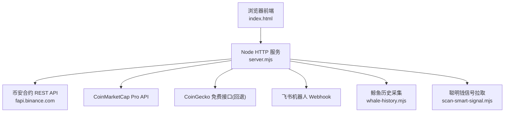
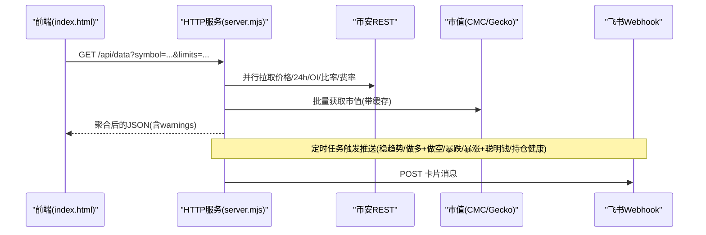
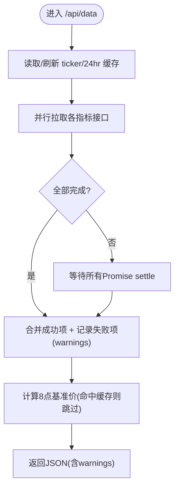
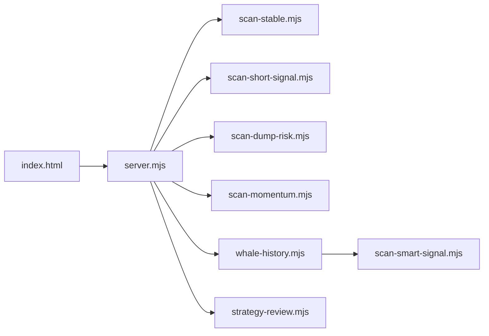
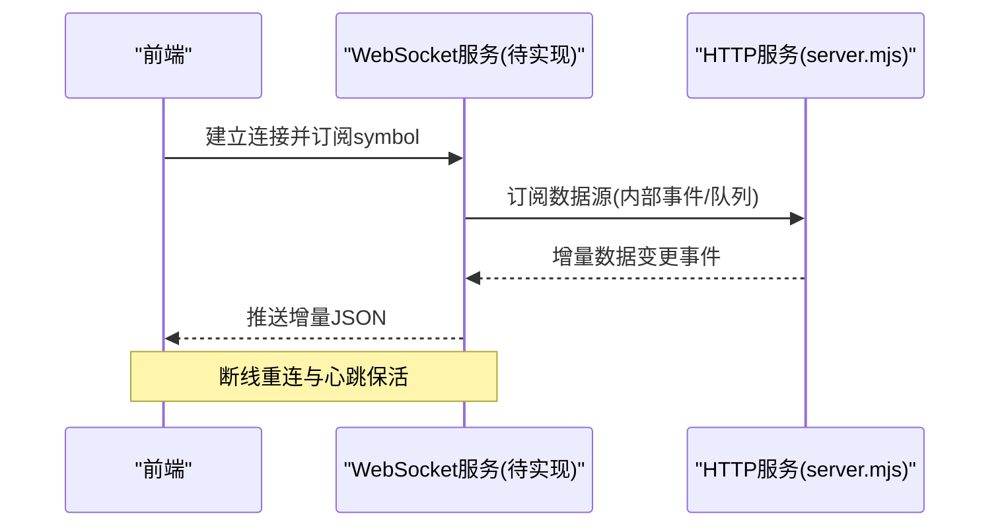

# 实时数据展示系统

<cite>
**本文引用的文件**   
- [server.mjs](file://server.mjs)
- [index.html](file://index.html)
- [package.json](file://package.json)
- [README.md](file://README.md)
- [whale-history.mjs](file://whale-history.mjs)
- [scan-smart-signal.mjs](file://scan-smart-signal.mjs)
</cite>

## 目录
1. [简介](#简介)
2. [项目结构](#项目结构)
3. [核心组件](#核心组件)
4. [架构总览](#架构总览)
5. [详细组件分析](#详细组件分析)
6. [依赖关系分析](#依赖关系分析)
7. [性能与优化](#性能与优化)
8. [故障排查指南](#故障排查指南)
9. [结论](#结论)
10. [附录：API 接口定义与客户端集成](#附录api-接口定义与客户端集成)

## 简介
本系统是一个基于币安合约 REST API 的“聪明钱”监控面板，提供 Web 前端可视化、定时扫描推送（飞书）、策略复盘与鲸鱼历史采集等能力。系统采用 Node.js 原生 HTTP 服务器，零外部依赖，通过 REST 轮询实现“准实时”数据更新；同时内置市值过滤、代理重试、并发去重与多种缓存机制，保障在高并发与限流场景下的稳定性。

说明：
- 当前仓库未实现 WebSocket 长连接；实时性通过前端定时器 + 后端短轮询实现。
- 文档将围绕“WebSocket 连接管理”的目标给出替代方案与迁移建议。

## 项目结构
- 服务端入口与路由：server.mjs
- 前端页面与交互逻辑：index.html
- 鲸鱼历史采集与持久化：whale-history.mjs
- 聪明钱信号拉取与熔断限流：scan-smart-signal.mjs
- 包管理与脚本：package.json
- 使用说明与配置项：README.md

图表来源
- [server.mjs:1490-2117](file://server.mjs#L1490-L2117)
- [index.html:628-900](file://index.html#L628-L900)
- [whale-history.mjs:1-141](file://whale-history.mjs#L1-L141)
- [scan-smart-signal.mjs:41-78](file://scan-smart-signal.mjs#L41-L78)

章节来源
- [server.mjs:1490-2117](file://server.mjs#L1490-L2117)
- [index.html:628-900](file://index.html#L628-L900)
- [package.json:1-22](file://package.json#L1-L22)
- [README.md:1-210](file://README.md#L1-L210)

## 核心组件
- HTTP 路由与业务编排：统一处理 /api/* 请求，聚合多源数据并返回 JSON。
- 数据缓存与并发控制：ticker/24hr 短 TTL 缓存、并发去重、批量市值缓存。
- 定时任务与推送：稳趋势、做多+做空、暴跌预警、暴涨+聪明钱、持仓健康、策略复盘等。
- 鲸鱼历史采集：周期性拉取聪明钱信号并落盘，供前端查询。
- 前端渲染与交互：Canvas 绘制 K 线/RSI/指标图，轮询刷新、报警与本地缓存。

章节来源
- [server.mjs:84-105](file://server.mjs#L84-L105)
- [server.mjs:831-945](file://server.mjs#L831-L945)
- [server.mjs:802-821](file://server.mjs#L802-L821)
- [whale-history.mjs:121-141](file://whale-history.mjs#L121-L141)
- [index.html:2272-2306](file://index.html#L2272-L2306)

## 架构总览
系统采用“前端轮询 + 后端聚合 + 定时任务”的架构模式。前端每 N 秒发起一次 /api/data 请求，服务端并行拉取价格、24h 行情、大户多空比、全网多空比、OI、资金费率等数据，合并后返回。定时任务按配置周期执行扫描与推送，并将结果持久化或发送到飞书。

图表来源
- [server.mjs:1765-1782](file://server.mjs#L1765-L1782)
- [server.mjs:831-945](file://server.mjs#L831-L945)
- [server.mjs:668-781](file://server.mjs#L668-L781)
- [server.mjs:1012-1213](file://server.mjs#L1012-L1213)
- [server.mjs:1298-1336](file://server.mjs#L1298-L1336)
- [server.mjs:1339-1427](file://server.mjs#L1339-L1427)

## 详细组件分析

### 1) 数据聚合与增量更新
- 全量聚合接口 /api/data：并行调用多个币安子接口，使用 Promise.allSettled 收集成功项与错误项，并在响应中附带 warnings 提示部分失败。
- 8点基准价缓存：根据上海时间计算当日 08:00 开盘价作为基准，用于计算“自8点涨幅”，避免重复请求。
- ticker/24hr 短 TTL 缓存与并发去重：同一轮推送内对相同请求进行去重，降低限流风险。

图表来源
- [server.mjs:508-538](file://server.mjs#L508-L538)
- [server.mjs:138-184](file://server.mjs#L138-L184)
- [server.mjs:84-105](file://server.mjs#L84-L105)

章节来源
- [server.mjs:508-538](file://server.mjs#L508-L538)
- [server.mjs:138-184](file://server.mjs#L138-L184)
- [server.mjs:84-105](file://server.mjs#L84-L105)

### 2) 市值过滤与回退策略
- 优先使用 CoinMarketCap Pro API 批量刷新市值缓存，失败时回退到 CoinGecko。
- 支持 MAX_MARKET_CAP_USD 阈值过滤，超过阈值的币种在列表与推送中被剔除。
- 单币种市值查询接口 /api/marketcap 供前端动态校验。

章节来源
- [server.mjs:831-945](file://server.mjs#L831-L945)
- [server.mjs:466-506](file://server.mjs#L466-L506)
- [server.mjs:1736-1748](file://server.mjs#L1736-L1748)

### 3) 定时任务与推送
- 稳趋势推送：扫描右侧稳趋势候选，结合8点基准价、大户/全网多空比、连续推荐次数等生成表格卡片。
- 做多+做空联合推送：合并稳趋势做多与做空信号，输出对比表。
- 暴跌预警推送：筛选高风险标的，持续提醒计数。
- 暴涨+聪明钱推送：基于8点涨幅与聪明钱加仓信号，设置最小间隔防抖。
- 持仓健康推送：评估用户持仓健康度并推送。
- 策略复盘快照：每小时整点采集预测快照，供后续复盘。

章节来源
- [server.mjs:668-781](file://server.mjs#L668-L781)
- [server.mjs:1012-1213](file://server.mjs#L1012-L1213)
- [server.mjs:1215-1296](file://server.mjs#L1215-L1296)
- [server.mjs:1298-1336](file://server.mjs#L1298-L1336)
- [server.mjs:1339-1427](file://server.mjs#L1339-L1427)
- [server.mjs:951-1010](file://server.mjs#L951-L1010)

### 4) 鲸鱼历史采集与本地缓存
- 周期性拉取聪明钱信号，提取关键快照字段写入 data/whale-history.json。
- 支持活跃币种集合注册，按小时窗口查询历史点集。
- 前端通过 /api/whale-history 获取历史点集，用于趋势折线展示。

章节来源
- [whale-history.mjs:1-141](file://whale-history.mjs#L1-L141)
- [server.mjs:1803-1816](file://server.mjs#L1803-L1816)

### 5) 聪明钱信号拉取与熔断限流
- 针对第三方 Smart Signal API 增加熔断器与最小请求间隔，遇到 418/429/403 自动熔断指定时长。
- 失败时回退至 curl 通道，提升可用性。

章节来源
- [scan-smart-signal.mjs:41-78](file://scan-smart-signal.mjs#L41-L78)

### 6) 前端轮询与本地缓存
- 默认每 60s 轮询 /api/data，可配置 30s/2min/5min。
- 右侧扫描结果、稳定趋势结果等在前端内存缓存，TTL 约 5 分钟，减少重复请求。
- 鲸鱼历史数据标注“已本地缓存”，便于用户理解数据来源。

章节来源
- [index.html:2272-2306](file://index.html#L2272-L2306)
- [index.html:3325-3340](file://index.html#L3325-L3340)
- [index.html:3469-3505](file://index.html#L3469-L3505)
- [index.html:2105-2110](file://index.html#L2105-L2110)

## 依赖关系分析
- server.mjs 依赖多个扫描模块（稳趋势、做空、暴跌、聪明钱信号、鲸鱼历史、策略复盘等），并通过环境变量开关功能。
- index.html 仅依赖 /api/* 接口，不直接访问外部交易所 API。
- whale-history.mjs 依赖 scan-smart-signal.mjs 拉取聪明钱信号。

图表来源
- [server.mjs:6-28](file://server.mjs#L6-L28)
- [whale-history.mjs:1-4](file://whale-history.mjs#L1-L4)
- [index.html:628-700](file://index.html#L628-L700)

章节来源
- [server.mjs:6-28](file://server.mjs#L6-L28)
- [whale-history.mjs:1-4](file://whale-history.mjs#L1-L4)
- [index.html:628-700](file://index.html#L628-L700)

## 性能与优化
- 并发与去重
  - ticker/24hr 短 TTL 缓存 + inflight 去重，避免同轮次重复请求。
  - pmap 并发工具函数限制并发度，防止瞬时风暴。
- 缓存策略
  - 市值缓存（CMC/Gecko）TTL 5 分钟，批量查询分块提交。
  - 8点基准价按日期键缓存，跨请求复用。
  - 前端右侧扫描缓存、稳定趋势缓存 TTL 5 分钟。
- 限流与容错
  - 网络就绪探测与指数退避重试。
  - Smart Signal 熔断器与最小请求间隔。
  - 部分接口失败以 warnings 形式返回，不影响整体可用性。
- 渲染优化
  - Canvas 按需绘制，双缓冲叠加层，减少重绘开销。
  - 图表 hover 仅计算可见区间标签。

章节来源
- [server.mjs:84-105](file://server.mjs#L84-L105)
- [server.mjs:150-162](file://server.mjs#L150-L162)
- [server.mjs:831-945](file://server.mjs#L831-L945)
- [server.mjs:107-125](file://server.mjs#L107-L125)
- [scan-smart-signal.mjs:41-78](file://scan-smart-signal.mjs#L41-L78)
- [index.html:3325-3340](file://index.html#L3325-L3340)
- [index.html:3469-3505](file://index.html#L3469-L3505)

## 故障排查指南
- 端口占用
  - 现象：启动报 EADDRINUSE。
  - 解决：使用 dev:restart 自动清理旧进程，或手动 kill 占用端口进程。
- 币安限流/封禁
  - 现象：日志出现“Way too many requests; IP banned... Please use the websocket for live updates”。
  - 原因：高频 REST 轮询触发限流。
  - 解决：降低轮询频率、启用代理节点、考虑迁移到 WebSocket（见下文）。
- 飞书推送失败
  - 现象：POST /api/feishu-alert 返回错误。
  - 检查：是否配置 FEISHU_WEBHOOK，频控/限流信息是否在重试范围内。
- 市值接口不可用
  - 现象：市值显示 N/A。
  - 解决：配置 CMC_API_KEY，或允许回退到 CoinGecko。

章节来源
- [README.md:40-53](file://README.md#L40-L53)
- [logs/service-error.log:212681-212682](file://logs/service-error.log#L212681-L212682)
- [server.mjs:1493-1514](file://server.mjs#L1493-L1514)
- [server.mjs:1736-1748](file://server.mjs#L1736-L1748)

## 结论
本系统在零依赖前提下实现了高可用的“准实时”监控面板，具备完善的缓存、并发、限流与容错机制。尽管未实现 WebSocket，但通过合理的轮询与缓存策略，仍能在大多数场景下满足实时监控需求。若需进一步降低延迟与规避限流，建议引入 WebSocket 长连接与增量推送。

## 附录：API 接口定义与客户端集成

### 接口清单
- GET /api/data?symbol=&ratioLimit=&oiLimit=&takerLimit=
  - 作用：聚合聪明钱全量数据（价格、24h、大户/全网多空比、OI、资金费率等）
  - 返回：包含 price/ticker24h/topPositions/globalRatio/oi/fundingRate 等字段，可能包含 warnings
- GET /api/klines?symbol=&interval=&limit=
  - 作用：K 线数据
- GET /api/marketcap?symbol=
  - 作用：单币种市值（优先 CMC，回退 Geck）
- POST /api/feishu-alert
  - 作用：发送飞书报警卡片
- POST /api/trigger-stable-push
  - 作用：手动触发稳趋势推送
- GET /api/smart-signal?symbol=&price=
  - 作用：聪明钱信号分析与摘要
- GET /api/whale-history?symbol=&hours=
  - 作用：鲸鱼历史采样点（用于趋势折线）
- GET /api/config
  - 作用：应用配置（如市值上限）
- GET /api/user-positions (GET/POST/DELETE)
  - 作用：用户持仓增删改查
- GET /api/position-health?symbol=&direction=&entry=&stopLoss=&takeProfit=
  - 作用：持仓健康评估
- POST /api/position-health/batch
  - 作用：批量评估持仓健康
- GET /api/scan-dump?limit=&minRisk=
  - 作用：暴跌扫描
- GET /api/scan-pump-smart?limit=&minChange=
  - 作用：暴涨+聪明钱扫描
- POST /api/trigger-pump-smart-push
  - 作用：手动触发暴涨+聪明钱推送
- POST /api/trigger-combined-push
  - 作用：手动触发做多+做空联合推送
- POST /api/trigger-position-health-push
  - 作用：手动触发持仓健康推送
- GET /api/smart-trend-watchlist
  - 作用：聪明钱趋势看板
- POST /api/trigger-smart-trend-push
  - 作用：手动触发聪明钱趋势推送
- GET /api/scan-momentum?limit=&minScore=
  - 作用：8点追涨动量扫描
- GET /api/scan-smart-signal?limit=&direction=
  - 作用：聪明钱信号扫描
- GET /api/strategy-review?hours=
  - 作用：策略复盘历史
- GET /api/strategy-predictions?hours=
  - 作用：最新预测快照

章节来源
- [server.mjs:1490-2117](file://server.mjs#L1490-L2117)
- [README.md:190-199](file://README.md#L190-L199)

### 客户端集成指南
- 基础轮询
  - 每 N 秒调用 /api/data，解析 overview/signals/smart-signal 区域并渲染。
  - 根据返回的 warnings 提示部分指标缺失。
- 图表渲染
  - 使用 /api/klines 获取 K 线，自行绘制蜡烛图与 RSI。
  - 使用 /api/whale-history 获取鲸鱼历史点集，绘制趋势折线。
- 报警与通知
  - 本地规则：价格突破/跌破、RSI 超买超卖、大户翻多翻空、买卖激增。
  - 可选：通过 /api/feishu-alert 推送飞书。
- 本地缓存
  - 右侧扫描结果、稳定趋势结果等在前端内存缓存，TTL 约 5 分钟。
  - 鲸鱼历史数据标注“已本地缓存”，便于用户理解数据来源。

章节来源
- [index.html:2272-2306](file://index.html#L2272-L2306)
- [index.html:3325-3340](file://index.html#L3325-L3340)
- [index.html:3469-3505](file://index.html#L3469-L3505)
- [index.html:2105-2110](file://index.html#L2105-L2110)

### WebSocket 连接管理与迁移建议
现状：
- 当前系统未实现 WebSocket；实时性由前端定时器 + 后端短轮询实现。
- 日志中出现因高频 REST 轮询导致的限流/封禁提示。

建议方案：
- 服务端新增 WebSocket 监听（ws:// 或 wss://），维护连接池与订阅主题（如 symbol 维度）。
- 增量推送：仅在指标变化超过阈值时推送差异对象，减少带宽与前端渲染压力。
- 断线重连：前端实现指数退避重连与心跳保活。
- 降级策略：当 WS 不可用时，自动回退到 REST 轮询。

概念流程（示意）：

[此图为概念示意，不对应具体源码]