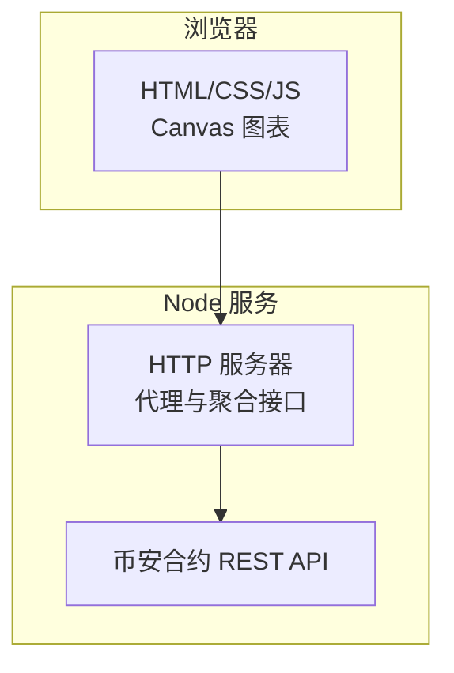
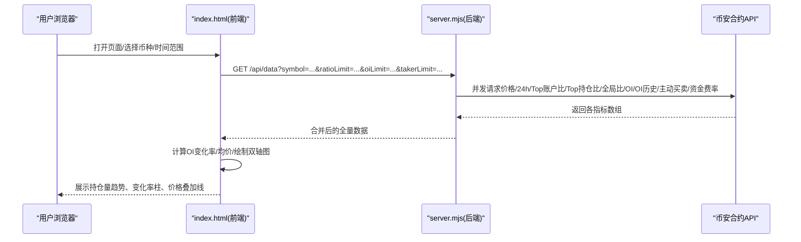
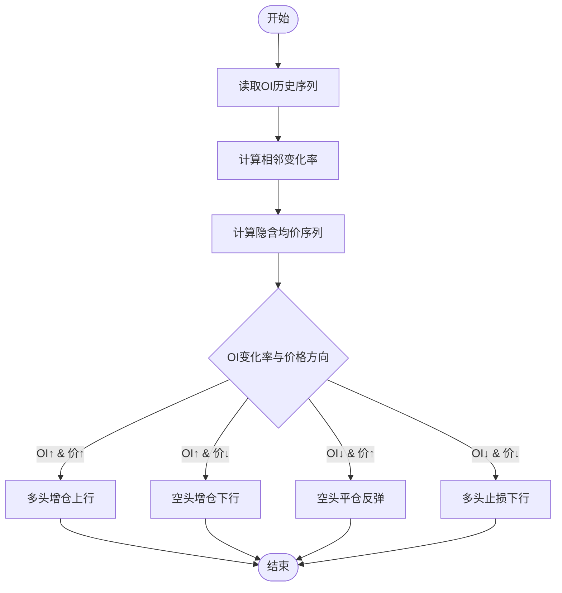
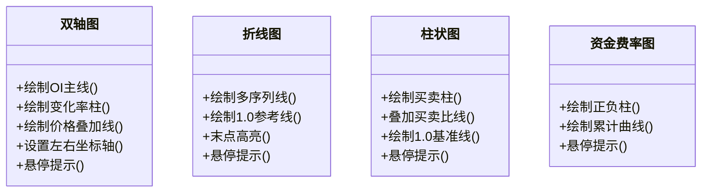
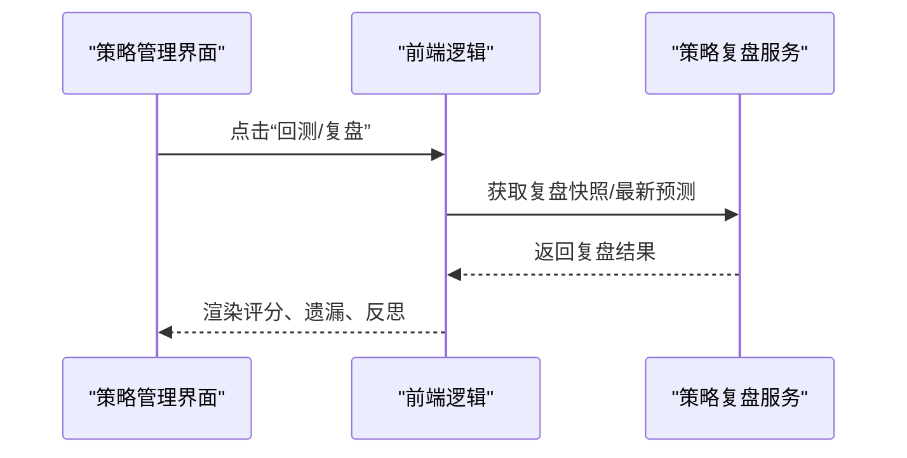
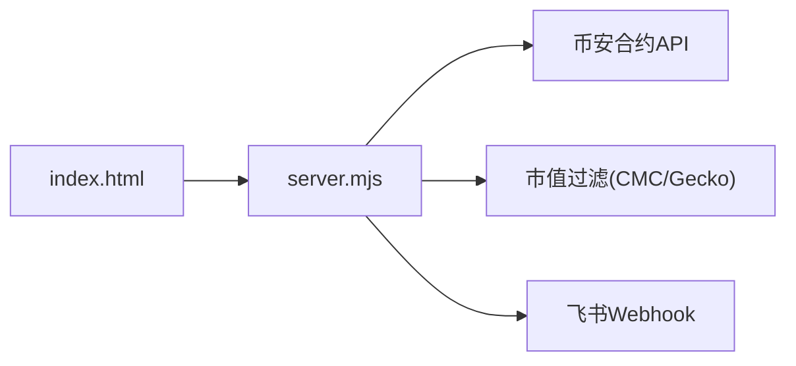

# 持仓变化趋势图

<cite>
**本文引用的文件**   
- [README.md](file://README.md)
- [index.html](file://index.html)
- [server.mjs](file://server.mjs)
- [smart-money.mjs](file://smart-money.mjs)
- [user-positions.mjs](file://user-positions.mjs)
- [data/user-positions.json](file://data/user-positions.json)
- [package.json](file://package.json)
</cite>

## 目录
1. [简介](#简介)
2. [项目结构](#项目结构)
3. [核心组件](#核心组件)
4. [架构总览](#架构总览)
5. [详细组件分析](#详细组件分析)
6. [依赖关系分析](#依赖关系分析)
7. [性能与渲染特性](#性能与渲染特性)
8. [故障排查指南](#故障排查指南)
9. [结论](#结论)
10. [附录：配置与扩展](#附录配置与扩展)

## 简介
本文件围绕“持仓变化趋势图”展开，系统说明持仓量（Open Interest, OI）数据的获取、处理与分析方法，图表渲染技术，以及用户交互功能。重点覆盖：
- 持仓量数据获取与清洗
- 趋势分析方法（含变化率计算、多空分布对比、趋势反转信号识别）
- 多时间框架对比与历史回测/预测能力
- 自定义参数、技术指标叠加与导出建议
- 前端交互（悬停提示、范围切换、多币种监控）

## 项目结构
本项目为基于 Node.js 的 Web 面板 + 终端工具组合，提供币安合约聪明钱监控能力。与持仓变化趋势图直接相关的代码主要位于：
- 服务端：聚合币安合约 API 数据并返回给前端
- 前端：Canvas 绘制 K 线、RSI、大户多空比、OI 双轴图、资金费率、主动买卖量等
- 终端版：命令行输出关键指标，便于快速查看

**图示来源**
- [server.mjs:508-538](file://server.mjs#L508-L538)
- [index.html:2267-2300](file://index.html#L2267-L2300)

**章节来源**
- [README.md:1-210](file://README.md#L1-L210)
- [package.json:1-22](file://package.json#L1-L22)

## 核心组件
- 数据聚合接口：统一拉取价格、24h行情、大户账户/持仓多空比、全网多空比、OI 及历史、主动买卖量、资金费率等
- 前端图表模块：折线图、柱状图、双轴图、K 线与 RSI 叠加、悬停提示
- 策略与信号：大户翻多/翻空、聪明钱抄底信号、资金费率状态、OI 增仓/减仓联动价格方向
- 用户持仓健康：本地持久化持仓记录与健康评估（辅助交易决策）

**章节来源**
- [server.mjs:508-538](file://server.mjs#L508-L538)
- [index.html:2207-2248](file://index.html#L2207-L2248)
- [smart-money.mjs:39-135](file://smart-money.mjs#L39-L135)
- [user-positions.mjs:30-64](file://user-positions.mjs#L30-L64)

## 架构总览
从请求到渲染的关键流程如下：

**图示来源**
- [server.mjs:508-538](file://server.mjs#L508-L538)
- [index.html:2267-2300](file://index.html#L2267-L2300)
- [index.html:2207-2248](file://index.html#L2207-L2248)

## 详细组件分析

### 1) 持仓量数据获取与处理
- 数据来源
  - 当前 OI：fapi/v1/openInterest
  - OI 历史：futures/data/openInterestHist（周期 4h，可配置 limit）
  - 价格参考：fapi/v2/ticker/price 或 ticker/24hr
- 数据处理
  - 将 sumOpenInterestValue 作为 OI 总值序列
  - 计算相邻点变化率：oiChanges[i] = (oiValues[i] - oiValues[i-1]) / oiValues[i-1]
  - 推导隐含均价：oiPrices[i] = sumOpenInterestValue / sumOpenInterest（当分母 > 0）
- 异常与容错
  - 使用 Promise.allSettled 并行拉取，失败项以 warnings 形式返回前端
  - 对缺失字段进行防御性判断，避免 NaN/Infinity

**章节来源**
- [server.mjs:508-538](file://server.mjs#L508-L538)
- [index.html:2207-2248](file://index.html#L2207-L2248)

### 2) 趋势分析方法
- 持仓量变化率
  - 通过相邻 OI 值比值计算百分比变化，用于衡量资金流入/流出强度
- 多空持仓分布
  - 大户持仓多空比（Top 20% 持仓维度）为核心指标
  - 大户 vs 全网多空比（账户维度）对比，观察分歧与一致性
- 趋势反转信号识别
  - OI 增仓 + 价格上涨 → 多头主导延续
  - OI 增仓 + 价格下跌 → 空头主导延续
  - OI 减仓 + 价格上涨 → 空头平仓推动反弹
  - OI 减仓 + 价格下跌 → 多头止损推动下行
  - 结合资金费率：负费率偏高时，空头付费，潜在多头拥挤风险；正费率偏高时，多头付费，潜在空头反扑

**图示来源**
- [index.html:2207-2248](file://index.html#L2207-L2248)
- [pump-smart-alert.mjs:20-54](file://pump-smart-alert.mjs#L20-L54)

**章节来源**
- [index.html:2207-2248](file://index.html#L2207-L2248)
- [pump-smart-alert.mjs:20-54](file://pump-smart-alert.mjs#L20-L54)

### 3) 图表渲染技术
- 双轴图（OI 主图 + 变化率柱 + 可选价格叠加线）
  - 左轴：OI 总值（USDT），支持单位格式化（M/B）
  - 底部柱：OI 变化率（正绿负红），零线分隔
  - 右轴（可选）：价格叠加线，颜色区分
- 折线图（大户持仓多空比、大户 vs 全网多空比）
  - 自动计算 Y 轴范围，包含 1.0 参考线
  - 末点圆点高亮，图例显示多条序列
- 柱状图（主动买卖量）+ 买卖比趋势线
  - 买入/卖出柱并列，右侧叠加买卖比曲线与 1.0 基准线
- 资金费率图
  - 正负费率柱 + 累计费率曲线，直观反映多头/空头成本累积
- 交互
  - 鼠标悬停显示时间与各序列数值
  - 图表范围切换（12H/1D/3D/7D）控制 ratioLimit/oiLimit/takerLimit

**图示来源**
- [index.html:1100-1168](file://index.html#L1100-L1168)
- [index.html:1193-1324](file://index.html#L1193-L1324)
- [index.html:1326-1416](file://index.html#L1326-L1416)
- [index.html:1418-1514](file://index.html#L1418-L1514)

**章节来源**
- [index.html:1100-1168](file://index.html#L1100-L1168)
- [index.html:1193-1324](file://index.html#L1193-L1324)
- [index.html:1326-1416](file://index.html#L1326-L1416)
- [index.html:1418-1514](file://index.html#L1418-L1514)

### 4) 用户交互功能
- 多币种与刷新间隔
  - 顶部输入框支持搜索与下拉选择，URL 参数同步 symbol 与 interval
  - 倒计时自动刷新，错误状态可视化
- 图表范围切换
  - 12H/1D/3D/7D 按钮切换，影响后端请求的 ratioLimit/oiLimit/takerLimit
- 悬停提示
  - 所有图表统一 tooltip，显示时间与多序列数值
- 策略与信号详情
  - 点击筛选结果卡片，弹出评分、信号明细、24h 涨跌、鲸鱼均价等

**章节来源**
- [index.html:628-800](file://index.html#L628-L800)
- [index.html:2267-2300](file://index.html#L2267-L2300)
- [index.html:2903-2915](file://index.html#L2903-L2915)
- [index.html:1170-1191](file://index.html#L1170-L1191)

### 5) 多时间框架对比
- 价格与 RSI 多时间框架
  - 5分钟/1小时/4小时/1天 标签切换，加载对应 klines 与 RSI
- 右侧筛选的时间框架
  - 1H/4H/1D 过滤条件，配合回撤阈值与排序方式
- 图表范围对比
  - 12H/1D/3D/7D 切换，观察不同窗口下的 OI 趋势与变化率

**章节来源**
- [index.html:765-772](file://index.html#L765-L772)
- [index.html:712-735](file://index.html#L712-L735)
- [index.html:757-763](file://index.html#L757-L763)

### 6) 历史趋势回测与预测模型
- 策略复盘
  - 定时快照保存与复盘报告，对比预测与实际涨跌 Top 列表，统计遗漏与误判
- 智能信号与评分
  - 综合大户持仓比、OI 变化、主动买卖比、资金费率等因子打分
- 模拟交易面板
  - 开仓/平仓日志、收益曲线、运行状态指示

**图示来源**
- [server.mjs:16-18](file://server.mjs#L16-L18)
- [index.html:561-574](file://index.html#L561-L574)

**章节来源**
- [server.mjs:16-18](file://server.mjs#L16-L18)
- [index.html:561-574](file://index.html#L561-L574)

### 7) 自定义分析参数、技术指标叠加与导出
- 自定义参数
  - 图表范围（12H/1D/3D/7D）
  - 右侧筛选：时间框架（1H/4H/1D）、扫描数量（Top50/100/200/500）、排序（评分/涨幅/成交量）、最大回撤阈值
- 技术指标叠加
  - K 线叠加 MA5/MA20/MA60 与成交量柱
  - RSI6/RSI12/RSI24 三线，超买超卖区高亮
  - OI 双轴图叠加价格线，资金费率图叠加累计曲线
- 导出建议
  - 前端 Canvas 截图导出（如 toDataURL）
  - 表格数据导出 CSV（需自行扩展）
  - 飞书推送卡片已内置，可作为“导出到群”的替代方案

**章节来源**
- [index.html:712-735](file://index.html#L712-L735)
- [index.html:757-763](file://index.html#L757-L763)
- [index.html:2125-2175](file://index.html#L2125-L2175)
- [README.md:190-199](file://README.md#L190-L199)

## 依赖关系分析
- 前端依赖
  - HTML/CSS/JS 内嵌于 index.html，负责数据请求、渲染与交互
- 后端依赖
  - server.mjs 聚合币安合约 API，提供 /api/data 等接口
  - 其他模块（策略、推送、风控）按需集成
- 外部依赖
  - 币安合约 REST API（fapi.binance.com）
  - 可选：CoinMarketCap Pro API（市值过滤）
  - 飞书 Webhook（报警与推送）

**图示来源**
- [server.mjs:508-538](file://server.mjs#L508-L538)
- [README.md:200-210](file://README.md#L200-L210)

**章节来源**
- [server.mjs:508-538](file://server.mjs#L508-L538)
- [README.md:200-210](file://README.md#L200-L210)

## 性能与渲染特性
- 并发与缓存
  - 后端并发拉取多个指标，减少整体延迟
  - ticker/24hr 短 TTL 缓存与并发去重，避免重复请求
- 渲染优化
  - Canvas 按设备像素比缩放，保证清晰度
  - 网格与标签自适应密度，避免过多文本重叠
  - 悬停提示仅计算可见区间，降低开销
- 网络容错
  - 部分指标失败不影响整体，warnings 提示前端

[本节为通用指导，不直接分析具体文件]

## 故障排查指南
- 端口占用
  - 启动报 EADDRINUSE，先清理旧进程或使用 dev:restart
- 市值过滤导致无数据
  - 检查 MAX_MARKET_CAP_USD 配置，过大市值会被排除
- 部分指标缺失
  - 查看状态栏 warnings，确认代理节点与网络连通性
- 飞书推送失败
  - 检查 FEISHU_WEBHOOK 是否配置，频控限制重试策略

**章节来源**
- [README.md:40-53](file://README.md#L40-L53)
- [README.md:79-94](file://README.md#L79-L94)
- [server.mjs:599-644](file://server.mjs#L599-L644)

## 结论
持仓变化趋势图通过“OI 总值 + 变化率 + 价格叠加”的多维呈现，结合大户多空比与资金费率，形成一套完整的趋势分析与反转识别体系。前端采用原生 Canvas 实现高性能渲染与良好交互，后端以并发聚合与容错机制保障数据质量。配合多时间框架、策略复盘与模拟交易，可满足从日常监控到深度分析的多种场景需求。

[本节为总结，不直接分析具体文件]

## 附录：配置与扩展
- 环境变量
  - PORT：服务端口
  - CMC_API_KEY：市值 API Key（可选）
  - MAX_MARKET_CAP_USD：市值上限（美元）
  - FEISHU_WEBHOOK：飞书机器人 Webhook
  - STABLE_PUSH_*：稳趋势推送相关配置
- 用户持仓健康
  - 本地 JSON 存储，支持添加/删除持仓，辅助健康评估与提醒

**章节来源**
- [README.md:142-154](file://README.md#L142-L154)
- [user-positions.mjs:1-28](file://user-positions.mjs#L1-L28)
- [data/user-positions.json:1-52](file://data/user-positions.json#L1-L52)