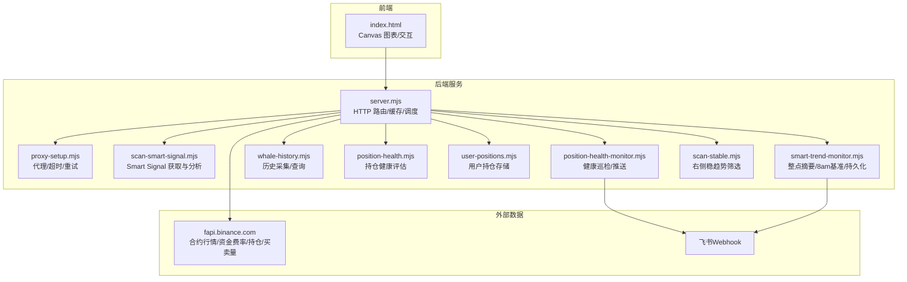
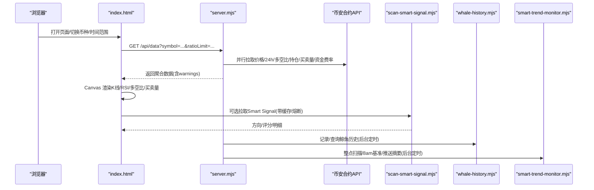
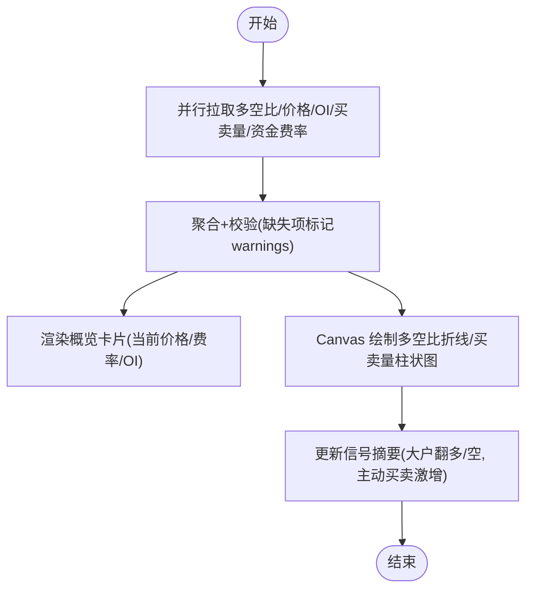
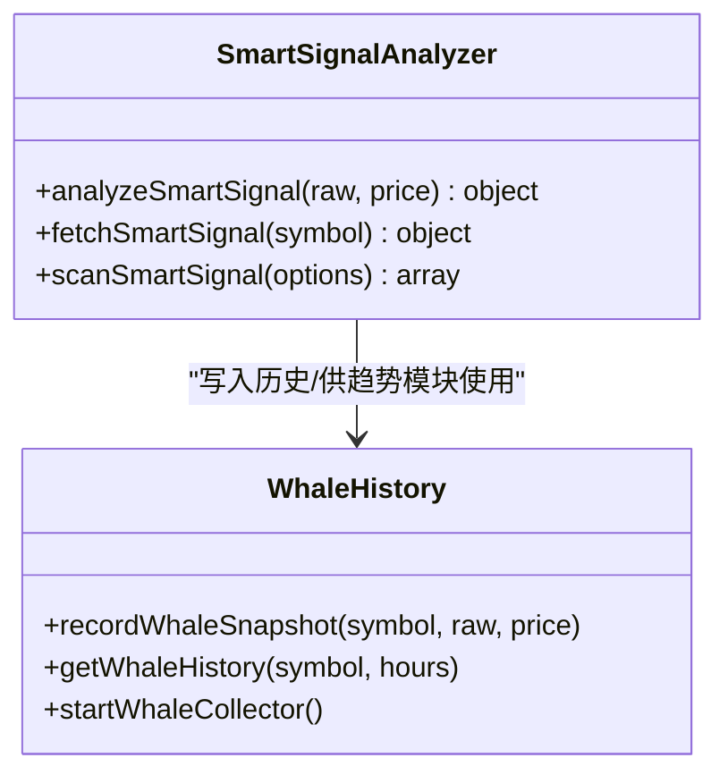
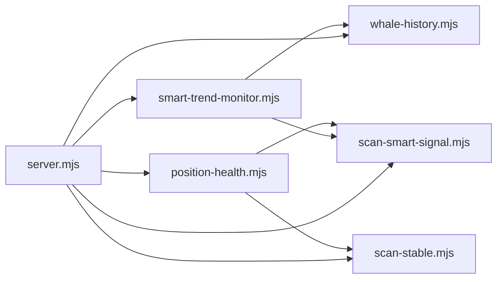

# 聪明钱分析图表

<cite>
**本文引用的文件列表**
- [README.md](file://README.md)
- [package.json](file://package.json)
- [index.html](file://index.html)
- [server.mjs](file://server.mjs)
- [smart-money.mjs](file://smart-money.mjs)
- [scan-smart-signal.mjs](file://scan-smart-signal.mjs)
- [smart-trend-monitor.mjs](file://smart-trend-monitor.mjs)
- [whale-history.mjs](file://whale-history.mjs)
- [position-health.mjs](file://position-health.mjs)
- [user-positions.mjs](file://user-positions.mjs)
- [position-health-monitor.mjs](file://position-health-monitor.mjs)
- [scan-stable.mjs](file://scan-stable.mjs)
</cite>

## 目录
1. [简介](#简介)
2. [项目结构](#项目结构)
3. [核心组件](#核心组件)
4. [架构总览](#架构总览)
5. [详细组件分析](#详细组件分析)
6. [依赖关系分析](#依赖关系分析)
7. [性能与实时性](#性能与实时性)
8. [故障排查指南](#故障排查指南)
9. [结论](#结论)
10. [附录：扩展与自定义集成指南](#附录扩展与自定义集成指南)

## 简介
本项目为“币安合约聪明钱监控面板”，提供 Web 面板与终端两种使用方式，围绕大户多空比、全网多空比、持仓量变化、主动买卖量等指标进行可视化与信号研判。核心能力包括：
- 大户 vs 散户多空比率可视化（账户维度与持仓维度）
- 资金流向分析（主动买入/卖出量及比值）
- 持仓量变化趋势图（含历史快照）
- 聪明钱信号评分与置信度展示
- 历史数据分析与异常检测（鲸鱼历史采集、8am基准对比、显著变化分档）
- 策略回测与模拟交易（前端内置）
- 飞书推送与浏览器通知报警

## 项目结构
- 服务端：Node.js 原生 HTTP 服务器，代理币安合约 API，聚合多源数据并对外暴露 REST 接口；同时运行定时任务（稳趋势扫描、聪明钱趋势摘要、持仓健康检查等）。
- 前端：单页 HTML + Canvas 自绘图表，支持 K 线、RSI、多空比折线、主动买卖柱状图等交互。
- 工具脚本：终端版监控、市值过滤、TradFi 排除、策略回测、飞书推送预览等。

图示来源
- [server.mjs:1-120](file://server.mjs#L1-L120)
- [index.html:1076-1120](file://index.html#L1076-L1120)
- [scan-smart-signal.mjs:1-84](file://scan-smart-signal.mjs#L1-L84)
- [smart-trend-monitor.mjs:1-120](file://smart-trend-monitor.mjs#L1-L120)
- [whale-history.mjs:1-64](file://whale-history.mjs#L1-L64)
- [position-health.mjs:1-60](file://position-health.mjs#L1-L60)
- [user-positions.mjs:1-40](file://user-positions.mjs#L1-L40)
- [position-health-monitor.mjs:1-60](file://position-health-monitor.mjs#L1-L60)
- [scan-stable.mjs:1-60](file://scan-stable.mjs#L1-L60)

章节来源
- [README.md:1-120](file://README.md#L1-L120)
- [package.json:1-22](file://package.json#L1-L22)

## 核心组件
- 数据获取与聚合层
  - server.mjs：统一代理币安合约 API，提供 /api/data、/api/klines 等接口；实现 ticker/24h 短 TTL 缓存、并发去重、网络就绪等待、市值过滤、TradFi 排除等。
  - proxy-setup.mjs：代理与超时控制封装。
- 聪明钱信号模块
  - scan-smart-signal.mjs：调用币安 Smart Signal 接口，限流熔断、请求队列、本地缓存；对原始数据进行方向判定、评分与明细生成。
- 趋势与摘要模块
  - smart-trend-monitor.mjs：每小时整点汇总全池聪明钱变化，计算 8am 基准差值、分档计分、市场研判与表格卡片构建；持久化状态到 data/smart-trend-state.json。
- 鲸鱼历史采集
  - whale-history.mjs：周期性拉取 Smart Signal 并落盘 data/whale-history.json，支持批量查询与活跃币种注册。
- 持仓健康与用户持仓
  - user-positions.mjs：增删查用户持仓记录。
  - position-health.mjs：结合右侧稳趋势、做空信号、暴跌风险、聪明钱信号与价格/PnL 综合打分，输出健康等级与建议动作。
  - position-health-monitor.mjs：定时巡检与紧急冷却推送。
- 右侧稳趋势筛选
  - scan-stable.mjs：基于均线、RSI、MACD、回撤与趋势完整性判断，支持双周期确认与严格模式。

章节来源
- [server.mjs:508-538](file://server.mjs#L508-L538)
- [scan-smart-signal.mjs:76-167](file://scan-smart-signal.mjs#L76-L167)
- [smart-trend-monitor.mjs:346-377](file://smart-trend-monitor.mjs#L346-L377)
- [whale-history.mjs:47-90](file://whale-history.mjs#L47-L90)
- [position-health.mjs:56-195](file://position-health.mjs#L56-L195)
- [user-positions.mjs:30-64](file://user-positions.mjs#L30-L64)
- [position-health-monitor.mjs:72-128](file://position-health-monitor.mjs#L72-L128)
- [scan-stable.mjs:163-193](file://scan-stable.mjs#L163-L193)

## 架构总览
系统采用前后端分离的轻量架构：前端通过 Canvas 自绘图表，后端以 Node.js 原生 HTTP 提供服务，屏蔽跨域并聚合多类合约数据。关键流程如下：

图示来源
- [server.mjs:508-538](file://server.mjs#L508-L538)
- [index.html:2272-2300](file://index.html#L2272-L2300)
- [scan-smart-signal.mjs:76-84](file://scan-smart-signal.mjs#L76-L84)
- [whale-history.mjs:121-141](file://whale-history.mjs#L121-L141)
- [smart-trend-monitor.mjs:346-377](file://smart-trend-monitor.mjs#L346-L377)

## 详细组件分析

### 大户 vs 散户多空比率可视化
- 数据源
  - 账户维度多空比：/futures/data/topLongShortAccountRatio
  - 持仓维度多空比：/futures/data/topLongShortPositionRatio
  - 全网多空比：/futures/data/globalLongShortAccountRatio
- 处理逻辑
  - server.mjs 将上述三类数据与价格、24h 行情、OI、OI 历史、主动买卖量、资金费率一并聚合，返回给前端。
- 前端渲染
  - index.html 使用 drawLineChart 绘制多空比折线，支持十字光标悬浮显示 OHLCV、振幅、涨跌幅等。
- 实时更新
  - 前端按 interval 秒轮询 /api/data，自动刷新概览、信号区与图表。

图示来源
- [server.mjs:508-538](file://server.mjs#L508-L538)
- [index.html:2272-2300](file://index.html#L2272-L2300)

章节来源
- [server.mjs:508-538](file://server.mjs#L508-L538)
- [index.html:1076-1120](file://index.html#L1076-L1120)

### 资金流向分析（主动买卖量）
- 数据源
  - /futures/data/takerlongshortRatio（5分钟粒度）
- 处理逻辑
  - 服务端直接透传，前端根据 buyVol/sellVol/buySellRatio 绘制柱状图与比值曲线。
- 交互体验
  - 十字光标悬停显示具体时段买卖量与比值，便于识别短期资金异动。

章节来源
- [server.mjs:508-538](file://server.mjs#L508-L538)
- [index.html:1418-1470](file://index.html#L1418-L1470)

### 持仓量变化趋势图
- 数据源
  - /fapi/v1/openInterest（当前 OI）
  - /futures/data/openInterestHist（4小时粒度历史）
- 处理逻辑
  - 服务端聚合后返回，前端绘制 OI 折线图，辅助判断资金进出与趋势延续。
- 历史快照
  - whale-history.mjs 定期采集 Smart Signal 并落盘，可用于回溯聪明钱比值的历史走势。

章节来源
- [server.mjs:508-538](file://server.mjs#L508-L538)
- [whale-history.mjs:92-119](file://whale-history.mjs#L92-L119)

### 聪明钱信号计算方法、评分系统与置信度
- 数据来源
  - 币安 Smart Signal 接口（高收益交易员+鲸鱼聚合），具备限流熔断与请求队列保护。
- 评分规则（简化）
  - 基础方向得分：净多/净空各加 2 分；优势明显再加 1 分。
  - 盈利交易者数量对比：若与方向一致再加 1 分。
  - 鲸鱼仓位规模对比：与方向一致再加 1 分。
  - 盈利鲸鱼数量对比：与方向一致再加 1 分。
  - 现价相对鲸鱼均价偏离提示（不加分，仅信息）。
- 置信度
  - 在决策模块中，依据总分与来源多样性给出“高/中/低”置信度标签，用于操作建议优先级排序。

图示来源
- [scan-smart-signal.mjs:86-167](file://scan-smart-signal.mjs#L86-L167)
- [whale-history.mjs:47-90](file://whale-history.mjs#L47-L90)

章节来源
- [scan-smart-signal.mjs:76-167](file://scan-smart-signal.mjs#L76-L167)
- [whale-history.mjs:121-141](file://whale-history.mjs#L121-L141)

### 历史数据分析、趋势预测与异常检测
- 8am 基准对比
  - smart-trend-monitor.mjs 每日 08:00 上海时间抓取当前聪明钱比值作为当日基准，后续每轮扫描计算相对 8am 的变化百分比，并进行分档计分（≥5%→1分，≥15%→2分，≥35%→3分）。
- 显著变化检测
  - 对 1h 变化与 8am 变化分别统计变多/变少币种数量，形成市场研判与 Top 变动列表。
- 异常与风控
  - 智能熔断：Smart Signal 接口触发 418/429/403 时进入熔断窗口，避免雪崩。
  - 暴跌风险：position-health.mjs 集成暴跌风险评分，对多头持仓进行扣分与风险提示。
  - 趋势稳定性：scan-stable.mjs 通过回撤阈值与趋势完整性（MA20/MA5、连续阴跌等）过滤不稳定标的。

章节来源
- [smart-trend-monitor.mjs:279-318](file://smart-trend-monitor.mjs#L279-L318)
- [smart-trend-monitor.mjs:320-344](file://smart-trend-monitor.mjs#L320-L344)
- [scan-smart-signal.mjs:28-55](file://scan-smart-signal.mjs#L28-L55)
- [position-health.mjs:104-114](file://position-health.mjs#L104-L114)
- [scan-stable.mjs:141-161](file://scan-stable.mjs#L141-L161)

### 用户交互体验
- 多币种一键切换与 URL 参数同步
- 时间范围选择（12H/1D/3D/7D）影响数据长度限制
- 十字光标悬浮显示 OHLCV、振幅、涨跌幅
- 报警设置（价格突破/跌破、RSI 超买超卖、大户翻多翻空、主动买卖激增）
- 飞书推送与浏览器通知

章节来源
- [index.html:479-626](file://index.html#L479-L626)
- [index.html:2272-2300](file://index.html#L2272-L2300)

## 依赖关系分析
- 模块耦合
  - server.mjs 作为入口聚合多个子模块，职责清晰但耦合度较高（集中式路由与调度）。
  - smart-trend-monitor.mjs 依赖 whale-history.mjs 与 scan-smart-signal.mjs，负责状态持久化与推送。
  - position-health.mjs 依赖 scan-stable.mjs、scan-short-signal.mjs、scan-dump-risk.mjs、scan-smart-signal.mjs，组合多维信号做健康评估。
- 外部依赖
  - 币安合约 API（REST）
  - 飞书 Webhook（可选）
  - CoinMarketCap Pro API（市值优先，回退 CoinGecko）

图示来源
- [server.mjs:1-28](file://server.mjs#L1-L28)
- [smart-trend-monitor.mjs:1-25](file://smart-trend-monitor.mjs#L1-L25)
- [position-health.mjs:1-6](file://position-health.mjs#L1-L6)

章节来源
- [server.mjs:1-28](file://server.mjs#L1-L28)
- [smart-trend-monitor.mjs:1-25](file://smart-trend-monitor.mjs#L1-L25)
- [position-health.mjs:1-6](file://position-health.mjs#L1-L6)

## 性能与实时性
- 并发与缓存
  - ticker/24h 短 TTL 缓存 + 并发去重，避免同一轮推送重复请求。
  - pmap 并发拉取，降低整体延迟。
- 网络健壮性
  - 网络就绪等待（指数退避）、代理重试、Smart Signal 熔断与队列限流。
- 前端渲染
  - Canvas 自绘，按需缩放 DPR，减少 DOM 开销；图表区域可配置数据范围，平衡性能与信息密度。
- 定时任务
  - 稳趋势扫描、聪明钱趋势摘要、持仓健康巡检均按配置间隔执行，避免频繁 IO。

章节来源
- [server.mjs:84-125](file://server.mjs#L84-L125)
- [server.mjs:150-162](file://server.mjs#L150-L162)
- [scan-smart-signal.mjs:16-26](file://scan-smart-signal.mjs#L16-L26)
- [index.html:1089-1120](file://index.html#L1089-L1120)

## 故障排查指南
- 端口占用
  - 启动报 EADDRINUSE：使用 dev:restart 或手动释放端口。
- 币安 API 失败
  - 检查代理节点与网络连通；查看 warnings 字段定位失败项。
- Smart Signal 限流
  - 出现 418/429/403 会进入熔断窗口，稍后重试；必要时调整 MIN_INTERVAL_MS。
- 飞书推送失败
  - 检查 FEISHU_WEBHOOK 配置；查看错误消息中的频控/限流提示。
- 市值过滤导致无结果
  - 调整 MAX_MARKET_CAP_USD 或关闭过滤；确认 CMC_API_KEY 是否生效。

章节来源
- [README.md:40-94](file://README.md#L40-L94)
- [server.mjs:59-76](file://server.mjs#L59-L76)
- [scan-smart-signal.mjs:42-55](file://scan-smart-signal.mjs#L42-L55)
- [server.mjs:599-644](file://server.mjs#L599-L644)

## 结论
本方案以轻量架构实现了从数据获取、信号计算、历史追踪到可视化与推送的全链路闭环。通过 Smart Signal 与合约公开数据的多维融合，配合稳健的网络与并发策略，既保证了实时性与可用性，也为策略研究与自动化提供了可扩展的基础设施。

## 附录：扩展与自定义集成指南
- 自定义分析维度
  - 在前端增加新的图表数据集（参考 drawLineChart/drawBarChart），并在 /api/data 聚合逻辑中补充对应字段。
  - 在 smart-trend-monitor.mjs 中添加新的榜单或合并规则，参与 8am 基准与分档计分。
- 扩展指标
  - 新增指标可在 server.mjs 的 handleAPI 中并行拉取并注入返回对象，前端按需渲染。
  - 对于高频指标，建议加入本地缓存与去重机制，避免重复请求。
- 接入第三方推送
  - 参照 sendFeishuCardV2 的实现，封装其他平台 Webhook 发送逻辑，并在相应调度器中调用。
- 策略与回测
  - 利用 whale-history.mjs 的历史数据与前端回测面板，验证自定义评分与入场/出场规则。

章节来源
- [server.mjs:508-538](file://server.mjs#L508-L538)
- [smart-trend-monitor.mjs:706-760](file://smart-trend-monitor.mjs#L706-L760)
- [index.html:1089-1120](file://index.html#L1089-L1120)
- [whale-history.mjs:92-119](file://whale-history.mjs#L92-L119)