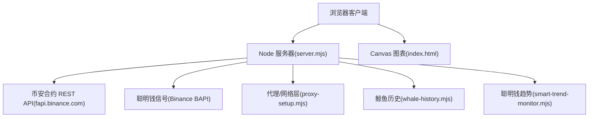
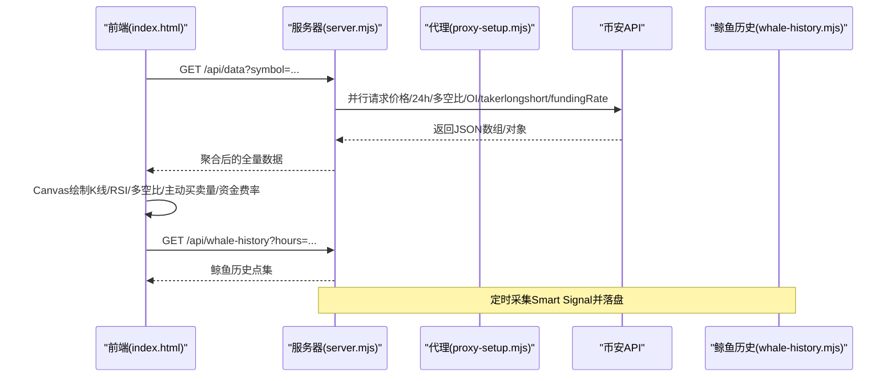
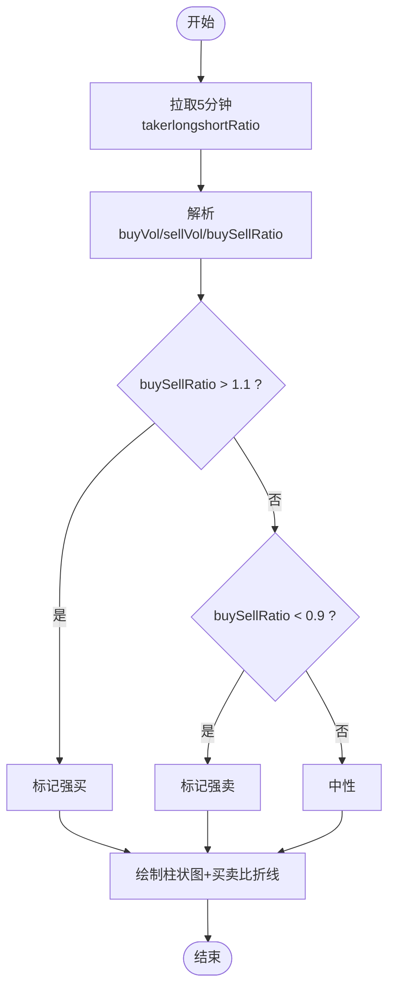
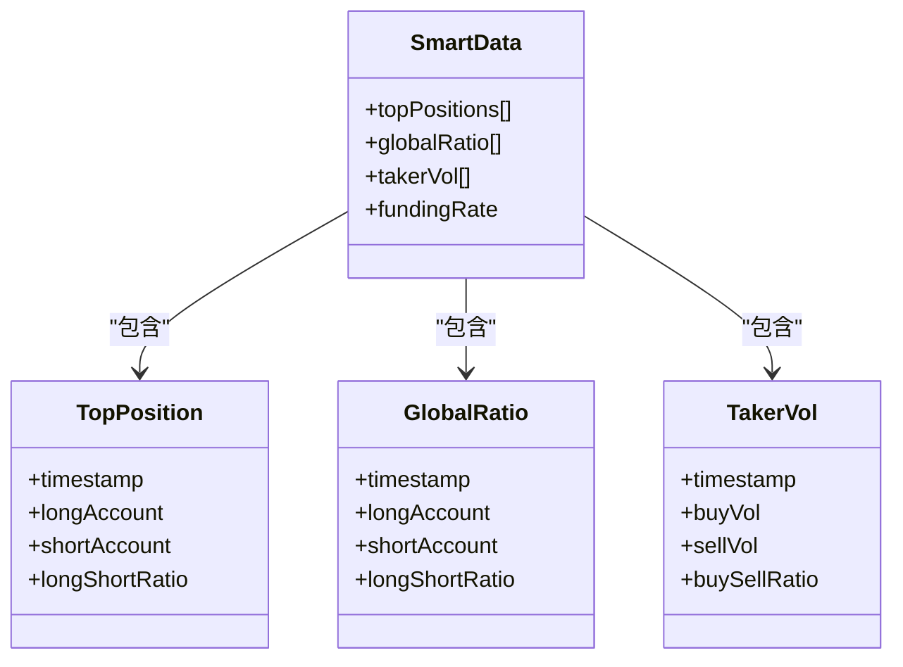
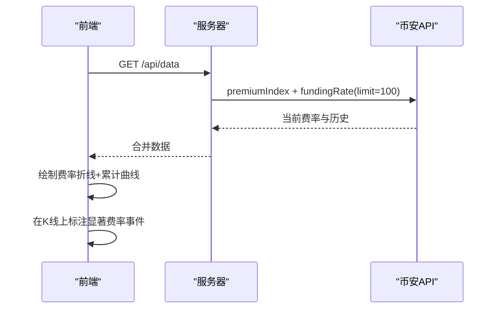
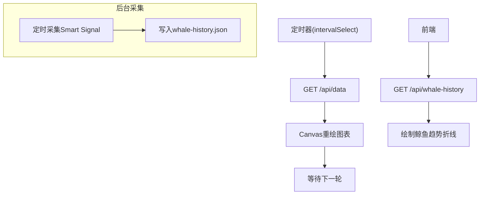
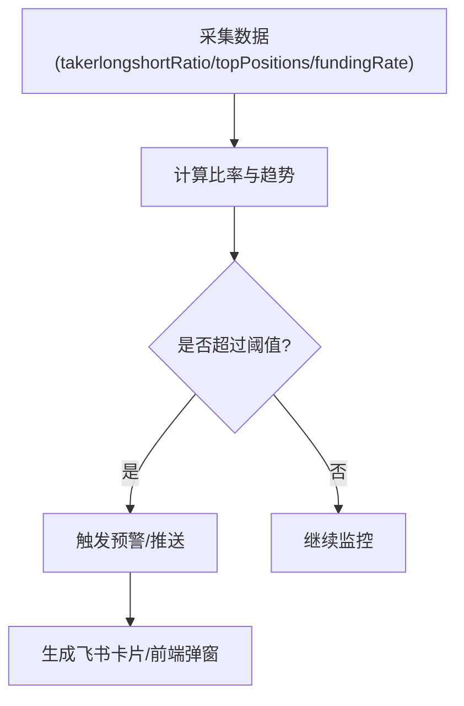
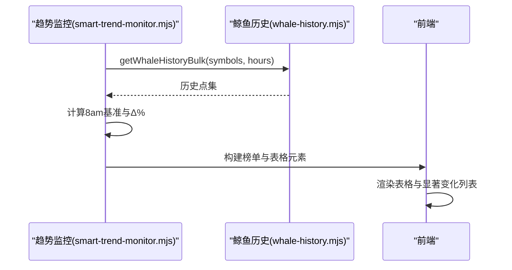
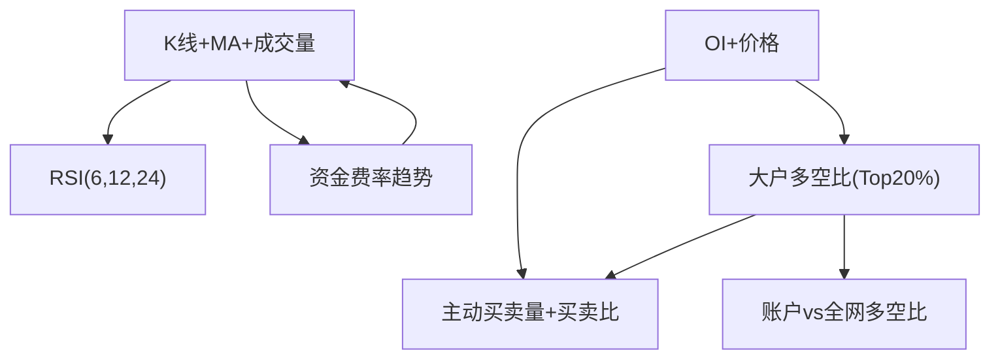
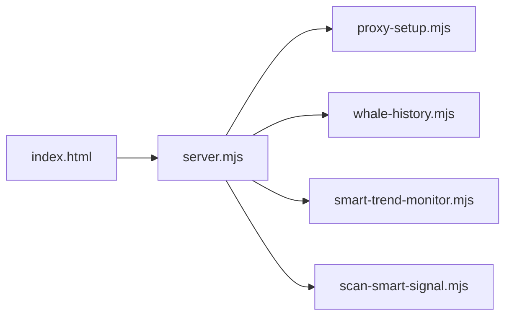

# 资金流向分析图表

<cite>
**本文引用的文件**   
- [README.md](file://README.md)
- [package.json](file://package.json)
- [server.mjs](file://server.mjs)
- [index.html](file://index.html)
- [smart-money.mjs](file://smart-money.mjs)
- [proxy-setup.mjs](file://proxy-setup.mjs)
- [scan-smart-signal.mjs](file://scan-smart-signal.mjs)
- [whale-history.mjs](file://whale-history.mjs)
- [smart-trend-monitor.mjs](file://smart-trend-monitor.mjs)
</cite>

## 目录
1. [简介](#简介)
2. [项目结构](#项目结构)
3. [核心组件](#核心组件)
4. [架构总览](#架构总览)
5. [详细组件分析](#详细组件分析)
6. [依赖关系分析](#依赖关系分析)
7. [性能与实时性](#性能与实时性)
8. [故障排查指南](#故障排查指南)
9. [结论](#结论)
10. [附录：配置与阈值](#附录配置与阈值)

## 简介
本项目为“币安聪明钱监控面板”，提供 Web 面板与终端两种使用方式，围绕合约市场的大户多空比、全网多空比、持仓量变化、主动买卖量（takerlongshortRatio）等指标进行采集、计算与可视化。文档聚焦于资金流向分析图表的实现与使用方法，涵盖：
- 主动买入/卖出量的统计方法与指标计算逻辑
- 图表可视化实现（K线、RSI、大户多空比、主动买卖量、资金费率等）
- 实时数据更新机制与历史对比
- 大额交易识别、资金集中度分析与市场情绪指标
- 异常资金流动检测与预警
- 自定义阈值与监控规则的配置指南

## 项目结构
- 服务端：Node.js 原生 HTTP 服务，代理币安合约 API，聚合多源数据并返回给前端
- 前端：HTML + Canvas 自绘 K 线图、RSI、柱状图、折线图，支持交互与报警
- 定时任务：稳趋势扫描、暴跌风险扫描、聪明钱趋势摘要推送、鲸鱼历史采集等
- 工具模块：代理设置、市值过滤、TradFi 符号过滤、策略回测与模拟交易等

**图示来源**
- [server.mjs:1-120](file://server.mjs#L1-L120)
- [proxy-setup.mjs:1-71](file://proxy-setup.mjs#L1-L71)
- [index.html:2095-2199](file://index.html#L2095-L2199)

**章节来源**
- [README.md:1-210](file://README.md#L1-L210)
- [package.json:1-22](file://package.json#L1-L22)

## 核心组件
- 数据采集与聚合
  - 价格、24h行情、大户多空比（账户/持仓）、全网多空比、OI、OI历史、主动买卖量、资金费率及历史
  - 通过统一代理层请求币安接口，具备重试与熔断保护
- 指标计算
  - 主动买卖比 = buyVol / sellVol（5分钟周期）
  - 大户多空比（Top 20% 持仓维度）为核心指标
  - 资金费率趋势与累计费率
  - 8am基准聪明钱比值与变化百分比
- 可视化
  - K线+MA5/20/60+成交量；RSI(6,12,24)
  - 大户多空比折线；账户 vs 全网多空比；OI与价格双轴
  - 资金费率折线与累计曲线
  - 主动买卖量柱状图叠加买卖比折线
- 实时与历史
  - 前端轮询刷新；后端缓存 ticker/24hr
  - 鲸鱼历史采集与本地持久化，支持回溯
- 预警与推送
  - 前端报警（价格、RSI、大户翻多/空、主动买卖激增）
  - 飞书卡片推送（稳趋势、暴跌风险、聪明钱趋势摘要）

**章节来源**
- [server.mjs:508-538](file://server.mjs#L508-L538)
- [index.html:1418-1513](file://index.html#L1418-L1513)
- [smart-money.mjs:96-133](file://smart-money.mjs#L96-L133)
- [whale-history.mjs:47-90](file://whale-history.mjs#L47-L90)
- [smart-trend-monitor.mjs:259-318](file://smart-trend-monitor.mjs#L259-L318)

## 架构总览
系统采用前后端分离的轻量架构：
- 前端通过 /api/data 获取全量聪明钱数据，渲染多种图表
- 后端聚合多个币安接口，统一错误处理与缓存
- 定时任务在后台运行，定期扫描与推送结果到飞书
- 鲸鱼历史采集器周期性抓取聪明钱信号并落盘，供前端回溯

**图示来源**
- [server.mjs:508-538](file://server.mjs#L508-L538)
- [index.html:2095-2199](file://index.html#L2095-L2199)
- [whale-history.mjs:121-141](file://whale-history.mjs#L121-L141)

## 详细组件分析

### 主动买入/卖出量统计与指标计算
- 数据来源
  - 5分钟周期的 takerlongshortRatio，包含 buyVol、sellVol、buySellRatio
- 计算逻辑
  - 主动买卖比 = buySellRatio（由交易所提供），也可用 buyVol/sellVol 校验
  - 强买/强卖阈值：>1.1 视为强买，<0.9 视为强卖
- 可视化
  - 柱状图展示买入/卖出量，右侧折线展示买卖比，并以 1.0 基线辅助判断
- 应用
  - 信号摘要中结合大户多空比与资金费率，形成综合研判
  - 入场建议参考主动买卖增强趋势

**图示来源**
- [server.mjs:508-538](file://server.mjs#L508-L538)
- [index.html:1418-1513](file://index.html#L1418-L1513)
- [smart-money.mjs:96-133](file://smart-money.mjs#L96-L133)

**章节来源**
- [server.mjs:508-538](file://server.mjs#L508-L538)
- [index.html:1418-1513](file://index.html#L1418-L1513)
- [smart-money.mjs:96-133](file://smart-money.mjs#L96-L133)

### 大户多空比与资金集中度分析
- 指标定义
  - 大户多空比（Top 20% 持仓维度）为核心指标，反映头部持仓者方向倾向
  - 账户维度多空比用于对比散户与大户差异
- 计算与趋势
  - 比较最近若干期比值，观察趋势变化（如连续上升/下降）
  - 与全网多空比对比，识别“聪明钱抄底”场景（大户偏多且散户偏空）
- 可视化
  - 折线图展示多空比走势，叠加 1.0 基线
  - 账户 vs 全网多空比双折线对比

**图示来源**
- [server.mjs:508-538](file://server.mjs#L508-L538)
- [index.html:2126-2145](file://index.html#L2126-L2145)

**章节来源**
- [server.mjs:508-538](file://server.mjs#L508-L538)
- [index.html:2126-2145](file://index.html#L2126-L2145)

### 资金费率趋势与市场情绪
- 指标定义
  - 资金费率 lastFundingRate 与 fundingRateHist 历史
  - 正费率表示多头付费，负费率表示空头付费
- 计算与可视化
  - 折线显示费率，叠加累计费率曲线
  - 在K线图上标注显著费率事件（绝对值大于阈值）
- 情绪解读
  - 高正费率提示多头拥挤，负费率提示空头付费或潜在反弹机会

**图示来源**
- [server.mjs:508-538](file://server.mjs#L508-L538)
- [index.html:1691-1726](file://index.html#L1691-L1726)

**章节来源**
- [server.mjs:508-538](file://server.mjs#L508-L538)
- [index.html:1691-1726](file://index.html#L1691-L1726)

### 实时数据更新机制
- 前端轮询
  - 根据用户选择的刷新间隔（30s/60s/2min/5min）定时拉取 /api/data
  - 图表区域动态重绘，状态栏显示倒计时与连接状态
- 后端缓存
  - ticker/24hr 短TTL缓存，避免同一轮推送重复请求
  - 并发去重与超时控制，提升稳定性
- 鲸鱼历史采集
  - 每 N 分钟采集一次 Smart Signal，写入 data/whale-history.json
  - 前端可拉取历史点集，绘制趋势折线

**图示来源**
- [index.html:629-633](file://index.html#L629-L633)
- [server.mjs:84-105](file://server.mjs#L84-L105)
- [whale-history.mjs:121-141](file://whale-history.mjs#L121-L141)

**章节来源**
- [index.html:629-633](file://index.html#L629-L633)
- [server.mjs:84-105](file://server.mjs#L84-L105)
- [whale-history.mjs:121-141](file://whale-history.mjs#L121-L141)

### 大额交易识别算法与异常资金流动检测
- 大额交易识别
  - 基于主动买卖量与买卖比的突变：当 buySellRatio 显著偏离 1.0（如 >1.1 或 <0.9）时，视为异常活跃
  - 结合大户多空比趋势变化（连续上升/下降）确认资金集中方向
- 异常检测
  - 暴跌风险扫描：综合价格变动、OI变化、主动买卖比、大户多空比等因子评分，输出风险等级
  - 聪明钱趋势摘要：按 1h 与 8am 基准计算比值变化百分比，筛选显著变化币种
- 预警功能
  - 前端报警：价格突破/跌破、RSI超买超卖、大户翻多/空、主动买卖激增
  - 飞书推送：稳趋势、暴跌风险、聪明钱趋势摘要卡片

**图示来源**
- [pump-smart-alert.mjs:20-54](file://pump-smart-alert.mjs#L20-L54)
- [scan-dump-risk.mjs:225-266](file://scan-dump-risk.mjs#L225-L266)
- [smart-trend-monitor.mjs:511-604](file://smart-trend-monitor.mjs#L511-L604)

**章节来源**
- [pump-smart-alert.mjs:20-54](file://pump-smart-alert.mjs#L20-L54)
- [scan-dump-risk.mjs:225-266](file://scan-dump-risk.mjs#L225-L266)
- [smart-trend-monitor.mjs:511-604](file://smart-trend-monitor.mjs#L511-L604)

### 历史资金流向对比与可视化
- 8am基准聪明钱比值
  - 每日 08:00 上海时间将当前聪明钱比值设为基准，计算后续变化百分比
  - 分档计分：≥35%→3分，≥15%→2分，≥5%→1分，用于衡量当日资金集中度变化
- 榜单汇总
  - 合并涨幅榜/跌幅榜/右侧/交易额榜，去重后按 8am 推积分排序
  - 表格分页展示，显著变化高亮
- 可视化
  - 鲸鱼历史折线：聪明钱净多空比与鲸鱼仓位多空比
  - 大户多空比与账户 vs 全网多空比折线

**图示来源**
- [smart-trend-monitor.mjs:259-318](file://smart-trend-monitor.mjs#L259-L318)
- [smart-trend-monitor.mjs:706-765](file://smart-trend-monitor.mjs#L706-L765)
- [whale-history.mjs:92-119](file://whale-history.mjs#L92-L119)

**章节来源**
- [smart-trend-monitor.mjs:259-318](file://smart-trend-monitor.mjs#L259-L318)
- [smart-trend-monitor.mjs:706-765](file://smart-trend-monitor.mjs#L706-L765)
- [whale-history.mjs:92-119](file://whale-history.mjs#L92-L119)

### 图表可视化实现要点
- K线与RSI
  - 自绘蜡烛图，叠加 MA5/20/60 与成交量柱
  - RSI(6,12,24)三线，超买超卖区高亮
- 资金流向相关图表
  - 大户多空比折线（Top 20% 持仓维度）
  - 账户 vs 全网多空比对比
  - OI与价格双轴对比
  - 资金费率折线与累计曲线
  - 主动买卖量柱状图叠加买卖比折线
- 交互
  - 十字光标悬浮显示 OHLCV、振幅、涨跌幅
  - 图表范围选择（12H/1D/3D/7D）

**图示来源**
- [index.html:1559-1727](file://index.html#L1559-L1727)
- [index.html:1729-1807](file://index.html#L1729-L1807)
- [index.html:2126-2145](file://index.html#L2126-L2145)

**章节来源**
- [index.html:1559-1727](file://index.html#L1559-L1727)
- [index.html:1729-1807](file://index.html#L1729-L1807)
- [index.html:2126-2145](file://index.html#L2126-L2145)

## 依赖关系分析
- 外部依赖
  - 币安合约 REST API（fapi.binance.com）
  - 聪明钱信号 BAPI（binance.com/bapi/futures/v1/public/future/smart-money/signal/overview）
  - 可选：CoinMarketCap Pro API（市值数据）
- 内部模块
  - server.mjs 聚合各模块，暴露 /api/* 接口
  - proxy-setup.mjs 统一网络请求与代理
  - whale-history.mjs 历史采集与持久化
  - smart-trend-monitor.mjs 趋势摘要与推送
  - index.html 前端图表与交互

**图示来源**
- [server.mjs:1-28](file://server.mjs#L1-L28)
- [proxy-setup.mjs:1-71](file://proxy-setup.mjs#L1-L71)
- [whale-history.mjs:1-10](file://whale-history.mjs#L1-L10)
- [smart-trend-monitor.mjs:1-25](file://smart-trend-monitor.mjs#L1-L25)
- [scan-smart-signal.mjs:1-20](file://scan-smart-signal.mjs#L1-L20)

**章节来源**
- [server.mjs:1-28](file://server.mjs#L1-L28)
- [proxy-setup.mjs:1-71](file://proxy-setup.mjs#L1-L71)
- [whale-history.mjs:1-10](file://whale-history.mjs#L1-L10)
- [smart-trend-monitor.mjs:1-25](file://smart-trend-monitor.mjs#L1-L25)
- [scan-smart-signal.mjs:1-20](file://scan-smart-signal.mjs#L1-L20)

## 性能与实时性
- 并发与缓存
  - ticker/24hr 短 TTL 缓存，减少重复请求
  - pmap 并发控制，限制并行度避免过载
- 超时与重试
  - 统一 fetchJson 封装，支持 curl 回退与超时控制
  - 币安 API 重试与熔断保护（限流/地区限制）
- 前端渲染优化
  - requestAnimationFrame 批量重绘
  - 图表范围选择减少数据量
- 历史数据
  - 鲸鱼历史本地持久化，按需加载小时级窗口

[本节为通用指导，不直接分析具体文件]

## 故障排查指南
- 端口占用
  - 启动时报 EADDRINUSE，建议使用 dev:restart 自动清理旧进程
- 代理与网络
  - Windows 环境下优先使用 curl 回退，确保 HTTPS_PROXY/HTTP_PROXY 正确配置
  - 地区限制错误需检查代理节点可用性
- 数据异常
  - 币安 API 返回 code=0 且有 msg 时抛出错误，检查代理节点与网络
  - Smart Signal 限流熔断会暂停请求一段时间，稍后重试
- 推送失败
  - FEISHU_WEBHOOK 未配置或频控导致发送失败，检查 webhook 与限流信息

**章节来源**
- [README.md:40-53](file://README.md#L40-L53)
- [proxy-setup.mjs:25-44](file://proxy-setup.mjs#L25-L44)
- [server.mjs:58-76](file://server.mjs#L58-L76)
- [scan-smart-signal.mjs:28-55](file://scan-smart-signal.mjs#L28-L55)

## 结论
本项目的资金流向分析体系以大户多空比与主动买卖量为核心，辅以资金费率与持仓量变化，形成多维度的市场情绪与资金集中度评估。前端通过 Canvas 自绘图表直观呈现，后端提供稳定可靠的数据聚合与缓存机制，并结合定时任务实现智能推送与预警。通过合理的阈值配置与监控规则，用户可有效识别大额交易与异常资金流动，辅助决策。

[本节为总结，不直接分析具体文件]

## 附录：配置与阈值

### 环境变量与阈值
- 基础配置
  - PORT：Web 面板监听端口（默认 3388）
  - MAX_MARKET_CAP_USD：市值上限（美元），超过则不监控/不推送；0 关闭
  - FEISHU_WEBHOOK：飞书机器人 Webhook URL
- 推送与扫描
  - STABLE_PUSH_HOURS：稳趋势推送间隔（小时）
  - STABLE_SCAN_LIMIT：扫描币种数量
  - STABLE_MAX_DRAWDOWN：最大回撤阈值（30%）
  - LONG_PUSH_HOURS/LONG_MIN_SCORE：做多推送参数
  - DUMP_PUSH_HOURS/DUMP_MIN_RISK：暴跌风险推送参数
- 聪明钱趋势
  - SMART_TREND_INTERVAL_MIN：扫描间隔（分钟）
  - SMART_TREND_RATIO_CHANGE_PCT：比值变化阈值（%）
  - SMART_TREND_WATCH_SYMBOLS：监控池币种
- 鲸鱼历史采集
  - WHALE_HISTORY_INTERVAL_MIN：采集间隔（分钟）
  - WHALE_HISTORY_MAX_POINTS：最大采样点数
  - WHALE_HISTORY_MIN_GAP_MIN：最小记录间隔（分钟）
  - WHALE_HISTORY_SYMBOLS：采集币种列表

**章节来源**
- [README.md:142-159](file://README.md#L142-L159)
- [server.mjs:540-590](file://server.mjs#L540-L590)
- [whale-history.mjs:10-16](file://whale-history.mjs#L10-L16)

### 自定义资金流向阈值与监控规则
- 主动买卖激增阈值
  - 买入激增：buySellRatio > 1.2（可在前端报警类型中选择）
  - 卖出激增：buySellRatio < 0.8
- 大户多空比阈值
  - 大户翻多：longShortRatio > 1
  - 大户翻空：longShortRatio < 1
- 资金费率阈值
  - 高正费率：lastFundingRate > 0.001（多头拥挤）
  - 负费率：lastFundingRate < -0.001（空头付费）
- 8am基准变化阈值
  - ratioDeltaPct ≥ 5% 计 1 分，≥15% 计 2 分，≥35% 计 3 分
- 前端报警规则
  - 支持价格、RSI、大户翻多/空、主动买卖激增等条件，阈值可自定义

**章节来源**
- [README.md:123-133](file://README.md#L123-L133)
- [smart-trend-monitor.mjs:279-291](file://smart-trend-monitor.mjs#L279-L291)
- [index.html:782-788](file://index.html#L782-L788)