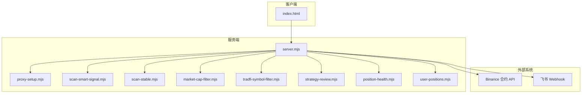
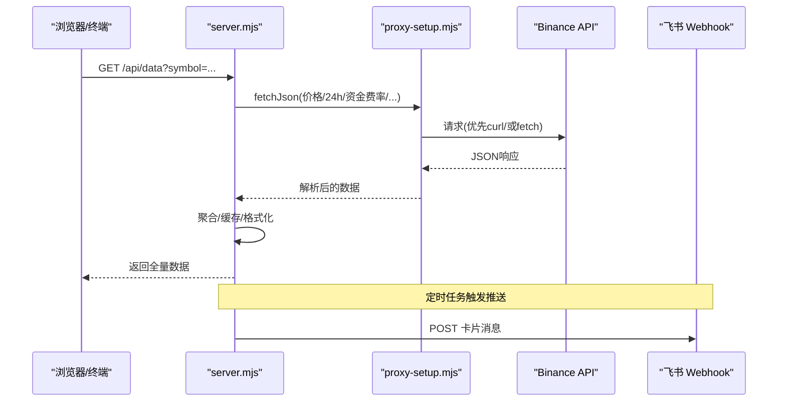
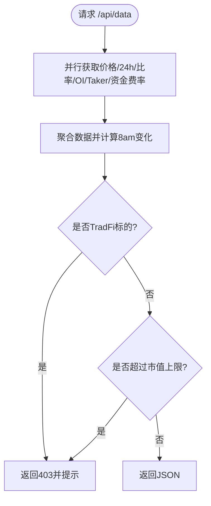
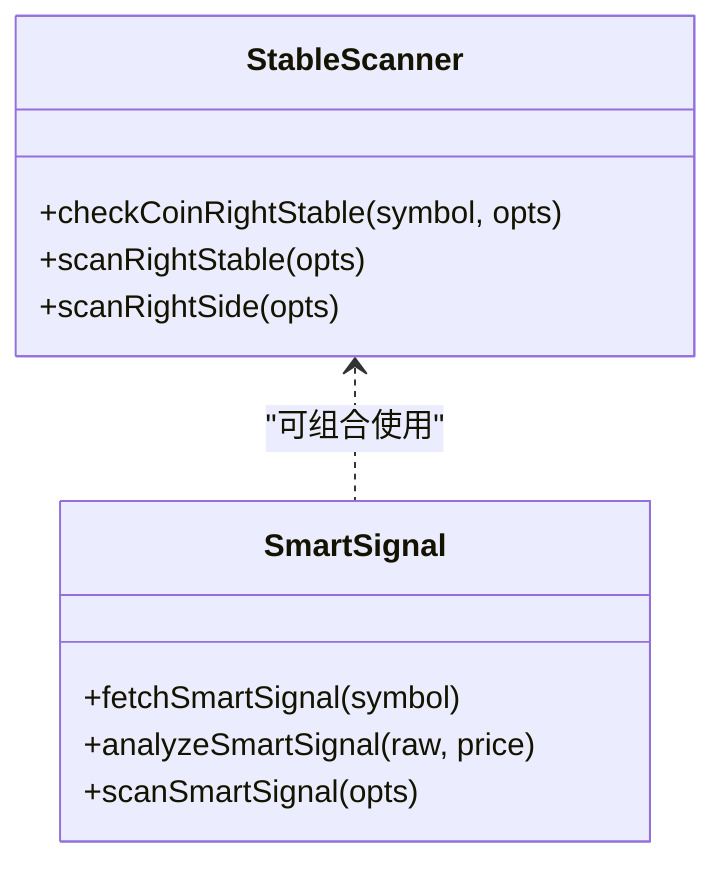
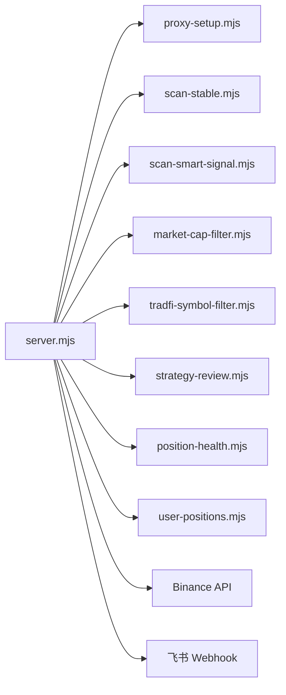
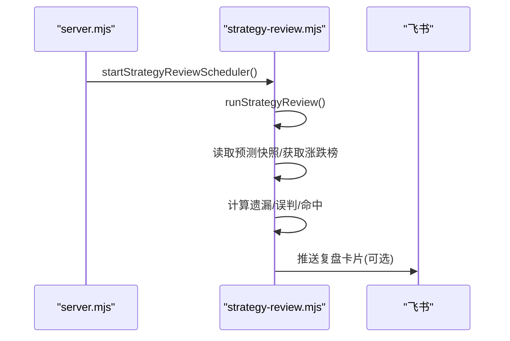

# 开发指南

<cite>
**本文引用的文件**   
- [README.md](file://README.md)
- [package.json](file://package.json)
- [server.mjs](file://server.mjs)
- [index.html](file://index.html)
- [smart-money.mjs](file://smart-money.mjs)
- [proxy-setup.mjs](file://proxy-setup.mjs)
- [dev-restart.mjs](file://dev-restart.mjs)
- [scan-smart-signal.mjs](file://scan-smart-signal.mjs)
- [scan-stable.mjs](file://scan-stable.mjs)
- [market-cap-filter.mjs](file://market-cap-filter.mjs)
- [tradfi-symbol-filter.mjs](file://tradfi-symbol-filter.mjs)
- [strategy-review.mjs](file://strategy-review.mjs)
- [position-health.mjs](file://position-health.mjs)
- [user-positions.mjs](file://user-positions.mjs)
- [ecosystem.config.cjs](file://ecosystem.config.cjs)
</cite>

## 目录
1. [简介](#简介)
2. [项目结构](#项目结构)
3. [核心组件](#核心组件)
4. [架构总览](#架构总览)
5. [详细组件分析](#详细组件分析)
6. [依赖关系分析](#依赖关系分析)
7. [性能与扩展性](#性能与扩展性)
8. [开发与调试指南](#开发与调试指南)
9. [策略回测与复盘](#策略回测与复盘)
10. [错误诊断与排障](#错误诊断与排障)
11. [贡献规范与最佳实践](#贡献规范与最佳实践)
12. [结论](#结论)

## 简介
本项目为基于币安合约 API 的“聪明钱”监控与分析工具，提供 Web 面板与终端两种使用方式。核心能力包括：K 线图与 RSI、大户/全网多空比、持仓量变化、主动买卖量、信号摘要、报警与飞书推送、市值过滤、TradFi 标的排除、稳趋势扫描与推送、策略复盘等。

- 运行环境：Node.js >= 20（ESM）
- 零外部运行时依赖，HTTP 服务由 Node 原生实现
- 支持代理（Windows 下优先 curl），便于跨区访问交易所接口

章节来源
- [README.md:1-210](file://README.md#L1-L210)
- [package.json:1-22](file://package.json#L1-L22)

## 项目结构
- server.mjs：Web 服务入口，聚合各模块能力，暴露 REST API，调度定时任务与推送
- index.html：前端页面，Canvas 图表、策略编辑/回测、模拟交易、报警设置等
- smart-money.mjs：终端版实时监控脚本
- proxy-setup.mjs：统一网络请求封装（curl/fetch 双通道 + 代理）
- scan-stable.mjs / scan-smart-signal.mjs：策略扫描与信号分析
- market-cap-filter.mjs / tradfi-symbol-filter.mjs：市值与标的过滤
- strategy-review.mjs：策略快照与复盘
- position-health.mjs / user-positions.mjs：持仓健康评估与持久化
- ecosystem.config.cjs：PM2 进程管理配置
- dev-restart.mjs：开发时自动释放端口并重启服务

图示来源
- [server.mjs:1-120](file://server.mjs#L1-L120)
- [proxy-setup.mjs:1-71](file://proxy-setup.mjs#L1-L71)
- [scan-smart-signal.mjs:1-80](file://scan-smart-signal.mjs#L1-L80)
- [scan-stable.mjs:1-60](file://scan-stable.mjs#L1-L60)
- [market-cap-filter.mjs:1-15](file://market-cap-filter.mjs#L1-L15)
- [tradfi-symbol-filter.mjs:1-40](file://tradfi-symbol-filter.mjs#L1-L40)
- [strategy-review.mjs:1-40](file://strategy-review.mjs#L1-L40)
- [position-health.mjs:1-40](file://position-health.mjs#L1-L40)
- [user-positions.mjs:1-30](file://user-positions.mjs#L1-L30)
- [index.html:1-120](file://index.html#L1-L120)

章节来源
- [server.mjs:1-120](file://server.mjs#L1-L120)
- [index.html:1-120](file://index.html#L1-L120)
- [package.json:1-22](file://package.json#L1-L22)

## 核心组件
- HTTP 服务与路由：server.mjs 负责静态资源、API 路由、数据聚合、缓存、并发控制、定时任务与推送
- 网络层：proxy-setup.mjs 提供 fetchJson 统一封装，Windows+代理场景优先 curl，避免 Node fetch 代理不稳定问题
- 策略扫描：
  - scan-stable.mjs：右侧稳趋势扫描（多周期回撤+均线/RSI/MACD 评分）
  - scan-smart-signal.mjs：聪明钱信号抓取与打分（限流/熔断保护）
- 过滤层：
  - market-cap-filter.mjs：按 MAX_MARKET_CAP_USD 过滤大市值币种
  - tradfi-symbol-filter.mjs：排除股票/商品/ETF 等 TradFi 合约
- 策略复盘：strategy-review.mjs 保存预测快照，定期对比涨跌幅榜生成复盘报告
- 持仓健康：position-health.mjs 综合做多/做空信号、暴跌风险、聪明钱方向与浮盈浮亏给出健康度与建议动作
- 用户持仓：user-positions.mjs 本地 JSON 持久化增删查
- 终端监控：smart-money.mjs 命令行实时展示关键指标与信号摘要

章节来源
- [server.mjs:1-120](file://server.mjs#L1-L120)
- [proxy-setup.mjs:1-71](file://proxy-setup.mjs#L1-L71)
- [scan-stable.mjs:1-120](file://scan-stable.mjs#L1-L120)
- [scan-smart-signal.mjs:1-120](file://scan-smart-signal.mjs#L1-L120)
- [market-cap-filter.mjs:1-15](file://market-cap-filter.mjs#L1-L15)
- [tradfi-symbol-filter.mjs:1-113](file://tradfi-symbol-filter.mjs#L1-L113)
- [strategy-review.mjs:1-120](file://strategy-review.mjs#L1-L120)
- [position-health.mjs:1-120](file://position-health.mjs#L1-L120)
- [user-positions.mjs:1-64](file://user-positions.mjs#L1-L64)
- [smart-money.mjs:1-149](file://smart-money.mjs#L1-L149)

## 架构总览
整体采用“单进程模块化”架构：一个主服务加载多个策略/工具模块，通过函数调用与事件/定时器驱动，对外暴露 REST API，对内聚合交易所数据与本地计算结果。

图示来源
- [server.mjs:508-538](file://server.mjs#L508-L538)
- [proxy-setup.mjs:49-71](file://proxy-setup.mjs#L49-L71)

章节来源
- [server.mjs:508-538](file://server.mjs#L508-L538)
- [proxy-setup.mjs:49-71](file://proxy-setup.mjs#L49-L71)

## 详细组件分析

### 服务器与 API（server.mjs）
- 功能要点
  - 读取 .env 环境变量；初始化代理；监听端口
  - 统一代理请求 proxyBinance，带重试与错误断言
  - ticker/24hr 短 TTL 缓存 + 并发去重，降低重复请求
  - 8am 基准价缓存，用于计算“自8点以来涨幅/跌幅”
  - 市值过滤与 TradFi 标的排除
  - 定时任务：稳趋势推送、暴跌预警、做多/做空扫描、智能趋势看板、仓位健康检查、策略复盘
  - 飞书推送：兼容旧版与新版卡片格式，内置频控退避
- 关键流程
  - 全量数据聚合 handleAPI：并行拉取价格、24h、Top 账户/持仓比、全局比、OI、OI 历史、Taker 比率、资金费率与历史
  - 8am 涨跌榜单：批量拉取 klines 首根开盘价作为基准，结合 24h 行情计算相对涨幅
  - 大盘上下文：premiumIndex、topPositions、takerRatio、klines 计算 MA 趋势、资金费率、8am 变化
  - 过滤链：TradFi 过滤 → 市值过滤
  - 推送编排：扫描 → 过滤 → 批量化富化（市值/8am/资金费率/24h）→ 飞书卡片

图示来源
- [server.mjs:508-538](file://server.mjs#L508-L538)
- [server.mjs:478-506](file://server.mjs#L478-L506)
- [server.mjs:164-215](file://server.mjs#L164-L215)

章节来源
- [server.mjs:1-120](file://server.mjs#L1-L120)
- [server.mjs:164-215](file://server.mjs#L164-L215)
- [server.mjs:478-506](file://server.mjs#L478-L506)
- [server.mjs:508-538](file://server.mjs#L508-L538)

### 网络层（proxy-setup.mjs）
- 设计要点
  - Windows + 代理环境下优先使用 curl 执行请求，规避 Node fetch 代理不可靠问题
  - 统一超时、错误处理与地区限制提示
  - 自动注入 NODE_USE_ENV_PROXY 与 NO_PROXY
- 使用建议
  - 在 .env 中配置 HTTPS_PROXY/HTTP_PROXY
  - 启动命令需携带 --use-env-proxy

章节来源
- [proxy-setup.mjs:1-71](file://proxy-setup.mjs#L1-L71)

### 策略扫描与信号（scan-stable.mjs / scan-smart-signal.mjs）
- scan-stable.mjs
  - 技术指标：MA5/MA20、RSI6、MACD、放量检测
  - 多周期校验：1H 与 1D 回撤阈值与趋势完整性判断
  - 输出：isRightStable、score、drawdown、tfResults
- scan-smart-signal.mjs
  - 限流与熔断：最小间隔、418/429/403 熔断退避
  - 信号打分：净多/净空、盈利多头/空头、鲸鱼数量与盈亏、均价偏离
  - 扫描器：按成交量排序 Top N，并发抓取并筛选

图示来源
- [scan-stable.mjs:163-193](file://scan-stable.mjs#L163-L193)
- [scan-stable.mjs:249-289](file://scan-stable.mjs#L249-L289)
- [scan-smart-signal.mjs:76-84](file://scan-smart-signal.mjs#L76-L84)
- [scan-smart-signal.mjs:86-167](file://scan-smart-signal.mjs#L86-L167)
- [scan-smart-signal.mjs:182-237](file://scan-smart-signal.mjs#L182-L237)

章节来源
- [scan-stable.mjs:1-120](file://scan-stable.mjs#L1-L120)
- [scan-stable.mjs:163-193](file://scan-stable.mjs#L163-L193)
- [scan-stable.mjs:249-289](file://scan-stable.mjs#L249-L289)
- [scan-smart-signal.mjs:1-120](file://scan-smart-signal.mjs#L1-L120)
- [scan-smart-signal.mjs:182-237](file://scan-smart-signal.mjs#L182-L237)

### 过滤层（market-cap-filter.mjs / tradfi-symbol-filter.mjs）
- market-cap-filter.mjs
  - 依据 MAX_MARKET_CAP_USD 过滤大市值币种，默认 50 亿美元
- tradfi-symbol-filter.mjs
  - 动态从 exchangeInfo 拉取合约元信息，排除 EQUITY/TRADIFI_PERPETUAL/COMMODITY/ETF/Pre-IPO 等
  - 硬编码补充 COIN/MSTR/HOOD/PAXG/XAUT 等
  - 支持 EXCLUDE_SYMBOLS 自定义黑名单

章节来源
- [market-cap-filter.mjs:1-15](file://market-cap-filter.mjs#L1-L15)
- [tradfi-symbol-filter.mjs:1-113](file://tradfi-symbol-filter.mjs#L1-L113)

### 策略复盘（strategy-review.mjs）
- 机制
  - 保存预测快照（做多/做空/稳趋势/暴跌）到 data/strategy-predictions.json
  - 定时对比 8am 基准涨跌幅 TopN，识别遗漏与误判，生成反思与建议
  - 可选推送飞书卡片
- 配置
  - STRATEGY_REVIEW_ENABLED / REVIEW_HOURS / TOP_N / PUSH / MAX_SNAPSHOTS / MAX_REVIEWS

章节来源
- [strategy-review.mjs:1-120](file://strategy-review.mjs#L1-L120)
- [strategy-review.mjs:150-333](file://strategy-review.mjs#L150-L333)

### 持仓健康（position-health.mjs / user-positions.mjs）
- evaluatePositionHealth
  - 输入：symbol/direction/entryPrice/(stopLoss/takeProfit)
  - 逻辑：做多看稳趋势有效性/暴跌风险；做空看做空信号强度；叠加聪明钱方向与浮盈浮亏
  - 输出：health（健康/警告/危险）、action（持有/收紧止损/止盈/止损）、SL/TP 建议
- user-positions.mjs
  - 本地 JSON 持久化，支持添加/删除持仓

章节来源
- [position-health.mjs:56-195](file://position-health.mjs#L56-L195)
- [user-positions.mjs:30-64](file://user-positions.mjs#L30-L64)

### 终端监控（smart-money.mjs）
- 功能：轮询价格、Top 账户/持仓比、全局比、OI、Taker 比率、资金费率，打印彩色终端面板与信号摘要
- 用法：node smart-money.mjs [SYMBOL] [秒]

章节来源
- [smart-money.mjs:1-149](file://smart-money.mjs#L1-L149)

## 依赖关系分析
- server.mjs 作为中枢，依赖：
  - proxy-setup.mjs（网络）
  - scan-stable.mjs / scan-smart-signal.mjs（策略）
  - market-cap-filter.mjs / tradfi-symbol-filter.mjs（过滤）
  - strategy-review.mjs（复盘）
  - position-health.mjs / user-positions.mjs（持仓）
- 外部依赖：
  - Binance 合约 API（fapi.binance.com）
  - 飞书 Webhook（可选）
  - CoinMarketCap Pro API（可选，未配置回退 CoinGecko）

图示来源
- [server.mjs:1-28](file://server.mjs#L1-L28)
- [proxy-setup.mjs:1-71](file://proxy-setup.mjs#L1-L71)
- [scan-stable.mjs:1-60](file://scan-stable.mjs#L1-L60)
- [scan-smart-signal.mjs:1-40](file://scan-smart-signal.mjs#L1-L40)
- [market-cap-filter.mjs:1-15](file://market-cap-filter.mjs#L1-L15)
- [tradfi-symbol-filter.mjs:1-40](file://tradfi-symbol-filter.mjs#L1-L40)
- [strategy-review.mjs:1-40](file://strategy-review.mjs#L1-L40)
- [position-health.mjs:1-40](file://position-health.mjs#L1-L40)
- [user-positions.mjs:1-30](file://user-positions.mjs#L1-L30)

章节来源
- [server.mjs:1-28](file://server.mjs#L1-L28)

## 性能与扩展性
- 并发与缓存
  - ticker/24hr 短 TTL 缓存 + inflight 去重，避免同一轮推送重复请求
  - pmap 并发控制，批量拉取 8am 基准价、资金费率等
  - 8am 基准价按日缓存，减少重复 klines 请求
- 网络稳定性
  - Windows + 代理优先 curl，提升稳定性
  - 请求重试与指数退避，错误断言与友好提示
- 可扩展点
  - 新增策略：在 server.mjs 中引入新模块，注册定时任务与 API 路由
  - 新增过滤规则：在 tradfi-symbol-filter.mjs 增加模式匹配或黑名单
  - 新增推送渠道：复用 sendFeishuCardV2 风格封装

章节来源
- [server.mjs:84-105](file://server.mjs#L84-L105)
- [server.mjs:150-184](file://server.mjs#L150-L184)
- [proxy-setup.mjs:49-71](file://proxy-setup.mjs#L49-L71)

## 开发与调试指南
- 环境准备
  - Node.js >= 20
  - 安装依赖：pnpm install（无外部依赖，仅包管理）
- 启动方式
  - Web 面板：pnpm dev:restart（自动释放端口后启动）
  - 终端版：node smart-money.mjs SLXUSDT 60
- 端口占用处理
  - dev-restart.mjs 会查找并结束占用端口的进程
  - 也可手动 netstat/taskkill 清理
- 代理配置
  - 在 .env 中设置 HTTPS_PROXY/HTTP_PROXY
  - 启动命令需携带 --use-env-proxy
- 常用脚本
  - package.json scripts：dev/dev:restart/start/monitor 系列
  - PM2 配置：ecosystem.config.cjs（生产部署）

章节来源
- [README.md:17-53](file://README.md#L17-L53)
- [package.json:9-18](file://package.json#L9-L18)
- [dev-restart.mjs:1-79](file://dev-restart.mjs#L1-L79)
- [ecosystem.config.cjs:1-33](file://ecosystem.config.cjs#L1-L33)

## 策略回测与复盘
- 策略快照
  - savePredictionSnapshot 将做多/做空/稳趋势/暴跌推荐写入 data/strategy-predictions.json
- 复盘流程
  - runStrategyReview 定时触发，对比 8am 基准涨跌幅 TopN，统计遗漏与误判，生成反思与建议
  - 支持飞书推送复盘卡片
- 前端回测
  - index.html 提供策略编辑与回测 UI（与后端复盘互补）

图示来源
- [strategy-review.mjs:352-376](file://strategy-review.mjs#L352-L376)
- [strategy-review.mjs:150-333](file://strategy-review.mjs#L150-L333)

章节来源
- [strategy-review.mjs:64-81](file://strategy-review.mjs#L64-L81)
- [strategy-review.mjs:150-333](file://strategy-review.mjs#L150-L333)
- [index.html:561-574](file://index.html#L561-L574)

## 错误诊断与排障
- 常见问题
  - 端口被占用：使用 pnpm dev:restart 或手动 taskkill
  - 代理不可用：确认 .env 代理地址正确，Windows 下优先 curl
  - 地区限制：proxy-setup.mjs 对 restricted location 报错提示
  - 限流熔断：scan-smart-signal.mjs 遇到 418/429/403 进入熔断退避
- 日志与定位
  - server.mjs 大量 console.log/warn 输出，便于定位失败原因
  - PM2 日志：logs/pm2-out.log、logs/pm2-error.log
- 快速自检
  - 访问 /api/data?symbol=SLXUSDT 验证数据链路
  - 手动触发稳趋势推送：POST /api/trigger-stable-push

章节来源
- [README.md:40-53](file://README.md#L40-L53)
- [proxy-setup.mjs:25-44](file://proxy-setup.mjs#L25-L44)
- [scan-smart-signal.mjs:37-55](file://scan-smart-signal.mjs#L37-L55)
- [ecosystem.config.cjs:24-26](file://ecosystem.config.cjs#L24-L26)

## 贡献规范与最佳实践
- 代码组织
  - 单一职责：每个 .mjs 聚焦一个领域（扫描/过滤/复盘/健康）
  - 依赖清晰：server.mjs 作为装配层，不直接实现复杂算法
- 命名与注释
  - 变量/函数名语义明确，关键路径加注释说明业务含义
- 错误处理
  - 对外抛出可读错误信息，内部捕获并降级（如 optional 模块）
- 性能
  - 合理使用缓存与并发，避免重复请求
  - 大数据集分批处理（pmap）
- 安全与合规
  - 敏感配置通过 .env 注入，不在代码中硬编码
  - 尊重交易所限频，遵循熔断与退避策略

[本节为通用指导，无需源码引用]

## 结论
本项目以轻量、高内聚的方式实现了聪明钱监控、策略扫描、复盘与推送的全链路能力。通过清晰的模块化设计与完善的网络/并发/错误处理，开发者可以快速理解、扩展与维护。建议在新增策略时遵循现有模式：独立模块 + 统一过滤 + 缓存与并发 + 可观测日志 + 可选推送。

[本节为总结，无需源码引用]