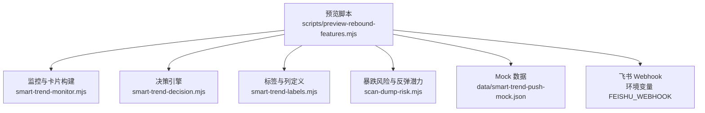
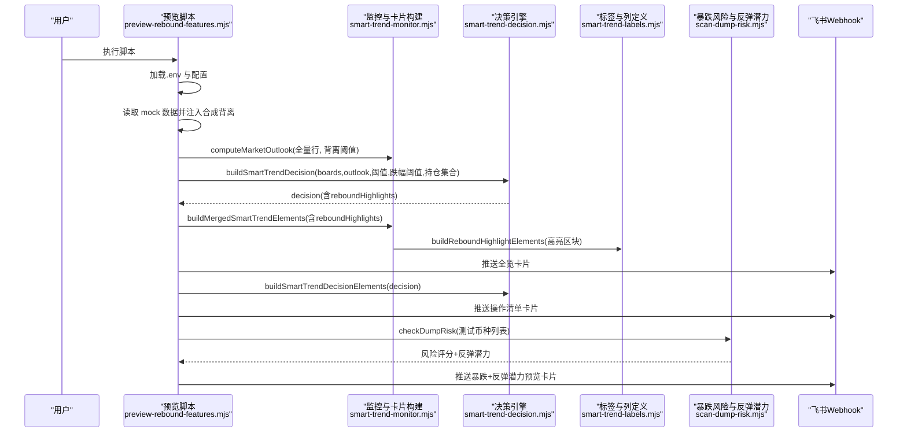
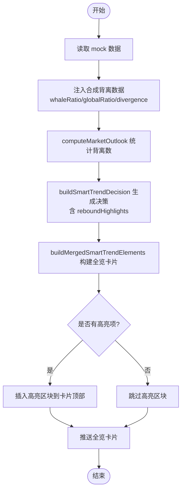
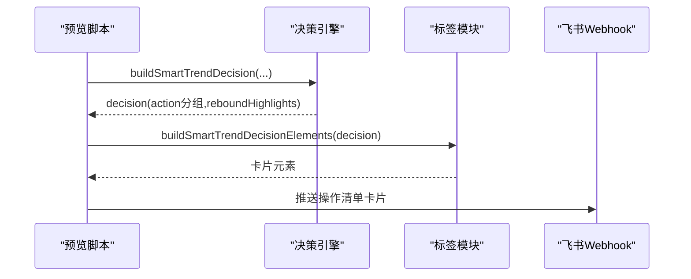
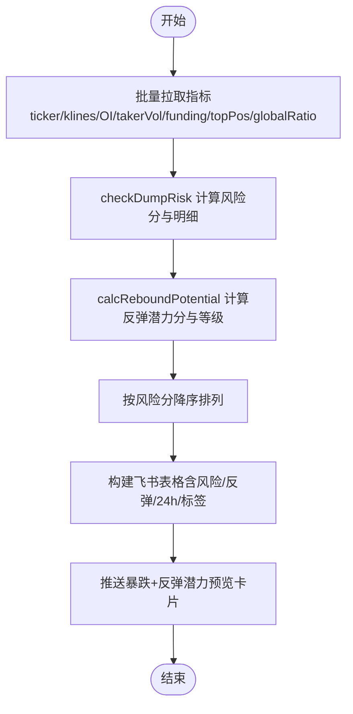
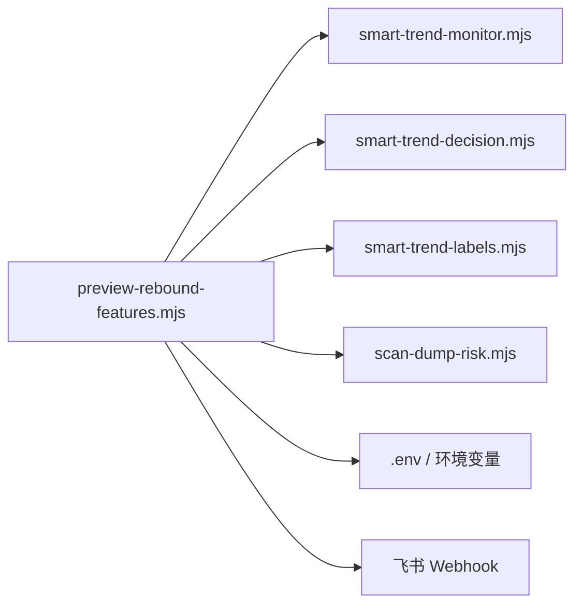

# 反弹功能预览脚本

<cite>
**本文引用的文件**   
- [scripts/preview-rebound-features.mjs](file://scripts/preview-rebound-features.mjs)
- [smart-trend-monitor.mjs](file://smart-trend-monitor.mjs)
- [smart-trend-decision.mjs](file://smart-trend-decision.mjs)
- [smart-trend-labels.mjs](file://smart-trend-labels.mjs)
- [scan-dump-risk.mjs](file://scan-dump-risk.mjs)
- [data/smart-trend-push-mock.json](file://data/smart-trend-push-mock.json)
- [docs/rebound-opportunity-requirements.md](file://docs/rebound-opportunity-requirements.md)
- [README.md](file://README.md)
- [package.json](file://package.json)
</cite>

## 目录
1. [简介](#简介)
2. [项目结构](#项目结构)
3. [核心组件](#核心组件)
4. [架构总览](#架构总览)
5. [详细组件分析](#详细组件分析)
6. [依赖关系分析](#依赖关系分析)
7. [性能与扩展性](#性能与扩展性)
8. [故障排查指南](#故障排查指南)
9. [结论](#结论)
10. [附录](#附录)

## 简介
本文件围绕“反弹功能预览脚本”进行系统化文档化，聚焦以下能力：
- 背离检测：大户多空比 vs 全网多空比的背离信号识别与展示
- 反弹高亮：在推送卡片顶部对急跌反弹观察币种进行独立高亮区块
- 反弹潜力评分：在暴跌推送中为币种计算并展示反弹潜力分与等级

该预览脚本通过注入合成数据到现有 mock 数据，驱动决策引擎与标签渲染模块，最终向飞书群推送三张卡片：全览卡片、操作清单卡片、暴跌+反弹潜力预览卡片。

## 项目结构
与反弹功能预览相关的代码主要分布在 scripts 与核心逻辑模块中：
- 预览入口：scripts/preview-rebound-features.mjs
- 监控与卡片构建：smart-trend-monitor.mjs
- 决策引擎：smart-trend-decision.mjs
- 标签与表格列定义：smart-trend-labels.mjs
- 暴跌风险与反弹潜力评分：scan-dump-risk.mjs
- Mock 数据：data/smart-trend-push-mock.json
- 需求说明：docs/rebound-opportunity-requirements.md
- 运行环境与脚本：package.json、README.md

图表来源
- [scripts/preview-rebound-features.mjs:70-216](file://scripts/preview-rebound-features.mjs#L70-L216)
- [smart-trend-monitor.mjs:1-200](file://smart-trend-monitor.mjs#L1-L200)
- [smart-trend-decision.mjs:1-200](file://smart-trend-decision.mjs#L1-L200)
- [smart-trend-labels.mjs:200-317](file://smart-trend-labels.mjs#L200-L317)
- [scan-dump-risk.mjs:200-385](file://scan-dump-risk.mjs#L200-L385)
- [data/smart-trend-push-mock.json:1-200](file://data/smart-trend-push-mock.json#L1-L200)

章节来源
- [scripts/preview-rebound-features.mjs:1-222](file://scripts/preview-rebound-features.mjs#L1-L222)
- [smart-trend-monitor.mjs:1-200](file://smart-trend-monitor.mjs#L1-L200)
- [smart-trend-decision.mjs:1-200](file://smart-trend-decision.mjs#L1-L200)
- [smart-trend-labels.mjs:1-200](file://smart-trend-labels.mjs#L1-L200)
- [scan-dump-risk.mjs:1-200](file://scan-dump-risk.mjs#L1-L200)
- [data/smart-trend-push-mock.json:1-200](file://data/smart-trend-push-mock.json#L1-L200)
- [docs/rebound-opportunity-requirements.md:1-211](file://docs/rebound-opportunity-requirements.md#L1-L211)
- [README.md:1-210](file://README.md#L1-L210)
- [package.json:1-22](file://package.json#L1-L22)

## 核心组件
- 预览脚本（入口）
  - 加载环境变量
  - 读取 mock 数据并注入合成背离数据
  - 调用决策引擎生成决策（含 reboundHighlights）
  - 构建全览卡片并推送
  - 构建操作清单卡片并推送
  - 扫描暴跌币并计算反弹潜力，输出预览卡片
- 监控与卡片构建
  - 提供 computeMarketOutlook 用于统计背离数量
  - 提供 buildMergedSmartTrendElements 组装全览卡片元素，支持插入反弹高亮区块
- 决策引擎
  - 根据输入 boards/outlook 与阈值生成 decision，包含 action 分组与 reboundHighlights
- 标签与列定义
  - 提供 formatDivergence 格式化背离值
  - 提供 buildReboundHighlightElements 构建高亮区块
  - 提供 DIGEST_TABLE_COLUMNS/RANKING_TABLE_COLUMNS 等表格列定义
- 暴跌风险与反弹潜力
  - checkDumpRisk 返回风险评分与明细
  - calcReboundPotential 计算反弹潜力分与等级，并返回因子明细

章节来源
- [scripts/preview-rebound-features.mjs:70-216](file://scripts/preview-rebound-features.mjs#L70-L216)
- [smart-trend-monitor.mjs:1-200](file://smart-trend-monitor.mjs#L1-L200)
- [smart-trend-decision.mjs:1-200](file://smart-trend-decision.mjs#L1-L200)
- [smart-trend-labels.mjs:200-317](file://smart-trend-labels.mjs#L200-L317)
- [scan-dump-risk.mjs:200-385](file://scan-dump-risk.mjs#L200-L385)

## 架构总览
预览脚本作为编排器，串联数据注入、决策、卡片构建与推送流程。整体时序如下：

图表来源
- [scripts/preview-rebound-features.mjs:70-216](file://scripts/preview-rebound-features.mjs#L70-L216)
- [smart-trend-monitor.mjs:1-200](file://smart-trend-monitor.mjs#L1-L200)
- [smart-trend-decision.mjs:1-200](file://smart-trend-decision.mjs#L1-L200)
- [smart-trend-labels.mjs:200-317](file://smart-trend-labels.mjs#L200-L317)
- [scan-dump-risk.mjs:200-385](file://scan-dump-risk.mjs#L200-L385)

## 详细组件分析

### 背离检测与高亮
- 合成数据注入
  - 基于 mock 数据的 ratio 字段，按区间模拟大户多空比与全网多空比，并计算背离度 divergence = whaleRatio - globalRatio
  - 当 divergence ≥ 0.25 且满足大户偏多、散户偏空条件时，注入 change24h 以触发反弹高亮
- 市场研判
  - 使用 computeMarketOutlook 汇总背离信号数量，供全览卡片标题与正文使用
- 高亮区块
  - 决策引擎输出 reboundHighlights；标签模块提供 buildReboundHighlightElements 将高亮项渲染为 markdown 区块
  - 监控模块在全览卡片固定监控板块之前插入高亮区块

图表来源
- [scripts/preview-rebound-features.mjs:70-133](file://scripts/preview-rebound-features.mjs#L70-L133)
- [smart-trend-monitor.mjs:1-200](file://smart-trend-monitor.mjs#L1-L200)
- [smart-trend-decision.mjs:1-200](file://smart-trend-decision.mjs#L1-L200)
- [smart-trend-labels.mjs:200-317](file://smart-trend-labels.mjs#L200-L317)

章节来源
- [scripts/preview-rebound-features.mjs:41-133](file://scripts/preview-rebound-features.mjs#L41-L133)
- [smart-trend-monitor.mjs:1-200](file://smart-trend-monitor.mjs#L1-L200)
- [smart-trend-decision.mjs:1-200](file://smart-trend-decision.mjs#L1-L200)
- [smart-trend-labels.mjs:200-317](file://smart-trend-labels.mjs#L200-L317)
- [docs/rebound-opportunity-requirements.md:7-66](file://docs/rebound-opportunity-requirements.md#L7-L66)

### 操作清单卡片与反弹观察
- 决策引擎根据 boards/outlook 与阈值生成 action 视图，其中 rebound_watch 表示超跌反弹观察
- 操作清单卡片由 buildSmartTrendDecisionElements 构建，并在标题中显示反弹观察数量
- 高亮阈值 REBOUND_HIGHLIGHT_CHANGE_PCT 控制仅对跌幅较大的反弹观察进行高亮

图表来源
- [scripts/preview-rebound-features.mjs:136-148](file://scripts/preview-rebound-features.mjs#L136-L148)
- [smart-trend-decision.mjs:1-200](file://smart-trend-decision.mjs#L1-L200)
- [smart-trend-labels.mjs:1-200](file://smart-trend-labels.mjs#L1-L200)

章节来源
- [scripts/preview-rebound-features.mjs:136-148](file://scripts/preview-rebound-features.mjs#L136-L148)
- [smart-trend-decision.mjs:1-200](file://smart-trend-decision.mjs#L1-L200)
- [docs/rebound-opportunity-requirements.md:69-116](file://docs/rebound-opportunity-requirements.md#L69-L116)

### 暴跌推送与反弹潜力评分
- 暴跌风险评估
  - checkDumpRisk 并行拉取 ticker/klines/OI/takerVol/funding/topPos/globalRatio 等多源数据，综合打分
- 反弹潜力评分
  - calcReboundPotential 从 RSI6、跌幅深度、大户偏多、散户偏空、背离、缩量止跌、下影线等因子加权计算 0~100 分
  - 分数分级：≥60 高反弹潜力，40~59 中等，<40 低
- 预览脚本对一组测试币种逐一评估，并按风险分排序，输出带“反弹”列的飞书卡片

图表来源
- [scan-dump-risk.mjs:21-198](file://scan-dump-risk.mjs#L21-L198)
- [scan-dump-risk.mjs:256-342](file://scan-dump-risk.mjs#L256-L342)
- [scripts/preview-rebound-features.mjs:150-213](file://scripts/preview-rebound-features.mjs#L150-L213)

章节来源
- [scan-dump-risk.mjs:21-198](file://scan-dump-risk.mjs#L21-L198)
- [scan-dump-risk.mjs:256-342](file://scan-dump-risk.mjs#L256-L342)
- [scripts/preview-rebound-features.mjs:150-213](file://scripts/preview-rebound-features.mjs#L150-L213)
- [docs/rebound-opportunity-requirements.md:119-186](file://docs/rebound-opportunity-requirements.md#L119-L186)

## 依赖关系分析
- 预览脚本依赖
  - smart-trend-monitor.mjs：computeMarketOutlook、buildMergedSmartTrendElements
  - smart-trend-decision.mjs：buildSmartTrendDecision、buildSmartTrendDecisionElements
  - smart-trend-labels.mjs：DIGEST_TABLE_COLUMNS、buildReboundHighlightElements、formatDivergence
  - scan-dump-risk.mjs：checkDumpRisk、calcReboundPotential
- 外部依赖
  - 飞书 Webhook：FEISHU_WEBHOOK、SMART_TREND_DECISION_WEBHOOK
  - 环境变量：SMART_TREND_DIVERGENCE_THRESHOLD、REBOUND_HIGHLIGHT_CHANGE_PCT、SMART_TREND_MIN_RANKING_VOLUME_24H

图表来源
- [scripts/preview-rebound-features.mjs:1-20](file://scripts/preview-rebound-features.mjs#L1-L20)
- [scripts/preview-rebound-features.mjs:70-216](file://scripts/preview-rebound-features.mjs#L70-L216)

章节来源
- [scripts/preview-rebound-features.mjs:1-20](file://scripts/preview-rebound-features.mjs#L1-L20)
- [scripts/preview-rebound-features.mjs:70-216](file://scripts/preview-rebound-features.mjs#L70-L216)

## 性能与扩展性
- 并发拉取
  - 暴跌风险评估中对多个 API 使用 Promise.all 并发获取，降低延迟
  - 全市场扫描采用 pmap 控制并发度，避免请求风暴
- 阈值可配
  - 背离阈值 SMART_TREND_DIVERGENCE_THRESHOLD、反弹高亮跌幅阈值 REBOUND_HIGHLIGHT_CHANGE_PCT 均可通过环境变量调整
- 可扩展点
  - 新增因子：可在 calcReboundPotential 中增加新的评分因子
  - 高亮规则：可在决策引擎或标签模块中扩展高亮条件与展示样式
  - 推送渠道：sendFeishuCard 可抽象为统一推送适配器，便于接入其他平台

[本节为通用指导，不直接分析具体文件]

## 故障排查指南
- 未配置飞书 Webhook
  - 现象：抛出“FEISHU_WEBHOOK 未配置”错误
  - 处理：在 .env 中设置 FEISHU_WEBHOOK，并确保机器人可用
- 网络异常或 API 限流
  - 现象：部分 API 拉取失败或超时
  - 处理：检查代理与环境变量，适当降低并发或重试
- 数据缺失导致展示异常
  - 现象：无全网多空比数据的币种，背离列显示“-”
  - 处理：确保上游数据源稳定，或在注入阶段做容错填充
- 端口占用与服务重启
  - 现象：启动时报端口占用
  - 处理：使用 dev:restart 自动清理旧进程，或手动释放端口

章节来源
- [scripts/preview-rebound-features.mjs:70-74](file://scripts/preview-rebound-features.mjs#L70-L74)
- [README.md:40-53](file://README.md#L40-L53)

## 结论
预览脚本将背离检测、反弹高亮与反弹潜力评分整合到统一的飞书推送流程中，既可用于验证新功能效果，也可作为日常监控的补充视角。通过合成数据注入与模块化设计，系统具备良好的可配置性与扩展性，便于后续持续优化评分模型与展示策略。

[本节为总结性内容，不直接分析具体文件]

## 附录
- 关键环境变量
  - FEISHU_WEBHOOK：飞书机器人 Webhook URL
  - SMART_TREND_DIVERGENCE_THRESHOLD：背离阈值（默认 0.25）
  - REBOUND_HIGHLIGHT_CHANGE_PCT：反弹高亮跌幅阈值（默认 15）
  - SMART_TREND_MIN_RANKING_VOLUME_24H：最小成交额过滤
- 相关需求文档
  - 急跌反弹机会捕获需求：包含背离检测、高亮推送与反弹潜力评分的详细验收标准

章节来源
- [scripts/preview-rebound-features.mjs:75-77](file://scripts/preview-rebound-features.mjs#L75-L77)
- [docs/rebound-opportunity-requirements.md:1-211](file://docs/rebound-opportunity-requirements.md#L1-L211)