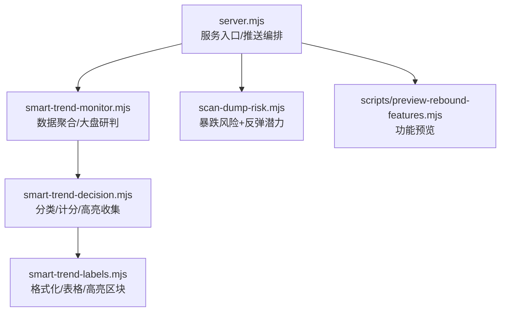
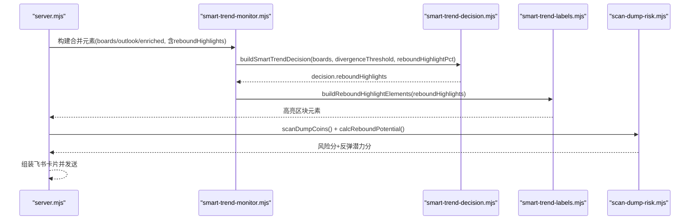
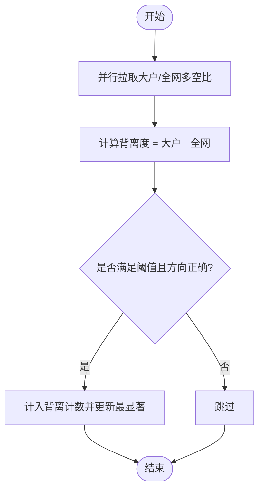
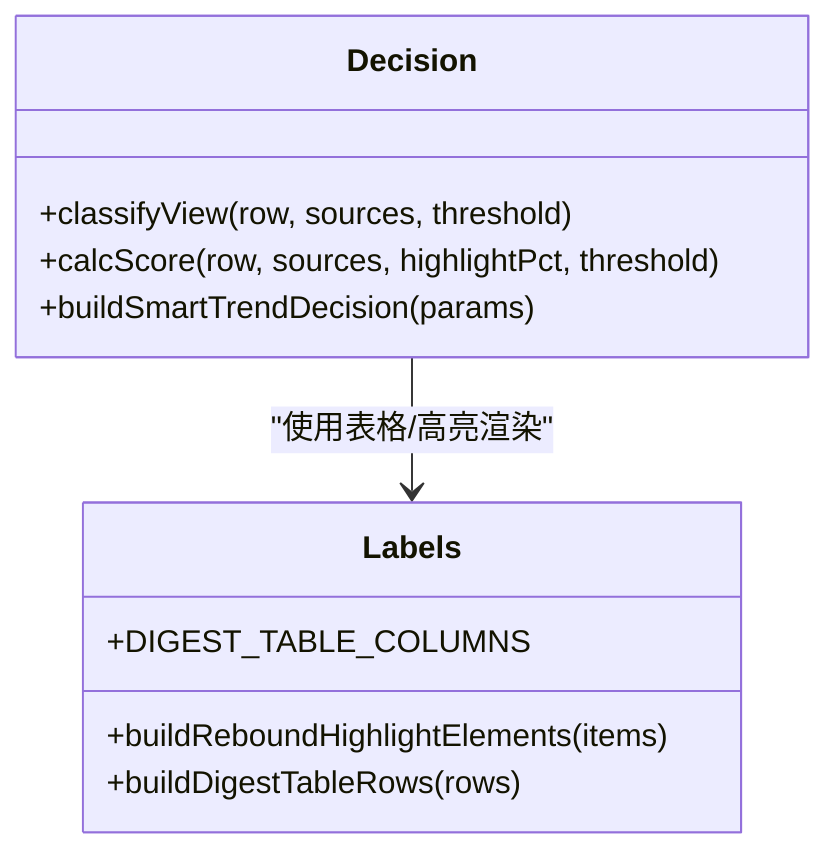
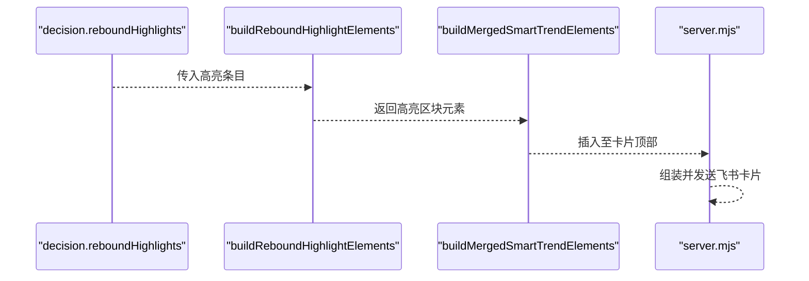
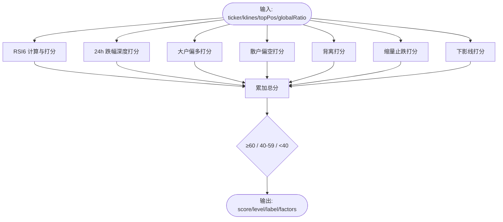
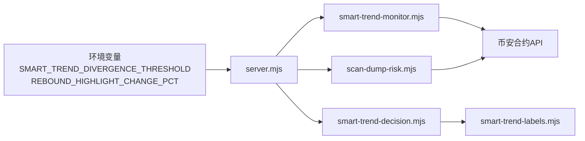

# 反弹机会捕获需求文档

<cite>
**本文引用的文件**
- [docs/rebound-opportunity-requirements.md](file://docs/rebound-opportunity-requirements.md)
- [smart-trend-monitor.mjs](file://smart-trend-monitor.mjs)
- [smart-trend-decision.mjs](file://smart-trend-decision.mjs)
- [smart-trend-labels.mjs](file://smart-trend-labels.mjs)
- [scan-dump-risk.mjs](file://scan-dump-risk.mjs)
- [server.mjs](file://server.mjs)
- [scripts/preview-rebound-features.mjs](file://scripts/preview-rebound-features.mjs)
</cite>

## 目录
1. [引言](#引言)
2. [项目结构](#项目结构)
3. [核心组件](#核心组件)
4. [架构总览](#架构总览)
5. [详细组件分析](#详细组件分析)
6. [依赖关系分析](#依赖关系分析)
7. [性能与可用性考量](#性能与可用性考量)
8. [故障排查指南](#故障排查指南)
9. [结论](#结论)
10. [附录：验收清单与配置项](#附录验收清单与配置项)

## 引言
本需求文档围绕“急跌反弹机会捕获”展开，目标是在现有聪明钱监控与推送体系基础上，增强对暴跌后反弹机会的识别与呈现。重点包括：
- 大户 vs 散户多空比背离检测与展示
- rebound_watch 信号的高亮独立区块
- 暴跌推送中增加“反弹潜力评分”，辅助区分“该逃的”和“可观察反弹的”

上述能力已在需求文档中明确定义，并在代码库中具备相应实现基础或预留接口。

## 项目结构
本项目为币安合约聪明钱监控工具，包含 Web 面板、定时扫描与飞书推送等模块。与反弹机会相关的关键文件如下：
- 需求说明：docs/rebound-opportunity-requirements.md
- 趋势监控与数据聚合：smart-trend-monitor.mjs
- 决策引擎（分类、计分、高亮收集）：smart-trend-decision.mjs
- 标签与表格渲染：smart-trend-labels.mjs
- 暴跌风险与反弹潜力评估：scan-dump-risk.mjs
- 服务入口与推送编排：server.mjs
- 功能预览脚本：scripts/preview-rebound-features.mjs

图表来源
- [server.mjs:580-620](file://server.mjs#L580-L620)
- [smart-trend-monitor.mjs:351-406](file://smart-trend-monitor.mjs#L351-L406)
- [smart-trend-decision.mjs:579-690](file://smart-trend-decision.mjs#L579-L690)
- [smart-trend-labels.mjs:207-236](file://smart-trend-labels.mjs#L207-L236)
- [scan-dump-risk.mjs:256-342](file://scan-dump-risk.mjs#L256-L342)
- [scripts/preview-rebound-features.mjs:94-133](file://scripts/preview-rebound-features.mjs#L94-L133)

章节来源
- [docs/rebound-opportunity-requirements.md:1-211](file://docs/rebound-opportunity-requirements.md#L1-L211)

## 核心组件
- 背离检测与统计
  - 在单币种扫描时并行拉取大户与全网多空比，计算背离度并缓存；在大盘研判中统计背离数量与最显著标的。
- 决策分类与加分
  - 分类逻辑中引入背离条件分支，降低 rebound_watch 触发门槛；计分逻辑中对背离信号加分。
- 高亮区块
  - 决策输出中包含 reboundHighlights 列表；渲染层提供独立高亮区块函数，用于卡片顶部突出显示。
- 暴跌推送中的反弹潜力评分
  - 基于 RSI、跌幅深度、多空比、背离、缩量止跌、下影线等多因子加权评分，输出等级与颜色标识。

章节来源
- [smart-trend-monitor.mjs:351-406](file://smart-trend-monitor.mjs#L351-L406)
- [smart-trend-monitor.mjs:576-693](file://smart-trend-monitor.mjs#L576-L693)
- [smart-trend-decision.mjs:266-329](file://smart-trend-decision.mjs#L266-L329)
- [smart-trend-decision.mjs:657-690](file://smart-trend-decision.mjs#L657-L690)
- [smart-trend-labels.mjs:199-236](file://smart-trend-labels.mjs#L199-L236)
- [scan-dump-risk.mjs:256-342](file://scan-dump-risk.mjs#L256-L342)

## 架构总览
整体流程：服务启动后，定时任务调用监控与决策模块，生成全量研判与操作清单；同时暴跌扫描模块独立运行，产出风险与反弹潜力结果；最终由 server 统一组装并推送到飞书。

图表来源
- [server.mjs:2104-2105](file://server.mjs#L2104-L2105)
- [smart-trend-decision.mjs:579-690](file://smart-trend-decision.mjs#L579-L690)
- [smart-trend-labels.mjs:207-236](file://smart-trend-labels.mjs#L207-L236)
- [scan-dump-risk.mjs:256-342](file://scan-dump-risk.mjs#L256-L342)

## 详细组件分析

### 背离检测与大盘研判
- 数据采集
  - 在单币种扫描中并行获取大户多空比与全网多空比，计算背离度并写入行数据。
- 大盘统计
  - computeMarketOutlook 累计背离信号数量，记录最显著背离标的及数值。
- 输出
  - 总体研判卡片新增“大户 vs 散户背离”段落；榜单表格新增“背离”列，红色标注显著背离。

图表来源
- [smart-trend-monitor.mjs:351-406](file://smart-trend-monitor.mjs#L351-L406)
- [smart-trend-monitor.mjs:576-693](file://smart-trend-monitor.mjs#L576-L693)
- [smart-trend-labels.mjs:256-276](file://smart-trend-labels.mjs#L256-L276)

章节来源
- [smart-trend-monitor.mjs:351-406](file://smart-trend-monitor.mjs#L351-L406)
- [smart-trend-monitor.mjs:576-693](file://smart-trend-monitor.mjs#L576-L693)
- [smart-trend-labels.mjs:199-205](file://smart-trend-labels.mjs#L199-L205)
- [smart-trend-labels.mjs:256-276](file://smart-trend-labels.mjs#L256-L276)

### 决策分类与计分（含背离加分）
- 分类逻辑
  - classifyView 中当存在背离信号时，将 rebound_watch 触发门槛从 -10% 降至 -5%，更易捕捉反转候选。
- 计分逻辑
  - calcScore 对背离信号额外加分，提升其进入 action/watch 的概率。
- 高亮收集
  - buildSmartTrendDecision 收集 rebound_watch 且跌幅达到阈值的标的，形成 reboundHighlights 供渲染使用。

图表来源
- [smart-trend-decision.mjs:266-329](file://smart-trend-decision.mjs#L266-L329)
- [smart-trend-decision.mjs:657-690](file://smart-trend-decision.mjs#L657-L690)
- [smart-trend-labels.mjs:207-236](file://smart-trend-labels.mjs#L207-L236)

章节来源
- [smart-trend-decision.mjs:266-329](file://smart-trend-decision.mjs#L266-L329)
- [smart-trend-decision.mjs:657-690](file://smart-trend-decision.mjs#L657-L690)

### 反弹高亮区块渲染
- 输入
  - decision.reboundHighlights（来自决策模块），包含 label、price、change24h、ratio、divergence 等字段。
- 渲染
  - buildReboundHighlightElements 生成卡片顶部的独立高亮区块，强调“先等价格确认”。
- 集成
  - 在合并元素构建时，将高亮区块插入到固定监控板块之前，确保醒目位置。

图表来源
- [smart-trend-decision.mjs:657-690](file://smart-trend-decision.mjs#L657-L690)
- [smart-trend-labels.mjs:207-236](file://smart-trend-labels.mjs#L207-L236)
- [smart-trend-monitor.mjs:808-817](file://smart-trend-monitor.mjs#L808-L817)
- [server.mjs:2104-2105](file://server.mjs#L2104-L2105)

章节来源
- [smart-trend-labels.mjs:207-236](file://smart-trend-labels.mjs#L207-L236)
- [smart-trend-monitor.mjs:808-817](file://smart-trend-monitor.mjs#L808-L817)

### 暴跌推送中的反弹潜力评分
- 评分模型
  - 综合 RSI6 超卖/偏低、24h 跌幅深度、大户偏多、散户偏空、背离、缩量止跌、长下影线等因子加权得分。
- 等级划分
  - ≥60 高反弹潜力；40-59 中等；<40 低。
- 推送展示
  - server 在暴跌推送表格中新增“反弹”列，按等级着色；标题中高亮高反弹潜力数量。

图表来源
- [scan-dump-risk.mjs:256-342](file://scan-dump-risk.mjs#L256-L342)
- [server.mjs:1218-1303](file://server.mjs#L1218-L1303)

章节来源
- [scan-dump-risk.mjs:256-342](file://scan-dump-risk.mjs#L256-L342)
- [server.mjs:1218-1303](file://server.mjs#L1218-L1303)

## 依赖关系分析
- 环境变量
  - SMART_TREND_DIVERGENCE_THRESHOLD：控制背离阈值，默认 0.25。
  - REBOUND_HIGHLIGHT_CHANGE_PCT：控制反弹高亮跌幅阈值，默认 15。
- 模块耦合
  - monitor 负责采集与统计，decision 负责分类与计分，labels 负责渲染，server 负责编排与推送。
- 外部依赖
  - 币安合约 API（fapi.binance.com）用于 K 线、资金费率、持仓量、多空比等数据。

图表来源
- [server.mjs:590-592](file://server.mjs#L590-L592)
- [server.mjs:2104-2105](file://server.mjs#L2104-L2105)

章节来源
- [server.mjs:590-592](file://server.mjs#L590-L592)
- [server.mjs:2104-2105](file://server.mjs#L2104-L2105)

## 性能与可用性考量
- 并发与限流
  - 暴跌扫描采用并发映射，避免串行阻塞；飞书推送内置重试与频控处理。
- 数据回退
  - 无全网多空比数据的币种，背离列显示占位符且不报错；RSI/多空比缺失时仅按可用因子评分。
- 阈值可调
  - 背离阈值与高亮跌幅阈值均可通过环境变量调整，便于在不同市场环境下微调灵敏度。

[本节为通用指导，不直接分析具体文件]

## 故障排查指南
- 推送未出现高亮区块
  - 检查 decision.reboundHighlights 是否为空；确认 |change24h| 是否达到 REBOUND_HIGHLIGHT_CHANGE_PCT。
- 背离列无数据
  - 确认 topLongShortPositionRatio 与 globalLongShortAccountRatio 接口返回正常；若缺失则显示占位符。
- 反弹潜力评分异常
  - 核对 klines/ticker/topPos/globalRatio 数据完整性；部分因子缺失时仅按可用因子计算。

章节来源
- [smart-trend-decision.mjs:657-690](file://smart-trend-decision.mjs#L657-L690)
- [smart-trend-labels.mjs:199-205](file://smart-trend-labels.mjs#L199-L205)
- [scan-dump-risk.mjs:256-342](file://scan-dump-risk.mjs#L256-L342)

## 结论
通过在监控、决策与推送链路中引入背离检测、反弹高亮与反弹潜力评分，系统能够更及时地识别暴跌后的潜在反弹机会，并以醒目的方式呈现给用户，提高交易窗口把握能力。所有关键阈值均支持环境配置，便于灵活适配不同市场环境。

[本节为总结性内容，不直接分析具体文件]

## 附录：验收清单与配置项

- 验收要点
  - 背离列显示与统计段落：在总体研判卡片与榜单表格中体现背离信号与最显著标的。
  - 反弹高亮区块：在卡片顶部（时间标题之后、固定监控之前）展示符合跌幅阈值的 rebound_watch 标的。
  - 暴跌推送“反弹”列：展示反弹潜力分与等级颜色，标题中标注高反弹潜力数量。
  - 容错：缺失数据时显示占位符且不报错。

- 配置项
  - SMART_TREND_DIVERGENCE_THRESHOLD：背离阈值，默认 0.25。
  - REBOUND_HIGHLIGHT_CHANGE_PCT：反弹高亮跌幅阈值，默认 15。

章节来源
- [docs/rebound-opportunity-requirements.md:1-211](file://docs/rebound-opportunity-requirements.md#L1-L211)
- [server.mjs:590-592](file://server.mjs#L590-L592)
- [server.mjs:2104-2105](file://server.mjs#L2104-L2105)
- [scripts/preview-rebound-features.mjs:74-75](file://scripts/preview-rebound-features.mjs#L74-L75)