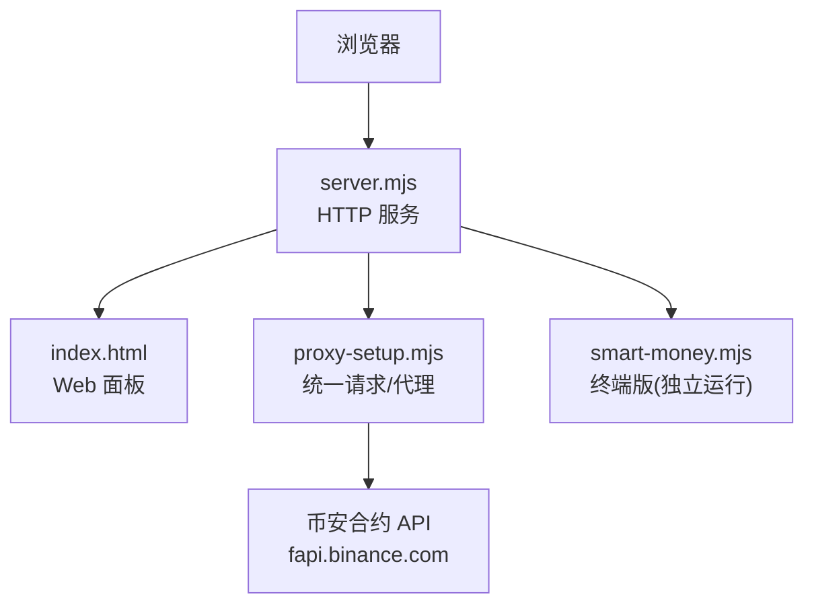
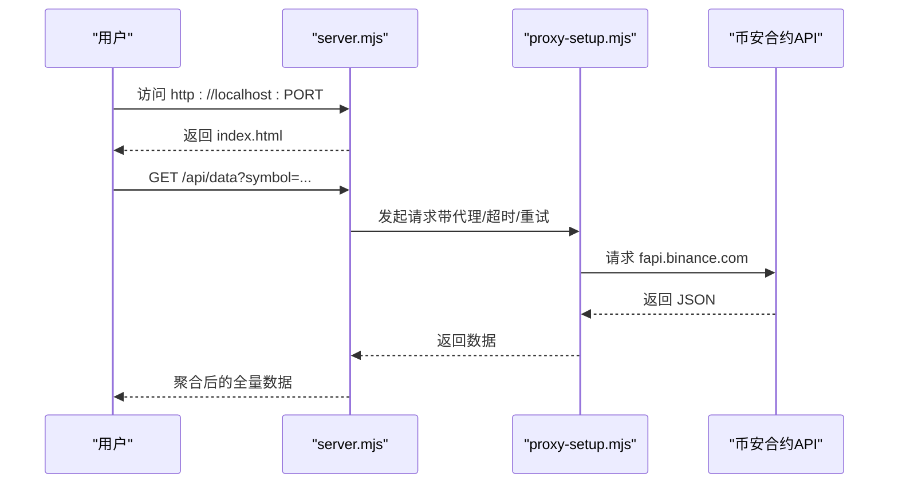
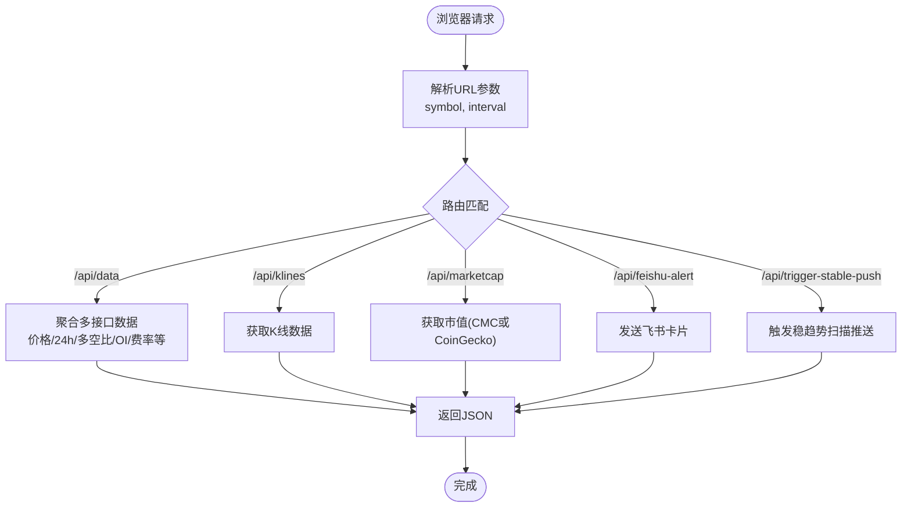
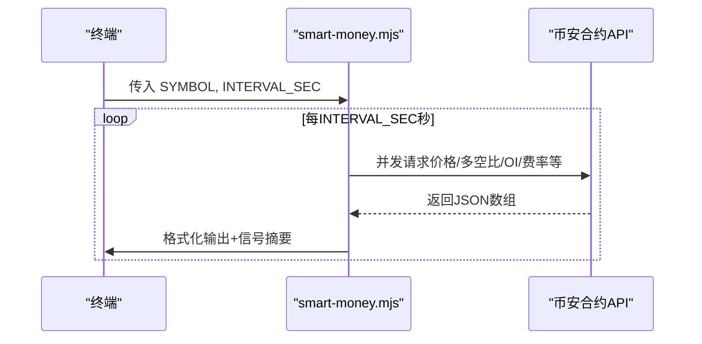
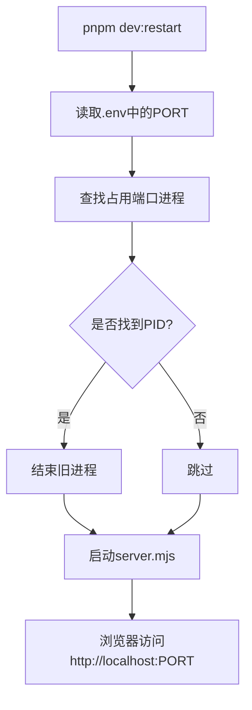
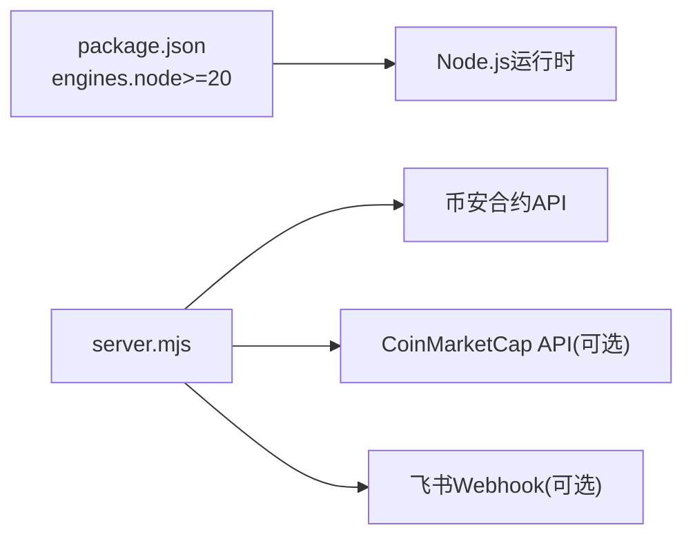

# 快速开始

<cite>
**本文引用的文件**   
- [README.md](file://README.md)
- [package.json](file://package.json)
- [server.mjs](file://server.mjs)
- [dev-restart.mjs](file://dev-restart.mjs)
- [smart-money.mjs](file://smart-money.mjs)
- [proxy-setup.mjs](file://proxy-setup.mjs)
- [ecosystem.config.cjs](file://ecosystem.config.cjs)
- [index.html](file://index.html)
</cite>

## 目录
1. [简介](#简介)
2. [项目结构](#项目结构)
3. [核心组件](#核心组件)
4. [架构总览](#架构总览)
5. [详细组件分析](#详细组件分析)
6. [依赖关系分析](#依赖关系分析)
7. [性能与稳定性建议](#性能与稳定性建议)
8. [故障排查指南](#故障排查指南)
9. [结论](#结论)
10. [附录：常用命令与环境变量](#附录常用命令与环境变量)

## 简介
BinaceSmart 是基于币安合约 API 的实时聪明钱监控工具，提供 Web 面板和终端两种使用方式。Web 端支持 K 线图、RSI、大户多空比、主动买卖量等指标；终端版适合在命令行中快速查看关键数据与信号摘要。

## 项目结构
- 入口与脚本
  - server.mjs：Node.js HTTP 服务，提供 Web 页面与 API 代理
  - dev-restart.mjs：开发时自动释放端口并启动服务
  - smart-money.mjs：终端版监控脚本
  - ecosystem.config.cjs：PM2 进程管理配置（可选）
- 前端资源
  - index.html：Web 面板主页面
- 网络与代理
  - proxy-setup.mjs：统一请求封装，支持通过环境变量启用代理（Windows 下优先 curl）
- 其他辅助脚本与数据文件位于 scripts/ 与 data/ 目录

图表来源
- [server.mjs:1-10](file://server.mjs#L1-L10)
- [proxy-setup.mjs:1-20](file://proxy-setup.mjs#L1-L20)
- [index.html:2076-2100](file://index.html#L2076-L2100)

章节来源
- [README.md:1-40](file://README.md#L1-L40)
- [package.json:1-22](file://package.json#L1-L22)

## 核心组件
- Web 服务（server.mjs）
  - 加载 .env 环境变量
  - 监听端口（默认 3388），提供静态页面与 API 路由
  - 代理币安合约 API，内置重试与错误处理
  - 定时任务：稳趋势推送、智能趋势扫描、持仓健康检查等
- 终端监控（smart-money.mjs）
  - 读取命令行参数（币种、刷新间隔）
  - 并发拉取价格、大户多空比、全网多空比、持仓量、主动买卖量、资金费率等
  - 彩色输出与信号摘要
- 代理与网络（proxy-setup.mjs）
  - 从环境变量读取代理地址
  - Windows + 代理场景优先使用 curl 发起请求，避免 Node fetch 代理不稳定问题
- 开发重启（dev-restart.mjs）
  - 解析 .env 中的 PORT
  - 查找占用端口进程并结束，再启动 server.mjs
- PM2 配置（ecosystem.config.cjs）
  - 生产环境进程守护、日志、自动重启等

章节来源
- [server.mjs:31-48](file://server.mjs#L31-L48)
- [server.mjs:58-82](file://server.mjs#L58-L82)
- [server.mjs:2014-2016](file://server.mjs#L2014-L2016)
- [smart-money.mjs:1-10](file://smart-money.mjs#L1-L10)
- [proxy-setup.mjs:6-23](file://proxy-setup.mjs#L6-L23)
- [dev-restart.mjs:11-20](file://dev-restart.mjs#L11-L20)
- [ecosystem.config.cjs:1-33](file://ecosystem.config.cjs#L1-L33)

## 架构总览
系统由“Web 服务 + 终端脚本”组成。Web 服务负责：
- 提供静态页面与 API
- 代理币安合约接口，屏蔽跨域与地区限制
- 执行定时扫描与飞书推送
终端脚本独立运行，直接调用币安合约 API 展示关键指标。

图表来源
- [server.mjs:1749-1770](file://server.mjs#L1749-L1770)
- [proxy-setup.mjs:49-71](file://proxy-setup.mjs#L49-L71)

## 详细组件分析

### Web 面板与 API
- 启动后访问 http://localhost:3388（端口可通过 .env 的 PORT 修改）
- 支持的 URL 参数
  - symbol：指定币种，例如 BTCUSDT
  - interval：刷新间隔（秒）
- 主要 API
  - GET /api/data?symbol=SLXUSDT — 聪明钱全量数据
  - GET /api/klines?symbol=SLXUSDT&interval=1h&limit=100 — K 线数据
  - GET /api/marketcap?symbol=BTCUSDT — 单币种市值（优先 CMC，回退 CoinGecko）
  - POST /api/feishu-alert — 发送飞书报警
  - POST /api/trigger-stable-push — 手动触发稳趋势推送

图表来源
- [server.mjs:1749-1770](file://server.mjs#L1749-L1770)
- [server.mjs:1900-1961](file://server.mjs#L1900-L1961)

章节来源
- [README.md:95-111](file://README.md#L95-L111)
- [server.mjs:1749-1770](file://server.mjs#L1749-L1770)
- [server.mjs:1900-1961](file://server.mjs#L1900-L1961)

### 终端版监控
- 用法
  - node smart-money.mjs — 默认监控 SLXUSDT，每 60 秒刷新
  - node smart-money.mjs BTCUSDT 30 — 自定义币种与间隔
- 功能要点
  - 并发拉取价格、Top 账户多空比、Top 持仓多空比、全网多空比、OI、OI 历史、主动买卖量、资金费率
  - 输出彩色比例与信号摘要（如大户偏多/空、聪明钱抄底信号、资金费率状态）

图表来源
- [smart-money.mjs:39-58](file://smart-money.mjs#L39-L58)
- [smart-money.mjs:137-149](file://smart-money.mjs#L137-L149)

章节来源
- [README.md:113-121](file://README.md#L113-L121)
- [smart-money.mjs:1-10](file://smart-money.mjs#L1-L10)
- [smart-money.mjs:39-149](file://smart-money.mjs#L39-L149)

### 端口管理与开发重启
- dev-restart.mjs 会：
  - 读取 .env 中的 PORT（默认 3388）
  - 查找占用该端口的进程并结束
  - 以 --use-env-proxy 启动 server.mjs
- 若出现端口占用报错，推荐使用 pnpm dev:restart 自动清理旧进程

图表来源
- [dev-restart.mjs:11-20](file://dev-restart.mjs#L11-L20)
- [dev-restart.mjs:54-67](file://dev-restart.mjs#L54-L67)
- [server.mjs:2014-2016](file://server.mjs#L2014-L2016)

章节来源
- [README.md:40-53](file://README.md#L40-L53)
- [dev-restart.mjs:1-79](file://dev-restart.mjs#L1-L79)

### 代理与网络
- 通过环境变量启用代理（HTTPS_PROXY/HTTP_PROXY 等）
- Windows 环境下优先使用 curl 发起请求，避免 Node fetch 代理不可靠
- 统一封装 fetchJson，支持超时与错误提示

章节来源
- [proxy-setup.mjs:6-23](file://proxy-setup.mjs#L6-L23)
- [proxy-setup.mjs:49-71](file://proxy-setup.mjs#L49-L71)

## 依赖关系分析
- 运行时依赖
  - Node.js >= 20（package.json engines 约束）
  - 无第三方 npm 依赖（零依赖设计）
- 外部依赖
  - 币安合约 REST API（fapi.binance.com）
  - 可选：CoinMarketCap Pro API（用于市值字段）
  - 可选：飞书群机器人 Webhook（用于推送）

图表来源
- [package.json:6-8](file://package.json#L6-L8)
- [server.mjs:44-47](file://server.mjs#L44-L47)

章节来源
- [package.json:1-22](file://package.json#L1-L22)
- [README.md:200-206](file://README.md#L200-L206)

## 性能与稳定性建议
- 合理设置刷新间隔（Web 面板 interval 与终端 INTERVAL_SEC），避免过于频繁请求
- 开启 CMC_API_KEY 以获得更稳定的市值数据，减少回退到免费接口的限流风险
- 使用 dev:restart 或 PM2 进行进程守护，提高可用性
- 在 Windows 下如需代理，确保已安装 curl 并使用 --use-env-proxy 启动

[本节为通用建议，不直接分析具体文件]

## 故障排查指南
- 端口被占用（EADDRINUSE :::3388）
  - 使用 pnpm dev:restart 自动释放端口
  - 或在 .env 中修改 PORT 为其他值
- 无法访问币安 API
  - 检查代理是否配置正确（HTTPS_PROXY/HTTP_PROXY）
  - Windows 下优先使用 curl，确认 curl.exe 可用
  - 查看控制台错误信息，必要时降低并发或增大超时
- 飞书推送失败
  - 确认 FEISHU_WEBHOOK 已配置且有效
  - 注意频控与限流，适当调整推送间隔
- 市值数据异常或不全
  - 配置 CMC_API_KEY 提升稳定性
  - 未配置时将回退到 CoinGecko，可能遇到速率限制

章节来源
- [README.md:40-53](file://README.md#L40-L53)
- [proxy-setup.mjs:49-71](file://proxy-setup.mjs#L49-L71)
- [server.mjs:599-644](file://server.mjs#L599-L644)

## 结论
按照本指南，您可以在 5 分钟内完成环境准备、安装依赖、启动服务，并通过 Web 面板或终端版体验聪明钱监控的核心功能。推荐优先使用 pnpm dev:restart 启动，配合 .env 配置端口、飞书与市值 API，以获得稳定体验。

[本节为总结性内容，不直接分析具体文件]

## 附录：常用命令与环境变量

- 环境要求
  - Node.js >= 20

- 安装与启动
  - git clone 仓库并进入目录
  - 安装依赖（pnpm install）
  - Web 面板（推荐）：pnpm dev:restart
  - 终端版：node smart-money.mjs [SYMBOL] [INTERVAL_SEC]

- 端口配置
  - 在 .env 中设置 PORT（默认 3388）

- 基础配置示例（.env）
  - FEISHU_WEBHOOK=https://open.feishu.cn/open-apis/bot/v2/hook/你的webhook地址
  - CMC_API_KEY=你的CoinMarketCap_Pro_API_Key
  - MAX_MARKET_CAP_USD=5000000000（设为 0 关闭过滤）

- Web 面板使用
  - 访问 http://localhost:3388
  - URL 参数：?symbol=BTCUSDT、?interval=30

- 终端版使用
  - node smart-money.mjs
  - node smart-money.mjs BTCUSDT 30

- 常见脚本与命令
  - pnpm dev:restart（自动释放端口并启动）
  - pnpm dev（普通启动）
  - pnpm monitor（预设监控脚本）
  - PM2 相关：ecosystem.config.cjs 定义进程名 binace-smart

章节来源
- [README.md:17-77](file://README.md#L17-L77)
- [README.md:95-121](file://README.md#L95-L121)
- [package.json:9-18](file://package.json#L9-L18)
- [ecosystem.config.cjs:1-33](file://ecosystem.config.cjs#L1-L33)