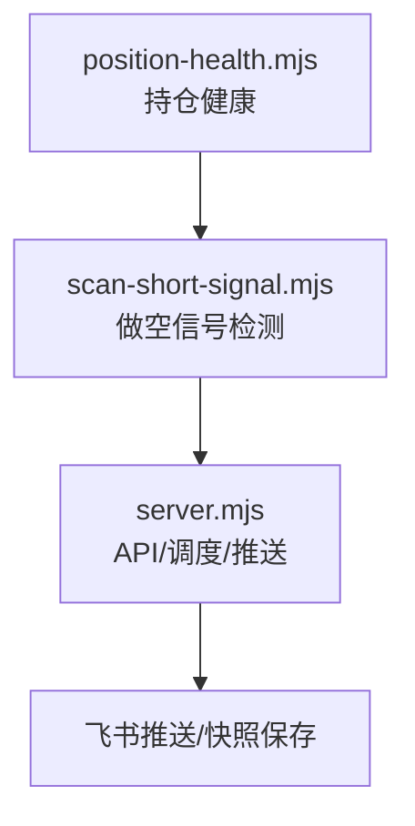
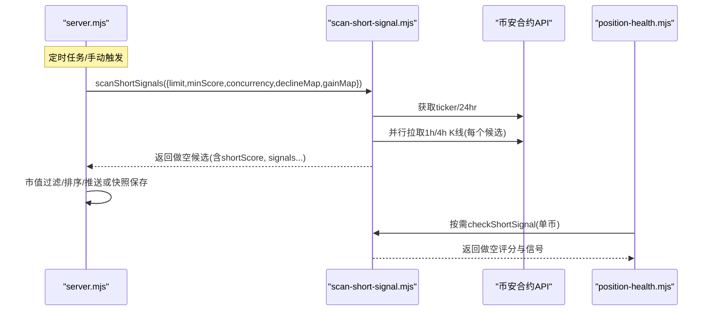
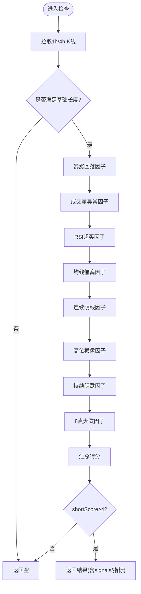
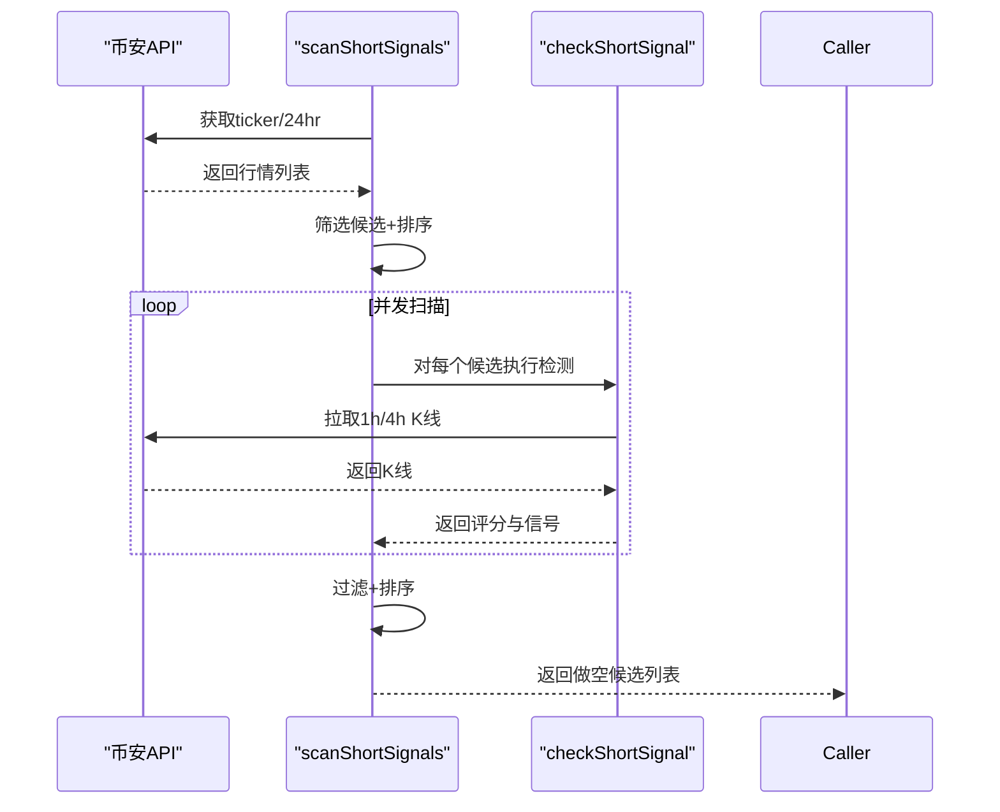
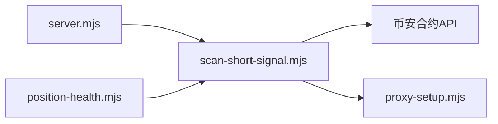

# 做空信号检测

<cite>
**本文引用的文件**   
- [scan-short-signal.mjs](file://scan-short-signal.mjs)
- [server.mjs](file://server.mjs)
- [position-health.mjs](file://position-health.mjs)
- [README.md](file://README.md)
</cite>

## 目录
1. [简介](#简介)
2. [项目结构](#项目结构)
3. [核心组件](#核心组件)
4. [架构总览](#架构总览)
5. [详细组件分析](#详细组件分析)
6. [依赖关系分析](#依赖关系分析)
7. [性能与并发特性](#性能与并发特性)
8. [配置参数说明](#配置参数说明)
9. [实战案例与回测建议](#实战案例与回测建议)
10. [系统集成与推送格式](#系统集成与推送格式)
11. [故障排查指南](#故障排查指南)
12. [结论](#结论)

## 简介
本模块聚焦于“做空信号检测”，基于币安合约K线数据，综合价格形态、成交量异常、RSI超买、均线偏离、连续阴线、高位横盘与持续阴跌等多维因子，对潜在空头趋势进行识别与评分。系统提供候选池筛选、并发扫描、阈值过滤与排序输出，并集成到整体系统的定时任务与推送流程中，支持策略复盘与持仓健康联动。

## 项目结构
- 核心算法与扫描入口：scan-short-signal.mjs
- 服务端集成与调度：server.mjs（联合推送、快照采集）
- 持仓健康联动：position-health.mjs（调用做空信号辅助风控）
- 使用说明与环境变量：README.md

图表来源
- [scan-short-signal.mjs:219-275](file://scan-short-signal.mjs#L219-L275)
- [server.mjs:950-1149](file://server.mjs#L950-L1149)
- [position-health.mjs:1-120](file://position-health.mjs#L1-L120)

章节来源
- [scan-short-signal.mjs:1-276](file://scan-short-signal.mjs#L1-L276)
- [server.mjs:950-1149](file://server.mjs#L950-L1149)
- [position-health.mjs:1-120](file://position-health.mjs#L1-L120)
- [README.md:1-210](file://README.md#L1-L210)

## 核心组件
- checkShortSignal(symbol, options)
  - 输入：币种符号、可选的“自8点涨跌幅”
  - 输出：做空评分、触发信号明细、关键指标（价格、24h涨跌、距峰值回撤、RSI、量比等）
- scanShortSignals(options)
  - 输入：limit、minScore、concurrency、declineMap/gainMap
  - 输出：按分数降序的做空候选列表

章节来源
- [scan-short-signal.mjs:27-204](file://scan-short-signal.mjs#L27-L204)
- [scan-short-signal.mjs:219-275](file://scan-short-signal.mjs#L219-L275)

## 架构总览
做空信号检测在系统中的位置与交互如下：

图表来源
- [server.mjs:950-1149](file://server.mjs#L950-L1149)
- [scan-short-signal.mjs:219-275](file://scan-short-signal.mjs#L219-L275)
- [position-health.mjs:1-120](file://position-health.mjs#L1-L120)

## 详细组件分析

### 做空信号评分引擎（checkShortSignal）
该函数从多因子维度评估做空机会，各因子独立计分并累加为 shortScore；当 shortScore 低于阈值时直接丢弃。

- 短期暴涨后回落（最强信号）
  - 依据：24h涨幅、近24h最高价与当前价的回撤幅度；同时排除“续涨模式”（如近期阳线密集且回撤极小）
  - 计分：根据涨幅与回撤组合分档加分
- 成交量异常（暴增后萎缩）
  - 依据：近4根均量 vs 前20根均量；历史峰值量相对均值倍数
  - 计分：天量后缩量显著加分，放量冲高适度加分
- RSI超买
  - 依据：RSI6与RSI14双周期
  - 计分：超买区间显著加分，偏高区间适度加分
- 偏离均线过远
  - 依据：当前价相对MA20的偏离百分比
  - 计分：偏离越大加分越高
- 连续阴线
  - 依据：近6根K线中阴线数量
  - 计分：连续阴线越多加分越高
- 高位长期横盘
  - 依据：4h级别历史波动区间与当前价相对历史高点的距离
  - 计分：满足条件加分
- 持续阴跌趋势
  - 依据：4h级别阴线比例、累计跌幅、近期加速跌幅
  - 计分：强度不同对应不同加分档位
- 8点来大跌
  - 依据：传入的changeSince8am（若可用）
  - 计分：跌幅越深加分越高

触发条件与置信度
- 最低门槛：shortScore ≥ 4 才视为有效信号
- 置信度：由短Score与信号明细共同体现；高分通常意味着多个因子共振
- 风险指标：包含24h涨跌、距峰值回撤、RSI、量比等，便于后续风控与仓位管理

图表来源
- [scan-short-signal.mjs:27-204](file://scan-short-signal.mjs#L27-L204)

章节来源
- [scan-short-signal.mjs:27-204](file://scan-short-signal.mjs#L27-L204)

### 候选池筛选与并发扫描（scanShortSignals）
- 候选池构建
  - 从全市场USDT交易对筛选：24h涨跌幅>20%或<-15%，或成交额>5000万
  - 补充“下跌地图”中的标的（当日跌幅<-8%且未入选）
  - 按绝对涨跌幅排序，取前limit个
- 并发检测
  - 使用并发度控制（默认3）并行调用checkShortSignal
  - 仅保留shortScore≥minScore的结果
- 排序输出
  - 优先按shortScore降序，其次按距峰值回撤降序

图表来源
- [scan-short-signal.mjs:219-275](file://scan-short-signal.mjs#L219-L275)

章节来源
- [scan-short-signal.mjs:219-275](file://scan-short-signal.mjs#L219-L275)

### 与持仓健康的联动
- position-health.mjs在评估持仓健康时，会调用checkShortSignal以判断标的是否存在做空信号，从而辅助风控决策（例如提示减仓或退出）。

章节来源
- [position-health.mjs:1-120](file://position-health.mjs#L1-L120)

## 依赖关系分析
- 外部依赖
  - 币安合约REST API：fapi.binance.com（K线、行情）
  - 代理与网络容错：通过proxy-setup.mjs封装请求
- 内部依赖
  - server.mjs：负责调度、并发、市值过滤、推送与快照保存
  - position-health.mjs：按需调用做空信号进行风控联动

图表来源
- [scan-short-signal.mjs:1-10](file://scan-short-signal.mjs#L1-L10)
- [server.mjs:950-1149](file://server.mjs#L950-L1149)
- [position-health.mjs:1-120](file://position-health.mjs#L1-L120)

章节来源
- [scan-short-signal.mjs:1-10](file://scan-short-signal.mjs#L1-L10)
- [server.mjs:950-1149](file://server.mjs#L950-L1149)
- [position-health.mjs:1-120](file://position-health.mjs#L1-L120)

## 性能与并发特性
- 并发模型
  - 候选扫描采用自定义pmap实现，默认并发度3，避免过多并发导致API限流
  - 单个币种检测内对1h/4h K线使用Promise.all并行拉取
- 资源占用
  - 每次扫描最多发起N*(1+2)次K线请求（N为候选数），需结合limit与concurrency平衡延迟与吞吐
- 错误处理
  - 扫描过程中捕获异常并跳过失败项，保证整体流程稳定

章节来源
- [scan-short-signal.mjs:206-217](file://scan-short-signal.mjs#L206-L217)
- [scan-short-signal.mjs:264-271](file://scan-short-signal.mjs#L264-L271)

## 配置参数说明
- scanShortSignals参数
  - limit：候选数量上限（默认200）
  - minScore：最小评分阈值（默认4）
  - concurrency：并发度（默认3）
  - declineMap/gainMap：用于补充候选池的“下跌/上涨地图”
- 服务器端集成参数（来自server.mjs）
  - 联合推送中做空扫描：limit=100，minScore=4，concurrency=3
  - 预测快照采集：做空扫描同样使用上述参数
- 环境变量（与系统相关）
  - MAX_MARKET_CAP_USD：市值过滤上限（默认50亿$，可关闭）
  - FEISHU_WEBHOOK：飞书推送Webhook地址
  - LONG_PUSH_HOURS / COMBINED_PUSH_HOURS：推送间隔（小时）
  - PORT：服务端口（默认3388）

章节来源
- [scan-short-signal.mjs:219-275](file://scan-short-signal.mjs#L219-L275)
- [server.mjs:950-1149](file://server.mjs#L950-L1149)
- [README.md:142-154](file://README.md#L142-L154)

## 实战案例与回测建议
- 典型做空场景
  - 暴涨回落：24h大幅上涨后出现明显回撤，叠加天量后缩量与RSI超买，形成强做空信号
  - 高位横盘：4h级别历史涨幅较大但当前价距高点不远，呈现派发迹象
  - 持续阴跌：4h级别阴线比例高、累计跌幅大且近期加速下跌
- 回测建议
  - 使用历史K线与成交数据回放，统计不同阈值（minScore）下的胜率、盈亏比与最大回撤
  - 结合市值过滤与流动性约束（成交额下限）降低滑点与冲击成本
  - 对比不同时间框架（1h/4h）与指标参数（RSI周期、MA周期）的效果差异
  - 将“距峰值回撤”作为出场参考，配合止损止盈策略优化收益曲线

[本节为方法论与经验总结，不直接分析具体代码文件]

## 系统集成与推送格式
- 集成方式
  - server.mjs在“做多+做空联合推送”和“预测快照采集”中调用scanShortSignals，并将结果进行市值过滤、排序与展示
  - 做空结果包含：币种、价格、24h涨跌、距峰值回撤、做空评分、市值、信号标签等
- 推送内容示例字段
  - coin：币种名称
  - price：当前价格
  - chg24h：24h涨跌幅
  - dd：距峰值回撤
  - score：做空评分
  - mc：市值
  - tags：信号标签集合（如“暴涨回落”“天量后缩量”“RSI超买”等）

章节来源
- [server.mjs:1080-1279](file://server.mjs#L1080-L1279)

## 故障排查指南
- 常见问题
  - 无信号输出：检查候选池筛选条件（涨跌幅/成交额）、minScore阈值是否过高
  - 响应缓慢：适当降低limit或concurrency，关注API限流
  - 数据异常：确认代理节点与网络连通性，查看proxy-setup.mjs的错误信息
- 日志定位
  - server.mjs中对做空扫描异常进行了warn记录，便于快速定位问题
- 环境检查
  - 确认MAX_MARKET_CAP_USD设置合理，避免误过滤
  - 确认FEISHU_WEBHOOK已配置，以便接收推送

章节来源
- [server.mjs:1080-1149](file://server.mjs#L1080-L1149)
- [README.md:142-154](file://README.md#L142-L154)

## 结论
做空信号检测模块通过多维度技术因子与严格的候选筛选机制，能够在复杂市场中高效识别潜在空头趋势。其评分体系兼顾强度与稳健性，结合市值过滤与并发优化，既保证了实时性又降低了误报率。通过与系统其他模块（推送、快照、持仓健康）的紧密集成，形成了完整的做空机会发现与风控闭环。建议在实盘中结合回测与风险管理策略，动态调整阈值与参数以获得更优表现。