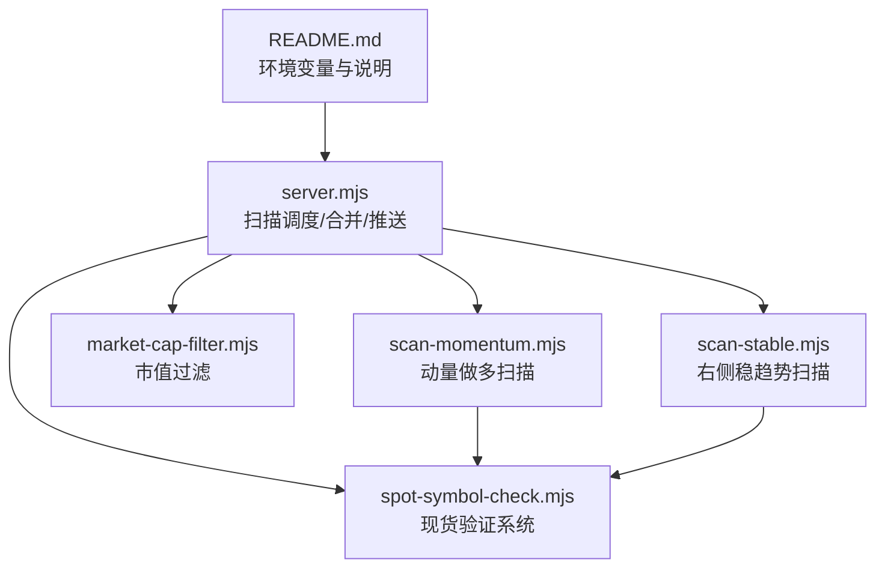
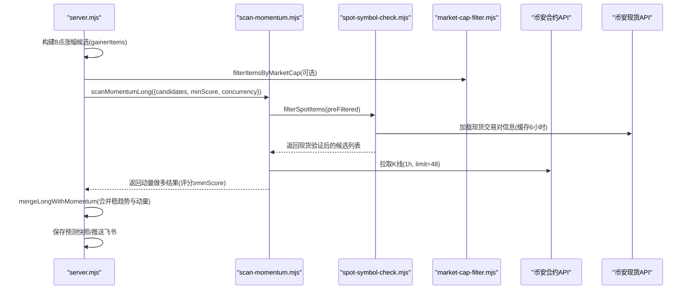
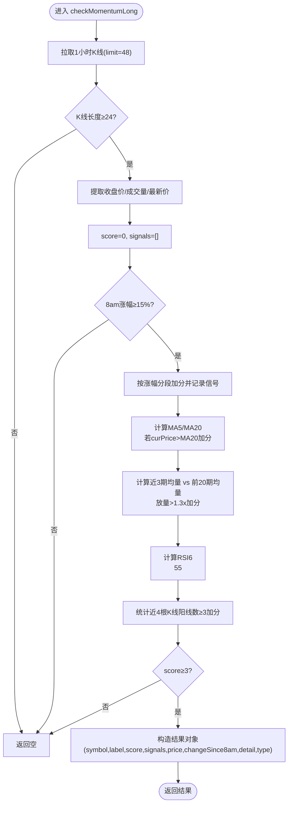
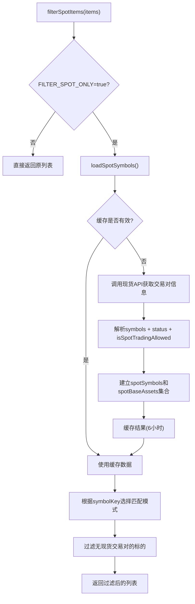
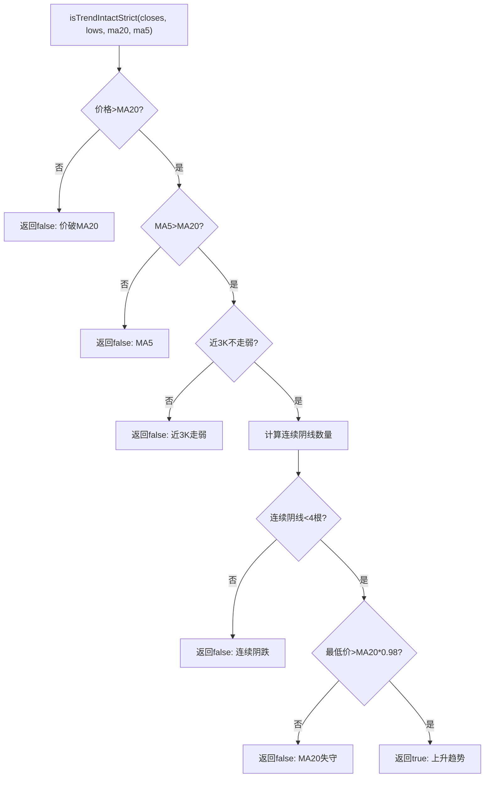
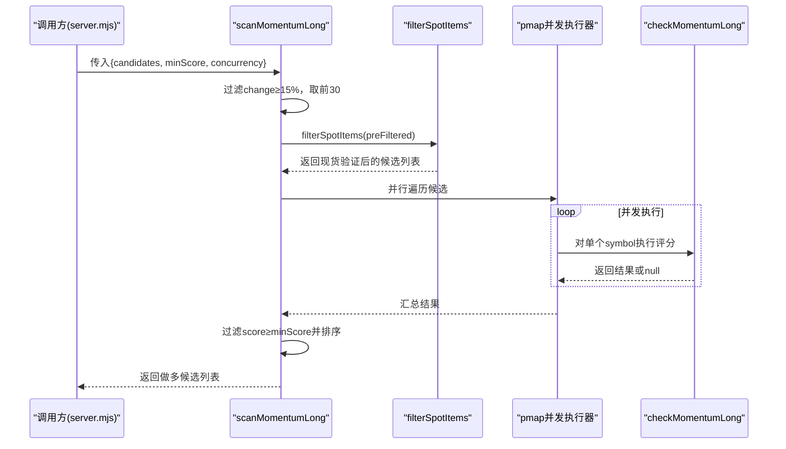
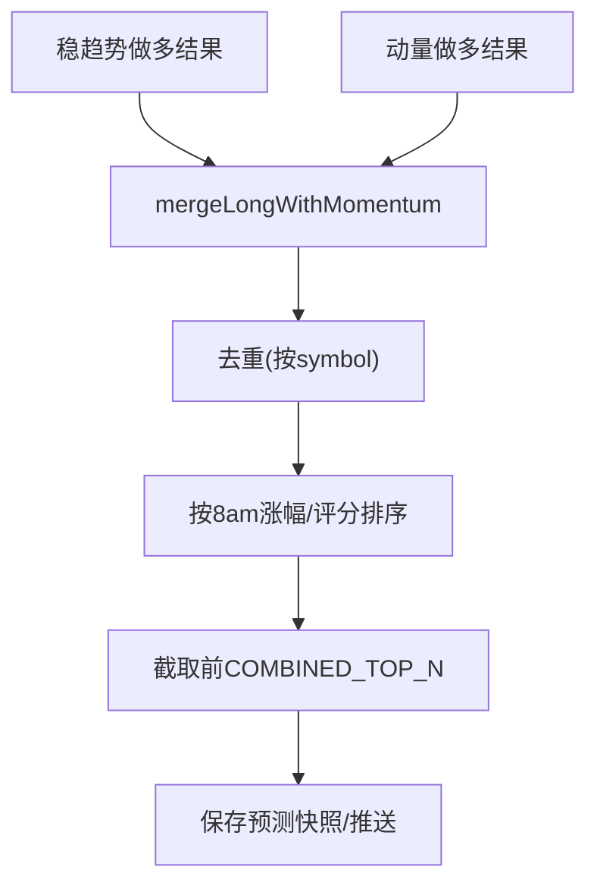
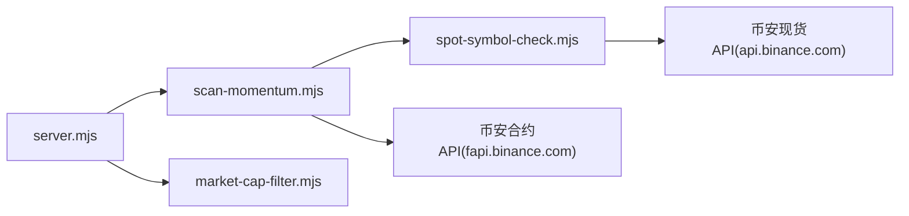

# 动量做多扫描

<cite>
**本文引用的文件**   
- [scan-momentum.mjs](file://scan-momentum.mjs)
- [server.mjs](file://server.mjs)
- [market-cap-filter.mjs](file://market-cap-filter.mjs)
- [spot-symbol-check.mjs](file://spot-symbol-check.mjs)
- [scan-stable.mjs](file://scan-stable.mjs)
- [README.md](file://README.md)
</cite>

## 更新摘要
**所做更改**   
- 新增现货验证系统集成功能说明
- 增强趋势检测能力详解
- 更新架构流程图以反映新的现货过滤机制
- 补充现货验证配置和使用指南
- 更新参数配置部分以包含新的趋势检测选项

## 目录
1. [简介](#简介)
2. [项目结构](#项目结构)
3. [核心组件](#核心组件)
4. [架构总览](#架构总览)
5. [详细组件分析](#详细组件分析)
6. [依赖关系分析](#依赖关系分析)
7. [性能与并发特性](#性能与并发特性)
8. [参数配置指南](#参数配置指南)
9. [实战案例与回测思路](#实战案例与回测思路)
10. [大盘对比与风险提示](#大盘对比与风险提示)
11. [故障排查](#故障排查)
12. [结论](#结论)

## 简介
本模块聚焦"强势币种识别"的动量做多扫描，围绕以下目标展开：
- 强势币种识别算法：价格动量、均线趋势、成交量放大、RSI 区间过滤、K线形态（近多根阳线）等。
- 量化评分与筛选：对候选标的进行打分，达到阈值后输出做多信号。
- **现货验证系统**：集成现货交易对验证，确保扫描标的具有现货流动性支持。
- **增强趋势检测**：支持严格趋势模式和多重时间框架确认，提升信号质量。
- 参数配置：时间窗口、动量阈值、并发度、市值过滤等。
- 集成方式：在服务器端定时任务中与其他策略结果合并推送，并支持预测快照保存用于复盘。
- 风险与大盘对比：结合 8 点基准涨幅、回撤控制、市值上限过滤等机制降低风险暴露。

## 项目结构
与动量做多扫描直接相关的代码位于以下文件：
- scan-momentum.mjs：动量做多扫描核心逻辑与并发调度，集成现货验证系统。
- server.mjs：服务入口，负责调用扫描器、市值过滤、结果合并与推送/快照保存。
- market-cap-filter.mjs：市值上限过滤工具。
- spot-symbol-check.mjs：**新增** 现货交易对验证系统，提供现货流动性过滤功能。
- scan-stable.mjs：右侧稳趋势扫描，提供增强的趋势检测能力。
- README.md：系统功能与环境变量说明，包含市值过滤默认值与开关。

**图表来源**
- [server.mjs:950-1149](file://server.mjs#L950-L1149)
- [scan-momentum.mjs:1-106](file://scan-momentum.mjs#L1-L106)
- [spot-symbol-check.mjs:1-106](file://spot-symbol-check.mjs#L1-L106)
- [scan-stable.mjs:140-295](file://scan-stable.mjs#L140-L295)
- [market-cap-filter.mjs:1-15](file://market-cap-filter.mjs#L1-L15)
- [README.md:79-94](file://README.md#L79-L94)

**章节来源**
- [server.mjs:950-1149](file://server.mjs#L950-L1149)
- [scan-momentum.mjs:1-106](file://scan-momentum.mjs#L1-L106)
- [spot-symbol-check.mjs:1-106](file://spot-symbol-check.mjs#L1-L106)
- [scan-stable.mjs:140-295](file://scan-stable.mjs#L140-L295)
- [market-cap-filter.mjs:1-15](file://market-cap-filter.mjs#L1-L15)
- [README.md:79-94](file://README.md#L79-L94)

## 核心组件
- 动量做多扫描器
  - 输入：候选列表（来自 8 点以来涨幅榜），每个候选包含 symbol、change（8 点以来涨幅）、price 等。
  - 处理：拉取最近 K 线数据，计算均线、RSI、近期成交量均值与放量倍数、阳线计数等，按规则加分。
  - 输出：满足最低分数的标的清单，含评分、触发信号明细、当前价、8 点涨幅等。
- **现货验证系统**
  - 功能：验证交易对是否在币安现货市场有实际交易支持，过滤无现货流动性的合约标的。
  - 缓存机制：6小时缓存现货交易对信息，减少API请求频率。
  - 过滤模式：支持按完整交易对匹配或基础资产匹配两种模式。
- **增强趋势检测**
  - 严格模式：拒绝阴跌/破位，避免下跌中反复推多。
  - 多重时间框架确认：同时验证1小时和日线级别趋势一致性。
  - 动态趋势判断：根据市场状态自动选择宽松或严格的趋势检查标准。
- 并发映射器
  - 基于 Promise.all 的有限并发执行器，避免过多并发导致 API 限流或资源耗尽。
- 市值过滤
  - 根据环境变量 MAX_MARKET_CAP_USD 过滤大市值标的，默认 50 亿美元上限。

**章节来源**
- [scan-momentum.mjs:27-79](file://scan-momentum.mjs#L27-L79)
- [scan-momentum.mjs:81-106](file://scan-momentum.mjs#L81-L106)
- [spot-symbol-check.mjs:24-96](file://spot-symbol-check.mjs#L24-L96)
- [scan-stable.mjs:58-90](file://scan-stable.mjs#L58-L90)
- [scan-stable.mjs:142-194](file://scan-stable.mjs#L142-L194)
- [market-cap-filter.mjs:1-15](file://market-cap-filter.mjs#L1-L15)

## 架构总览
动量做多扫描在服务端被统一调度，并与右侧稳趋势、做空、暴跌等策略并行执行，最终合并为做多推荐列表，同时生成预测快照供复盘。**新增现货验证层**确保所有扫描标的具有现货流动性支持。

**图表来源**
- [server.mjs:950-996](file://server.mjs#L950-L996)
- [server.mjs:1012-1085](file://server.mjs#L1012-L1085)
- [scan-momentum.mjs:95-105](file://scan-momentum.mjs#L95-L105)
- [spot-symbol-check.mjs:84-96](file://spot-symbol-check.mjs#L84-L96)
- [market-cap-filter.mjs:1-15](file://market-cap-filter.mjs#L1-L15)

## 详细组件分析

### 动量做多扫描器（checkMomentumLong）
该函数对单个标的进行动量做多评估，采用多维度打分：
- 8 点以来涨幅门槛与分级加分
- 均线多头排列或价格高于 MA20
- 近期成交量相对前段显著放大
- RSI6 处于健康区间（非超买）
- 近 4 根 K 线中阳线数量

评分达到阈值后返回结构化结果，包含评分、信号明细、当前价、8 点涨幅等字段。

**图表来源**
- [scan-momentum.mjs:27-79](file://scan-momentum.mjs#L27-L79)

**章节来源**
- [scan-momentum.mjs:27-79](file://scan-momentum.mjs#L27-L79)

### 现货验证系统（filterSpotItems）
**新增功能**：提供现货交易对验证和过滤能力，确保扫描标的具有现货流动性支持。

核心特性：
- **异步加载缓存**：首次运行时从币安现货API加载所有可交易的现货交易对，缓存6小时
- **双重匹配模式**：支持完整交易对匹配（如BTCUSDT）和基础资产匹配（如BTC）
- **环境控制开关**：通过 FILTER_SPOT_ONLY 环境变量控制是否启用现货过滤
- **智能日志输出**：记录过滤掉的标的数量和原因

**图表来源**
- [spot-symbol-check.mjs:84-96](file://spot-symbol-check.mjs#L84-L96)
- [spot-symbol-check.mjs:24-52](file://spot-symbol-check.mjs#L24-L52)

**章节来源**
- [spot-symbol-check.mjs:24-96](file://spot-symbol-check.mjs#L24-L96)

### 增强趋势检测（isTrendIntactStrict）
**新增功能**：提供更严格的趋势判断逻辑，避免在下跌趋势中产生错误的做多信号。

与传统趋势检测的区别：
- **拒绝阴跌**：连续阴线超过限制时直接拒绝
- **均线约束**：要求MA5必须大于MA20，确保短期趋势向上
- **价格位置**：禁止价格在关键支撑位下方运行
- **强度验证**：要求最近3根K线不能走弱

**图表来源**
- [scan-stable.mjs:74-90](file://scan-stable.mjs#L74-L90)

**章节来源**
- [scan-stable.mjs:74-90](file://scan-stable.mjs#L74-L90)

### 并发扫描器（scanMomentumLong）
对外提供批量扫描接口：
- 从候选列表中筛选 8 点涨幅≥15% 的前 30 个标的
- **新增现货验证**：通过 filterSpotItems 过滤无现货交易对的合约
- 使用有限并发（默认 3）并行执行单标的评价函数
- 仅保留评分≥minScore 的结果，并按 8 点涨幅和评分降序排序

**图表来源**
- [scan-momentum.mjs:95-105](file://scan-momentum.mjs#L95-L105)
- [spot-symbol-check.mjs:84-96](file://spot-symbol-check.mjs#L84-L96)

**章节来源**
- [scan-momentum.mjs:95-105](file://scan-momentum.mjs#L95-L105)

### 服务端集成与合并（mergeLongWithMomentum）
- 将稳趋势做多结果与动量做多结果合并，去重并按 8 点涨幅优先排序
- 在推送消息中标注动量来源（type=momentum），便于区分信号类型
- 预测快照保存时一并记录动量结果数量，便于复盘

**图表来源**
- [server.mjs:988-1008](file://server.mjs#L988-L1008)

**章节来源**
- [server.mjs:988-1008](file://server.mjs#L988-L1008)

## 依赖关系分析
- 外部依赖
  - 币安合约 REST API：通过代理获取 1 小时 K 线数据。
  - **币安现货 REST API**：通过代理获取现货交易对信息，用于现货验证。
  - 环境变量：MAX_MARKET_CAP_USD 控制市值过滤；LONG_MIN_SCORE、STABLE_MAX_DRAWDOWN、COMBINED_TOP_N 等影响整体扫描与推送行为；**FILTER_SPOT_ONLY 控制现货验证开关**。
- 内部依赖
  - server.mjs 依赖 scan-momentum.mjs 与 market-cap-filter.mjs。
  - **scan-momentum.mjs 新增依赖 spot-symbol-check.mjs**。
  - 扫描结果与稳趋势、做空、暴跌等策略结果合并，形成统一的做多推荐列表。

**图表来源**
- [server.mjs:950-1149](file://server.mjs#L950-L1149)
- [scan-momentum.mjs:1-106](file://scan-momentum.mjs#L1-L106)
- [spot-symbol-check.mjs:1-106](file://spot-symbol-check.mjs#L1-L106)
- [market-cap-filter.mjs:1-15](file://market-cap-filter.mjs#L1-L15)

**章节来源**
- [server.mjs:950-1149](file://server.mjs#L950-L1149)
- [scan-momentum.mjs:1-106](file://scan-momentum.mjs#L1-L106)
- [spot-symbol-check.mjs:1-106](file://spot-symbol-check.mjs#L1-L106)
- [market-cap-filter.mjs:1-15](file://market-cap-filter.mjs#L1-L15)

## 性能与并发特性
- 并发度：默认并发 3，可通过 concurrency 参数调整，平衡吞吐与 API 限流风险。
- 候选规模：先按 8 点涨幅筛选并限制最多 30 个标的进入深度评估，减少不必要的 API 请求。
- **现货验证优化**：
  - 6小时缓存机制：避免频繁调用现货API
  - 异步预热：支持 warmupSpotSymbols 预加载现货信息
  - 条件加载：仅在 FILTER_SPOT_ONLY=true 时才执行现货验证
- 指标计算复杂度：
  - 均线：O(period)
  - RSI：O(period)
  - 成交量比较：常数级滑动窗口
  - 阳线计数：固定窗口 O(4)
  - **趋势检测：O(n) 其中n为K线数量**
- 总体时间复杂度近似 O(N·P)，其中 N 为候选数，P 为指标周期（如 5、20、6）。

## 参数配置指南
以下为与动量做多扫描相关的关键参数与配置项：

- 环境变量
  - MAX_MARKET_CAP_USD：市值上限（美元），默认 50 亿，设为 0 关闭过滤。
  - LONG_MIN_SCORE：做多最低评分阈值（全局），默认 3。
  - STABLE_MAX_DRAWDOWN：最大回撤阈值（百分比），默认 0.30。
  - COMBINED_TOP_N：合并后做多推荐数量上限，默认 20。
  - LONG_SCAN_LIMIT：做多扫描候选数量上限，默认 200。
  - FEISHU_WEBHOOK：飞书 Webhook 地址（推送用）。
  - PORT：Web 面板端口。
  - CMC_API_KEY：CoinMarketCap Pro Key（市值数据优先源）。
  - **FILTER_SPOT_ONLY：现货验证开关，默认 false，设为 true 启用现货过滤**。

- 扫描器参数（函数级）
  - candidates：候选列表，需包含 symbol、change（8 点涨幅）、price 等字段。
  - minScore：动量做多最低评分阈值，默认 3。
  - concurrency：并发度，默认 3。

- **现货验证参数**
  - useAssetMatch：按基础资产匹配模式，默认 false（按完整交易对匹配）。
  - symbolKey：symbol 字段名，默认 'symbol'。

- **趋势检测参数**
  - strictTrend：严格趋势模式，默认 false。
  - dualTFConfirm：多重时间框架确认，默认 true。
  - maxDrawdownPct：最大回撤百分比，默认 0.30。
  - filterTF：过滤时间框架，默认 '1h'。

- 算法内阈值（可参考实现位置）
  - 8 点涨幅门槛：≥15% 才进入评分流程。
  - 均线条件：价格 > MA20，加分；若 MA5 > MA20 则额外标注"均线多排"。
  - 成交量放大：近 3 期均量 / 前 20 期均量 > 1.3 倍。
  - RSI6 区间：55 < RSI6 < 85。
  - 阳线计数：近 4 根 K 线阳线数 ≥ 3。
  - **严格趋势：MA5 > MA20，连续阴线 < 4，最低价 > MA20 * 0.98**。

**章节来源**
- [README.md:79-94](file://README.md#L79-L94)
- [server.mjs:543-552](file://server.mjs#L543-L552)
- [server.mjs:948](file://server.mjs#L948)
- [scan-momentum.mjs:95-105](file://scan-momentum.mjs#L95-L105)
- [scan-momentum.mjs:27-79](file://scan-momentum.mjs#L27-L79)
- [spot-symbol-check.mjs:84-96](file://spot-symbol-check.mjs#L84-L96)
- [scan-stable.mjs:142-194](file://scan-stable.mjs#L142-L194)

## 实战案例与回测思路
- 实战发现流程
  - 以 8 点以来的涨幅榜作为候选池，优先关注涨幅≥15% 的标的。
  - **启用现货验证**：设置 FILTER_SPOT_ONLY=true，确保只扫描有现货流动性的标的。
  - 运行 scanMomentumLong，得到评分≥3 的动量做多候选。
  - **启用严格趋势检测**：在稳趋势扫描中使用 strictTrend=true，提升信号质量。
  - 与稳趋势做多结果合并，输出最终做多推荐列表，并在推送中标注动量来源。
- 回测建议
  - 使用历史 1 小时 K 线数据，回放上述评分逻辑，统计胜率、盈亏比、最大回撤等指标。
  - 对比不同 minScore、concurrency、成交量放大倍数、RSI 区间的表现，寻找稳健参数组合。
  - **测试现货验证效果**：对比启用/禁用现货过滤的回测结果，评估流动性风险降低效果。
  - **评估严格趋势模式**：对比 strictTrend=false 和 strictTrend=true 的信号质量和收益表现。
  - 结合大盘走势（如 BTCUSDT）做相对强度分析，剔除在大盘下跌阶段仍逆势上涨但不可持续的标的。

## 大盘对比与风险提示
- 大盘对比
  - 使用 8 点基准价计算 changeSince8am，有助于剔除大盘普涨带来的假动量。
  - 在推送与快照中展示 8 点涨幅，便于快速识别独立强势标的。
- 风险提示
  - 市值过滤：默认只监控市值≤50 亿美元的标的，降低流动性与操纵风险。
  - **现货验证**：通过现货交易对验证，确保标的具有足够的现货流动性支持。
  - **严格趋势检测**：避免在下跌趋势中产生错误的做多信号，降低追高风险。
  - 回撤控制：稳趋势策略内置回撤阈值，动量策略可作为补充，不建议单独重仓追涨。
  - 信号叠加：当大盘转弱或出现系统性风险时，应提高 minScore 或暂停扫描。

**章节来源**
- [server.mjs:440-464](file://server.mjs#L440-L464)
- [server.mjs:466-476](file://server.mjs#L466-L476)
- [README.md:79-94](file://README.md#L79-L94)
- [spot-symbol-check.mjs:84-96](file://spot-symbol-check.mjs#L84-L96)
- [scan-stable.mjs:74-90](file://scan-stable.mjs#L74-L90)

## 故障排查
- 常见错误
  - 网络不可达或币安 API 限流：检查代理设置与重试逻辑，适当降低 concurrency。
  - 市值过滤误杀：确认 MAX_MARKET_CAP_USD 配置与 CMC_API_KEY 是否生效。
  - **现货验证失败**：检查 FILTER_SPOT_ONLY 配置，确认现货API连接正常。
  - 无信号输出：检查候选池中 change 字段是否为 8 点涨幅且≥15%，以及 minScore 是否过高。
- 日志定位
  - 查看服务日志中的"市值过滤"、"预测快照已保存"、"做多+做空扫描完成"等关键信息。
  - **现货验证日志**：关注"[现货检查]"和"[现货过滤]"相关日志，了解过滤情况。
  - 核对推送内容中的"含X个8点追涨"字样，确认动量结果是否成功合并。

**章节来源**
- [server.mjs:950-974](file://server.mjs#L950-974)
- [server.mjs:1012-1149](file://server.mjs#L1012-L1149)
- [spot-symbol-check.mjs:50-96](file://spot-symbol-check.mjs#L50-96)
- [market-cap-filter.mjs:1-15](file://market-cap-filter.mjs#L1-L15)

## 结论
动量做多扫描通过对价格动量、均线趋势、成交量放大、RSI 健康区间与短期阳线数量的综合评分，快速识别强势币种。**新增的现货验证系统和增强的趋势检测能力**进一步提升了信号质量和风险控制水平。现货验证确保扫描标的具有足够的现货流动性支持，严格趋势检测避免在下跌趋势中产生错误信号。配合市值过滤、回撤控制与大盘基准涨幅，可在保证一定胜率的条件下捕捉短线机会。建议在实际使用中结合大盘环境与策略组合，动态调整参数与风控阈值，并通过预测快照进行持续复盘优化。