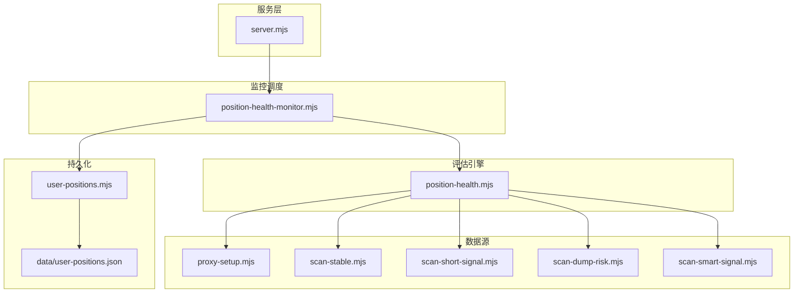
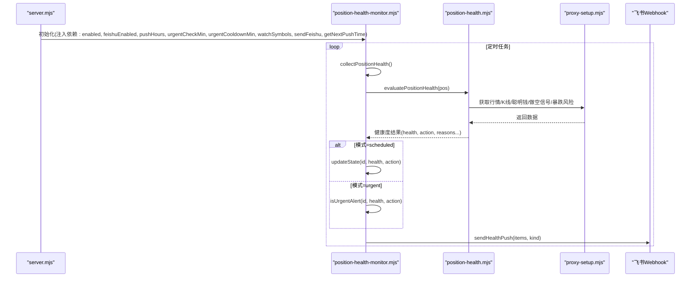
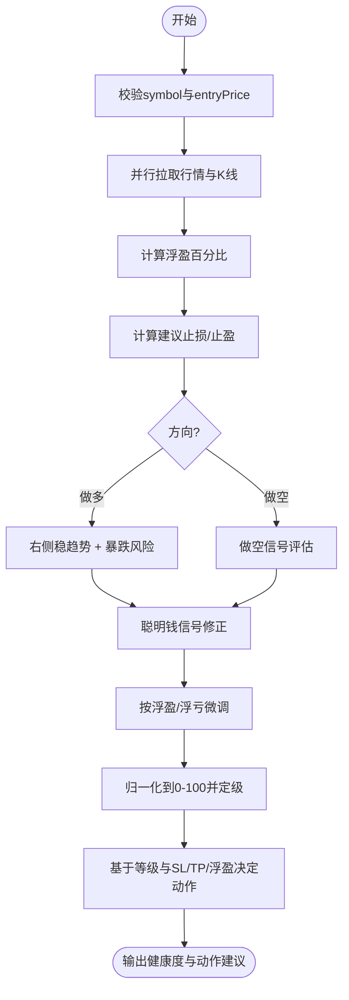
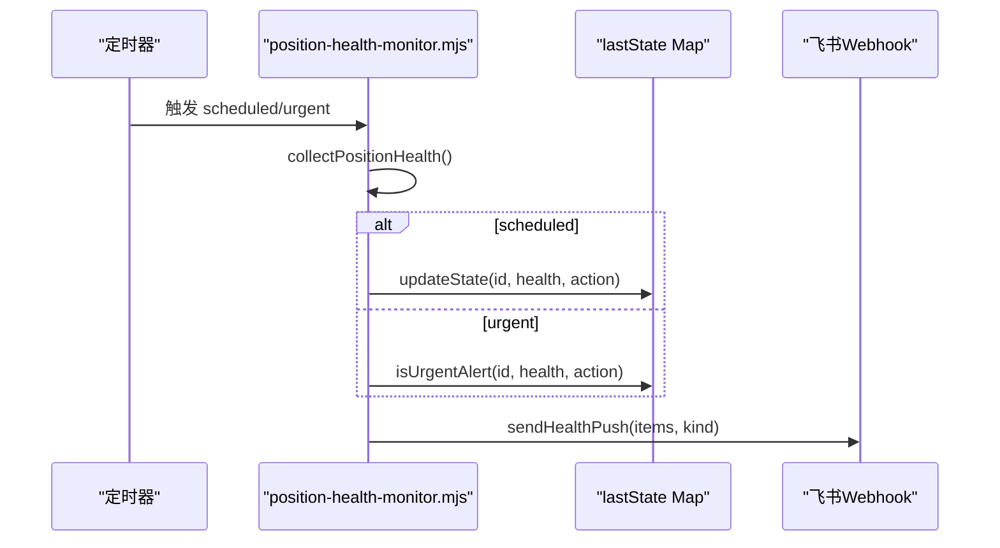
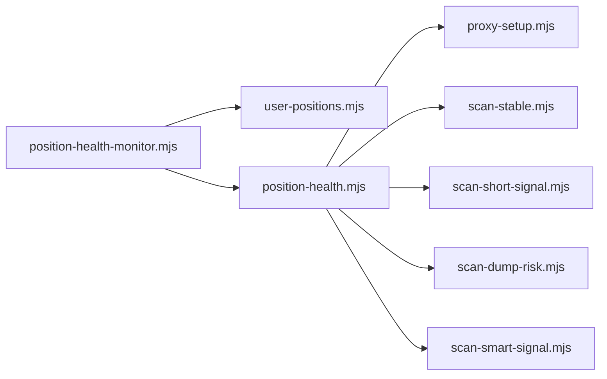

# 持仓健康监控

<cite>
**本文引用的文件**   
- [position-health-monitor.mjs](file://position-health-monitor.mjs)
- [position-health.mjs](file://position-health.mjs)
- [user-positions.mjs](file://user-positions.mjs)
- [data/user-positions.json](file://data/user-positions.json)
- [server.mjs](file://server.mjs)
- [proxy-setup.mjs](file://proxy-setup.mjs)
- [scan-stable.mjs](file://scan-stable.mjs)
- [scan-short-signal.mjs](file://scan-short-signal.mjs)
- [scan-dump-risk.mjs](file://scan-dump-risk.mjs)
- [scan-smart-signal.mjs](file://scan-smart-signal.mjs)
</cite>

## 目录
1. [简介](#简介)
2. [项目结构](#项目结构)
3. [核心组件](#核心组件)
4. [架构总览](#架构总览)
5. [详细组件分析](#详细组件分析)
6. [依赖关系分析](#依赖关系分析)
7. [性能与优化](#性能与优化)
8. [故障排查指南](#故障排查指南)
9. [结论](#结论)
10. [附录：输入格式与环境配置](#附录输入格式与环境配置)

## 简介
本系统为“持仓健康监控”子系统，面向合约交易场景，围绕用户手动记录的持仓数据，结合币安合约行情、聪明钱信号、做空信号、暴跌风险等维度，对每笔持仓进行健康度评分与动作建议（继续持有/收紧止损/考虑止盈/建议止损），并通过飞书推送定时报告与紧急预警。其目标是在不同市场环境下提供可解释的风险评估与处置建议，帮助交易者及时应对风险与机会。

## 项目结构
与持仓健康监控直接相关的代码与数据分布如下：
- 调度与推送：position-health-monitor.mjs
- 健康度评估引擎：position-health.mjs
- 用户持仓数据读写：user-positions.mjs + data/user-positions.json
- 服务端集成与配置加载：server.mjs
- 外部数据源与代理：proxy-setup.mjs
- 风险评估子模块：
  - 右侧稳趋势（做多逻辑）：scan-stable.mjs
  - 做空信号：scan-short-signal.mjs
  - 暴跌风险：scan-dump-risk.mjs
  - 聪明钱信号：scan-smart-signal.mjs

图表来源
- [server.mjs:557-568](file://server.mjs#L557-L568)
- [position-health-monitor.mjs:1-186](file://position-health-monitor.mjs#L1-L186)
- [position-health.mjs:1-213](file://position-health.mjs#L1-L213)
- [user-positions.mjs:1-64](file://user-positions.mjs#L1-L64)
- [proxy-setup.mjs:1-71](file://proxy-setup.mjs#L1-L71)
- [scan-stable.mjs:1-200](file://scan-stable.mjs#L1-L200)
- [scan-short-signal.mjs:1-200](file://scan-short-signal.mjs#L1-L200)
- [scan-dump-risk.mjs:1-200](file://scan-dump-risk.mjs#L1-L200)
- [scan-smart-signal.mjs:1-200](file://scan-smart-signal.mjs#L1-L200)

章节来源
- [server.mjs:557-568](file://server.mjs#L557-L568)
- [position-health-monitor.mjs:1-186](file://position-health-monitor.mjs#L1-L186)
- [position-health.mjs:1-213](file://position-health.mjs#L1-L213)
- [user-positions.mjs:1-64](file://user-positions.mjs#L1-L64)
- [data/user-positions.json:1-52](file://data/user-positions.json#L1-L52)
- [proxy-setup.mjs:1-71](file://proxy-setup.mjs#L1-L71)

## 核心组件
- 健康度评估引擎 evaluatePositionHealth：聚合多因子指标，输出健康等级、健康分数、动作建议及理由。
- 监控调度器 runPositionHealthPush/startPositionHealthScheduler：定时扫描与紧急检查，去重与冷却控制，飞书推送。
- 用户持仓管理 getUserPositions/addUserPosition/deleteUserPosition：本地 JSON 持久化，支持增删查。
- 外部数据接入 proxy-setup：统一请求封装，Windows 下优先 curl，支持代理与超时熔断。
- 风险评估子模块：
  - 右侧稳趋势 checkCoinRightStable：用于做多方向的健康加分/减分与信号有效性判断。
  - 做空信号 checkShortSignal：识别做空环境是否成立，影响空单健康度。
  - 暴跌风险 checkDumpRisk：综合价格、OI、买卖比、费率等多维风险。
  - 聪明钱信号 fetchSmartSignal/analyzeSmartSignal：大户与盈利账户多空倾向辅助判断。

章节来源
- [position-health.mjs:56-195](file://position-health.mjs#L56-L195)
- [position-health-monitor.mjs:10-186](file://position-health-monitor.mjs#L10-L186)
- [user-positions.mjs:30-64](file://user-positions.mjs#L30-L64)
- [proxy-setup.mjs:25-71](file://proxy-setup.mjs#L25-L71)
- [scan-stable.mjs:163-193](file://scan-stable.mjs#L163-L193)
- [scan-short-signal.mjs:28-200](file://scan-short-signal.mjs#L28-L200)
- [scan-dump-risk.mjs:21-191](file://scan-dump-risk.mjs#L21-L191)
- [scan-smart-signal.mjs:76-167](file://scan-smart-signal.mjs#L76-L167)

## 架构总览
整体流程：服务端启动时读取环境变量并初始化监控；定时任务触发后，从本地读取用户持仓，逐仓调用健康度评估引擎，汇总结果并按模式（定时/紧急）决定是否推送飞书。

图表来源
- [server.mjs:2061-2066](file://server.mjs#L2061-L2066)
- [position-health-monitor.mjs:130-186](file://position-health-monitor.mjs#L130-L186)
- [position-health.mjs:70-195](file://position-health.mjs#L70-L195)
- [proxy-setup.mjs:49-71](file://proxy-setup.mjs#L49-L71)

## 详细组件分析

### 健康度评分算法与动作建议
- 基础分与健康等级
  - 初始健康分 70，范围 0-100。
  - 等级划分：
    - 危险：健康分 < 45，或 < 55 且信号无效
    - 警告：健康分 < 65，或信号无效
    - 健康：其余情况
- 做多方向调整
  - 右侧稳趋势有效：+20，理由记录
  - 仅右侧存在但稳定性不足：-15，标记信号无效
  - 逻辑失效：-35，标记信号无效
  - 暴跌风险高：根据风险分扣 15~30 分
- 做空方向调整
  - 无做空信号：-40，标记信号无效
  - 强做空信号：+15
  - 弱信号：-10，标记信号无效
  - 过低：-25，标记信号无效
- 聪明钱信号
  - 与持仓方向相反且强度≥2：-20
  - 与持仓方向一致且强度≥2：+10
- 盈亏影响
  - 浮盈 ≥ 8%：+5
  - 浮亏 ≤ -5%：-15
- 动作建议 resolveAction
  - 危险 → 建议止损
  - 触及止盈 → 考虑止盈
  - 触及止损 → 建议止损
  - 警告且浮盈 ≥ 5% → 考虑止盈
  - 警告且浮盈 > 0 → 收紧止损
  - 警告且浮亏 ≤ -5% → 建议止损
  - 其他 → 继续持有

图表来源
- [position-health.mjs:56-195](file://position-health.mjs#L56-L195)
- [scan-stable.mjs:163-193](file://scan-stable.mjs#L163-L193)
- [scan-short-signal.mjs:28-200](file://scan-short-signal.mjs#L28-L200)
- [scan-dump-risk.mjs:21-191](file://scan-dump-risk.mjs#L21-L191)
- [scan-smart-signal.mjs:86-167](file://scan-smart-signal.mjs#L86-L167)

章节来源
- [position-health.mjs:56-195](file://position-health.mjs#L56-L195)

### 杠杆倍数分析与止损止盈建议
- 杠杆倍数
  - 当前实现未直接读取或计算杠杆倍数，健康度评估以价格与信号为主。若需引入杠杆，可在评估入口增加参数并在动作建议中叠加杠杆放大后的风险权重。
- 止损/止盈建议
  - 当用户未设置 SL/TP 时，系统基于最近 K 线的支撑/阻力与固定比例生成建议值：
    - 做多：止损参考近期低点打一定折扣，止盈参考近期高点或入场价上浮比例
    - 做空：止损参考近期高点加一定溢价，止盈参考近期低点或入场价下浮比例
  - 若用户已设置 SL/TP，则以其为准；否则使用建议值参与动作判定与距离计算。

章节来源
- [position-health.mjs:11-29](file://position-health.mjs#L11-L29)
- [position-health.mjs:80-83](file://position-health.mjs#L80-L83)
- [position-health.mjs:187-192](file://position-health.mjs#L187-L192)

### 健康度预警级别定义与处置建议
- 健康（healthy）
  - 特征：健康分较高且信号有效
  - 建议：继续持有；若浮盈可观可考虑分批止盈
- 警告（warning）
  - 特征：健康分偏低或信号无效
  - 建议：收紧止损；浮盈较大时可考虑止盈；浮亏扩大时应果断止损
- 危险（critical）
  - 特征：健康分很低或信号严重失效
  - 建议：立即止损，避免进一步亏损

章节来源
- [position-health.mjs:162-167](file://position-health.mjs#L162-L167)
- [position-health.mjs:31-41](file://position-health.mjs#L31-L41)

### 实时监控机制与推送策略
- 定时报告
  - 按小时整点执行（间隔由 pushHours 决定），输出“持仓健康报告”，包含所有持仓的简要状态与理由摘要。
- 紧急预警
  - 每隔 urgentCheckMin 分钟扫描一次，仅在以下情况触发：
    - 首次进入危险或触发止损动作
    - 已在紧急状态且明显恶化，并超过冷却期（urgentCooldownMin）
- 去重与冷却
  - 维护 lastState Map，记录每个持仓上次状态与是否紧急，避免高频重复推送。
- 推送内容
  - 标题区分“持仓健康”与“持仓紧急”，正文包含时间、监控标的、现价、盈亏、健康标签、动作标签与若干关键理由。

图表来源
- [position-health-monitor.mjs:130-186](file://position-health-monitor.mjs#L130-L186)

章节来源
- [position-health-monitor.mjs:14-66](file://position-health.mjs#L14-L66)
- [position-health-monitor.mjs:111-128](file://position-health-monitor.mjs#L111-L128)
- [position-health-monitor.mjs:156-186](file://position-health-monitor.mjs#L156-L186)

### 历史数据记录与扩展
- 当前实现未内置健康度历史落盘，建议在调度循环中将每次评估结果追加写入本地文件或数据库，便于回溯与回测。
- 可扩展字段：checkedAt、healthScore、action、reasons、distanceToSLPct、distanceToTPPct 等均可纳入历史记录。

章节来源
- [position-health.mjs:193-194](file://position-health.mjs#L193-L194)

## 依赖关系分析
- 模块耦合
  - position-health-monitor.mjs 依赖 user-positions.mjs 与 position-health.mjs，并通过依赖注入方式接入 server.mjs 提供的飞书推送与调度能力。
  - position-health.mjs 依赖 proxy-setup.mjs 以及多个风险评估子模块，形成“评估引擎 + 多因子信号”的组合。
- 外部依赖
  - 币安合约 REST API（fapi.binance.com）
  - 飞书 Webhook
  - Windows 平台下通过 curl 作为备选请求通道
- 潜在循环依赖
  - 当前未见循环引用；各模块职责清晰，评估引擎不反向依赖监控调度。

图表来源
- [position-health-monitor.mjs:1-3](file://position-health-monitor.mjs#L1-L3)
- [position-health.mjs:1-6](file://position-health.mjs#L1-L6)
- [user-positions.mjs:1-4](file://user-positions.mjs#L1-L4)
- [proxy-setup.mjs:1-4](file://proxy-setup.mjs#L1-L4)

章节来源
- [position-health-monitor.mjs:1-3](file://position-health-monitor.mjs#L1-L3)
- [position-health.mjs:1-6](file://position-health.mjs#L1-L6)

## 性能与优化
- 并发与缓存
  - 健康度评估在单个持仓内并行拉取行情与K线，减少等待时间。
  - 聪明钱信号具备短 TTL 缓存与最小请求间隔，降低限流风险。
- 网络容错
  - proxy-setup 在 Windows 且启用代理时优先走 curl，提升稳定性；统一超时与错误处理。
- 推送节流
  - 紧急预警采用冷却期与恶化阈值双重过滤，避免频繁轰炸。
- 建议优化
  - 批量评估时增加全局 ticker 缓存复用（如全量 ticker/24hr）。
  - 将健康度历史落盘改为异步队列写入，降低 I/O 阻塞。
  - 对高风险标的提高紧急检查频率，低风险标的降低频率，实现自适应调度。

章节来源
- [position-health.mjs:70-73](file://position-health.mjs#L70-L73)
- [scan-smart-signal.mjs:16-22](file://scan-smart-signal.mjs#L16-L22)
- [proxy-setup.mjs:49-71](file://proxy-setup.mjs#L49-L71)
- [position-health-monitor.mjs:18-20](file://position-health-monitor.mjs#L18-L20)

## 故障排查指南
- 无法连接币安 API
  - 检查代理配置与网络连通性；Windows 下确保 curl 可用；查看日志中的错误信息。
- 飞书推送失败
  - 确认 FEISHU_WEBHOOK 配置正确；检查 sendFeishu 返回值 code/StatusCode 是否为 0。
- 健康度异常
  - 核对 symbol 与 entryPrice 是否合法；检查 K 线数据长度是否满足要求；关注理由列表中的扣分项。
- 推送过于频繁
  - 调整 urgentCheckMin 与 urgentCooldownMin；必要时清空 lastState 强制重置状态。

章节来源
- [proxy-setup.mjs:25-44](file://proxy-setup.mjs#L25-L44)
- [position-health-monitor.mjs:123-128](file://position-health-monitor.mjs#L123-L128)
- [position-health.mjs:66-68](file://position-health.mjs#L66-L68)
- [position-health-monitor.mjs:132](file://position-health-monitor.mjs#L132)

## 结论
该持仓健康监控系统以多因子融合的方式对每笔持仓进行健康度评估与动作建议，结合定时报告与紧急预警机制，能够在不同市场环境下提供及时、可解释的风控提示。未来可在杠杆倍数、历史落盘、自适应调度等方面进一步增强，以提升实战价值与可观测性。

## 附录：输入格式与环境配置

### 用户持仓数据输入格式
- 存储位置：data/user-positions.json
- 数据结构要点：
  - id：唯一标识（UUID）
  - symbol：合约符号，必须以 USDT 结尾（如 BTCUSDT）
  - direction：long 或 short
  - entryPrice：开仓价，必须为正数
  - stopLoss：可选，止损价
  - takeProfit：可选，止盈价
  - note：备注
  - createdAt：创建时间戳
- 示例路径：[data/user-positions.json](file://data/user-positions.json)

章节来源
- [user-positions.mjs:34-55](file://user-positions.mjs#L34-L55)
- [data/user-positions.json:1-52](file://data/user-positions.json#L1-L52)

### 环境与配置项（与持仓健康相关）
- POSITION_HEALTH_ENABLED：是否启用持仓健康监控（默认开启，除非显式设为 false）
- POSITION_HEALTH_PUSH_HOURS：定时报告推送间隔（小时，默认 2）
- POSITION_HEALTH_URGENT_CHECK_MIN：紧急检查周期（分钟，默认 30）
- POSITION_HEALTH_URGENT_COOLDOWN_MIN：紧急推送冷却期（分钟，默认 60）
- POSITION_HEALTH_WATCH_SYMBOLS：监控标的白名单（逗号分隔，自动补全 USDT）
- FEISHU_WEBHOOK：飞书机器人 Webhook URL（必需）

章节来源
- [server.mjs:557-568](file://server.mjs#L557-L568)
- [server.mjs:2061-2066](file://server.mjs#L2061-L2066)