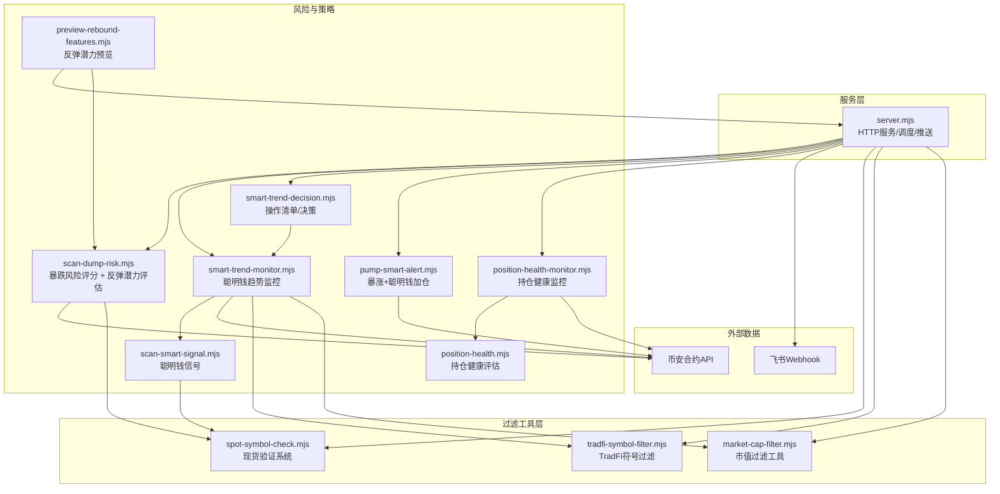
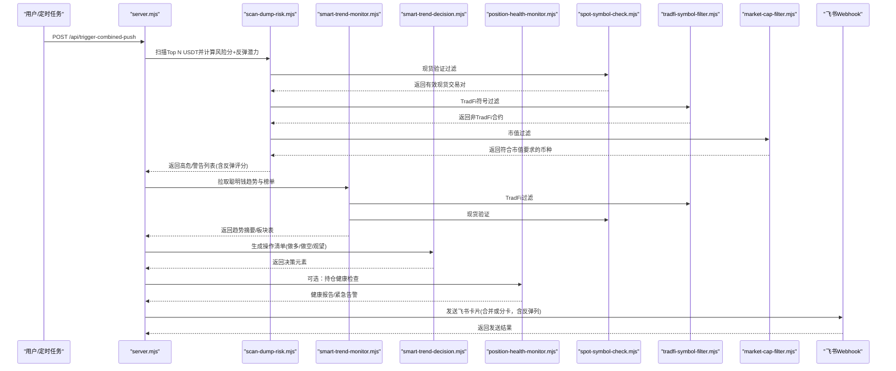
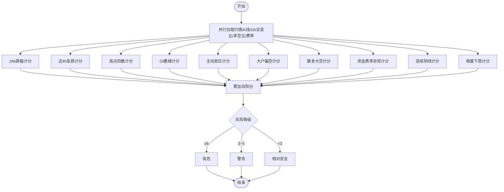
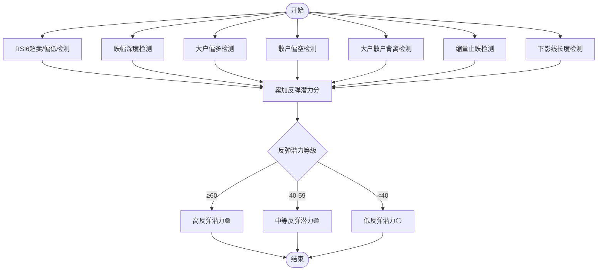
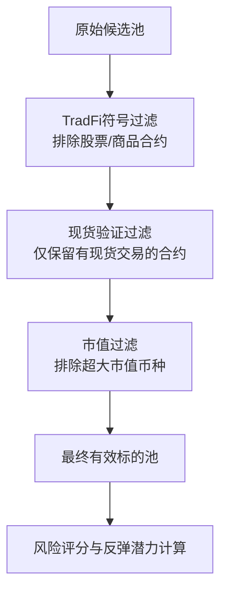
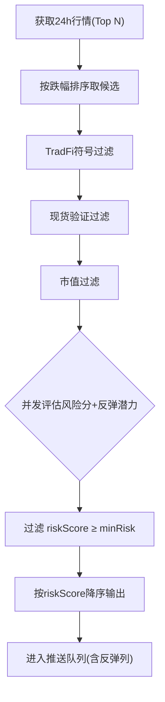
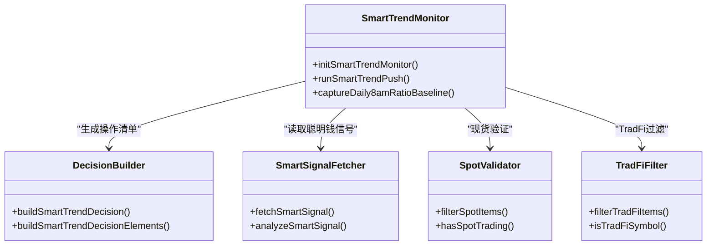
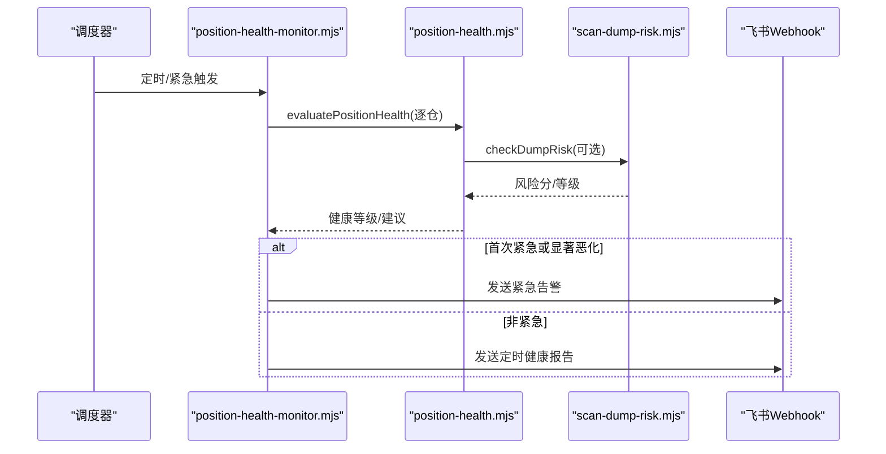
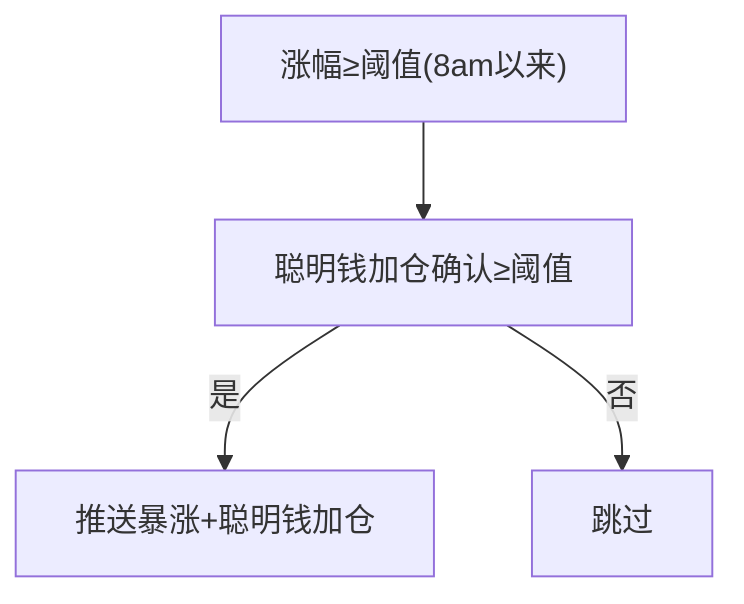
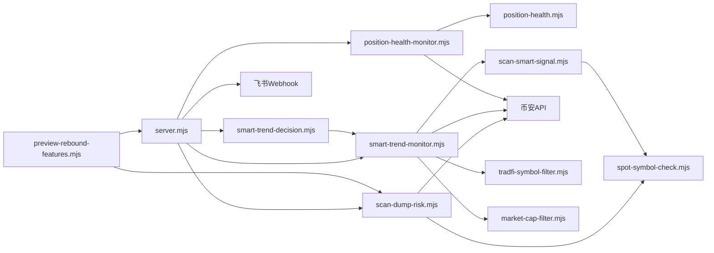

# 暴跌风险预警

<cite>
**本文引用的文件**   
- [server.mjs](file://server.mjs)
- [scan-dump-risk.mjs](file://scan-dump-risk.mjs)
- [smart-trend-monitor.mjs](file://smart-trend-monitor.mjs)
- [smart-trend-decision.mjs](file://smart-trend-decision.mjs)
- [scan-smart-signal.mjs](file://scan-smart-signal.mjs)
- [position-health-monitor.mjs](file://position-health-monitor.mjs)
- [position-health.mjs](file://position-health.mjs)
- [pump-smart-alert.mjs](file://pump-smart-alert.mjs)
- [README.md](file://README.md)
- [package.json](file://package.json)
- [ecosystem.config.cjs](file://ecosystem.config.cjs)
- [data/smart-trend-push-mock.json](file://data/smart-trend-push-mock.json)
- [data/user-positions.json](file://data/user-positions.json)
- [scripts/preview-rebound-features.mjs](file://scripts/preview-rebound-features.mjs)
- [docs/rebound-opportunity-requirements.md](file://docs/rebound-opportunity-requirements.md)
- [spot-symbol-check.mjs](file://spot-symbol-check.mjs)
- [tradfi-symbol-filter.mjs](file://tradfi-symbol-filter.mjs)
- [market-cap-filter.mjs](file://market-cap-filter.mjs)
</cite>

## 更新摘要
**变更内容**   
- **重大更新**：集成全新的现货验证系统，支持现货交易对实时验证和过滤
- **增强趋势检测**：在所有扫描模块中集成增强的过滤和分析工具
- **改进过滤机制**：新增 TradFi 符号过滤、市值过滤、现货验证三重过滤体系
- **优化性能**：异步加载 + 缓存机制，提升过滤效率和响应速度
- **完善配置**：新增环境变量控制，支持灵活的过滤策略配置

## 目录
1. [简介](#简介)
2. [项目结构](#项目结构)
3. [核心组件](#核心组件)
4. [架构总览](#架构总览)
5. [详细组件分析](#详细组件分析)
6. [依赖关系分析](#依赖关系分析)
7. [性能与并发特性](#性能与并发特性)
8. [故障排查指南](#故障排查指南)
9. [结论](#结论)
10. [附录：配置项与推送格式](#附录配置项与推送格式)

## 简介
本系统为"暴跌风险预警"提供多维度风险评估、高危币种筛选、预警触发与推送能力，并结合聪明钱（Smart Money）趋势监控与持仓健康检查，形成从"市场扫描—风险评分—决策建议—推送触达"的闭环。**最新更新**引入了全面的反弹潜力评估系统和**全新的现货验证过滤体系**，在识别高风险币种的同时，能够智能区分"该逃的"和"可观察反弹的"标的。通过七维加权评分模型和三重过滤机制（现货验证、TradFi过滤、市值过滤），系统能够量化反弹机会并排除无效标的，配合绿色视觉标识与红色风险指标形成鲜明对比，帮助用户把握暴跌后的反弹时机。文档重点覆盖：
- 风险评分模型构建原理（价格波动率、成交量异常、大户持仓变化等）
- **全新**反弹潜力评分模型（RSI超卖、跌幅深度、大户散户背离等7大因子）
- **重大更新**现货验证系统与三重过滤机制
- 高危币种的筛选算法与预警触发条件
- 风险等级划分标准与处置建议
- 实际预警案例与误报处理机制
- 预警信息推送格式、频率控制与用户自定义配置

## 项目结构
本项目采用模块化设计，核心由服务端调度器与各独立扫描/评估模块组成，**新增三大过滤工具模块**：
- server.mjs：HTTP 服务入口、定时任务编排、飞书推送封装、API 路由
- scan-dump-risk.mjs：暴跌风险评分与扫描，**集成现货验证过滤**
- smart-trend-monitor.mjs / smart-trend-decision.mjs：聪明钱趋势监控与操作清单生成
- scan-smart-signal.mjs：聪明钱信号获取与分析，**集成现货验证过滤**
- position-health-monitor.mjs / position-health.mjs：持仓健康检查与紧急告警
- pump-smart-alert.mjs：暴涨+聪明钱加仓提醒
- **新增** spot-symbol-check.mjs：**现货验证系统**，提供现货交易对实时验证
- **新增** tradfi-symbol-filter.mjs：**TradFi符号过滤**，排除股票/商品合约
- **新增** market-cap-filter.mjs：**市值过滤工具**，按市值上限过滤币种
- ecosystem.config.cjs：PM2 进程管理配置
- data/*：示例数据与快照
- scripts/preview-rebound-features.mjs：**新增**反弹潜力功能预览脚本



**图表来源**
- [server.mjs:1-120](file://server.mjs#L1-L120)
- [scan-dump-risk.mjs:1-60](file://scan-dump-risk.mjs#L1-L60)
- [smart-trend-monitor.mjs:1-60](file://smart-trend-monitor.mjs#L1-L60)
- [smart-trend-decision.mjs:1-40](file://smart-trend-decision.mjs#L1-L40)
- [pump-smart-alert.mjs:1-40](file://pump-smart-alert.mjs#L1-L40)
- [position-health-monitor.mjs:1-40](file://position-health-monitor.mjs#L1-L40)
- [scan-smart-signal.mjs:1-40](file://scan-smart-signal.mjs#L1-L40)
- [scripts/preview-rebound-features.mjs:1-40](file://scripts/preview-rebound-features.mjs#L1-L40)
- [spot-symbol-check.mjs:1-106](file://spot-symbol-check.mjs#L1-L106)
- [tradfi-symbol-filter.mjs:1-113](file://tradfi-symbol-filter.mjs#L1-L113)
- [market-cap-filter.mjs:1-15](file://market-cap-filter.mjs#L1-L15)

章节来源
- [server.mjs:1-120](file://server.mjs#L1-L120)
- [README.md:1-120](file://README.md#L1-L120)
- [package.json:1-22](file://package.json#L1-L22)
- [ecosystem.config.cjs:1-33](file://ecosystem.config.cjs#L1-L33)

## 核心组件
- 暴跌风险评分模块：对单币进行多维打分，输出风险等级与明细原因，**集成现货验证过滤**
- **全新**反弹潜力评估模块：计算0-100分的反弹潜力评分，识别可观察反弹的币种
- 聪明钱趋势监控：基于净多空比、资金费率、价格变化等指标，生成全池摘要与操作清单，**集成多重过滤**
- 持仓健康监控：结合暴跌风险、做空信号有效性、聪明钱方向，给出健康度与建议动作
- 暴涨+聪明钱加仓提醒：在涨幅达标时叠加聪明钱加仓确认，降低追高风险
- 推送与调度：统一飞书卡片推送、限流熔断、定时任务与手动触发接口
- **新增**现货验证系统：实时验证现货交易对存在性，支持精确匹配和基础资产匹配
- **新增**TradFi符号过滤：自动排除股票、商品、ETF等非加密货币合约
- **新增**市值过滤工具：按市值上限过滤大盘币，聚焦中小盘机会
- **新增**反弹潜力预览工具：支持新功能测试与演示

章节来源
- [scan-dump-risk.mjs:1-191](file://scan-dump-risk.mjs#L1-L191)
- [scan-dump-risk.mjs:252-342](file://scan-dump-risk.mjs#L252-L342)
- [smart-trend-monitor.mjs:1-200](file://smart-trend-monitor.mjs#L1-L200)
- [smart-trend-decision.mjs:1-120](file://smart-trend-decision.mjs#L1-L120)
- [position-health-monitor.mjs:1-120](file://position-health-monitor.mjs#L1-L120)
- [pump-smart-alert.mjs:1-120](file://pump-smart-alert.mjs#L1-L120)
- [server.mjs:540-620](file://server.mjs#L540-L620)
- [scripts/preview-rebound-features.mjs:1-220](file://scripts/preview-rebound-features.mjs#L1-L220)
- [spot-symbol-check.mjs:1-106](file://spot-symbol-check.mjs#L1-L106)
- [tradfi-symbol-filter.mjs:1-113](file://tradfi-symbol-filter.mjs#L1-L113)
- [market-cap-filter.mjs:1-15](file://market-cap-filter.mjs#L1-L15)

## 架构总览
系统以 server.mjs 为中枢，集成多个扫描与评估模块，通过环境变量驱动开关与阈值，统一通过飞书 Webhook 推送结果。**更新后**的架构增加了全面的反弹潜力评估维度、**三重过滤机制**和**现货验证系统**，使暴跌推送能够同时展示风险分和反弹潜力分，为用户提供更完整的市场洞察。



**图表来源**
- [server.mjs:1866-1931](file://server.mjs#L1866-L1931)
- [scan-dump-risk.mjs:206-243](file://scan-dump-risk.mjs#L206-L243)
- [smart-trend-monitor.mjs:700-800](file://smart-trend-monitor.mjs#L700-L800)
- [smart-trend-decision.mjs:556-640](file://smart-trend-decision.mjs#L556-L640)
- [position-health-monitor.mjs:130-186](file://position-health-monitor.mjs#L130-L186)
- [spot-symbol-check.mjs:84-96](file://spot-symbol-check.mjs#L84-L96)
- [tradfi-symbol-filter.mjs:95-106](file://tradfi-symbol-filter.mjs#L95-L106)
- [market-cap-filter.mjs:3-7](file://market-cap-filter.mjs#L3-L7)

## 详细组件分析

### 暴跌风险评分模型
该模型对单个币种进行十项因子打分，汇总得到风险分数与等级，用于高危币种筛选与预警触发，**现已集成现货验证过滤**。

- 输入数据
  - 24h行情与涨跌幅
  - 1小时K线（近48根）、4小时K线（近12根）
  - 持仓量历史（OI，4h周期）
  - 主动买卖比率（takerlongshortRatio，5m周期）
  - 大户多空比（topLongShortPositionRatio，1h）
  - 全网多空比（globalLongShortAccountRatio，1h）
  - 资金费率（premiumIndex）
- 评分维度与权重（示意）
  - 24h跌幅：≥-30% 加4分；-20%~-30% 加3分；-10%~-20% 加2分
  - 近4h加速下跌：≤-15% 加3分；≤-8% 加2分
  - 高点回撤（4h K 高点到当前收盘）：≥40% 加3分；≥25% 加2分
  - OI萎缩（对比首尾）：≤-25% 加2分；≤-15% 加1分
  - 主动卖出压力（近期平均买卖比）：<0.5 加3分；<0.7 加2分
  - 大户偏空（最新多空比）：<0.6 加2分；<0.85 加1分
  - 散多大空（全网多头>1.2且大户空头<0.9）：加2分
  - 资金费率异常：负极端<-0.005 加2分；负<-0.001 加1分；正>0.003 加1分
  - 连续阴线（近6根中阴线≥5）：加2分
  - 缩量下跌（近4根均量较前16根均值<30%且24h跌>5%）：加1分
- 风险等级
  - 高分≥6：高危（强烈远离）
  - 3~5：警告（谨慎对待）
  - <3：相对安全
- 输出
  - 风险分、等级、标签化原因明细、汇总文案



**图表来源**
- [scan-dump-risk.mjs:21-191](file://scan-dump-risk.mjs#L21-L191)

章节来源
- [scan-dump-risk.mjs:1-191](file://scan-dump-risk.mjs#L1-L191)

### **全新**反弹潜力评分模型
**重大更新**：系统在暴跌风险评分基础上，新增了独立的反弹潜力评估功能，采用七维加权模型，用于识别暴跌后可能存在的反弹机会。

- 评分范围：0-100分，分数越高反弹潜力越大
- 评分等级：
  - ≥60分：**高反弹潜力** 🟢（可观察反弹，关注入场时机）
  - 40-59分：**中等反弹潜力** 🟡（反弹可能，谨慎观察）
  - <40分：**低反弹潜力** ⚪（可能继续下跌，不宜抄底）

- 七维评分因子：
  - RSI6超卖（RSI6 < 20）：+25分
  - RSI6偏低（RSI6 < 30）：+15分
  - 跌幅深度（24h跌幅 ≤ -30%）：+20分
  - 暴跌深度（24h跌幅 ≤ -50%）：+30分
  - 大户偏多（大户多空比 > 1.0）：+15分
  - 散户偏空（全网多空比 < 0.8）：+10分
  - 大户散户背离（背离度 ≥ 0.25）：+15分
  - 缩量止跌（最近1h成交量 < 前3h均值50%）：+10分
  - 下影线长（(收盘-最低)/(最高-最低) < 0.3）：+10分



**图表来源**
- [scan-dump-risk.mjs:252-342](file://scan-dump-risk.mjs#L252-L342)

章节来源
- [scan-dump-risk.mjs:252-342](file://scan-dump-risk.mjs#L252-L342)

### **重大更新**现货验证系统与三重过滤机制
**全新功能**：系统集成了完整的现货验证系统和三重过滤机制，确保只分析真实有效的加密货币合约标的。

#### 现货验证系统 (spot-symbol-check.mjs)
- **功能特性**：
  - 实时验证 Binance 现货交易对存在性
  - 支持精确交易对匹配（如 BTCUSDT）
  - 支持基础资产匹配（如 BTC → BTCUSDT）
  - 6小时缓存机制，减少API调用
  - 异步加载 + 同步判断模式

- **核心函数**：
  - `loadSpotSymbols()`：异步加载现货交易对列表
  - `hasSpotTrading(symbol)`：检查交易对是否有现货交易
  - `hasSpotAsset(symbol)`：检查基础资产是否有现货交易
  - `filterSpotItems(items, symbolKey, opts)`：过滤无现货交易对的标的
  - `warmupSpotSymbols()`：预热缓存，返回现货交易对数量

#### TradFi符号过滤 (tradfi-symbol-filter.mjs)
- **过滤规则**：
  - 自动排除股票合约（COINUSDT、MSTRUSDT、HOODUSDT）
  - 自动排除商品合约（XAUUSDT、XAGUSDT、PAXGUSDT等）
  - 基于 contractType、underlyingType、underlyingSubType 智能识别
  - 支持环境变量 EXCLUDE_SYMBOLS 自定义排除列表

#### 市值过滤工具 (market-cap-filter.mjs)
- **过滤逻辑**：
  - 默认市值上限 $50亿（MAX_MARKET_CAP_USD=5000000000）
  - 超过上限的币种被排除在监控范围外
  - 支持设置为0关闭过滤
  - 提供格式化显示函数 formatMaxMarketCapLabel()



**图表来源**
- [spot-symbol-check.mjs:84-96](file://spot-symbol-check.mjs#L84-L96)
- [tradfi-symbol-filter.mjs:95-106](file://tradfi-symbol-filter.mjs#L95-L106)
- [market-cap-filter.mjs:3-7](file://market-cap-filter.mjs#L3-L7)

章节来源
- [spot-symbol-check.mjs:1-106](file://spot-symbol-check.mjs#L1-L106)
- [tradfi-symbol-filter.mjs:1-113](file://tradfi-symbol-filter.mjs#L1-L113)
- [market-cap-filter.mjs:1-15](file://market-cap-filter.mjs#L1-L15)

### 高危币种筛选与预警触发
- 候选池：USDT合约 Top N（默认200），按24h跌幅排序
- **三重过滤**：TradFi过滤 → 现货验证 → 市值过滤
- 并发评估：对候选逐一调用风险评分函数，过滤达到最低风险阈值的币种
- 排序输出：按风险分降序，便于优先关注最危险标的
- 触发条件：可配置最小风险分（如≥4），满足即纳入推送
- **新增**：同时计算反弹潜力分，用于后续推送展示



**图表来源**
- [scan-dump-risk.mjs:206-243](file://scan-dump-risk.mjs#L206-L243)
- [server.mjs:545-548](file://server.mjs#L545-L548)

章节来源
- [scan-dump-risk.mjs:206-243](file://scan-dump-risk.mjs#L206-L243)
- [server.mjs:545-548](file://server.mjs#L545-L548)

### 聪明钱趋势监控与操作清单
- 数据采集：聪明钱信号（净多空比、盈利交易者、鲸鱼仓位等）、资金费率、价格变化、8am基准比值
- **增强过滤**：集成 TradFi 符号过滤和现货验证，提高数据质量
- 趋势判断：比较1h与8am以来的净多空比变化，统计变多/变少数量，得出总体研判
- 操作清单：将各币种归入"立刻关注/继续观察/已失效"，并给出场景化建议（顺势/反转/观望）
- 推送内容：表格+要点说明，支持分页与冻结列



**图表来源**
- [smart-trend-monitor.mjs:189-200](file://smart-trend-monitor.mjs#L189-L200)
- [smart-trend-decision.mjs:556-640](file://smart-trend-decision.mjs#L556-L640)
- [scan-smart-signal.mjs:76-167](file://scan-smart-signal.mjs#L76-L167)
- [spot-symbol-check.mjs:84-96](file://spot-symbol-check.mjs#L84-L96)
- [tradfi-symbol-filter.mjs:95-106](file://tradfi-symbol-filter.mjs#L95-L106)

章节来源
- [smart-trend-monitor.mjs:1-200](file://smart-trend-monitor.mjs#L1-L200)
- [smart-trend-decision.mjs:1-120](file://smart-trend-decision.mjs#L1-L120)
- [scan-smart-signal.mjs:1-167](file://scan-smart-signal.mjs#L1-L167)

### 持仓健康监控与紧急告警
- 健康评估：综合暴跌风险、做空信号有效性、聪明钱方向、盈亏比例等，给出健康等级与建议动作
- 紧急冷却：首次进入危险/止损立即推送；后续仅在明显恶化且过冷却期再推，避免重复轰炸
- 推送模式：定时整点报告 + 紧急告警（分钟级扫描）



**图表来源**
- [position-health-monitor.mjs:130-186](file://position-health-monitor.mjs#L130-L186)
- [position-health.mjs:101-140](file://position-health.mjs#L101-L140)
- [scan-dump-risk.mjs:21-191](file://scan-dump-risk.mjs#L21-L191)

章节来源
- [position-health-monitor.mjs:1-186](file://position-health-monitor.mjs#L1-L186)
- [position-health.mjs:101-140](file://position-health.mjs#L101-L140)

### 暴涨+聪明钱加仓提醒
- 触发条件：自8点来涨幅≥阈值（默认20%），且聪明钱加仓确认≥阈值（默认2项）
- 确认信号：大户持仓偏多上升、OI增仓配合上涨、主动买入增强、大户>全网等
- 推送频次：同一币种每N分钟最多一次，避免刷屏



**图表来源**
- [pump-smart-alert.mjs:71-112](file://pump-smart-alert.mjs#L71-112)
- [pump-smart-alert.mjs:151-191](file://pump-smart-alert.mjs#L151-L191)

章节来源
- [pump-smart-alert.mjs:1-191](file://pump-smart-alert.mjs#L1-L191)

## 依赖关系分析
- 外部依赖
  - 币安合约 REST API：行情、K线、OI、多空比、资金费率等
  - 币安现货 API：exchangeInfo 用于现货验证
  - 飞书群机器人 Webhook：统一推送出口
- 内部耦合
  - server.mjs 聚合各模块，负责调度与推送
  - 风险评分与聪明钱趋势相互独立，但均可被持仓健康评估引用
  - **新增**：反弹潜力评估作为风险评分的补充维度，独立于风险分计算
  - **新增**：三大过滤工具模块被多个扫描模块复用
  - **新增**：预览脚本依赖主模块进行测试与演示
- 潜在循环依赖
  - 无直接循环导入；模块间通过函数调用组合



**图表来源**
- [server.mjs:1-120](file://server.mjs#L1-L120)
- [smart-trend-monitor.mjs:1-60](file://smart-trend-monitor.mjs#L1-L60)
- [position-health-monitor.mjs:1-40](file://position-health-monitor.mjs#L1-L40)
- [scripts/preview-rebound-features.mjs:1-40](file://scripts/preview-rebound-features.mjs#L1-L40)
- [spot-symbol-check.mjs:1-106](file://spot-symbol-check.mjs#L1-L106)
- [tradfi-symbol-filter.mjs:1-113](file://tradfi-symbol-filter.mjs#L1-L113)
- [market-cap-filter.mjs:1-15](file://market-cap-filter.mjs#L1-L15)

章节来源
- [server.mjs:1-120](file://server.mjs#L1-L120)
- [smart-trend-monitor.mjs:1-60](file://smart-trend-monitor.mjs#L1-L60)
- [position-health-monitor.mjs:1-40](file://position-health-monitor.mjs#L1-L40)

## 性能与并发特性
- 并发抓取
  - pmap 工具函数实现可控并发（默认3~20），减少串行等待
  - Promise.allSettled 批量请求，容错并收集错误
- 缓存与去重
  - ticker/24hr 短 TTL 缓存与 inflight 去重，避免同轮重复请求
  - 聪明钱信号本地缓存（TTL 5min），限频与熔断保护
  - **新增**：现货验证6小时缓存，TradFi过滤6小时缓存
- 限流与重试
  - 飞书推送失败自动重试，识别频控错误并退避
  - 币安 API 代理层带超时与指数退避重试
- 资源限制
  - PM2 配置最大内存重启、日志分离、自动重启
- **新增**启动预热
  - 服务器启动时预加载现货交易对列表和TradFi排除列表
  - 减少首次请求延迟，提升整体响应速度

章节来源
- [server.mjs:84-125](file://server.mjs#L84-L125)
- [server.mjs:150-162](file://server.mjs#L150-162)
- [scan-smart-signal.mjs:16-74](file://scan-smart-signal.mjs#L16-74)
- [ecosystem.config.cjs:1-33](file://ecosystem.config.cjs#L1-33)
- [spot-symbol-check.mjs:24-52](file://spot-symbol-check.mjs#L24-52)
- [tradfi-symbol-filter.mjs:59-82](file://tradfi-symbol-filter.mjs#L59-82)

## 故障排查指南
- 常见问题
  - 端口占用：使用 dev:restart 自动清理旧进程
  - 网络不可用：启动时探测币安 API，失败则延迟重试
  - 飞书频控：推送失败识别频控关键字，自动退避重试
- 定位方法
  - 查看 PM2 日志：out_file/error_file
  - 手动触发接口验证：/api/trigger-stable-push、/api/trigger-pump-smart-push、/api/trigger-position-health-push
  - 检查 .env 配置：FEISHU_WEBHOOK、CMC_API_KEY、MAX_MARKET_CAP_USD 等
- **新增**过滤工具调试
  - 检查现货验证是否正常工作：查看启动日志中的现货交易对数量
  - 验证 TradFi 过滤效果：确认股票/商品合约被正确排除
  - 测试市值过滤：调整 MAX_MARKET_CAP_USD 参数验证过滤效果
  - 使用 `node scripts/preview-rebound-features.mjs` 运行预览脚本
  - 检查反弹潜力评分是否正常工作
  - 验证推送格式中的反弹列显示

章节来源
- [README.md:40-78](file://README.md#L40-L78)
- [server.mjs:107-125](file://server.mjs#L107-L125)
- [server.mjs:618-644](file://server.mjs#L618-L644)
- [ecosystem.config.cjs:20-33](file://ecosystem.config.cjs#L20-33)
- [scripts/preview-rebound-features.mjs:1-220](file://scripts/preview-rebound-features.mjs#L1-L220)
- [spot-symbol-check.mjs:102-105](file://spot-symbol-check.mjs#L102-L105)
- [tradfi-symbol-filter.mjs:108-112](file://tradfi-symbol-filter.mjs#L108-L112)

## 结论
本系统通过多维风险因子量化暴跌风险，**全新的反弹潜力评估功能和三重过滤机制**进一步提升了系统的实用性和完整性，能够在识别高风险币种的同时，智能区分"该逃的"和"可观察反弹的"标的。七维加权评分模型综合考虑技术指标、市场情绪和资金流向，为投资者提供更精准的反弹机会识别。**新增的现货验证系统**确保只分析真实有效的加密货币合约，**TradFi符号过滤**排除股票和商品合约干扰，**市值过滤**聚焦中小盘机会。结合聪明钱趋势与持仓健康，形成"发现—评估—决策—推送"的完整链路。通过并发优化、缓存与限流策略，兼顾实时性与稳定性。建议在生产环境合理设置市值过滤、推送间隔与阈值，以降低误报并提升可操作性。

## 附录：配置项与推送格式

### 关键环境变量（节选）
- 通用
  - PORT：Web 面板监听端口（默认3388）
  - NODE_ENV：运行环境
- 推送
  - FEISHU_WEBHOOK：飞书机器人 Webhook URL
  - STABLE_PUSH_HOURS：稳趋势推送间隔（小时）
  - STABLE_PUSH_ENABLED：是否启用稳趋势推送
  - LONG_PUSH_HOURS / LONG_PUSH_ENABLED：做多推送间隔与开关
  - POSITION_HEALTH_PUSH_HOURS：持仓健康推送间隔（小时）
  - POSITION_HEALTH_URGENT_CHECK_MIN：紧急检查间隔（分钟）
  - POSITION_HEALTH_URGENT_COOLDOWN_MIN：紧急告警冷却（分钟）
- 扫描与阈值
  - STABLE_SCAN_LIMIT：稳趋势扫描数量
  - STABLE_MAX_DRAWDOWN：最大回撤阈值
  - DUMP_PUSH_HOURS：暴跌推送间隔（小时）
  - DUMP_PUSH_ENABLED：是否启用暴跌推送
  - DUMP_SCAN_LIMIT：暴跌扫描数量
  - DUMP_MIN_RISK：暴跌最低风险分
  - SMART_TREND_INTERVAL_MIN：聪明钱扫描间隔（分钟）
  - SMART_TREND_RATIO_CHANGE_PCT：聪明钱变化显著阈值（百分比）
  - SMART_TREND_WATCH_SYMBOLS：固定监控币种
  - MAX_MARKET_CAP_USD：市值上限（美元），0关闭过滤
  - SMART_TREND_DIVERGENCE_THRESHOLD：背离检测阈值（默认0.25）
  - REBOUND_HIGHLIGHT_CHANGE_PCT：反弹高亮跌幅阈值（默认15）
- **新增**过滤配置
  - FILTER_SPOT_ONLY：是否仅保留有现货交易的合约（默认false）
  - EXCLUDE_TRADFI_SYMBOLS：是否排除股票/TradFi/商品合约（默认true）
  - EXCLUDE_SYMBOLS：自定义排除的交易对列表（逗号分隔）
- 暴涨+聪明钱
  - PUMP_SMART_ALERT_ENABLED：是否启用
  - PUMP_SMART_MIN_CHANGE：8am涨幅阈值（%）
  - PUMP_SMART_MIN_SMART_SCORE：聪明钱确认项数阈值
  - PUMP_SMART_INTERVAL_MIN：推送冷却（分钟）

章节来源
- [server.mjs:540-590](file://server.mjs#L540-L590)
- [pump-smart-alert.mjs:6-11](file://pump-smart-alert.mjs#L6-L11)
- [README.md:142-154](file://README.md#L142-L154)
- [spot-symbol-check.mjs:12](file://spot-symbol-check.mjs#L12)
- [tradfi-symbol-filter.mjs:38](file://tradfi-symbol-filter.mjs#L38)
- [market-cap-filter.mjs:1](file://market-cap-filter.mjs#L1)

### **重大更新**推送格式（飞书卡片）
- 稳趋势推送
  - 标题：右侧稳趋势 · N个币种
  - 内容：时间、币种数量、表格（币价、8am涨跌、24h涨跌、评分、回撤、市值、大户比、连续次数）
- **重大更新**暴跌预警推送
  - 标题：暴跌预警 · N高危 M警告 **· ⚡ X个高反弹潜力**
  - 内容：高危与警告分组列表，含24h涨跌、风险分、**反弹潜力分（绿色标识）**、主要风险标签
  - **新增**：表格增加"反弹"列，使用绿色🟢标识高反弹潜力（≥60分），橙色🟡标识中等反弹潜力（40-59分），灰色⚪标识低反弹潜力（<40分）
- 暴涨+聪明钱加仓推送
  - 标题：暴涨+聪明钱加仓提醒
  - 内容：涨幅、聪明钱确认项数、信号明细、推送次数标记
- 持仓健康推送
  - 标题：持仓健康/紧急告警
  - 内容：方向、入场价、现价、盈亏、健康等级、建议动作、原因摘要

**重大更新**暴跌推送表格示例：
```
| 币种 | 币价  | 8am    | 24h    | 风险 | 反弹 | 市值 | 风险标签        |
|------|-------|--------|--------|------|------|------|----------------|
| EVAA | $0.62 | -68.0% | -32.0% | 8🔴  | 75🟢 | $50M | 高危·RSI超卖   |
| BTC  | $45000| -2.1%  | -5.3%  | 3🟡  | 25⚪ | $800B| 轻微回调       |
```

**图表来源**
- [server.mjs:1257-1295](file://server.mjs#L1257-L1295)
- [scripts/preview-rebound-features.mjs:170-203](file://scripts/preview-rebound-features.mjs#L170-L203)

章节来源
- [server.mjs:646-773](file://server.mjs#L646-L773)
- [scan-dump-risk.mjs:248-286](file://scan-dump-risk.mjs#L248-L286)
- [pump-smart-alert.mjs:114-191](file://pump-smart-alert.mjs#L114-L191)
- [position-health-monitor.mjs:98-128](file://position-health-monitor.mjs#L98-L128)

### 实际预警案例与误报处理
- 案例参考
  - 数据快照 data/smart-trend-push-mock.json 包含多板块（涨幅/跌幅/右侧/成交额）与固定监控标的的示例数据，可用于演示与调试
  - 用户持仓 data/user-positions.json 可作为持仓健康检查的输入样例
- 误报处理机制
  - 市值过滤：排除超过 MAX_MARKET_CAP_USD 的大盘币，避免噪音
  - TradFi 过滤：排除股票相关合约（COIN/MSTR/HOOD 等）
  - **新增**现货验证：排除没有现货交易对的合约，确保标的真实性
  - 智能冷却：暴涨+聪明钱加仓同一币种每N分钟仅推送一次
  - 紧急告警冷却：持仓健康在危险/止损状态下，仅当显著恶化且过冷却期才再次推送
  - 熔断保护：聪明钱信号 API 限流时自动熔断并回退 curl 请求
  - **新增**：反弹潜力评分不受风险分影响，两者独立计算，避免误判
  - **新增**：预览脚本支持功能测试，确保反弹潜力评分正常工作
  - **新增**：启动预热机制，减少首次请求延迟

章节来源
- [data/smart-trend-push-mock.json:1-120](file://data/smart-trend-push-mock.json#L1-L120)
- [data/user-positions.json:1-52](file://data/user-positions.json#L1-L52)
- [server.mjs:478-506](file://server.mjs#L478-L506)
- [pump-smart-alert.mjs:151-191](file://pump-smart-alert.mjs#L151-L191)
- [position-health-monitor.mjs:33-66](file://position-health-monitor.mjs#L33-L66)
- [scan-smart-signal.mjs:42-55](file://scan-smart-signal.mjs#L42-L55)
- [scripts/preview-rebound-features.mjs:1-220](file://scripts/preview-rebound-features.mjs#L1-L220)
- [spot-symbol-check.mjs:84-96](file://spot-symbol-check.mjs#L84-L96)
- [tradfi-symbol-filter.mjs:95-106](file://tradfi-symbol-filter.mjs#L95-L106)
- [market-cap-filter.mjs:3-7](file://market-cap-filter.mjs#L3-L7)