# 核心功能模块

<cite>
**本文引用的文件**   
- [README.md](file://README.md)
- [package.json](file://package.json)
- [server.mjs](file://server.mjs)
- [smart-money.mjs](file://smart-money.mjs)
- [scan-smart-signal.mjs](file://scan-smart-signal.mjs)
- [scan-stable.mjs](file://scan-stable.mjs)
- [scan-short-signal.mjs](file://scan-short-signal.mjs)
- [scan-dump-risk.mjs](file://scan-dump-risk.mjs)
- [scan-momentum.mjs](file://scan-momentum.mjs)
- [position-health-monitor.mjs](file://position-health-monitor.mjs)
- [position-health.mjs](file://position-health.mjs)
- [whale-history.mjs](file://whale-history.mjs)
- [pump-smart-alert.mjs](file://pump-smart-alert.mjs)
- [user-positions.mjs](file://user-positions.mjs)
</cite>

## 目录
1. [引言](#引言)
2. [项目结构](#项目结构)
3. [核心组件](#核心组件)
4. [架构总览](#架构总览)
5. [详细组件分析](#详细组件分析)
6. [依赖关系分析](#依赖关系分析)
7. [性能与并发特性](#性能与并发特性)
8. [故障排查指南](#故障排查指南)
9. [结论](#结论)
10. [附录：配置与使用示例](#附录配置与使用示例)

## 引言
本文件为 BinaceSmart 的核心功能模块综合文档，覆盖聪明钱监控系统、稳趋势扫描策略、做空信号检测、暴跌风险预警、动量做多扫描、持仓健康监控、鲸鱼历史追踪等模块。每个模块均说明业务逻辑、技术指标、触发条件与输出格式，并提供配置项与使用方式，帮助开发者理解工作原理与集成方法。

## 项目结构
- 入口与服务端：server.mjs 提供 HTTP 服务、统一代理币安合约 API、调度定时任务、飞书推送、市值过滤与传统金融标的过滤。
- 终端监控：smart-money.mjs 提供命令行实时面板，聚合价格、大户/全网多空比、OI、主动买卖量、资金费率等。
- 策略扫描器：
  - 聪明钱信号：scan-smart-signal.mjs（Binance Smart Signal 接口封装与分析）
  - 右侧稳趋势：scan-stable.mjs（多周期趋势与回撤控制）
  - 做空信号：scan-short-signal.mjs（暴涨回落/RSI超买/偏离均线/连续阴线等）
  - 暴跌风险：scan-dump-risk.mjs（多维风险评分）
  - 动量做多：scan-momentum.mjs（8am以来放量上涨）
- 持仓健康：position-health.mjs + position-health-monitor.mjs（结合趋势/做空/暴跌/聪明钱信号评估持仓健康度并推送）
- 鲸鱼历史：whale-history.mjs（持久化 Smart Signal 快照，供基准与回溯）
- 特别提示：pump-smart-alert.mjs（暴涨+聪明钱加仓做多提醒）
- 用户持仓：user-positions.mjs（本地 JSON 管理手动持仓）

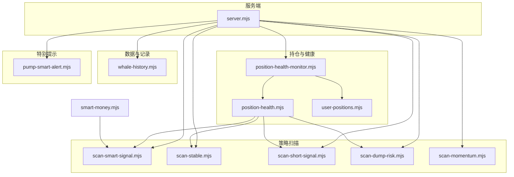

图表来源
- [server.mjs:1-120](file://server.mjs#L1-L120)
- [scan-smart-signal.mjs:1-120](file://scan-smart-signal.mjs#L1-L120)
- [scan-stable.mjs:1-120](file://scan-stable.mjs#L1-L120)
- [scan-short-signal.mjs:1-120](file://scan-short-signal.mjs#L1-L120)
- [scan-dump-risk.mjs:1-120](file://scan-dump-risk.mjs#L1-L120)
- [scan-momentum.mjs:1-80](file://scan-momentum.mjs#L1-L80)
- [position-health-monitor.mjs:1-120](file://position-health-monitor.mjs#L1-L120)
- [position-health.mjs:1-120](file://position-health.mjs#L1-L120)
- [whale-history.mjs:1-80](file://whale-history.mjs#L1-L80)
- [pump-smart-alert.mjs:1-120](file://pump-smart-alert.mjs#L1-L120)
- [smart-money.mjs:1-80](file://smart-money.mjs#L1-L80)

章节来源
- [README.md:1-210](file://README.md#L1-L210)
- [package.json:1-22](file://package.json#L1-L22)

## 核心组件
- 聪明钱监控系统
  - 数据来源：Binance Smart Signal 接口；同时聚合大户/全网多空比、OI、主动买卖量、资金费率等。
  - 指标：净多空比、盈利多头/空头数量、鲸鱼仓位与均价、RSI、MACD、MA 排列、成交量放大等。
  - 输出：方向标签（多/空/中性）、评分、信号明细、是否适合追涨或反转参考。
- 稳趋势扫描策略
  - 逻辑：右侧形态确认（价在 MA20 上方、MA5>MA20、RSI 区间、MACD 多头、放量），叠加双周期（1H/1D）回撤与趋势完整性校验。
  - 输出：评分、回撤百分比、趋势原因、是否通过“右侧稳趋势”判定。
- 做空信号检测
  - 逻辑：暴涨后回落、天量后缩量、RSI 超买、偏离均线过远、连续阴线、高位盘整、持续阴跌、8am 大跌等加权打分。
  - 输出：做空评分、信号明细、关键比率（如 RSI、偏离度）。
- 暴跌风险预警
  - 逻辑：24h/4h 跌幅、高点回撤、OI 萎缩、卖压、大户偏空、散多大空、负费率极端、连续阴线、缩量下跌等。
  - 输出：风险等级（高/警告/低）、风险分、风险明细列表。
- 动量做多扫描
  - 逻辑：8am 以来涨幅达标、均线多头排列、放量、RSI 健康区间、近 K 阳数。
  - 输出：评分、信号明细、8am 涨幅。
- 持仓健康监控
  - 逻辑：根据当前持仓方向，调用稳趋势/做空/暴跌/聪明钱信号进行健康评分，结合浮盈浮亏与止损止盈建议，给出操作建议（持有/收紧止损/考虑止盈/建议止损）。
  - 输出：健康状态（健康/警告/危险）、动作建议、距离止损/止盈百分比、理由。
- 鲸鱼历史追踪
  - 逻辑：周期性采集 Smart Signal 快照，写入本地 JSON，支持按币种查询与批量读取。
  - 输出：时间序列点集（比值、鲸鱼数量、盈亏人数、均价、价格等）。

章节来源
- [scan-smart-signal.mjs:1-238](file://scan-smart-signal.mjs#L1-L238)
- [scan-stable.mjs:1-290](file://scan-stable.mjs#L1-L290)
- [scan-short-signal.mjs:1-276](file://scan-short-signal.mjs#L1-L276)
- [scan-dump-risk.mjs:1-286](file://scan-dump-risk.mjs#L1-L286)
- [scan-momentum.mjs:1-104](file://scan-momentum.mjs#L1-L104)
- [position-health.mjs:1-213](file://position-health.mjs#L1-L213)
- [position-health-monitor.mjs:1-186](file://position-health-monitor.mjs#L1-L186)
- [whale-history.mjs:1-142](file://whale-history.mjs#L1-L142)

## 架构总览
系统以 server.mjs 为中枢，负责：
- 统一代理币安合约 API（含重试、熔断保护、缓存）
- 调度定时任务（稳趋势推送、暴跌预警、做多扫描、聪明钱整点摘要、持仓健康报告、鲸鱼采集、特别提示）
- 飞书卡片推送（带限流重试）
- 市值过滤与传统金融标的排除
- 暴露 REST API 给前端与外部调用

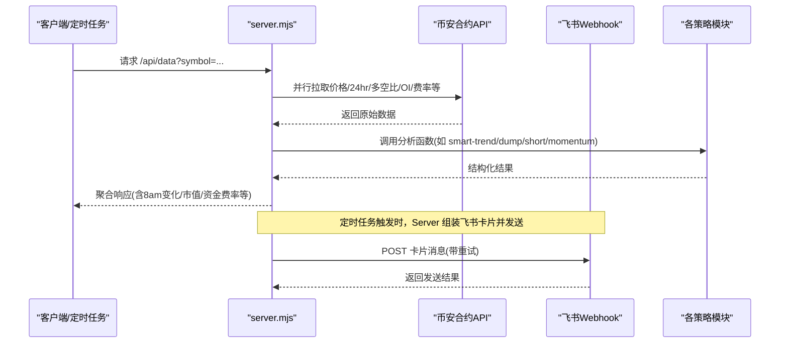

图表来源
- [server.mjs:508-538](file://server.mjs#L508-L538)
- [server.mjs:599-644](file://server.mjs#L599-L644)
- [server.mjs:668-781](file://server.mjs#L668-L781)

## 详细组件分析

### 聪明钱监控系统
- 业务逻辑
  - 通过 Binance Smart Signal 获取净多空比、盈利交易者数量、鲸鱼仓位与均价等，结合价格计算相对均值位置，生成方向与评分。
  - 支持全市场扫描并按方向筛选，输出排序后的候选池。
- 关键技术指标
  - 净多空比、盈利多头/空头数量、鲸鱼数量对比、鲸鱼盈亏人数、鲸鱼均价与现价偏差。
- 触发条件
  - 方向阈值（>1 或多头优势明显；<1 或空头优势明显）；评分≥2 进入结果集。
- 输出格式
  - 包含 direction/badge/ratio/score/signals/detail/isLong/isShort 等字段。
- 配置与使用
  - 环境变量：无直接开关，受 server.mjs 中扫描限制与并发参数影响。
  - 典型用法：server.mjs 中多处调用 scan-smart-signal 的 fetch/analyze/scan 能力。

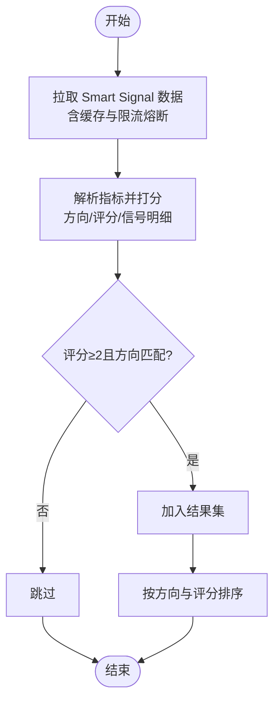

图表来源
- [scan-smart-signal.mjs:76-167](file://scan-smart-signal.mjs#L76-L167)
- [scan-smart-signal.mjs:182-238](file://scan-smart-signal.mjs#L182-L238)

章节来源
- [scan-smart-signal.mjs:1-238](file://scan-smart-signal.mjs#L1-L238)
- [server.mjs:1-120](file://server.mjs#L1-L120)

### 稳趋势扫描策略（右侧稳趋势）
- 业务逻辑
  - 单周期右侧形态评分（均线多排、RSI 区间、MACD 多头、放量），再叠加双周期（1H/1D）回撤与趋势完整性检查，确保“右侧稳趋势”。
- 关键技术指标
  - MA5/MA20、RSI6、MACD DIF/DEA、近期成交量均值对比、回撤比例、趋势完整性判断。
- 触发条件
  - 单周期评分≥3；双周期回撤≤阈值且趋势完整。
- 输出格式
  - symbol/label/score/drawdown/detail/tfResults 等。
- 配置与使用
  - 环境变量：STABLE_SCAN_LIMIT、STABLE_MAX_DRAWDOWN、STABLE_PUSH_HOURS、STABLE_PUSH_ENABLED 等。
  - 推送：server.mjs 定时执行 runStableTrendPush，构造飞书表格卡片。

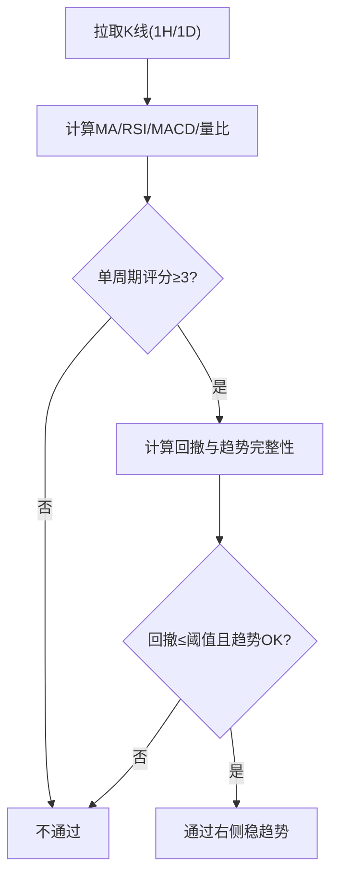

图表来源
- [scan-stable.mjs:91-193](file://scan-stable.mjs#L91-L193)
- [scan-stable.mjs:249-290](file://scan-stable.mjs#L249-L290)
- [server.mjs:668-781](file://server.mjs#L668-L781)

章节来源
- [scan-stable.mjs:1-290](file://scan-stable.mjs#L1-L290)
- [server.mjs:668-781](file://server.mjs#L668-L781)

### 做空信号检测
- 业务逻辑
  - 多维度打分：暴涨回落、天量后缩量、RSI 超买、偏离均线、连续阴线、高位盘整、持续阴跌、8am 大跌等。
- 关键技术指标
  - 24h 涨幅与峰值回撤、RSI6/14、MA20 偏离度、近 K 阴阳线计数、4h 区间统计、8am 基准涨跌幅。
- 触发条件
  - 总分≥4 才纳入结果，避免弱信号干扰。
- 输出格式
  - shortScore/signals/price/chg24h/ddFromPeak/rsi6/volRatio 等。
- 配置与使用
  - 由 server.mjs 整合 8am 涨跌映射传入，提高准确性。

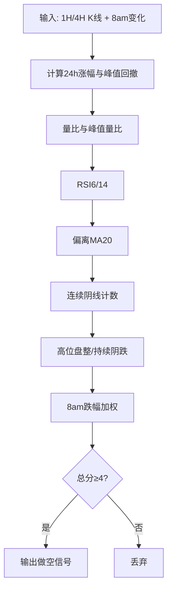

图表来源
- [scan-short-signal.mjs:28-204](file://scan-short-signal.mjs#L28-L204)
- [scan-short-signal.mjs:219-276](file://scan-short-signal.mjs#L219-L276)

章节来源
- [scan-short-signal.mjs:1-276](file://scan-short-signal.mjs#L1-L276)

### 暴跌风险预警
- 业务逻辑
  - 从价格跌幅、加速下跌、高点回撤、OI 萎缩、卖压、大户偏空、散多大空、资金费率异常、连续阴线、缩量下跌等多维度评分。
- 关键技术指标
  - 24h/4h 跌幅、高点回撤、OI 变化率、taker 买卖比均值、topPos/globalRatio 比值、资金费率、阴线计数、量比。
- 触发条件
  - riskScore≥6 高危；3-5 警告；<3 相对安全。
- 输出格式
  - riskScore/riskLevel/riskEmoji/risks/summary 等。
- 配置与使用
  - server.mjs 中定义 DUMP_* 环境变量控制扫描范围与推送频率。

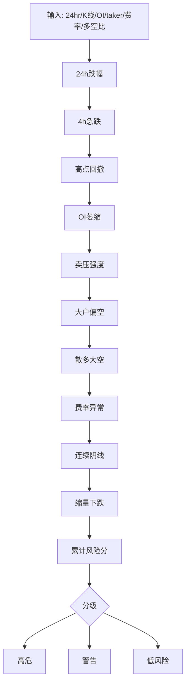

图表来源
- [scan-dump-risk.mjs:21-191](file://scan-dump-risk.mjs#L21-L191)
- [scan-dump-risk.mjs:209-286](file://scan-dump-risk.mjs#L209-L286)

章节来源
- [scan-dump-risk.mjs:1-286](file://scan-dump-risk.mjs#L1-L286)

### 动量做多扫描
- 业务逻辑
  - 基于 8am 以来的涨幅门槛，叠加均线多头排列、放量、RSI 健康区间、近 K 阳数等条件。
- 关键技术指标
  - 8am 涨幅、MA5/MA20、近期量比、RSI6、近4根阳线数。
- 触发条件
  - score≥3 纳入结果。
- 输出格式
  - score/signals/price/changeSince8am/detail/type。
- 配置与使用
  - 由 server.mjs 将 8am 涨幅映射传入，提升效率与准确性。

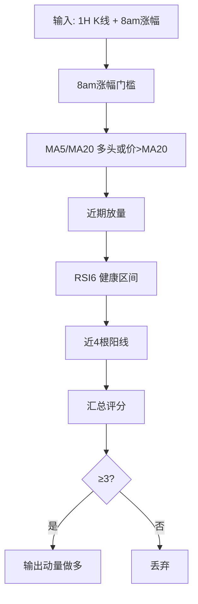

图表来源
- [scan-momentum.mjs:27-79](file://scan-momentum.mjs#L27-L79)
- [scan-momentum.mjs:94-104](file://scan-momentum.mjs#L94-L104)

章节来源
- [scan-momentum.mjs:1-104](file://scan-momentum.mjs#L1-L104)

### 持仓健康监控
- 业务逻辑
  - 根据持仓方向分别调用稳趋势/做空/暴跌/聪明钱信号，结合浮盈浮亏与止损止盈建议，得出健康评分与操作建议。
  - 支持紧急模式去重冷却，避免频繁重复推送。
- 关键技术指标
  - 稳趋势评分与回撤、做空信号分数、暴跌风险分、聪明钱方向与评分、PnL%、SL/TP 距离。
- 触发条件
  - 健康状态分级：健康/警告/危险；动作建议：继续持有/收紧止损/考虑止盈/建议止损。
- 输出格式
  - health/healthLabel/action/actionLabel/reasons/distanceToSLPct/distanceToTPPct 等。
- 配置与使用
  - 环境变量：POSITION_HEALTH_*；watchSymbols 可限定监控标的。
  - 定时：每 N 小时整点推送，危险/止损即时推送（带冷却）。

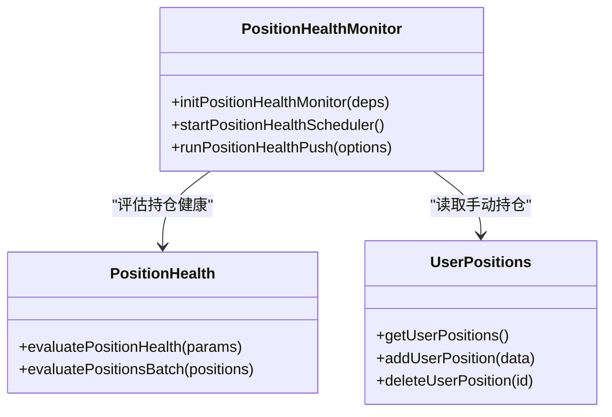

图表来源
- [position-health-monitor.mjs:10-186](file://position-health-monitor.mjs#L10-L186)
- [position-health.mjs:56-195](file://position-health.mjs#L56-L195)
- [user-positions.mjs:30-64](file://user-positions.mjs#L30-L64)

章节来源
- [position-health-monitor.mjs:1-186](file://position-health-monitor.mjs#L1-L186)
- [position-health.mjs:1-213](file://position-health.mjs#L1-L213)
- [user-positions.mjs:1-64](file://user-positions.mjs#L1-L64)

### 鲸鱼历史追踪
- 业务逻辑
  - 周期性采集 Smart Signal 快照，合并最近记录（最小间隔），限制最大点数，持久化到 data/whale-history.json。
- 关键技术指标
  - longShortRatio、鲸鱼数量、盈亏人数、鲸鱼均价、价格等。
- 触发条件
  - 按 WHALE_HISTORY_INTERVAL_MIN 定时采集；MIN_RECORD_GAP_MS 合并最近记录。
- 输出格式
  - points 数组（时间戳、比值、鲸鱼数量、盈亏人数、均价、价格等）。
- 配置与使用
  - 环境变量：WHALE_HISTORY_INTERVAL_MIN、WHALE_HISTORY_MAX_POINTS、WHALE_HISTORY_SYMBOLS、WHALE_HISTORY_MIN_GAP_MIN。

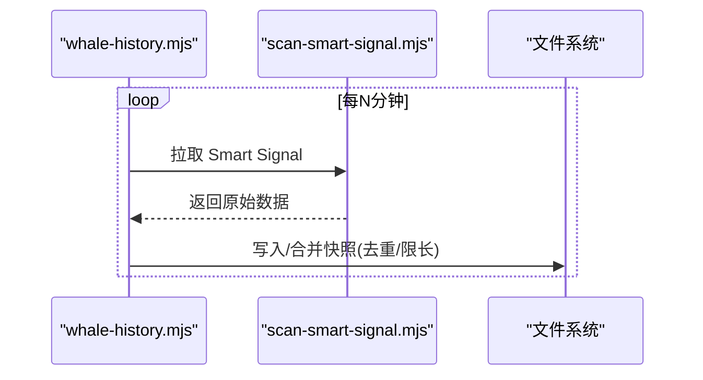

图表来源
- [whale-history.mjs:121-142](file://whale-history.mjs#L121-L142)
- [whale-history.mjs:47-90](file://whale-history.mjs#L47-L90)

章节来源
- [whale-history.mjs:1-142](file://whale-history.mjs#L1-L142)

### 特别提示：暴涨+聪明钱加仓做多
- 业务逻辑
  - 当 8am 涨幅达到阈值，且聪明钱多项确认（大户持仓偏多↑、OI增仓+涨、主动买入↑、大户>全网）则发出特别提示。
- 关键技术指标
  - topPos 比值变化、OI 变化、taker 买卖比、topAccounts vs globalRatio。
- 触发条件
  - 8am 涨幅≥minChange%，聪明钱确认项≥minSmartScore。
- 输出格式
  - 飞书表格元素，包含价格、8am/24h 涨幅、确认项、提醒次数等。
- 配置与使用
  - 环境变量：PUMP_SMART_*、REALTIME_ALERT_INTERVAL_MIN。

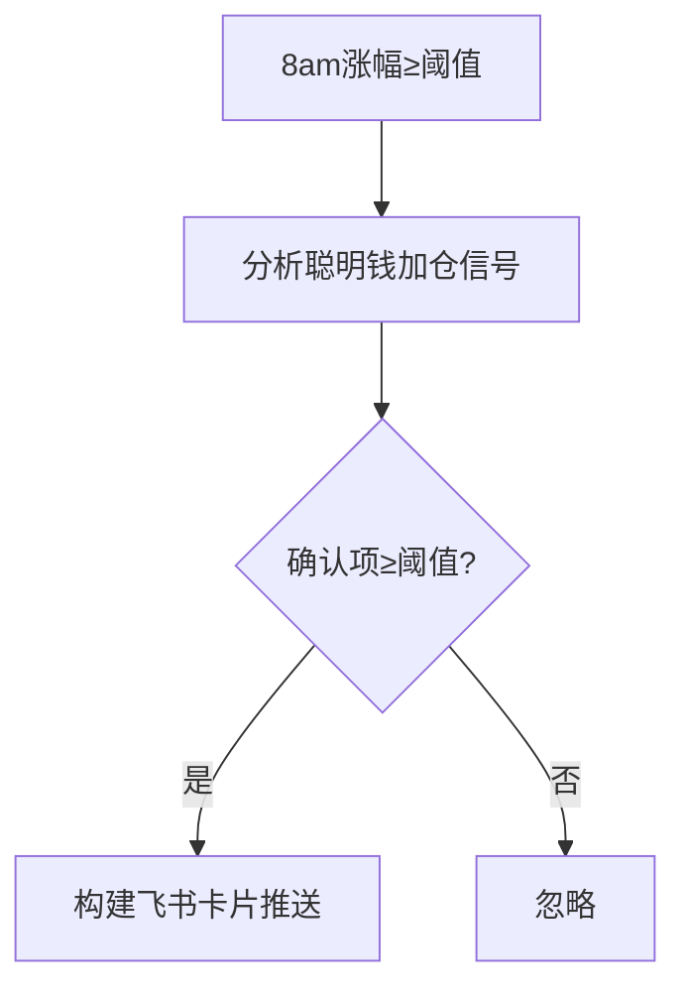

图表来源
- [pump-smart-alert.mjs:71-112](file://pump-smart-alert.mjs#L71-L112)
- [pump-smart-alert.mjs:151-191](file://pump-smart-alert.mjs#L151-L191)

章节来源
- [pump-smart-alert.mjs:1-191](file://pump-smart-alert.mjs#L1-L191)

## 依赖关系分析
- server.mjs 作为编排层，依赖各策略模块与公共工具（市值过滤、TradFi 过滤、代理与网络就绪检查）。
- 策略模块之间相互独立，但部分模块被其他模块复用（如 position-health 复用稳趋势/做空/暴跌/聪明钱信号）。
- whale-history 与 smart-trend 共享 Smart Signal 数据源，用于 8am 基准与历史回溯。

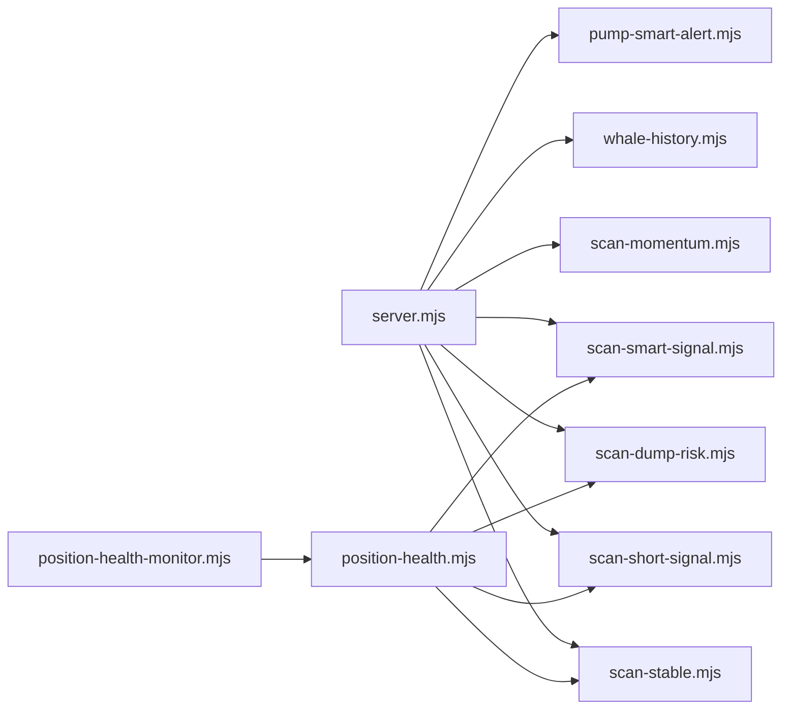

图表来源
- [server.mjs:1-120](file://server.mjs#L1-L120)
- [position-health.mjs:1-120](file://position-health.mjs#L1-L120)

章节来源
- [server.mjs:1-120](file://server.mjs#L1-L120)
- [position-health.mjs:1-120](file://position-health.mjs#L1-L120)

## 性能与并发特性
- 并发与去重
  - pmap 通用并发工具，控制并发度，避免对币安 API 造成压力。
  - ticker/24hr 短 TTL 缓存与 inflight 去重，减少同一轮推送重复请求。
- 网络容错
  - 网络就绪探测、指数退避重试、Smart Signal 限流熔断（418/429/403 处理）。
- 推送节流
  - 飞书卡片发送失败重试与频控识别；整点推送防重（lastDigestPushSlotMs）。
- 数据持久化
  - 写队列串行化，避免并发写冲突；历史数据限长与合并最近记录。

章节来源
- [server.mjs:84-125](file://server.mjs#L84-L125)
- [server.mjs:150-162](file://server.mjs#L150-L162)
- [scan-smart-signal.mjs:28-74](file://scan-smart-signal.mjs#L28-L74)
- [whale-history.mjs:40-45](file://whale-history.mjs#L40-L45)

## 故障排查指南
- 端口占用
  - 启动报 EADDRINUSE，建议使用 dev:restart 自动清理旧进程，或手动 kill 占用端口进程。
- 飞书推送失败
  - 检查 FEISHU_WEBHOOK 是否正确；若出现频控错误，系统会延迟重试；必要时降低推送频率。
- 市值过滤导致无结果
  - MAX_MARKET_CAP_USD 默认 50 亿，超过上限的币种会被过滤；可调整为 0 关闭过滤。
- TradFi 标的被拒绝
  - 股票相关合约不在监控范围，请求将被 403 拒绝；请更换普通加密货币合约。
- 网络不可用
  - 服务启动时会探测币安 API 可用性，若未就绪会指数退避重试；检查代理与环境变量。

章节来源
- [README.md:40-93](file://README.md#L40-L93)
- [server.mjs:484-506](file://server.mjs#L484-L506)
- [server.mjs:599-644](file://server.mjs#L599-L644)
- [server.mjs:107-125](file://server.mjs#L107-L125)

## 结论
BinaceSmart 以 server.mjs 为核心编排层，组合多个独立策略模块，形成从数据采集、指标计算、信号评分到推送告警的完整闭环。通过市值过滤、TradFi 排除、并发与缓存优化、飞书卡片推送与限流重试，系统在稳定性与实用性上具备良好表现。开发者可按需启用/调整各模块，快速集成到现有工作流。

## 附录：配置与使用示例
- 环境配置（.env）
  - PORT：Web 面板监听端口（默认 3388）
  - CMC_API_KEY：CoinMarketCap Pro API Key（可选，回退 CoinGecko）
  - MAX_MARKET_CAP_USD：市值上限（美元），0 表示关闭过滤
  - FEISHU_WEBHOOK：飞书机器人 Webhook URL
  - STABLE_PUSH_HOURS / STABLE_PUSH_ENABLED / STABLE_SCAN_LIMIT / STABLE_MAX_DRAWDOWN：稳趋势推送控制
  - DUMP_PUSH_HOURS / DUMP_PUSH_ENABLED / DUMP_SCAN_LIMIT / DUMP_MIN_RISK：暴跌预警控制
  - LONG_PUSH_HOURS / LONG_PUSH_ENABLED / LONG_SCAN_LIMIT / LONG_MIN_SCORE：做多扫描控制
  - POSITION_HEALTH_*：持仓健康监控相关
  - SMART_TREND_*：聪明钱整点摘要相关
  - WHALE_HISTORY_*：鲸鱼历史采集相关
  - PUMP_SMART_*：特别提示相关
- 运行方式
  - Web 面板：pnpm dev:restart 或 node --use-env-proxy server.mjs
  - 终端版：node smart-money.mjs [SYMBOL] [秒]
- API 示例
  - GET /api/data?symbol=BTCUSDT：聪明钱全量数据
  - GET /api/klines?symbol=BTCUSDT&interval=1h&limit=100：K 线数据
  - GET /api/marketcap?symbol=BTCUSDT：单币种市值
  - POST /api/feishu-alert：发送飞书报警
  - POST /api/trigger-stable-push：手动触发稳趋势推送

章节来源
- [README.md:55-93](file://README.md#L55-L93)
- [README.md:190-199](file://README.md#L190-L199)
- [package.json:9-18](file://package.json#L9-L18)