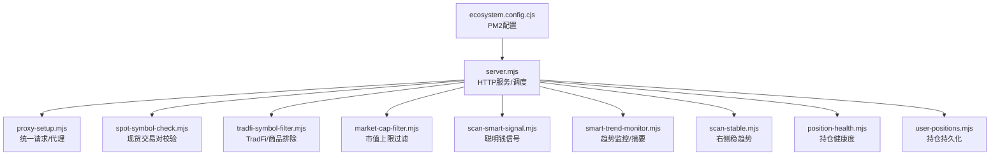
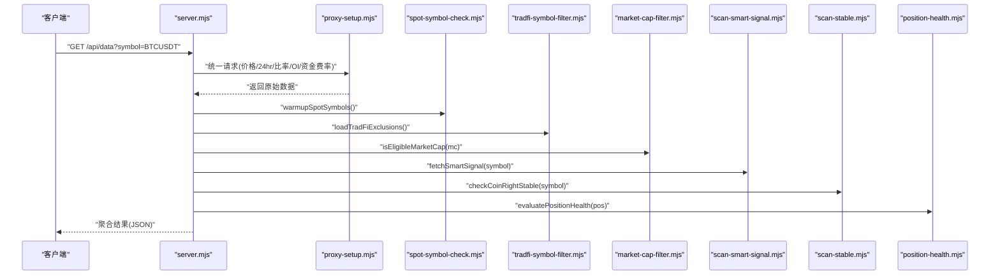
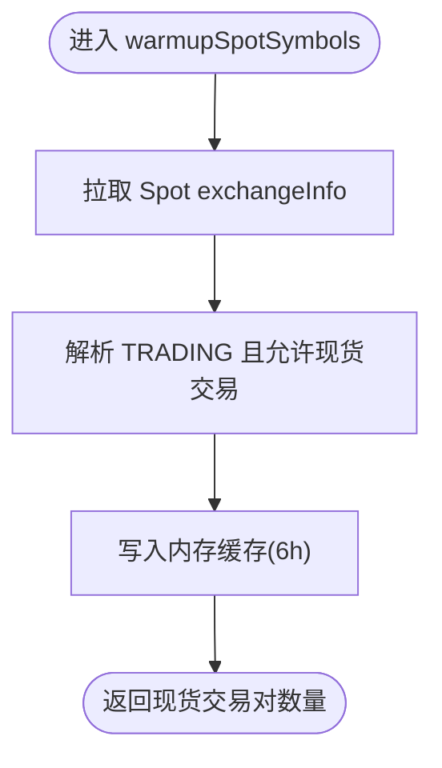
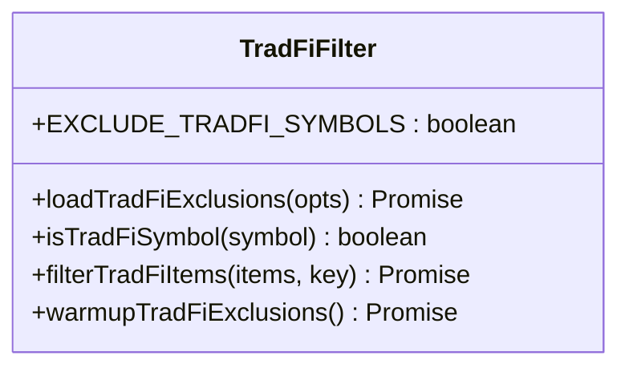
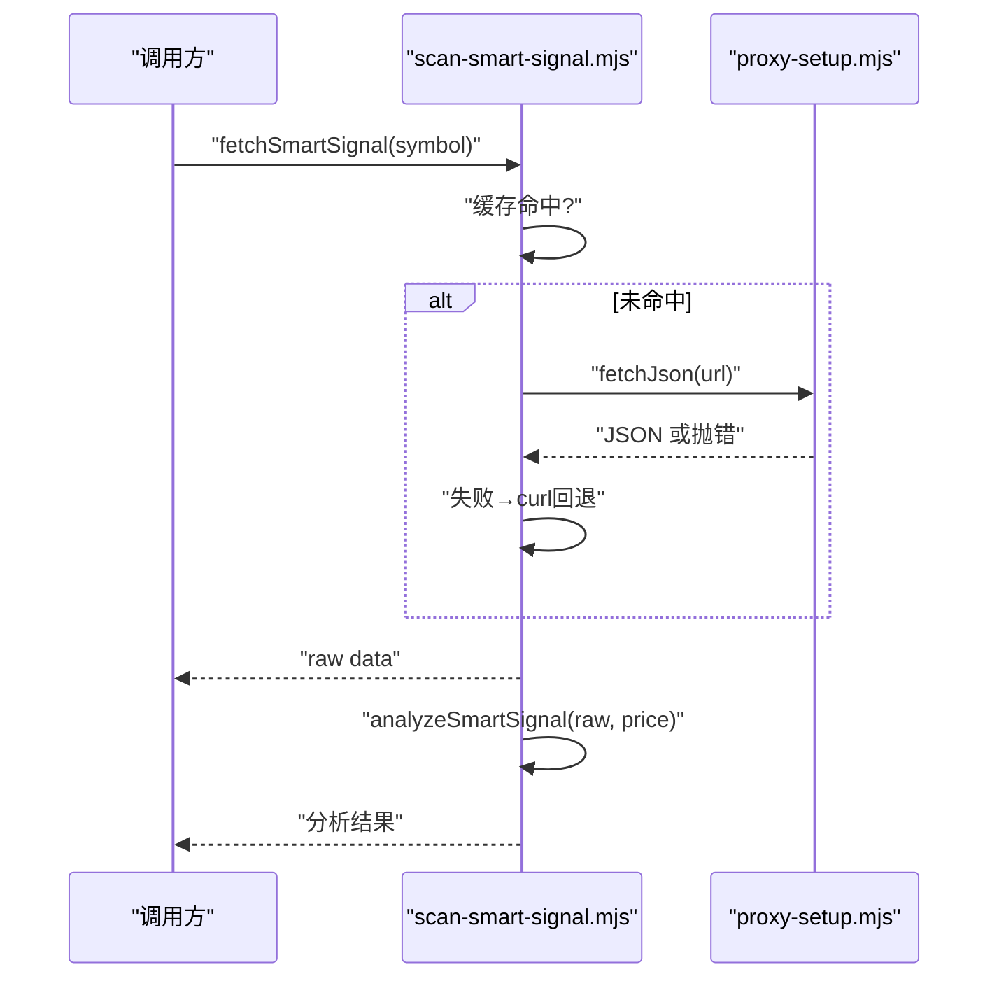
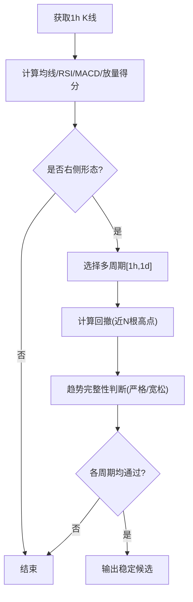
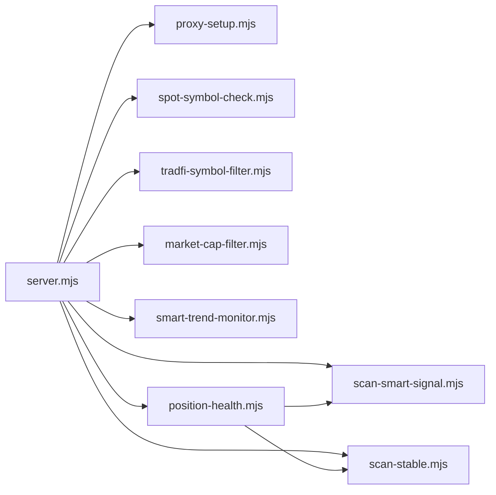

# 现货交易对验证系统

<cite>
**本文引用的文件**   
- [README.md](file://README.md)
- [package.json](file://package.json)
- [server.mjs](file://server.mjs)
- [proxy-setup.mjs](file://proxy-setup.mjs)
- [spot-symbol-check.mjs](file://spot-symbol-check.mjs)
- [tradfi-symbol-filter.mjs](file://tradfi-symbol-filter.mjs)
- [market-cap-filter.mjs](file://market-cap-filter.mjs)
- [scan-smart-signal.mjs](file://scan-smart-signal.mjs)
- [smart-trend-monitor.mjs](file://smart-trend-monitor.mjs)
- [scan-stable.mjs](file://scan-stable.mjs)
- [position-health.mjs](file://position-health.mjs)
- [user-positions.mjs](file://user-positions.mjs)
- [ecosystem.config.cjs](file://ecosystem.config.cjs)
</cite>

## 目录
1. [简介](#简介)
2. [项目结构](#项目结构)
3. [核心组件](#核心组件)
4. [架构总览](#架构总览)
5. [详细组件分析](#详细组件分析)
6. [依赖关系分析](#依赖关系分析)
7. [性能与并发特性](#性能与并发特性)
8. [故障排查指南](#故障排查指南)
9. [结论](#结论)
10. [附录：配置项速查](#附录配置项速查)

## 简介
本仓库是一个基于币安合约 API 的“聪明钱”监控与决策辅助系统，提供 Web 面板与终端两种使用方式。围绕“现货交易对验证”的核心目标，系统在扫描、筛选与推送前，通过现货交易对存在性校验、TradFi/商品排除、市值上限过滤等机制，确保只关注具备真实现货流动性且符合风控阈值的标的。同时，系统整合了多周期趋势、聪明钱信号、资金费率、大户与散户背离等维度，形成可配置的定时推送与报警能力。

## 项目结构
- 入口与调度
  - server.mjs：HTTP 服务、API 路由、定时任务编排、飞书卡片推送、缓存与并发控制
  - ecosystem.config.cjs：PM2 进程管理配置（Windows/Linux 通用）
- 数据源与网络
  - proxy-setup.mjs：统一 JSON 请求封装，优先 curl + 代理，兼容 Node fetch
- 过滤与校验
  - spot-symbol-check.mjs：加载并缓存现货交易对信息，支持按交易对或基础资产匹配
  - tradfi-symbol-filter.mjs：排除股票/TradFi/商品合约（含历史硬编码与动态 exchangeInfo）
  - market-cap-filter.mjs：市值上限过滤（默认 ≤ 50 亿美元）
- 策略与指标
  - scan-smart-signal.mjs：聪明钱信号抓取与分析（限流熔断、curl 回退）
  - smart-trend-monitor.mjs：聪明钱趋势监控、整点摘要、8am 基准、背离统计
  - scan-stable.mjs：右侧稳趋势扫描（MA/RSI/MACD/回撤/双周期确认）
  - position-health.mjs：持仓健康度评估（结合趋势、暴跌风险、聪明钱方向）
  - user-positions.mjs：用户持仓持久化（JSON 文件）
- 文档与脚本
  - README.md：功能说明、快速开始、API、环境变量
  - package.json：脚本命令与运行环境要求

图表来源
- [server.mjs:1-29](file://server.mjs#L1-L29)
- [proxy-setup.mjs:1-71](file://proxy-setup.mjs#L1-L71)
- [spot-symbol-check.mjs:1-106](file://spot-symbol-check.mjs#L1-L106)
- [tradfi-symbol-filter.mjs:1-113](file://tradfi-symbol-filter.mjs#L1-L113)
- [market-cap-filter.mjs:1-15](file://market-cap-filter.mjs#L1-L15)
- [scan-smart-signal.mjs:1-241](file://scan-smart-signal.mjs#L1-L241)
- [smart-trend-monitor.mjs:1-120](file://smart-trend-monitor.mjs#L1-L120)
- [scan-stable.mjs:1-295](file://scan-stable.mjs#L1-L295)
- [position-health.mjs:1-213](file://position-health.mjs#L1-L213)
- [user-positions.mjs:1-64](file://user-positions.mjs#L1-L64)
- [ecosystem.config.cjs:1-33](file://ecosystem.config.cjs#L1-L33)

章节来源
- [README.md:1-210](file://README.md#L1-L210)
- [package.json:1-22](file://package.json#L1-L22)

## 核心组件
- 统一网络层（proxy-setup.mjs）
  - 自动启用 Node --use-env-proxy；在 Windows 且有代理时优先调用 curl 执行请求，避免 Node fetch 代理不稳定问题
  - 统一超时、错误处理、地区限制提示
- 现货交易对验证（spot-symbol-check.mjs）
  - 异步加载 Binance Spot exchangeInfo，缓存 6 小时
  - 支持按完整交易对（如 BTCUSDT）或基础资产（如 BTC）匹配
  - 可通过 FILTER_SPOT_ONLY 开启严格过滤
- TradFi/商品排除（tradfi-symbol-filter.mjs）
  - 依据 fapi/v1/exchangeInfo 的 contractType/underlyingType/underlyingSubType 判定
  - 内置历史硬编码与商品正则模式，支持 EXCLUDE_SYMBOLS 扩展
- 市值过滤（market-cap-filter.mjs）
  - 默认 MAX_MARKET_CAP_USD=50 亿美元，超过则不纳入监控/推送
- 聪明钱信号（scan-smart-signal.mjs）
  - 限流与熔断保护，失败回退 curl；分析多空比、盈利交易者、鲸鱼仓位、均价偏离等
- 趋势与摘要（smart-trend-monitor.mjs）
  - 整点推送全池变化摘要，计算 8am 基准、1h 变化、背离统计、分档计分
- 右侧稳趋势（scan-stable.mjs）
  - MA/RSI/MACD/放量/回撤/双周期确认，输出评分与详情
- 持仓健康度（position-health.mjs）
  - 综合趋势有效性、暴跌风险、聪明钱方向、PnL 等给出健康等级与操作建议
- 用户持仓（user-positions.mjs）
  - 本地 JSON 持久化，增删查接口

章节来源
- [proxy-setup.mjs:1-71](file://proxy-setup.mjs#L1-L71)
- [spot-symbol-check.mjs:1-106](file://spot-symbol-check.mjs#L1-L106)
- [tradfi-symbol-filter.mjs:1-113](file://tradfi-symbol-filter.mjs#L1-L113)
- [market-cap-filter.mjs:1-15](file://market-cap-filter.mjs#L1-L15)
- [scan-smart-signal.mjs:1-241](file://scan-smart-signal.mjs#L1-L241)
- [smart-trend-monitor.mjs:1-120](file://smart-trend-monitor.mjs#L1-L120)
- [scan-stable.mjs:1-295](file://scan-stable.mjs#L1-L295)
- [position-health.mjs:1-213](file://position-health.mjs#L1-L213)
- [user-positions.mjs:1-64](file://user-positions.mjs#L1-L64)

## 架构总览
系统以 server.mjs 为中枢，聚合多个独立模块完成数据采集、过滤、分析与推送。关键流程包括：
- 启动阶段：加载 .env、初始化代理、预热现货与 TradFi 过滤列表、注册定时任务
- 请求阶段：统一通过 proxy-setup.mjs 发起请求，带重试与熔断
- 过滤阶段：TradFi/商品 → 现货交易对存在性 → 市值上限
- 分析阶段：聪明钱信号、趋势打分、稳健性检查、健康度评估
- 推送阶段：飞书卡片 V2，支持表格、分页、颜色高亮

图表来源
- [server.mjs:1-29](file://server.mjs#L1-L29)
- [proxy-setup.mjs:1-71](file://proxy-setup.mjs#L1-L71)
- [spot-symbol-check.mjs:1-106](file://spot-symbol-check.mjs#L1-L106)
- [tradfi-symbol-filter.mjs:1-113](file://tradfi-symbol-filter.mjs#L1-L113)
- [market-cap-filter.mjs:1-15](file://market-cap-filter.mjs#L1-L15)
- [scan-smart-signal.mjs:1-241](file://scan-smart-signal.mjs#L1-L241)
- [scan-stable.mjs:1-295](file://scan-stable.mjs#L1-L295)
- [position-health.mjs:1-213](file://position-health.mjs#L1-L213)

## 详细组件分析

### 现货交易对验证（spot-symbol-check.mjs）
- 设计要点
  - 首次异步拉取 Binance Spot exchangeInfo，解析 symbols 中 status=TRADING 且 isSpotTradingAllowed=true 的交易对
  - 维护内存缓存（6 小时），提供同步判断 hasSpotTrading(hasSpotAsset)
  - filterSpotItems 支持 useAssetMatch 按基础资产匹配（如 BTCUSDT→BTC）
- 复杂度
  - 加载 O(N)，N 为现货交易对数量；查询 O(1)
- 优化建议
  - 可按需增量更新（diff）减少带宽
  - 增加本地持久化，冷启动更快

图表来源
- [spot-symbol-check.mjs:24-52](file://spot-symbol-check.mjs#L24-L52)
- [spot-symbol-check.mjs:84-96](file://spot-symbol-check.mjs#L84-L96)

章节来源
- [spot-symbol-check.mjs:1-106](file://spot-symbol-check.mjs#L1-L106)

### TradFi/商品排除（tradfi-symbol-filter.mjs）
- 设计要点
  - 从 fapi/v1/exchangeInfo 读取 symbol 元信息，按 contractType/underlyingType/underlyingSubType 判定
  - 内置历史硬编码与商品正则，支持 EXCLUDE_SYMBOLS 环境变量扩展
  - loadTradFiExclusions 缓存 6 小时，isTradFiSymbol/filterTradFiItems 同步判断
- 复杂度
  - 加载 O(M)，M 为合约总数；查询 O(1)
- 优化建议
  - 仅加载必要字段，降低响应体大小
  - 支持白名单覆盖黑名单

图表来源
- [tradfi-symbol-filter.mjs:59-113](file://tradfi-symbol-filter.mjs#L59-L113)

章节来源
- [tradfi-symbol-filter.mjs:1-113](file://tradfi-symbol-filter.mjs#L1-L113)

### 市值过滤（market-cap-filter.mjs）
- 设计要点
  - 通过 MAX_MARKET_CAP_USD 控制阈值，默认 50 亿美元
  - isEligibleMarketCap 用于批量过滤，formatMaxMarketCapLabel 用于展示
- 复杂度
  - O(1) 判断；批量过滤取决于上游数据规模

章节来源
- [market-cap-filter.mjs:1-15](file://market-cap-filter.mjs#L1-L15)

### 聪明钱信号（scan-smart-signal.mjs）
- 设计要点
  - 限流与熔断：最小间隔 600ms，418/429/403 触发熔断
  - 失败回退：Node fetch 失败后走 curl 执行
  - analyzeSmartSignal 输出方向、评分、信号明细、鲸鱼均价偏离等
- 复杂度
  - 单标的时间复杂度 O(1)；批量扫描 pmap 并发可控
- 优化建议
  - 增加本地缓存命中率（已实现 TTL）
  - 针对高频币种做热点预取

图表来源
- [scan-smart-signal.mjs:77-85](file://scan-smart-signal.mjs#L77-L85)
- [scan-smart-signal.mjs:87-168](file://scan-smart-signal.mjs#L87-L168)
- [proxy-setup.mjs:49-71](file://proxy-setup.mjs#L49-L71)

章节来源
- [scan-smart-signal.mjs:1-241](file://scan-smart-signal.mjs#L1-L241)

### 右侧稳趋势（scan-stable.mjs）
- 设计要点
  - 指标：MA5/MA20、RSI6、MACD、成交量放大、回撤
  - 双周期确认：1h+1d，严格趋势模式拒绝阴跌/破位
  - scanRightStable 输出评分、回撤、详情，供推送与看板展示
- 复杂度
  - 单标 O(K)，K 为 K 线长度；批量 pmap 并发 3
- 优化建议
  - 并行拉取多周期 K 线
  - 增量计算指标（滑动窗口）

图表来源
- [scan-stable.mjs:92-140](file://scan-stable.mjs#L92-L140)
- [scan-stable.mjs:164-194](file://scan-stable.mjs#L164-L194)
- [scan-stable.mjs:252-294](file://scan-stable.mjs#L252-L294)

章节来源
- [scan-stable.mjs:1-295](file://scan-stable.mjs#L1-L295)

### 聪明钱趋势监控（smart-trend-monitor.mjs）
- 设计要点
  - 整点推送全池变化摘要，记录 8am 基准与 1h 变化
  - 大户 vs 散户背离检测（whaleRatio-globalRatio）
  - 分档计分（≥5%→1分，≥15%→2分，≥35%→3分）
  - 状态持久化到 data/smart-trend-state.json
- 复杂度
  - 批量扫描 O(S×T)，S 为标的数，T 为指标计算成本
- 优化建议
  - 对低活跃度币种降频
  - 增量保存状态，减少磁盘 IO

章节来源
- [smart-trend-monitor.mjs:1-120](file://smart-trend-monitor.mjs#L1-L120)
- [smart-trend-monitor.mjs:264-350](file://smart-trend-monitor.mjs#L264-L350)
- [smart-trend-monitor.mjs:577-752](file://smart-trend-monitor.mjs#L577-L752)

### 持仓健康度（position-health.mjs）
- 设计要点
  - 做多：结合右侧稳趋势、暴跌风险、聪明钱方向、浮盈浮亏
  - 做空：结合短空信号强度、趋势反转风险
  - 输出健康等级（健康/警告/危险）、动作建议（持有/收紧止损/止盈/止损）
- 复杂度
  - 单次评估涉及多次外部请求，注意并发与超时
- 优化建议
  - 批量化请求合并
  - 缓存近期 K 线与指标

章节来源
- [position-health.mjs:1-213](file://position-health.mjs#L1-L213)

### 用户持仓（user-positions.mjs）
- 设计要点
  - 本地 JSON 持久化，支持添加/删除/查询
  - 队列式写入，避免并发写冲突
- 复杂度
  - 读写 O(N)，N 为持仓条数

章节来源
- [user-positions.mjs:1-64](file://user-positions.mjs#L1-L64)

### 统一网络层（proxy-setup.mjs）
- 设计要点
  - 自动设置 NODE_USE_ENV_PROXY，Windows 有代理优先 curl
  - 统一超时、错误处理、地区限制提示
- 复杂度
  - 每次请求 O(1)；curl 子进程开销略高但更稳定

章节来源
- [proxy-setup.mjs:1-71](file://proxy-setup.mjs#L1-L71)

## 依赖关系分析
- 耦合与内聚
  - server.mjs 作为编排中心，依赖各模块的导出函数，保持低耦合
  - 过滤链（TradFi→现货→市值）顺序清晰，职责单一
- 直接/间接依赖
  - server.mjs → proxy-setup.mjs（网络）
  - server.mjs → spot-symbol-check.mjs/tradfi-symbol-filter.mjs/market-cap-filter.mjs（过滤）
  - server.mjs → scan-smart-signal.mjs/smart-trend-monitor.mjs/scan-stable.mjs/position-health.mjs（分析）
  - position-health.mjs → scan-stable.mjs/scan-short-signal.mjs/scan-dump-risk.mjs/scan-smart-signal.mjs（组合分析）
- 外部依赖
  - 币安合约 API（fapi.binance.com）
  - 币安现货 API（api.binance.com）
  - 飞书 Webhook（可选）
  - CoinMarketCap Pro/CoinGecko（市值，可选）

图表来源
- [server.mjs:1-29](file://server.mjs#L1-L29)
- [position-health.mjs:1-213](file://position-health.mjs#L1-L213)

章节来源
- [server.mjs:1-29](file://server.mjs#L1-L29)
- [position-health.mjs:1-213](file://position-health.mjs#L1-L213)

## 性能与并发特性
- 并发模型
  - pmap 工具函数控制并发度，避免瞬时大量请求导致限流
  - ticker/24hr 短 TTL 缓存 + 并发去重，减少重复请求
- 缓存策略
  - 现货/TradFi 列表 6 小时缓存
  - 聪明钱信号 5 分钟缓存
  - 8am 基准价格按日缓存
- 容错与降级
  - 网络请求失败回退 curl
  - 限流熔断，指数退避重试
- 资源占用
  - PM2 配置 max_memory_restart=512M，适合长期运行

章节来源
- [server.mjs:85-106](file://server.mjs#L85-L106)
- [scan-smart-signal.mjs:17-27](file://scan-smart-signal.mjs#L17-L27)
- [spot-symbol-check.mjs:9-12](file://spot-symbol-check.mjs#L9-L12)
- [tradfi-symbol-filter.mjs:8-9](file://tradfi-symbol-filter.mjs#L8-L9)
- [ecosystem.config.cjs:1-33](file://ecosystem.config.cjs#L1-L33)

## 故障排查指南
- 端口占用
  - 使用 dev:restart 自动清理旧进程；或手动 netstat/taskkill
- 代理与跨域
  - 使用 node --use-env-proxy；Windows 下优先 curl 执行
- 限流与熔断
  - 出现 418/429/403 将触发熔断，等待 retry-after 后重试
- 地区限制
  - 若返回 restricted location，请检查代理节点与账号权限
- 飞书推送失败
  - 检查 FEISHU_WEBHOOK 配置；频控错误会抛出异常并记录

章节来源
- [README.md:40-53](file://README.md#L40-L53)
- [proxy-setup.mjs:25-44](file://proxy-setup.mjs#L25-L44)
- [scan-smart-signal.mjs:44-56](file://scan-smart-signal.mjs#L44-L56)
- [server.mjs:630-656](file://server.mjs#L630-L656)

## 结论
本系统围绕“现货交易对验证”构建了完整的过滤与分析链路：先排除非现货/TradFi/商品与超大市值标的，再结合聪明钱信号、趋势稳健性与健康度评估，最终输出可操作的推送与看板内容。整体架构模块化、可配置、具备良好容错与并发控制，适合在生产环境中长期稳定运行。

## 附录：配置项速查
- 端口与环境
  - PORT：Web 面板监听端口（默认 3388）
  - NODE_ENV：生产环境标志
- 代理与网络
  - HTTPS_PROXY/HTTP_PROXY：代理地址
  - NO_PROXY：直连域名
- 市值与过滤
  - MAX_MARKET_CAP_USD：市值上限（美元），0 关闭过滤
  - FILTER_SPOT_ONLY：是否仅保留有现货交易的标的
  - EXCLUDE_TRADFI_SYMBOLS：是否启用 TradFi/商品排除
  - EXCLUDE_SYMBOLS：额外排除符号（逗号分隔）
- 推送与扫描
  - FEISHU_WEBHOOK：飞书机器人 Webhook
  - STABLE_PUSH_HOURS/STABLE_SCAN_LIMIT/STABLE_MAX_DRAWDOWN：稳趋势推送参数
  - SMART_TREND_INTERVAL_MIN/SMART_TREND_COOLDOWN_MIN/SMART_TREND_RATIO_CHANGE_PCT：聪明钱趋势参数
  - POSITION_HEALTH_ENABLED/POSITION_HEALTH_PUSH_HOURS：持仓健康度推送开关与间隔
- 其他
  - CMC_API_KEY：CoinMarketCap Pro Key（可选）
  - SPOT_HOLDINGS：有现货的币种集合（影响推荐逻辑）

章节来源
- [README.md:142-159](file://README.md#L142-L159)
- [server.mjs:542-601](file://server.mjs#L542-L601)
- [market-cap-filter.mjs:1-15](file://market-cap-filter.mjs#L1-L15)
- [spot-symbol-check.mjs:12](file://spot-symbol-check.mjs#L12)
- [tradfi-symbol-filter.mjs:38-48](file://tradfi-symbol-filter.mjs#L38-L48)