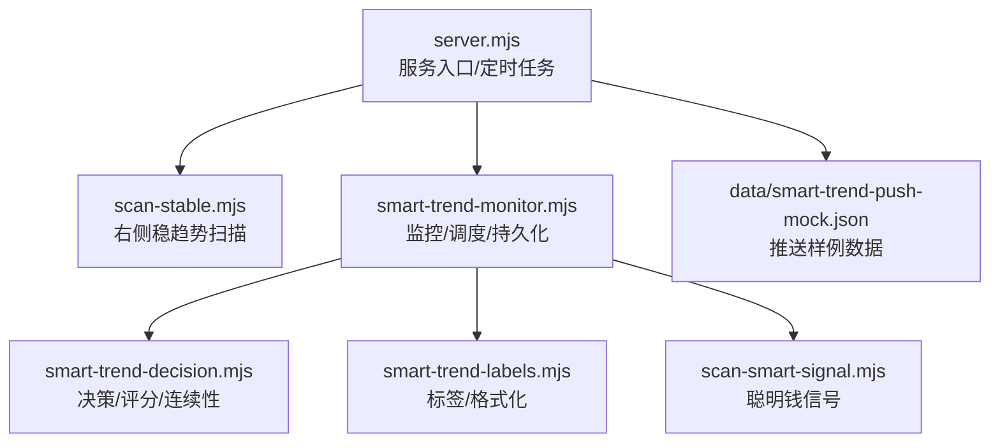
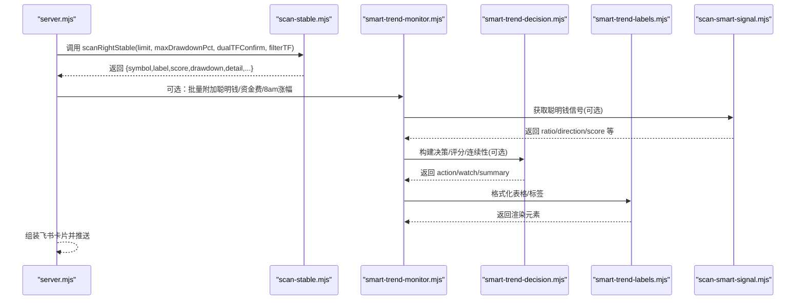
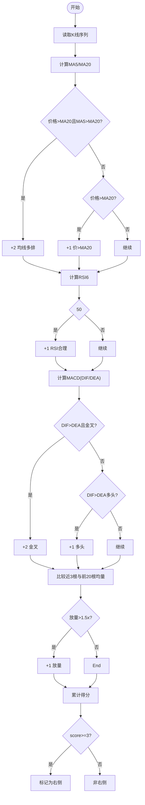
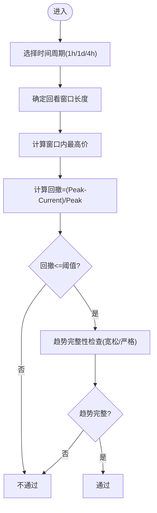
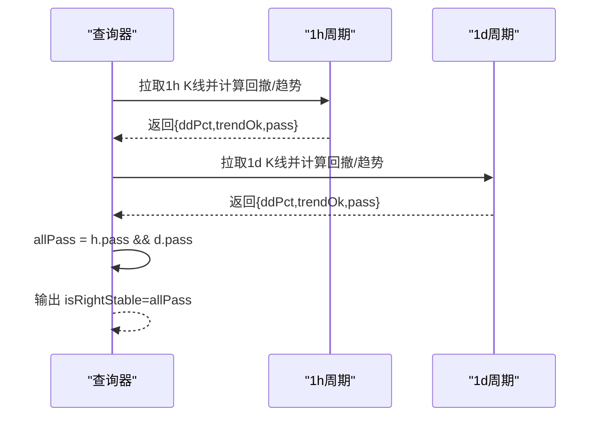
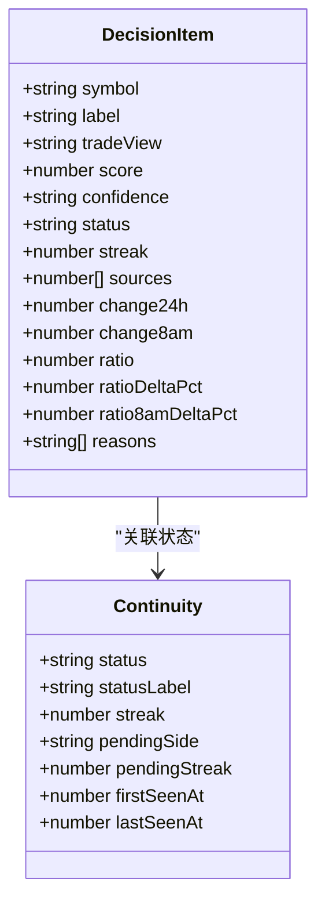
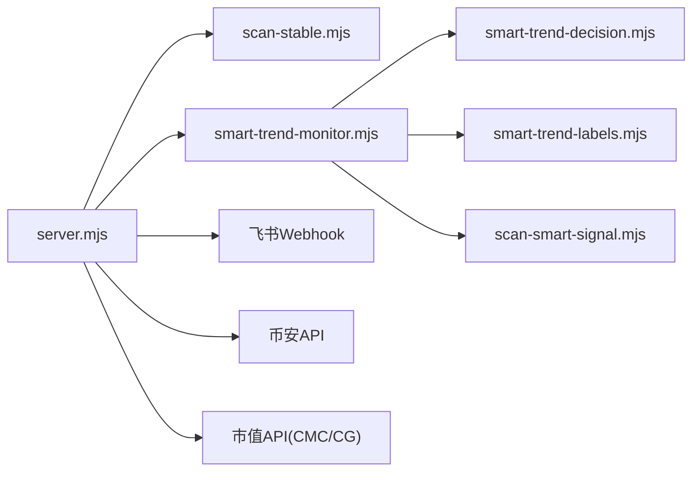

# 稳趋势扫描策略

<cite>
**本文引用的文件**   
- [README.md](file://README.md)
- [scan-stable.mjs](file://scan-stable.mjs)
- [smart-trend-decision.mjs](file://smart-trend-decision.mjs)
- [smart-trend-labels.mjs](file://smart-trend-labels.mjs)
- [smart-trend-monitor.mjs](file://smart-trend-monitor.mjs)
- [server.mjs](file://server.mjs)
- [scan-smart-signal.mjs](file://scan-smart-signal.mjs)
- [data/smart-trend-push-mock.json](file://data/smart-trend-push-mock.json)
</cite>

## 目录
1. [引言](#引言)
2. [项目结构](#项目结构)
3. [核心组件](#核心组件)
4. [架构总览](#架构总览)
5. [详细组件分析](#详细组件分析)
6. [依赖关系分析](#依赖关系分析)
7. [性能与并发特性](#性能与并发特性)
8. [配置参数说明](#配置参数说明)
9. [使用场景与案例](#使用场景与案例)
10. [故障排查指南](#故障排查指南)
11. [结论](#结论)

## 引言
本文件为“右侧稳趋势”扫描策略的综合文档，面向希望理解并落地“右侧交易理论”的量化/半自动化交易者。策略围绕“右侧确认 + 回撤控制 + 双周期验证 + 评分模型 + 风险控制”展开，结合技术指标（MA、RSI、MACD）、聪明钱信号、市值过滤与飞书推送，形成可复用的稳健趋势发现流程。

## 项目结构
- 策略核心实现位于 scan-stable.mjs，提供“右侧形态识别”和“右侧稳趋势筛选”两大能力。
- 决策层 smart-trend-decision.mjs 负责多源榜单合并、评分、连续性判断与输出卡片。
- 监控调度 smart-trend-monitor.mjs 负责定时任务、状态持久化、8am基准更新与汇总展示。
- 服务端 server.mjs 集成各模块，暴露 API 与定时任务，驱动稳趋势推送。
- 标签与格式化 smart-trend-labels.mjs 提供统一的数据展示与提示逻辑。
- 聪明钱信号 scan-smart-signal.mjs 提供净多空比等指标与分析。
- README.md 提供系统功能概览与配置项说明。

图表来源
- [server.mjs:1-120](file://server.mjs#L1-L120)
- [scan-stable.mjs:1-60](file://scan-stable.mjs#L1-L60)
- [smart-trend-monitor.mjs:1-60](file://smart-trend-monitor.mjs#L1-L60)
- [smart-trend-decision.mjs:1-40](file://smart-trend-decision.mjs#L1-L40)
- [smart-trend-labels.mjs:1-40](file://smart-trend-labels.mjs#L1-L40)
- [scan-smart-signal.mjs:1-40](file://scan-smart-signal.mjs#L1-L40)
- [data/smart-trend-push-mock.json:1-20](file://data/smart-trend-push-mock.json#L1-L20)

章节来源
- [README.md:134-159](file://README.md#L134-L159)
- [server.mjs:540-590](file://server.mjs#L540-L590)

## 核心组件
- 右侧形态识别：基于 K 线序列计算 MA5/MA20、RSI6、MACD(DIF/DEA)、成交量变化，给出“是否处于右侧”及评分。
- 回撤控制：按时间周期自适应回看窗口，计算从近期高点回落幅度，限制最大回撤阈值。
- 双周期确认：在基础周期（默认 1h）满足右侧后，再对 1h 与 1d 进行回撤与趋势一致性校验。
- 评分模型：综合均线排列、价格相对位置、RSI区间、MACD金叉/多头、放量等因子加权计分。
- 风险控制：严格趋势模式拒绝阴跌/破位；双周期同时通过才纳入最终候选；连续出现次数统计用于排序与稳定性评估。

章节来源
- [scan-stable.mjs:8-139](file://scan-stable.mjs#L8-L139)
- [scan-stable.mjs:141-193](file://scan-stable.mjs#L141-L193)
- [scan-stable.mjs:249-289](file://scan-stable.mjs#L249-L289)

## 架构总览
稳趋势扫描的整体流程如下：
- 服务端启动后加载环境变量与代理设置，初始化策略与监控模块。
- 定时任务触发时，调用 scanRightStable 扫描 Top N USDT 合约币种。
- 对每个币种先做“右侧形态识别”，再通过“双周期回撤+趋势”校验。
- 结果经市值过滤、8am涨幅补充、大户/全网多空比增强后，生成飞书卡片推送。
- 监控模块维护历史状态、8am基准、评分与连续性，供决策层与面板展示使用。

图表来源
- [server.mjs:668-781](file://server.mjs#L668-L781)
- [scan-stable.mjs:249-289](file://scan-stable.mjs#L249-L289)
- [smart-trend-monitor.mjs:706-760](file://smart-trend-monitor.mjs#L706-L760)
- [smart-trend-decision.mjs:556-640](file://smart-trend-decision.mjs#L556-L640)
- [smart-trend-labels.mjs:203-224](file://smart-trend-labels.mjs#L203-L224)
- [scan-smart-signal.mjs:76-167](file://scan-smart-signal.mjs#L76-L167)

## 详细组件分析

### 右侧形态识别（单周期）
- 输入：K 线数组（OHLCV），默认最近 100 根。
- 指标计算：
  - MA5/MA20：简单移动平均，用于判断多头排列与支撑。
  - RSI6：短期动量，优选 50~80 区间避免超买区追高。
  - MACD：DIF/DEA，优先金叉或持续多头。
  - 成交量：近 3 根均量对比前 20 根均量，放量加分。
- 评分规则（示例权重）：
  - 均线多头排列或价格在 MA20 上方：+1~+2
  - RSI6 在合理区间：+1
  - MACD 金叉或多头：+1~+2
  - 放量：+1
- 输出：isRightSide(score>=3)、score、detail（含信号明细）。

图表来源
- [scan-stable.mjs:8-139](file://scan-stable.mjs#L8-L139)

章节来源
- [scan-stable.mjs:8-139](file://scan-stable.mjs#L8-L139)

### 回撤控制与趋势完整性
- 回撤计算：取回看窗口内最高价与当前收盘价，计算回撤百分比。
- 回看窗口：根据周期自适应（1d→30，4h→36，其他→48）。
- 趋势完整性检查：
  - 宽松模式：价格不破 MA20，且在关键低点附近获得支撑。
  - 严格模式：拒绝 MA5<MA20、近3K走弱、连续阴线、跌破 MA20 一定比例。
- 通过条件：回撤≤阈值 且 趋势完整。

图表来源
- [scan-stable.mjs:50-89](file://scan-stable.mjs#L50-L89)
- [scan-stable.mjs:141-161](file://scan-stable.mjs#L141-L161)

章节来源
- [scan-stable.mjs:50-89](file://scan-stable.mjs#L50-L89)
- [scan-stable.mjs:141-161](file://scan-stable.mjs#L141-L161)

### 双周期确认机制
- 基础周期：默认 1h，先完成“右侧形态识别”。
- 双周期集合：[1h, 1d]，分别执行回撤与趋势检查。
- 判定：所有周期均通过才算“右侧稳趋势”。
- 输出：包含各周期回撤、趋势原因、是否通过等详情。

图表来源
- [scan-stable.mjs:163-193](file://scan-stable.mjs#L163-L193)

章节来源
- [scan-stable.mjs:163-193](file://scan-stable.mjs#L163-L193)

### 评分模型与连续性
- 评分维度：
  - 多榜共振（来源数量）
  - 右侧形态命中
  - 涨跌幅排名（涨幅/跌幅/成交额）
  - 聪明钱方向与变化幅度
  - 资金费率变化（辅助）
- 连续性：
  - 记录上次出现时间与方向，若反向需连续2小时确认，避免频繁反手。
  - 强度变化：分数提升/下降影响“加强/减弱”状态。
- 输出：action（立刻关注）、watch（继续观察）、invalidated（已失效）。

图表来源
- [smart-trend-decision.mjs:424-472](file://smart-trend-decision.mjs#L424-L472)
- [smart-trend-decision.mjs:340-403](file://smart-trend-decision.mjs#L340-L403)

章节来源
- [smart-trend-decision.mjs:282-313](file://smart-trend-decision.mjs#L282-L313)
- [smart-trend-decision.mjs:340-403](file://smart-trend-decision.mjs#L340-L403)
- [smart-trend-decision.mjs:556-640](file://smart-trend-decision.mjs#L556-L640)

### 与外部模块的数据交互与输出格式
- 输入：
  - 币安合约 K 线、24h 行情、聪明钱信号、资金费率、市值数据。
  - 用户配置：推送间隔、扫描数量、回撤阈值、是否开启双周期等。
- 处理：
  - 市值过滤（默认上限 50 亿美元，可配置）。
  - TradFi 股票相关币种排除。
  - 8am 基准价格与涨幅计算。
- 输出：
  - 飞书卡片（表格+Markdown），字段包括：币种、价格、8am/24h涨跌、评分、回撤、市值、大户/全网多空比、连续推荐次数等。
  - 决策摘要：重点关注、继续观察、已失效列表。

章节来源
- [README.md:134-159](file://README.md#L134-L159)
- [server.mjs:646-781](file://server.mjs#L646-L781)
- [smart-trend-monitor.mjs:706-760](file://smart-trend-monitor.mjs#L706-L760)
- [data/smart-trend-push-mock.json:1-20](file://data/smart-trend-push-mock.json#L1-L20)

## 依赖关系分析
- 外部依赖：
  - 币安合约 REST API（fapi.binance.com）
  - 聪明钱信号 API（bapi.futures.smart-money）
  - 市值数据（CoinMarketCap Pro 或 CoinGecko 回退）
  - 飞书 Webhook 推送
- 内部依赖：
  - server.mjs 聚合各模块，管理定时任务与缓存。
  - smart-trend-monitor.mjs 负责状态持久化与 8am 基准。
  - smart-trend-decision.mjs 负责多源合并与评分。
  - smart-trend-labels.mjs 提供统一展示逻辑。
  - scan-smart-signal.mjs 提供聪明钱信号解析。

图表来源
- [server.mjs:1-120](file://server.mjs#L1-L120)
- [smart-trend-monitor.mjs:1-60](file://smart-trend-monitor.mjs#L1-L60)
- [smart-trend-decision.mjs:1-40](file://smart-trend-decision.mjs#L1-L40)
- [smart-trend-labels.mjs:1-40](file://smart-trend-labels.mjs#L1-L40)
- [scan-smart-signal.mjs:1-40](file://scan-smart-signal.mjs#L1-L40)

章节来源
- [server.mjs:540-590](file://server.mjs#L540-L590)

## 性能与并发特性
- 并发扫描：
  - pmap 工具函数控制并发度，默认 3，避免过多请求导致限流。
- 缓存与去重：
  - ticker/24hr 短 TTL 缓存，同轮次并发去重。
  - 聪明钱信号接口具备熔断与节流保护。
- 网络重试：
  - 币安 API 代理封装带指数退避重试。
- 磁盘持久化：
  - 监控状态与决策状态异步落盘，降低 IO 阻塞。

章节来源
- [scan-stable.mjs:195-206](file://scan-stable.mjs#L195-L206)
- [server.mjs:84-105](file://server.mjs#L84-L105)
- [scan-smart-signal.mjs:57-74](file://scan-smart-signal.mjs#L57-L74)
- [smart-trend-monitor.mjs:111-137](file://smart-trend-monitor.mjs#L111-L137)

## 配置参数说明
- 推送与扫描
  - STABLE_PUSH_HOURS：推送间隔（小时）
  - STABLE_PUSH_ENABLED：是否启用推送
  - STABLE_SCAN_LIMIT：扫描币种数量（默认 200）
- 风控与阈值
  - STABLE_MAX_DRAWDOWN：最大回撤阈值（默认 0.30，即 30%）
  - MAX_MARKET_CAP_USD：市值上限（美元），超过则不监控/不推送；设为 0 关闭过滤
- 其他
  - PORT：Web 面板端口
  - CMC_API_KEY：CoinMarketCap Pro Key（未配置回退 CoinGecko）
  - FEISHU_WEBHOOK：飞书机器人 Webhook URL

章节来源
- [README.md:142-159](file://README.md#L142-L159)
- [server.mjs:540-590](file://server.mjs#L540-L590)

## 使用场景与案例
- 稳健趋势机会识别：
  - 步骤：
    1) 设定回撤阈值（如 30%）与双周期确认。
    2) 扫描 Top 200 USDT 合约，筛选右侧形态（MA/RSI/MACD/放量）。
    3) 对 1h 与 1d 进行回撤与趋势一致性校验。
    4) 附加聪明钱信号与资金费率，生成评分与连续性。
    5) 输出飞书卡片，按连续推荐次数与评分排序。
  - 典型特征：
    - 价格在 MA20 上方，MA5 与 MA20 多头排列。
    - RSI6 处于 50~80 区间，MACD 金叉或持续多头。
    - 回撤控制在阈值以内，1d 趋势同样健康。
    - 聪明钱偏多且 1h/8am 变化显著。
- 案例分析（参考推送样例数据结构）：
  - 字段含义：symbol、label、price、chg8am、chg24h、score、dd、mc、whale、streak。
  - 解读要点：
    - score 越高，右侧形态越完整。
    - dd 越低，回撤风险越小。
    - whale 表示大户比与全网比的比值，>1 表示大户更偏多。
    - streak 表示连续被推荐的次数，体现稳定性。

章节来源
- [data/smart-trend-push-mock.json:1-20](file://data/smart-trend-push-mock.json#L1-L20)
- [server.mjs:744-770](file://server.mjs#L744-L770)

## 故障排查指南
- 推送失败：
  - 检查 FEISHU_WEBHOOK 是否配置正确。
  - 查看限流错误信息，必要时调整推送频率。
- 数据异常：
  - 币安 API 报错：检查代理节点与网络连通性。
  - 聪明钱信号限流熔断：等待熔断时间后重试。
- 市值过滤误杀：
  - 确认 MAX_MARKET_CAP_USD 配置，必要时调高或关闭过滤。
- 端口占用：
  - 使用 dev:restart 自动清理旧进程，或手动结束占用端口的进程。

章节来源
- [server.mjs:599-644](file://server.mjs#L599-L644)
- [scan-smart-signal.mjs:42-55](file://scan-smart-signal.mjs#L42-L55)
- [README.md:40-53](file://README.md#L40-L53)

## 结论
“右侧稳趋势”策略以“右侧确认 + 回撤控制 + 双周期验证 + 评分模型 + 风险控制”为核心，结合聪明钱信号与市值过滤，能够在波动市场中稳定地筛选出稳健的趋势交易机会。通过合理的配置与持续的监控，可有效降低追高风险，提高胜率与盈亏比。建议在实际使用中结合个人风险偏好与资金管理策略，逐步优化阈值与评分权重。