# 聪明钱监控系统

<cite>
**本文引用的文件**   
- [README.md](file://README.md)
- [package.json](file://package.json)
- [server.mjs](file://server.mjs)
- [smart-money.mjs](file://smart-money.mjs)
- [proxy-setup.mjs](file://proxy-setup.mjs)
- [scan-smart-signal.mjs](file://scan-smart-signal.mjs)
- [whale-history.mjs](file://whale-history.mjs)
- [position-health.mjs](file://position-health.mjs)
- [scan-stable.mjs](file://scan-stable.mjs)
- [scan-short-signal.mjs](file://scan-short-signal.mjs)
- [scan-dump-risk.mjs](file://scan-dump-risk.mjs)
- [market-cap-filter.mjs](file://market-cap-filter.mjs)
- [smart-trend-monitor.mjs](file://smart-trend-monitor.mjs)
- [smart-trend-decision.mjs](file://smart-trend-decision.mjs)
- [smart-trend-labels.mjs](file://smart-trend-labels.mjs)
- [index.html](file://index.html)
- [rebound-opportunity-requirements.md](file://docs/rebound-opportunity-requirements.md)
- [preview-rebound-features.mjs](file://scripts/preview-rebound-features.mjs)
</cite>

## 更新摘要
**变更内容**   
- **新增**：全面的背离检测系统，实现大户与散户多空比背离分析算法
- **增强**：反弹监控信号系统，当检测到背离条件时触发更敏感的反弹监控（跌幅阈值从-10%降至-5%）
- **升级**：评分机制，背离信号在决策引擎中获得额外+12分加分权重
- **优化**：急跌反弹观察区块的独立高亮展示功能，位于卡片顶部醒目位置
- **完善**：榜单表格增加"背离"列显示，支持红色标注显著背离信号
- **新增**：暴跌推送中的反弹潜力评分系统，多维度评估反弹机会

## 目录
1. [简介](#简介)
2. [项目结构](#项目结构)
3. [核心组件](#核心组件)
4. [架构总览](#架构总览)
5. [详细组件分析](#详细组件分析)
6. [依赖关系分析](#依赖关系分析)
7. [性能与限流优化](#性能与限流优化)
8. [故障排查指南](#故障排查指南)
9. [结论](#结论)
10. [附录：使用示例与指标解读](#附录使用示例与指标解读)

## 简介
本系统为基于币安合约 API 的"聪明钱（Smart Money）"监控工具，提供 Web 面板与终端两种使用方式。围绕大户与鲸鱼账户行为，构建多空比率、持仓量变化、主动买卖量等核心指标，并结合资金费率、趋势形态与风险评分，输出可操作的信号与推送。

- 功能要点
  - K 线图 + RSI + 十字光标
  - 大户多空比（账户维度/持仓维度）、全网多空比、持仓量变化、主动买卖量
  - **全新**：全面背离检测系统，智能识别"大户抄底/散户恐慌"反转信号
  - **增强**：反弹监控信号分类系统与评分机制，背离条件下敏感度提升
  - **新增**：反弹潜力评分系统，多维度评估暴跌后的反弹机会
  - **优化**：急跌反弹观察区块独立高亮展示，避免被淹没在大量数据中
  - 信号摘要：大户翻多/翻空、聪明钱抄底信号、资金费率状态
  - 报警系统与飞书推送
  - 市值过滤（默认只监控市值 ≤ 80 亿美元的币种）
  - 榜单汇总去重、8am分档计分、来源追踪标签

- 快速开始
  - 环境要求：Node.js ≥ 20
  - Web 面板：pnpm dev:restart → http://localhost:3388
  - 终端版：node smart-money.mjs SLXUSDT 60

章节来源
- [README.md:1-210](file://README.md#L1-L210)
- [package.json:1-22](file://package.json#L1-L22)

## 项目结构
- server.mjs：HTTP 服务入口，聚合各扫描模块，提供 REST API，集成飞书推送、定时任务、市值过滤、TradFi 排除等
- smart-money.mjs：终端版实时监控脚本，展示价格、大户多空比、全网多空比、OI、主动买卖量、资金费率及信号摘要
- proxy-setup.mjs：统一网络请求封装，支持代理与 curl 回退
- scan-smart-signal.mjs：聪明钱信号采集与分析（含限流熔断）
- whale-history.mjs：鲸鱼历史快照采集与持久化
- position-health.mjs：持仓健康度评估与操作建议
- scan-stable.mjs / scan-short-signal.mjs / scan-dump-risk.mjs：右侧稳趋势、做空信号、暴跌风险评估
- market-cap-filter.mjs：市值上限过滤
- smart-trend-monitor.mjs / smart-trend-decision.mjs：聪明钱趋势监控与决策清单生成
- smart-trend-labels.mjs：榜单标签与格式化逻辑
- index.html：Web 前端页面

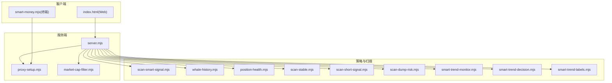

图表来源
- [server.mjs:1-120](file://server.mjs#L1-L120)
- [proxy-setup.mjs:1-71](file://proxy-setup.mjs#L1-L71)
- [market-cap-filter.mjs:1-15](file://market-cap-filter.mjs#L1-L15)
- [scan-smart-signal.mjs:1-84](file://scan-smart-signal.mjs#L1-L84)
- [whale-history.mjs:1-142](file://whale-history.mjs#L1-L142)
- [position-health.mjs:1-213](file://position-health.mjs#L1-L213)
- [scan-stable.mjs:1-290](file://scan-stable.mjs#L1-L290)
- [scan-short-signal.mjs:1-276](file://scan-short-signal.mjs#L1-L276)
- [scan-dump-risk.mjs:1-286](file://scan-dump-risk.mjs#L1-L286)
- [smart-trend-monitor.mjs:1-200](file://smart-trend-monitor.mjs#L1-L200)
- [smart-trend-decision.mjs:1-120](file://smart-trend-decision.mjs#L1-L120)
- [smart-trend-labels.mjs:1-274](file://smart-trend-labels.mjs#L1-L274)
- [index.html:1-200](file://index.html#L1-L200)

章节来源
- [server.mjs:1-120](file://server.mjs#L1-L120)
- [smart-money.mjs:1-149](file://smart-money.mjs#L1-L149)
- [index.html:1-200](file://index.html#L1-L200)

## 核心组件
- 数据源与代理层
  - 统一通过 proxy-setup.mjs 发起请求，Windows+代理场景优先走 curl，避免 Node fetch 代理不稳定问题
  - 内置超时、错误处理与地区限制提示
- 聪明钱信号
  - scan-smart-signal.mjs 提供 Smart Signal 接口访问、限流队列与熔断保护，并输出方向、评分与明细信号
- 鲸鱼历史
  - whale-history.mjs 周期性采集并落盘，供趋势监控与基准对比使用
- 持仓健康度
  - position-health.mjs 综合趋势、做空信号、暴跌风险与聪明钱方向，给出健康等级与操作建议
- 趋势与决策
  - smart-trend-monitor.mjs 负责全池扫描、8am 基准、榜单合并与推送卡片
  - smart-trend-decision.mjs 将多榜信息合并去重，计算评分与连续性，输出"立刻关注/继续观察/已失效"清单
- **全新**：背离检测与反弹监控
  - 实现大户 vs 散户多空比背离检测算法，识别"大户抄底/散户恐慌"反转信号
  - 增强反弹监控信号分类系统，当检测到背离条件时触发更敏感的反弹监控
  - 改进评分机制，背离信号获得额外加分权重
  - 实现反弹潜力评分系统，多维度评估暴跌后的反弹机会
- **全新**：反弹高亮展示
  - 急跌反弹观察区块独立高亮显示，位于推送卡片顶部醒目位置
  - 避免重要反弹信号被淹没在大量数据中
- **全新**：榜单标签系统
  - smart-trend-labels.mjs 提供榜单格式化、8am计分、来源追踪等功能
  - 新增"背离"列显示大户vs散户多空比差异

章节来源
- [proxy-setup.mjs:1-71](file://proxy-setup.mjs#L1-L71)
- [scan-smart-signal.mjs:1-238](file://scan-smart-signal.mjs#L1-L238)
- [whale-history.mjs:1-142](file://whale-history.mjs#L1-L142)
- [position-health.mjs:1-213](file://position-health.mjs#L1-L213)
- [smart-trend-monitor.mjs:1-200](file://smart-trend-monitor.mjs#L1-L200)
- [smart-trend-decision.mjs:1-120](file://smart-trend-decision.mjs#L1-L120)
- [smart-trend-labels.mjs:1-274](file://smart-trend-labels.mjs#L1-L274)

## 架构总览
系统以 server.mjs 为核心编排器，对外暴露 REST API；内部调用多个独立策略模块进行扫描与评估；结果经格式化后推送到飞书或返回给前端。

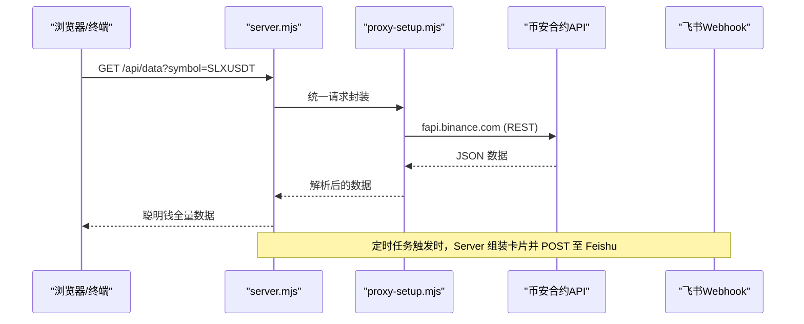

图表来源
- [server.mjs:508-538](file://server.mjs#L508-L538)
- [proxy-setup.mjs:49-71](file://proxy-setup.mjs#L49-L71)
- [README.md:190-199](file://README.md#L190-L199)

## 详细组件分析

### 终端实时监控（smart-money.mjs）
- 功能
  - 并行拉取价格、大户多空比（账户/持仓）、全网多空比、OI、OI 历史、主动买卖量、资金费率
  - 终端彩色输出与信号摘要（大户偏多/空、全网偏多/空、聪明钱抄底、主动买卖激增、资金费率异常）
- 关键流程
  - Promise.all 并发获取多端点
  - 时间戳转本地时间、数值格式化
  - 循环刷新与错误捕获

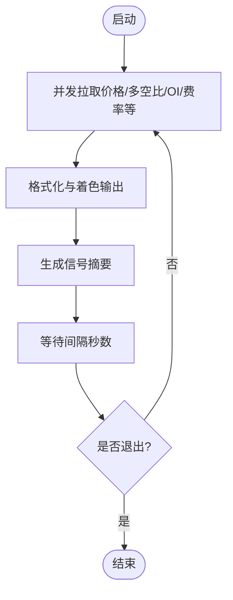

图表来源
- [smart-money.mjs:39-149](file://smart-money.mjs#L39-L149)

章节来源
- [smart-money.mjs:1-149](file://smart-money.mjs#L1-L149)

### 背离检测与反弹监控（全新核心功能）

#### 背离检测算法
系统实现了全面的大户 vs 散户多空比背离检测功能，这是反弹机会识别的核心机制：

- **背离度计算公式**：`背离度 = 大户多空比 - 全网多空比`
- **触发条件**：当 `背离度 ≥ 0.25` 且 `大户多空比 > 1.0` 且 `全网多空比 < 0.9` 时判定为"大户抄底/散户恐慌"背离信号
- **配置参数**：阈值可通过环境变量 `SMART_TREND_DIVERGENCE_THRESHOLD` 配置，默认 0.25

#### 反弹监控信号增强
当检测到背离条件时，系统会触发更敏感的反弹监控信号：

- **敏感阈值调整**：有背离信号时，跌幅 `-5%` 即触发 `rebound_watch` 信号（正常需 `-10%`）
- **评分加成**：背离信号在评分机制中获得额外 `+12` 分加分
- **高亮展示**：急跌反弹观察区块在推送卡片中独立高亮显示

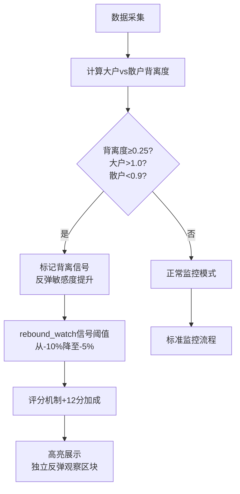

图表来源
- [smart-trend-monitor.mjs:365-374](file://smart-trend-monitor.mjs#L365-L374)
- [smart-trend-decision.mjs:274-283](file://smart-trend-decision.mjs#L274-L283)
- [smart-trend-decision.mjs:320-325](file://smart-trend-decision.mjs#L320-L325)

章节来源
- [smart-trend-monitor.mjs:351-406](file://smart-trend-monitor.mjs#L351-L406)
- [smart-trend-decision.mjs:266-288](file://smart-trend-decision.mjs#L266-L288)
- [smart-trend-decision.mjs:290-329](file://smart-trend-decision.mjs#L290-L329)

### 反弹潜力评分系统（全新功能）

#### 评分维度
暴跌推送中新增反弹潜力评分系统，多维度评估反弹机会：

- **RSI6超卖检测**：RSI6 < 20得25分，RSI6 < 30得15分
- **24h跌幅深度**：暴跌-50%得30分，大跌-30%得20分
- **大户偏多加分**：大户多空比 > 1.0得15分
- **散户偏空加分**：全网多空比 < 0.8得10分
- **背离信号加分**：背离度 ≥ 0.25得15分
- **缩量止跌检测**：最近1h成交量 < 前3h均值50%得10分
- **下影线长度检测**：下影线占比 < 30%得10分

#### 评级标准
- **高分（≥60）**：🟢 高反弹潜力 - 可观察反弹，关注入场时机
- **中分（40-59）**：🟡 中等反弹潜力 - 反弹可能，谨慎观察  
- **低分（<40）**：普通反弹潜力 - 可能继续下跌，不宜抄底

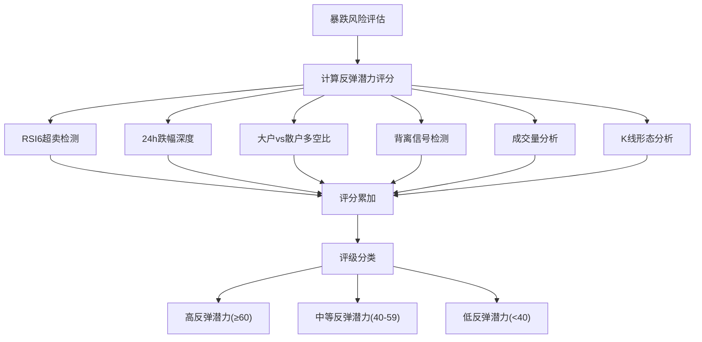

图表来源
- [scan-dump-risk.mjs:256-342](file://scan-dump-risk.mjs#L256-342)
- [scan-dump-risk.mjs:172-197](file://scan-dump-risk.mjs#L172-197)

章节来源
- [scan-dump-risk.mjs:256-342](file://scan-dump-risk.mjs#L256-342)
- [scan-dump-risk.mjs:172-197](file://scan-dump-risk.mjs#L172-197)

### 急跌反弹观察高亮区块（全新功能）

#### 高亮展示机制
系统在推送卡片顶部（固定监控板块之前）插入独立的"急跌反弹观察"高亮区块：

- **触发条件**：decision 输出的 action 组中包含 rebound_watch 视图，且该币种 |change24h| ≥ 15%
- **配置参数**：跌幅阈值 `REBOUND_HIGHLIGHT_CHANGE_PCT` 可通过环境变量配置，默认 15
- **展示内容**：包含价格、跌幅、聪明钱方向、背离信号等关键信息

#### 视觉设计
- 使用红色/橙色模板突出显示，与普通表格视觉区分
- 位于时间标题之后、固定监控板块之前，确保用户首先注意到
- 避免重要反弹信号被淹没在大量数据中

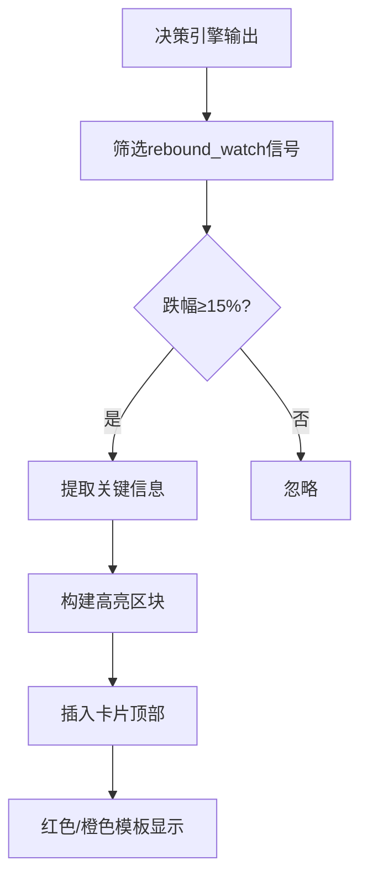

图表来源
- [smart-trend-monitor.mjs:853-856](file://smart-trend-monitor.mjs#L853-856)
- [smart-trend-labels.mjs:210-236](file://smart-trend-labels.mjs#L210-236)

章节来源
- [smart-trend-monitor.mjs:853-856](file://smart-trend-monitor.mjs#L853-856)
- [smart-trend-labels.mjs:210-236](file://smart-trend-labels.mjs#L210-236)

### 聪明钱信号采集与分析（scan-smart-signal.mjs）
- 限流与熔断
  - 最小请求间隔控制、全局队列串行执行
  - 418/429/403 触发熔断，按 retry-after 延迟重试
- 数据解析与评分
  - 基于 longShortRatio、盈利多头/空头数量、鲸鱼仓位与均价等因子打分
  - 输出方向、评分、信号明细与详情字符串

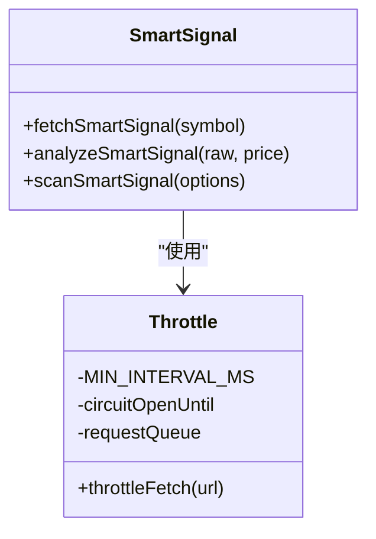

图表来源
- [scan-smart-signal.mjs:1-84](file://scan-smart-signal.mjs#L1-L84)
- [scan-smart-signal.mjs:86-167](file://scan-smart-signal.mjs#L86-L167)
- [scan-smart-signal.mjs:182-238](file://scan-smart-signal.mjs#L182-L238)

章节来源
- [scan-smart-signal.mjs:1-238](file://scan-smart-signal.mjs#L1-L238)

### 鲸鱼历史采集（whale-history.mjs）
- 周期采集
  - 根据环境变量配置采集间隔与最大点数
  - 记录长/短鲸鱼数量、比值、盈利鲸鱼、均价、价格等快照
- 持久化与批量读取
  - 写入 data/whale-history.json，支持单币与批量查询

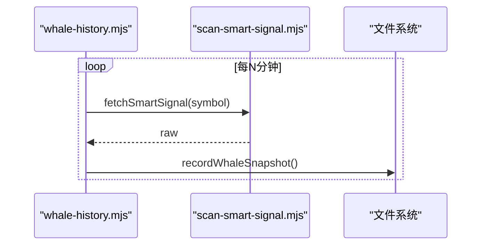

图表来源
- [whale-history.mjs:121-142](file://whale-history.mjs#L121-L142)
- [whale-history.mjs:47-90](file://whale-history.mjs#L47-L90)

章节来源
- [whale-history.mjs:1-142](file://whale-history.mjs#L1-L142)

### 持仓健康度评估（position-health.mjs）
- 输入：方向、入场价、止损/止盈（可选）
- 评估维度
  - 右侧稳趋势（做多逻辑有效性）
  - 做空信号强度（做空逻辑有效性）
  - 暴跌风险评分
  - 聪明钱方向一致性
  - 浮盈亏比例
- 输出：健康等级（健康/警告/危险）、动作建议（持有/收紧止损/考虑止盈/建议止损）

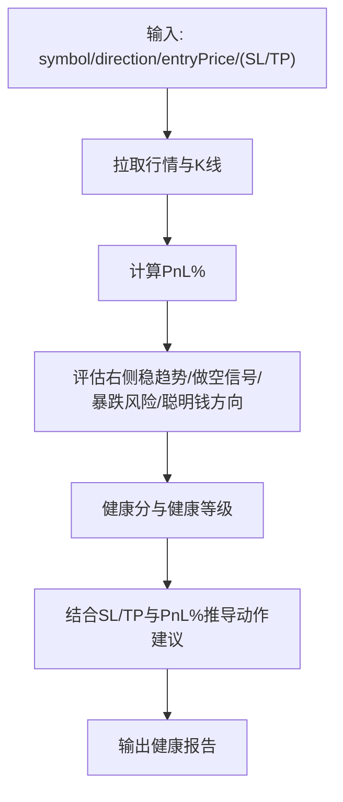

图表来源
- [position-health.mjs:56-195](file://position-health.mjs#L56-L195)

章节来源
- [position-health.mjs:1-213](file://position-health.mjs#L1-L213)

### 右侧稳趋势与做空信号（scan-stable.mjs / scan-short-signal.mjs）
- 右侧稳趋势
  - 均线排列、RSI、MACD、放量等因子打分
  - 双周期确认（1h+1d），回撤阈值与趋势完整性校验
- 做空信号
  - 暴涨回落、天量后缩量、RSI超买、偏离MA、连续阴线、高位盘整、持续阴跌、8am大跌等多维规则

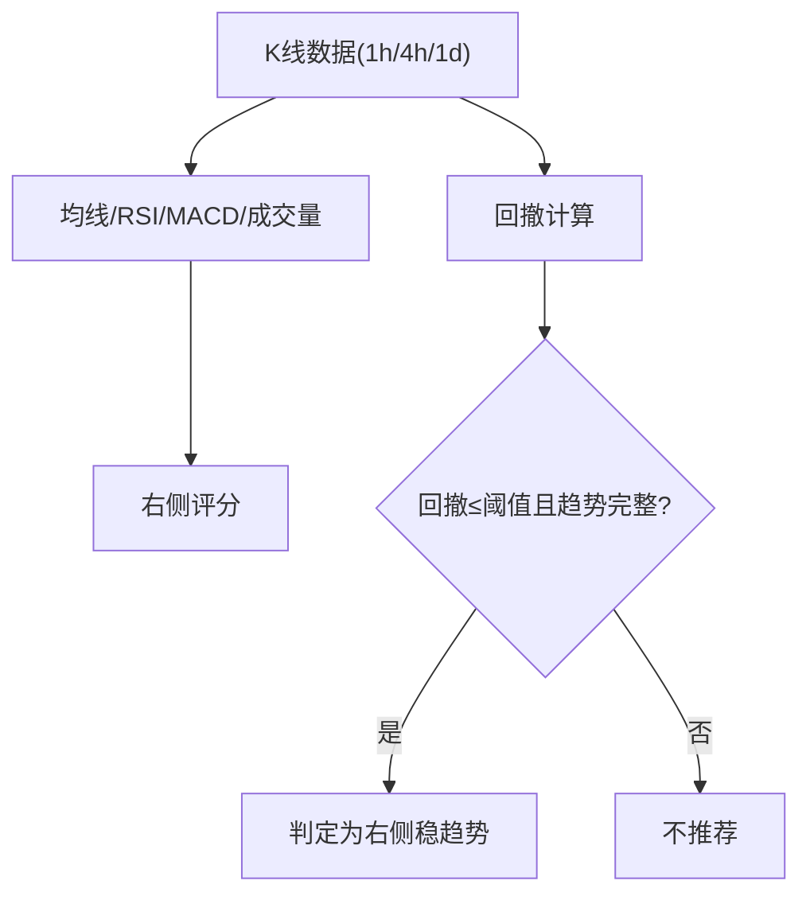

图表来源
- [scan-stable.mjs:91-193](file://scan-stable.mjs#L91-L193)
- [scan-stable.mjs:249-290](file://scan-stable.mjs#L249-L290)
- [scan-short-signal.mjs:28-204](file://scan-short-signal.mjs#L28-L204)

章节来源
- [scan-stable.mjs:1-290](file://scan-stable.mjs#L1-L290)
- [scan-short-signal.mjs:1-276](file://scan-short-signal.mjs#L1-L276)

### 暴跌风险评估与反弹潜力评分（scan-dump-risk.mjs）
- 评估维度
  - 24h跌幅、4h急跌、高点回撤、OI萎缩、卖压、大户偏空、散多大空、负费率极端、连续阴线、缩量下跌
- **全新**：反弹潜力评分机制
  - RSI6超卖检测（<20得25分，<30得15分）
  - 24h跌幅深度评分（暴跌-50%得30分，大跌-30%得20分）
  - 大户偏多加分（>1.0得15分）
  - 散户偏空加分（<0.8得10分）
  - 背离信号加分（≥0.25得15分）
  - 缩量止跌检测（最近1h成交量<前3h均值50%得10分）
  - 下影线长度检测（下影线占比<30%得10分）
- 输出：风险分、风险等级、风险明细与汇总文案

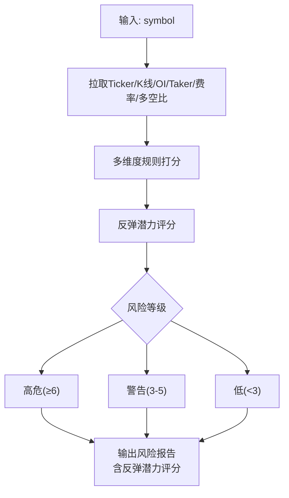

图表来源
- [scan-dump-risk.mjs:21-191](file://scan-dump-risk.mjs#L21-L191)
- [scan-dump-risk.mjs:256-342](file://scan-dump-risk.mjs#L256-L342)

章节来源
- [scan-dump-risk.mjs:1-385](file://scan-dump-risk.mjs#L1-L385)

### 聪明钱趋势监控与决策（smart-trend-monitor.mjs / smart-trend-decision.mjs）
- 趋势监控
  - 全池扫描、8am 基准更新、榜单合并、显著变化高亮、市场研判
  - **全新**：背离统计与高亮显示
- 决策清单
  - 多榜去重、评分模型、连续性追踪（新出现/延续/加强/减弱/反转待确认/反转确认）
  - 输出"立刻关注/继续观察/已失效"与操作建议
  - **全新**：反弹观察高亮区块，独立展示急跌反弹机会
- **全新**：榜单汇总增强
  - 市值/成交额合并列显示
  - 8am分档计分系统（≥35%→3分, ≥15%→2分, ≥5%→1分）
  - 市值过滤（MAX_RANKING_MARKET_CAP=80亿美元）
  - 来源追踪标签

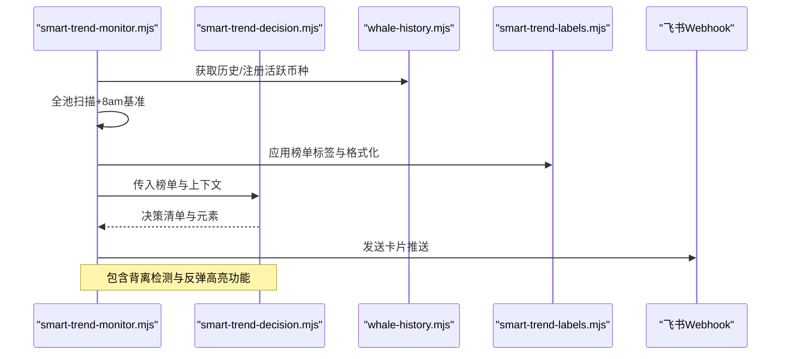

图表来源
- [smart-trend-monitor.mjs:189-200](file://smart-trend-monitor.mjs#L189-200)
- [smart-trend-monitor.mjs:320-344](file://smart-trend-monitor.mjs#L320-344)
- [smart-trend-decision.mjs:556-640](file://smart-trend-decision.mjs#L556-640)
- [smart-trend-labels.mjs:251-274](file://smart-trend-labels.mjs#L251-274)

章节来源
- [smart-trend-monitor.mjs:1-1215](file://smart-trend-monitor.mjs#L1-L1215)
- [smart-trend-decision.mjs:1-792](file://smart-trend-decision.mjs#L1-L792)
- [smart-trend-labels.mjs:1-317](file://smart-trend-labels.mjs#L1-L317)

### 榜单标签与格式化系统（smart-trend-labels.mjs）
- 榜单列定义
  - 新增"市值/成交额"合并列，同时显示市值标签和24小时成交量
  - **全新**："背离"列，显示大户vs散户多空比差异，红色标注显著背离信号
  - 新增"标签"列，标识数据来源（涨幅榜/跌幅榜/右侧/交易额榜等）
- 8am分档计分
  - 当日每轮按1h净多空比变化分档：≥35%→3分, ≥15%→2分, ≥5%→1分
  - 多空分别累计后显示净分
- 榜单行构建
  - 支持固定监控标记（📌）
  - 自动合并来源标签，去重显示
- **全新**：急跌反弹观察高亮区块
  - 独立展示反弹观察标的
  - 显示价格、跌幅、聪明钱方向、背离信号等关键信息

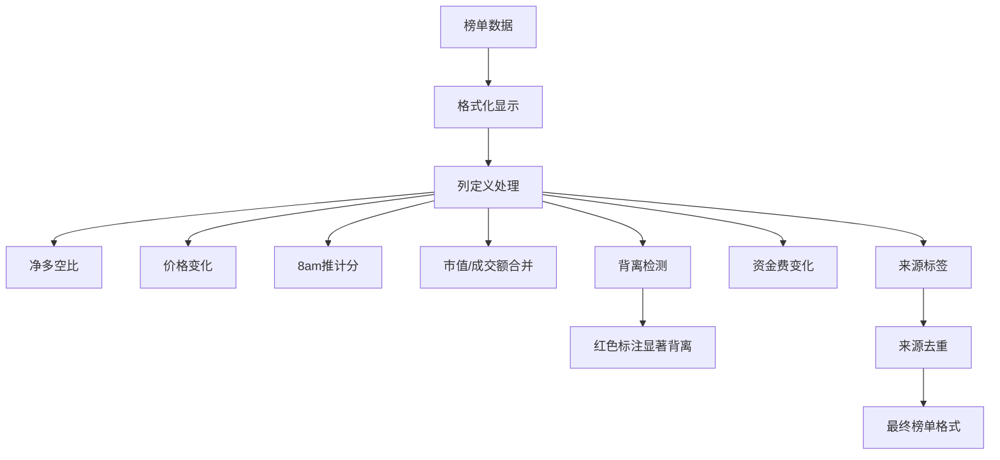

图表来源
- [smart-trend-labels.mjs:251-274](file://smart-trend-labels.mjs#L251-274)
- [smart-trend-labels.mjs:152-162](file://smart-trend-labels.mjs#L152-162)
- [smart-trend-labels.mjs:199-205](file://smart-trend-labels.mjs#L199-205)
- [smart-trend-labels.mjs:210-236](file://smart-trend-labels.mjs#L210-236)

章节来源
- [smart-trend-labels.mjs:1-317](file://smart-trend-labels.mjs#L1-L317)

## 依赖关系分析
- 外部依赖
  - 币安合约 REST API（fapi.binance.com）
  - 飞书群机器人 Webhook
  - CoinMarketCap API（市值数据）
  - CoinGecko API（市值数据回退）
- 内部耦合
  - server.mjs 作为编排中心，依赖各策略模块
  - proxy-setup.mjs 被多处复用，屏蔽平台差异
  - market-cap-filter.mjs 贯穿筛选流程
  - **全新**：smart-trend-labels.mjs 提供统一的榜单格式化逻辑
  - **全新**：背离检测功能跨模块集成

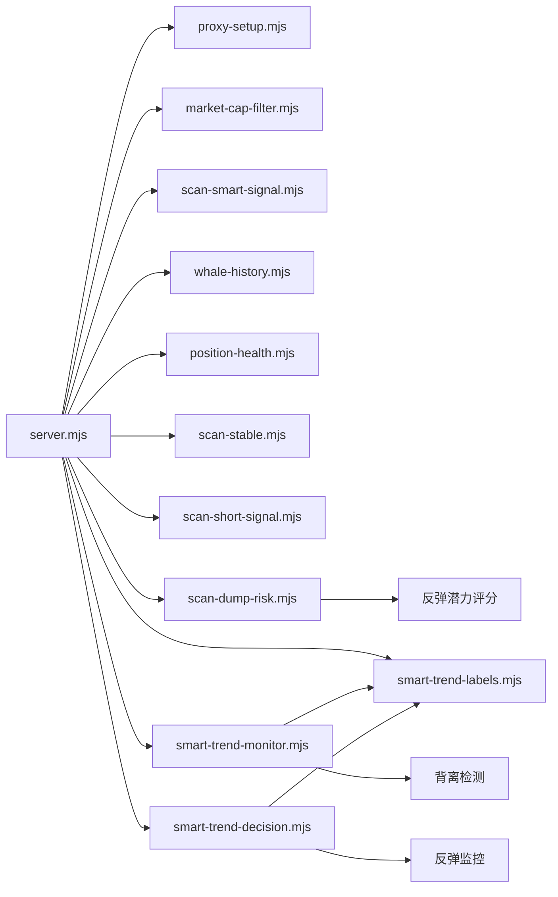

图表来源
- [server.mjs:1-120](file://server.mjs#L1-L120)

章节来源
- [server.mjs:1-120](file://server.mjs#L1-L120)

## 性能与限流优化
- 并发与缓存
  - ticker/24hr 短 TTL 缓存 + 并发去重，避免同一轮重复请求
  - pmap 并发控制，限制同时请求数
  - **全新**：市值数据批量缓存，支持CMC和CoinGecko双源回退
- 网络与重试
  - proxy-setup.mjs 在 Windows+代理下优先 curl，提升稳定性
  - 统一超时与错误包装，便于上层重试与降级
- 限流与熔断
  - Smart Signal 接口具备最小间隔与熔断机制，遇 418/429/403 自动退避
- 推送节流
  - 飞书卡片发送失败时识别频控关键字，指数退避重试
- **全新**：榜单数据处理优化
  - 市值/成交额查找表预构建，避免重复计算
  - 榜单去重算法优化，支持来源标签合并
  - 背离检测计算优化，减少不必要的API请求

章节来源
- [server.mjs:84-105](file://server.mjs#L84-L105)
- [server.mjs:150-162](file://server.mjs#L150-L162)
- [proxy-setup.mjs:49-71](file://proxy-setup.mjs#L49-L71)
- [scan-smart-signal.mjs:24-74](file://scan-smart-signal.mjs#L24-L74)
- [server.mjs:618-644](file://server.mjs#L618-644)
- [smart-trend-monitor.mjs:463-503](file://smart-trend-monitor.mjs#L463-L503)

## 故障排查指南
- 端口占用
  - 启动报 EADDRINUSE 时，使用 dev:restart 自动清理旧进程，或手动 kill 占用端口进程
- 代理与地区限制
  - 设置 HTTPS_PROXY/HTTP_PROXY，Windows 下优先 curl；若出现地区限制错误，检查节点可用性
- 飞书推送失败
  - 检查 FEISHU_WEBHOOK 配置；频控错误会触发重试，仍失败需降低推送频率或更换 webhook
- 市值过滤导致无结果
  - 调整 MAX_RANKING_MARKET_CAP 或设为 0 关闭过滤
- **全新**：背离检测相关问题
  - 检查 SMART_TREND_DIVERGENCE_THRESHOLD 环境变量配置
  - 验证大户与散户多空比数据是否正常获取
  - 确认背离阈值设置是否合理（默认0.25）
- **全新**：反弹监控相关问题
  - 检查 REBOUND_HIGHLIGHT_CHANGE_PCT 环境变量配置
  - 验证反弹高亮阈值设置是否符合预期
  - 确认反弹观察区块是否正确显示
- **全新**：反弹潜力评分问题
  - 检查暴跌推送功能是否启用（DUMP_PUSH_ENABLED=true）
  - 验证RSI、多空比等数据源是否正常
  - 确认评分权重配置是否合理

章节来源
- [README.md:40-53](file://README.md#L40-L53)
- [README.md:55-93](file://README.md#L55-L93)
- [proxy-setup.mjs:25-44](file://proxy-setup.mjs#L25-L44)
- [server.mjs:599-644](file://server.mjs#L599-L644)
- [market-cap-filter.mjs:1-15](file://market-cap-filter.mjs#L1-L15)
- [smart-trend-monitor.mjs:444-503](file://smart-trend-monitor.mjs#L444-L503)

## 结论
本系统以"聪明钱"为核心视角，融合大户/鲸鱼行为、资金费率、趋势形态与风险评分，形成从数据采集、指标计算到决策输出的闭环。通过限流熔断、并发去重与稳健的网络层，保障在高并发与受限网络下的可用性。配合 Web 面板与终端工具，用户可高效洞察市场机会与风险。

**重大更新**：系统集成了全面的背离检测系统和反弹监控功能，显著提升了反转机会的识别能力。新的背离检测算法能够准确识别"大户抄底/散户恐慌"的经典反转信号，并在检测到背离条件时自动触发更敏感的反弹监控。反弹潜力评分系统进一步增强了暴跌后的机会识别，通过多维度数据分析为用户提供更精准的交易信号。这些新功能共同构成了一个更加智能和全面的聪明钱监控体系。

## 附录：使用示例与指标解读

### 命令行工具使用方法
- 基本用法
  - node smart-money.mjs [SYMBOL] [刷新间隔秒]
  - 示例：node smart-money.mjs BTCUSDT 30
- 参数说明
  - SYMBOL：交易对，如 BTCUSDT、ETHUSDT
  - 刷新间隔：单位秒，默认 60

章节来源
- [README.md:113-121](file://README.md#L113-L121)
- [smart-money.mjs:3-4](file://smart-money.mjs#L3-L4)

### 实时数据展示格式（终端）
- 当前价格、资金费率、持仓量（含 USDT 价值）
- 大户多空比（Top 20%，账户维度/持仓维度）
- 全网多空比
- 持仓量变化（4h）
- 主动买卖量（5min）
- 信号摘要：大户偏多/空、全网偏多/空、聪明钱抄底、主动买卖激增、资金费率异常

章节来源
- [smart-money.mjs:60-134](file://smart-money.mjs#L60-L134)

### 如何解读大户持仓信号
- 大户持仓多空比 > 1：偏多；< 1：偏空
- 当大户偏多而全网偏空：可能为"聪明钱抄底"信号
- 结合主动买卖量与资金费率，提高判断可靠性

章节来源
- [smart-money.mjs:106-133](file://smart-money.mjs#L106-L133)

### 背离检测与反弹监控解读

#### 背离信号识别
- **背离度计算**：大户多空比 - 全网多空比
- **显著背离**：背离度 ≥ 0.25 且 大户>1.0 且 散户<0.9
- **市场含义**：大户在抄底，散户在恐慌性抛售，经典反弹信号

#### 反弹监控信号
- **敏感阈值**：有背离信号时，跌幅 -5% 即触发反弹观察（正常需 -10%）
- **评分加成**：背离信号获得额外 +12 分加分
- **高亮展示**：在推送卡片中独立显示"急跌反弹观察"区块

#### 实战案例参考
基于 EVAAUSDT 实际案例分析：
- 8:00 单小时暴跌 -78.76%（$1.88→$0.40）
- 大户多空比 1.03-1.07（偏多）→ 大户在抄底
- 全网多空比 0.65-0.97 且持续下降（偏空）→ 散户在疯狂做空
- 随后反弹至 $1.32（4.4 倍）

章节来源
- [rebound-opportunity-requirements.md:1-77](file://docs/rebound-opportunity-requirements.md#L1-L77)
- [smart-trend-monitor.mjs:365-374](file://smart-trend-monitor.mjs#L365-374)
- [smart-trend-decision.mjs:274-283](file://smart-trend-decision.mjs#L274-283)

### 反弹潜力评分解读

#### 评分维度详解
- **RSI6超卖检测**：衡量短期超卖程度，<20表示极度超卖
- **24h跌幅深度**：评估下跌严重性，跌幅越大反弹潜力越高
- **大户vs散户多空比**：大户偏多+散户偏空是经典反弹信号
- **背离信号**：量化分析大户与散户行为的分歧程度
- **成交量分析**：缩量止跌表明抛压减轻
- **K线形态**：下影线长表明下方支撑强劲

#### 应用场景
- 暴跌预警推送中展示反弹潜力
- 辅助判断急跌后的反转概率
- 与背离检测功能协同工作
- 为抄底决策提供量化依据

章节来源
- [scan-dump-risk.mjs:256-342](file://scan-dump-risk.mjs#L256-342)
- [scan-dump-risk.mjs:172-197](file://scan-dump-risk.mjs#L172-197)

### 全网多空比趋势
- 观察最新时段比值与趋势变化，结合 8am 基准与 1h 变化百分比
- 显著变化（≥5%/≥10%）用于高亮与排序

章节来源
- [smart-trend-monitor.mjs:259-277](file://smart-trend-monitor.mjs#L259-L277)
- [smart-trend-monitor.mjs:511-604](file://smart-trend-monitor.mjs#L511-L604)

### 资金费率异常
- 正费率偏高：多头拥挤，注意回调风险
- 负费率偏低：空头付费，潜在反弹机会
- 极端负费率：高风险信号

章节来源
- [smart-money.mjs:130-132](file://smart-money.mjs#L130-L132)
- [scan-dump-risk.mjs:134-147](file://scan-dump-risk.mjs#L134-L147)

### 聪明钱理论在加密货币中的应用
- 大户/鲸鱼往往具备更强的信息与资金优势，其持仓与交易行为可作为领先指标
- 结合多维数据（多空比、OI、主动买卖量、资金费率、趋势形态）可提高胜率与风控能力
- **全新**：背离检测进一步增强了聪明钱理论的实践应用，通过量化分析大户与散户行为的分歧来识别反转机会

### 多维度数据分析识别市场机会
- 右侧稳趋势：均线多排、RSI 适中、MACD 多头、放量、回撤可控
- 做空信号：暴涨回落、天量后缩量、RSI 超买、偏离 MA、连续阴线、高位盘整、持续阴跌、8am 大跌
- 暴跌风险：跌幅、急跌、回撤、OI 萎缩、卖压、大户偏空、散多大空、负费率极端、连续阴线、缩量下跌
- **全新**：反弹潜力评分：RSI超卖、暴跌深度、大户偏多、散户偏空、背离信号、缩量止跌、下影线特征

章节来源
- [scan-stable.mjs:91-193](file://scan-stable.mjs#L91-L193)
- [scan-short-signal.mjs:28-204](file://scan-short-signal.mjs#L28-L204)
- [scan-dump-risk.mjs:21-191](file://scan-dump-risk.mjs#L21-L191)
- [scan-dump-risk.mjs:256-342](file://scan-dump-risk.mjs#L256-L342)

### Web 面板与 API
- 访问地址：http://localhost:3388
- 常用 API
  - GET /api/data?symbol=BTCUSDT — 聪明钱全量数据
  - GET /api/klines?symbol=BTCUSDT&interval=1h&limit=100 — K 线数据
  - GET /api/marketcap?symbol=BTCUSDT — 市值（优先 CMC，回退 CoinGecko）
  - POST /api/feishu-alert — 发送飞书报警
  - POST /api/trigger-stable-push — 手动触发稳趋势推送

章节来源
- [README.md:190-199](file://README.md#L190-L199)
- [server.mjs:508-538](file://server.mjs#L508-L538)

### 新增功能：榜单汇总与8am计分系统
- **榜单汇总**：
  - 多榜单去重合并（涨幅榜/跌幅榜/右侧/交易额榜）
  - 市值过滤（默认≤80亿美元）
  - 成交额过滤（默认≥1000万美元）
  - 按8am推积分绝对值排序
- **8am分档计分**：
  - ≥35%变化：3分
  - ≥15%变化：2分  
  - ≥5%变化：1分
  - 多空分别累计，显示净分
- **来源追踪标签**：
  - 自动标识数据来源（涨幅/跌幅/右侧/动量等）
  - 支持固定监控标记（📌）
  - 来源标签自动去重合并

章节来源
- [smart-trend-monitor.mjs:444-503](file://smart-trend-monitor.mjs#L444-L503)
- [smart-trend-monitor.mjs:280-321](file://smart-trend-monitor.mjs#L280-L321)
- [smart-trend-labels.mjs:251-274](file://smart-trend-labels.mjs#L251-L274)
- [smart-trend-labels.mjs:152-162](file://smart-trend-labels.mjs#L152-L162)

### 新增功能：市值/成交额合并显示
- **合并列设计**：
  - 同时显示市值标签和24小时成交量
  - 智能格式化处理，避免数据冗余
  - 支持市值为空时的降级显示
- **数据源优先级**：
  - 优先使用服务器端增强的市值数据
  - 回退到原始数据中的成交量信息
  - 支持多种数据格式的兼容处理

章节来源
- [smart-trend-labels.mjs:171-176](file://smart-trend-labels.mjs#L171-L176)
- [smart-trend-monitor.mjs:463-491](file://smart-trend-monitor.mjs#L463-L491)
- [server.mjs:907-946](file://server.mjs#L907-L946)

### 新增功能：背离检测与环境变量配置
- **背离检测配置**：
  - `SMART_TREND_DIVERGENCE_THRESHOLD`：背离阈值，默认 0.25
  - 支持动态调整灵敏度以适应不同市场环境
- **反弹高亮配置**：
  - `REBOUND_HIGHLIGHT_CHANGE_PCT`：反弹高亮跌幅阈值，默认 15%
  - 控制反弹观察区块的显示条件
- **预览功能**：
  - 提供 `scripts/preview-rebound-features.mjs` 脚本用于测试新功能
  - 支持合成数据注入，便于演示和调试

章节来源
- [server.mjs:590-592](file://server.mjs#L590-592)
- [preview-rebound-features.mjs:74-76](file://scripts/preview-rebound-features.mjs#L74-L76)
- [rebound-opportunity-requirements.md:30-31](file://docs/rebound-opportunity-requirements.md#L30-L31)

### 新增功能：反弹潜力评分系统
- **评分维度**：
  - RSI6超卖检测（<20得25分，<30得15分）
  - 24h跌幅深度（暴跌-50%得30分，大跌-30%得20分）
  - 大户偏多（>1.0得15分）
  - 散户偏空（<0.8得10分）
  - 背离信号（≥0.25得15分）
  - 缩量止跌（量比<0.5得10分）
  - 下影线特征（下影线占比<30%得10分）
- **评级标准**：
  - 高分（≥60）：🟢 高反弹潜力
  - 中分（≥40）：🟡 中等反弹潜力
  - 低分（<40）：普通反弹潜力
- **应用场景**：
  - 暴跌预警推送中展示反弹潜力
  - 辅助判断急跌后的反转概率
  - 与背离检测功能协同工作

章节来源
- [scan-dump-risk.mjs:256-342](file://scan-dump-risk.mjs#L256-L342)
- [scan-dump-risk.mjs:172-197](file://scan-dump-risk.mjs#L172-L197)