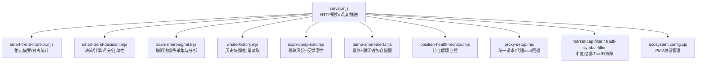
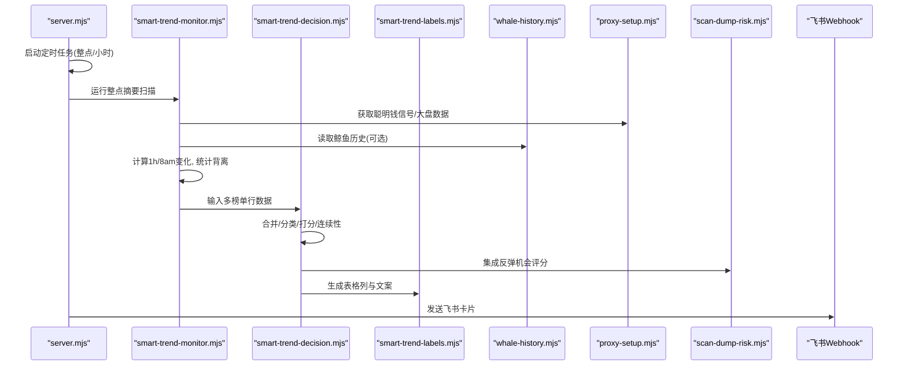
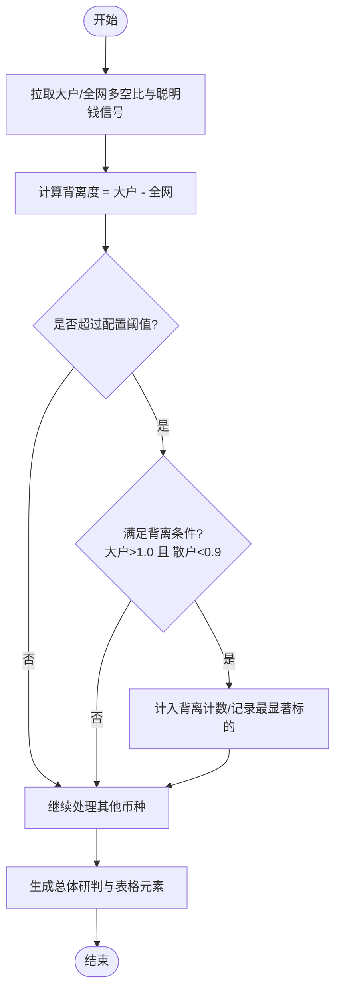
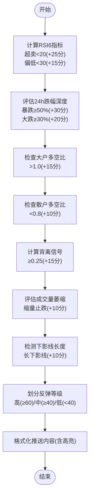
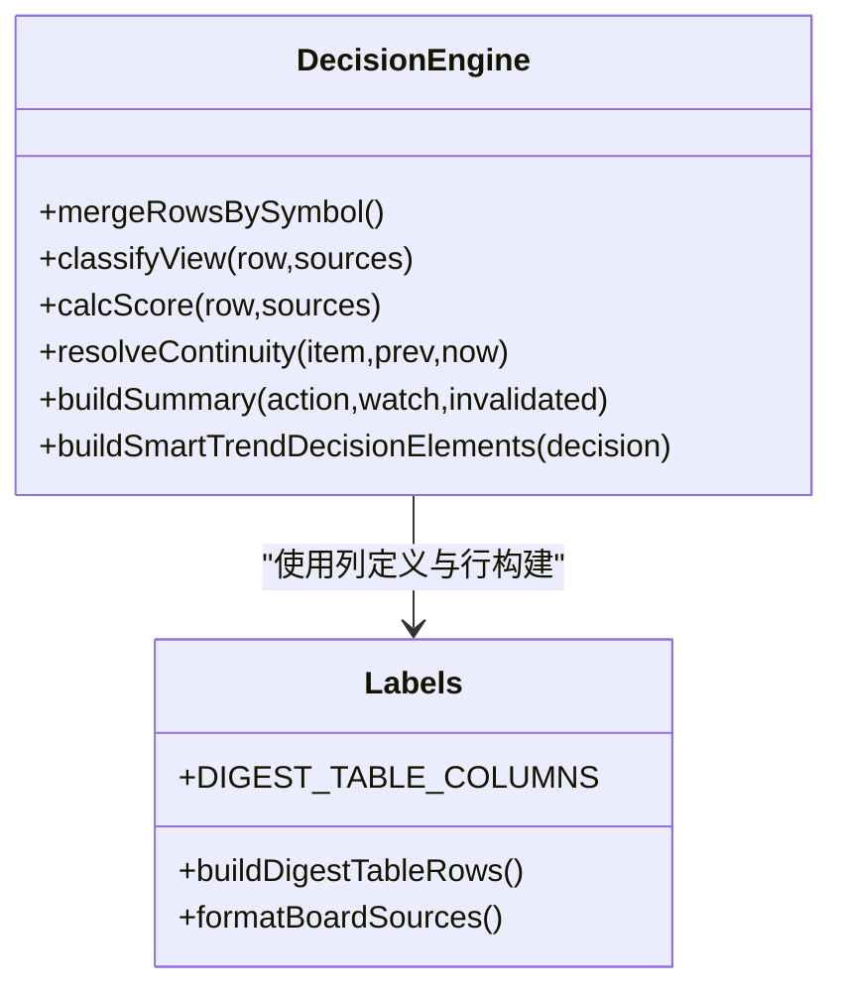
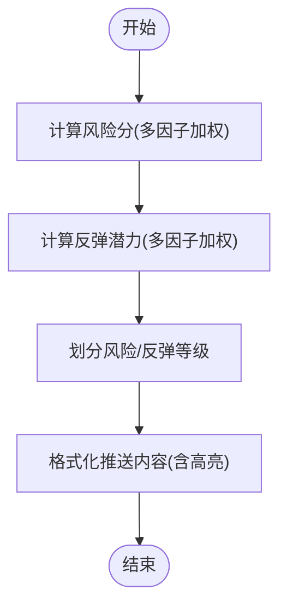
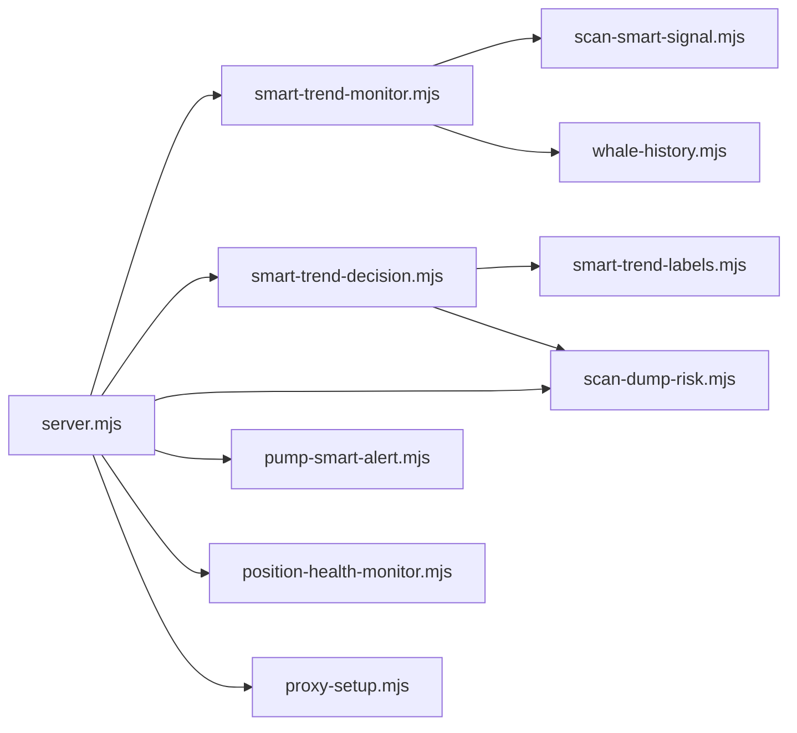

# 背离检测系统

<cite>
**本文引用的文件**   
- [README.md](file://README.md)
- [package.json](file://package.json)
- [server.mjs](file://server.mjs)
- [smart-trend-monitor.mjs](file://smart-trend-monitor.mjs)
- [smart-trend-decision.mjs](file://smart-trend-decision.mjs)
- [smart-trend-labels.mjs](file://smart-trend-labels.mjs)
- [scan-smart-signal.mjs](file://scan-smart-signal.mjs)
- [whale-history.mjs](file://whale-history.mjs)
- [scan-dump-risk.mjs](file://scan-dump-risk.mjs)
- [position-health-monitor.mjs](file://position-health-monitor.mjs)
- [pump-smart-alert.mjs](file://pump-smart-alert.mjs)
- [proxy-setup.mjs](file://proxy-setup.mjs)
- [ecosystem.config.cjs](file://ecosystem.config.cjs)
- [rebound-opportunity-requirements.md](file://docs/rebound-opportunity-requirements.md)
</cite>

## 更新摘要
**变更内容**   
- 增强了大户 vs 散户背离检测算法，支持可配置阈值
- 集成反弹机会评分系统与暴跌风险扫描模块
- 新增急跌反弹观察高亮区块功能
- 优化背离信号统计与可视化展示

## 目录
1. [引言](#引言)
2. [项目结构](#项目结构)
3. [核心组件](#核心组件)
4. [架构总览](#架构总览)
5. [详细组件分析](#详细组件分析)
6. [依赖关系分析](#依赖关系分析)
7. [性能与可扩展性](#性能与可扩展性)
8. [故障排查指南](#故障排查指南)
9. [结论](#结论)
10. [附录](#附录)

## 引言
本仓库实现了一个基于币安合约数据的"聪明钱"监控与背离检测系统。系统通过聚合大户多空比、全网多空比、资金费率、持仓量变化、主动买卖量等指标，识别"大户偏多 + 散户偏空"的背离信号，并结合价格趋势、涨跌幅、RSI、回撤等维度，输出可操作的决策清单与推送卡片（飞书）。同时提供稳趋势扫描、暴跌风险预警、暴涨聪明钱加仓提醒、持仓健康监控等功能。

**最新更新**：系统现已支持 sophisticated whale vs retail divergence detection（复杂的大户vs散户背离检测），具备可配置的阈值设置，并与反弹机会评分系统深度集成，提供更精准的反转机会识别能力。

## 项目结构
- 服务端入口：HTTP 服务、定时任务调度、API 路由、飞书推送、数据缓存与过滤
- 策略与标签：聪明钱信号采集与分析、榜单构建、标签格式化、决策引擎
- 历史与监控：鲸鱼历史采集、持仓健康监控、市值过滤、TradFi 排除
- 运维与脚本：PM2 配置、开发启动、代理设置、示例数据与需求文档

图表来源
- [server.mjs:1-120](file://server.mjs#L1-L120)
- [smart-trend-monitor.mjs:1-120](file://smart-trend-monitor.mjs#L1-L120)
- [smart-trend-decision.mjs:1-120](file://smart-trend-decision.mjs#L1-L120)
- [scan-smart-signal.mjs:1-80](file://scan-smart-signal.mjs#L1-L80)
- [whale-history.mjs:1-60](file://whale-history.mjs#L1-L60)
- [scan-dump-risk.mjs:1-60](file://scan-dump-risk.mjs#L1-L60)
- [pump-smart-alert.mjs:1-60](file://pump-smart-alert.mjs#L1-L60)
- [position-health-monitor.mjs:1-60](file://position-health-monitor.mjs#L1-L60)
- [proxy-setup.mjs:1-40](file://proxy-setup.mjs#L1-L40)
- [ecosystem.config.cjs:1-33](file://ecosystem.config.cjs#L1-L33)

章节来源
- [README.md:1-210](file://README.md#L1-L210)
- [package.json:1-22](file://package.json#L1-L22)

## 核心组件
- HTTP 服务与调度器：加载环境变量、初始化各模块、注册 API、定时任务（稳趋势、暴跌、暴涨、聪明钱趋势、持仓健康）
- 聪明钱趋势监控：每小时整点汇总全池聪明钱变化，计算 1h 与 8am 基准对比，统计背离数量并生成表格与研判卡片
- 决策引擎：合并多榜单来源，分类视图（趋势做多、超跌反弹观察、吸筹、冲高风险、下跌延续、派发、观望），打分与连续性状态，输出操作清单
- 暴跌风险与反弹潜力：多维度风险评分；独立反弹潜力评分（RSI、跌幅深度、大户偏多、散户偏空、背离、缩量止跌、下影线）
- 暴涨聪明钱加仓提醒：筛选 8am 以来涨幅达标且聪明钱连续加仓的币种
- 持仓健康监控：按用户手动持仓评估健康度与止损/止盈触发，支持紧急去重冷却
- 数据采集与缓存：币安合约 REST 代理、Smart Signal 限流熔断、curl 回退、Ticker/24hr 短 TTL 缓存、并发去重
- 过滤与合规：市值上限过滤、TradFi 股票合约排除

**更新**：新增 sophisticated whale vs retail divergence detection（复杂的大户vs散户背离检测）和 rebound opportunity scoring integration（反弹机会评分集成）功能。

章节来源
- [server.mjs:1-200](file://server.mjs#L1-L200)
- [smart-trend-monitor.mjs:1-120](file://smart-trend-monitor.mjs#L1-L120)
- [smart-trend-decision.mjs:1-120](file://smart-trend-decision.mjs#L1-L120)
- [scan-dump-risk.mjs:1-120](file://scan-dump-risk.mjs#L1-L120)
- [pump-smart-alert.mjs:1-120](file://pump-smart-alert.mjs#L1-L120)
- [position-health-monitor.mjs:1-120](file://position-health-monitor.mjs#L1-L120)
- [proxy-setup.mjs:1-71](file://proxy-setup.mjs#L1-L71)

## 架构总览
系统采用"单进程多模块"的 Node.js 架构，HTTP 服务作为中枢，协调多个独立功能模块，并通过飞书 Webhook 推送结果。关键流程包括：
- 定时任务：整点/小时级扫描与推送
- 数据层：币安合约 API 与 Smart Signal API，带重试、熔断、并发控制
- 业务层：聪明钱趋势、决策引擎、风险与反弹潜力、暴涨提醒、持仓健康
- 展示层：飞书卡片表格与 Markdown 文案

图表来源
- [server.mjs:540-784](file://server.mjs#L540-L784)
- [smart-trend-monitor.mjs:350-450](file://smart-trend-monitor.mjs#L350-L450)
- [smart-trend-decision.mjs:579-681](file://smart-trend-decision.mjs#L579-L681)
- [smart-trend-labels.mjs:256-316](file://smart-trend-labels.mjs#L256-L316)
- [whale-history.mjs:92-119](file://whale-history.mjs#L92-L119)
- [proxy-setup.mjs:49-71](file://proxy-setup.mjs#L49-L71)
- [scan-dump-risk.mjs:256-342](file://scan-dump-risk.mjs#L256-L342)

## 详细组件分析

### 复杂大户 vs 散户背离检测系统

**重大更新**：系统现已实现 sophisticated whale vs retail divergence detection（复杂的大户vs散户背离检测），支持可配置阈值和高级统计功能。

#### 背离检测算法
- **数据来源**：大户多空比（topLongShortPositionRatio）、全网多空比（globalLongShortAccountRatio）、聪明钱信号（longShortRatio 等）、价格与资金费率
- **背离判定**：当大户多空比 - 全网多空比 ≥ 阈值（默认 0.25），且大户偏多（>1.0）、散户偏空（<0.9）时，计为背离信号
- **可配置阈值**：通过环境变量 `SMART_TREND_DIVERGENCE_THRESHOLD` 控制背离检测灵敏度
- **统计与高亮**：在总体研判中统计背离数量，并在表格增加"背离"列；急跌反弹观察单独高亮区块（跌幅≥阈值）
- **8am 基准**：每日 08:00 上海时间重置基准，记录 ratio8am 及当日累计计分

图表来源
- [smart-trend-monitor.mjs:350-450](file://smart-trend-monitor.mjs#L350-L450)
- [smart-trend-monitor.mjs:576-693](file://smart-trend-monitor.mjs#L576-L693)
- [smart-trend-labels.mjs:199-236](file://smart-trend-labels.mjs#L199-L236)

章节来源
- [smart-trend-monitor.mjs:350-450](file://smart-trend-monitor.mjs#L350-L450)
- [smart-trend-monitor.mjs:576-693](file://smart-trend-monitor.mjs#L576-L693)
- [smart-trend-labels.mjs:199-236](file://smart-trend-labels.mjs#L199-L236)
- [rebound-opportunity-requirements.md:1-116](file://docs/rebound-opportunity-requirements.md#L1-L116)

### 反弹机会评分系统集成

**新增功能**：系统现已集成独立的反弹机会评分系统，用于识别暴跌后的反转机会。

#### 反弹潜力评分算法
- **RSI 超卖/偏低**：基于1小时K线计算RSI6指标，低于20得25分，低于30得15分
- **跌幅深度**：24h跌幅≥50%得30分，≥30%得20分
- **大户偏多**：大户多空比>1.0得15分
- **散户偏空**：散户多空比<0.8得10分
- **背离信号**：大户vs散户背离≥0.25得15分
- **缩量止跌**：最近1h成交量<前3h均值50%得10分
- **下影线长**：下影线比率<0.3得10分

图表来源
- [scan-dump-risk.mjs:256-342](file://scan-dump-risk.mjs#L256-L342)
- [scan-dump-risk.mjs:347-385](file://scan-dump-risk.mjs#L347-L385)

章节来源
- [scan-dump-risk.mjs:256-342](file://scan-dump-risk.mjs#L256-342)
- [scan-dump-risk.mjs:347-385](file://scan-dump-risk.mjs#L347-L385)

### 急跌反弹观察高亮区块

**新增功能**：系统在综合推送中新增了急跌反弹观察的高亮展示区块。

#### 高亮显示逻辑
- **触发条件**：交易视图为"超跌反弹观察"且24h跌幅≥配置阈值（默认15%）
- **展示内容**：币种名称、跌幅百分比、当前价格、聪明钱偏多状态、背离信号强度
- **排序规则**：按反弹潜力评分从高到低排序，最多展示5个
- **视觉突出**：使用特殊格式和颜色标识，便于快速识别

章节来源
- [smart-trend-decision.mjs:648-661](file://smart-trend-decision.mjs#L648-L661)
- [smart-trend-labels.mjs:209-236](file://smart-trend-labels.mjs#L209-L236)
- [smart-trend-monitor.mjs:853-856](file://smart-trend-monitor.mjs#L853-L856)

### 决策引擎（分类/打分/连续性）
- 合并来源：将涨幅榜、跌幅榜、成交额榜、右侧形态、固定关注等多榜单按 symbol 合并
- 分类视图：趋势做多、超跌反弹观察、吸筹、冲高风险、下跌延续、派发、观望
- 打分模型：综合来源数量、排名、涨跌幅、方向强度、1h/8am 变化、背离加分等
- 连续性：跟踪上次出现时间与方向，区分新出现、加强、减弱、反转确认、反向待确认
- 输出：立刻关注/继续观察/已失效列表，以及关键依据与操作建议

图表来源
- [smart-trend-decision.mjs:203-264](file://smart-trend-decision.mjs#L203-L264)
- [smart-trend-decision.mjs:266-329](file://smart-trend-decision.mjs#L266-L329)
- [smart-trend-decision.mjs:356-419](file://smart-trend-decision.mjs#L356-L419)
- [smart-trend-decision.mjs:579-681](file://smart-trend-decision.mjs#L579-L681)
- [smart-trend-labels.mjs:256-316](file://smart-trend-labels.mjs#L256-L316)

章节来源
- [smart-trend-decision.mjs:203-264](file://smart-trend-decision.mjs#L203-L264)
- [smart-trend-decision.mjs:266-329](file://smart-trend-decision.mjs#L266-L329)
- [smart-trend-decision.mjs:356-419](file://smart-trend-decision.mjs#L356-L419)
- [smart-trend-decision.mjs:579-681](file://smart-trend-decision.mjs#L579-L681)
- [smart-trend-labels.mjs:256-316](file://smart-trend-labels.mjs#L256-L316)

### 暴跌风险与反弹潜力
- 风险评分：24h/4h 跌幅、高点回撤、OI 萎缩、卖压、大户做空、散多大空、负费率极端、连续阴线、缩量下跌
- 反弹潜力：RSI 超卖/偏低、跌幅深度、大户偏多、散户偏空、背离、缩量止跌、长下影线
- 输出：风险等级与标签；反弹潜力等级与因子明细；推送标题标注高反弹潜力数量

图表来源
- [scan-dump-risk.mjs:21-198](file://scan-dump-risk.mjs#L21-L198)
- [scan-dump-risk.mjs:256-342](file://scan-dump-risk.mjs#L256-L342)
- [scan-dump-risk.mjs:347-385](file://scan-dump-risk.mjs#L347-L385)

章节来源
- [scan-dump-risk.mjs:21-198](file://scan-dump-risk.mjs#L21-L198)
- [scan-dump-risk.mjs:256-342](file://scan-dump-risk.mjs#L256-L342)
- [scan-dump-risk.mjs:347-385](file://scan-dump-risk.mjs#L347-L385)

### 暴涨聪明钱加仓提醒
- 条件：8am 以来涨幅≥阈值，且聪明钱多项确认（大户持仓偏多↑、OI增仓+涨、主动买入↑、大户>全网）
- 输出：实时暴涨提醒与聪明钱加仓提醒卡片，支持重复提醒去重

章节来源
- [pump-smart-alert.mjs:1-191](file://pump-smart-alert.mjs#L1-L191)

### 持仓健康监控
- 评估：根据入场价、止损/止盈、当前价计算盈亏百分比与健康状态
- 推送：定期报告与紧急预警（危险/止损即时推送，冷却期避免重复轰炸）
- 配置：支持按符号过滤监控范围

章节来源
- [position-health-monitor.mjs:1-186](file://position-health-monitor.mjs#L1-L186)

### 数据采集与网络层
- 统一请求：优先 curl（Windows+代理场景更稳定），失败回退到 fetch；支持超时与地区限制提示
- Smart Signal 限流：418/429/403 熔断，自动延迟重试；最小间隔队列串行化
- Ticker/24hr 缓存：短 TTL + 并发去重，避免同一轮推送重复请求

章节来源
- [proxy-setup.mjs:1-71](file://proxy-setup.mjs#L1-L71)
- [scan-smart-signal.mjs:1-84](file://scan-smart-signal.mjs#L1-L84)
- [server.mjs:84-105](file://server.mjs#L84-L105)

## 依赖关系分析
- server.mjs 作为编排中心，导入并调用各模块，负责：
  - 环境变量加载与代理设置
  - 定时任务调度（稳趋势、暴跌、暴涨、聪明钱趋势、持仓健康）
  - API 路由与飞书推送封装
  - 市值过滤与 TradFi 排除
- smart-trend-monitor.mjs 依赖 scan-smart-signal.mjs 与 whale-history.mjs，产出趋势摘要与背离统计
- smart-trend-decision.mjs 消费 monitor 产出的多榜单行数据，进行合并、分类、打分与连续性判断
- smart-trend-labels.mjs 提供统一的表格列定义与行构建函数，供多处复用
- proxy-setup.mjs 被多处引用，提供稳定的网络访问能力
- ecosystem.config.cjs 用于 PM2 进程管理，确保生产环境稳定运行

**更新**：新增与 scan-dump-risk.mjs 的反弹机会评分系统集成。

图表来源
- [server.mjs:1-120](file://server.mjs#L1-L120)
- [smart-trend-monitor.mjs:1-60](file://smart-trend-monitor.mjs#L1-L60)
- [smart-trend-decision.mjs:1-40](file://smart-trend-decision.mjs#L1-L40)
- [scan-dump-risk.mjs:1-40](file://scan-dump-risk.mjs#L1-L40)
- [pump-smart-alert.mjs:1-40](file://pump-smart-alert.mjs#L1-L40)
- [position-health-monitor.mjs:1-40](file://position-health-monitor.mjs#L1-L40)
- [proxy-setup.mjs:1-40](file://proxy-setup.mjs#L1-L40)

章节来源
- [server.mjs:1-120](file://server.mjs#L1-L120)
- [ecosystem.config.cjs:1-33](file://ecosystem.config.cjs#L1-L33)

## 性能与可扩展性
- 并发与去重：ticker/24hr 短 TTL 缓存 + inflight 去重；pmap 并行抓取降低整体延迟
- 限流与熔断：Smart Signal 接口限流保护，自动退避与熔断窗口
- 批量化：批量获取鲸鱼历史、批量富集（市值、8am 基线、资金费率）减少请求次数
- 可配置阈值：背离阈值、反弹高亮阈值、推送间隔、扫描数量等均可通过环境变量调整
- 扩展点：新增榜单或指标可通过 labels 与 decision 模块快速接入

**更新**：新增可配置的背离检测阈值和反弹机会评分参数，提升系统灵活性。

## 故障排查指南
- 端口占用：若启动报端口占用，使用 dev:restart 自动清理旧进程，或手动 kill PID
- 代理问题：检查 HTTPS_PROXY/HTTP_PROXY 环境变量；Windows 下优先 curl 回退
- 限流熔断：Smart Signal 返回 418/429/403 会进入熔断，等待 retry-after 后重试
- 飞书推送失败：检查 FEISHU_WEBHOOK 配置；频控错误会重试多次仍失败则抛出异常
- 市值过滤：MAX_MARKET_CAP_USD 过大可能包含大盘币，导致不在监控范围；设为 0 关闭过滤
- TradFi 排除：股票对应合约会被拒绝，需确认 symbol 是否在排除列表
- **背离检测问题**：检查 SMART_TREND_DIVERGENCE_THRESHOLD 环境变量设置是否合理
- **反弹评分异常**：确认相关数据源（RSI、成交量、多空比）是否正常获取

章节来源
- [README.md:40-94](file://README.md#L40-L94)
- [proxy-setup.mjs:25-44](file://proxy-setup.mjs#L25-L44)
- [scan-smart-signal.mjs:37-55](file://scan-smart-signal.mjs#L37-L55)
- [server.mjs:485-507](file://server.mjs#L485-L507)

## 结论
本系统以"聪明钱"为核心，结合大户与散户多空比背离、价格趋势、资金费率与持仓量变化，形成从数据采集、趋势监控、决策评分到推送落地的完整闭环。**最新升级**的背离检测系统提供了更精确的大户vs散户背离识别能力，配合可配置阈值和反弹机会评分集成，显著增强了暴跌后反转机会的捕捉精度。决策引擎的连续性跟踪避免了频繁反手带来的噪声。系统在稳定性（代理/熔断/缓存）、可配置性与可视化（飞书卡片）方面具备良好工程实践，适合持续迭代与扩展。

## 附录
- 环境变量参考（节选）
  - PORT：Web 面板监听端口
  - CMC_API_KEY：CoinMarketCap Pro API Key（市值数据）
  - MAX_MARKET_CAP_USD：市值上限过滤
  - FEISHU_WEBHOOK：飞书机器人 Webhook URL
  - STABLE_PUSH_HOURS / STABLE_SCAN_LIMIT / STABLE_MAX_DRAWDOWN：稳趋势推送参数
  - SMART_TREND_INTERVAL_MIN / SMART_TREND_COOLDOWN_MIN / SMART_TREND_RATIO_CHANGE_PCT：聪明钱趋势参数
  - **SMART_TREND_DIVERGENCE_THRESHOLD：背离检测阈值（默认0.25）**
  - **REBOUND_HIGHLIGHT_CHANGE_PCT：反弹高亮跌幅阈值（默认15%）**
  - WHALE_HISTORY_INTERVAL_MIN / WHALE_HISTORY_SYMBOLS：鲸鱼历史采集参数
  - POSITION_HEALTH_*：持仓健康监控参数

**更新**：新增背离检测阈值和反弹高亮阈值的配置选项。

章节来源
- [README.md:142-159](file://README.md#L142-L159)
- [server.mjs:541-593](file://server.mjs#L541-L593)
- [whale-history.mjs:10-16](file://whale-history.mjs#L10-L16)
- [position-health-monitor.mjs:156-186](file://position-health-monitor.mjs#L156-L186)