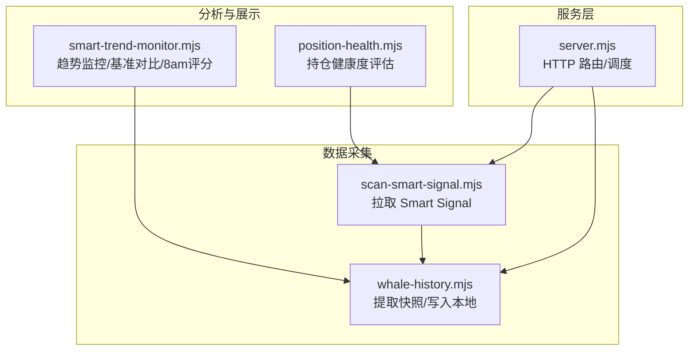
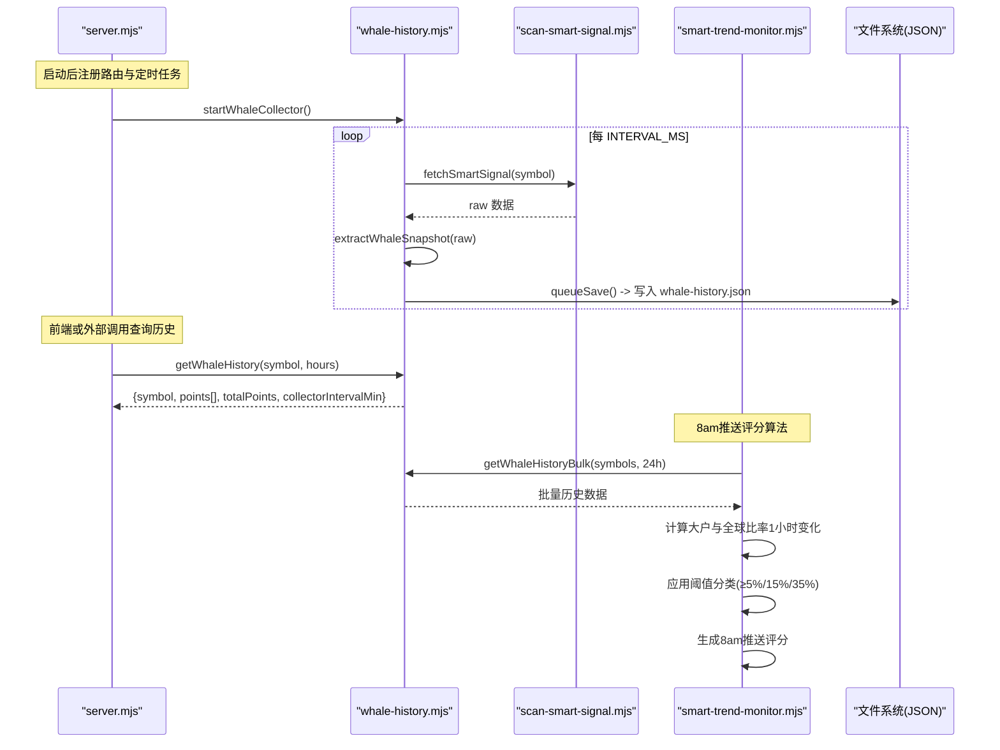
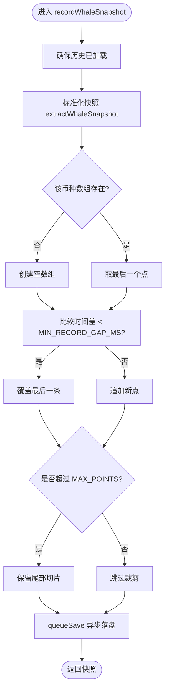
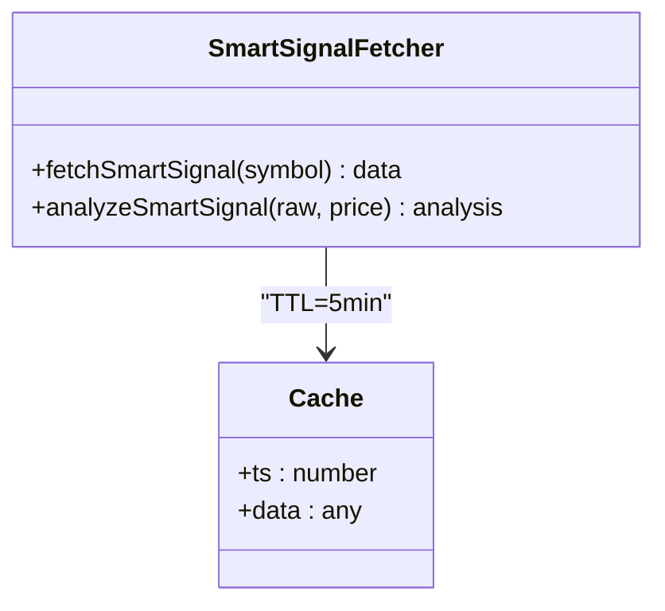
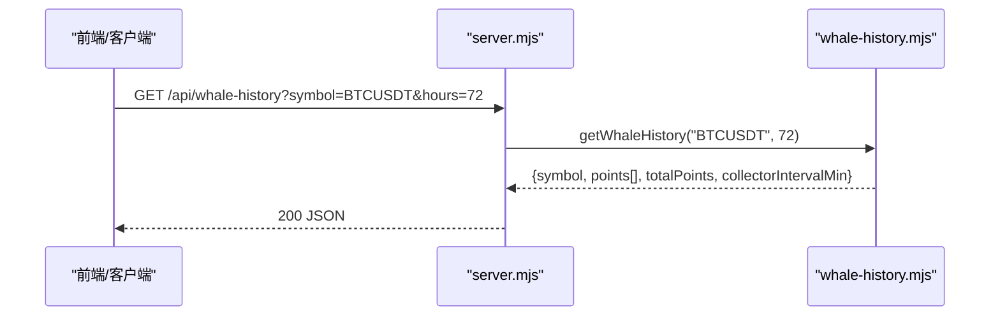
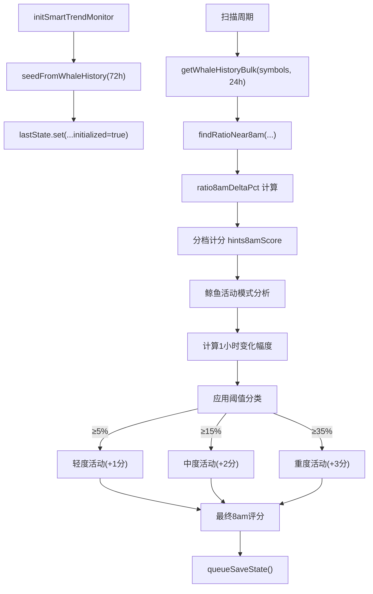
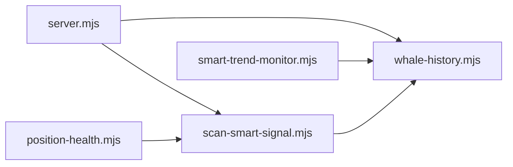

# 鲸鱼历史追踪

<cite>
**本文引用的文件**   
- [whale-history.mjs](file://whale-history.mjs)
- [scan-smart-signal.mjs](file://scan-smart-signal.mjs)
- [server.mjs](file://server.mjs)
- [smart-trend-monitor.mjs](file://smart-trend-monitor.mjs)
- [user-positions.mjs](file://user-positions.mjs)
- [position-health.mjs](file://position-health.mjs)
- [README.md](file://README.md)
- [package.json](file://package.json)
</cite>

## 更新摘要
**变更内容**   
- 更新了8am推送评分算法，集成了大户与全球比率1小时变化的阈值分类系统（≥5%/15%/35%）
- 增强了趋势监控模块中的鲸鱼活动模式识别能力
- 改进了交易推荐系统中的评分机制，使其能够考虑鲸鱼活动模式

## 目录
1. [简介](#简介)
2. [项目结构](#项目结构)
3. [核心组件](#核心组件)
4. [架构总览](#架构总览)
5. [详细组件分析](#详细组件分析)
6. [依赖关系分析](#依赖关系分析)
7. [性能与优化](#性能与优化)
8. [故障排查指南](#故障排查指南)
9. [结论](#结论)
10. [附录：数据模型与接口](#附录数据模型与接口)

## 简介
本文件面向"鲸鱼历史追踪"子系统，系统性说明大户行为记录机制、历史数据存储与查询、清洗去重聚合流程、以及与服务端和趋势监控的集成方式。内容覆盖：
- 大额交易捕获与持仓变化跟踪（基于币安 Smart Signal）
- 地址关联分析（通过大户/盈利大户数量与平均入场价等指标体现）
- 历史数据的存储结构与查询接口
- 数据清洗、去重与聚合处理流程
- 鲸鱼行为模式识别与市场影响分析案例
- 数据持久化策略、缓存机制与性能优化方案
- **新增**：8am推送评分算法中的鲸鱼活动模式识别与阈值分类系统

## 项目结构
围绕鲸鱼历史追踪的关键模块与职责如下：
- whale-history.mjs：采集、存储、查询与定时任务
- scan-smart-signal.mjs：Smart Signal 数据获取与分析
- server.mjs：HTTP 服务与 API 路由，启动采集器并暴露查询接口
- smart-trend-monitor.mjs：聪明钱趋势监控，复用历史数据进行基准对比，**新增**8am评分算法
- user-positions.mjs / position-health.mjs：用户持仓与健康度评估（与鲸鱼信号联动）
- README.md / package.json：运行方式与环境配置

**图表来源**
- [whale-history.mjs:1-141](file://whale-history.mjs#L1-L141)
- [scan-smart-signal.mjs:1-238](file://scan-smart-signal.mjs#L1-L238)
- [server.mjs:1800-1816](file://server.mjs#L1800-L1816)
- [smart-trend-monitor.mjs:139-170](file://smart-trend-monitor.mjs#L139-L170)
- [position-health.mjs:135-152](file://position-health.mjs#L135-L152)

**章节来源**
- [README.md:1-210](file://README.md#L1-L210)
- [package.json:1-22](file://package.json#L1-L22)

## 核心组件
- 数据采集与缓存
  - fetchSmartSignal：从币安 Smart Signal 接口拉取原始数据，带限流熔断与请求队列
  - analyzeSmartSignal：将原始数据解析为方向、评分、信号明细等结构化结果
- 历史快照与持久化
  - extractWhaleSnapshot：抽取时间戳、多空比、大户量、盈利大户数、均价等字段
  - recordWhaleSnapshot：去重合并、上限裁剪、异步落盘
  - getWhaleHistory/getWhaleHistoryBulk：按小时窗口过滤返回
- 定时采集器
  - startWhaleCollector：按间隔轮询活跃币种，调用 Smart Signal 并写入历史
- 服务端集成
  - /api/whale-history：提供历史查询
  - 启动时注入依赖，供趋势监控使用
- 趋势监控联动
  - 初始化时从历史中回填初始状态，计算 8am 基准与日内变化分档
  - **新增**：8am推送评分算法，集成大户与全球比率1小时变化的阈值分类系统

**章节来源**
- [scan-smart-signal.mjs:76-84](file://scan-smart-signal.mjs#L76-L84)
- [scan-smart-signal.mjs:86-167](file://scan-smart-signal.mjs#L86-L167)
- [whale-history.mjs:47-90](file://whale-history.mjs#L47-L90)
- [whale-history.mjs:92-119](file://whale-history.mjs#L92-L119)
- [whale-history.mjs:121-141](file://whale-history.mjs#L121-L141)
- [server.mjs:1803-1816](file://server.mjs#L1803-L1816)
- [server.mjs:2106-2115](file://server.mjs#L2106-L2115)
- [smart-trend-monitor.mjs:139-170](file://smart-trend-monitor.mjs#L139-L170)

## 架构总览
系统采用"采集-存储-查询-分析"的分层架构：
- 采集层：定时任务驱动，周期性拉取 Smart Signal，生成标准化快照
- 存储层：内存 Map + JSON 文件持久化，支持批量读取与时间窗口过滤
- 服务层：HTTP 路由暴露查询接口，统一错误处理与跨域响应头
- 分析层：趋势监控与持仓健康评估复用历史与实时信号，进行基准对比与决策辅助，**新增**8am推送评分算法

**图表来源**
- [server.mjs:2106-2115](file://server.mjs#L2106-L2115)
- [whale-history.mjs:121-141](file://whale-history.mjs#L121-L141)
- [whale-history.mjs:47-90](file://whale-history.mjs#L47-L90)
- [whale-history.mjs:92-106](file://whale-history.mjs#L92-L106)
- [scan-smart-signal.mjs:76-84](file://scan-smart-signal.mjs#L76-L84)
- [smart-trend-monitor.mjs:259-277](file://smart-trend-monitor.mjs#L259-L277)

## 详细组件分析

### 组件A：鲸鱼历史采集与存储（whale-history.mjs）
- 关键能力
  - 首次加载与懒加载：ensureHistoryLoaded 保证只读一次磁盘
  - 快照抽取：extractWhaleSnapshot 标准化字段，含价格、多空比、大户量、盈利大户、均价等
  - 去重与合并：recordWhaleSnapshot 在 MIN_RECORD_GAP_MS 内对最新点覆盖，避免重复采样
  - 容量控制：超过 MAX_POINTS 保留尾部切片
  - 异步落盘：queueSave 串行写入，降低并发写冲突
  - 定时采集：startWhaleCollector 轮询 activeSymbols，失败不中断整体循环
  - 查询接口：getWhaleHistory/getWhaleHistoryBulk 支持按小时窗口过滤
- 复杂度与性能
  - 单次写入 O(1)，批量查询 O(N)（N 为某币种点数），内存常驻 Map
  - 磁盘 I/O 通过 Promise 队列串行化，避免频繁写盘
- 错误处理
  - 读取失败回退空对象；写入异常吞掉避免阻塞
  - 采集失败打印警告但不中断其他币种

**图表来源**
- [whale-history.mjs:70-90](file://whale-history.mjs#L70-90)
- [whale-history.mjs:47-64](file://whale-history.mjs#L47-64)

**章节来源**
- [whale-history.mjs:24-45](file://whale-history.mjs#L24-45)
- [whale-history.mjs:47-90](file://whale-history.mjs#L47-90)
- [whale-history.mjs:92-119](file://whale-history.mjs#L92-119)
- [whale-history.mjs:121-141](file://whale-history.mjs#L121-141)

### 组件B：Smart Signal 获取与分析（scan-smart-signal.mjs）
- 关键能力
  - 限流与熔断：throttleFetch 维护最小间隔与熔断窗口，遇 418/429/403 自动熔断
  - 降级策略：主路径失败则走 curl 子进程重试
  - 缓存：Map 缓存最近 5 分钟结果，减少重复请求
  - 分析：analyzeSmartSignal 输出方向、评分、信号明细、盈亏大户对比、均价偏离等
- 复杂度与性能
  - 请求级节流与队列串行，避免瞬时风暴
  - 内存缓存 TTL 短，兼顾时效与稳定性
- 错误处理
  - 熔断抛出明确错误信息，上层可据此告警或退避
  - 非 2xx 直接抛错，curl 降级作为兜底

**图表来源**
- [scan-smart-signal.mjs:76-84](file://scan-smart-signal.mjs#L76-84)
- [scan-smart-signal.mjs:86-167](file://scan-smart-signal.mjs#L86-167)

**章节来源**
- [scan-smart-signal.mjs:1-238](file://scan-smart-signal.mjs#L1-238)

### 组件C：服务端集成与API（server.mjs）
- 关键能力
  - 路由 /api/whale-history：接收 symbol 与 hours，返回历史点集与元信息
  - 启动时注入 whale-history 的导出函数给趋势监控模块
  - 启动定时采集器 startWhaleCollector
- 错误处理
  - 统一 200/500 响应体格式，携带 Access-Control-Allow-Origin
- 扩展性
  - 通过 deps 注入，便于测试与替换实现

**图表来源**
- [server.mjs:1803-1816](file://server.mjs#L1803-1816)
- [whale-history.mjs:92-106](file://whale-history.mjs#L92-106)

**章节来源**
- [server.mjs:1803-1816](file://server.mjs#L1803-1816)
- [server.mjs:2106-2115](file://server.mjs#L2106-2115)

### 组件D：趋势监控与基准对比（smart-trend-monitor.mjs）
- 关键能力
  - 初始化时从历史中回填 lastState，构造 ratio8am 基准
  - 结合 getWhaleHistoryBulk 批量获取多币种历史，计算 8am 以来变化百分比
  - 分档计分（≥5%/≥15%/≥35%）累计当日提示分数
  - **新增**：8am推送评分算法，集成大户与全球比率1小时变化的阈值分类系统
- 与鲸鱼历史的耦合
  - 通过 registerActiveSymbol 将关注币种加入采集池
  - 使用 getWhaleHistory/getWhaleHistoryBulk 做基线对齐与增量统计
- **新增功能**：鲸鱼活动模式识别
  - 计算大户与全球比率的1小时变化幅度
  - 应用三级阈值分类：≥5%（轻度）、≥15%（中度）、≥35%（重度）
  - 根据分类结果调整8am推送评分权重

**图表来源**
- [smart-trend-monitor.mjs:139-170](file://smart-trend-monitor.mjs#L139-170)
- [smart-trend-monitor.mjs:259-277](file://smart-trend-monitor.mjs#L259-277)
- [smart-trend-monitor.mjs:293-318](file://smart-trend-monitor.mjs#L293-318)

**章节来源**
- [smart-trend-monitor.mjs:139-170](file://smart-trend-monitor.mjs#L139-170)
- [smart-trend-monitor.mjs:259-277](file://smart-trend-monitor.mjs#L259-277)
- [smart-trend-monitor.mjs:293-318](file://smart-trend-monitor.mjs#L293-318)

### 组件E：用户持仓与健康度（user-positions.mjs / position-health.mjs）
- 用户持仓
  - 增删查接口，JSON 持久化，UUID 标识
- 健康度评估
  - 综合右侧稳趋势、做空信号、暴跌风险、聪明钱方向一致性、浮盈浮亏等维度打分
  - 输出建议动作：继续持有/收紧止损/考虑止盈/建议止损

**章节来源**
- [user-positions.mjs:30-64](file://user-positions.mjs#L30-64)
- [position-health.mjs:56-195](file://position-health.mjs#L56-195)

## 依赖关系分析
- 模块耦合
  - whale-history.mjs 依赖 scan-smart-signal.mjs 获取原始数据
  - server.mjs 依赖 whale-history.mjs 暴露查询与启动采集
  - smart-trend-monitor.mjs 依赖 whale-history.mjs 的历史与批量查询，**新增**8am评分算法依赖
  - position-health.mjs 依赖 scan-smart-signal.mjs 进行方向一致性校验
- 外部依赖
  - 币安合约 REST API（fapi.binance.com）
  - 可选：CoinMarketCap Pro API（市值过滤）
  - 飞书 Webhook（推送，与本模块间接相关）

**图表来源**
- [whale-history.mjs:1-4](file://whale-history.mjs#L1-4)
- [server.mjs:1803-1816](file://server.mjs#L1803-1816)
- [smart-trend-monitor.mjs:139-170](file://smart-trend-monitor.mjs#L139-170)
- [position-health.mjs:135-152](file://position-health.mjs#L135-152)

**章节来源**
- [whale-history.mjs:1-4](file://whale-history.mjs#L1-4)
- [server.mjs:1803-1816](file://server.mjs#L1803-1816)
- [smart-trend-monitor.mjs:139-170](file://smart-trend-monitor.mjs#L139-170)
- [position-health.mjs:135-152](file://position-health.mjs#L135-152)

## 性能与优化
- 采集频率与去重
  - INTERVAL_MS 控制轮询间隔（默认 5 分钟）
  - MIN_RECORD_GAP_MS 控制同币种高频覆盖，避免冗余点
- 存储与I/O
  - 内存 Map 常驻，查询无 IO 开销
  - 异步队列串行落盘，避免并发写导致损坏
- 缓存与限流
  - Smart Signal 结果 5 分钟缓存
  - 请求级节流与熔断，防止被限流封禁
- 容量控制
  - MAX_POINTS 限制单币种历史长度，避免内存膨胀
- 批量化
  - getWhaleHistoryBulk 批量返回，减少多次往返
- **新增优化**：8am评分算法性能
  - 阈值分类计算采用O(1)时间复杂度
  - 批量处理多币种历史数据，减少数据库查询次数
  - 智能缓存近期评分结果，避免重复计算
- 建议
  - 根据业务需要调整 INTERVAL_MS、MAX_POINTS、MIN_RECORD_GAP_MS
  - 热点币种可通过 registerActiveSymbol 提前加入采集池
  - 若需更高吞吐，可将 JSON 落盘替换为轻量数据库（如 SQLite）
  - 调整8am评分阈值参数以适配不同市场环境的活跃度

## 故障排查指南
- 常见问题
  - 采集失败：检查网络代理、Smart Signal 限流熔断日志
  - 历史为空：确认服务已启动采集器且至少访问过目标币种（registerActiveSymbol）
  - 查询超时：增大 hours 参数或检查 MAX_POINTS 是否过小
  - **新增**：8am评分异常：检查大户与全球比率数据完整性，验证阈值分类逻辑
- 定位方法
  - 查看控制台警告日志（采集失败会打印币种与错误信息）
  - 检查 data/whale-history.json 是否存在与可读
  - 使用 /api/whale-history 单独验证单币种数据
  - **新增**：检查smart-trend-monitor日志中的鲸鱼活动模式分析结果

**章节来源**
- [whale-history.mjs:121-141](file://whale-history.mjs#L121-141)
- [server.mjs:1803-1816](file://server.mjs#L1803-1816)

## 结论
鲸鱼历史追踪子系统以 Smart Signal 为核心数据源，通过"采集-存储-查询-分析"的清晰分层，实现了稳定可靠的大户行为历史记录与可视化支撑。其去重合并、容量控制、异步落盘与限流熔断等机制，保证了在高并发与不稳定网络环境下的可用性。**新增的8am推送评分算法进一步增强了系统对市场动态的响应能力，通过阈值分类系统有效识别鲸鱼活动模式，为交易决策提供更精准的参考依据**。配合趋势监控与持仓健康评估，可为市场影响分析与交易决策提供有力依据。

## 附录：数据模型与接口

### 数据模型：鲸鱼历史快照
- 字段说明
  - ts：采样时间戳（毫秒）
  - longShortRatio：净多空比
  - longWhalesQty/shortWhalesQty：多头/空头大户量
  - whaleRatio：大户多空比（由大户量计算）
  - longProfitWhales/shortProfitWhales：盈利多头/空头大户数
  - longTraders/shortTraders：多头/空头交易者数
  - longWhalesAvgEntryPrice/shortWhalesAvgEntryPrice：大户平均入场价
  - price：可选价格（用于偏离度分析）

**章节来源**
- [whale-history.mjs:47-64](file://whale-history.mjs#L47-64)

### 查询接口：/api/whale-history
- 方法：GET
- 参数
  - symbol：必填，示例 BTCUSDT
  - hours：可选，默认 72
- 成功响应
  - symbol：币种
  - points：时间序列点数组
  - totalPoints：总点数
  - collectorIntervalMin：采集间隔（分钟）
- 错误响应
  - error：错误信息

**章节来源**
- [server.mjs:1803-1816](file://server.mjs#L1803-1816)
- [whale-history.mjs:92-106](file://whale-history.mjs#L92-106)

### 环境变量与配置
- WHALE_HISTORY_INTERVAL_MIN：采集间隔（分钟）
- WHALE_HISTORY_MAX_POINTS：单币种最大历史点数
- WHALE_HISTORY_MIN_GAP_MIN：同币种最小记录间隔（分钟）
- WHALE_HISTORY_SYMBOLS：默认采集币种列表（逗号分隔）
- **新增**：THRESHOLD_MILD_PERCENT：轻度活动阈值（默认5%）
- **新增**：THRESHOLD_MODERATE_PERCENT：中度活动阈值（默认15%）
- **新增**：THRESHOLD_SEVERE_PERCENT：重度活动阈值（默认35%）

**章节来源**
- [whale-history.mjs:10-16](file://whale-history.mjs#L10-16)

### 运行与启动
- 启动服务后会自动启动鲸鱼历史采集器
- 访问任意币种页面或调用 /api/whale-history 会将该币种加入采集池
- **新增**：8am推送评分算法在趋势监控模块启动时自动初始化

**章节来源**
- [server.mjs:2106-2115](file://server.mjs#L2106-2115)
- [README.md:95-121](file://README.md#L95-L121)
- [package.json:9-18](file://package.json#L9-18)