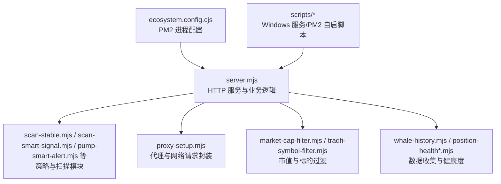
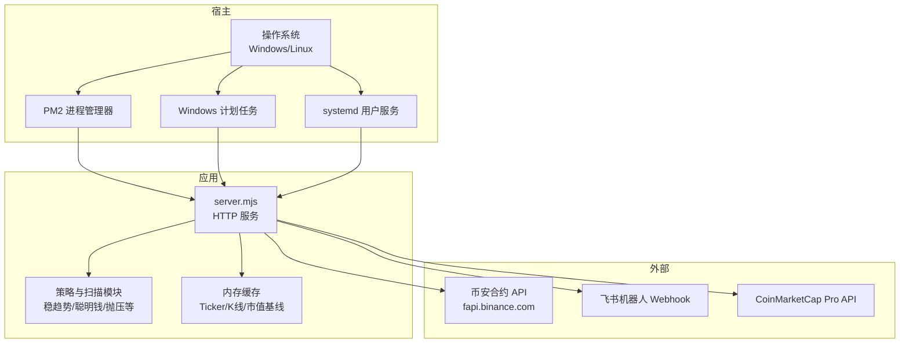
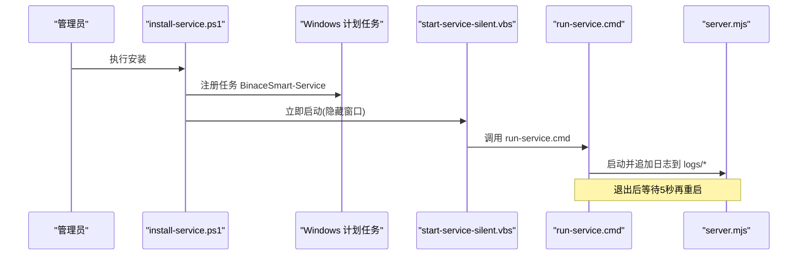
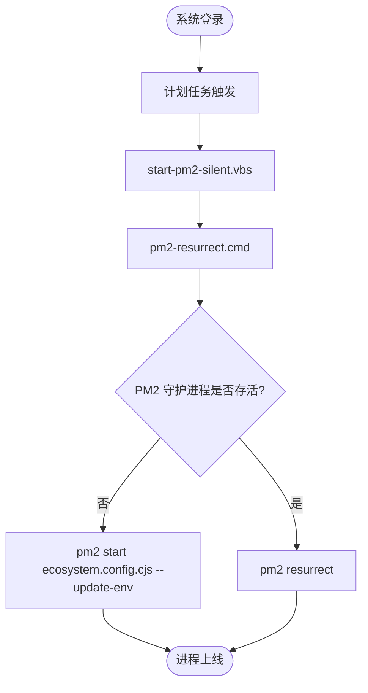
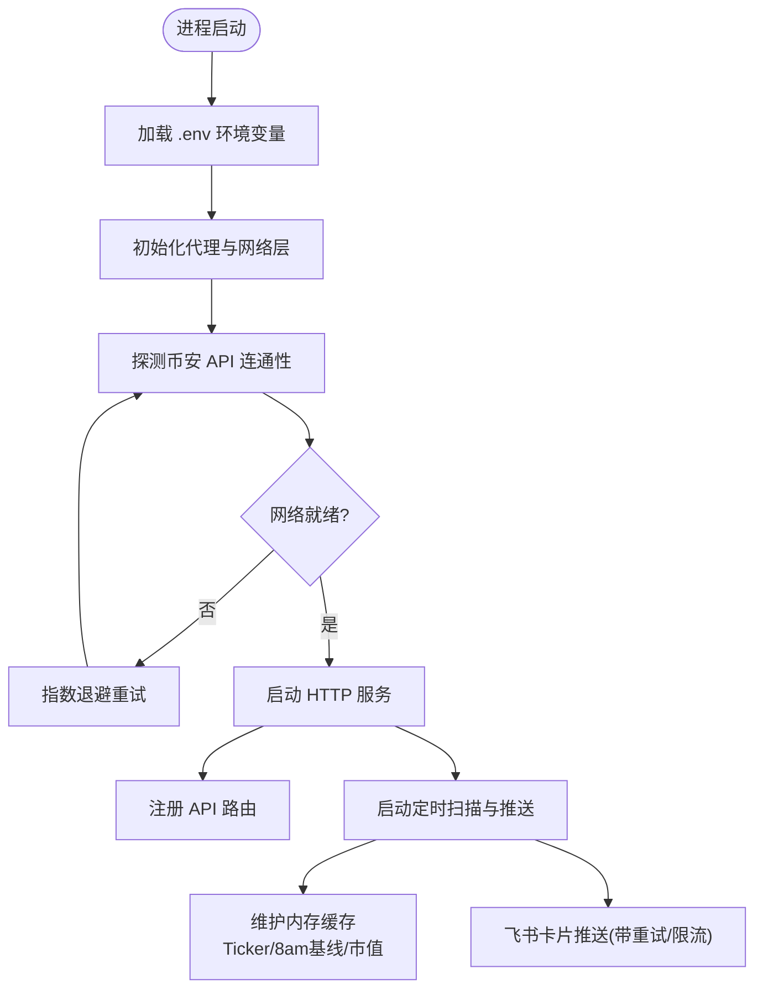
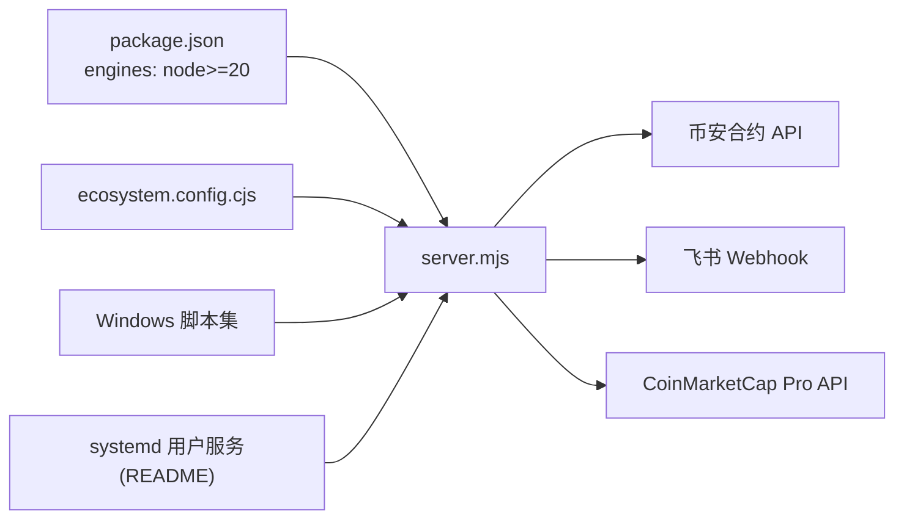

# 部署运维

<cite>
**本文引用的文件**   
- [README.md](file://README.md)
- [package.json](file://package.json)
- [ecosystem.config.cjs](file://ecosystem.config.cjs)
- [scripts/install-service.ps1](file://scripts/install-service.ps1)
- [scripts/stop-service.ps1](file://scripts/stop-service.ps1)
- [scripts/run-service.cmd](file://scripts/run-service.cmd)
- [scripts/start-pm2-silent.vbs](file://scripts/start-pm2-silent.vbs)
- [scripts/pm2-resurrect.cmd](file://scripts/pm2-resurrect.cmd)
- [scripts/install-pm2-task.ps1](file://scripts/install-pm2-task.ps1)
- [scripts/uninstall-pm2-task.ps1](file://scripts/uninstall-pm2-task.ps1)
- [server.mjs](file://server.mjs)
</cite>

## 目录
1. [简介](#简介)
2. [项目结构](#项目结构)
3. [核心组件](#核心组件)
4. [架构总览](#架构总览)
5. [详细组件分析](#详细组件分析)
6. [依赖关系分析](#依赖关系分析)
7. [性能与容量规划](#性能与容量规划)
8. [日志管理](#日志管理)
9. [监控与告警](#监控与告警)
10. [备份与恢复](#备份与恢复)
11. [服务启停脚本说明](#服务启停脚本说明)
12. [故障排除指南](#故障排除指南)
13. [自动化部署与CI/CD最佳实践](#自动化部署与cicd最佳实践)
14. [结论](#结论)

## 简介
本运维文档面向生产环境，覆盖 Windows 服务安装、PM2 进程管理、systemd 用户服务配置等主流部署方式；并提供日志管理、监控告警、备份恢复、性能监控、启停脚本使用、故障排除与 CI/CD 集成建议。项目基于 Node.js 原生 HTTP 服务器，提供 Web 面板与终端工具，支持飞书推送、市值过滤、多策略扫描与定时任务。

## 项目结构
仓库包含服务端主程序、Windows 服务与 PM2 启动脚本、系统服务（systemd）使用说明以及若干辅助脚本。关键路径：
- 应用入口与业务逻辑：server.mjs
- PM2 通用配置：ecosystem.config.cjs
- Windows 服务与自启脚本：scripts/*.ps1, scripts/*.cmd, scripts/*.vbs
- 运行说明与环境变量：README.md、package.json

图表来源
- [server.mjs:1-28](file://server.mjs#L1-L28)
- [ecosystem.config.cjs:1-33](file://ecosystem.config.cjs#L1-L33)

章节来源
- [README.md:1-210](file://README.md#L1-L210)
- [package.json:1-22](file://package.json#L1-L22)

## 核心组件
- 应用入口 server.mjs：加载 .env、初始化代理、注册路由、执行定时扫描与推送、缓存与并发控制、错误处理与重试。
- PM2 配置 ecosystem.config.cjs：定义进程名、启动参数、重启策略、日志输出路径、环境变量等。
- Windows 服务脚本：通过计划任务 + VBS 静默启动，避免控制台闪烁；run-service.cmd 实现崩溃自动重启。
- systemd 用户服务：README 中提供了常用 systemctl/journalctl 命令与服务配置文件位置。

章节来源
- [server.mjs:31-48](file://server.mjs#L31-L48)
- [ecosystem.config.cjs:1-33](file://ecosystem.config.cjs#L1-L33)
- [README.md:161-188](file://README.md#L161-L188)

## 架构总览
下图展示生产环境典型部署形态：Node 进程由 PM2 或 Windows 计划任务托管，对外暴露 HTTP 端口，调用币安合约 API，并通过飞书 Webhook 推送告警。

图表来源
- [ecosystem.config.cjs:1-33](file://ecosystem.config.cjs#L1-L33)
- [scripts/install-service.ps1:1-42](file://scripts/install-service.ps1#L1-L42)
- [scripts/install-pm2-task.ps1:1-23](file://scripts/install-pm2-task.ps1#L1-L23)
- [README.md:161-188](file://README.md#L161-L188)

## 详细组件分析

### Windows 服务安装与运行
- 安装服务：通过 PowerShell 脚本将应用注册为“登录时”的计划任务，并立即以隐藏窗口启动。
- 停止服务：删除计划任务、释放占用端口、终止相关 node.exe 进程。
- 静默启动：VBS 调用 CMD 执行 run-service.cmd，后者循环拉起 server.mjs 并将标准输出与错误输出追加到 logs 目录。

图表来源
- [scripts/install-service.ps1:1-42](file://scripts/install-service.ps1#L1-L42)
- [scripts/start-service-silent.vbs:1-4](file://scripts/start-service-silent.vbs#L1-L4)
- [scripts/run-service.cmd:1-10](file://scripts/run-service.cmd#L1-L10)

章节来源
- [scripts/install-service.ps1:1-42](file://scripts/install-service.ps1#L1-L42)
- [scripts/stop-service.ps1:1-19](file://scripts/stop-service.ps1#L1-L19)
- [scripts/run-service.cmd:1-10](file://scripts/run-service.cmd#L1-L10)
- [scripts/start-pm2-silent.vbs:1-5](file://scripts/start-pm2-silent.vbs#L1-L5)

### PM2 进程管理
- 通用配置：ecosystem.config.cjs 定义了进程名、启动脚本、实例数、重启策略、日志路径、时间戳格式、最大内存重启阈值等。
- 开机自启：Windows 下通过计划任务 + VBS 静默启动 PM2，首次启动失败则 start，已存在则 resurrect。
- 卸载自启：移除计划任务并调用 pm2-startup uninstall。

图表来源
- [scripts/install-pm2-task.ps1:1-23](file://scripts/install-pm2-task.ps1#L1-L23)
- [scripts/start-pm2-silent.vbs:1-5](file://scripts/start-pm2-silent.vbs#L1-L5)
- [scripts/pm2-resurrect.cmd:1-13](file://scripts/pm2-resurrect.cmd#L1-L13)
- [ecosystem.config.cjs:1-33](file://ecosystem.config.cjs#L1-L33)

章节来源
- [ecosystem.config.cjs:1-33](file://ecosystem.config.cjs#L1-L33)
- [scripts/pm2-resurrect.cmd:1-13](file://scripts/pm2-resurrect.cmd#L1-L13)
- [scripts/install-pm2-task.ps1:1-23](file://scripts/install-pm2-task.ps1#L1-L23)
- [scripts/uninstall-pm2-task.ps1:1-8](file://scripts/uninstall-pm2-task.ps1#L1-L8)

### systemd 用户服务（Linux）
- README 提供了查看状态、重启、停止、查看日志、启用/禁用开机自启的命令，服务配置文件位于用户目录下的 systemd user 路径。
- 注意：该部分为 README 中的操作指引，具体 service 文件不在仓库内。

章节来源
- [README.md:161-188](file://README.md#L161-L188)

### 应用内部流程与关键逻辑
- 环境变量加载：启动时读取 .env，设置 PORT、FEISHU_WEBHOOK、CMC_API_KEY、MAX_MARKET_CAP_USD 等。
- 网络就绪检测：启动阶段探测币安 API 可用性，指数退避重试。
- 缓存与并发：ticker/24hr 短 TTL 缓存 + 并发去重；8am 基准价缓存；批量市值查询。
- 推送与告警：稳趋势、聪明钱、抛压、做多/做空信号等策略，统一走飞书卡片发送，内置限流重试。
- 过滤规则：TradFi 股票标的过滤、市值上限过滤。

图表来源
- [server.mjs:31-48](file://server.mjs#L31-L48)
- [server.mjs:107-125](file://server.mjs#L107-L125)
- [server.mjs:84-105](file://server.mjs#L84-L105)
- [server.mjs:599-644](file://server.mjs#L599-L644)

章节来源
- [server.mjs:31-48](file://server.mjs#L31-L48)
- [server.mjs:107-125](file://server.mjs#L107-L125)
- [server.mjs:84-105](file://server.mjs#L84-L105)
- [server.mjs:599-644](file://server.mjs#L599-L644)

## 依赖关系分析
- 运行时依赖：Node.js >= 20（见 engines）。
- 第三方依赖：PM2（可选，用于进程管理与自启），Windows 计划任务/VBS/CMD（Windows 托管方案）。
- 外部依赖：币安合约 REST API、飞书 Webhook、CoinMarketCap Pro API（可选）。

图表来源
- [package.json:1-22](file://package.json#L1-L22)
- [ecosystem.config.cjs:1-33](file://ecosystem.config.cjs#L1-L33)
- [README.md:161-188](file://README.md#L161-L188)

章节来源
- [package.json:1-22](file://package.json#L1-L22)
- [ecosystem.config.cjs:1-33](file://ecosystem.config.cjs#L1-L33)
- [README.md:161-188](file://README.md#L161-L188)

## 性能与容量规划
- 并发与缓存
  - ticker/24hr 采用短 TTL 缓存与并发去重，降低重复请求压力。
  - 8am 基准价按日缓存，减少历史 K 线查询。
  - 批量市值查询合并请求，降低外部 API 压力。
- 资源限制
  - PM2 配置 max_memory_restart 防止内存泄漏导致无限重启。
  - 合理设置 STABLE_SCAN_LIMIT、LONG_SCAN_LIMIT、DUMP_SCAN_LIMIT 等扫描规模。
- 网络与超时
  - 全局 fetch 超时与重试机制，避免雪崩。
  - 飞书推送内置限流识别与退避重试。
- 建议
  - 在云主机上开启本地磁盘日志轮转（如 logrotate），避免 logs 目录膨胀。
  - 根据 CPU/内存调整并发度与扫描数量，观察 GC 与响应延迟。

章节来源
- [server.mjs:84-105](file://server.mjs#L84-L105)
- [server.mjs:164-184](file://server.mjs#L164-L184)
- [ecosystem.config.cjs:1-33](file://ecosystem.config.cjs#L1-L33)
- [server.mjs:599-644](file://server.mjs#L599-L644)

## 日志管理
- Windows 服务日志
  - 输出路径：logs/service-out.log、logs/service-error.log（由 run-service.cmd 追加写入）。
  - 查看最近日志：可使用 package.json 提供的 service:logs 脚本。
- PM2 日志
  - 输出路径：logs/pm2-out.log、logs/pm2-error.log（由 ecosystem.config.cjs 指定）。
  - 可通过 PM2 CLI 查看与管理。
- systemd 日志
  - 使用 journalctl --user -u binance-monitor 查看实时/历史日志。

章节来源
- [scripts/run-service.cmd:1-10](file://scripts/run-service.cmd#L1-L10)
- [package.json:13-16](file://package.json#L13-L16)
- [ecosystem.config.cjs:22-26](file://ecosystem.config.cjs#L22-L26)
- [README.md:175-186](file://README.md#L175-L186)

## 监控与告警
- 内置告警
  - 价格突破/跌破、RSI 超买超卖、大户翻多/空、买卖激增等条件触发。
  - 右侧稳趋势扫描结果推送到飞书，含评分、回撤、连续推荐次数等。
- 手动触发
  - 通过 POST /api/trigger-stable-push 手动触发一次稳趋势推送。
- 飞书卡片
  - 统一通过 sendFeishuCardV2 发送，具备频率/限流识别与重试。

章节来源
- [README.md:123-159](file://README.md#L123-L159)
- [server.mjs:599-644](file://server.mjs#L599-L644)

## 备份与恢复
- 需要备份的内容
  - 应用代码与配置文件：server.mjs、ecosystem.config.cjs、.env、package.json。
  - 日志目录：logs/（便于问题回溯与审计）。
  - 用户数据（如有持久化）：data/ 目录（当前仓库示例数据）。
- 恢复步骤
  - 恢复代码与配置，确保 .env 正确。
  - 选择一种托管方式（PM2/Windows 服务/systemd）并启动。
  - 验证端口监听与 API 可用，检查日志无异常。

章节来源
- [README.md:1-210](file://README.md#L1-L210)
- [ecosystem.config.cjs:1-33](file://ecosystem.config.cjs#L1-L33)

## 服务启停脚本说明
- Windows 服务（非 PM2）
  - 安装：pnpm service:install（注册计划任务并立即启动）。
  - 停止：pnpm service:stop（删除任务、释放端口、终止进程）。
  - 查看日志：pnpm service:logs。
- PM2 自启（Windows）
  - 安装自启：scripts/install-pm2-task.ps1（登录时静默启动 PM2）。
  - 卸载自启：scripts/uninstall-pm2-task.ps1。
  - 启动/恢复：scripts/pm2-resurrect.cmd（首次 start，否则 resurrect）。
- systemd（Linux）
  - 参考 README 中 systemctl/journalctl 命令进行启停与日志查看。

章节来源
- [package.json:13-16](file://package.json#L13-L16)
- [scripts/install-service.ps1:1-42](file://scripts/install-service.ps1#L1-L42)
- [scripts/stop-service.ps1:1-19](file://scripts/stop-service.ps1#L1-L19)
- [scripts/install-pm2-task.ps1:1-23](file://scripts/install-pm2-task.ps1#L1-L23)
- [scripts/uninstall-pm2-task.ps1:1-8](file://scripts/uninstall-pm2-task.ps1#L1-L8)
- [scripts/pm2-resurrect.cmd:1-13](file://scripts/pm2-resurrect.cmd#L1-L13)
- [README.md:161-188](file://README.md#L161-L188)

## 故障排除指南
- 端口被占用
  - 现象：启动报 EADDRINUSE。
  - 处理：优先使用 dev:restart 清理旧进程；或在 PowerShell 中查找并强制结束占用端口的进程。
- 无法访问币安 API
  - 现象：启动阶段多次重试仍失败。
  - 处理：检查网络与代理配置，确认域名可达；必要时调整代理节点。
- 飞书推送失败
  - 现象：返回频控/限流错误。
  - 处理：确认 FEISHU_WEBHOOK 有效；应用内置限流识别与重试，若持续失败请降低推送频率或分批发送。
- 市值过滤导致无结果
  - 现象：列表为空或提示超出范围。
  - 处理：检查 MAX_MARKET_CAP_USD 配置；如需监控大盘币可设为 0 关闭过滤。
- Windows 服务未自启
  - 现象：登录后未启动。
  - 处理：检查计划任务是否存在且启用；确认 VBS 与 CMD 路径正确；查看 logs 目录是否有报错。

章节来源
- [README.md:40-53](file://README.md#L40-L53)
- [server.mjs:107-125](file://server.mjs#L107-L125)
- [server.mjs:599-644](file://server.mjs#L599-L644)
- [scripts/install-service.ps1:1-42](file://scripts/install-service.ps1#L1-L42)

## 自动化部署与CI/CD最佳实践
- 构建与准备
  - 固定 Node.js 版本（>=20），在 CI 中预装。
  - 拉取代码后安装依赖（如使用 PM2），生成必要目录 logs/。
- 配置注入
  - 通过 CI 密钥管理 .env 变量（PORT、FEISHU_WEBHOOK、CMC_API_KEY、MAX_MARKET_CAP_USD 等），禁止硬编码。
- 部署策略
  - Windows：在目标机安装 PM2 或 Windows 计划任务；CI 仅负责更新代码与重启服务。
  - Linux：使用 systemd 用户服务，CI 触发 systemctl --user restart。
- 健康检查
  - 部署后调用 /api/data?symbol=SLXUSDT 或 /api/klines 进行健康检查。
  - 结合 PM2 的 healthcheck 或外部探针（如 UptimeRobot）进行可用性监控。
- 回滚与灰度
  - 保留上一版本包，出现问题快速回滚。
  - 先对单台机器灰度，验证稳定后再全量发布。
- 安全加固
  - 最小权限原则运行服务进程。
  - 限制对外暴露端口，仅允许必要 IP 访问管理接口。

[本节为通用实践建议，不直接分析具体文件]

## 结论
本项目在生产环境可采用多种托管方式：Windows 计划任务+VBS 静默启动、PM2 进程管理、systemd 用户服务。配合完善的日志、监控与告警能力，可实现高可用的稳定运行。建议在 CI/CD 中固化部署流程，严格管理环境变量与密钥，并结合健康检查与灰度策略提升发布质量。